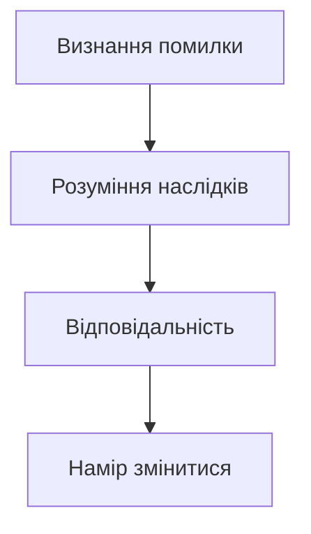

import Quiz from '@site/src/components/Quiz';
import MatchUp from '@site/src/components/MatchUp';
import FillIn from '@site/src/components/FillIn';
import TrueFalse from '@site/src/components/TrueFalse';
import Unjumble from '@site/src/components/Unjumble';
import GroupSort from '@site/src/components/GroupSort';
import Anagram from '@site/src/components/Anagram';
import ErrorCorrection, { ErrorCorrectionItem } from '@site/src/components/ErrorCorrection';
import Cloze from '@site/src/components/Cloze';
import Select from '@site/src/components/Select';
import Translate from '@site/src/components/Translate';
import MarkTheWords, { MarkTheWordsActivity } from '@site/src/components/MarkTheWords';
import HighlightMorphemes, { HighlightMorphemesActivity } from '@site/src/components/HighlightMorphemes';
import EssayResponse from '@site/src/components/EssayResponse';
import ComparativeStudy from '@site/src/components/ComparativeStudy';
import ReadingActivity from '@site/src/components/ReadingActivity';
import CriticalAnalysis from '@site/src/components/CriticalAnalysis';
import AuthorialIntent from '@site/src/components/AuthorialIntent';
import SourceEvaluation from '@site/src/components/SourceEvaluation';
import Debate from '@site/src/components/Debate';
import EtymologyTrace from '@site/src/components/EtymologyTrace';
import GrammarIdentify from '@site/src/components/GrammarIdentify';
import PaleographyAnalysis from '@site/src/components/PaleographyAnalysis';
import DialectComparison from '@site/src/components/DialectComparison';
import TranslationCritique from '@site/src/components/TranslationCritique';
import Transcription from '@site/src/components/Transcription';
import Observe from '@site/src/components/Observe';
import ActivityHelp from '@site/src/components/ActivityHelp';

:::warning[❗ **Чому це важливо?**]

Емоційний інтелект — це здатність розуміти свої та чужі емоції, керувати ними та будувати здорові стосунки. У професійному та особистому житті ця лексика допомагає вирішувати конфлікти, підтримувати інших та досягати порозуміння. Без цих слів важко говорити про почуття, вибачатися, хвалити чи критикувати — а це ключові навички дорослого спілкування.
:::

## Вступ — Що таке емоційний інтелект?

Прочитайте цей уривок з психологічної статті:

> Сучасні дослідження показують, що **емпатія** та **співчуття** є ключовими факторами успішних стосунків. Люди, які виявляють **терпіння** та **толерантність**, краще справляються з конфліктами. **Щирість** і **чесність** формують довіру, а **ввічливість** і **тактовність** допомагають уникати непорозумінь. Коли виникає конфлікт, важливо вміти просити **вибачення** та давати **пробачення**. Найкращі стосунки будуються на **взаєморозумінні** та готовності до **компромісу**.

Помітили виділені слова? Це — лексика **емоційного інтелекту**. Вона дозволяє говорити про почуття, стосунки та міжособистісну взаємодію на глибшому рівні.

У цьому модулі ви навчитеся використовувати 30 таких слів для обговорення емоцій, підтримки інших та вирішення конфліктів.

---

## Емпатія та співчуття — Чути серцем

Уявіть ситуацію: ваш друг втратив роботу. Що ви скажете? Просте «шкода» — це **співчуття**. А ось сісти поруч, вислухати, відчути його тривогу як свою власну — це вже **емпатія**. Різниця суттєва.

### Різниця між емпатією і співчуттям

**Співчуття** — це реакція на чужий біль. Ви бачите проблему зовні, жалієте людину, але залишаєтеся на відстані. Українською кажемо: «Мені шкода», «Співчуваю вашій втраті», «Прийміть мої співчуття».

**Емпатія** — це глибше. Ви ставите себе на місце іншої людини, відчуваєте те, що відчуває вона. Це вимагає **активного слухання** і готовності бути вразливим. Емпатія — це не слова, а присутність.

| Ситуація | Співчуття | Емпатія |
|----------|-----------|---------|
| Друг захворів | «Шкода, одужуй!» | «Я уявляю, як тобі важко. Чим можу допомогти?» |
| Колега помилився | «Ну, буває» | «Я розумію, як це засмучує. Давай подумаємо разом» |
| Родич у горі | «Співчуваю» | Просто сидите поруч, тримаєте за руку |

### Як висловити підтримку українською

Українська мова має багатий арсенал фраз для вираження підтримки. Ось найприродніші:

**Для близьких:**
- Я поруч, що б не сталося.
- Можеш на мене розраховувати.
- Тобі не потрібно справлятися з цим наодинці.
- Я тут, коли захочеш поговорити.

**У формальних ситуаціях:**
- Я розумію, що ви переживаєте складний період.
- Якщо потрібна будь-яка допомога — звертайтеся.
- Наша команда вас підтримує.

:::tip[💡 **Важливо**]

Справжня підтримка — це не поради і не оцінки. Коли людина у скруті, їй часто потрібно просто бути почутою. Замість «Тобі треба...» спробуйте «Як ти себе почуваєш?»
:::

### Активне слухання як навичка

**Активне слухання** — це не просто мовчання, поки інший говорить. Це техніка, яка показує співрозмовнику: «Я тут, я чую, я розумію».

**Елементи активного слухання:**

1. **Зоровий контакт** — дивіться на людину, не на телефон
2. **Підтвердження** — кивайте, кажіть «так», «розумію», «мгм»
3. **Перефразування** — «Якщо я правильно зрозумів, ти кажеш, що...»
4. **Уточнення** — «Що ти маєш на увазі під...?»
5. **Емоційне відображення** — «Здається, ти засмучений через це»

:::note[🏺 **У реальному житті**]

Психологи з Києва та Львова активно популяризують техніки активного слухання. На тренінгах з комунікації вчать не перебивати, не давати порад одразу, не порівнювати («У мене теж таке було!»). Перший крок — просто слухати.
:::

---

## Конфлікти та примирення

Конфлікти — природна частина будь-яких стосунків. Питання не в тому, як їх уникнути, а в тому, як їх вирішити без руйнування довіри.

### Як вибачатися

Щире вибачення — це мистецтво. Недостатньо сказати «вибач» і продовжити як раніше. Ефективне вибачення має структуру:

1. **Визнання помилки** — «Я був неправий, коли...»
2. **Розуміння наслідків** — «Я розумію, що це тебе образило»
3. **Відповідальність** — «Це була моя помилка, не твоя»
4. **Намір змінитися** — «Я постараюся, щоб це не повторилося»

**Формальні вибачення:**
- Прошу вибачення за затримку.
- Дозвольте вибачитися за непорозуміння.
- Я беру на себе відповідальність за цю помилку.

**Неформальні вибачення:**
- Вибач мене, будь ласка.
- Шкода, що так вийшло.
- Я не мав так казати/робити.

### Як пробачати

**Пробачення** — це не те саме, що забування або виправдання. Це рішення відпустити образу заради власного спокою та відновлення стосунків.

Фрази для пробачення:
- Я тебе пробачаю.
- Давай забудемо і рухаймося далі.
- Це вже в минулому.
- Я не тримаю зла.

:::info[🕰️ **Культурний момент**]

В українській культурі традиція просити пробачення має глибоке коріння. На Прощену неділю (перед Великим постом) українці кажуть одне одному: «Прости мене, чим згрішив». Відповідь: «Бог простить, і я прощаю». Ця традиція нагадує про важливість примирення перед важливими періодами життя.
:::

### Фрази для вирішення конфліктів

Коли виникає конфлікт, важливо не ескалювати, а деескалювати. Ось корисні фрази:

**Замість звинувачень:**
- ❌ «Ти завжди...» → ✅ «Я відчуваю себе..., коли...»
- ❌ «Це твоя вина» → ✅ «Давай подумаємо, як вирішити ситуацію»
- ❌ «Ти мене не слухаєш!» → ✅ «Мені важливо, щоб мене почули»

**Для пошуку рішення:**
- Давайте знайдемо компроміс.
- Що ти пропонуєш?
- Можливо, ми обидва частково праві.
- Я готовий піти на поступки, якщо ти теж.

### Культура примирення в Україні

Українці традиційно цінують гармонію в родині та громаді. Вираз «худий мир краще доброї сварки» відображає ставлення до конфліктів. Водночас сучасні психологи наголошують: здоровий конфлікт з повагою до обох сторін — це нормально і навіть корисно для розвитку стосунків.

:::tip[💡 **Важливо**]

Примирення — це не капітуляція. Знайти компроміс означає, що обидві сторони поступаються чимось, але зберігають гідність і взаємоповагу.
:::

---

## Вживання

### Колокації: як поєднувати слова?

Лексика емоційного інтелекту вимагає правильних дієслів. Неправильні колокації звучать неприродно.

**Що робимо з почуттями?**

- **виявляти** емпатію / терпіння / розуміння ✅
- **проявляти** терпимість / тактовність ✅
- **показувати** емпатію ❌ (правильно: виявляти)
- **давати** терпіння ❌ (терпіння мають або втрачають)

**Що робимо з моральними якостями?**

- **цінувати** чесність / щирість / відвертість ✅
- **нести** відповідальність ✅
- **брати** відповідальність на себе ✅
- **дотримуватися** обіцянок ✅
- **виконувати** зобов'язання ✅

**Що робимо з підтримкою та критикою?**

- **надавати** підтримку ✅
- **давати** пораду / рекомендацію ✅
- **робити** зауваження ✅
- **сприймати** критику ✅
- **заслуговувати** на похвалу ✅

**Що робимо з конфліктами?**

- **просити** вибачення / пробачення ✅
- **досягати** примирення / порозуміння ✅
- **знайти** компроміс ✅
- **піти** на компроміс ✅

### Реєстр: формальне чи розмовне?

**Формальна мова (робота, офіційні ситуації):**

- Дозвольте **висловити співчуття** у зв'язку з вашою втратою.
- Прошу **вибачення** за затримку.
- Я **беру на себе відповідальність** за цю помилку.
- Маємо **виконати наші зобов'язання**.

**Розмовна мова (друзі, родина):**

- Мені так **шкода**, що це сталося.
- **Вибач**, я запізнився.
- Це **моя провина**.
- Я **обіцяю** виправитися.

> 💡 **Важливо**
>
> У формальних ситуаціях (на роботі, в офіційному листуванні) використовуйте "прошу вибачення", "висловити співчуття", "надати рекомендації". У неформальних стосунках природніше звучить "вибач", "шкода", "дай пораду".

### Діалогові моделі

Ось типові фрази для різних ситуацій:

**Висловлення розуміння:**

- Я **розумію, як ви себе почуваєте**.
- Мені знайоме це почуття.
- Я на вашому боці.

**Прохання вибачення:**

- **Дозвольте вибачитися за**... (формально)
- Прошу вибачення за мою помилку.
- Вибач мене, будь ласка. (неформально)

**Пропозиція компромісу:**

- **Давайте знайдемо компроміс**.
- Можливо, ми обидва можемо поступитися?
- Я готовий піти на компроміс, якщо ви теж.

**Вираження підтримки:**

- **Я ціную вашу підтримку**.
- Ви можете на мене розраховувати.
- Я поруч, якщо потрібна допомога.

---

## Читання

### Текст 1: Стаття з психології

**Тема:** Як розвивати емоційний інтелект?

> Емоційний інтелект — це не природжений талант, а навичка, яку можна розвивати. Перший крок — **емпатія**. Навчіться слухати інших без осуду, намагайтеся зрозуміти їхні почуття. Виявляйте **терпіння** — не всі готові одразу відкритися.
>
> Другий крок — **чесність** з собою та іншими. Визнавайте свої помилки, просіть **вибачення**, коли потрібно. Люди більше довіряють тим, хто бере на себе **відповідальність** за свої дії.
>
> Третій крок — **конструктивна критика**. Замість засуджувати, пропонуйте **рекомендації**. Замість нарікати, шукайте **компроміси**. **Порозуміння** досягається через діалог, а не через конфлікт.
>
> Нарешті, не забувайте про **підтримку** та **заохочення**. Іноді одне слово **похвали** може змінити чийсь день.

**Запитання для обговорення:**

1. Які три кроки до розвитку емоційного інтелекту описані в тексті?
2. Чому важливо просити вибачення?
3. Яка різниця між засудженням і конструктивною критикою?

### Текст 2: Ситуація на роботі

**Тема:** Конфлікт між колегами

> Марія і Петро працюють в одному відділі. Після того, як Марія отримала підвищення, Петро став холодним і відстороненим. Одного дня Марія вирішила поговорити з ним.
>
> — Петре, я помітила, що між нами щось змінилося. Я хочу **порозуміння** з тобою. Чи можемо поговорити?
>
> — Мені важко про це казати, але... я відчував, що **заслуговую** на ту посаду.
>
> — Я **розумію твої почуття**. Насправді я **ціную твою роботу** і хотіла б, щоб ми й надалі співпрацювали.
>
> — Мені потрібен час. Але дякую за **щирість**.
>
> — Якщо потрібна моя **підтримка** або **порада** — я поруч.
>
> Через тиждень Петро сам прийшов до Марії з **пропозицією** спільного проєкту. **Взаєморозуміння** було відновлено.

### Текст 3: Родинна ситуація

**Тема:** Примирення після сварки

> Батько і син посварилися через вибір університету. Минув місяць без розмов. Нарешті батько зателефонував.
>
> — Сину, я довго думав і зрозумів, що був неправий. **Прошу пробачення** за ті слова.
>
> — Тато, мені теж **шкода**. Я не мав кричати.
>
> — Я хочу тебе **підтримати**, навіть якщо не згоден з твоїм вибором. Твоє життя — твій вибір.
>
> — Дякую. Це багато для мене значить. Може, знайдемо **компроміс**? Я спробую цей університет рік, і потім обговоримо?
>
> — Добре. Мені потрібно більше **терпіння**. Я **ціную твою чесність**.
>
> **Примирення** відбулося. Іноді потрібен час, щоб знайти слова.

---

## Діалоги — Підтримка друга

### Діалог 1: Робоча нарада (формальний)

**Керівник:** Колеги, у нас є складна ситуація з клієнтом. Хтось допустив помилку в замовленні.

**Анна:** Я **беру на себе відповідальність**. Це була моя недбалість. **Прошу вибачення** перед командою.

**Керівник:** Дякую за **чесність**, Анно. Які ваші **рекомендації** щодо виправлення ситуації?

**Анна:** Я вже зв'язалася з клієнтом і **висловила співчуття**. Пропоную надати знижку як компенсацію.

**Керівник:** Добре. Це **конструктивний підхід**. Я **ціную** вашу **відповідальність**.

### Діалог 2: Між друзями (неформальний)

**Олег:** Слухай, я хотів **вибачитися** за вчора. Я був занадто різким.

**Микола:** Та ні, я теж перегнув палку. **Вибач** мені.

**Олег:** Давай просто забудемо? Ти для мене важливий друг.

**Микола:** Звісно. Твоя **підтримка** завжди мені допомагає. Дякую за **щирість**.

**Олег:** Друзі для того й є, правда? Якщо потрібна **порада** — завжди звертайся.

### Діалог 3: Психологічна консультація (напівформальний)

**Клієнт:** Мені важко **пробачити** батькам. Вони ніколи не **підтримували** мої мрії.

**Психолог:** Я **розумію ваші почуття**. Це нормально — потребувати часу для **пробачення**.

**Клієнт:** Як розвинути більше **терпіння** до них?

**Психолог:** Спробуйте **емпатію**. Подумайте, чому вони так поводилися. Можливо, вони теж потребували **підтримки**, якої не отримали.

**Клієнт:** Я ніколи так не думав. Можливо, їм потрібне моє **розуміння**, а не **критика**.

**Психолог:** Саме так. **Порозуміння** — це двосторонній процес.

### Діалог 4: Переговори (формальний)

**Представник А:** Ми не можемо прийняти ваші умови. Це занадто багато.

**Представник Б:** Я **розумію вашу позицію**. Можливо, ми можемо **знайти компроміс**?

**Представник А:** Що ви пропонуєте?

**Представник Б:** Давайте **піти на взаємні поступки**. Ми знизимо ціну, а ви збільшите обсяг замовлення.

**Представник А:** Це справедлива **пропозиція**. Мої **рекомендації** — погодитися.

**Представник Б:** Чудово! Я **ціную вашу відкритість** до діалогу. Сподіваюся на тривале **порозуміння**.

> 💡 **Зверніть увагу**
>
> У переговорах важливо виявляти **повагу** до іншої сторони, **слухати** її позицію і шукати **компроміс**. Слова "я розумію вашу позицію" та "давайте знайдемо компроміс" — ключові фрази для успішних переговорів.

---

## Зворотний зв'язок та саморефлексія

Здатність давати і приймати зворотний зв'язок — одна з найважливіших навичок емоційного інтелекту. Так само важлива **саморефлексія** — вміння чесно аналізувати власні дії та почуття.

### Як приймати зворотний зв'язок

Отримати критику — завжди непросто. Перша реакція — захищатися або заперечувати. Але конструктивний фідбек допомагає рости. Ось як сприймати його правильно:

**Правила прийняття зворотного зв'язку:**

1. **Вислухайте до кінця** — не перебивайте і не виправдовуйтеся одразу
2. **Подякуйте** — «Дякую, що сказали. Мені це важливо почути»
3. **Уточніть** — «Чи можете ви навести приклад?»
4. **Візьміть паузу** — «Дайте мені час обдумати ваші слова»
5. **Відокремте корисне від емоцій** — навіть у різкій критиці може бути раціональне зерно

**Фрази для прийняття фідбеку:**
- Дякую за чесність.
- Я ціную вашу відвертість.
- Ви маєте рацію, я над цим попрацюю.
- Це справедливе зауваження.

> 💡 **Важливо**
>
> Якщо критика здається несправедливою, ви маєте право не погодитися — але ввічливо. «Я розумію вашу точку зору, хоча бачу ситуацію інакше. Можемо обговорити детальніше?»

### Як давати зворотний зв'язок

Давати фідбек — теж мистецтво. Ціль — допомогти людині покращитися, а не принизити чи образити.

**Принцип «сендвіча»:** позитив → конструктив → позитив

- «Ти чудово впорався з презентацією. Можливо, варто додати більше цифр у наступну. Але загалом — дуже гарна робота!»

**Фрази для конструктивної критики:**
- У мене є невелике зауваження.
- Дозвольте поділитися спостереженням.
- Можливо, варто звернути увагу на...
- Я б запропонував...
- Це хороший початок, і можна додати ще...

### Слова для самоаналізу

**Саморефлексія** — це внутрішній діалог з собою. Вона допомагає зрозуміти власні почуття, мотиви та поведінку.

**Корисні запитання для саморефлексії:**
- Що я відчуваю зараз і чому?
- Як мої дії вплинули на інших?
- Що я міг зробити інакше?
- Чому я так відреагував?
- Чого я навчився з цієї ситуації?

**Лексика саморефлексії:**

| Слово | Приклад |
|-------|---------|
| **самоаналіз** | Після конфлікту я провів самоаналіз своєї поведінки. |
| **усвідомлення** | Прийшло усвідомлення, що я був несправедливий. |
| **самокритика** | Здорова самокритика допомагає рости. |
| **саморозвиток** | Емоційний інтелект — частина саморозвитку. |
| **самоконтроль** | Мені потрібно працювати над самоконтролем. |

> 🌍 **У реальному житті**
>
> Сучасні українці все частіше звертаються до психотерапевтів і коучів для роботи над собою. Поняття «саморефлексія», «усвідомленість», «емоційна зрілість» стали частиною повсякденного дискурсу. Книги про психологію та саморозвиток — серед бестселерів у книгарнях Києва та Львова.

---

> 🎬 **Культурний момент**
>
> В українській літературі тема емоційного інтелекту має глибоке коріння. Григорій **Сковорода** вчив про самопізнання та внутрішню гармонію — основу **порозуміння** з іншими. Тарас **Шевченко** у "Кобзарі" писав про **співчуття** до страждань народу та **прощення** кривд. **Леся** Українка у драмах досліджувала складні стосунки та потребу в **щирості**. Іван **Франко** закликав до **толерантності** та **взаєморозуміння** між людьми різних поглядів. Сучасні українські психологи з **Києва** та **Львова** — Світлана Ройз та Олег Чабан — популяризують концепцію емоційного інтелекту, допомагаючи українцям краще розуміти свої почуття та будувати здорові стосунки. Їхні книги та лекції доступні онлайн.

---

## 📋 Підсумок — EQ у повсякденному житті

**Що ви навчилися:**

1. **35 слів емоційного інтелекту** для обговорення почуттів, стосунків та конфліктів
2. **Колокації**:
   - виявляти емпатію / терпіння / розуміння ✅
   - нести / брати відповідальність ✅
   - просити вибачення / пробачення ✅
   - знайти / досягти компроміс / порозуміння ✅
   - давати / сприймати критику ✅
3. **Реєстр**: формальні та розмовні варіанти для різних ситуацій
4. **Синоніми**: різниця між емпатія/співчуття, вибачення/пробачення, критика/зауваження

**Основне правило:**

> Лексика емоційного інтелекту дозволяє будувати здорові стосунки, вирішувати конфлікти та підтримувати інших. Використовуйте її для виявлення розуміння, прохання вибачення, надання підтримки та пошуку компромісів.

**Ключові фрази:**

| Ситуація  | Фраза                            |
| --------- | -------------------------------- |
| Розуміння | Я розумію, як ви себе почуваєте. |
| Вибачення | Дозвольте вибачитися за...       |
| Компроміс | Давайте знайдемо компроміс.      |
| Підтримка | Я ціную вашу підтримку.          |

> ✅ **Самоперевірка**
>
> Чи можете ви:
>
> - [ ] Відрізнити емпатію від співчуття?
> - [ ] Правильно попросити вибачення у формальній та неформальній ситуації?
> - [ ] Утворити правильні колокації (виявляти терпіння, нести відповідальність)?
> - [ ] Запропонувати компроміс та висловити підтримку?
>
> Якщо так — ви готові до практики!

---

### Група 1: Розуміння та співпереживання

Ці слова описують здатність розуміти інших та ділити їхні почуття.

| Слово             | Типові колокації                               | Приклад                                                       |
| ----------------- | ---------------------------------------------- | ------------------------------------------------------------- |
| **емпатія**       | виявляти емпатію, розвивати емпатію            | Вона завжди **виявляє емпатію** до колег.                     |
| **співчуття**     | висловити співчуття, глибоке співчуття         | Прийміть мої **глибокі співчуття** у зв'язку з вашою втратою. |
| **розуміння**     | проявляти розуміння, знайти розуміння          | Дякую за ваше **розуміння** ситуації.                         |
| **терпіння**      | мати терпіння, втратити терпіння               | Для цієї роботи потрібно багато **терпіння**.                 |
| **терпимість**    | виявляти терпимість, релігійна терпимість      | **Терпимість** до різних поглядів — ознака зрілості.          |
| **толерантність** | розвивати толерантність, нульова толерантність | Школа пропагує **толерантність** та повагу.                   |

> 💡 **Емпатія vs Співчуття**
>
> **Емпатія** — це здатність відчувати те, що відчуває інша людина, ставити себе на її місце. **Співчуття** — це реакція на чужий біль або втрату, жаль за когось. Можна сказати "висловити співчуття" (на похороні), але не "висловити емпатію". Емпатію **виявляють** або **розвивають**.

### Група 2: Повага та ввічливість

Ці слова описують культуру спілкування та ставлення до інших.

| Слово            | Типові колокації                                | Приклад                                                            |
| ---------------- | ----------------------------------------------- | ------------------------------------------------------------------ |
| **повага**       | ставитися з повагою, заслуговувати на повагу    | Він **ставиться з повагою** до всіх, незалежно від посади.         |
| **ввічливість**  | виявляти ввічливість, елементарна ввічливість   | **Ввічливість** не коштує нічого, але цінується високо.            |
| **тактовність**  | проявляти тактовність, дипломатична тактовність | Для цієї розмови потрібна особлива **тактовність**.                |
| **делікатність** | з делікатністю, надзвичайна делікатність        | Ця тема потребує **делікатності** — не всі готові про це говорити. |

> 🌍 **У реальному житті**
>
> В українській культурі **ввічливість** має особливе значення. Привітання "Добрий день", звернення на "Ви" до старших або незнайомих, слова "будь ласка" та "дякую" — все це елементи української комунікативної культури. На роботі **тактовність** і **делікатність** допомагають обговорювати складні теми, не ображаючи колег.

### Група 3: Чесність та відповідальність

Ці слова описують моральні якості особистості.

| Слово                | Типові колокації                               | Приклад                                                         |
| -------------------- | ---------------------------------------------- | --------------------------------------------------------------- |
| **щирість**          | цінувати щирість, з повною щирістю             | Я кажу це **з повною щирістю** — ви заслуговуєте на підвищення. |
| **відвертість**      | цінувати відвертість, надмірна відвертість     | Ваша **відвертість** іноді може образити людей.                 |
| **чесність**         | цінувати чесність, повна чесність              | **Чесність** — найкраща політика у стосунках.                   |
| **порядність**       | людина порядності, елементарна порядність      | Він людина **великої порядності** — йому можна довіряти.        |
| **відповідальність** | нести відповідальність, брати відповідальність | Я **беру на себе відповідальність** за цю помилку.              |
| **зобов'язання**     | виконувати зобов'язання, взяти зобов'язання    | Ми **виконуємо всі зобов'язання** перед партнерами.             |
| **обіцянка**         | дати обіцянку, дотримуватися обіцянки          | Він завжди **дотримується обіцянок** — це рідкість.             |

> 💡 **Щирість vs Відвертість vs Чесність**
>
> - **Щирість** — говорити правду від серця, без прихованих мотивів
> - **Відвертість** — говорити все прямо, без обману, іноді занадто прямо
> - **Чесність** — не брехати, бути правдивим
>
> Можна бути **чесним**, але не **відвертим** (говорити правду, але не все). **Надмірна відвертість** може зашкодити.

### Група 4: Прощення та примирення

Ці слова описують процес вирішення конфліктів та відновлення стосунків.

| Слово               | Типові колокації                                   | Приклад                                                              |
| ------------------- | -------------------------------------------------- | -------------------------------------------------------------------- |
| **вибачення**       | просити вибачення, прийняти вибачення              | **Прошу вибачення** за запізнення — це більше не повториться.        |
| **пробачення**      | просити пробачення, дати пробачення                | Чи можете ви **дати мені пробачення** за ці слова?                   |
| **примирення**      | процес примирення, досягти примирення              | Після довгої сварки вони нарешті **досягли примирення**.             |
| **компроміс**       | знайти компроміс, піти на компроміс                | **Давайте знайдемо компроміс** — обидві сторони повинні поступитися. |
| **порозуміння**     | досягти порозуміння, знайти порозуміння            | Після переговорів ми **досягли порозуміння**.                        |
| **взаєморозуміння** | повне взаєморозуміння, відсутність взаєморозуміння | У нашій команді панує **повне взаєморозуміння**.                     |

> 🌍 **У реальному житті**
>
> Різниця між "вибачення" та "пробачення" важлива. "Прошу **вибачення**" — це ввічлива форма, часто формальна. "Прошу **пробачення**" — глибша форма, коли ви справді шкодуєте. На роботі кажуть "перепрошую" або "вибачте", у близьких стосунках — "пробач мене".

### Група 5: Підтримка та зворотний зв'язок

Ці слова описують, як ми допомагаємо іншим та реагуємо на їхні дії.

| Слово            | Типові колокації                           | Приклад                                                           |
| ---------------- | ------------------------------------------ | ----------------------------------------------------------------- |
| **підтримка**    | надавати підтримку, моральна підтримка     | Я **ціную вашу підтримку** в цей важкий час.                      |
| **заохочення**   | слова заохочення, потребувати заохочення   | Діти потребують **заохочення**, а не лише критики.                |
| **похвала**      | заслужити похвалу, щира похвала            | Ваша робота заслуговує на **похвалу** — чудовий результат!        |
| **критика**      | конструктивна критика, сприймати критику   | Я відкритий до **конструктивної критики** — вона допомагає рости. |
| **зауваження**   | зробити зауваження, справедливе зауваження | У мене є невелике **зауваження** щодо вашого звіту.               |
| **порада**       | дати пораду, попросити поради              | Можу я **попросити вашої поради** в особистій справі?             |
| **рекомендація** | дати рекомендацію, слідувати рекомендаціям | Лікар дав **рекомендації** щодо лікування.                        |

> 🎯 **Критика vs Зауваження**
>
> - **Критика** — загальна оцінка, може бути позитивною або негативною, але частіше асоціюється з негативом
> - **Зауваження** — конкретний коментар про помилку або недолік, менш емоційне
>
> "Конструктивна критика" — це критика, яка допомагає виправити помилки. "Зауваження" — це менш серйозне, ніж критика.

---

## Міні-чекпоінт: Лексика B1.5-B1.6

Ви пройшли 20 модулів лексичного розширення (M52-71). Час перевірити, наскільки добре ви засвоїли цей матеріал!

### Самооцінка словникового запасу

Оцініть себе від 1 до 5 (1 = погано, 5 = відмінно):

| Тема | M52-61 (Абстрактна лексика) | Ваша оцінка |
|------|----------------------------|-------------|
| Абстрактні поняття | M52-53 | __ / 5 |
| Висловлювання думок | M54-55 | __ / 5 |
| Дискурсивні маркери | M56-57 | __ / 5 |
| Зміни та новини | M58-59 | __ / 5 |
| Суспільство та робота | M60-61 | __ / 5 |

| Тема | M62-71 (Професійна та емоційна лексика) | Ваша оцінка |
|------|----------------------------------------|-------------|
| Довкілля та здоров'я | M62-63 | __ / 5 |
| Емоції та стосунки | M64-65 | __ / 5 |
| Бізнес та подорожі | M66-67 | __ / 5 |
| Синоніми та колокації | M68-70 | __ / 5 |
| Емоційний інтелект | M71 | __ / 5 |

### Тест: 20 ключових слів

Перекладіть українською:

1. abstract concept → _______________
2. to express an opinion → _______________
3. on the one hand... on the other hand → _______________
4. environment → _______________
5. colleague → _______________
6. empathy → _______________
7. compromise → _______________
8. to apologize → _______________
9. feedback → _______________
10. support → _______________

> 💡 **Що далі?**
>
> Якщо ваша середня оцінка нижче 3, поверніться до відповідних модулів для повторення. Якщо 4+, ви готові до культурних модулів B1.7!

---

## Потрібно більше практики?

Ви завершили цей модуль! Ось кілька способів закріпити матеріал:

### 🔄 Інтеграція знань

- Поєднуйте матеріал цього модуля з попередніми темами
- Створіть mind map зв'язків між різними темами
- Практикуйте використання кількох тем одночасно

### 🎯 Реальне застосування

- Знайдіть ситуації в житті, де можна використати вивчене
- Читайте українські тексти і шукайте знайомі структури
- Спілкуйтеся з носіями мови, застосовуючи нові знання

### 🌐 Онлайн-ресурси

Додаткові матеріали для практики B1:

- **Українська мова онлайн:** [https://ukrainian-language.uk](https://ukrainian-language.uk)
- **Словник.ua:** [https://slovnyk.ua](https://slovnyk.ua) — для перевірки слів
- **YouTube канали:** Шукайте "українська мова B1" для додаткових уроків
- **Мовні обміни:** italki, Tandem, HelloTalk для практики з носіями

---

> 💡 **Порада:** Найкращий спосіб закріпити матеріал — використовувати його регулярно. Виділіть 10-15 хвилин щодня для повторення!

## 🎯 Вправи

### Розуміння емоційного інтелекту

<Quiz questions={JSON.parse(`[{"question": "Яке слово означає здатність відчувати те, що відчуває інша людина, ставити себе на її місце?", "options": [{"text": "співчуття", "correct": false}, {"text": "емпатія", "correct": true}, {"text": "терпіння", "correct": false}, {"text": "толерантність", "correct": false}], "explanation": "«Емпатія» — це здатність відчувати почуття іншої людини, ставити себе на її місце."}, {"question": "Яке слово використовується для висловлення жалю за чужу втрату, наприклад, на похороні?", "options": [{"text": "емпатія", "correct": false}, {"text": "співчуття", "correct": true}, {"text": "розуміння", "correct": false}, {"text": "підтримка", "correct": false}], "explanation": "«Співчуття» — реакція на чужий біль або втрату. Кажуть «висловити співчуття»."}, {"question": "У чому полягає головна смислова відмінність між словами «вибачення» та «пробачення»?", "options": [{"text": "Це повні синоніми", "correct": false}, {"text": "«Вибачення» — формально, «пробачення» — глибше, особистіше", "correct": true}, {"text": "«Пробачення» — формально, «вибачення» — глибше", "correct": false}, {"text": "Різниці немає", "correct": false}], "explanation": "«Прошу вибачення» — формально, «прошу пробачення» — глибша форма, коли справді шкодуєте."}, {"question": "Яке саме українське дієслово найкраще та найчастіше поєднується зі словом «відповідальність»?", "options": [{"text": "мати відповідальність", "correct": false}, {"text": "давати відповідальність", "correct": false}, {"text": "нести відповідальність", "correct": true}, {"text": "робити відповідальність", "correct": false}], "explanation": "Правильна колокація — «нести відповідальність» або «брати на себе відповідальність»."}, {"question": "Яке слово означає «здатність чекати спокійно, без роздратування»?", "options": [{"text": "терпимість", "correct": false}, {"text": "толерантність", "correct": false}, {"text": "терпіння", "correct": true}, {"text": "витримка", "correct": false}], "explanation": "«Терпіння» — patience, здатність спокійно чекати. Кажуть «мати терпіння», «втратити терпіння»."}, {"question": "Що саме означає поширений вираз «піти на компроміс» у контексті вирішення конфліктів?", "options": [{"text": "Перемогти у суперечці", "correct": false}, {"text": "Погодитися з усім, що каже опонент", "correct": false}, {"text": "Поступитися частиною своїх вимог для досягнення згоди", "correct": true}, {"text": "Відмовитися від переговорів", "correct": false}], "explanation": "«Піти на компроміс» означає поступитися частиною вимог, щоб знайти спільне рішення."}, {"question": "Яке з наведених українських слів є найбільш формальним варіантом для перекладу «advice»?", "options": [{"text": "порада", "correct": false}, {"text": "підказка", "correct": false}, {"text": "рекомендація", "correct": true}, {"text": "думка", "correct": false}], "explanation": "«Рекомендація» — найбільш формальний варіант, використовується в офіційних ситуаціях."}, {"question": "У чому полягає основна різниця між поняттями «критика» та «зауваження» в спілкуванні?", "options": [{"text": "Це повні синоніми", "correct": false}, {"text": "«Критика» — загальна оцінка, «зауваження» — конкретний коментар про недолік", "correct": true}, {"text": "«Зауваження» — загальна оцінка, «критика» — конкретний коментар", "correct": false}, {"text": "Різниці немає", "correct": false}], "explanation": "«Критика» — загальна оцінка (позитивна або негативна), «зауваження» — конкретний коментар."}, {"question": "Що саме означає поняття «конструктивна критика» у контексті професійного та особистого розвитку?", "options": [{"text": "Критика, яка руйнує самооцінку", "correct": false}, {"text": "Критика без пропозицій", "correct": false}, {"text": "Критика, яка допомагає виправити помилки", "correct": true}, {"text": "Позитивна похвала", "correct": false}], "explanation": "«Конструктивна критика» — це критика з пропозиціями, як виправити недоліки."}, {"question": "Яке слово означає «процес відновлення стосунків після конфлікту»?", "options": [{"text": "компроміс", "correct": false}, {"text": "порозуміння", "correct": false}, {"text": "примирення", "correct": true}, {"text": "вибачення", "correct": false}], "explanation": "«Примирення» — reconciliation, процес відновлення стосунків після сварки чи конфлікту."}, {"question": "Яке українське дієслово найкраще та найприродніше поєднується зі словом «емпатію»?", "options": [{"text": "давати емпатію", "correct": false}, {"text": "робити емпатію", "correct": false}, {"text": "виявляти емпатію", "correct": true}, {"text": "мати емпатію", "correct": false}], "explanation": "Правильна колокація — «виявляти емпатію» або «розвивати емпатію»."}, {"question": "Що саме означає важливе моральне поняття «порядність» в українській мові?", "options": [{"text": "Чистота, охайність", "correct": false}, {"text": "Моральна чесність, надійність", "correct": true}, {"text": "Організованість", "correct": false}, {"text": "Дисциплінованість", "correct": false}], "explanation": "«Порядність» — decency, моральна якість людини, якій можна довіряти."}, {"question": "Яка смислова різниця існує між близькими поняттями «щирість» та «відвертість»?", "options": [{"text": "Це повні синоніми", "correct": false}, {"text": "«Щирість» — від серця, «відвертість» — говорити все прямо, іноді занадто", "correct": true}, {"text": "«Відвертість» — від серця, «щирість» — говорити все прямо", "correct": false}, {"text": "Різниці немає", "correct": false}], "explanation": "«Щирість» — говорити правду від серця. «Відвертість» — говорити все прямо, іноді занадто."}, {"question": "Яке слово використовують, коли хочуть сказати \\"mutual understanding\\"?", "options": [{"text": "розуміння", "correct": false}, {"text": "порозуміння", "correct": false}, {"text": "взаєморозуміння", "correct": true}, {"text": "компроміс", "correct": false}], "explanation": "«Взаєморозуміння» — mutual understanding, коли обидві сторони розуміють одна одну."}]`)} />

### Колокації — іменник + дієслово

<MatchUp pairs={JSON.parse(`[{"left": "емпатію", "right": "виявляти"}, {"left": "співчуття", "right": "висловити"}, {"left": "терпіння", "right": "мати / втратити"}, {"left": "відповідальність", "right": "нести"}, {"left": "вибачення", "right": "просити"}, {"left": "компроміс", "right": "знайти"}, {"left": "підтримку", "right": "надавати"}, {"left": "критику", "right": "сприймати"}, {"left": "зауваження", "right": "зробити"}, {"left": "пораду", "right": "дати"}, {"left": "обіцянку", "right": "дотримуватися"}, {"left": "зобов'язання", "right": "виконувати"}, {"left": "похвалу", "right": "заслужити"}, {"left": "примирення", "right": "досягти"}]`)} />

### Синоніми та переклад

<MatchUp pairs={JSON.parse(`[{"left": "емпатія", "right": "empathy"}, {"left": "співчуття", "right": "sympathy, compassion"}, {"left": "терпіння", "right": "patience"}, {"left": "толерантність", "right": "tolerance"}, {"left": "повага", "right": "respect"}, {"left": "ввічливість", "right": "politeness"}, {"left": "щирість", "right": "sincerity"}, {"left": "чесність", "right": "honesty"}, {"left": "вибачення", "right": "apology"}, {"left": "пробачення", "right": "forgiveness"}, {"left": "компроміс", "right": "compromise"}, {"left": "підтримка", "right": "support"}, {"left": "похвала", "right": "praise"}, {"left": "критика", "right": "criticism"}]`)} />

### Групування за значенням

<GroupSort groups={JSON.parse(`{"Розуміння та співпереживання": ["емпатія", "співчуття", "розуміння", "терпіння", "терпимість", "толерантність"], "Моральні якості": ["щирість", "чесність", "порядність", "відповідальність", "відвертість"], "Конфлікти та примирення": ["вибачення", "пробачення", "примирення", "компроміс", "порозуміння", "взаєморозуміння"], "Підтримка та зворотний зв'язок": ["підтримка", "заохочення", "похвала", "критика", "порада", "рекомендація"]}`)} />

### Вибір слова з контексту

<Cloze passage={"Я [___:0] вашу підтримку в цей важкий час для нашої родини. Він завжди [___:1] емпатію до колег, коли вони мають проблеми. Прошу [___:2] за запізнення — це більше не повториться в майбутньому.\nДавайте [___:3] компроміс — обидві сторони повинні дещо поступитися. Я [___:4] на себе відповідальність за цю помилку в нашому проєкті. Ваша робота заслуговує на [___:5] — це чудовий результат для команди!\nДля цієї роботи з дітьми потрібно багато [___:6] та спокою. Він людина великої [___:7] — йому можна повністю довіряти в усьому. Після довгої сварки вони нарешті [___:8] примирення і помирились.\nЯ відкритий до конструктивної [___:9] — вона допомагає мені рости. Мені потрібна ваша [___:10] в особистій справі, якщо не заперечуєте. Він завжди [___:11] обіцянок — якщо сказав, то зробить обов'язково.\nУ нашій команді панує повне [___:12] — ми розуміємо одне одного. Ця тема потребує особливої [___:13] — не всі готові про це говорити."} blanks={JSON.parse(`[{"index": 0, "answer": "ціную", "options": ["ціную", "маю", "даю", "роблю"]}, {"index": 1, "answer": "виявляє", "options": ["виявляє", "дає", "робить", "показує"]}, {"index": 2, "answer": "вибачення", "options": ["вибачення", "пробачення", "співчуття", "розуміння"]}, {"index": 3, "answer": "знайдемо", "options": ["знайдемо", "зробимо", "матимемо", "дамо"]}, {"index": 4, "answer": "беру", "options": ["беру", "маю", "даю", "роблю"]}, {"index": 5, "answer": "похвалу", "options": ["похвалу", "критику", "зауваження", "пораду"]}, {"index": 6, "answer": "терпіння", "options": ["терпіння", "терпимості", "толерантності", "емпатії"]}, {"index": 7, "answer": "порядності", "options": ["порядності", "чесності", "щирості", "відповідальності"]}, {"index": 8, "answer": "досягли", "options": ["досягли", "зробили", "мали", "дали"]}, {"index": 9, "answer": "критики", "options": ["критики", "похвали", "поради", "підтримки"]}, {"index": 10, "answer": "порада", "options": ["порада", "критика", "похвала", "рекомендація"]}, {"index": 11, "answer": "дотримується", "options": ["дотримується", "має", "виконує", "дає"]}, {"index": 12, "answer": "взаєморозуміння", "options": ["взаєморозуміння", "розуміння", "порозуміння", "компроміс"]}, {"index": 13, "answer": "делікатності", "options": ["делікатності", "тактовності", "ввічливості", "повага"]}]`)} />

### Правильні колокації

<Select questions={JSON.parse(`[{"question": "Виберіть ВСІ правильні колокації з дієсловом «виявляти»", "options": [{"text": "виявляти емпатію", "correct": true}, {"text": "виявляти терпіння", "correct": true}, {"text": "виявляти ввічливість", "correct": true}, {"text": "виявляти критику", "correct": false}, {"text": "виявляти вибачення", "correct": false}], "explanation": ""}, {"question": "Виберіть ВСІ правильні колокації з дієсловом «просити»", "options": [{"text": "просити вибачення", "correct": true}, {"text": "просити пробачення", "correct": true}, {"text": "просити поради", "correct": true}, {"text": "просити критику", "correct": false}, {"text": "просити терпіння", "correct": false}], "explanation": ""}, {"question": "Виберіть ВСІ слова, що описують «моральні якості людини»", "options": [{"text": "чесність", "correct": true}, {"text": "порядність", "correct": true}, {"text": "щирість", "correct": true}, {"text": "компроміс", "correct": false}, {"text": "похвала", "correct": false}], "explanation": ""}, {"question": "Виберіть ВСІ правильні колокації з дієсловом «дати»", "options": [{"text": "дати пораду", "correct": true}, {"text": "дати рекомендацію", "correct": true}, {"text": "дати обіцянку", "correct": true}, {"text": "дати терпіння", "correct": false}, {"text": "дати емпатію", "correct": false}], "explanation": ""}, {"question": "Виберіть ВСІ слова для опису «зворотного зв'язку»", "options": [{"text": "похвала", "correct": true}, {"text": "критика", "correct": true}, {"text": "зауваження", "correct": true}, {"text": "рекомендація", "correct": true}, {"text": "емпатія", "correct": false}], "explanation": ""}, {"question": "Виберіть ВСІ правильні колокації з дієсловом «досягти»", "options": [{"text": "досягти примирення", "correct": true}, {"text": "досягти порозуміння", "correct": true}, {"text": "досягти компромісу", "correct": true}, {"text": "досягти вибачення", "correct": false}, {"text": "досягти терпіння", "correct": false}], "explanation": ""}, {"question": "Виберіть ВСІ слова, що пов'язані з «вирішенням конфліктів»", "options": [{"text": "компроміс", "correct": true}, {"text": "примирення", "correct": true}, {"text": "порозуміння", "correct": true}, {"text": "пробачення", "correct": true}, {"text": "похвала", "correct": false}], "explanation": ""}, {"question": "Виберіть ВСІ формальні варіанти для вибачення", "options": [{"text": "прошу вибачення", "correct": true}, {"text": "дозвольте вибачитися", "correct": true}, {"text": "перепрошую", "correct": true}, {"text": "вибач", "correct": false}, {"text": "сорі", "correct": false}], "explanation": ""}]`)} />

### Правила використання

<TrueFalse items={JSON.parse(`[{"statement": "«Емпатія» та «співчуття» — це повні синоніми, їх можна завжди замінювати.", "isTrue": false, "explanation": "«Емпатія» — здатність відчувати чужі почуття, «співчуття» — реакція на біль чи втрату."}, {"statement": "Правильно говорити «виявляти емпатію».", "isTrue": true, "explanation": "Так, «виявляти емпатію» — правильна колокація."}, {"statement": "«Терпіння» та «терпимість» означають те саме.", "isTrue": false, "explanation": "«Терпіння» — patience (здатність чекати), «терпимість» — tolerance (прийняття інших)."}, {"statement": "Правильно говорити «нести відповідальність».", "isTrue": true, "explanation": "Так, «нести відповідальність» — стандартна колокація."}, {"statement": "«Прошу вибачення» та «прошу пробачення» — абсолютно ідентичні вирази.", "isTrue": false, "explanation": "«Прошу вибачення» — формально, «прошу пробачення» — глибша, особистіша форма."}, {"statement": "Можна сказати «давати емпатію».", "isTrue": false, "explanation": "Ні, неправильно. Правильно: «виявляти емпатію» або «розвивати емпатію»."}, {"statement": "«Конструктивна критика» — це критика, яка допомагає виправити помилки.", "isTrue": true, "explanation": "Так, конструктивна критика включає пропозиції, як покращити ситуацію."}, {"statement": "Правильно говорити «дотримуватися обіцянок».", "isTrue": true, "explanation": "Так, «дотримуватися обіцянок» — правильна колокація."}, {"statement": "«Зауваження» та «критика» — це те саме.", "isTrue": false, "explanation": "«Критика» — загальна оцінка, «зауваження» — конкретний коментар про недолік."}, {"statement": "Можна сказати «піти на компроміс».", "isTrue": true, "explanation": "Так, «піти на компроміс» та «знайти компроміс» — правильні колокації."}, {"statement": "«Щирість» та «відвертість» означають те саме.", "isTrue": false, "explanation": "«Щирість» — від серця, без прихованих мотивів; «відвертість» — говорити все прямо, іноді занадто."}, {"statement": "Правильно говорити «висловити співчуття».", "isTrue": true, "explanation": "Так, «висловити співчуття» — стандартна колокація, особливо на похороні."}, {"statement": "«Взаєморозуміння» означає \\"mutual understanding\\".", "isTrue": true, "explanation": "Так, «взаєморозуміння» — коли обидві сторони розуміють одна одну."}, {"statement": "Можна сказати «робити терпіння».", "isTrue": false, "explanation": "Ні, терпіння «мають» або «втрачають», а не «роблять»."}]`)} />

### Заповніть пропуски в тексті

<Cloze passage={"Емоційний інтелект — це здатність розуміти свої та чужі емоції. Перший крок — [___:0]. Навчіться слухати інших без осуду, намагайтеся зрозуміти їхні почуття. Виявляйте [___:1] — не всі готові одразу відкритися. [___:2] до різних поглядів — ознака зрілості.\nДругий крок — [___:3] з собою та іншими. Визнавайте свої помилки, просіть [___:4], коли потрібно. Люди більше довіряють тим, хто бере на себе [___:5] за свої дії. [___:6] — основа довіри.\nТретій крок — конструктивна [___:7]. Замість засуджувати, пропонуйте [___:8]. Замість нарікати, шукайте [___:9]. [___:10] досягається через діалог, а не через конфлікт. Після сварки важливо досягти [___:11].\nНарешті, не забувайте про [___:12] та [___:13]. Іноді одне слово [___:14] може змінити чийсь день.\n"} blanks={JSON.parse(`[{"index": 0, "answer": "емпатія", "options": ["емпатія", "терпіння", "емпатія", "критика"]}, {"index": 1, "answer": "терпіння", "options": ["терпіння", "емпатію", "терпіння", "похвалу"]}, {"index": 2, "answer": "Толерантність", "options": ["Толерантність", "Критика", "Толерантність", "Похвала"]}, {"index": 3, "answer": "чесність", "options": ["чесність", "терпіння", "чесність", "компроміс"]}, {"index": 4, "answer": "вибачення", "options": ["вибачення", "підтримку", "вибачення", "похвалу"]}, {"index": 5, "answer": "відповідальність", "options": ["відповідальність", "емпатію", "відповідальність", "пробачення"]}, {"index": 6, "answer": "Порядність", "options": ["Порядність", "Критика", "Порядність", "Зауваження"]}, {"index": 7, "answer": "критика", "options": ["критика", "похвала", "критика", "порада"]}, {"index": 8, "answer": "рекомендації", "options": ["рекомендації", "критику", "рекомендації", "зауваження"]}, {"index": 9, "answer": "компроміси", "options": ["компроміси", "проблеми", "компроміси", "конфлікти"]}, {"index": 10, "answer": "Порозуміння", "options": ["Порозуміння", "Критика", "Порозуміння", "Вибачення"]}, {"index": 11, "answer": "примирення", "options": ["примирення", "критики", "примирення", "похвали"]}, {"index": 12, "answer": "підтримку", "options": ["підтримку", "критику", "підтримку", "зауваження"]}, {"index": 13, "answer": "заохочення", "options": ["заохочення", "критику", "заохочення", "зауваження"]}, {"index": 14, "answer": "похвали", "options": ["похвали", "критики", "похвали", "вибачення"]}]`)} />

### Складіть речення

<Unjumble items={JSON.parse(`[{"jumbled": "Я / повністю / розумію / як / ви / себе / почуваєте / в / цей / момент", "answer": "Я повністю розумію, як ви себе почуваєте в цей момент."}, {"jumbled": "Дозвольте / мені / щиро / вибачитися / за / моє / несподіване / запізнення / на / зустріч", "answer": "Дозвольте мені щиро вибачитися за моє несподіване запізнення на зустріч."}, {"jumbled": "Давайте / спробуємо / разом / знайти / розумний / компроміс / у / цій / ситуації", "answer": "Давайте спробуємо разом знайти розумний компроміс у цій ситуації."}, {"jumbled": "Я / щиро / ціную / вашу / постійну / підтримку / в / цей / час", "answer": "Я щиро ціную вашу постійну підтримку в цей час."}, {"jumbled": "Я / повністю / беру / на / себе / відповідальність / за / це / рішення", "answer": "Я повністю беру на себе відповідальність за це рішення."}, {"jumbled": "Вони / нарешті / досягли / повного / примирення / після / дуже / довгої / сварки", "answer": "Вони нарешті досягли повного примирення після дуже довгої сварки."}, {"jumbled": "Для / цієї / складної / роботи / потрібно / мати / дуже / багато / терпіння", "answer": "Для цієї складної роботи потрібно мати дуже багато терпіння."}, {"jumbled": "Я / завжди / відкритий / до / конструктивної / критики / від / моїх / колег", "answer": "Я завжди відкритий до конструктивної критики від моїх колег."}, {"jumbled": "Він / завжди / чесно / дотримується / всіх / своїх / обіцянок / перед / друзями", "answer": "Він завжди чесно дотримується всіх своїх обіцянок перед друзями."}, {"jumbled": "Ваша / відмінна / робота / справді / заслуговує / на / високу / похвалу / керівництва", "answer": "Ваша відмінна робота справді заслуговує на високу похвалу керівництва."}, {"jumbled": "Можу / я / попросити / вашу / професійну / пораду / в / цій / справі", "answer": "Можу я попросити вашу професійну пораду в цій справі?"}, {"jumbled": "Він / завжди / щиро / виявляє / емпатію / до / всіх / своїх / колег", "answer": "Він завжди щиро виявляє емпатію до всіх своїх колег."}, {"jumbled": "У / нашій / дружній / команді / завжди / панує / повне / взаємне / порозуміння", "answer": "У нашій дружній команді завжди панує повне взаємне порозуміння."}, {"jumbled": "Прошу / вибачення / за / цю / прикру / помилку / в / моєму / звіті", "answer": "Прошу вибачення за цю прикру помилку в моєму звіті."}]`)} />

### Виправте помилки в колокаціях

<ErrorCorrection>
  <ErrorCorrectionItem sentence="Він показує емпатію до всіх колег у нашій команді." errorWord="показує" correctForm="виявляє" options={JSON.parse(`["показує", "виявляє", "дає", "має"]`)} explanation="Правильна колокація — «виявляти емпатію», а не «показувати емпатію»." />
  <ErrorCorrectionItem sentence="Я маю на себе відповідальність за цю серйозну помилку." errorWord="маю" correctForm="беру" options={JSON.parse(`["маю", "беру", "даю", "роблю"]`)} explanation="Правильна колокація — «брати на себе відповідальність», а не «мати»." />
  <ErrorCorrectionItem sentence="Вони зробили примирення після довгої та важкої сварки." errorWord="зробили" correctForm="досягли" options={JSON.parse(`["зробили", "досягли", "мали", "дали"]`)} explanation="Правильна колокація — «досягти примирення», а не «зробити примирення»." />
  <ErrorCorrectionItem sentence="Давайте зробимо компроміс у цій складній ситуації." errorWord="зробимо" correctForm="знайдемо" options={JSON.parse(`["зробимо", "знайдемо", "матимемо", "дамо"]`)} explanation="Правильна колокація — «знайти компроміс» або «піти на компроміс»." />
  <ErrorCorrectionItem sentence="Він дає пробачення всім, хто його образив раніше." errorWord="дає" correctForm="просить" options={JSON.parse(`["дає", "просить", "має", "виявляє"]`)} explanation="Пробачення «просять» (від інших) або «дають» (іншим). Контекст потребує «просить»." />
  <ErrorCorrectionItem sentence="Вона робить терпіння до своїх маленьких дітей кожного дня." errorWord="робить" correctForm="виявляє" options={JSON.parse(`["робить", "виявляє", "дає", "показує"]`)} explanation="Терпіння «мають», «виявляють» або «втрачають», а не «роблять»." />
  <ErrorCorrectionItem sentence="Я маю співчуття у зв'язку з вашою важкою втратою." errorWord="маю" correctForm="висловлюю" options={JSON.parse(`["маю", "висловлюю", "даю", "роблю"]`)} explanation="Правильна колокація — «висловлювати співчуття», а не «мати співчуття»." />
  <ErrorCorrectionItem sentence="Він завжди виконує обіцянки, які дає своїм друзям." errorWord="виконує" correctForm="дотримується" options={JSON.parse(`["виконує", "дотримується", "робить", "має"]`)} explanation="Правильна колокація — «дотримуватися обіцянок» (виконувати — для зобов'язань)." />
  <ErrorCorrectionItem sentence="Ваша робота має похвалу за чудовий кінцевий результат." errorWord="має" correctForm="заслуговує" options={JSON.parse(`["має", "заслуговує", "дає", "робить"]`)} explanation="Правильна колокація — «заслуговувати на похвалу», а не «мати похвалу»." />
  <ErrorCorrectionItem sentence="Діти потребують заохочення, а не лише зауваження від батьків." errorWord="зауваження" correctForm="критики" options={JSON.parse(`["зауваження", "критики", "похвали", "поради"]`)} explanation="У контексті протиставлення: «заохочення» vs «критика» (загальне), а не «зауваження»." />
  <ErrorCorrectionItem sentence="Ми мусимо знайти порозуміння в цій важливій для всіх справі." errorWord="знайти" correctForm="досягти" options={JSON.parse(`["знайти", "досягти", "зробити", "мати"]`)} explanation="Правильна колокація — «досягти порозуміння» (знайти — для компромісу)." />
  <ErrorCorrectionItem sentence="Вона робить рекомендації щодо лікування своїх пацієнтів." errorWord="робить" correctForm="дає" options={JSON.parse(`["робить", "дає", "має", "виявляє"]`)} explanation="Правильна колокація — «давати рекомендації», а не «робити рекомендації»." />
  <ErrorCorrectionItem sentence="У нашій родині панує повне розуміння один до одного." errorWord="розуміння" correctForm="взаєморозуміння" options={JSON.parse(`["розуміння", "взаєморозуміння", "порозуміння", "терпіння"]`)} explanation="«Взаєморозуміння» — mutual understanding (обидві сторони), «розуміння» — односторонньо." />
  <ErrorCorrectionItem sentence="Він завжди має ввічливість до старших людей у громаді." errorWord="має" correctForm="виявляє" options={JSON.parse(`["має", "виявляє", "дає", "показує"]`)} explanation="Правильна колокація — «виявляти ввічливість», а не «мати ввічливість»." />
</ErrorCorrection>

### Переклад речень

<Translate questions={JSON.parse(`[{"source": "I understand how you feel about this difficult situation.", "options": [{"text": "Я знаю, як ви почуваєтеся в цій ситуації.", "correct": false}, {"text": "Я розумію, як ви себе почуваєте в цій складній ситуації.", "correct": true}, {"text": "Я відчуваю, як ви почуваєтеся в цій ситуації.", "correct": false}, {"text": "Я бачу, як ви себе почуваєте.", "correct": false}]}, {"source": "Allow me to apologize for my mistake.", "options": [{"text": "Прошу вибачення за мою помилку.", "correct": false}, {"text": "Дозвольте вибачитися за мою помилку.", "correct": true}, {"text": "Я маю вибачення за мою помилку.", "correct": false}, {"text": "Даю вибачення за мою помилку.", "correct": false}]}, {"source": "Let's find a compromise that works for everyone.", "options": [{"text": "Зробімо компроміс для всіх.", "correct": false}, {"text": "Давайте знайдемо компроміс, який влаштує всіх.", "correct": true}, {"text": "Матимемо компроміс для всіх.", "correct": false}, {"text": "Візьмемо компроміс для всіх.", "correct": false}]}, {"source": "I appreciate your support during this difficult time.", "options": [{"text": "Я маю вашу підтримку в цей важкий час.", "correct": false}, {"text": "Я ціную вашу підтримку в цей важкий час.", "correct": true}, {"text": "Я даю вашу підтримку в цей важкий час.", "correct": false}, {"text": "Я беру вашу підтримку в цей важкий час.", "correct": false}]}, {"source": "She always shows empathy towards her colleagues.", "options": [{"text": "Вона завжди показує емпатію до колег.", "correct": false}, {"text": "Вона завжди виявляє емпатію до колег.", "correct": true}, {"text": "Вона завжди дає емпатію колегам.", "correct": false}, {"text": "Вона завжди робить емпатію колегам.", "correct": false}]}, {"source": "I take responsibility for this mistake.", "options": [{"text": "Я маю відповідальність за цю помилку.", "correct": false}, {"text": "Я беру на себе відповідальність за цю помилку.", "correct": true}, {"text": "Я даю відповідальність за цю помилку.", "correct": false}, {"text": "Я роблю відповідальність за цю помилку.", "correct": false}]}, {"source": "They finally reached reconciliation after the argument.", "options": [{"text": "Вони нарешті зробили примирення після сварки.", "correct": false}, {"text": "Вони нарешті досягли примирення після сварки.", "correct": true}, {"text": "Вони нарешті мали примирення після сварки.", "correct": false}, {"text": "Вони нарешті дали примирення після сварки.", "correct": false}]}, {"source": "Constructive criticism helps us grow and improve.", "options": [{"text": "Конструктивна критика допомагає нам рости й покращуватися.", "correct": true}, {"text": "Позитивна критика допомагає нам рости.", "correct": false}, {"text": "Добра критика допомагає нам рости.", "correct": false}, {"text": "Правильна критика допомагає нам рости.", "correct": false}]}, {"source": "He always keeps his promises without exception.", "options": [{"text": "Він завжди виконує свої обіцянки.", "correct": false}, {"text": "Він завжди дотримується своїх обіцянок.", "correct": true}, {"text": "Він завжди має свої обіцянки.", "correct": false}, {"text": "Він завжди робить свої обіцянки.", "correct": false}]}, {"source": "Your work deserves praise for the excellent result.", "options": [{"text": "Ваша робота має похвалу за чудовий результат.", "correct": false}, {"text": "Ваша робота заслуговує на похвалу за чудовий результат.", "correct": true}, {"text": "Ваша робота дає похвалу за чудовий результат.", "correct": false}, {"text": "Ваша робота бере похвалу за чудовий результат.", "correct": false}]}, {"source": "Can I ask for your advice on a personal matter?", "options": [{"text": "Чи можу я мати вашу пораду в особистій справі?", "correct": false}, {"text": "Чи можу я попросити вашої поради в особистій справі?", "correct": true}, {"text": "Чи можу я давати вашу пораду в особистій справі?", "correct": false}, {"text": "Чи можу я робити вашу пораду в особистій справі?", "correct": false}]}, {"source": "We need mutual understanding in our team.", "options": [{"text": "Нам потрібне розуміння в нашій команді.", "correct": false}, {"text": "Нам потрібне взаєморозуміння в нашій команді.", "correct": true}, {"text": "Нам потрібне порозуміння в нашій команді.", "correct": false}, {"text": "Нам потрібна емпатія в нашій команді.", "correct": false}]}, {"source": "I express my condolences for your loss.", "options": [{"text": "Я маю співчуття у зв'язку з вашою втратою.", "correct": false}, {"text": "Я висловлюю співчуття у зв'язку з вашою втратою.", "correct": true}, {"text": "Я даю співчуття у зв'язку з вашою втратою.", "correct": false}, {"text": "Я роблю співчуття у зв'язку з вашою втратою.", "correct": false}]}, {"source": "This job requires a lot of patience and dedication.", "options": [{"text": "Ця робота потребує багато терпимості.", "correct": false}, {"text": "Ця робота потребує багато терпіння та відданості.", "correct": true}, {"text": "Ця робота потребує багато толерантності.", "correct": false}, {"text": "Ця робота потребує багато емпатії.", "correct": false}]}]`)} />

### Знайдіть слова емоційного інтелекту

<MarkTheWords>
  <MarkTheWordsActivity instruction="Натисніть на всі слова з цього модуля, пов'язані з емоційним інтелектом та міжособистісними навичками." text="Сучасні дослідження показують, що емпатія та співчуття є ключовими факторами успішних стосунків. Люди, які виявляють терпіння та толерантність, краще справляються з конфліктами. Щирість і чесність формують довіру, а ввічливість і тактовність допомагають уникати непорозумінь. Коли виникає конфлікт, важливо вміти просити вибачення та давати пробачення. Найкращі стосунки будуються на взаєморозумінні та готовності до компромісу. Не забувайте про підтримку та похвалу — вони зміцнюють стосунки." correctWords={JSON.parse(`["емпатія", "співчуття", "терпіння", "толерантність", "Щирість", "чесність", "ввічливість", "тактовність", "вибачення", "пробачення", "взаєморозумінні", "компромісу", "підтримку", "похвалу"]`)} />
</MarkTheWords>

### Доповніть речення про емоційний інтелект

<FillIn items={JSON.parse(`[{"sentence": "Вона завжди виявляє _____ до інших людей.", "answer": "емпатію", "options": ["емпатію", "емоцію", "енергію", "еміграцію"]}, {"sentence": "Важливо мати _____ під час складних переговорів.", "answer": "терпіння", "options": ["терпіння", "терпимість", "терплячість", "терпкість"]}, {"sentence": "Прошу _____ за спізнення.", "answer": "вибачення", "options": ["вибачення", "пробачення", "прощення", "вибаченість"]}, {"sentence": "Він ніс _____ за весь проєкт.", "answer": "відповідальність", "options": ["відповідальність", "відповідь", "відповідність", "відповідальника"]}, {"sentence": "Вони знайшли _____ у складній ситуації.", "answer": "компроміс", "options": ["компроміс", "компонент", "композицію", "комплімент"]}, {"sentence": "Я хочу висловити _____ у зв'язку з вашою втратою.", "answer": "співчуття", "options": ["співчуття", "співпрацю", "співіснування", "співавторство"]}, {"sentence": "Щирість і _____ — основа довіри.", "answer": "чесність", "options": ["чесність", "честь", "чесноти", "чергування"]}, {"sentence": "Вона виявила велику _____ до колег.", "answer": "толерантність", "options": ["толерантність", "торжественність", "тональність", "топографію"]}]`)} />

## 📚 Словник

| Слово | Вимова | Переклад | ЧМ | Примітка |
| --- | --- | --- | --- | --- |
| **вибачатися** | /ʋɪbat͡ʃˈatɪsja/ | to apologize | дієсл |  |
| **визнавати** | /ʋɪznaʋˈatɪ/ | to recognize, to admit | дієсл |  |
| **виявлення** | /ʋˈɪjaʋlɛnnja/ | detection, discovery | ім |  |
| **виявляти** | /ʋɪjaʋlˈjatɪ/ | to reveal, to manifest | дієсл |  |
| **відвертий** | /ʋidʋˈɛrtɪj/ | frank, open | прикм |  |
| **відвертість** | /ʋidʋˈɛrtistʲ/ | frankness, openness | ім |  |
| **відкритість** | /ʋidkrˈɪtistʲ/ | openness | ім |  |
| **відсторонений** | /ʋidstɔrˈɔnɛnɪj/ | detached, aloof | прикм |  |
| **делікатність** | /dɛlikˈatnistʲ/ | delicacy, tact | ім |  |
| **допомагаючи** | /dɔpɔmaɦˈajut͡ʃɪ/ | helping | дієсл |  |
| **допустити** | /dɔpustˈɪtɪ/ | to allow, to admit | дієсл |  |
| **досягатися** | /dɔsjaɦˈatɪsja/ | to be reached | дієсл |  |
| **заохочення** | /zaɔxˈɔt͡ʃɛnnja/ | encouragement | ім |  |
| **засудження** | /zasˈudʒɛnnja/ | condemnation | ім |  |
| **засуджувати** | /zasˈudʒuʋatɪ/ | to condemn | дієсл |  |
| **зашкодити** | /zaʃkˈɔdɪtɪ/ | to harm, to prevent | дієсл |  |
| **компенсація** | /kɔmpɛnsˈat͡sija/ | compensation | ім |  |
| **конструктивний** | /kɔnstruktˈɪʋnɪj/ | constructive | прикм |  |
| **кривда** | /krˈɪʋda/ | injustice, wrong | ім |  |
| **критика** | /krˈɪtɪka/ | criticism | ім |  |
| **надалі** | /nadali/ | furthermore, in the future | присл |  |
| **нарікати** | /narikˈatɪ/ | to complain, to grumble | дієсл |  |
| **недбалість** | /nɛdbˈalistʲ/ | negligence | ім |  |
| **ображаючи** | /ɔbraʒˈajut͡ʃɪ/ | offending | дієсл |  |
| **палка** | /pˈalka/ | stick, baton | ім |  |
| **перегнути** | /pɛrɛɦnˈutɪ/ | to overbend, to overdo | дієсл |  |
| **популяризувати** | /pɔpuljarɪzuʋˈatɪ/ | to popularize | дієсл |  |
| **порозуміння** | /pɔrɔzumˈinnja/ | mutual understanding | ім |  |
| **похвала** | /pɔxʋalˈa/ | praise | ім |  |
| **похорон** | /pˈɔxɔrɔn/ | funeral | ім |  |
| **природжений** | /prɪrˈɔdʒɛnɪj/ | innate, natural-born | прикм |  |
| **пробачення** | /prɔbˈat͡ʃɛnnja/ | forgiveness | ім |  |
| **прощення** | /prɔʃt͡ʃˈɛnnja/ | forgiveness | ім |  |
| **Ройз** | /rɔjz/ | Roiz (name) | ім |  |
| **справедливий** | /spraʋɛdlˈɪʋɪj/ | fair, just | прикм |  |
| **справлятися** | /spraʋlˈjatɪsja/ | to cope, to manage (imperfective) | дієсл |  |
| **співпрацювати** | /spiʋprat͡sjuʋˈatɪ/ | to cooperate | дієсл |  |
| **страждання** | /straʒdˈannja/ | suffering | ім |  |
| **тактовність** | /taktˈɔʋnistʲ/ | tactfulness | ім |  |
| **хвалити** | /xʋalˈɪtɪ/ | to praise | дієсл |  |
| **чийсь** | /t͡ʃɪjsʲ/ | someone's | займ |  |
| **шкодувати** | /ʃkɔduʋˈatɪ/ | to regret, to pity | дієсл |  |