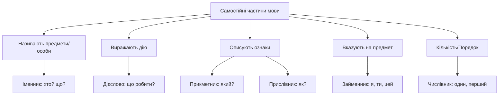
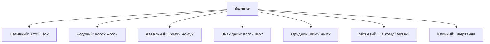

import Quiz from '@site/src/components/Quiz';
import MatchUp from '@site/src/components/MatchUp';
import FillIn from '@site/src/components/FillIn';
import TrueFalse from '@site/src/components/TrueFalse';
import Unjumble from '@site/src/components/Unjumble';
import GroupSort from '@site/src/components/GroupSort';
import Anagram from '@site/src/components/Anagram';
import ErrorCorrection, { ErrorCorrectionItem } from '@site/src/components/ErrorCorrection';
import Cloze from '@site/src/components/Cloze';
import Select from '@site/src/components/Select';
import Translate from '@site/src/components/Translate';
import MarkTheWords, { MarkTheWordsActivity } from '@site/src/components/MarkTheWords';
import HighlightMorphemes, { HighlightMorphemesActivity } from '@site/src/components/HighlightMorphemes';
import EssayResponse from '@site/src/components/EssayResponse';
import ComparativeStudy from '@site/src/components/ComparativeStudy';
import ReadingActivity from '@site/src/components/ReadingActivity';
import CriticalAnalysis from '@site/src/components/CriticalAnalysis';
import AuthorialIntent from '@site/src/components/AuthorialIntent';
import SourceEvaluation from '@site/src/components/SourceEvaluation';
import Debate from '@site/src/components/Debate';
import EtymologyTrace from '@site/src/components/EtymologyTrace';
import GrammarIdentify from '@site/src/components/GrammarIdentify';
import PaleographyAnalysis from '@site/src/components/PaleographyAnalysis';
import DialectComparison from '@site/src/components/DialectComparison';
import TranslationCritique from '@site/src/components/TranslationCritique';
import Transcription from '@site/src/components/Transcription';
import Observe from '@site/src/components/Observe';
import ActivityHelp from '@site/src/components/ActivityHelp';

<!-- SCOPE
Covers: Ukrainian grammar terminology — parts of speech, cases, grammatical categories, syntactic roles
Not covered:
  - Verb-specific terminology → 02-language-about-verbs
  - Reading grammar rules → 03-reading-grammar-rules
Related: b1-02, b1-03, b1-05
-->

# Як говорити про граматику

> **Чому це важливо?**
>
> Вивчення граматичної термінології українською мовою — це ваш «квиток» до повної мовної автономії. Це дозволить вам розуміти пояснення вчителів без перекладу, користуватися українськими словниками та професійно обговорювати структуру речень.

## Вступ: сила метамови

Ви перейшли на рівень B1, і це означає, що правила гри змінюються. До цього моменту ви вивчали українську мову переважно як набір фраз та базових конструкцій, де граматика часто пояснювалася англійською. Але тепер ми починаємо будувати міст до повного занурення. Метамова — це мова, якою ми говоримо про саму мову. Знання того, що таке «іменник» або «називний відмінок», звільняє вас від потреби постійно перемикатися на англійську в процесі навчання.

Starting from this module, we will gradually replace English grammatical explanations with their Ukrainian equivalents. This transition is essential because native speakers learn grammar using these very terms from their first years in school. Understanding how a Ukrainian teacher describes a rule will help you perceive the internal logic of the language more naturally, rather than always viewing it through the lens of a translation. Think of it as moving from being a passenger who just enjoys the ride to being the architect who understands how the entire engine of the language is built. When you hear a teacher say «Утворіть форму родового відмінка», you shouldn't be translating "genitive" in your head; you should immediately associate the command with the specific logic of possession or absence that this case represents in Ukrainian.

Для початку нам потрібно засвоїти базову «архітектурну» термінологію. Все починається зі **слова** (word). Кожне слово має своє місце в мові. Коли ми об’єднуємо слова за змістом та граматично, ми отримуємо **речення** (sentence). Вивченням законів, за якими будуються ці речення, займається **граматика** (grammar). Граматика — це не просто сухий набір правил, це жива система зв'язків. Без граматики слова — це просто хаотичний набір звуків, але завдяки їй вони перетворюються на засіб вираження найскладніших людських думок.

Кожне граматичне **правило** (rule) зазвичай супроводжує **приклад** (example). В українській мові правила часто мають винятки, але знання термінології допоможе вам класифікувати ці явища. Ви вже знаєте, що слова належать до різних категорій — це **частини мови** (parts of speech). Кожна частина мови виконує свою особливу роль у реченні. Знання цих ролей дозволяє вам не просто повторювати за вчителем, а самостійно конструювати нові фрази, розуміючи, де має стояти «підмет», а де — «присудок».

:::note[📝 Діалог у класі: Чому це важливо?]

**Учень:** Чому ми тепер вчимо граматику українською? Це ж складніше!
**Вчитель:** Навпаки, це спрощує життя в майбутньому. Коли ви шукаєте слово у словнику, ви бачите позначку «імен.». Якщо ви знаєте, що це «іменник», ви одразу розумієте, як це слово буде змінюватися.
**Учень:** Тобто метамова допомагає мені користуватися професійними інструментами?
**Вчитель:** Саме так! Ви стаєте автономним дослідником мови, а не просто користувачем розмовника.
:::

:::tip[💡 Чому це допомагає?]

Коли ви знаєте назви частин мови, ви можете швидше знайти потрібне слово у словнику. Більшість словників використовують скорочення (напр., *імен.* для іменника або *дієсл.* для дієслова). Розуміння цих міток — перший крок до самостійності. Також це дозволяє вам використовувати українські ресурси, такі як «Словник української мови» (СУМ) або мовні портали, де всі пояснення подаються виключно державною мовою.
:::

| Термін | Значення | Приклад |
| :--- | :--- | :--- |
| Слово | Одиниця мови | Мова, небо, читати |
| Речення | Завершена думка | Я вивчаю граматику. |
| Правило | Норма мови | Іменники змінюються за відмінками. |
| Приклад | Ілюстрація правила | Книга (іменник), бігти (дієслово). |
| Метамова | Мова про мову | Терміни «відмінок», «рід». |
| Виняток | Відхилення від норми | Слова «метро», «кіно» не відмінюються. |

_Приклад:_ «У цьому реченні кожне слово відповідає правилу граматики».

_Приклад:_ «Наведіть приклад іменника в називному відмінку».

_Приклад:_ «Чи є у цьому правилі якісь важливі винятки?»

Знання метамови також допомагає уникати плутанини. Наприклад, багато студентів плутають поняття «відмінок» та «відміна». Якщо ви вивчите ці терміни українською, ви зможете розрізнити їх у підручниках. Відмінок — це форма слова, а відміна — це група, до якої належить іменник за своїм типом закінчення. Це як розрізняти «тип двигуна» та «маршрут подорожі»: відміна стосується внутрішньої будови слова (які закінчення воно має), а відмінок — ролі слова в конкретному реченні.

Українська лінгвістична традиція має глибоке коріння. Використання саме українських термінів, а не запозичень, підкреслює унікальність нашої граматичної системи. Наприклад, термін «дієслово» буквально означає «слово, що означає дію». Це робить граматику логічною навіть на рівні назв.

## Частини мови: самостійні категорії

Самостійні частини мови — це «цеглини», з яких складається фундамент будь-якої фрази. Вони називають предмети, дії, ознаки або вказують на них. Головна особливість самостійних слів у тому, що до них можна поставити питання. Вони мають власне лексичне значення і можуть виступати членами речення.

### Іменник

**Іменник** — це частина мови, що називає предмети або осіб. Це найпоширеніша категорія слів. Іменники відповідають на питання **Хто?** або **Що?**. Кожен іменник в українській мові має граматичний рід (чоловічий, жіночий або середній), число та змінюється за відмінками.

_Приклад:_ «Студент (хто?) читає цікаву книгу (що?)».
_Приклад:_ «Україна (що?) — велика держава».

В українській мові іменники поділяються на власні назви (Київ, Марія, Карпати) та загальні назви (місто, дівчина, гори). Власні назви пишуться з великої літери, а загальні — з маленької. Також іменники можуть бути конкретними, які називають фізичні об'єкти (стіл, дерево, людина), або абстрактними, що позначають поняття, почуття чи якості (любов, знання, свобода, граматика). Розуміння різниці між конкретними та абстрактними іменниками допомагає правильно добирати прикметники та дієслова для опису дій. Крім того, деякі іменники вживаються лише в однині (золото, молодь) або лише в множині (гроші, канікули, двері). Ці нюанси часто пояснюються в підручниках через термін «граматичне число».

_Додатковий приклад:_ «Професор (хто?) пояснює складну теорію (що?) своїм студентам».

_Нотатка про вживання:_ Часто іменники в реченні поєднуються з прийменниками, що допомагає уточнити місце, час або причину дії. Вживання правильного відмінка після прийменника є однією з найважливіших навичок для досягнення рівня B1, оскільки це дозволяє будувати точні логічні зв’язки між різними поняттями у вашій розповіді.

:::note[📝 Розмова про назви]

**Учень:** Чи кожне слово, що відповідає на питання «що?», є іменником?
**Вчитель:** Так, якщо воно називає предмет або поняття. Наприклад, «краса» — це іменник, хоча ми не можемо її поторкати. Це абстрактний іменник.
**Учень:** А «Київ» — це власна назва?
**Вчитель:** Саме так. Тому ми завжди пишемо це слово з великої літери.
:::

### Дієслово

**Дієслово** — це енергія мови. Ця частина мови означає дію або стан предмета. Дієслова відповідають на питання **Що робити?** або **Що зробити?**. Дієслова мають категорії часу (теперішній, минулий, майбутній), особи, числа та виду.

_Приклад:_ «Я пишу (що роблю?) статтю про лінгвістику».
_Приклад:_ «Вона вивчила (що зробила?) нове правило».

Дієслова можуть змінюватися за особами — цей процес називається **дієвідмінюванням**. Знання того, до якої дієвідміни належить слово, допомагає правильно писати закінчення. Крім основних форм, існують зворотні дієслова, що мають частку *-ся* (наприклад, «вчитися», «вмиватися»). Вони означають дію, спрямовану на самого виконавця. Також важливо розрізняти неозначену форму дієслова (інфінітив), яка закінчується на *-ти* і не вказує ні на час, ні на особу. Категорія виду дієслова є ключовою: недоконаний вид описує тривалу або повторювану дію, а доконаний вид — дію, яка має результат або завершення.

_Додатковий приклад:_ «Ми щодня наполегливо тренуємося (що робимо?), щоб значно краще розмовляти українською мовою».

_Нотатка про вживання:_ В українській мові дієслова мають багату систему синонімів, що дозволяють виразити найтонші нюанси кожної дії. Наприклад, замість загального «говорити» можна вжити «балакати», «шепотіти» або «виголошувати», залежно від емоційного забарвлення мовлення та ступеня офіційності конкретної ситуації.

:::warning[⚠️ Спільна помилка]

Студенти часто вживають термін «глагол» під впливом сусідніх мов. В українській мові ми використовуємо виключно термін **дієслово**. Це слово легко запам'ятати: воно походить від слів «дія» та «слово». Використання правильного терміна «дієслово» одразу показує ваш високий рівень володіння мовою.
:::

### Прикметник

**Прикметник** додає мові кольорів та деталей. Він виражає ознаку предмета і відповідає на питання **Який? Яка? Яке? Які?**. Прикметники завжди узгоджуються з іменником у роді, числі та відмінку.

_Приклад:_ «Сьогодні чудовий сонячний день».
_Приклад:_ «Він читає українську поезію».

Прикметники поділяються на три основні групи за значенням. Якісні прикметники виражають ознаку, яка може виявлятися більшою або меншою мірою (теплий, гарний). Відносні прикметники вказують на відношення до матеріалу, часу або місця (залізний, зимовий, міський). Присвійні прикметники вказують на належність предмета комусь (батьків, материн, сестрин). Якісні прикметники можуть мати ступені порівняння: **вищий** та **найвищий**. Це дозволяє нам порівнювати предмети за їхніми ознаками, створюючи точніші описи навколишнього світу.

_Додатковий приклад:_ «Вишневий сад (який?) густо цвіте щовесни біля нашої білої хати».

_Нотатка про вживання:_ Деякі прикметники можуть переходити в розряд іменників (цей процес називається субстантивацією), наприклад, у словах «черговий», «військовий» або «минуле». Це демонструє неймовірну гнучкість української граматичної системи та тісний семантичний зв'язок між ознакою та самим предметом, який вона характеризує.

### Прислівник

**Прислівник** характеризує дію або ознаку. Він відповідає на питання **Як? Де? Коли? Куди?**. На відміну від іменників чи прикметників, прислівник — це незмінна частина мови. У нього немає закінчення, тому він не змінюється за відмінками чи числами.

_Приклад:_ «Учитель пояснює правило повільно і зрозуміло».
_Приклад:_ «Завтра ми будемо обговорювати синтаксис».

Прислівники часто утворюються від прикметників. Пам'ятайте, що кінцева буква «о» у прислівниках — це суфікс, а не закінчення. Оскільки прислівники не мають закінчень, вони є одними з найстабільніших елементів українського речення. Деякі прислівники також можуть мати ступені порівняння, якщо вони утворені від якісних прикметників (швидко — швидше — найшвидше). Це важливо для опису інтенсивності дії або якості.

_Додатковий приклад:_ «Сонце сьогодні світить надзвичайно яскраво (як?), хоча на вулиці все ще досить холодно».

_Нотатка про вживання:_ Прислівники відіграють ключову роль у створенні логічних переходів у тексті, як-от «спочатку», «потім», «зрештою» або «по-перше». Вони допомагають структурувати вашу розповідь, роблячи її професійною та легкою для сприйняття як слухачами, так і читачами.

:::tip[💡 Як розрізнити?]

Якщо слово змінює форму — це прикметник. Якщо слово завжди звучить однаково — це прислівник. Прислівник зазвичай пояснює дієслово (пише швидко), а прикметник — іменник (швидкий поїзд).
:::

### Займенник

**Займенник** — це слово, яке вказує на предмети, ознаки або кількість, але не називає їх прямо. Назва підказує його роль: він стоїть «замість імені». Займенники бувають особові (я, ми), вказівні (цей, той), присвійні (мій, твій) та інші.

_Приклад:_ «Я знаю це правило».
_Приклад:_ «Ми вивчаємо нашу мову».

Займенники допомагають нам уникати повторів у тексті. Без них мова була б сухою та перевантаженою одними й тими самими назвами. Важливо пам'ятати, що особові займенники змінюються за відмінками так само як іменники, хоча їхні форми можуть сильно відрізнятися від початкової (я — мене — мені). Це називається суплетивізмом форм, і про це часто згадують у граматичних поясненнях.

_Додатковий приклад:_ «Хтось (хто?) тихенько постукав у масивні двері, але в коридорі нікого не було видно».

_Нотатка про вживання:_ Займенники можуть бути неозначеними або заперечними, додаючи мові необхідних відтінків непевності, таємничості чи категоричності. Розуміння специфічного відмінювання займенників «себе», «весь» або «хтось» є критично необхідним для успішного конструювання складних синтаксичних конструкцій.

### Числівник

**Числівник** означає кількість предметів або їх порядок при лічбі. Відповідає на питання **Скільки?** або **Котрий?**.

_Приклад:_ «У нашій групі десять студентів».
_Приклад:_ «Сьогодні двадцять друге лютого».

Числівники поділяються на кількісні (один, два, три) та порядкові (перший, другий, третій). Серед кількісних числівників існують також збірні (двоє, троє), дробові (одна друга, три п'ятих) та неозначено-кількісні (багато, кілька). В українській мові числівники мають складну систему відмінювання, особливо при поєднанні з іменниками. Знання назви цієї частини мови допоможе вам знайти потрібні таблиці та правила узгодження, які є критично важливими для точного висловлювання думок у будь-якій сфері.

_Додатковий приклад:_ «П'ятий (котрий?) урок сьогодні буде повністю присвячений складним питанням морфології».

_Нотатка про вживання:_ Числівники незамінні в офіційно-діловому та науковому стилях для точного позначення кількісних даних чи дат. Важливо пам'ятати, що відмінювання числівників на позначення десятків та сотень має свої особливості, які ми детально розглянемо в спеціалізованих модулях цього курсу.

## Частини мови: службові слова

Службові слова не називають предметів чи дій і не відповідають на питання. Їхня роль — бути «клеєм», що з’єднує самостійні слова в речення. Хоча вони короткі, без них неможливо побудувати складну думку. Вони не є членами речення самі по собі, але допомагають іншим словам взаємодіяти. Вивчення службових слів дозволяє перейти від простих конструкцій до складних синтаксичних структур, де кожне слово має чітке логічне обґрунтування.

### Сполучник

**Сполучник** сполучає слова в реченні або цілі речення між собою. Назва походить від слова «сполучати». Найпоширеніші сполучники: *і (й), та, але, бо, тому що, коли, якби, щоб*.

_Приклад:_ «Я вивчив теорію і тепер виконую вправи».
_Приклад:_ «Ми залишилися вдома, бо почався сильний дощ».

Сполучники бувають сурядності, які єднають рівноправні частини речення або слова (і, але, або, та), та підрядності, де одна частина залежить від іншої (бо, коли, якщо, тому що, щоб). Підрядні сполучники часто вказують на причину, мету, час або умову дії. Наприклад, сполучник «бо» пояснює причину, а «щоб» — мету. Правильний вибір сполучника визначає логічну чіткість вашого висловлювання. Також існують складені сполучники, що складаються з кількох слів, як-от «після того як» або «через те що».

_Додатковий приклад:_ «Хоча (сполучник) граматика іноді здається складною, вона є дуже логічною та стрункою системою».

_Нотатка про вживання:_ Сполучники підрядності «тому що», «оскільки» та «через те що» часто використовуються для обґрунтування власної думки під час дискусій. Вміння правильно обирати сполучник для зв'язку частин речення є ознакою вашої готовності до вільного володіння мовою на академічному рівні.

### Прийменник

**Прийменник** виражає залежність іменника, числівника або займенника від інших слів у реченні. Він зазвичай стоїть «при імені». Важливо пам’ятати, що в українській мові прийменники вимагають певного відмінка.

_Приклад:_ «Книга лежить на столі».
_Приклад:_ «Ми йдемо до університету».

Кожен прийменник має своє просторове, часове або об'єктне значення. Прийменники поділяються на первинні (непохідні), як-от *у, на, з, по*, та похідні, що утворилися від інших частин мови, наприклад *навколо, внаслідок, згідно з*. Розуміння того, з яким саме відмінком вживається прийменник, є ключем до граматичної правильності. Наприклад, прийменник «у» може вказувати на місце (у місті — місцевий відмінок) або на напрямок дії (у місто — знахідний відмінок). Це явище називається прийменниковим керуванням.

_Додатковий приклад:_ «Ми обов'язково зустрінемося біля (прийменник) головного входу о восьмій годині вечора».

_Нотатка про вживання:_ Деякі прийменники, як-от «завдяки», вимагають лише давального відмінка, тоді як «внаслідок» вживається з родовим. Розуміння цих мікросистем прийменникового керування допоможе вам уникнути типових помилок, що нерідко виникають під впливом інтерференції з іншими мовами.

:::warning[⚠️ Плутанина префіксів]

Студенти часто плутають **прийменник** та **займенник**. Спробуйте асоціацію: *при*-йменник стоїть *при* іменнику (поруч, як асистент), а *за*-йменник стоїть *замість* імені (як дублер).
**Приклад прийменника:** «У кімнаті».
**Приклад займенника:** «Він у кімнаті».
:::

### Частка

**Частка** надає словам чи реченням додаткових відтінків значення (заперечення, запитання, підсилення) або служить для утворення нових форм слів.

_Приклад:_ «Я не розумію це слово».
_Приклад:_ «Чи знаєте ви назви всіх відмінків?».

Частки не змінюються, але вони мають велику силу в мові. Вони можуть перетворити стверджувальне речення на заперечне («не»), запитальне («чи», «хіба») або підкреслити важливість певної думки («навіть», «саме», «тільки»). Деякі частки допомагають утворювати граматичні форми, наприклад частка «би/б» утворює умовний спосіб дієслова, а частки «хай/нехай» — наказовий спосіб. Використання часток робить мову емоційно насиченою та виразною.

_Додатковий приклад:_ «Хіба (частка) ви ще не встигли вивчити всі назви українських частин мови?».

_Нотатка про вживання:_ Частки «ж», «таки» та «навіть» додають мовленню емоційної виразності та допомагають розставити правильні акценти. Вони є потужним інструментом для виділення найважливішої інформації в реченні, при цьому зовсім не змінюючи його базову граматичну структуру.

### Вигук

**Вигук** — це особлива категорія. Вигуки не мають лексичного значення, але виражають почуття, емоції або волевиявлення, не називаючи їх.

_Приклад:_ «Ой! Я забув підручник».
_Приклад:_ «Дякую за допомогу!».

Вигуки не є членами речення, але вони є невід'ємною частиною живого спілкування. До вигуків також відносять слова мовного етикету (добридень, до побачення, будь ласка) та звуконаслідувальні слова (ку-ку, гав-гав). Вони додають мові природності та допомагають краще виразити емоційний стан мовця без довгих описів.

_Додатковий приклад:_ «Алло! Ви мене добре чуєте чи зв'язок знову перервався?».

_Нотатка про вживання:_ Вигуки часто використовуються для миттєвого привернення уваги або вираження раптових сильних емоцій, таких як здивування, радість чи переляк. Багато вигуків є специфічними саме для української мовної культури та етикету, тому їх вивчення наближає вас до природного звучання мови.

| Частина мови | Роль | Приклади |
| :--- | :--- | :--- |
| Сполучник | Єднає частини речення | і, але, бо, та, щоб |
| Прийменник | Вказує на зв'язок слів | в, на, до, під, з |
| Частка | Додає смисловий відтінок | не, чи, тільки, ж, б |
| Вигук | Виражає емоції/волю | ах, ой, ого, гей, на добраніч |

## Відмінки: сім ключів

Відмінювання — це, мабуть, найвідоміша риса української граматики для іноземців. В українській мові існує сім відмінків. Кожен відмінок має свою назву та відповідає на певне питання. Знання цих назв допоможе вам розуміти, чому слово змінило своє закінчення. Відмінок показує синтаксичний зв'язок іменника з іншими словами. Якщо ми змінимо відмінок неправильно, сенс речення може повністю зникнути або змінитися. Кожен відмінок — це окремий логічний «інструмент», що дозволяє нам будувати зв'язки між поняттями.

### Називний відмінок

**Називний відмінок** — це початкова форма слова. Він називає предмет або особу. У реченні іменник у називному відмінку зазвичай є підметом, тобто тим, хто виконує дію. Назва походить від слова «називати».

**Питання: Хто? Що?**

_Приклад:_ «Учитель (хто?) пояснює граматику».
_Приклад:_ «Правило (що?) написане на дошці».

_Додаткова інформація:_ Називний відмінок — це словникова форма, яку ви знайдете у будь-якому словнику. Саме тому його інколи називають «початковим» відмінком. У реченні підмет завжди стоїть у називному відмінку, і саме від нього залежить форма дієслова-присудка: «Студент читає» (однина) → «Студенти читають» (множина).

### Родовий відмінок

**Родовий відмінок** дуже багатофункціональний. Він вказує на належність, відсутність чогось, частину від цілого або використовується після чисел (від 5 і далі). Це один із найвживаніших відмінків після називного.

**Питання: Кого? Чого?**

_Приклад:_ «Немає (кого?) студента в класі».
_Приклад:_ «Я випив склянку (чого?) води».

Родовий відмінок обов'язково використовується при запереченні: замість «Я маю книгу» ми кажемо «Я не маю книги». Також він важливий для позначення дати (двадцятого січня) та вказування на походження чи приналежність об'єкта до певної групи. У шкільній програмі цей відмінок часто називають «фундаментальним», бо від його знання залежить правильність вживання багатьох інших форм.

_Додаткова інформація:_ Родовий відмінок часто вживається для вказання на частину від цілого (так званий партитив), наприклад: «купити свіжого цукру», «налити гарячого чаю». Це важливо враховувати, щоб не плутати його зі знахідним відмінком у побутових контекстах. Також він є незамінним під час порівняння предметів у конструкціях типу «вищий за брата».

:::info[🌍 Прозорі назви]

Більшість назв відмінків в українській мові походять від дієслів, що описують їхню функцію. *Родовий* відмінок вказує на «рід», походження або власність. Це допомагає інтуїтивно зрозуміти, коли його використовувати. Коли ви кажете «Син (кого?) Марії», ви вказуєте на родинний зв'язок.
:::

### Давальний відмінок

**Давальний відмінок** зазвичай вказує на особу, якій щось дають або для якої щось роблять (адресат дії). Назва походить від дієслова «давати».

**Питання: Кому? Чому?**

_Приклад:_ «Я допомагаю (кому?) другові».
_Приклад:_ «Слава Україні!».

Давальний відмінок також використовується в безособових реченнях для вираження стану або потреби людини. Наприклад: «Мені холодно», «Йому треба вчитись», «Нам сумно». Це специфічна роль давального відмінка, яка не завжди має прямі аналоги в англійській мові. Крім того, він часто вживається для вираження вдячності чи спрямованості почуттів.

### Знахідний відмінок

**Знахідний відмінок** вказує на об'єкт дії. Ми використовуємо його, коли «знаходимо» об’єкт, на який безпосередньо спрямована дія. Це зазвичай прямий додаток.

**Питання: Кого? Що?** (Зверніть увагу: питання «Кого?» збігається з родовим, а «Що?» — з називним).

_Приклад:_ «Я бачу (кого?) викладача».
_Приклад:_ «Він читає (що?) текст».

_Додаткова інформація:_ Цей відмінок часто поєднується з дієсловами руху для вказання на кінцевий пункт або напрямок: «йти в густий ліс», «їхати на синє море». У таких випадках прийменники «в» та «на» вимагають вживання саме знахідного відмінка, що чітко відрізняє ці конструкції від статичного опису місця в місцевому відмінку.

### Орудний відмінок

**Орудний відмінок** вказує на засіб дії (інструмент) або на те, з ким виконується дія (спільність). Питання: **Ким? Чим?**. Назва походить від слова «орудувати».

_Приклад:_ «Я пишу (чим?) ручкою».
_Приклад:_ «Ми розмовляємо з учителем».

Орудний відмінок також вживається для позначення професії, статусу або ролі людини в реченнях типу «Він працює лікарем» або «Вона стала студенткою». Ще одна важлива функція — опис способу пересування: «їхати поїздом», «летіти літаком». Крім того, орудний відмінок використовується після прийменників *з, під, над, перед, за* для позначення місця або спільності.

_Додаткова інформація:_ В орудному відмінку часто вживаються іменники, що позначають час або пори року, виступаючи в ролі обставин: «теплою весною», «тихими вечорами», «холодною зимою». Це надає мовленню особливого поетичного або художнього забарвлення, дозволяючи мовцеві уникати громіздких конструкцій з прийменниками.

### Місцевий відмінок

**Місцевий відмінок** завжди вживається з прийменником і вказує на місце або час дії. Це єдиний відмінок в українській мові, який не може існувати без прийменника.

**Питання: На кому? На чому? В кому? В чому?**

_Приклад:_ «Ми живемо в місті».
_Приклад:_ «Інформація є на сторінці».

_Додаткова інформація:_ Місцевий відмінок завжди вживається з прийменниками *в (у), на, по, при*. Порівняйте: «Я йду в парк» (знахідний — напрямок) та «Я гуляю в парку» (місцевий — місцезнаходження). Різниця між цими двома відмінками після однакового прийменника «в» — одна з типових труднощів для іноземних студентів.

### Кличний відмінок

**Кличний відмінок** — це гордість української мови. Він не відповідає на питання, бо не пов'язаний з іншими словами граматично. Його роль — звертання. Використання кличного відмінка робить вашу мову ввічливою та природною. Назва походить від дієслова «кликати».

**Питання: немає (це форма звертання)**.

_Приклад:_ «Оксано, чи ти вивчила назви відмінків?»
_Приклад:_ «Друже, допоможи мені з граматикою».

:::info[🕰️ Мелетій Смотрицький]

Цікавий факт: у 1619 році вчений Мелетій Смотрицький написав першу фундаментальну граматику. Його система п’яти відмін іменників та логіка класифікації частин мови досі лежать в основі сучасного шкільного навчання в Україні. Це доводить, що українська граматична думка має понад 400 років безперервної традиції.

:::

:::note[📜 Грамматіки Славє́нскиѧ пра́вилноє Сѵ́нтаґма]

У цій праці вчений офіційно виокремив місцевий відмінок (тоді названий «сказательним»). До цього його часто об’єднували з іншими формами.
:::

:::note[📝 Діалог: Чому кличний відмінок особливий?]

**Учень:** В англійській мові ми просто кажемо ім'я для звертання. Навіщо в українській спеціальний відмінок?
**Вчитель:** Кличний відмінок додає мові емоційності та поваги. Якщо ви кажете «Андрію», а не «Андрій», ви звучите як носій мови. Це ознака культури мовлення.
**Учень:** Тобто це не просто правило, а етикет?
**Вчитель:** Саме так! В українській мові звертання без кличного відмінка часто звучить сухо або навіть грубо.
:::

## Граматичні категорії та будова слова

Окрім частин мови, ми часто говоримо про те, як слово побудоване всередині. Це сфера **морфеміки**. Розуміння структури слова допомагає вам «розшифровувати» значення незнайомих слів. Наприклад, бачачи префікс «без-», ви розумієте, що слово означає відсутність чогось. Морфема — це найменша значуща частина слова. Аналіз морфемного складу дозволяє зрозуміти внутрішню логіку української лексики та легко розрізняти споріднені слова.

Кожне слово має свою структуру, що складається з морфем:
- **Корінь** — головна частина слова, що містить його основне значення. Спільний корінь об'єднує споріднені слова. Розуміння кореня дозволяє мовцю швидко ідентифікувати семантичне ядро слова, навіть якщо він бачить його вперше.
- **Префікс** — частина слова перед коренем, яка зазвичай змінює значення слова. Префікси можуть надавати дієсловам значення завершеності, напрямку або інтенсивності.
- **Суфікс** — частина слова після кореня, яка часто вказує на частину мови або надає додаткових відтінків. Наприклад, суфікси можуть перетворювати дієслова на іменники або створювати пестливі форми слів.
- **Закінчення** — частина слова, що змінюється при відмінюванні. Закінчення вказує на граматичне значення. Якщо слово не має закінчення, ми кажемо, що в нього **нульове закінчення**.

Коли ми аналізуємо слово, ми говоримо про такі ключові категорії:

1. **Особа**: Вказує на те, хто виконує дію. Категорія особи є характерною для дієслів теперішнього та майбутнього часу. Вона забезпечує узгодження дієслова із займенником або іменником, що виконує роль підмета.
   - Перша особа (я, ми): «я пишу», «ми пишемо».
   - Друга особа (ти, ви): «ти пишеш», «ви пишете».
   - Третя особа (він/вона/воно, вони): «він пише», «вони пишуть».
2. **Число**:
   - Однина: один предмет або особа.
   - Множина: два або більше предметів чи осіб. Граматичне число впливає на форму закінчення практично всіх самостійних частин мови, крім прислівника.
3. **Час**:
   - Минулий час: дія вже відбулася.
   - Теперішній час: дія відбувається зараз.
   - Майбутній час: дія відбудеться потім. Категорія часу дозволяє будувати чітку хронологію подій у тексті.
4. **Вид**: Дуже важлива категорія для слов'янських мов, яка описує внутрішню характеристику протікання дії.
   - Недоконаний вид (процес): що робити? («читати»). Означає незавершену, тривалу або повторювану дію.
   - Доконаний вид (результат): що зробити? («прочитати»). Означає дію, яка досягла своєї межі або результату.

Для іменників, прикметників та займенників ключовою категорією є **Рід**:
- Чоловічий рід (*він*): стіл, батько, вітер.
- Жіночий рід (*вона*): мова, мати, книга.
- Середній рід (*воно*): небо, вікно, слово. Категорія роду в українській мові є граматичною, а не лише біологічною, тому вона вимагає уважного узгодження закінчень. Середній рід часто використовується для позначення загальних явищ або понять, що не мають чітко вираженої статі.

На рівні речення ми використовуємо назви **синтаксичних ролей**, які допомагають зрозуміти функцію слова:

- **Підмет**: головний герой речення, що виконує дію. Зазвичай стоїть у називному відмінку. (Хто? Що?)
- **Присудок**: дія, яку виконує підмет. Зазвичай виражається дієсловом. (Що робить підмет?)
- **Додаток**: предмет, на який спрямована дія підмета. Виражається іменником у непрямих відмінках. (Кого? Що? Ким? Чим?)
- **Означення**: опис предмета, його ознака. Виражається прикметником. (Який? Яка? Чий?)
- **Обставина**: обставини, за яких відбувається дія (місце, час, спосіб). Виражається прислівником або іменником з прийменником. (Як? Де? Коли? Куди?)

_Приклад:_ «Сумлінний (означення) студент (підмет) швидко (обставина) пише (присудок) складний тест (додаток)».

:::info[🧐 Як це працює разом?]

Розуміння синтаксичних ролей допомагає вам правильно обрати відмінок. Якщо слово — підмет, це називний відмінок. Якщо слово — додаток, це найчастіше знахідний або родовий. Коли ви аналізуєте речення як систему, ви перестаєте робити випадкові помилки в закінченнях. Це стає можливим, бо ви бачите логіку зв'язків між «господарем» (підметом) та його «слугами» (другорядними членами речення).
:::

:::note[📝 Діалог про структуру]

**Учень:** Чому ми маємо знати, де підмет, а де додаток? В англійській це зрозуміло з порядку слів.
**Вчитель:** В українській мові порядок слів вільніший. Ви можете сказати «Студент читає книгу» або «Книгу читає студент». Тільки закінчення (відмінок) підкаже нам, хто кого читає.
**Учень:** Ага! Тобто називний відмінок завжди показує підмет, незалежно від місця в реченні?
**Вчитель:** Саме так! Це дає українській мові неймовірну гнучкість та емоційність.
:::

## Практика: читаємо граматику українською

Тепер спробуйте прочитати короткі пояснення так, як вони написані в українських підручниках. Це ваша перша реальна зустріч з академічною метамовою. Зверніть увагу на терміни, які ви щойно вивчили.

**Текст 1: Про іменник (Зі шкільного підручника)**
«Іменник — це самостійна частина мови, що означає предмет і відповідає на питання хто? або що?. У реченні іменник найчастіше виконує роль підмета або додатка. Іменники змінюються за числами та відмінками, а також мають рід. Власні назви іменників ми завжди пишемо з великої букви, а загальні — з малої. Іменники, що називають людей і тварин, відповідають на питання хто?, а всі інші — на питання що?».

**Текст 2: Про кличний відмінок**
«Кличний відмінок в українській мові виконує особливу функцію — він служить для звертання. На відміну від інших відмінків, він не виражає зв'язку з іншими словами в реченні через питання. Звертання, виражене кличним відмінком, завжди виділяється на письмі комами, а в усному мовленні — спеціальною інтонацією. Використання кличного відмінка є обов'язковим у офіційному та неофіційному спілкуванні українською мовою».

**Текст 3: Культурний контекст та граматика**
Українські письменники завжди майстерно використовували граматичні можливості мови. Тарас Шевченко часто вживав кличний відмінок для емоційного звертання до України: «Зоре моя вечірняя, зійди над горою...». Тут слово «Зоре» — це кличний відмінок від іменника «зоря». У цьому звертанні ми також бачимо займенник «моя» та прикметник «вечірняя» (застаріла форма), які узгоджуються з іменником.

Леся Українка у своїх творах часто використовувала складні дієслівні форми для опису внутрішнього стану героїв. Наприклад: «Я буду жити! Я буду крізь сльози сміятись...». Тут «буду жити» та «буду сміятись» — це аналітичні форми майбутнього часу дієслів недоконаного виду. Письменниця підкреслює тривалість дії та незламність духу через категорію часу.

:::note[📜 Іван Франко]

«Мова — це не тільки засіб спілкування, а й дзеркало душі народу».
У цьому вислові слово «мова» є підметом (називний відмінок), а «дзеркало» — головною частиною присудка. Зверніть увагу на частку «не тільки... а й», яка створює логічне зіставлення.
:::

:::tip[🔍 Завдання для самоперевірки:]

Прочитайте наступні типові завдання з українських підручників та спробуйте зрозуміти, що саме потрібно зробити:
1. «Визначте частину мови для виділених слів у поданому реченні».
2. «Провідміняйте іменник "мова" в однині та множині».
3. «Знайдіть у тексті приклади дієслів доконаного виду та визначте їхній час».
4. «Випишіть із тексту три прикметники разом із іменниками, з якими вони узгоджуються».
5. «Перетворіть називний відмінок імені на кличний для звертання».
:::

**Питання до текстів:**
- Як називаються іменники, що пишуться з великої букви?
- Яку роль у реченні виконує слово «зоря» у вірші Шевченка?
- Яку граматичну категорію дієслова використовує Леся Українка («буду жити»)?

---

## 📋 Підсумок і самоперевірка

Ми завершили огляд основної граматичної термінології. Тепер ви знаєте назви десяти частин мови (шість самостійних та чотири службові), імена семи українських відмінків та базові поняття будови слова й речення. Ви познайомилися з морфемікою (корінь, префікс, суфікс, закінчення) та основними граматичними категоріями, такими як рід, число, особа, час та вид.

Ця база є необхідною для того, щоб на рівні B1 ви могли розуміти складніші правила, які ми будемо вивчати далі. Тепер, коли вчитель скаже «Зверніть увагу на закінчення орудного відмінка», ви не будете витрачати час на переклад терміна, а одразу зосередитеся на формі слова.

Пам’ятайте: граматика — це не просто список правил, це логічна система, що відображає спосіб мислення народу. Коли ви називаєте явище його українським іменем, ви починаєте мислити в межах цієї системи, ви бачите внутрішні зв'язки та красу мовної конструкції. Наступні модулі будуть присвячені детальному вивченню дієслів, синтаксису складних речень та тонкощам слововживання, де ці знання стануть вашими головними інструментами. Ви зробили величезний крок до мовної свободи — від використання мови як інструменту до розуміння мови як мистецтва.

**Самоперевірка:**
1. Чи можете ви назвати всі шість самостійних частин мови українською? Наведіть приклади для кожної.
2. На які питання відповідають називний, родовий та орудний відмінки? Яка головна функція орудного відмінка?
3. Чим відрізняється прийменник від займенника (за назвою та функцією)? Чому їх часто плутають?
4. Які основні частини слова ви знаєте (морфеміка)? Навіщо нам знати корінь слова?
5. Яку роль у реченні зазвичай виконує іменник у називному відмінку? Що таке присудок?
6. На яке питання відповідає прислівник? Чи змінюється ця частина мови за числами?
7. Хто такий Мелетій Смотрицький і чому його ім'я важливе для історії української граматики?
8. Яка частина мови відповідає за «енергію дії» в реченні?
9. Назвіть усі сім відмінків української мови по порядку.
10. У чому різниця між «власною» та «загальною» назвами іменників?

---

## 🎯 Activities

### Визначте частину мови

<Quiz questions={JSON.parse(`[{"question": "Яка частина мови називає предмети або осіб і відповідає на питання \\"хто?\\" або \\"що?\\"?", "options": [{"text": "Іменник", "correct": true}, {"text": "Дієслово", "correct": false}, {"text": "Прикметник", "correct": false}, {"text": "Прислівник", "correct": false}], "explanation": "Іменник — це самостійна частина мови, що називає предмети (стіл) або осіб (студент)."}, {"question": "Яка частина мови означає дію або стан предмета і відповідає на питання \\"що робити?\\"?", "options": [{"text": "Дієслово", "correct": true}, {"text": "Прикметник", "correct": false}, {"text": "Займенник", "correct": false}, {"text": "Числівник", "correct": false}], "explanation": "Дієслово виражає дію (писати) або стан (думати) предмета."}, {"question": "Яка частина мови виражає ознаку предмета і відповідає на питання \\"який?\\" або \\"чия?\\"?", "options": [{"text": "Прикметник", "correct": true}, {"text": "Прислівник", "correct": false}, {"text": "Іменник", "correct": false}, {"text": "Сполучник", "correct": false}], "explanation": "Прикметник додає мові кольорів та деталей, описуючи ознаки (цікавий, українська)."}, {"question": "Яка частина мови є незмінною і відповідає на питання \\"як?\\", \\"де?\\" або \\"коли?\\"?", "options": [{"text": "Прислівник", "correct": true}, {"text": "Прикметник", "correct": false}, {"text": "Дієслово", "correct": false}, {"text": "Займенник", "correct": false}], "explanation": "Прислівник не змінюється за відмінками чи числами і характеризує дію (швидко, вчора)."}, {"question": "Яка частина мови вказує на предмети або ознаки, але не називає їх прямо?", "options": [{"text": "Займенник", "correct": true}, {"text": "Іменник", "correct": false}, {"text": "Числівник", "correct": false}, {"text": "Прикметник", "correct": false}], "explanation": "Займенник стоїть «замість імені» (я, ти, цей, мій), допомагаючи уникати повторів."}, {"question": "Як називається частина мови, що означає кількість предметів або їх порядок при лічбі?", "options": [{"text": "Числівник", "correct": true}, {"text": "Займенник", "correct": false}, {"text": "Іменник", "correct": false}, {"text": "Прислівник", "correct": false}], "explanation": "Числівник відповідає на питання \\"скільки?\\" (десять) або \\"котрий?\\" (перший)."}, {"question": "Яка службова частина мови сполучає слова в реченні або цілі речення між собою?", "options": [{"text": "Сполучник", "correct": true}, {"text": "Прийменник", "correct": false}, {"text": "Частка", "correct": false}, {"text": "Вигук", "correct": false}], "explanation": "Сполучник (і, але, бо) сполучає логічні частини вашого висловлювання."}, {"question": "Яка службова частина мови виражає залежність іменника від інших слів і стоїть перед ним?", "options": [{"text": "Прийменник", "correct": true}, {"text": "Сполучник", "correct": false}, {"text": "Частка", "correct": false}, {"text": "Займенник", "correct": false}], "explanation": "Прийменник (у, на, до) виражає зв'язок слів і вимагає певного відмінка."}, {"question": "Яка службова частина мови надає словам додаткових відтінків значення, як-от заперечення або підсилення?", "options": [{"text": "Частка", "correct": true}, {"text": "Сполучник", "correct": false}, {"text": "Прийменник", "correct": false}, {"text": "Вигук", "correct": false}], "explanation": "Частка (не, чи, навіть, тільки) додає смислові відтінки, не називаючи предметів чи дій."}, {"question": "Яка частина мови виражає почуття або емоції, не називаючи їх, і не є членом речення?", "options": [{"text": "Вигук", "correct": true}, {"text": "Частка", "correct": false}, {"text": "Прислівник", "correct": false}, {"text": "Займенник", "correct": false}], "explanation": "Вигук (ой, ах, гей) виражає емоції або волевиявлення без лексичного значення."}]`)} />

### Граматична термінологія

<FillIn items={JSON.parse(`[{"sentence": "[___] — це мова, якою ми говоримо про саму мову.", "answer": "Метамова", "options": ["Метамова", "Граматика", "Синтаксис", "Морфологія"]}, {"sentence": "Основна частина слова, що містить його головне лексичне значення — це [___].", "answer": "корінь", "options": ["корінь", "префікс", "суфікс", "закінчення"]}, {"sentence": "Іменники в українській мові мають граматичний [___]: чоловічий, жіночий або середній.", "answer": "рід", "options": ["рід", "вид", "час", "стан"]}, {"sentence": "Процес зміни дієслів за особами та числами називається [___].", "answer": "дієвідмінюванням", "options": ["дієвідмінюванням", "відмінюванням", "узгодженням", "керуванням"]}, {"sentence": "[___] відмінок в українській мові використовується виключно для звертання.", "answer": "Кличний", "options": ["Кличний", "Називний", "Місцевий", "Орудний"]}, {"sentence": "Частина слова, що стоїть після кореня і вказує на частину мови — це [___].", "answer": "суфікс", "options": ["суфікс", "префікс", "корінь", "основа"]}, {"sentence": "[___] — це завершена думка, що складається зі слів, поєднаних за змістом та граматично.", "answer": "Речення", "options": ["Речення", "Слово", "Правило", "Приклад"]}, {"sentence": "Слова «метро» та «кіно» — це [___] з правил відмінювання іменників.", "answer": "винятки", "options": ["винятки", "приклади", "норми", "категорії"]}, {"sentence": "Службові слова в реченні виконують роль [___], що з’єднує самостійні слова.", "answer": "клею", "options": ["клею", "фундаменту", "цегли", "мети"]}, {"sentence": "Частина слова перед коренем, яка змінює значення слова, називається [___].", "answer": "префікс", "options": ["префікс", "суфікс", "закінчення", "корінь"]}, {"sentence": "[___] відмінок завжди вживається в українській мові тільки з прийменником.", "answer": "Місцевий", "options": ["Місцевий", "Називний", "Давальний", "Знахідний"]}, {"sentence": "Кожне граматичне [___] у підручнику зазвичай супроводжує ілюстративний приклад.", "answer": "правило", "options": ["правило", "поняття", "явище", "слово"]}]`)} />

### Ролі слів у реченні

<FillIn items={JSON.parse(`[{"sentence": "Головний член речення, що називає того, хто виконує дію — це [___].", "answer": "підмет", "options": ["підмет", "присудок", "додаток", "означення"]}, {"sentence": "Дія, яку виконує підмет, зазвичай виражається дієсловом і називається [___].", "answer": "присудок", "options": ["присудок", "підмет", "обставина", "додаток"]}, {"sentence": "[___] — це другорядний член речення, на який спрямована дія підмета.", "answer": "Додаток", "options": ["Додаток", "Підмет", "Означення", "Обставина"]}, {"sentence": "Член речення, що описує ознаку предмета і відповідає на питання \\"який?\\" — це [___].", "answer": "означення", "options": ["означення", "додаток", "присудок", "обставина"]}, {"sentence": "[___] вказує на місце, час, причину або спосіб дії в реченні.", "answer": "Обставина", "options": ["Обставина", "Означення", "Додаток", "Підмет"]}, {"sentence": "Підмет у реченні зазвичай стоїть у [___] відмінку.", "answer": "називному", "options": ["називному", "знахідному", "орудному", "місцевому"]}, {"sentence": "У реченні «Я читаю книгу» слово «книгу» є [___].", "answer": "додатком", "options": ["додатком", "підметом", "присудком", "означенням"]}, {"sentence": "У реченні «Сонце світить яскраво» слово «яскраво» є [___].", "answer": "обставиною", "options": ["обставиною", "означенням", "присудком", "підметом"]}, {"sentence": "У реченні «Старий парк мовчить» слово «старий» є [___].", "answer": "означенням", "options": ["означенням", "додатком", "підметом", "обставиною"]}, {"sentence": "Другорядні члени речення допомагають розширити [___] думку.", "answer": "завершену", "options": ["завершену", "просту", "складну", "нову"]}, {"sentence": "В українській мові [___] слів у реченні є вільнішим завдяки системі відмінків.", "answer": "порядок", "options": ["порядок", "набір", "зв’язок", "зміст"]}, {"sentence": "Зв’язок між підметом та присудком — це [___] основа речення.", "answer": "граматична", "options": ["граматична", "лексична", "логічна", "головна"]}]`)} />

### Терміни та еквіваленти

<MatchUp pairs={JSON.parse(`[{"left": "Іменник", "right": "Noun"}, {"left": "Дієслово", "right": "Verb"}, {"left": "Прикметник", "right": "Adjective"}, {"left": "Прислівник", "right": "Adverb"}, {"left": "Займенник", "right": "Pronoun"}, {"left": "Числівник", "right": "Numeral"}, {"left": "Сполучник", "right": "Conjunction"}, {"left": "Прийменник", "right": "Preposition"}, {"left": "Частка", "right": "Particle"}, {"left": "Вигук", "right": "Interjection"}, {"left": "Відмінок", "right": "Case"}, {"left": "Речення", "right": "Sentence"}]`)} />

### Факти про граматику

<TrueFalse items={JSON.parse(`[{"statement": "В українській мові існує сім відмінків іменника.", "isTrue": true, "explanation": "Так: називний, родовий, давальний, знахідний, орудний, місцевий та кличний."}, {"statement": "Прислівник — це частина мови, що змінюється за відмінками.", "isTrue": false, "explanation": "Ні, прислівник — це незмінна частина мови."}, {"statement": "Кличний відмінок використовується для позначення інструмента дії.", "isTrue": false, "explanation": "Ні, для звертання. Інструмент дії позначає орудний відмінок."}, {"statement": "Місцевий відмінок ніколи не вживається без прийменника.", "isTrue": true, "explanation": "Це єдиний відмінок в українській мові, який завжди потребує прийменника."}, {"statement": "Власні назви в українській мові пишуться з маленької літери.", "isTrue": false, "explanation": "Власні назви (Київ, Марія) завжди пишуться з великої літери."}, {"statement": "Дієслово недоконаного виду відповідає на питання \\"що зробити?\\".", "isTrue": false, "explanation": "Ні, \\"що зробити?\\" — це доконаний вид. Недоконаний — \\"що робити?\\"."}, {"statement": "Службові частини мови не є членами речення.", "isTrue": true, "explanation": "Службові слова лише з’єднують самостійні слова або додають відтінків."}, {"statement": "Мелетій Смотрицький написав першу фундаментальну граматику у 1619 році.", "isTrue": true, "explanation": "Саме він виокремив місцевий відмінок та створив систему відмін."}, {"statement": "Орудний відмінок відповідає на питання \\"Ким? Чим?\\".", "isTrue": true, "explanation": "Так, він вказує на засіб дії або спільність."}, {"statement": "Частка «не» з дієсловами зазвичай пишеться разом.", "isTrue": false, "explanation": "За загальним правилом частка «не» з дієсловами пишеться окремо."}, {"statement": "Закінчення — це частина слова, що містить основне значення.", "isTrue": false, "explanation": "Ні, основне значення містить корінь. Закінчення вказує на граматичну форму."}, {"statement": "Підмет у реченні найчастіше виражається іменником у називному відмінку.", "isTrue": true, "explanation": "Так, це головний герой речення, що виконує дію."}]`)} />

### Класифікація частин мови

<GroupSort groups={JSON.parse(`{"Самостійні частини мови": ["Іменник", "Дієслово", "Прикметник", "Прислівник", "Займенник", "Числівник", "Сонце", "Читати"], "Службові частини мови": ["Сполучник", "Прийменник", "Частка", "Вигук", "Але", "Через", "Нехай", "Ой"]}`)} />

### Граматичні визначення

<Unjumble items={JSON.parse(`[{"jumbled": "Іменник / — / це / самостійна / частина / мови, / що / називає / предмети / або / осіб / і / відповідає / на / питання / хто? / що?.", "answer": "Іменник — це самостійна частина мови, що називає предмети або осіб і відповідає на питання хто? що?."}, {"jumbled": "Дієслово / означає / дію / або / стан / предмета / і / має / категорії / часу, / особи, / числа / та / виду.", "answer": "Дієслово означає дію або стан предмета і має категорії часу, особи, числа та виду."}, {"jumbled": "Прикметник / виражає / ознаку / предмета / і / завжди / узгоджується / з / іменником / у / роді, / числі / та / відмінку.", "answer": "Прикметник виражає ознаку предмета і завжди узгоджується з іменником у роді, числі та відмінку."}, {"jumbled": "Прислівник / — / це / незмінна / частина / мови, / яка / характеризує / дію / або / ознаку / і / відповідає / на / питання / як?.", "answer": "Прислівник — це незмінна частина мови, яка характеризує дію або ознаку і відповідає на питання як?."}, {"jumbled": "Займенник / вказує / на / предмети, / ознаки / або / кількість, / але / не / називає / їх / прямо, / замінюючи / інші / слова.", "answer": "Займенник вказує на предмети, ознаки або кількість, але не називає їх прямо, замінюючи інші слова."}, {"jumbled": "Називний / відмінок / є / початковою / формою / слова / і / у / реченні / найчастіше / виконує / роль / головного / члена / — / підмета.", "answer": "Називний відмінок є початковою формою слова і у реченні найчастіше виконує роль головного члена — підмета."}, {"jumbled": "Орудний / відмінок / вказує / на / засіб / дії / або / на / те, / з / ким / саме / виконується / певна / дія / в / реченні.", "answer": "Орудний відмінок вказує на засіб дії або на те, з ким саме виконується певна дія в реченні."}, {"jumbled": "Місцевий / відмінок / в / українській / мові / завжди / вживається / тільки / з / прийменником / і / вказує / на / місце / дії.", "answer": "Місцевий відмінок в українській мові завжди вживається тільки з прийменником і вказує на місце дії."}]`)} />

### Слова в реченні

<Unjumble items={JSON.parse(`[{"jumbled": "У / цьому / реченні / кожне / слово / відповідає / правилу / граматики.", "answer": "У цьому реченні кожне слово відповідає правилу граматики."}, {"jumbled": "Наведіть / приклад / іменника / в / називному / відмінку.", "answer": "Наведіть приклад іменника в називному відмінку."}, {"jumbled": "Чи / є / у / цьому / правилі / якісь / важливі / винятки?", "answer": "Чи є у цьому правилі якісь важливі винятки?"}, {"jumbled": "Сьогодні / чудовий / сонячний / день / у / Києві.", "answer": "Сьогодні чудовий сонячний день у Києві."}, {"jumbled": "Учитель / пояснює / правило / повільно / і / дуже / зрозуміло.", "answer": "Учитель пояснює правило повільно і дуже зрозуміло."}, {"jumbled": "Я / впевнено / рухаюся / до / мети / вивчення / мови.", "answer": "Я впевнено рухаюся до мети вивчення мови."}, {"jumbled": "Книга / цікава / лежить / на / столі / в / кабінеті.", "answer": "Цікава книга лежить на столі в кабінеті."}, {"jumbled": "Ми / вдячні / долі / за / цю / чудову / зустріч.", "answer": "Ми вдячні долі за цю чудову зустріч."}]`)} />

### Виправте граматичні терміни

<ErrorCorrection>
  <ErrorCorrectionItem sentence="Студенти часто вживають термін глагол під впливом іншої мови." errorWord="глагол" correctForm="дієслово" options={JSON.parse(`["глагол", "дієслово", "іменник", "присудок"]`)} explanation="В українській мові використовується виключно термін «дієслово»." />
  <ErrorCorrectionItem sentence="Слова &quot;метро&quot; та &quot;кіно&quot; — це виключення з правил відмінювання." errorWord="виключення" correctForm="винятки" options={JSON.parse(`["виключення", "винятки", "приклади", "норми"]`)} explanation="Правильний термін для відхилення від мовної норми — «виняток»." />
  <ErrorCorrectionItem sentence="Слово &quot;мова&quot; стоїть у називному відміна." errorWord="відміна" correctForm="відмінку" options={JSON.parse(`["відміна", "відмінку", "роду", "часу"]`)} explanation="Зміна іменника за питаннями називається «відмінком»." />
  <ErrorCorrectionItem sentence="Займенник — це службова частина мови." errorWord="службова" correctForm="самостійна" options={JSON.parse(`["службова", "самостійна", "головна", "другорядна"]`)} explanation="Займенник є самостійною частиною мови, оскільки вказує на предмети." />
  <ErrorCorrectionItem sentence="Прийменник &quot;бо&quot; з’єднує речення." errorWord="Прийменник" correctForm="Сполучник" options={JSON.parse(`["Прийменник", "Сполучник", "Частка", "Вигук"]`)} explanation="Слова, що сполучають частини речення, називаються сполучниками." />
  <ErrorCorrectionItem sentence="Іменник означає дію предмета." errorWord="Іменник" correctForm="Дієслово" options={JSON.parse(`["Іменник", "Дієслово", "Прикметник", "Прислівник"]`)} explanation="Дію означає дієслово, а іменник — назву предмета." />
  <ErrorCorrectionItem sentence="Прислівник завжди змінюється за числами." errorWord="змінюється" correctForm="не змінюється" options={JSON.parse(`["змінюється", "не змінюється", "узгоджується", "відмінюється"]`)} explanation="Прислівник — це незмінна частина мови, у нього немає закінчення." />
  <ErrorCorrectionItem sentence="Частка стоїть при імені іменнику." errorWord="Частка" correctForm="Прийменник" options={JSON.parse(`["Частка", "Прийменник", "Сполучник", "Вигук"]`)} explanation="Прийменник (preposition) стоїть «при імені» (перед іменником)." />
</ErrorCorrection>

### Класифікація слів

<ErrorCorrection>
  <ErrorCorrectionItem sentence="Слово &quot;швидко&quot; — це прикметник." errorWord="прикметник" correctForm="прислівник" options={JSON.parse(`["прикметник", "прислівник", "дієслово", "іменник"]`)} explanation="«Швидко» відповідає на питання &quot;як?&quot; і є прислівником." />
  <ErrorCorrectionItem sentence="Слово &quot;десять&quot; — це іменник." errorWord="іменник" correctForm="числівник" options={JSON.parse(`["іменник", "числівник", "займенник", "прикметник"]`)} explanation="Слова, що означають кількість, є числівниками." />
  <ErrorCorrectionItem sentence="Слово &quot;і&quot; — це частка." errorWord="частка" correctForm="сполучник" options={JSON.parse(`["частка", "сполучник", "прийменник", "вигук"]`)} explanation="Слово «і» сполучає слова та речення, тому є сполучником." />
  <ErrorCorrectionItem sentence="Слово &quot;гарний&quot; — це прислівник." errorWord="прислівник" correctForm="прикметник" options={JSON.parse(`["прислівник", "прикметник", "іменник", "дієслово"]`)} explanation="«Гарний» відповідає на питання &quot;який?&quot; і є прикметником." />
  <ErrorCorrectionItem sentence="Слово &quot;Київ&quot; — це загальна назва." errorWord="загальна" correctForm="власна" options={JSON.parse(`["загальна", "власна", "конкретна", "абстрактна"]`)} explanation="Назви міст є власними назвами і пишуться з великої літери." />
  <ErrorCorrectionItem sentence="Слово &quot;не&quot; — це прийменник." errorWord="прийменник" correctForm="частка" options={JSON.parse(`["прийменник", "частка", "сполучник", "вигук"]`)} explanation="Слово «не» додає заперечного значення і є часткою." />
  <ErrorCorrectionItem sentence="Слово &quot;над&quot; — це сполучник." errorWord="сполучник" correctForm="прийменник" options={JSON.parse(`["сполучник", "прийменник", "частка", "вигук"]`)} explanation="«Над» виражає залежність іменника і є прийменником." />
  <ErrorCorrectionItem sentence="Слово &quot;вона&quot; — це іменник." errorWord="іменник" correctForm="займенник" options={JSON.parse(`["іменник", "займенник", "прикметник", "дієслово"]`)} explanation="«Вона» вказує на особу, не називаючи її прямо, це займенник." />
</ErrorCorrection>

### Історія української граматики

<Cloze passage={"У 1619 році вчений [___:0] Смотрицький написав першу фундаментальну [___:1]. У цій праці він офіційно виокремив [___:2] відмінок. До цього його часто об’єднували з іншими формами. Його система п’яти [___:3] іменників та логіка класифікації [___:4] мови лежать в основі сучасного шкільного [___:5]. Це доводить, що українська граматична [___:6] має довгу традицію. Знання [___:7] допомагає студентам розуміти внутрішню [___:8] мови. Кожен [___:9] має свій рід і число. [___:10] виражає енергію дії. [___:11] додає мові кольорів. [___:12] характеризує дію і є незмінним. А [___:13] слова служать «клеєм» для речення.\n"} blanks={JSON.parse(`[{"index": 0, "answer": "Мелетій", "options": ["Мелетій", "Мелетій", "Михайло", "Тарас"]}, {"index": 1, "answer": "граматику", "options": ["граматику", "граматику", "книгу", "статтю"]}, {"index": 2, "answer": "місцевий", "options": ["місцевий", "місцевий", "родовий", "давальний"]}, {"index": 3, "answer": "відмін", "options": ["відмін", "відмін", "видів", "родів"]}, {"index": 4, "answer": "частин", "options": ["частин", "частин", "форм", "типів"]}, {"index": 5, "answer": "навчання", "options": ["навчання", "навчання", "читання", "писання"]}, {"index": 6, "answer": "думка", "options": ["думка", "думка", "мова", "система"]}, {"index": 7, "answer": "метамови", "options": ["метамови", "метамови", "граматики", "історії"]}, {"index": 8, "answer": "логіку", "options": ["логіку", "логіку", "структуру", "будову"]}, {"index": 9, "answer": "іменник", "options": ["іменник", "іменник", "дієслово", "прикметник"]}, {"index": 10, "answer": "Дієслово", "options": ["Дієслово", "Дієслово", "Іменник", "Прислівник"]}, {"index": 11, "answer": "Прикметник", "options": ["Прикметник", "Прикметник", "Прислівник", "Займенник"]}, {"index": 12, "answer": "Прислівник", "options": ["Прислівник", "Прислівник", "Прикметник", "Частка"]}, {"index": 13, "answer": "службові", "options": ["службові", "службові", "самостійні", "головні"]}]`)} />

### Пошук дієслів у тексті

<MarkTheWords>
  <MarkTheWordsActivity instruction="Клацніть на всі слова, що є дієсловами (виражають дію)." text="Учитель пояснює правило, студенти слухають, записують приклади, думають над ними, відповідають на запитання і вивчають граматику." correctWords={JSON.parse(`["пояснює", "слухають", "записують", "думають", "відповідають", "вивчають"]`)} />
</MarkTheWords>

### Граматичні категорії

<Select questions={JSON.parse(`[{"question": "Які з цих частин мови належать до службових?", "options": [{"text": "Сполучник", "correct": true}, {"text": "Прийменник", "correct": true}, {"text": "Частка", "correct": true}, {"text": "Вигук", "correct": true}, {"text": "Займенник", "correct": false}], "explanation": "Службові частини мови — це сполучник, прийменник, частка та вигук."}, {"question": "Які граматичні категорії має дієслово?", "options": [{"text": "Час", "correct": true}, {"text": "Особа", "correct": true}, {"text": "Вид", "correct": true}, {"text": "Відмінок", "correct": false}, {"text": "Число", "correct": true}], "explanation": "Дієслова змінюються за часом, особою, числом та видом, але не мають відмінків."}, {"question": "Які відмінки існують в українській мові?", "options": [{"text": "Називний", "correct": true}, {"text": "Давальний", "correct": true}, {"text": "Кличний", "correct": true}, {"text": "Об’єктний", "correct": false}, {"text": "Місцевий", "correct": true}], "explanation": "В українській мові 7 відмінків, серед яких називний, давальний, кличний та місцевий."}, {"question": "Які частини слова вивчає морфеміка?", "options": [{"text": "Корінь", "correct": true}, {"text": "Префікс", "correct": true}, {"text": "Суфікс", "correct": true}, {"text": "Закінчення", "correct": true}, {"text": "Речення", "correct": false}], "explanation": "Морфеміка вивчає значущі частини слова: корінь, префікс, суфікс та закінчення."}, {"question": "Які з цих слів є займенниками?", "options": [{"text": "Я", "correct": true}, {"text": "Ми", "correct": true}, {"text": "Цей", "correct": true}, {"text": "Мій", "correct": true}, {"text": "Стіл", "correct": false}], "explanation": "Займенники вказують на осіб або предмети, не називаючи їх прямо."}, {"question": "Які синтаксичні ролі є другорядними членами речення?", "options": [{"text": "Додаток", "correct": true}, {"text": "Означення", "correct": true}, {"text": "Обставина", "correct": true}, {"text": "Підмет", "correct": false}, {"text": "Присудок", "correct": false}], "explanation": "Другорядні члени речення — це додаток, означення та обставина."}, {"question": "Які відмінки мають однакові питання для назв істот?", "options": [{"text": "Родовий (кого?)", "correct": true}, {"text": "Знахідний (кого?)", "correct": true}, {"text": "Називний", "correct": false}, {"text": "Орудний", "correct": false}], "explanation": "Для назв істот питання \\"кого?\\" збігається в родовому та знахідному відмінках."}, {"question": "Які роди мають іменники в українській мові?", "options": [{"text": "Чоловічий", "correct": true}, {"text": "Жіночий", "correct": true}, {"text": "Середній", "correct": true}, {"text": "Спільний", "correct": false}], "explanation": "Базові роди іменників — чоловічий, жіночий та середній."}]`)} />

### Переклад граматичних команд

<Translate questions={JSON.parse(`[{"source": "Identify the part of speech.", "options": [{"text": "Визначте частину мови.", "correct": true}, {"text": "Напишіть частину мови.", "correct": false}, {"text": "Прочитайте частину мови.", "correct": false}, {"text": "Знайдіть речення.", "correct": false}]}, {"source": "Give an example.", "options": [{"text": "Наведіть приклад.", "correct": true}, {"text": "Знайдіть приклад.", "correct": false}, {"text": "Напишіть правило.", "correct": false}, {"text": "Дайте відповідь.", "correct": false}]}, {"source": "Follow the rule.", "options": [{"text": "Дотримуйтесь правила.", "correct": true}, {"text": "Читайте правило.", "correct": false}, {"text": "Змініть правило.", "correct": false}, {"text": "Вивчіть правило.", "correct": false}]}, {"source": "The verb indicates action.", "options": [{"text": "Дієслово означає дію.", "correct": true}, {"text": "Іменник означає дію.", "correct": false}, {"text": "Дієслово — це предмет.", "correct": false}, {"text": "Дія — це дієслово.", "correct": false}]}, {"source": "Nouns have gender.", "options": [{"text": "Іменники мають рід.", "correct": true}, {"text": "Іменники мають число.", "correct": false}, {"text": "Дієслова мають рід.", "correct": false}, {"text": "Слова мають рід.", "correct": false}]}, {"source": "The exception to the rule.", "options": [{"text": "Виняток із правила.", "correct": true}, {"text": "Приклад правила.", "correct": false}, {"text": "Норма правила.", "correct": false}, {"text": "Початок правила.", "correct": false}]}, {"source": "Connect sentences with a conjunction.", "options": [{"text": "Сполучайте речення сполучником.", "correct": true}, {"text": "Пишіть речення прийменником.", "correct": false}, {"text": "Знайдіть сполучник у реченні.", "correct": false}, {"text": "З’єднайте слова часткою.", "correct": false}]}, {"source": "Address the teacher in the vocative case.", "options": [{"text": "Зверніться до вчителя у кличному відмінку.", "correct": true}, {"text": "Напишіть вчителю в називному відмінку.", "correct": false}, {"text": "Кличте вчителя в родовому відмінку.", "correct": false}, {"text": "Говоріть з вчителем у орудному відмінку.", "correct": false}]}]`)} />

## 📚 Vocabulary

| Word | IPA | English | POS | Gender | Note |
| --- | --- | --- | --- | --- | --- |
| дієслово | /dʲijeˈslɔwɔ/ | verb | noun | с |  |
| іменник | /iˈmɛnːɪk/ | noun | noun | ч |  |
| прикметник | /prɪˈkmɛtnɪk/ | adjective | noun | ч |  |
| прислівник | /prɪˈslʲiwnɪк/ | adverb | noun | ч |  |
| займенник | /zɐjˈmɛnːɪk/ | pronoun | noun | ч |  |
| числівник | /t͡ʃɪˈslʲiwnɪk/ | numeral | noun | ч |  |
| сполучник | /spɔˈlut͡ʃnɪk/ | conjunction | noun | ч |  |
| прийменник | /prɪjˈmɛnːɪk/ | preposition | noun | ч |  |
| частка | /ˈt͡ʃastkɐ/ | particle | noun | ж |  |
| вигук | /ˈvɪɦuk/ | interjection | noun | ч |  |
| називний відмінок | /nɐzɪwˈnɪj wʲidˈmʲinɔk/ | nominative case | noun phrase |  |  |
| родовий відмінок | /rɔdɔˈwɪj wʲidˈmʲinɔk/ | genitive case | noun phrase |  |  |
| давальний відмінок | /dɐˈwalʲnɪj wʲidˈmʲinɔk/ | dative case | noun phrase |  |  |
| знахідний відмінок | /znɐˈxʲidnɪj wʲidˈmʲinɔk/ | accusative case | noun phrase |  |  |
| орудний відмінок | /ɔˈrudnɪj wʲidˈmʲinɔk/ | instrumental case | noun phrase |  |  |
| місцевий відмінок | /mʲisʲˈt͡sɛwɪj wʲidˈmʲinɔk/ | locative case | noun phrase |  |  |
| кличний відмінок | /ˈklɪt͡ʃnɪj wʲidˈmʲinɔk/ | vocative case | noun phrase |  |  |
| граматика | /ɦrɐˈmatɪkɐ/ | grammar | noun | ж |  |
| правило | /ˈprawɪlɔ/ | rule | noun | с |  |
| приклад | /ˈprɪklɐd/ | example | noun | ч |  |
| метамова | /mɛtɐˈmɔwɐ/ | metalanguage | noun | ж |  |
| частина мови | /t͡ʃɐsˈtɪnɐ ˈmɔwɪ/ | part of speech | noun phrase |  |  |
| підмет | /ˈpʲidmɛt/ | subject | noun | ч |  |
| присудок | /ˈprɪsudɔk/ | predicate | noun | ч |  |
| додаток | /dɔˈdɐtɔk/ | object | noun | ч |  |
| означення | /ɔˈznɑt͡ʃenʲːɐ/ | attribute | noun | с |  |
| обставина | /ɔbˈstɑwɪnɐ/ | adverbial | noun | ж |  |