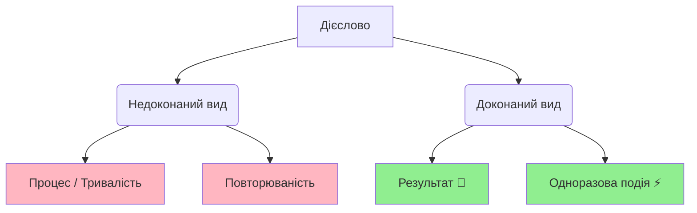

import Quiz from '@site/src/components/Quiz';
import MatchUp from '@site/src/components/MatchUp';
import FillIn from '@site/src/components/FillIn';
import TrueFalse from '@site/src/components/TrueFalse';
import Unjumble from '@site/src/components/Unjumble';
import GroupSort from '@site/src/components/GroupSort';
import Anagram from '@site/src/components/Anagram';
import ErrorCorrection, { ErrorCorrectionItem } from '@site/src/components/ErrorCorrection';
import Cloze from '@site/src/components/Cloze';
import Select from '@site/src/components/Select';
import Translate from '@site/src/components/Translate';
import MarkTheWords, { MarkTheWordsActivity } from '@site/src/components/MarkTheWords';
import HighlightMorphemes, { HighlightMorphemesActivity } from '@site/src/components/HighlightMorphemes';
import EssayResponse from '@site/src/components/EssayResponse';
import ComparativeStudy from '@site/src/components/ComparativeStudy';
import ReadingActivity from '@site/src/components/ReadingActivity';
import CriticalAnalysis from '@site/src/components/CriticalAnalysis';
import AuthorialIntent from '@site/src/components/AuthorialIntent';

> 🎯 **Чому це важливо?**
>
> У минулому часі вибір виду залежить не лише від частоти дії. Дуже важливо, на що ви хочете акцентувати увагу: на **результаті** чи на **процесі**. Одна й та сама дія може бути описана обома видами, але значення змінюється. Розуміння цієї різниці робить вашу мову точною та природною. Це також ключ до розуміння українського **культурного контексту**.

## Тест

Прочитайте дві розповіді про вчорашній день:

**Розповідь 1 (Акцент на результаті):**
> Вчора я **прочитав** книгу, **написав** статтю і **відправив** електронну пошту. Книга тепер прочитана. Стаття готова. Лист відправлений. Усі завдання виконані!

**Розповідь 2 (Акцент на процесі):**
> Вчора я **читав** книгу три години, **писав** статтю весь вечір і **відправляв** електронні листи до півночі. Я багато працював. Я був дуже зайнятий усіма цими процесами.

**Запитання:** Яка різниця між двома розповідями?

- **Перша розповідь** підкреслює **результати**: книга прочитана, стаття написана, лист відправлений. Акцент на **завершених діях**. Використано **доконаний вид** (ДВ).

- **Друга розповідь** підкреслює **процеси та їхню тривалість**: скільки часу читав, коли писав, до якого часу відправляв. Акцент на **діяльності, а не на результаті**. Використано **недоконаний вид** (НДВ).

**Висновок:** Один вид показує, **що досягнуто**. Інший вид показує, **чим займався**.

---

## Пояснення

### Доконаний вид: акцент на результаті

Коли важливо підкреслити, що дія **завершена** і є **результат**, використовуємо **доконаний вид (ДВ)**.

**Типові ознаки акценту на результаті:**

| Контекст | Приклад | Чому ДВ? |
|----------|---------|----------|
| **Завдання виконано** | Я **прочитав** усю книгу. | Книга тепер прочитана. |
| **Мета досягнута** | Вона **вивчила** всі слова. | Слова тепер вивчені. |
| **Продукт готовий** | Ми **написали** звіт. | Звіт готовий. |
| **Проблема вирішена** | Він **виправив** помилку. | Помилка виправлена. |
| **Зміна відбулася** | Вони **переїхали** до Києва. | Тепер живуть у Києві. |

**Маркери результату:**

- **нарешті** (finally) — показує досягнення результату після зусиль
- **вже** (already) — показує, що результат є
- **успішно** (successfully) — показує позитивний результат
- **вдалося** (managed to) — показує досягнення результату
- **до кінця** (to the end, completely) — показує повне завершення

**Приклади:**

1. Нарешті **я вивчив** усі відмінки української мови.
   *(Finally I learned all Ukrainian cases. — Result: now I know them)*

2. Вона вже **написала** дисертацію і захистилася.
   *(She already wrote her dissertation and defended it. — Result: dissertation complete)*

3. Йому вдалося **вирішити** цю складну задачу.
   *(He managed to solve this difficult problem. — Result: problem solved)*

4. Ми **прочитали** книгу до кінця і зрозуміли всю історію.
   *(We read the book to the end and understood the whole story. — Result: book finished)*

> 💡 **Знаєте?**
>
> Коли українці розповідають про свої досягнення, вони використовують доконаний вид: "Я **зробив**, **досяг**, **створив**, **побудував**." Це показує результати та успіхи, а не просто діяльність.

> 🌍 **На практиці: У ресторані**
>
> Уявіть, що ви у ресторані. Офіціант питає: «Ви вже **вибрали** страву?» (ДВ — є результат). Якщо ви ще не готові: «Ні, я ще **вибираю**...» (НДВ — процес). Коли ви готові: «Так, я **вибрав** рибу!» (ДВ — рішення прийнято).

---

### Недоконаний вид: акцент на процесі

Коли важливо підкреслити **тривалість**, **процес**, **діяльність**, а не результат, використовуємо **недоконаний вид (НДВ)**.

**Типові ознаки акценту на процесі:**

| Контекст | Приклад | Чому НДВ? |
|----------|---------|----------|
| **Тривалість дії** | Я **читав** книгу три години. | Акцент на процесі та часі. |
| **Зайнятість** | Вона **писала** листи весь день. | Показує, чим займалася. |
| **Діяльність без акценту на результат** | Ми **вивчали** мову п'ять років. | Акцент на процесі навчання. |
| **Фонова дія** | Поки він **працював**, я **готував** обід. | Дії як фон для іншого. |
| **Опис зайнятості** | Вчора я **робив** домашнє завдання. | Що робив, а не що зробив. |

**Маркери процесу та тривалості:**

- **весь день/вечір** (all day/evening) — показує тривалість
- **протягом** (during, for the duration of) — показує період
- **годину/хвилину** (for an hour/minute) — вказує тривалість
- **довго** (for a long time) — підкреслює тривалість
- **весь час** (all the time) — показує безперервність
- **поки** (while) — показує фонову дію
- **під час** (during) — показує одночасність

**Приклади:**

1. Я **читав** цю книгу цілий тиждень, але не закінчив.
   *(I was reading this book for a whole week, but didn't finish. — Focus on process)*

2. Вона **писала** статтю три дні, а потім зрозуміла, що треба все переробити.
   *(She was writing the article for three days, then realized she had to redo everything. — Focus on activity)*

3. Ми **вивчали** українську мову протягом усього семестру.
   *(We were studying Ukrainian throughout the semester. — Focus on process)*

4. Поки він **готував** вечерю, я **дивився** новини.
   *(While he was preparing dinner, I was watching the news. — Background actions)*

> 🌍 **У реальному житті**
>
> Коли українці описують, чим займалися, вони використовують НДВ: "Я **працював**, **вчився**, **займався** спортом." Коли хочуть показати результати: "Я **закінчив** університет, **отримав** диплом, **знайшов** роботу."

> 🇺🇦 **Культурний момент: Толока**
>
> **Толока** — це давня українська традиція спільної праці. Люди разом **будували** (НДВ - процес) хату для сусідів. Вони **працювали** (НДВ), **співали** (НДВ) і **допомагали** (НДВ) один одному весь день. Але головна мета — вони **збудували** (ДВ - результат) хату за один день! Толока поєднує радість від **процесу** спілкування і важливість спільного **результату**.

> 🇺🇦 **Культурний момент: Петриківський розпис**
>
> У селі **Петриківка** на Дніпропетровщині майстрині століттями **розписували** (НДВ - процес) хати, скрині та посуд. Вони **малювали** (НДВ) годинами, але результат — вони **створили** (ДВ) унікальний стиль! Петриківський розпис — це свідчення української творчості: довгий **процес** навчання веде до прекрасного **результату**.

---

### Контраст: той самий факт, різний акцент

Одну й ту саму ситуацію можна описати обома видами, але акцент змінюється:

| Доконаний вид (Результат) | Недоконаний вид (Процес) |
|---------------------------|-------------------------|
| Я **прочитав** книгу. (Книга прочитана.) | Я **читав** книгу дві години. (Акцент на процесі.) |
| Вона **написала** листа. (Лист готовий.) | Вона **писала** листа цілий вечір. (Акцент на тривалості.) |
| Він **вивчив** мову. (Тепер знає.) | Він **вивчав** мову п'ять років. (Акцент на процесі навчання.) |
| Ми **побудували** будинок. (Будинок готовий.) | Ми **будували** будинок три роки. (Акцент на процесі.) |
| Вони **вирішили** проблему. (Проблеми більше немає.) | Вони **вирішували** проблему весь день. (Акцент на зусиллях.) |

**Правило:**
> **Якщо важливий результат → доконаний вид.**
> **Якщо важливий процес, тривалість, зайнятість → недоконаний вид.**

> 🎬 **Поп-культура**
>
> У фільмі "Тіні забутих предків" є сцена: "Весь день **косив**, косив траву..." (All day long he was mowing, mowing grass...). Використано НДВ "косив" двічі, щоб підкреслити тривалість, монотонність, безперервність процесу. Якби сказали "**скосив**" (ДВ), акцент був би на результаті: трава скошена.

---

### Особливі випадки

#### 1. **"Вже" з обома видами**

Слово **"вже"** (already) може вживатися з обома видами, але значення різне:

- **Вже + ДВ** = результат уже є
  - Я **вже прочитав** цю книгу. *(I've already read this book. — Result exists)*

- **Вже + НДВ** = процес уже триває
  - Я **вже читав** цю книгу раніше. *(I already read this book before. — General past fact)*

#### 2. **"Поки" (while) — завжди НДВ**

Коли описуємо фонову дію, що триває паралельно з іншою, використовуємо **тільки НДВ**:

- Поки я **читав**, вона **готувала** обід.
  *(While I was reading, she was preparing lunch.)*

❌ Неправильно: *Поки я **прочитав**, вона **приготувала** обід.*

#### 3. **Тривалість без результату**

Якщо вказана тривалість, але не підкреслено завершення, використовуємо НДВ:

- Я **писав** листа годину, але не закінчив.
  *(I was writing a letter for an hour, but didn't finish. — НДВ shows process)*

Якщо є і тривалість, і результат, використовуємо ДВ:

- За годину я **написав** три листи.
  *(In an hour I wrote three letters. — ДВ shows result achieved)*

> 💡 **Корисна порада**
>
> Якщо після опису дії можна додати **"і тепер..."** (and now...) із результатом, використовуйте ДВ. Якщо після опису природно звучить **"і це тривало..."** (and it lasted...), використовуйте НДВ.

> 🗣️ **Прислів'я**
>
> **"Зробив діло — гуляй сміло."**
> *(Done the deed — walk boldly / Work done, time for fun.)*
>
> **Зробив** (ДВ) — підкреслює, що робота повністю завершена, є результат. Тільки після цього можна відпочивати.

> 🛑 **Міф: Вид дієслова неможливо зрозуміти**
>
> Багато студентів бояться виду. Їм кажуть: "Треба просто запам'ятати".
>
> **Це неправда!** Вид має чітку логіку:
> - **Процес/Тривалість** = Недоконаний (що робив?)
> - **Результат/Завершення** = Доконаний (що зробив?)
>
> Це як в англійській: *Continuous (I was doing)* vs *Perfect (I have done)*. Система працює логічно!

> 🗣️ **Прислів'я**
>
> **"Сім разів відміряй, один раз відріж."**
> *(Measure seven times, cut once.)*
>
> **Відміряй** (процес) — треба робити уважно і довго. **Відріж** (результат) — це одна швидка, завершена дія.

---

## Практика

### Як обрати вид: результат чи процес?

Задайте собі ці питання:

**1. Що важливіше — результат чи діяльність?**
   - **Результат** → Доконаний вид: "Я **прочитав** книгу." (Книга прочитана.)
   - **Діяльність** → Недоконаний вид: "Я **читав** книгу." (Чим займався.)

**2. Чи вказана тривалість дії?**
   - **Так** → Зазвичай НДВ: "Я **читав** книгу дві години."
   - **Ні, але є результат** → ДВ: "Я **прочитав** книгу."

**3. Чи хочете показати завершеність?**
   - **Так** → ДВ: "Нарешті **я закінчив** роботу."
   - **Ні, процес важливіший** → НДВ: "Я **працював** над цим весь місяць."

**4. Чи є слова "нарешті", "вдалося", "до кінця"?**
   - **Так** → Зазвичай ДВ (показує досягнення результату)

**5. Чи є слова "весь день", "протягом", "поки"?**
   - **Так** → Зазвичай НДВ (показує процес і тривалість)

---

### Типові помилки та як їх уникнути

**Помилка 1: Використання ДВ з маркером тривалості**

❌ Неправильно: *Я **прочитав** книгу три години.*

✅ Правильно: *Я **читав** книгу три години.*

**Чому?** Коли вказана тривалість без акценту на завершення, потрібен НДВ.

---

**Помилка 2: Використання НДВ з маркером результату**

❌ Неправильно: *Нарешті я **писав** цю статтю.*

✅ Правильно: *Нарешті я **написав** цю статтю.*

**Чому?** "Нарешті" показує досягнення результату після очікування, тому потрібен ДВ.

---

**Помилка 3: ДВ у фоновій дії з "поки"**

❌ Неправильно: *Поки я **прочитав** книгу, він **приготував** обід.*

✅ Правильно: *Поки я **читав** книгу, він **готував** обід.*

**Чому?** "Поки" описує фонову паралельну дію, завжди потрібен НДВ.

---

**Помилка 4: Плутанина з "вже"**

❌ Неправильно контекст: *Я **вже прочитав** цю книгу раніше, тому не хочу її брати.*

✅ Правильно: *Я **вже читав** цю книгу раніше, тому не хочу її брати.*

**Чому?** Контекст показує загальний факт із минулого ("раніше"), а не результат, що існує зараз. Потрібен НДВ.

---

### Вид у повсякденному спілкуванні

**На роботі (звіт про день):**

- **Акцент на результатах:** "Сьогодні я **написав** три звіти, **відправив** десять листів і **підготував** презентацію." *(ДВ — показує досягнення)*

- **Акцент на зайнятості:** "Сьогодні я **писав** звіти, **відправляв** листи і **готував** презентацію весь день." *(НДВ — показує зайнятість)*

**У навчанні (розповідь про підготовку):**

- **Акцент на результаті:** "Я **вивчив** усі правила і **склав** іспит." *(ДВ — показує успіх)*

- **Акцент на процесі:** "Я **вивчав** правила цілий тиждень і довго **готувався** до іспиту." *(НДВ — показує зусилля)*

**У повсякденному житті (розповідь про вихідні):**

- **Акцент на результатах:** "Я **прочитав** книгу, **подивився** фільм і **відпочив**." *(ДВ — що зроблено)*

- **Акцент на процесі:** "Я **читав**, **дивився** фільми і **відпочивав** весь вихідний." *(НДВ — як провів час)*

> 🎯 **Цікавинка**
>
> У резюме та на співбесідах українці використовують ДВ для опису досягнень: "**Розробив** нову систему, **збільшив** продажі на 30%, **керував** командою з 10 осіб." Це показує конкретні результати, а не просто діяльність.

> 🇺🇦 **Культурний момент: Літопис Нестора**
>
> У **Києво-Печерській лаврі** монах Нестор **писав** (НДВ) свій знаменитий літопис багато років. Він **працював** (НДВ), **збирав** (НДВ) матеріали, **розпитував** (НДВ) людей. Але результат: він **написав** (ДВ) «Повість минулих літ» — найважливіший документ української історії! Коли Нестор описував **процеси** (князі **правили**, **будували**), він вживав НДВ. Коли описував **події** (князь **хрестив** Русь, **заклав** собор), він вживав ДВ.

---

## Діалоги

### Діалог 1: Після роботи

**Оля:** Як пройшов твій день?

**Максим:** Продуктивно! Я **написав** звіт, **підготував** презентацію і **провів** дві зустрічі.

**Оля:** Ого, і все це за один день?

**Максим:** Так, але **працював** я з ранку до вечора. **Готував** презентацію три години, **писав** звіт дві години.

**Оля:** Тобто ти був дуже зайнятий?

**Максим:** Дуже. Але найголовніше — усе **завершив** вчасно і **відправив** начальнику.

---

### Діалог 2: У бібліотеці

**Студент:** Ти **прочитав** ту книгу, яку я рекомендував?

**Студентка:** **Читала** її весь тиждень, але ще не **закінчила**.

**Студент:** Довга книга?

**Студентка:** Дуже. Я **читала** по дві години щодня, але прочитала лише половину.

**Студент:** А коли плануєш **прочитати** до кінця?

**Студентка:** Думаю, **закінчу** на вихідних, якщо буду **читати** довше.

---

### Діалог 3: Про домашнє завдання

**Вчитель:** Чому ти не **здав** домашнє завдання?

**Учень:** Я **робив** його весь вечір, але не встигнув **зробити** все.

**Вчитель:** Скільки часу ти **працював** над завданням?

**Учень:** Я **писав** твір дві години, **вирішував** задачі годину. Але не **закінчив**.

**Вчитель:** Добре. **Закінчи** вдома і здай завтра. Що ти вже **зробив**?

**Учень:** Я **написав** вступ до твору і **вирішив** п'ять задач із десяти.

---

### Діалог 4: Про переїзд

**Марта:** Ти вже **переїхала** до нової квартири?

**Софія:** Так, **переїхала** минулого тижня. Але ще **розпаковую** речі.

**Марта:** Довго **збирала** речі перед переїздом?

**Софія:** Цілий тиждень **пакувала**, **сортувала**, **викидала** старі речі. Нарешті **зібрала** все і **перевезла**.

**Марта:** І як нова квартира?

**Софія:** Чудова! Вчора я весь день **розставляла** меблі і **прикрашала** кімнати. Але ще не **розставила** все як треба.

---

### Діалог 5: Про книгу

**Читач 1:** Ти **читав** останній роман Жадана?

**Читач 2:** Так, **прочитав** торік. Вражаюча книга!

**Читач 1:** Довго **читав**?

**Читач 2:** Я **читав** її два тижні. **Читав** кожного вечора перед сном. Нарешті **прочитав** до кінця і був під враженням.

**Читач 1:** Я тільки почав. Поки що **читаю** повільно, але вже **прочитав** перших три розділи.

**Читач 2:** Продовжуй! Коли **прочитаєш** до кінця, обов'язково обговоримо.

---

### Діалог 6: На іспиті

**Екзаменатор:** Ви **готувалися** до іспиту?

**Студентка:** Так, **готувалася** весь місяць. **Вивчала** всі теми, **робила** вправи, **повторювала** граматику.

**Екзаменатор:** І що конкретно ви **вивчили**?

**Студентка:** Я **вивчила** всі відмінки, **опанувала** аспекти дієслів і **зрозуміла** систему дієслів руху.

**Екзаменатор:** Добре. Скільки часу ви **витратили** на підготовку?

**Студентка:** **Займалася** по три години щодня протягом місяця. Нарешті **підготувалася** повністю.

---

## 📋 Підсумок

**Що ви навчилися:**

1. **Доконаний вид** підкреслює **результат, завершеність** дії (Я прочитав книгу — книга прочитана).
2. **Недоконаний вид** підкреслює **процес, тривалість, зайнятість** (Я читав книгу три години — акцент на процесі).
3. Маркери **результату** (нарешті, вже, вдалося, до кінця) вимагають **доконаного виду**.
4. Маркери **тривалості** (весь день, протягом, годину, поки) вимагають **недоконаного виду**.
5. Один факт може бути описаний **обома видами** залежно від того, що ви хочете підкреслити: результат чи процес.

**Основне правило:**

> **Результат, завершення, досягнення → доконаний вид.**
> **Процес, тривалість, зайнятість → недоконаний вид.**

**Далі:**

У наступних модулях ми розглянемо:
- **Модуль 09:** Вид у майбутньому часі (буду робити vs зроблю)
- **Модуль 10:** Вид у запереченні (не робив vs не зробив)
- **Модуль 11:** Вид в наказовому способі (роби! vs зроби!)

> ✅ **Самоперевірка**
>
> Чи можете ви:
> - [ ] Відрізнити акцент на результаті від акценту на процесі?
> - [ ] Правильно обрати вид на основі маркерів (нарешті, весь день, протягом)?
> - [ ] Пояснити, чому "Я читав книгу" відрізняється від "Я прочитав книгу"?
> - [ ] Описати одну дію двома видами, змінюючи акцент?
>
> Якщо так — ви готові до практики!

:::info[🔗 Зовнішні ресурси]

**🎧 Подкасти:**
- [ULP 3-118 Весілля в Україні – Wedding in Ukraine + Using “щоб” with the past tense in Ukrainian](https://www.ukrainianlessons.com/lesson/118/) — Level-aligned topic match: past
- [ULP 3-91 Рекомендації – Asking for advice in Ukrainian + Using imperfective and perfective  verb aspects in Ukrainian](https://www.ukrainianlessons.com/lesson/91/) — Level-aligned topic match: aspect, imperfective, perfective
- [ULP 3-92 На блошиному ринку – At the flea market in Ukraine + Forming perfective aspect in Ukrainian](https://www.ukrainianlessons.com/lesson/92/) — Level-aligned topic match: aspect, perfective
- [ULP 3-94 У піцерії – At the pizzeria + Sound changes between imperfective and perfective verbs in Ukrainian](https://www.ukrainianlessons.com/lesson/94/) — Level-aligned topic match: imperfective, perfective
- [ULP 3-96 Новорічні свята в школі – New Year's celebrations at school + Perfective future tense in Ukrainian](https://www.ukrainianlessons.com/lesson/96/) — Level-aligned topic match: perfective

**📖 Статті:**
- [UkrainianLessons Podcast on Aspect](https://www.ukrainianlessons.com/) — подкаст урок
- [Вид дієслова на Вікіпедії](https://uk.wikipedia.org/wiki/Дієслівний_вид) — докладна стаття

**🌐 Сайти:**
- [Ukrainian Aspect Video](https://www.youtube.com/results?search_query=ukrainian+verb+aspect) — відео пояснення
:::

## 📚 Словник

| Word | IPA | English | POS | Gender | Note |
| --- | --- | --- | --- | --- | --- |
| викидати | /vɪkɪˈdatɪ/ | to throw out | verb | ж |  |
| відрізати | /vidˈrʲizatɪ/ | to cut off | verb | ч |  |
| екзаменатор | /ɛkzameˈnatɔr/ | examiner | noun | ч |  |
| задач | /zaˈdat͡ʃ/ | tasks (gen. pl.) | noun | ж |  |
| закінчити | /zaˈkʲint͡ʃɪtɪ/ | to finish | verb |  |  |
| майстер | /ˈmajstɛr/ | master | noun | ж |  |
| марта | /ˈmarta/ | Marta | name | ж |  |
| монотонність | /mɔnɔˈtɔnʲːisʲtʲ/ | monotony | noun | ж |  |
| найголовніше | /najɦɔlɔu̯ˈnʲiʃɛ/ | most importantly | noun | с |  |
| одночасність | /ɔdnɔˈt͡ʃasnʲisʲtʲ/ | simultaneity | noun | ж |  |
| пакувати | /pakuˈvatɪ/ | to pack | verb | ж |  |
| петриківка | /pɛtrɪˈkʲiu̯ka/ | Petrykivka style | name | ж |  |
| продуктивно | /prɔdukˈtɪu̯nɔ/ | productively | adv |  |  |
| розпаковувати | /rɔzpakoˈvuvatɪ/ | to unpack | verb |  |  |
| розписувати | /rɔzˈpɪsuvatɪ/ | to paint | verb |  |  |
| розставляти | /rɔzstaˈu̯lʲatɪ/ | to arrange | verb | ж |  |
| скосити | /skɔˈsɪtɪ/ | to mow | verb | ч |  |
| скошений | /ˈskɔʃɛnɪj/ | mown | adj | ж |  |
| скриня | /ˈskrɪnʲa/ | chest | noun | ж |  |
| сміло | /ˈsmʲiɫɔ/ | boldly | adv |  |  |
| сортувати | /sɔrtuˈvatɪ/ | to sort | verb | ж |  |
| співбесід | /spiu̯ˈbɛsid/ | interviews (gen. pl.) | noun | ч |  |
| толока | /tɔˈlɔka/ | toloka | noun | ж |  |
| фоновий | /ˈfɔnɔvɪj/ | background (adj) | adj | ж |  |
| поступово | /pɔstuˈpɔvɔ/ | gradually | adv |  |  |
| протягом | /prɔˈtʲaɦɔm/ | during | prep |  |  |
| недовго | /nɛˈdɔu̯ɦɔ/ | not long | adv |  |  |
| хвилину | /xvɪˈlɪnu/ | for a minute | noun |  |  |
| щойно | /ˈʃt͡ʃɔjnɔ/ | just now | adv |  |  |
| довго | /ˈdɔu̯ɦɔ/ | long time | adv |  |  |
| досі | /ˈdɔsʲi/ | until now | adv |  |  |
| нарешті | /naˈrɛʃtʲi/ | finally | adv |  |  |
| годину | /xvɪˈlɪnu/ | for an hour | noun |  |  |
| тиждень | /ˈtɪʒdɛnʲ/ | week | noun | ч |  |