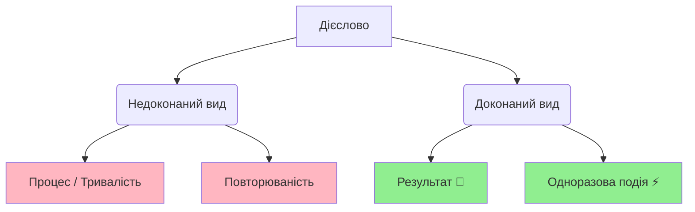

import Quiz from '@site/src/components/Quiz';
import MatchUp from '@site/src/components/MatchUp';
import FillIn from '@site/src/components/FillIn';
import TrueFalse from '@site/src/components/TrueFalse';
import Unjumble from '@site/src/components/Unjumble';
import GroupSort from '@site/src/components/GroupSort';
import Anagram from '@site/src/components/Anagram';
import ErrorCorrection, { ErrorCorrectionItem } from '@site/src/components/ErrorCorrection';
import Cloze from '@site/src/components/Cloze';
import Select from '@site/src/components/Select';
import Translate from '@site/src/components/Translate';
import MarkTheWords, { MarkTheWordsActivity } from '@site/src/components/MarkTheWords';
import HighlightMorphemes, { HighlightMorphemesActivity } from '@site/src/components/HighlightMorphemes';
import EssayResponse from '@site/src/components/EssayResponse';
import ComparativeStudy from '@site/src/components/ComparativeStudy';
import ReadingActivity from '@site/src/components/ReadingActivity';
import CriticalAnalysis from '@site/src/components/CriticalAnalysis';
import AuthorialIntent from '@site/src/components/AuthorialIntent';

> 🎯 **Чому це важливо?**
>
> У минулому часі вибір виду залежить не лише від частоти дії. Дуже важливо, на що ви хочете акцентувати увагу: на **результаті** чи на **процесі**. Одна й та сама дія може бути описана обома видами, але значення змінюється. Розуміння цієї різниці робить вашу мову точною та природною. Це також ключ до розуміння українського **культурного контексту**.

## Тест

Прочитайте дві розповіді про вчорашній день:

**Розповідь 1 (Акцент на результаті):**
> Вчора я **прочитав** книгу, **написав** статтю і **відправив** електронну пошту. Книга тепер прочитана. Стаття готова. Лист відправлений. Усі завдання виконані!

**Розповідь 2 (Акцент на процесі):**
> Вчора я **читав** книгу три години, **писав** статтю весь вечір і **відправляв** електронні листи до півночі. Я багато працював. Я був дуже зайнятий усіма цими процесами.

**Запитання:** Яка різниця між двома розповідями?

- **Перша розповідь** підкреслює **результати**: книга прочитана, стаття написана, лист відправлений. Акцент на **завершених діях**. Використано **доконаний вид** (ДВ).

- **Друга розповідь** підкреслює **процеси та їхню тривалість**: скільки часу читав, коли писав, до якого часу відправляв. Акцент на **діяльності, а не на результаті**. Використано **недоконаний вид** (НДВ).

**Висновок:** Один вид показує, **що досягнуто**. Інший вид показує, **чим займався**.

---

## Пояснення

### Доконаний вид: акцент на результаті

Коли важливо підкреслити, що дія **завершена** і є **результат**, використовуємо **доконаний вид (ДВ)**.

**Типові ознаки акценту на результаті:**

| Контекст | Приклад | Чому ДВ? |
|----------|---------|----------|
| **Завдання виконано** | Я **прочитав** усю книгу. | Книга тепер прочитана. |
| **Мета досягнута** | Вона **вивчила** всі слова. | Слова тепер вивчені. |
| **Продукт готовий** | Ми **написали** звіт. | Звіт готовий. |
| **Проблема вирішена** | Він **виправив** помилку. | Помилка виправлена. |
| **Зміна відбулася** | Вони **переїхали** до Києва. | Тепер живуть у Києві. |

**Маркери результату:**

- **нарешті** (finally) — показує досягнення результату після зусиль
- **вже** (already) — показує, що результат є
- **успішно** (successfully) — показує позитивний результат
- **вдалося** (managed to) — показує досягнення результату
- **до кінця** (to the end, completely) — показує повне завершення

**Приклади:**

1. Нарешті **я вивчив** усі відмінки української мови.
   *(Finally I learned all Ukrainian cases. — Result: now I know them)*

2. Вона вже **написала** дисертацію і захистилася.
   *(She already wrote her dissertation and defended it. — Result: dissertation complete)*

3. Йому вдалося **вирішити** цю складну задачу.
   *(He managed to solve this difficult problem. — Result: problem solved)*

4. Ми **прочитали** книгу до кінця і зрозуміли всю історію.
   *(We read the book to the end and understood the whole story. — Result: book finished)*

> 💡 **Знаєте?**
>
> Коли українці розповідають про свої досягнення, вони використовують доконаний вид: "Я **зробив**, **досяг**, **створив**, **побудував**." Це показує результати та успіхи, а не просто діяльність.

> 🌍 **На практиці: У ресторані**
>
> Уявіть, що ви у ресторані. Офіціант питає: «Ви вже **вибрали** страву?» (ДВ — є результат). Якщо ви ще не готові: «Ні, я ще **вибираю**...» (НДВ — процес). Коли ви готові: «Так, я **вибрав** рибу!» (ДВ — рішення прийнято).

---

### Недоконаний вид: акцент на процесі

Коли важливо підкреслити **тривалість**, **процес**, **діяльність**, а не результат, використовуємо **недоконаний вид (НДВ)**.

**Типові ознаки акценту на процесі:**

| Контекст | Приклад | Чому НДВ? |
|----------|---------|----------|
| **Тривалість дії** | Я **читав** книгу три години. | Акцент на процесі та часі. |
| **Зайнятість** | Вона **писала** листи весь день. | Показує, чим займалася. |
| **Діяльність без акценту на результат** | Ми **вивчали** мову п'ять років. | Акцент на процесі навчання. |
| **Фонова дія** | Поки він **працював**, я **готував** обід. | Дії як фон для іншого. |
| **Опис зайнятості** | Вчора я **робив** домашнє завдання. | Що робив, а не що зробив. |

**Маркери процесу та тривалості:**

- **весь день/вечір** (all day/evening) — показує тривалість
- **протягом** (during, for the duration of) — показує період
- **годину/хвилину** (for an hour/minute) — вказує тривалість
- **довго** (for a long time) — підкреслює тривалість
- **весь час** (all the time) — показує безперервність
- **поки** (while) — показує фонову дію
- **під час** (during) — показує одночасність

**Приклади:**

1. Я **читав** цю книгу цілий тиждень, але не закінчив.
   *(I was reading this book for a whole week, but didn't finish. — Focus on process)*

2. Вона **писала** статтю три дні, а потім зрозуміла, що треба все переробити.
   *(She was writing the article for three days, then realized she had to redo everything. — Focus on activity)*

3. Ми **вивчали** українську мову протягом усього семестру.
   *(We were studying Ukrainian throughout the semester. — Focus on process)*

4. Поки він **готував** вечерю, я **дивився** новини.
   *(While he was preparing dinner, I was watching the news. — Background actions)*

> 🌍 **У реальному житті**
>
> Коли українці описують, чим займалися, вони використовують НДВ: "Я **працював**, **вчився**, **займався** спортом." Коли хочуть показати результати: "Я **закінчив** університет, **отримав** диплом, **знайшов** роботу."

> 🇺🇦 **Культурний момент: Толока**
>
> **Толока** — це давня українська традиція спільної праці. Люди разом **будували** (НДВ - процес) хату для сусідів. Вони **працювали** (НДВ), **співали** (НДВ) і **допомагали** (НДВ) один одному весь день. Але головна мета — вони **збудували** (ДВ - результат) хату за один день! Толока поєднує радість від **процесу** спілкування і важливість спільного **результату**.

> 🇺🇦 **Культурний момент: Петриківський розпис**
>
> У селі **Петриківка** на Дніпропетровщині майстрині століттями **розписували** (НДВ - процес) хати, скрині та посуд. Вони **малювали** (НДВ) годинами, але результат — вони **створили** (ДВ) унікальний стиль! Петриківський розпис — це свідчення української творчості: довгий **процес** навчання веде до прекрасного **результату**.

---

### Контраст: той самий факт, різний акцент

Одну й ту саму ситуацію можна описати обома видами, але акцент змінюється:

| Доконаний вид (Результат) | Недоконаний вид (Процес) |
|---------------------------|-------------------------|
| Я **прочитав** книгу. (Книга прочитана.) | Я **читав** книгу дві години. (Акцент на процесі.) |
| Вона **написала** листа. (Лист готовий.) | Вона **писала** листа цілий вечір. (Акцент на тривалості.) |
| Він **вивчив** мову. (Тепер знає.) | Він **вивчав** мову п'ять років. (Акцент на процесі навчання.) |
| Ми **побудували** будинок. (Будинок готовий.) | Ми **будували** будинок три роки. (Акцент на процесі.) |
| Вони **вирішили** проблему. (Проблеми більше немає.) | Вони **вирішували** проблему весь день. (Акцент на зусиллях.) |

**Правило:**
> **Якщо важливий результат → доконаний вид.**
> **Якщо важливий процес, тривалість, зайнятість → недоконаний вид.**

> 🎬 **Поп-культура**
>
> У фільмі "Тіні забутих предків" є сцена: "Весь день **косив**, косив траву..." (All day long he was mowing, mowing grass...). Використано НДВ "косив" двічі, щоб підкреслити тривалість, монотонність, безперервність процесу. Якби сказали "**скосив**" (ДВ), акцент був би на результаті: трава скошена.

---

### Особливі випадки

#### 1. **"Вже" з обома видами**

Слово **"вже"** (already) може вживатися з обома видами, але значення різне:

- **Вже + ДВ** = результат уже є
  - Я **вже прочитав** цю книгу. *(I've already read this book. — Result exists)*

- **Вже + НДВ** = процес уже триває
  - Я **вже читав** цю книгу раніше. *(I already read this book before. — General past fact)*

#### 2. **"Поки" (while) — завжди НДВ**

Коли описуємо фонову дію, що триває паралельно з іншою, використовуємо **тільки НДВ**:

- Поки я **читав**, вона **готувала** обід.
  *(While I was reading, she was preparing lunch.)*

❌ Неправильно: *Поки я **прочитав**, вона **приготувала** обід.*

#### 3. **Тривалість без результату**

Якщо вказана тривалість, але не підкреслено завершення, використовуємо НДВ:

- Я **писав** листа годину, але не закінчив.
  *(I was writing a letter for an hour, but didn't finish. — НДВ shows process)*

Якщо є і тривалість, і результат, використовуємо ДВ:

- За годину я **написав** три листи.
  *(In an hour I wrote three letters. — ДВ shows result achieved)*

> 💡 **Корисна порада**
>
> Якщо після опису дії можна додати **"і тепер..."** (and now...) із результатом, використовуйте ДВ. Якщо після опису природно звучить **"і це тривало..."** (and it lasted...), використовуйте НДВ.

> 🗣️ **Прислів'я**
>
> **"Зробив діло — гуляй сміло."**
> *(Done the deed — walk boldly / Work done, time for fun.)*
>
> **Зробив** (ДВ) — підкреслює, що робота повністю завершена, є результат. Тільки після цього можна відпочивати.

> 🛑 **Міф: Вид дієслова неможливо зрозуміти**
>
> Багато студентів бояться виду. Їм кажуть: "Треба просто запам'ятати".
>
> **Це неправда!** Вид має чітку логіку:
> - **Процес/Тривалість** = Недоконаний (що робив?)
> - **Результат/Завершення** = Доконаний (що зробив?)
>
> Це як в англійській: *Continuous (I was doing)* vs *Perfect (I have done)*. Система працює логічно!

> 🗣️ **Прислів'я**
>
> **"Сім разів відміряй, один раз відріж."**
> *(Measure seven times, cut once.)*
>
> **Відміряй** (процес) — треба робити уважно і довго. **Відріж** (результат) — це одна швидка, завершена дія.

---

## Практика

### Як обрати вид: результат чи процес?

Задайте собі ці питання:

**1. Що важливіше — результат чи діяльність?**
   - **Результат** → Доконаний вид: "Я **прочитав** книгу." (Книга прочитана.)
   - **Діяльність** → Недоконаний вид: "Я **читав** книгу." (Чим займався.)

**2. Чи вказана тривалість дії?**
   - **Так** → Зазвичай НДВ: "Я **читав** книгу дві години."
   - **Ні, але є результат** → ДВ: "Я **прочитав** книгу."

**3. Чи хочете показати завершеність?**
   - **Так** → ДВ: "Нарешті **я закінчив** роботу."
   - **Ні, процес важливіший** → НДВ: "Я **працював** над цим весь місяць."

**4. Чи є слова "нарешті", "вдалося", "до кінця"?**
   - **Так** → Зазвичай ДВ (показує досягнення результату)

**5. Чи є слова "весь день", "протягом", "поки"?**
   - **Так** → Зазвичай НДВ (показує процес і тривалість)

---

### Типові помилки та як їх уникнути

**Помилка 1: Використання ДВ з маркером тривалості**

❌ Неправильно: *Я **прочитав** книгу три години.*

✅ Правильно: *Я **читав** книгу три години.*

**Чому?** Коли вказана тривалість без акценту на завершення, потрібен НДВ.

---

**Помилка 2: Використання НДВ з маркером результату**

❌ Неправильно: *Нарешті я **писав** цю статтю.*

✅ Правильно: *Нарешті я **написав** цю статтю.*

**Чому?** "Нарешті" показує досягнення результату після очікування, тому потрібен ДВ.

---

**Помилка 3: ДВ у фоновій дії з "поки"**

❌ Неправильно: *Поки я **прочитав** книгу, він **приготував** обід.*

✅ Правильно: *Поки я **читав** книгу, він **готував** обід.*

**Чому?** "Поки" описує фонову паралельну дію, завжди потрібен НДВ.

---

**Помилка 4: Плутанина з "вже"**

❌ Неправильно контекст: *Я **вже прочитав** цю книгу раніше, тому не хочу її брати.*

✅ Правильно: *Я **вже читав** цю книгу раніше, тому не хочу її брати.*

**Чому?** Контекст показує загальний факт із минулого ("раніше"), а не результат, що існує зараз. Потрібен НДВ.

---

### Вид у повсякденному спілкуванні

**На роботі (звіт про день):**

- **Акцент на результатах:** "Сьогодні я **написав** три звіти, **відправив** десять листів і **підготував** презентацію." *(ДВ — показує досягнення)*

- **Акцент на зайнятості:** "Сьогодні я **писав** звіти, **відправляв** листи і **готував** презентацію весь день." *(НДВ — показує зайнятість)*

**У навчанні (розповідь про підготовку):**

- **Акцент на результаті:** "Я **вивчив** усі правила і **склав** іспит." *(ДВ — показує успіх)*

- **Акцент на процесі:** "Я **вивчав** правила цілий тиждень і довго **готувався** до іспиту." *(НДВ — показує зусилля)*

**У повсякденному житті (розповідь про вихідні):**

- **Акцент на результатах:** "Я **прочитав** книгу, **подивився** фільм і **відпочив**." *(ДВ — що зроблено)*

- **Акцент на процесі:** "Я **читав**, **дивився** фільми і **відпочивав** весь вихідний." *(НДВ — як провів час)*

> 🎯 **Цікавинка**
>
> У резюме та на співбесідах українці використовують ДВ для опису досягнень: "**Розробив** нову систему, **збільшив** продажі на 30%, **керував** командою з 10 осіб." Це показує конкретні результати, а не просто діяльність.

> 🇺🇦 **Культурний момент: Літопис Нестора**
>
> У **Києво-Печерській лаврі** монах Нестор **писав** (НДВ) свій знаменитий літопис багато років. Він **працював** (НДВ), **збирав** (НДВ) матеріали, **розпитував** (НДВ) людей. Але результат: він **написав** (ДВ) «Повість минулих літ» — найважливіший документ української історії! Коли Нестор описував **процеси** (князі **правили**, **будували**), він вживав НДВ. Коли описував **події** (князь **хрестив** Русь, **заклав** собор), він вживав ДВ.

---

## Діалоги

### Діалог 1: Після роботи

**Оля:** Як пройшов твій день?

**Максим:** Продуктивно! Я **написав** звіт, **підготував** презентацію і **провів** дві зустрічі.

**Оля:** Ого, і все це за один день?

**Максим:** Так, але **працював** я з ранку до вечора. **Готував** презентацію три години, **писав** звіт дві години.

**Оля:** Тобто ти був дуже зайнятий?

**Максим:** Дуже. Але найголовніше — усе **завершив** вчасно і **відправив** начальнику.

---

### Діалог 2: У бібліотеці

**Студент:** Ти **прочитав** ту книгу, яку я рекомендував?

**Студентка:** **Читала** її весь тиждень, але ще не **закінчила**.

**Студент:** Довга книга?

**Студентка:** Дуже. Я **читала** по дві години щодня, але прочитала лише половину.

**Студент:** А коли плануєш **прочитати** до кінця?

**Студентка:** Думаю, **закінчу** на вихідних, якщо буду **читати** довше.

---

### Діалог 3: Про домашнє завдання

**Вчитель:** Чому ти не **здав** домашнє завдання?

**Учень:** Я **робив** його весь вечір, але не встигнув **зробити** все.

**Вчитель:** Скільки часу ти **працював** над завданням?

**Учень:** Я **писав** твір дві години, **вирішував** задачі годину. Але не **закінчив**.

**Вчитель:** Добре. **Закінчи** вдома і здай завтра. Що ти вже **зробив**?

**Учень:** Я **написав** вступ до твору і **вирішив** п'ять задач із десяти.

---

### Діалог 4: Про переїзд

**Марта:** Ти вже **переїхала** до нової квартири?

**Софія:** Так, **переїхала** минулого тижня. Але ще **розпаковую** речі.

**Марта:** Довго **збирала** речі перед переїздом?

**Софія:** Цілий тиждень **пакувала**, **сортувала**, **викидала** старі речі. Нарешті **зібрала** все і **перевезла**.

**Марта:** І як нова квартира?

**Софія:** Чудова! Вчора я весь день **розставляла** меблі і **прикрашала** кімнати. Але ще не **розставила** все як треба.

---

### Діалог 5: Про книгу

**Читач 1:** Ти **читав** останній роман Жадана?

**Читач 2:** Так, **прочитав** торік. Вражаюча книга!

**Читач 1:** Довго **читав**?

**Читач 2:** Я **читав** її два тижні. **Читав** кожного вечора перед сном. Нарешті **прочитав** до кінця і був під враженням.

**Читач 1:** Я тільки почав. Поки що **читаю** повільно, але вже **прочитав** перших три розділи.

**Читач 2:** Продовжуй! Коли **прочитаєш** до кінця, обов'язково обговоримо.

---

### Діалог 6: На іспиті

**Екзаменатор:** Ви **готувалися** до іспиту?

**Студентка:** Так, **готувалася** весь місяць. **Вивчала** всі теми, **робила** вправи, **повторювала** граматику.

**Екзаменатор:** І що конкретно ви **вивчили**?

**Студентка:** Я **вивчила** всі відмінки, **опанувала** аспекти дієслів і **зрозуміла** систему дієслів руху.

**Екзаменатор:** Добре. Скільки часу ви **витратили** на підготовку?

**Студентка:** **Займалася** по три години щодня протягом місяця. Нарешті **підготувалася** повністю.

---

## 📋 Підсумок

**Що ви навчилися:**

1. **Доконаний вид** підкреслює **результат, завершеність** дії (Я прочитав книгу — книга прочитана).
2. **Недоконаний вид** підкреслює **процес, тривалість, зайнятість** (Я читав книгу три години — акцент на процесі).
3. Маркери **результату** (нарешті, вже, вдалося, до кінця) вимагають **доконаного виду**.
4. Маркери **тривалості** (весь день, протягом, годину, поки) вимагають **недоконаного виду**.
5. Один факт може бути описаний **обома видами** залежно від того, що ви хочете підкреслити: результат чи процес.

**Основне правило:**

> **Результат, завершення, досягнення → доконаний вид.**
> **Процес, тривалість, зайнятість → недоконаний вид.**

**Далі:**

У наступних модулях ми розглянемо:
- **Модуль 09:** Вид у майбутньому часі (буду робити vs зроблю)
- **Модуль 10:** Вид у запереченні (не робив vs не зробив)
- **Модуль 11:** Вид в наказовому способі (роби! vs зроби!)

> ✅ **Самоперевірка**
>
> Чи можете ви:
> - [ ] Відрізнити акцент на результаті від акценту на процесі?
> - [ ] Правильно обрати вид на основі маркерів (нарешті, весь день, протягом)?
> - [ ] Пояснити, чому "Я читав книгу" відрізняється від "Я прочитав книгу"?
> - [ ] Описати одну дію двома видами, змінюючи акцент?
>
> Якщо так — ви готові до практики!

---

## Потрібно більше практики?

- Ведіть щоденник українською: записуйте свої думки та плани, звертаючи увагу на вибір виду
- Перегляньте українські фільми та серіали, зверніть увагу на вживання виду в діалогах
- Практикуйте з партнером: обговорюйте різні теми, свідомо використовуючи обидва види
- Читайте українську літературу та аналізуйте вибір виду в різних контекстах
- Виконуйте додаткові вправи на платформах для вивчення української мови

:::info[🔗 Зовнішні ресурси]

**🎧 Подкасти:**
- [ULP 3-118 Весілля в Україні – Wedding in Ukraine + Using “щоб” with the past tense in Ukrainian](https://www.ukrainianlessons.com/lesson/118/) — Level-aligned topic match: past
- [ULP 3-91 Рекомендації – Asking for advice in Ukrainian + Using imperfective and perfective  verb aspects in Ukrainian](https://www.ukrainianlessons.com/lesson/91/) — Level-aligned topic match: aspect, imperfective, perfective
- [ULP 3-92 На блошиному ринку – At the flea market in Ukraine + Forming perfective aspect in Ukrainian](https://www.ukrainianlessons.com/lesson/92/) — Level-aligned topic match: aspect, perfective
- [ULP 3-94 У піцерії – At the pizzeria + Sound changes between imperfective and perfective verbs in Ukrainian](https://www.ukrainianlessons.com/lesson/94/) — Level-aligned topic match: imperfective, perfective
- [ULP 3-96 Новорічні свята в школі – New Year's celebrations at school + Perfective future tense in Ukrainian](https://www.ukrainianlessons.com/lesson/96/) — Level-aligned topic match: perfective

**📖 Статті:**
- [UkrainianLessons Podcast on Aspect](https://www.ukrainianlessons.com/) — подкаст урок
- [Вид дієслова на Вікіпедії](https://uk.wikipedia.org/wiki/Дієслівний_вид) — докладна стаття

**🌐 Сайти:**
- [Ukrainian Aspect Video](https://www.youtube.com/results?search_query=ukrainian+verb+aspect) — відео пояснення
:::

## 🎯 Вправи

### Результат чи процес?

<Quiz questions={JSON.parse(`[{"question": "Нарешті після довгих зусиль і багатьох спроб я успішно __________ цю складну граматичну тему.", "options": [{"text": "вивчив", "correct": true}, {"text": "вивчав", "correct": false}, {"text": "вивчаю", "correct": false}, {"text": "вивчу", "correct": false}], "explanation": "«Нарешті» + «успішно» вказують на досягнутий результат, тому доконаний вид."}, {"question": "Вчора весь вечір від шостої до одинадцятої години я старанно __________ домашнє завдання з математики.", "options": [{"text": "зробив", "correct": false}, {"text": "робив", "correct": true}, {"text": "роблю", "correct": false}, {"text": "зроблю", "correct": false}], "explanation": "«Весь вечір» + вказаний часовий проміжок підкреслюють тривалість процесу, тому недоконаний вид."}, {"question": "Минулого тижня за три дні інтенсивної роботи вона повністю __________ звіт і здала його керівництву.", "options": [{"text": "підготувала", "correct": true}, {"text": "готувала", "correct": false}, {"text": "готує", "correct": false}, {"text": "готуватиме", "correct": false}], "explanation": "«За три дні» + «повністю» вказують на завершений результат, тому доконаний вид."}, {"question": "Поки батько на кухні __________ вечерю, діти в кімнаті __________ мультфільми по телевізору.", "options": [{"text": "приготував, подивилися", "correct": false}, {"text": "готував, дивилися", "correct": true}, {"text": "готує, дивляться", "correct": false}, {"text": "приготував, дивилися", "correct": false}], "explanation": "«Поки» вказує на паралельні фонові процеси, завжди недоконаний вид для обох дієслів."}, {"question": "Я вже __________ цю цікаву книгу минулого року, тому не хочу читати її знову зараз.", "options": [{"text": "прочитав", "correct": false}, {"text": "читав", "correct": true}, {"text": "читаю", "correct": false}, {"text": "прочитаю", "correct": false}], "explanation": "Контекст «минулого року» + «не хочу знову» показує загальний минулий досвід, а не наявний результат."}, {"question": "Студенти успішно __________ усі складні іспити та отримали дипломи з відзнакою в червні.", "options": [{"text": "склали", "correct": true}, {"text": "складали", "correct": false}, {"text": "складають", "correct": false}, {"text": "складатимуть", "correct": false}], "explanation": "«Успішно» + «отримали дипломи» показує досягнутий результат, тому доконаний вид."}, {"question": "Протягом цілого семестру від вересня до грудня ми регулярно __________ нову українську граматику щотижня.", "options": [{"text": "вивчили", "correct": false}, {"text": "вивчали", "correct": true}, {"text": "вивчаємо", "correct": false}, {"text": "вивчимо", "correct": false}], "explanation": "«Протягом семестру» підкреслює тривалий процес навчання, тому недоконаний вид."}, {"question": "За годину інтенсивної праці він швидко __________ презентацію та відправив її колегам електронною поштою.", "options": [{"text": "підготував", "correct": true}, {"text": "готував", "correct": false}, {"text": "готує", "correct": false}, {"text": "готуватиме", "correct": false}], "explanation": "«За годину» + «та відправив» показує швидко досягнутий результат, тому доконаний вид."}, {"question": "Вчора з ранку до вечора вона цілий день __________ листи різним клієнтам компанії.", "options": [{"text": "написала", "correct": false}, {"text": "писала", "correct": true}, {"text": "пише", "correct": false}, {"text": "напише", "correct": false}], "explanation": "«Цілий день» + «з ранку до вечора» підкреслюють тривалість процесу, а не результат."}, {"question": "Нарешті після місяця копіткої роботи архітектори повністю __________ проєкт нової будівлі до встановленого терміну.", "options": [{"text": "розробили", "correct": true}, {"text": "розробляли", "correct": false}, {"text": "розробляють", "correct": false}, {"text": "розроблятимуть", "correct": false}], "explanation": "«Нарешті» + «повністю» + «до терміну» вказують на завершений результат після зусиль."}, {"question": "Під час довгої зимової відпустки ми багато __________ книги, дивилися фільми та відпочивали.", "options": [{"text": "прочитали, подивилися", "correct": false}, {"text": "читали, дивилися", "correct": true}, {"text": "читаємо, дивимося", "correct": false}, {"text": "прочитаємо, подивимося", "correct": false}], "explanation": "«Під час відпустки» описує загальну зайнятість без акценту на завершення, тому недоконаний вид."}, {"question": "Минулого місяця йому вдалося успішно __________ усі необхідні документи для візи і подати заявку.", "options": [{"text": "зібрати", "correct": true}, {"text": "збирати", "correct": false}, {"text": "збирає", "correct": false}, {"text": "збиратиме", "correct": false}], "explanation": "«Вдалося успішно» показує досягнутий результат після зусиль, тому доконаний вид."}, {"question": "Протягом трьох годин учитель терпляче __________ складну граматичну тему учням, але не всі зрозуміли.", "options": [{"text": "пояснив", "correct": false}, {"text": "пояснював", "correct": true}, {"text": "пояснює", "correct": false}, {"text": "пояснить", "correct": false}], "explanation": "«Протягом трьох годин» + «терпляче» підкреслюють тривалість процесу пояснення, а не результат."}, {"question": "За останній рік компанія стабільно __________ свій прибуток на тридцять відсотків та відкрила нові філії.", "options": [{"text": "збільшила", "correct": true}, {"text": "збільшувала", "correct": false}, {"text": "збільшує", "correct": false}, {"text": "збільшуватиме", "correct": false}], "explanation": "«За рік» + конкретний відсоток + «та відкрила» показує досягнутий результат, тому доконаний вид."}]`)} />

### Маркери результату та процесу

<MatchUp pairs={JSON.parse(`[{"left": "нарешті", "right": "вивчив"}, {"left": "весь день", "right": "вивчав"}, {"left": "вдалося", "right": "вирішити"}, {"left": "протягом", "right": "вирішував"}, {"left": "до кінця", "right": "прочитав"}, {"left": "три години", "right": "читав"}, {"left": "поки", "right": "готував"}, {"left": "успішно", "right": "підготував"}, {"left": "раптом", "right": "зрозумів"}, {"left": "довго", "right": "думав"}, {"left": "вперше", "right": "побачив"}, {"left": "цілий день", "right": "працював"}]`)} />

### Вибір виду — результат чи процес

<Cloze passage={"Нарешті після місяця роботи я [___:0] проєкт і здав його клієнту. Вчора весь вечір вона [___:1] презентацію для завтрашньої зустрічі. За два тижні студенти успішно [___:2] усі теми та склали іспит.\n\nПоки батьки [___:3] вечерю, діти грали у вітальні. Я вже [___:4] цей фільм минулого року, тому знаю сюжет. Протягом усього семестру ми [___:5] українську літературу щотижня.\n\nЗа годину він швидко [___:6] звіт і відправив електронною поштою. Вона цілий день [___:7] листи клієнтам та відповідала на запитання. Йому вдалося [___:8] цю складну проблему за короткий час.\n\nВони довго [___:9] над завданням, але так і не знайшли рішення. Щойно я [___:10] додому, як почався дощ. Ми [___:11] це правило поступово, урок за уроком. Він [___:12] на відповідь лише хвилину, але вона здалася вічністю. Вона [___:13] в цій компанії недовго, лише кілька місяців."} blanks={JSON.parse(`[{"index": 0, "answer": "завершив", "options": ["завершив", "завершував", "завершую", "завершу"]}, {"index": 1, "answer": "готувала", "options": ["готувала", "приготувала", "готує", "приготує"]}, {"index": 2, "answer": "вивчили", "options": ["вивчили", "вивчали", "вивчають", "вивчать"]}, {"index": 3, "answer": "готували", "options": ["готували", "приготували", "готують", "приготують"]}, {"index": 4, "answer": "дивився", "options": ["дивився", "подивився", "дивлюся", "подивлюся"]}, {"index": 5, "answer": "вивчали", "options": ["вивчали", "вивчили", "вивчаємо", "вивчимо"]}, {"index": 6, "answer": "написав", "options": ["написав", "писав", "пише", "напише"]}, {"index": 7, "answer": "писала", "options": ["писала", "написала", "пише", "напише"]}, {"index": 8, "answer": "вирішити", "options": ["вирішити", "вирішував", "вирішує", "вирішуватиме"]}, {"index": 9, "answer": "працювали", "options": ["працювали", "попрацювали", "працюють", "попрацюють"]}, {"index": 10, "answer": "прийшов", "options": ["прийшов", "приходив", "приходжу", "прийду"]}, {"index": 11, "answer": "вивчали", "options": ["вивчали", "вивчили", "вивчаємо", "вивчимо"]}, {"index": 12, "answer": "чекав", "options": ["чекав", "почекав", "чекає", "почекає"]}, {"index": 13, "answer": "працювала", "options": ["працювала", "попрацювала", "працює", "попрацює"]}]`)} />

### Вибір речення за контекстом

<Select questions={JSON.parse(`[{"question": "Оберіть правильне речення для ситуації «Я був дуже зайнятий і працював весь вечір».", "options": [{"text": "Я писав звіт увесь вечір.", "correct": true}, {"text": "Я написав звіт увесь вечір.", "correct": false}, {"text": "Я вже написав звіт.", "correct": false}, {"text": "Я напишу звіт.", "correct": false}], "explanation": ""}, {"question": "Оберіть правильне речення для ситуації «Робота готова, я можу відпочивати».", "options": [{"text": "Я нарешті зробив завдання.", "correct": true}, {"text": "Я робив завдання три години.", "correct": false}, {"text": "Я роблю завдання.", "correct": false}, {"text": "Я потроху робив завдання.", "correct": false}], "explanation": ""}, {"question": "Оберіть правильне речення для ситуації «Дія тривала довго, але ми не знаємо результату».", "options": [{"text": "Вони довго будували хату.", "correct": true}, {"text": "Вони збудували хату за день.", "correct": false}, {"text": "Вони побудують хату.", "correct": false}, {"text": "Вони збудували хату.", "correct": false}], "explanation": ""}, {"question": "Оберіть правильне речення для фонової дії «Поки він спав...».", "options": [{"text": "...я готував сніданок.", "correct": true}, {"text": "...я приготував сніданок.", "correct": false}, {"text": "...я зготував сніданок.", "correct": false}, {"text": "...я готую сніданок.", "correct": false}], "explanation": ""}, {"question": "Оберіть правильне речення для опису досягнення в резюме.", "options": [{"text": "Я розробив нову систему.", "correct": true}, {"text": "Я розробляв нову систему.", "correct": false}, {"text": "Я буду розробляти систему.", "correct": false}, {"text": "Я розробляю систему.", "correct": false}], "explanation": ""}, {"question": "Оберіть правильне речення для опису навчання протягом року.", "options": [{"text": "Ми вивчали мову весь рік.", "correct": true}, {"text": "Ми вивчили мову весь рік.", "correct": false}, {"text": "Ми вивчимо мову.", "correct": false}, {"text": "Ми вивчаємо мову.", "correct": false}], "explanation": ""}]`)} />

### Правда чи неправда про вид

<TrueFalse items={JSON.parse(`[{"statement": "Нарешті я вивчав усі відмінки української мови і склав іспит.", "isTrue": false, "explanation": "Неправильно. «Нарешті» вказує на результат, потрібен ДВ: «вивчив»."}, {"statement": "Вчора весь вечір вона готувала презентацію для зустрічі.", "isTrue": true, "explanation": "Правильно. «Весь вечір» підкреслює тривалість процесу, НДВ «готувала» правильний."}, {"statement": "Поки він читав книгу, я підготував вечерю і накрив на стіл.", "isTrue": false, "explanation": "Неправильно. «Поки» вимагає фонової дії в НДВ для обох: «читав» і «готував»."}, {"statement": "Я вже читав цю книгу минулого року, тому не хочу її брати.", "isTrue": true, "explanation": "Правильно. Контекст показує загальний минулий досвід, НДВ «читав» правильний."}, {"statement": "Протягом місяця студенти вивчили всі теми і склали іспити успішно.", "isTrue": false, "explanation": "Неправильно. «Протягом місяця» підкреслює тривалість, тому: «вивчали» (НДВ). Але «вивчили» можливий, якщо акцент на результаті після місяця."}, {"statement": "За годину інтенсивної праці він написав звіт і відправив начальнику.", "isTrue": true, "explanation": "Правильно. «За годину» + результат (відправив) показує завершену дію, ДВ «написав» правильний."}, {"statement": "Вона цілий день писала листи клієнтам і була дуже втомлена.", "isTrue": true, "explanation": "Правильно. «Цілий день» підкреслює тривалість і зайнятість, НДВ «писала» правильний."}, {"statement": "Йому вдалося вирішувати цю проблему після тривалих зусиль.", "isTrue": false, "explanation": "Неправильно. «Вдалося» показує досягнутий результат, потрібен ДВ: «вирішити»."}]`)} />

### Результат чи процес?

<GroupSort groups={JSON.parse(`{"Результат (ДВ)": ["нарешті", "вдалося", "успішно", "до кінця", "вже", "повністю"], "Процес (НДВ)": ["весь день", "протягом", "годину", "довго", "поки", "весь час"], "Залежить від контексту": ["вчора", "тоді", "цілий тиждень", "під час", "того дня", "за короткий час"]}`)} />

### Речення про результат і процес

<Unjumble items={JSON.parse(`[{"jumbled": "Нарешті / після / місяця / роботи / я / завершив / проєкт / і / здав / його / клієнту / вчасно", "answer": "Нарешті після місяця роботи я завершив проєкт і здав його клієнту вчасно."}, {"jumbled": "Вчора / весь / вечір / вона / готувала / презентацію / для / завтрашньої / важливої / зустрічі / з / партнерами", "answer": "Вчора весь вечір вона готувала презентацію для завтрашньої важливої зустрічі з партнерами."}, {"jumbled": "За / два / тижні / інтенсивного / навчання / студенти / вивчили / всі / теми / та / склали / іспит", "answer": "За два тижні інтенсивного навчання студенти вивчили всі теми та склали іспит."}, {"jumbled": "Поки / батько / на / кухні / готував / вечерю / діти / у / кімнаті / дивилися / мультфільми", "answer": "Поки батько на кухні готував вечерю, діти у кімнаті дивилися мультфільми."}, {"jumbled": "Протягом / усього / семестру / ми / вивчали / українську / граматику / та / робили / багато / вправ", "answer": "Протягом усього семестру ми вивчали українську граматику та робили багато вправ."}, {"jumbled": "За / годину / швидкої / роботи / він / написав / звіт / і / відправив / його / електронною / поштою", "answer": "За годину швидкої роботи він написав звіт і відправив його електронною поштою."}, {"jumbled": "Вона / цілий / день / писала / листи / клієнтам / і / відповідала / на / їхні / численні / запитання", "answer": "Вона цілий день писала листи клієнтам і відповідала на їхні численні запитання."}, {"jumbled": "Йому / вдалося / вирішити / цю / складну / проблему / після / тривалих / зусиль / та / роздумів", "answer": "Йому вдалося вирішити цю складну проблему після тривалих зусиль та роздумів."}]`)} />

### Виправлення помилок виду

<ErrorCorrection>
  <ErrorCorrectionItem sentence="Нарешті я вивчав усі граматичні правила і склав іспит успішно." errorWord="вивчав" correctForm="вивчив" options={JSON.parse(`["вивчав", "вивчив", "вивчаю", "вивчу"]`)} explanation="«Нарешті» вказує на досягнутий результат після зусиль, тому потрібен доконаний вид «вивчив»." />
  <ErrorCorrectionItem sentence="Вчора весь вечір вона приготувала презентацію для важливої зустрічі." errorWord="приготувала" correctForm="готувала" options={JSON.parse(`["приготувала", "готувала", "готує", "приготує"]`)} explanation="«Весь вечір» підкреслює тривалість процесу, тому потрібен недоконаний вид «готувала»." />
  <ErrorCorrectionItem sentence="Поки він прочитав книгу, я приготував вечерю і накрив на стіл." errorWord="прочитав" correctForm="читав" options={JSON.parse(`["прочитав", "читав", "читає", "прочитає"]`)} explanation="«Поки» описує фонову паралельну дію, завжди потрібен недоконаний вид для обох дієслів." />
  <ErrorCorrectionItem sentence="Протягом місяця студенти вивчили українську граматику щотижня і робили вправи." errorWord="вивчили" correctForm="вивчали" options={JSON.parse(`["вивчили", "вивчали", "вивчають", "вивчать"]`)} explanation="«Протягом місяця» + «щотижня» підкреслюють тривалий процес, тому потрібен недоконаний вид «вивчали»." />
  <ErrorCorrectionItem sentence="За годину швидкої роботи він писав звіт і відправив його начальнику." errorWord="писав" correctForm="написав" options={JSON.parse(`["писав", "написав", "пише", "напише"]`)} explanation="«За годину» + «відправив» показують завершений результат, тому потрібен доконаний вид «написав»." />
  <ErrorCorrectionItem sentence="Вона цілий день написала листи клієнтам і відповідала на запитання." errorWord="написала" correctForm="писала" options={JSON.parse(`["написала", "писала", "пише", "напише"]`)} explanation="«Цілий день» підкреслює тривалість зайнятості, тому потрібен недоконаний вид «писала»." />
  <ErrorCorrectionItem sentence="Йому вдалося вирішувати цю складну проблему після довгих зусиль." errorWord="вирішувати" correctForm="вирішити" options={JSON.parse(`["вирішувати", "вирішити", "вирішує", "вирішить"]`)} explanation="«Вдалося» показує досягнутий результат після зусиль, тому потрібен доконаний вид «вирішити»." />
  <ErrorCorrectionItem sentence="Вони довго попрацювали над завданням, але так і не знайшли рішення." errorWord="попрацювали" correctForm="працювали" options={JSON.parse(`["попрацювали", "працювали", "працюють", "попрацюють"]`)} explanation="«Довго» + «але не знайшли рішення» підкреслюють тривалий процес без результату, тому потрібен недоконаний вид «працювали»." />
</ErrorCorrection>

### Вид у контексті

<Cloze passage={"Минулого тижня в мене був дуже напружений тиждень. Я [___:0] до важливої презентації протягом усього тижня. Кожного дня я [___:1] над слайдами кілька годин і [___:2] інформацію з різних джерел. У понеділок я весь день [___:3] наукові статті і [___:4] нотатки. У вівторок я [___:5] текст для презентації три години, але не [___:6], бо матеріалу було дуже багато. Нарешті в середу я [___:7] основну частину тексту і [___:8] робити слайди. За день мені вдалося [___:9] десять слайдів з графіками та діаграмами. У четвер я протягом усього дня [___:10] матеріал і [___:11] помилки. Поки я [___:12] над презентацією, мій колега [___:13] додаткові матеріали для роздачі. Нарешті в п'ятницю я успішно [___:14] всю презентацію і [___:15] її керівництву на перевірку. Я був дуже задоволений результатом!"} blanks={JSON.parse(`[{"index": 0, "answer": "готувався", "options": ["готувався", "приготувався", "готуватися"]}, {"index": 1, "answer": "працював", "options": ["працював", "попрацював", "працювати"]}, {"index": 2, "answer": "збирав", "options": ["збирав", "зібрав", "збирати"]}, {"index": 3, "answer": "читав", "options": ["читав", "прочитав", "читати"]}, {"index": 4, "answer": "робив", "options": ["робив", "зробив", "робити"]}, {"index": 5, "answer": "писав", "options": ["писав", "написав", "писати"]}, {"index": 6, "answer": "закінчив", "options": ["закінчив", "закінчував", "закінчувати"]}, {"index": 7, "answer": "завершив", "options": ["завершив", "завершував", "завершувати"]}, {"index": 8, "answer": "почав", "options": ["почав", "починав", "починати"]}, {"index": 9, "answer": "створити", "options": ["створити", "створювати", "створював"]}, {"index": 10, "answer": "перевіряв", "options": ["перевіряв", "перевірив", "перевіряти"]}, {"index": 11, "answer": "виправляв", "options": ["виправляв", "виправив", "виправляти"]}, {"index": 12, "answer": "працював", "options": ["працював", "попрацював", "працювати"]}, {"index": 13, "answer": "готував", "options": ["готував", "приготував", "готувати"]}, {"index": 14, "answer": "завершив", "options": ["завершив", "завершував", "завершувати"]}, {"index": 15, "answer": "відправив", "options": ["відправив", "відправляв", "відправляти"]}]`)} />

### Маркери результату

<MarkTheWords>
  <MarkTheWordsActivity instruction="Позначте всі маркери, що вказують на акцент на результаті (доконаний вид)." text="Минулого тижня я *нарешті* завершив свій великий проєкт. Протягом місяця я працював над ним кожного дня і витрачав багато часу. Але того дня мені *вдалося* закінчити все *до* *кінця*. Я *успішно* підготував презентацію і відправив її клієнту. Поки я працював, колеги допомагали мені з деталями. *Нарешті* вся команда досягла мети і завершила проєкт *вчасно*." correctWords={JSON.parse(`["нарешті", "вдалося", "до", "кінця", "успішно", "Нарешті", "вчасно"]`)} />
</MarkTheWords>

### Множинний вибір — результат і процес

<Select questions={JSON.parse(`[{"question": "Які з цих речень правильно використовують доконаний вид для акценту на результаті?", "options": [{"text": "Нарешті я вивчив усі граматичні правила.", "correct": true}, {"text": "Я весь місяць вивчив граматику.", "correct": false}, {"text": "Йому вдалося вирішити складну проблему.", "correct": true}, {"text": "Вона протягом дня вирішила багато завдань без перерви.", "correct": false}], "explanation": ""}, {"question": "У яких реченнях правильно використано недоконаний вид для акценту на процесі?", "options": [{"text": "Я читав цю книгу три години, але не закінчив.", "correct": true}, {"text": "Я читав книгу і тепер вона прочитана.", "correct": false}, {"text": "Вона весь вечір писала звіт для роботи.", "correct": true}, {"text": "Вона нарешті писала звіт і здала його.", "correct": false}], "explanation": ""}, {"question": "Які маркери вимагають доконаного виду (результат)?", "options": [{"text": "нарешті", "correct": true}, {"text": "протягом", "correct": false}, {"text": "вдалося", "correct": true}, {"text": "поки", "correct": false}, {"text": "до кінця", "correct": true}, {"text": "весь день", "correct": false}], "explanation": ""}, {"question": "У яких контекстах «поки» вимагає недоконаного виду?", "options": [{"text": "Поки я читав, він готував обід.", "correct": true}, {"text": "Поки я прочитав, він приготував обід.", "correct": false}, {"text": "Поки вона працювала, діти гралися.", "correct": true}, {"text": "Поки вона попрацювала, діти погралися.", "correct": false}], "explanation": ""}, {"question": "Виберіть правильні трансформації від процесу до результату:", "options": [{"text": "Я читав книгу → Я прочитав книгу", "correct": true}, {"text": "Я читав книгу → Я прочитав книгу весь день", "correct": false}, {"text": "Вона писала листа → Вона написала листа", "correct": true}, {"text": "Вона писала листа годину → Вона написала листа годину", "correct": false}], "explanation": ""}, {"question": "У яких реченнях є помилки у використанні виду?", "options": [{"text": "Нарешті я вивчав всі правила. (має бути «вивчив»)", "correct": true}, {"text": "Нарешті я вивчив всі правила.", "correct": false}, {"text": "Весь день вона приготувала обід. (має бути «готувала»)", "correct": true}, {"text": "Весь день вона готувала обід.", "correct": false}], "explanation": ""}]`)} />

### Переклад — результат чи процес

<Translate questions={JSON.parse(`[{"source": "\\"Finally I finished this difficult project and sent it to the client.\\"", "options": [{"text": "Нарешті я завершив цей складний проєкт і відправив його клієнту.", "correct": true}, {"text": "Нарешті я завершував цей складний проєкт і відправляв його клієнту.", "correct": false}, {"text": "Я весь час завершував проєкт і відправляв клієнту.", "correct": false}, {"text": "Я завершував проєкт, поки не відправив клієнту.", "correct": false}]}, {"source": "\\"I was reading this book for three hours, but didn't finish.\\"", "options": [{"text": "Я прочитав цю книгу за три години, але не закінчив.", "correct": false}, {"text": "Я читав цю книгу три години, але не закінчив.", "correct": true}, {"text": "Я прочитав цю книгу три години.", "correct": false}, {"text": "Я читав і прочитав цю книгу.", "correct": false}]}, {"source": "\\"She managed to solve this problem after long efforts.\\"", "options": [{"text": "Їй вдалося вирішити цю проблему після довгих зусиль.", "correct": true}, {"text": "Вона вирішувала цю проблему після довгих зусиль.", "correct": false}, {"text": "Вона довго вирішувала проблему.", "correct": false}, {"text": "Вона вирішувала і вирішувала проблему.", "correct": false}]}, {"source": "\\"While he was preparing dinner, I was watching TV.\\"", "options": [{"text": "Поки він приготував вечерю, я подивився телевізор.", "correct": false}, {"text": "Поки він готував вечерю, я дивився телевізор.", "correct": true}, {"text": "Він приготував вечерю, і я подивився телевізор.", "correct": false}, {"text": "Він готував, а я подивився телевізор.", "correct": false}]}, {"source": "\\"Throughout the semester we were studying Ukrainian grammar.\\"", "options": [{"text": "Протягом семестру ми вивчили українську граматику.", "correct": false}, {"text": "Протягом семестру ми вивчали українську граматику.", "correct": true}, {"text": "За семестр ми вивчили граматику.", "correct": false}, {"text": "Ми вивчили граматику протягом семестру.", "correct": false}]}, {"source": "\\"In one hour he wrote the report and sent it by email.\\"", "options": [{"text": "За годину він написав звіт і відправив його електронною поштою.", "correct": true}, {"text": "Годину він писав звіт і відправляв електронною поштою.", "correct": false}, {"text": "Протягом години він писав і відправляв звіт.", "correct": false}, {"text": "Він писав звіт годину і відправив.", "correct": false}]}]`)} />

## 📚 Словник

| Word | IPA | English | POS | Gender | Note |
| --- | --- | --- | --- | --- | --- |
| викидати | /vɪkɪˈdatɪ/ | to throw out | verb | ж |  |
| відрізати | /vidˈrʲizatɪ/ | to cut off | verb | ч |  |
| екзаменатор | /ɛkzameˈnatɔr/ | examiner | noun | ч |  |
| задач | /zaˈdat͡ʃ/ | tasks (gen. pl.) | noun | ж |  |
| закінчити | /zaˈkʲint͡ʃɪtɪ/ | to finish | verb |  |  |
| майстер | /ˈmajstɛr/ | master | noun | ж |  |
| марта | /ˈmarta/ | Marta | name | ж |  |
| монотонність | /mɔnɔˈtɔnʲːisʲtʲ/ | monotony | noun | ж |  |
| найголовніше | /najɦɔlɔu̯ˈnʲiʃɛ/ | most importantly | noun | с |  |
| одночасність | /ɔdnɔˈt͡ʃasnʲisʲtʲ/ | simultaneity | noun | ж |  |
| пакувати | /pakuˈvatɪ/ | to pack | verb | ж |  |
| петриківка | /pɛtrɪˈkʲiu̯ka/ | Petrykivka style | name | ж |  |
| продуктивно | /prɔdukˈtɪu̯nɔ/ | productively | adv |  |  |
| розпаковувати | /rɔzpakoˈvuvatɪ/ | to unpack | verb |  |  |
| розписувати | /rɔzˈpɪsuvatɪ/ | to paint | verb |  |  |
| розставляти | /rɔzstaˈu̯lʲatɪ/ | to arrange | verb | ж |  |
| скосити | /skɔˈsɪtɪ/ | to mow | verb | ч |  |
| скошений | /ˈskɔʃɛnɪj/ | mown | adj | ж |  |
| скриня | /ˈskrɪnʲa/ | chest | noun | ж |  |
| сміло | /ˈsmʲiɫɔ/ | boldly | adv |  |  |
| сортувати | /sɔrtuˈvatɪ/ | to sort | verb | ж |  |
| співбесід | /spiu̯ˈbɛsid/ | interviews (gen. pl.) | noun | ч |  |
| толока | /tɔˈlɔka/ | toloka | noun | ж |  |
| фоновий | /ˈfɔnɔvɪj/ | background (adj) | adj | ж |  |
| поступово | /pɔstuˈpɔvɔ/ | gradually | adv |  |  |
| протягом | /prɔˈtʲaɦɔm/ | during | prep |  |  |
| недовго | /nɛˈdɔu̯ɦɔ/ | not long | adv |  |  |
| хвилину | /xvɪˈlɪnu/ | for a minute | noun |  |  |
| щойно | /ˈʃt͡ʃɔjnɔ/ | just now | adv |  |  |
| довго | /ˈdɔu̯ɦɔ/ | long time | adv |  |  |
| досі | /ˈdɔsʲi/ | until now | adv |  |  |
| нарешті | /naˈrɛʃtʲi/ | finally | adv |  |  |
| годину | /xvɪˈlɪnu/ | for an hour | noun |  |  |
| тиждень | /ˈtɪʒdɛnʲ/ | week | noun | ч |  |