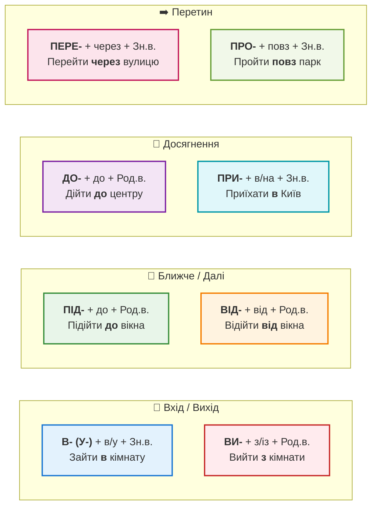

import Quiz from '@site/src/components/Quiz';
import MatchUp from '@site/src/components/MatchUp';
import FillIn from '@site/src/components/FillIn';
import TrueFalse from '@site/src/components/TrueFalse';
import Unjumble from '@site/src/components/Unjumble';
import GroupSort from '@site/src/components/GroupSort';
import Anagram from '@site/src/components/Anagram';
import ErrorCorrection, { ErrorCorrectionItem } from '@site/src/components/ErrorCorrection';
import Cloze from '@site/src/components/Cloze';
import Select from '@site/src/components/Select';
import Translate from '@site/src/components/Translate';
import MarkTheWords, { MarkTheWordsActivity } from '@site/src/components/MarkTheWords';
import HighlightMorphemes, { HighlightMorphemesActivity } from '@site/src/components/HighlightMorphemes';
import EssayResponse from '@site/src/components/EssayResponse';
import ComparativeStudy from '@site/src/components/ComparativeStudy';
import ReadingActivity from '@site/src/components/ReadingActivity';
import CriticalAnalysis from '@site/src/components/CriticalAnalysis';
import AuthorialIntent from '@site/src/components/AuthorialIntent';
import SourceEvaluation from '@site/src/components/SourceEvaluation';
import Debate from '@site/src/components/Debate';
import EtymologyTrace from '@site/src/components/EtymologyTrace';
import GrammarIdentify from '@site/src/components/GrammarIdentify';
import PaleographyAnalysis from '@site/src/components/PaleographyAnalysis';
import DialectComparison from '@site/src/components/DialectComparison';
import TranslationCritique from '@site/src/components/TranslationCritique';
import Transcription from '@site/src/components/Transcription';
import Observe from '@site/src/components/Observe';
import ActivityHelp from '@site/src/components/ActivityHelp';

> 🎯 **Чому це важливо?**
>
> Ви вже вивчили "атоми" руху (дієслова, префікси). Тепер час будувати "молекули" — живі речення та історії.
> Українська мова є надзвичайно "кінетичною". Ми не просто "go" (йдем) — ми соваємось, сунемо, пхаємося, лізимо, бредемо. Але для рівня B1 найважливіше — це **точність маршруту**. Ваша здатність правильно поєднати дієслово з прийменником визначає, чи зрозуміють вас правильно, чи ви відправите таксиста в інший кінець міста.

## Тест

Спробуйте знайти логічні помилки в цих реченнях.

1. "Я **зайшов** **від** магазину." (Помилка прийменника?)
2. "Ми **доїхали** **в** Київ." (Чи можна так сказати?)
3. "Він **підійшов** **в** мене." (Куди він підійшов?)

**Аналіз:**
1. Помилка. **Зайти** (enter) вимагає прийменника **в** або **до**. **Від** використовується з **відійти** (move away). Правильно: "Я **відійшов від** магазину".
2. Помилка. **Доїхати** (reach/reach limit) вимагає прийменника **до**. Правильно: "Ми **доїхали до** Києва" або "Ми **приїхали в** Київ".
3. Помилка. **Підійти** (approach) вимагає **до**. Правильно: "Він **підійшов до** мене".

:::tip[💡 **Пам'ятка мандрівника**]

Запам'ятайте просту тріаду для столиці:
*   Я їду **в** Київ (напрямок).
*   Я **в** Києві (місце).
*   Я **з** Києва (походження).
Це працює для 99% міст та країн.
:::

Сьогодні ми доведемо цю навігаційну систему до автоматизму.

---

## Пояснення

### 1. Матриця "Префікс — Прийменник"

Дієслова руху працюють у тісній зв'язці з прийменниками. Пам'ятайте золоте правило: **Префікс часто дублює значення прийменника.**

| Префікс | Прийменник | Значення | Приклад |
|---|---|---|---|
| **В- (У-)** | **в (у)** + Зн.в. | Into | **Зайти в** кімнату. |
| **ВИ-** | **з (із)** + Род.в. | Out of | **Вийти з** кімнати. |
| **ПІД-** | **до** + Род.в. | Towards | **Підійти до** вікна. |
| **ВІД-** | **від** + Род.в. | Away from | **Відійти від** вікна. |
| **ДО-** | **до** + Род.в. | Up to | **Дійти до** центру. |
| **ПРИ-** | **в/на** + Зн.в. | Arrive at | **Приїхати в** Київ. |
| **ПЕРЕ-** | **через** + Зн.в. | Across/Through | **Перейти через** вулицю (Cross the street). |
| **ПРО-** | **повз** + Зн.в. | Past | **Пройти повз** біббліотеку (Walk past the library). |

> 💡 **Нюанс: ДО vs ПРИ**
> *   **Приїхати в Київ** — фокус на факті прибуття (я тут).
> *   **Доїхати до Києва** — фокус на процесі досягнення мети (я подолав відстань і досяг межі).
> *   Часто вони взаємозамінні, але "доїхати" підкреслює шлях.

### 2. Складні маршрути та орієнтування

Описуючи маршрут, ми нанизуємо дії, як намистини. Використовуйте сполучники послідовності: **спочатку** (first), **потім** (then), **далі** (next), **нарешті** (finally).

**Алгоритм опису:**
1.  **Старт:** Вийти з...
2.  **Рух:** Йти прямо / по вулиці...
3.  **Зміна:** Повернути наліво/направо...
4.  **Перетин:** Перетнути площу / перейти дорогу...
5.  **Орієнтир:** Пройти повз орієнтир...
6.  **Фініш:** Дійти до...

> *Приклад:* "Спочатку **вийдіть з** метро. Потім **ідіть по** вулиці Франка прямо. Біля аптеки **поверніть направо**. **Пройдіть повз** парк. Ви побачите банк. Ваш готель — навпроти."

### 3. Ідіоми руху: Коли рух — це не рух

Українська мова обожнює метафори руху. Ось топ-5 фраз для рівня B1, які зроблять вашу мову природною.

1.  **Час летить** (Time flies).
    *   "Я не помітив, як **пролетів** час."
2.  **Дійти до висновку** (To come to a conclusion).
    *   "Ми довго сперечалися і нарешті **дійшли до** спільного висновку."
3.  **Вийти з себе** (To lose temper / freaked out).
    *   "Він так кричав, що я ледве не **вийшов із себе**."
4.  **Справи йдуть** (Things are going).
    *   "Як твої справи? — Дякую, справи **йдуть** чудово."
5.  **Зайти в глухий кут** (To reach a dead end).
    *   "Наші переговори **зайшли в глухий кут**."

:::danger[🛡️ **Міф: Українці завжди ходять пішки**]

Іноді студенти думають, що дієслово "ходити" (to walk) означає тільки фізичну ходьбу. Але ми кажемо: "Він **ходить** на роботу", навіть якщо він їздить на машині. Тут "ходити" означає регулярне відвідування.
АЛЕ: "Дитина вже **ходить**" означає саме здатність пересуватися на ногах.
:::

### 4. Подорожувати vs Їздити

Ці два дієслова часто плутають, але вони мають різні відтінки значення та контексти вживання.

*   **Подорожувати:** Це загальне слово для опису хобі, стилю життя або тривалої мандрівки з метою відпочинку та пізнання нового. Воно має романтичний, позитивний відтінок і асоціюється з пригодами та відкриттями.
  *   "Я люблю **подорожувати** світом і пізнавати нові культури."
  *   "Минулого літа ми **подорожували** Карпатами три тижні."
  *   "Вона **подорожує** одна з наметом і рюкзаком."

*   **Їздити:** Це конкретна регулярна або одноразова дія переміщення з точки А до точки Б, часто з практичною метою (робота, справи, відвідування). Це нейтральне слово без романтичного забарвлення.
  *   "Я часто **їжджу** у відрядження до Львова." (Не кажуть "Я часто подорожую у відрядження" — це звучить незвично).
  *   "Кожного тижня я **їжджу** до бабусі в село."
  *   "Він **їздив** на машині по місту весь день і шукав квартиру."

**Золоте правило:** Якщо мета — пізнання, відпочинок, пригоди → **подорожувати**. Якщо мета — робота, справи, регулярні візити → **їздити**.

### 5. Географія українських доріг

Щоб ваша українська звучала автентично, додайте трохи географічного контексту.

1.  **Траса vs Автострада:**
    *   **Автострада** — це щось велике і рідкісне (наприклад, Київ-Бориспіль).
    *   **Траса** — це будь-яке міжміське шосе. "Ми їхали по трасі Київ-Чоп".
2.  **Грунтівка:** Дорога без асфальту в селі або лісі. "Ми звернули на грунтівку".
3.  **Бруківка:** Кам'яна дорога в старих містах (Львів, центр Києва). Дуже гарно, але машину трясе.

:::note[🏺 **Культура водіння**]

В Україні водії часто використовують світлові сигнали.
*   Якщо вам блимнули "варійкою" (emergency lights) — це означає "Дякую" або "Вибачте".
*   Якщо вам блимнули дальнім світлом — це попередження про небезпеку (або поліцію) попереду.
:::

### 6. Історія: "Чумацький Шлях"

Колись давно, задовго до появи навігаторів і **автострад**, українські торговці сіллю чумаки їздили за сіллю в Крим. Їхній шлях був довгим і небезпечним. Вони орієнтувалися по зірках. Тому нашу галактику (Milky Way) українці називають **Чумацький Шлях**. Це дорога, по якій чумаки розсипали сіль.
Сьогодні слово **шлях** має поетичне значення "доля" або "життєва дорога", тоді як **дорога** — це фізичний об'єкт.

:::danger[🛡️ **Міф: Всі їздять на "маршрутках"**]

Так, **маршрутки** (жовті мікроавтобуси) є всюди, але у великих містах (Київ, Харків, Дніпро) люди надають перевагу метро, трамваям і тролейбусам, або сервісам таксі (Uklon, Bolt, Uber). Маршрутки вважаються менш комфортним транспортом.
:::

### 7. Етикет: Як правильно питати дорогу

В українській мові є рівні ввічливості, які критично важливі для комунікації на вулиці.

**Рівень 1: Нейтральний (до друзів/ровесників)**
*   "Підкажи, де метро?"
*   "Як пройти в центр?"

**Рівень 2: Ввічливий (до незнайомців)**
*   "Вибачте, підкажіть, будь ласка, як дійти до вокзалу?"
*   "Перепрошую, ви не знаєте, де тут аптека?"

**Рівень 3: Дуже ввічливий (до старших людей)**
*   "Будьте ласкаві, чи не могли б ви підказати дорогу до музею?"

> 💡 **Правило:**
> Завжди починайте з "Вибачте" або "Перепрошую". Це розбиває лід і привертає увагу. Ніколи не починайте відразу з питання "Де тут банк?". Це вважається грубим.

:::tip[💡 **Лайфхак: Як запам'ятати відмінки**]

Пам'ятайте просту логіку руху:
*   **Куди?** (Напрямок) = Знахідний відмінок. "Я йду в **парк**".
*   **Де?** (Місце) = Місцевий відмінок. "Я гуляю в **парку**".
*   **Звідки?** (Походження) = Родовий відмінок. "Я йду з **парку**".
Ця схема працює для більшості ситуацій.
:::

### 8. Типові помилки студентів (B1)

Давайте розберемо помилки, які роблять навіть досвідчені студенти рівня B1, щоб ви їх уникали і звучали природно.

1.  **"Я пішов додому на таксі."**
    *   *Чому неправильно:* Дієслово "пішов" (від "йти/ходити") означає переміщення пішки, на ногах. На таксі, автобусі чи машині можна тільки "поїхати" (від "їхати").
    *   *Правильно:* "Я поїхав додому на таксі."
    *   *Правило:* Завжди питайте себе: як ви рухалися? Якщо на ногах — йти/ходити. Якщо на транспорті — їхати/їздити.

2.  **"Я вчора ходив у Львів."** (Якщо ви живете в Києві).
    *   *Чому неправильно:* П'ятсот кілометрів пішки не ходять. Для далеких відстаней завжди використовуйте "їхати/їздити", незалежно від виду транспорту.
    *   *Правильно:* "Я вчора їздив у Львів" (якщо туди і назад за один день) або "Я вчора поїхав у Львів" (якщо односторонній рух).
    *   *Правило:* Якщо відстань більша за п'ятнадцять-двадцять кілометрів — завжди "їздити/їхати".

3.  **"Автобус йде через 5 хвилин."**
    *   *Нюанс:* Це правильно! Це виняток з правила. Транспорт за розкладом "ходить" і "йде", навіть якщо це автобус чи потяг. Ми кажемо: "Метро ходить до опівночі", "Автобус відходить о восьмій", "Потяг іде до Львова три години".

4.  **"Я зайшов до магазину."**
    *   *Чому неправильно:* Прийменник "до" означає "в напрямку до", але не "всередину". Ви можете "підійти до" або "дійти до" магазину (бути біля нього ззовні), але щоб бути всередині, треба "зайти В магазин".
    *   *Правильно:* "Я зайшов в магазин" або "Я зайшов у магазин" (обидва варіанти коректні).

5.  **"Вона підійшла в мене."**
    *   *Чому неправильно:* Дієслово "підійти" завжди вимагає прийменника "до" з родовим відмінком, бо воно означає наближення ДО об'єкта, а не входження В об'єкт.
    *   *Правильно:* "Вона підійшла до мене."
    *   *Правило:* Запам'ятайте пару ПІД- + ДО — вони працюють разом.

### 9. Рух у бізнесі: Метафори

Для професіоналів рівня B1 важливо розуміти, як мова руху використовується в офісі. Український бізнес-сленг дуже динамічний.

*   **Рухатися вперед (Move forward):**
  *   "Ми **рухаємося** за планом." (We are moving according to schedule).
  *   "Цей проект не **рухається**." (This project is stuck).
*   **Обійти конкурентів (Bypass competitors):**
  *   "Нам треба знайти спосіб **обійти** головного конкурента на ринку."
*   **Вийти на ринок (Enter the market):**
  *   "Компанія планує **вийти на** європейський ринок наступного року."
  *   Зверніть увагу: ми кажемо **вийти на** (go out onto), а не "зайти в" (enter in), коли говоримо про запуск.
*   **Запустити (Launch/Start):**
  *   Хоча це не зовсім дієслово руху, воно часто використовується в контексті старту: "Ми **запустили** стартап".
*   **Йти вгору (Go up):**
  *   "Акції **йдуть вгору**."
  *   "Його кар'єра стрімко **пішла вгору**."

> 💼 **Практична порада**
>
> Якщо ви хочете звучати професійно, використовуйте дієслова доконаного виду (ДВ) для досягнень: "Ми **вийшли** на прибуток" (We reached profit), "Ми **дійшли** згоди" (We reached an agreement). Недоконаний вид (НДВ) краще для процесів: "Ми **йдемо** до мети".

---

## Практика

### Аналіз тексту: "Одіссея" по-київськи

Прочитайте цей текст і зверніть увагу на зміну префіксів.

> "Ми **вирішили поїхати** на пікнік. **Виїхали** з гаража о 10-й. Спочатку все **йшло** добре. Ми **проїхали** центр без заторів. Але коли ми **під'їжджали до** мосту, почався ремонт. Довелося **об'їжджати** через інший район. Ми трохи **заблукали** і **заїхали в** якесь село. Місцевий житель **вийшов** і **підказав** дорогу. Нарешті ми **дісталися до** лісу. Але тільки ми **розклали** речі, як **найшла** хмара і пішов дощ. Довелося швидко **зібратися** і **поїхати** назад."

Бачите динаміку?
*   Виїхали -> Проїхали -> Під'їжджали -> Об'їжджати -> Заїхали -> Дісталися.

---

## Діалоги

### Діалог 1: Таксист і Пасажир (Навігація)

**Пасажир:** Доброго дня. Нам треба **доїхати до** залізничного вокзалу.
**Водій:** Зрозумів. Поїдемо через центр чи **об'їдемо** затори по окружній?
**Пасажир:** Краще **об'їхати**, ми поспішаємо. Потяг **відходить** за 40 хвилин.
**Водій:** Встигнемо. Ми швидко **проскочимо** (slip through).
**Пасажир:** Ой, а можна **заїхати в** банкомат по дорозі? Це буквально на хвилинку.
**Водій:** Добре, **заїдемо**. Але тоді я не гарантую час.
**Пасажир:** Ні-ні, тоді **їдьте** прямо. Не будемо ризикувати.

### Діалог 2: Кар'єра (Переносне значення)

**Анна:** Чула, ти **пішов з** роботи?
**Олег:** Так, я зрозумів, що **зайшов у глухий кут**. Ніякого розвитку.
**Анна:** І куди ти тепер?
**Олег:** Я **пройшов** співбесіду в нову IT-компанію. Думаю **перейти** туди.
**Анна:** Ого! Це серйозний крок.
**Олег:** Так. Сподіваюся, там справи **підуть** краще. Хочу **дійти до** рівня сеньйора за рік.

### Діалог 3: Зустріч у місті (Логістика)

**Марія:** Ти де? Я вже **підійшла до** входу в метро.
**Іван:** Я трохи запізнююсь. Я тільки **вийшов з** офісу.
**Марія:** Ну ти даєш! Ми ж домовилися.
**Іван:** Вибач. Я зараз швидко **доїду**. Зачекай мене всередині, щоб не мерзнути.
**Марія:** Добре, я **зайду в** кав'ярню поруч. Коли **під'їдеш** — подзвони, я **вийду**.

---

## 📋 Підсумок

**Ключові принципи:**
1.  **Префікс = Прийменник.** ВИ- + з, ПІД- + до, В- + в. Це ваш компас.
2.  **Доїхати до** = досягти мети. **Приїхати в** = бути на місці.
3.  **Ідіоми збагачують мову.** Використовуйте "справи йдуть" і "дійти до висновку".
4.  **Командний голос.** Для навігації використовуйте наказовий спосіб: "Ідіть", "Поверніть".

Ви готові до найскладніших маршрутів. У наступному модулі ми зробимо велику перевірку всього розділу "Рух". Це буде ваш шанс продемонструвати майстерність навігації.

---

---

## Потрібно більше практики?

Ви завершили цей модуль і тепер володієте потужним інструментом української навігації! Дієслова руху — це не просто граматика, це спосіб мислення українською. Тепер ви можете описати будь-який маршрут, пояснити дорогу незнайомцю, розповісти про подорож і навіть використовувати метафори руху в професійному контексті. Ось кілька способів закріпити матеріал і продовжити вдосконалення:

### 🔄 Інтеграція знань

Поєднуйте матеріал цього модуля з попередніми темами про префікси та дієслова руху. Створіть власну таблицю, де ви систематизуєте всі префікси та відповідні прийменники. Наприклад, запишіть ВИ- поруч із З/ІЗ, ПІД- поруч із ДО, ПЕРЕ- поруч із ЧЕРЕЗ. Це допоможе вам автоматично обирати правильні конструкції. Практикуйте описування вашого щоденного маршруту українською: як ви виходите з дому, йдете до зупинки, їдете на роботу, заходите в офіс. Використовуйте кілька префіксів у одному реченні, щоб розвивати швидкість мовлення.

### 🎯 Реальне застосування

Знайдіть ситуації в житті, де можна використати вивчене. Коли ви йдете або їдете кудись, намагайтеся проговорювати маршрут українською у голові: "Я виходжу з дому, підходжу до автобусної зупинки, їду через центр міста, доїжджаю до роботи". Читайте українські тексти про подорожі, туризм та транспорт — шукайте знайомі дієслова руху та аналізуйте, які префікси використані. Спілкуйтеся з носіями мови, застосовуючи нові знання: попросіть когось пояснити вам дорогу українською, або самі допоможіть туристу знайти потрібне місце. Чим більше ви практикуєте навігацію українською, тим природнішою стає ваша мова.

### 🌐 Онлайн-ресурси

Додаткові матеріали для практики дієслів руху та навігації на рівні B1:

* **Словник.ua** [https://slovnyk.ua](https://slovnyk.ua) — найкращий інструмент для перевірки значень дієслів руху та їхніх префіксальних варіантів. Шукайте базове дієслово (йти, їхати) і дивіться всі можливі префіксальні форми.
* **Українські блоги про подорожі** — читайте розповіді про мандри Україною, зверніть увагу на те, як автори описують маршрути, переміщення та враження від подорожей.
* **YouTube канали українською** — дивіться відео про українські міста, екскурсії, огляди транспорту. Слухайте, як носії мови описують рух та навігацію в реальному часі.
* **Мовні обміни** — платформи для спілкування з носіями мови допоможуть відпрацювати дієслова руху в живому мовленні. Попросіть співрозмовника описати вам маршрут до його улюбленого місця в місті, а потім ви опишіть свій.

### 📝 Практичне завдання

Опишіть ваш типовий робочий день українською, використовуючи якомога більше дієслів руху з префіксами. Почніть з моменту, коли ви прокидаєтесь, і закінчіть поверненням додому. Наприклад: "Я встаю о сьомій годині, виходжу з квартири, спускаюся сходами, підходжу до зупинки, сідаю в автобус, доїжджаю до метро, переходжу на іншу лінію, виходжу на потрібній станції, підіймаюся назовні, підходжу до офісу, заходжу в будівлю". Перевірте себе: чи правильно ви поєднали префікси з прийменниками? Чи можна замінити якесь дієслово на синонім? Це вправа тренує і граматику, і лексику одночасно!

---

> 💡 **Порада:** Найкращий спосіб закріпити дієслова руху — використовувати їх регулярно в реальних ситуаціях. Виділіть десять-п'ятнадцять хвилин щодня для опису ваших переміщень українською. Коли ви рухаєтесь містом, намагайтеся думати українською про те, що ви робите: куди йдете, звідки вийшли, до чого підходите. Це тренує вашу мовну інтуїцію і робить українську частиною вашого повсякденного життя!

## 🎯 Вправи

### Деталі навігації

<Quiz questions={JSON.parse(`[{"question": "Ви хочете сказати таксисту, щоб він оминув затори на дорозі. Яке дієслово з префіксом ви використаєте?", "options": [{"text": "Об'їхати (рух навколо перешкоди).", "correct": true}, {"text": "Заїхати (рух всередину на короткий час).", "correct": false}, {"text": "Переїхати (рух через перешкоду або зміна житла).", "correct": false}, {"text": "Доїхати (рух до кінцевої точки).", "correct": false}], "explanation": "ОБ- означає рух навколо."}, {"question": "Ваша колега питає про результати складної наради. Ви хочете сказати, що переговори закінчилися нічим. Яку фразу ви оберете?", "options": [{"text": "Ми вийшли на фінішну пряму.", "correct": false}, {"text": "Переговори зайшли в глухий кут.", "correct": true}, {"text": "Ми обійшли всі гострі кути.", "correct": false}, {"text": "Справи пішли в гору.", "correct": false}], "explanation": "«Зайти в глухий кут» — це класична ідіома безвиході."}, {"question": "Ви стоїте біля театру і чекаєте друга. Він дзвонить і каже «Я вже близько». Яке дієслово описує його наближення до вас?", "options": [{"text": "Я під'їжджаю / підходжу.", "correct": true}, {"text": "Я від'їжджаю / відходжу.", "correct": false}, {"text": "Я проїжджаю.", "correct": false}, {"text": "Я виїжджаю.", "correct": false}], "explanation": "ПІД- означає наближення до об'єкта."}, {"question": "Турист запитує дорогу. Вам треба сказати йому перетнути велику вулицю. Яку конструкцію ви використаєте?", "options": [{"text": "Ідіть по вулиці.", "correct": false}, {"text": "Перейдіть через вулицю.", "correct": true}, {"text": "Вийдіть з вулиці.", "correct": false}, {"text": "Зайдіть на вулицю.", "correct": false}], "explanation": "ПЕРЕ- + через = перетин простору."}, {"question": "Ви розповідаєте про свою кар'єру. Як сказати, що ви звільнилися з компанії за власним бажанням?", "options": [{"text": "Я зайшов з роботи.", "correct": false}, {"text": "Я пішов з роботи.", "correct": true}, {"text": "Я прийшов з роботи.", "correct": false}, {"text": "Я обійшов роботу.", "correct": false}], "explanation": "«Піти з роботи» (або звільнитися) — стандартна фраза."}, {"question": "Ви зустріли знайомого, якого не бачили 100 років. Він питає «Як життя?». Що ви відповісте нейтрально-позитивно?", "options": [{"text": "Справи йдуть потихеньку / добре.", "correct": true}, {"text": "Справи стоять на місці.", "correct": false}, {"text": "Справи пішли геть.", "correct": false}, {"text": "Справи біжать швидко.", "correct": false}], "explanation": "«Справи йдуть» — універсальна відповідь."}, {"question": "Ви заблукали в незнайомому місті. Ви дзвоните друзям. Що ви скажете, щоб описати ситуацію, коли ви випадково потрапили не туди?", "options": [{"text": "Я приїхав у центр.", "correct": false}, {"text": "Я заїхав кудись не туди.", "correct": true}, {"text": "Я переїхав місто.", "correct": false}, {"text": "Я виїхав з міста.", "correct": false}], "explanation": "ЗА- часто означає \\"get stuck\\" або \\"go somewhere wrong\\" (заїхати, зайти)."}, {"question": "Ви описуєте свій ранок. «Я ___ з дому о 8:00». Який префікс потрібен для старту руху зсередини?", "options": [{"text": "Від- (відійшов).", "correct": false}, {"text": "Ви- (вийшов).", "correct": true}, {"text": "З- (зійшов).", "correct": false}, {"text": "Пі- (пішов).", "correct": false}], "explanation": "ВИ- + з = exit from inside."}]`)} />

### Префікс та Прийменник

<MatchUp pairs={JSON.parse(`[{"left": "Зайти", "right": "в / у (кімнату)"}, {"left": "Вийти", "right": "з / із (кімнати)"}, {"left": "Підійти", "right": "до (мене)"}, {"left": "Відійти", "right": "від (вікна)"}, {"left": "Перейти", "right": "через (дорогу)"}, {"left": "Пройти", "right": "повз (магазин)"}, {"left": "Доїхати", "right": "до (кордону)"}, {"left": "Залізти", "right": "на (дерево)"}, {"left": "Злізти", "right": "з (дерева)"}, {"left": "Покласти", "right": "на (стіл)"}, {"left": "Витягнути", "right": "з (кишені)"}, {"left": "Сісти", "right": "на (стілець)"}]`)} />

### Культурні нюанси та логіка

<TrueFalse items={JSON.parse(`[{"statement": "Фраза «Час біжить» є неправильною, треба казати «Час йде».", "isTrue": false, "explanation": "Можна казати і «Час летить», і «Час біжить», і «Час йде»."}, {"statement": "Якщо ви скажете таксисту «Зупиніть тут», це ввічливо.", "isTrue": true, "explanation": "Імператив є нормою для інструкцій, якщо тон ввічливий."}, {"statement": "«Я дійшов до висновку» означає, що ви фізично прийшли в кімнату з написом «Висновок».", "isTrue": false, "explanation": "Це абстрактна ідіома."}, {"statement": "Префікс ПО- у слові «походити» означає «ходити трошки або певний час».", "isTrue": true, "explanation": "ПО- часто додає значення обмеженості в часі."}, {"statement": "«Ми пройшли митний контроль.» Тут «пройшли» означає завершену процедуру.", "isTrue": true, "explanation": "Пройти = пройти крізь процедуру."}, {"statement": "«Сонце зійшло» означає, що сонце спустилося вниз.", "isTrue": false, "explanation": "Сонце «сходить» вгору, а «заходить» вниз. Парадокс!"}, {"statement": "«Метро ходить до опівночі».", "isTrue": true, "explanation": "Транспорт «ходить» за розкладом."}, {"statement": "«Корабель пливе» і «Людина пливе» — це різні дієслова українською.", "isTrue": false, "explanation": "Ні, це одне слово «пливти». (На відміну від йти/їхати)."}, {"statement": "«Маршрутка» вважається найкомфортнішим видом транспорту.", "isTrue": false, "explanation": "Ні, маршрутки часто переповнені і менш комфортні."}, {"statement": "Слова «машина» і «автомобіль» є синонімами.", "isTrue": true, "explanation": "Так, це абсолютні синоніми."}, {"statement": "Слово «шлях» може означати долю або життєву дорогу.", "isTrue": true, "explanation": "Так, це поетичне значення слова."}, {"statement": "«Грунтівка» — це дорога з гарним асфальтом.", "isTrue": false, "explanation": "Грунтівка — це дорога без покриття (земля/грунт)."}]`)} />

### Життя в русі

<FillIn items={JSON.parse(`[{"sentence": "Минулого тижня я вирішив [___] з дому дуже рано", "answer": "виїхати", "options": ["виїхати", "заїхати", "поїхати", "інше"]}, {"sentence": "Навігатор [___] мені дивний шлях, і я {поїхав|заїхав|виїхав} через старий міст", "answer": "підказав", "options": ["підказав", "наказав", "сказав", "інше"]}, {"sentence": "Навігатор підказав мені дивний шлях, і я [___] через старий міст", "answer": "поїхав", "options": ["поїхав", "заїхав", "виїхав", "інше"]}, {"sentence": "Потім я [___] {на|в|під} вузьку вулицю, де майже не було асфальту", "answer": "звернув", "options": ["звернув", "повернув", "відвернув", "інше"]}, {"sentence": "Потім я звернув [___] вузьку вулицю, де майже не було асфальту", "answer": "на", "options": ["на", "в", "під", "інше"]}, {"sentence": "Раптом дорога скінчилася, і я [___] , що {заїхав|приїхав|переїхав} у глухий кут", "answer": "зрозумів", "options": ["зрозумів", "подумав", "вигадав", "інше"]}, {"sentence": "Раптом дорога скінчилася, і я зрозумів, що [___] у глухий кут", "answer": "заїхав", "options": ["заїхав", "приїхав", "переїхав", "інше"]}, {"sentence": "Довелося розвертатися і [___] назад на головну трасу", "answer": "виїжджати", "options": ["виїжджати", "від'їжджати", "під'їжджати", "інше"]}, {"sentence": "Я [___] купу часу через цю помилку", "answer": "втратив", "options": ["втратив", "затратив", "потратив", "інше"]}, {"sentence": "Коли я нарешті [___] до бабусі, вона вже {чекала|стояла|сиділа} на вулиці", "answer": "доїхав", "options": ["доїхав", "в'їхав", "наїхав", "інше"]}, {"sentence": "Коли я нарешті доїхав до бабусі, вона вже [___] на вулиці", "answer": "чекала", "options": ["чекала", "стояла", "сиділа", "інше"]}, {"sentence": "Я [___] у хату втомлений, але радий", "answer": "зайшов", "options": ["зайшов", "прийшов", "ввійшов", "інше"]}]`)} />

### Складіть маршрут

<Unjumble items={JSON.parse(`[{"jumbled": "будь / ласка / вийдіть / з / центрального / входу / вокзалу / і / відразу / поверніть / праворуч / за / ріг", "answer": "Будь ласка, вийдіть з центрального входу вокзалу і відразу поверніть праворуч за ріг."}, {"jumbled": "потім / вам / треба / йти / прямо / два / довгі / квартали / аж / до / великого / перехрестя", "answer": "Потім вам треба йти прямо два довгі квартали аж до великого перехрестя."}, {"jumbled": "перейдіть / через / широку / дорогу / на / цьому / світлофорі / і / спокійно / станьте / на / зупинці", "answer": "Перейдіть через широку дорогу на цьому світлофорі і спокійно станьте на зупинці."}, {"jumbled": "вам / потрібно / уважно / почекати / і / сісти / на / жовтий / автобус / номер / п'ять / або / сім", "answer": "Вам потрібно уважно почекати і сісти на жовтий автобус номер п'ять або сім."}, {"jumbled": "вийдіть / на / третій / зупинці / яка / називається / площа / Ринок / біля / старого / театру", "answer": "Вийдіть на третій зупинці, яка називається площа Ринок, біля старого театру."}, {"jumbled": "пройдіть / ще / трохи / вперед / по / алеї / і / ви / побачите / наш / прекрасний / музей / зліва", "answer": "Пройдіть ще трохи вперед по алеї, і ви побачите наш прекрасний музей зліва."}]`)} />

### Вставте прийменник

<GroupSort groups={JSON.parse(`{"В / НА (Куди?)": ["Зайти ... (магазин)", "Покласти ... (стіл)", "Приїхати ... (місто)", "Сісти ... (диван)", "Впасти ... (землю)", "Забігти ... (гості)", "Повернутися ... (Україну)"], "З / ВІД (Звідки?)": ["Вийти ... (кімнати)", "Взяти ... (столу)", "Відійти ... (вікна)", "Встати ... (стільця)", "Поїхати ... (Києва)", "Втекти ... (в'язниці)"], "ДО (Куди / До кого?)": ["Підійти ... (мене)", "Доїхати ... (кордону)", "Дзвонити ... (мами)", "Бігти ... (фінішу)", "Йти ... (лікаря)"], "ЧЕРЕЗ (Як?)": ["Перейти ... (дорогу)", "Перестрибнути ... (паркан)", "Дивитися ... (вікно)", "Їхати ... (міст)", "Перелізти ... (стіну)"]}`)} />

### Лист із відпустки

<Cloze passage={"Привіт, мамо! Ми нарешті [___:0] до готелю після довгої подорожі. Ми [___:1] з Києва ще вночі, щоб [___:2] заторів на дорозі.\nСпочатку все [___:3] добре, але потім ми [___:4] в затор під Житомиром. Ми стояли там годину! Тато [___:5] з себе і хотів [___:6] іншою дорогою, але навігатор не працював.\nБензину майже не залишилося, і ми ледве [___:7] до заправки. Там ми [___:8] кави і трохи [___:9]. Потім ми [___:10] далі через маленькі села.\nКоли ми нарешті [___:11] до Карпат, настрій відразу [___:12] в гору. Ми [___:13] до готелю, [___:14] речі й [___:15] на вечерю. Краєвиди тут неймовірні! Завтра [___:16] в гори. Цілую тебе!"} blanks={JSON.parse(`[{"index": 0, "answer": "дісталися", "options": ["дісталися", "присталися", "відсталися"]}, {"index": 1, "answer": "виїхали", "options": ["виїхали", "заїхали", "переїхали"]}, {"index": 2, "answer": "уникнути", "options": ["уникнути", "виникнути", "зникнути"]}, {"index": 3, "answer": "йшло", "options": ["йшло", "приходило", "виходило"]}, {"index": 4, "answer": "потрапили", "options": ["потрапили", "втрапили", "затрапили"]}, {"index": 5, "answer": "вийшов", "options": ["вийшов", "зайшов", "дійшов"]}, {"index": 6, "answer": "поїхати", "options": ["поїхати", "піти", "побігти"]}, {"index": 7, "answer": "дотягли", "options": ["дотягли", "протягли", "витягли"]}, {"index": 8, "answer": "попили", "options": ["попили", "випили", "запили"]}, {"index": 9, "answer": "відпочили", "options": ["відпочили", "почили", "спочили"]}, {"index": 10, "answer": "рушили", "options": ["рушили", "зрушили", "порушили"]}, {"index": 11, "answer": "під'їхали", "options": ["під'їхали", "від'їхали", "заїхали"]}, {"index": 12, "answer": "пішов", "options": ["пішов", "вийшов", "зайшов"]}, {"index": 13, "answer": "зайшли", "options": ["зайшли", "пішли", "вийшли"]}, {"index": 14, "answer": "розпакували", "options": ["розпакували", "запакували", "попакували"]}, {"index": 15, "answer": "пішли", "options": ["пішли", "зайшли", "вийшли"]}, {"index": 16, "answer": "підемо", "options": ["підемо", "зійдемо", "вийдемо"]}]`)} />

### Типові помилки

<ErrorCorrection>
  <ErrorCorrectionItem sentence="Я вчора приїхав до Києва потягом." errorWord="до Києва" correctForm="в Київ" options={JSON.parse(`["в Київ", "на Київ", "у Київ", "до Києва"]`)} explanation="З дієсловом «приїхати» краще вживати В/НА + Зн.в. (Приїхати в місто). «До Києва» можливо з «Доїхати»." />
  <ErrorCorrectionItem sentence="Він підійшов в мене і запитав дорогу." errorWord="в мене" correctForm="до мене" options={JSON.parse(`["до мене", "на мене", "у мене", "в мене"]`)} explanation="«Підійти» завжди вимагає ДО + Род.в." />
  <ErrorCorrectionItem sentence="Ми вийшли з автобусу на зупинці." errorWord="автобусу" correctForm="автобуса" options={JSON.parse(`["автобуса", "автобусу", "автобусом", "автобусі"]`)} explanation="Родовий відмінок слова «автобус» — автобусА. «Автобусу» — це Давальний." />
  <ErrorCorrectionItem sentence="Треба перейти через вулиці на зелене світло." errorWord="вулиці" correctForm="вулицю" options={JSON.parse(`["вулицю", "вулицею", "вулиця", "вулиці"]`)} explanation="Перейти через (що?) — Знахідний відмінок. Вулиця -> Вулицю." />
  <ErrorCorrectionItem sentence="Вона зайшла з магазину, щоб купити хліб." errorWord="з магазину" correctForm="в магазин" options={JSON.parse(`["в магазин", "до магазину", "на магазин", "з магазину"]`)} explanation="Зайшла (куди?) — напрямок. В магазин." />
  <ErrorCorrectionItem sentence="Ми довго гуляли на парку." errorWord="на парку" correctForm="по парку" options={JSON.parse(`["по парку", "в парку", "у парку", "на парку"]`)} explanation="Гуляти (де?) — в парку, або (як?) — по парку. «На парку» — неможливо (хіба що зверху на деревах)." />
</ErrorCorrection>

### Ідіоми в тексті

<MarkTheWords>
  <MarkTheWordsActivity instruction="Знайдіть та виділіть ідіоми та фрази, пов'язані з рухом (наприклад, &quot;дійти згоди&quot;, &quot;йти на дно&quot;)." text="Ми сиділи на зборах і довго не могли дійти згоди. Директор казав, що фірма йде на дно. Головний бухгалтер вийшла з себе і почала кричати. Я зрозумів, що розмова зайшла в глухий кут. Час летів, а ми топталися на місці. Нарешті хтось запропонував компроміс, і справи пішли на лад. Ми всі зітхнули з полегшенням." correctWords={JSON.parse(`["дійти", "згоди", "йде", "на", "дно", "вийшла", "з", "себе", "зайшла", "в", "глухий", "кут", "летів", "пішли", "на", "лад", "зітхнули", "з", "полегшенням"]`)} />
</MarkTheWords>

### Синоніми руху

<Select questions={JSON.parse(`[{"question": "Ми **вирушили** в дорогу на світанку.", "options": [{"text": "виїхали", "correct": true}, {"text": "прийшли", "correct": false}, {"text": "зайшли", "correct": false}, {"text": "залишилися", "correct": false}], "explanation": ""}, {"question": "Вони **дісталися** вершини гори.", "options": [{"text": "дійшли до", "correct": true}, {"text": "вийшли на", "correct": false}, {"text": "зійшли з", "correct": false}, {"text": "відійшли від", "correct": false}], "explanation": ""}, {"question": "Автобус **рушив** з місця.", "options": [{"text": "поїхав", "correct": true}, {"text": "став", "correct": false}, {"text": "приїхав", "correct": false}, {"text": "зупинився", "correct": false}], "explanation": ""}, {"question": "Ми **прогулювалися** набережною.", "options": [{"text": "ходили", "correct": true}, {"text": "бігали", "correct": false}, {"text": "їздили", "correct": false}, {"text": "стояли", "correct": false}], "explanation": ""}, {"question": "Він **мчав** на машині дуже швидко.", "options": [{"text": "їхав", "correct": true}, {"text": "йшов", "correct": false}, {"text": "летів", "correct": false}, {"text": "стояв", "correct": false}], "explanation": ""}, {"question": "Вона **крокувала** впевнено вперед.", "options": [{"text": "йшла", "correct": true}, {"text": "стояла", "correct": false}, {"text": "бігла", "correct": false}, {"text": "сиділа", "correct": false}], "explanation": ""}]`)} />

### Навігація в місті

<Translate questions={JSON.parse(`[{"source": "Go straight ahead past the bank.", "options": [{"text": "Ідіть прямо повз банк.", "correct": true}, {"text": "Ідіть криво через банк.", "correct": false}, {"text": "Ідіть назад від банку.", "correct": false}]}, {"source": "Turn left at the traffic light.", "options": [{"text": "Поверніть ліворуч на світлофорі.", "correct": true}, {"text": "Поверніть праворуч на світлофорі.", "correct": false}, {"text": "Йдіть прямо на світлофорі.", "correct": false}]}, {"source": "Cross the street and enter the park.", "options": [{"text": "Перейдіть вулицю і зайдіть у парк.", "correct": true}, {"text": "Перейдіть вулицю і вийдіть з парку.", "correct": false}, {"text": "Обійдіть вулицю і зайдіть у парк.", "correct": false}]}, {"source": "The museum is on the right side.", "options": [{"text": "Музей з правої сторони (праворуч).", "correct": true}, {"text": "Музей з лівої сторони (ліворуч).", "correct": false}, {"text": "Музей прямо.", "correct": false}]}, {"source": "How do I get to the station?", "options": [{"text": "Як мені дістатися до вокзалу?", "correct": true}, {"text": "Як мені вийти з вокзалу?", "correct": false}, {"text": "Як мені пройти повз вокзал?", "correct": false}]}, {"source": "It's a dead end.", "options": [{"text": "Це глухий кут.", "correct": true}, {"text": "Це відкрита дорога.", "correct": false}, {"text": "Це довгий шлях.", "correct": false}]}]`)} />

### Транспорт і Культура

<Quiz questions={JSON.parse(`[{"question": "Що означає, коли водій іншої машини блимає вам \\"аварійкою\\" (emergency lights)?", "options": [{"text": "Дякую або Вибачте.", "correct": true}, {"text": "Я зламався.", "correct": false}, {"text": "Їдь швидше.", "correct": false}, {"text": "У мене закінчився бензин.", "correct": false}], "explanation": "В Україні це жест ввічливості (\\"дякую\\")."}, {"question": "\\"Чумацький Шлях\\" — це назва галактики. Звідки походить ця назва?", "options": [{"text": "Від торговців сіллю (чумаків).", "correct": true}, {"text": "Від назви стародавнього міста.", "correct": false}, {"text": "Від імені першого космонавта.", "correct": false}, {"text": "Від форми річки Дніпро.", "correct": false}], "explanation": "Чумаки возили сіль і розсипали її, утворюючи \\"шлях\\" на небі."}, {"question": "Що водії зазвичай мають на увазі, коли блимають дальнім світлом зустрічним машинам?", "options": [{"text": "Попереду небезпека або поліція.", "correct": true}, {"text": "Привіт, як справи?", "correct": false}, {"text": "Увімкни фари.", "correct": false}, {"text": "Я хочу повернути.", "correct": false}], "explanation": "Це попередження про пост поліції або небезпеку."}, {"question": "Що саме означає стандартний напис \\"Зроблено в Україні\\" на різних товарах?", "options": [{"text": "Made in Ukraine.", "correct": true}, {"text": "Only for Ukraine.", "correct": false}, {"text": "Sold in Ukraine.", "correct": false}, {"text": "Imported to Ukraine.", "correct": false}], "explanation": "Це маркування походження товару."}, {"question": "Як ви поясните значення слова \\"затор\\", якщо ви стоїте на дорозі?", "options": [{"text": "Traffic jam.", "correct": true}, {"text": "Traffic light.", "correct": false}, {"text": "Traffic sign.", "correct": false}, {"text": "Parking lot.", "correct": false}], "explanation": "Затор = пробка/traffic jam."}, {"question": "Що зазвичай означає вираз \\"година пік\\" у контексті міського транспорту?", "options": [{"text": "Час найбільшого навантаження транспорту.", "correct": true}, {"text": "Час обіду.", "correct": false}, {"text": "Час, коли транспорт не ходить.", "correct": false}, {"text": "Час закриття метро.", "correct": false}], "explanation": "Rush hour = година пік."}, {"question": "Що означає термін \\"кільцева дорога\\" у схемі руху великого міста?", "options": [{"text": "Ring road (bypass).", "correct": true}, {"text": "Main street.", "correct": false}, {"text": "Dead end.", "correct": false}, {"text": "Pedestrian zone.", "correct": false}], "explanation": "Дорога навколо міста."}, {"question": "Якщо ви хочете вийти з маршрутки не на зупинці, ви кажете?", "options": [{"text": "Зупиніть тут, будь ласка.", "correct": true}, {"text": "Стій!", "correct": false}, {"text": "Я виходжу.", "correct": false}, {"text": "Відкрийте вікно.", "correct": false}], "explanation": "Ввічливе прохання зупинитися."}]`)} />

## 📚 Словник

| Слово | Вимова | Переклад | ЧМ | Примітка |
| --- | --- | --- | --- | --- |
| **автобусний** | /aʋtˈɔbusnɪj/ | bus (adj) | прикм |  |
| **банкомат** | /bankɔmˈat/ | ATM, cash machine | ім |  |
| **брести** | /brɛstˈɪ/ | to wade, to stroll | дієсл |  |
| **відповідний** | /ʋidpɔʋidnɪj/ | appropriate, relevant | прикм |  |
| **гарантувати** | /ɦarantuʋˈatɪ/ | to guarantee | дієсл |  |
| **гол** | /ɦɔl/ | goal (sports) | ім |  |
| **доїжджати** | /dɔjiʒdʒˈatɪ/ | to reach (by vehicle), to commute | дієсл |  |
| **житель** | /ʒˈɪtɛlʲ/ | resident, inhabitant | ім |  |
| **заблукати** | /zablukˈatɪ/ | to get lost | дієсл |  |
| **залізничний** | /zaliznˈɪt͡ʃnɪj/ | railway (adj) | прикм |  |
| **замінити** | /zaminˈɪtɪ/ | to replace | дієсл |  |
| **заходжий** | /zaxˈɔdʒɪj/ | newcomer | прикм |  |
| **зібратися** | /zibrˈatɪsja/ | to gather, to intend (perfective) | дієсл |  |
| **кар'єра** | /karˈjɛra/ | career | ім |  |
| **командний** | /kɔmˈandnɪj/ | team (adj) | прикм |  |
| **компас** | /kˈɔmpas/ | compass | ім |  |
| **кінетичний** | /kinɛtˈɪt͡ʃnɪj/ | kinetic | прикм |  |
| **майстерність** | /majstˈɛrnistʲ/ | mastery | ім |  |
| **мандри** | /mˈandrɪ/ | travels, wanderings | ім |  |
| **мерзнути** | /mˈɛrznutɪ/ | to freeze, to feel cold | дієсл |  |
| **молекула** | /mɔlˈɛkula/ | molecule | ім |  |
| **навігаційний** | /naʋiɦat͡sˈijnɪj/ | navigational | прикм |  |
| **найти** | /najtˈɪ/ | to find (perfective) | дієсл |  |
| **незнайомець** | /nɛznajˈɔmɛt͡sʲ/ | stranger | ім |  |
| **ні-ні** | /ni-nˈi/ | no-no | part |  |
| **ніякий** | /niˈjakɪj/ | none, no kind of | займ |  |
| **одіссея** | /ɔdissˈɛja/ | odyssey | ім |  |
| **описування** | /ɔpˈɪsuʋannja/ | describing | ім |  |
| **по-київськи** | /pɔ-kˈɪjiʋsʲkɪ/ | Kyiv-style | присл |  |
| **походження** | /pɔxˈɔdʒɛnnja/ | origin, descent | ім |  |
| **поєднати** | /pɔjɛdnˈatɪ/ | to combine, to unite | дієсл |  |
| **природніший** | /prɪrɔdniʃɪj/ | more natural | прикм |  |
| **проговорювати** | /prɔɦɔʋˈɔrjuʋatɪ/ | to talk through | дієсл |  |
| **пхатися** | /pxˈatɪsja/ | to push, to intrude | дієсл |  |
| **підійматися** | /pidijmˈatɪsja/ | to rise, to climb (imperfective) | дієсл |  |
| **пікнік** | /piknik/ | picnic | ім |  |
| **ризикувати** | /rɪzɪkuʋˈatɪ/ | to risk | дієсл |  |
| **сеньйор** | /sɛnʲjˈɔr/ | senior | ім |  |
| **соватися** | /sˈɔʋatɪsja/ | to fidget, to move about | дієсл |  |
| **спускатися** | /spuskˈatɪsja/ | to descend, to go down (imperfective) | дієсл |  |
| **сунути** | /sunutɪ/ | to move, to shove, to push | дієсл |  |
| **тріада** | /triˈada/ | triad | ім |  |
| **туризм** | /turˈɪzm/ | tourism | ім |  |
| **шанс** | /ʃans/ | chance | ім |  |
| **якомога** | /jakɔmˈɔɦa/ | as much/fast as possible | присл |  |