import Quiz from '@site/src/components/Quiz';
import MatchUp from '@site/src/components/MatchUp';
import FillIn from '@site/src/components/FillIn';
import TrueFalse from '@site/src/components/TrueFalse';
import Unjumble from '@site/src/components/Unjumble';
import GroupSort from '@site/src/components/GroupSort';
import Anagram from '@site/src/components/Anagram';
import ErrorCorrection, { ErrorCorrectionItem } from '@site/src/components/ErrorCorrection';
import Cloze from '@site/src/components/Cloze';
import Select from '@site/src/components/Select';
import Translate from '@site/src/components/Translate';
import MarkTheWords, { MarkTheWordsActivity } from '@site/src/components/MarkTheWords';
import HighlightMorphemes, { HighlightMorphemesActivity } from '@site/src/components/HighlightMorphemes';
import EssayResponse from '@site/src/components/EssayResponse';
import ComparativeStudy from '@site/src/components/ComparativeStudy';
import ReadingActivity from '@site/src/components/ReadingActivity';
import CriticalAnalysis from '@site/src/components/CriticalAnalysis';
import AuthorialIntent from '@site/src/components/AuthorialIntent';
import SourceEvaluation from '@site/src/components/SourceEvaluation';
import Debate from '@site/src/components/Debate';
import EtymologyTrace from '@site/src/components/EtymologyTrace';
import GrammarIdentify from '@site/src/components/GrammarIdentify';
import PaleographyAnalysis from '@site/src/components/PaleographyAnalysis';
import DialectComparison from '@site/src/components/DialectComparison';
import TranslationCritique from '@site/src/components/TranslationCritique';
import Transcription from '@site/src/components/Transcription';
import Observe from '@site/src/components/Observe';
import ActivityHelp from '@site/src/components/ActivityHelp';

> 🎯 **Why This Module Matters**
>
> To understand complex Ukrainian sentences, you need to know how they're built. Ukrainian grammar books analyze sentences using terms like «підмет» (subject), «присудок» (predicate), and «підрядне речення» (subordinate clause). This module gives you the vocabulary to understand sentence analysis.

## Introduction - Understanding Sentence Structure

### Чому структура речення важлива

Ukrainians say **«Добре слово — половина справи.»** — «A good word is half the job done.» But how do you build sentences with good words? That's where sentence structure comes in.

When you read a complex Ukrainian sentence, understanding its structure helps you parse meaning. Consider this sentence:
*«Книга, яку я читав учора ввечері, поки дощ стукав у вікно, була неймовірно цікавою.»*

A beginner sees a jumble of words. A grammar-savvy learner sees architecture:

1.  **Main Frame:** "Книга була цікавою." (The core message).
2.  **Insert:** "яку я читав..." (Details about the book).
3.  **Background:** "поки дощ стукав..." (Details about the setting).

Grammar books analyze this utilizing specific terms. The **головне речення** (main clause) holds the weight. The **підрядне речення** (subordinate clause) adds depth. The **вставне слово** (parenthetical word) adds attitude. Without this terminology, you cannot follow the analysis or correct your own mistakes.

This knowledge isn't just academic. When you read Ukrainian news articles, literary texts, or academic papers, complex sentences are everywhere. Being able to mentally break them down into components is what separates fluent reading from struggling translation. It's like knowing how to read an architectural blueprint versus just staring at a building — you understand WHY the structure holds together.

> 💡 **Did You Know?**
>
> Ukrainian syntax terminology comes from Greek and Latin linguistic traditions. **Синтаксис** literally means «arrangement together» — how words are arranged to form sentences. Unlike English, where word order is rigid (SVO), Ukrainian relies on *inflection* (endings) to show structure, allowing the **порядок слів** (word order) to be flexible for emphasis.

Where is this taught? Київ is home to the Institute of Linguistics, which standardizes Ukrainian grammar terminology. Львів has the oldest university in Ukraine, where scholars refined these terms for centuries. Одеса universities train thousands of teachers who spread this knowledge across the country. From Харків to Чернівці, every school teaches the same sentence analysis method known as **синтаксичний розбір** (syntactic parsing).

---

## Sentence Parts (Члени речення)

#### Головні члени речення

Every complete sentence revolves around two suns: the Subject and the Predicate. They form the **граматична основа** (grammatical basis).

| Term                  | English            | Function                                   |
| --------------------- | ------------------ | ------------------------------------------ |
| **підмет**            | subject            | Who/what does the action (Nominative case) |
| **присудок**          | predicate          | What the subject does/is (Verb)            |
| **граматична основа** | grammatical clause | The core pair (Subject + Predicate)        |

**1. Підмет (The Subject)**
The **підмет** is the boss. It is always in the **Називний відмінок** (Nominative case). It answers **хто?** (who?) or **що?** (what?).

- *Example:* "**Студент** читає." (**Студент** acts).
- *Warning:* In English, "Me likes it" (colloquial) or "I like it" puts the actor first. In Ukrainian "Мені подобається" (To me it appeals), "Мені" is Dative, so it is NOT the subject! The subject is grammatically "it". This distinction is vital.

**2. Присудок (The Predicate)**
The **присудок** is the action or state. It usually agrees with the subject in person and number.

- **Простий дієслівний присудок:** Just a verb. "Я **читаю**." (I read).
- **Складений присудок:** Auxiliary + Infinitive/Noun. "Я **хочу читати**." (I want to read - compound verbal). "Він **є студентом**." (He is a student - compound nominal).

**Марія читає книгу в бібліотеці.** (Maria reads a book in the library.)

- **Хто?** Марія (Підмет).
- **Що робить?** Читає (Присудок).

> 🌍 **Real World: Grammar Tests**
>
> In Ukrainian schools, students are asked «Визначте підмет і присудок у реченні» (Identify the subject and predicate in the sentence). This is a standard grammar exercise from elementary school through university. Often, the subject is hidden or implied (e.g., "(Ми) йдемо додому"), which is called **неповне речення** (incomplete sentence). Identifying the "ghost" subject is a key skill.

### Secondary Sentence Parts (Другорядні члени)

These parts paint the picture around the grammatical core.

| Term          | English            | Function                                   | Question?                      |
| ------------- | ------------------ | ------------------------------------------ | ------------------------------ |
| **додаток**   | object             | Receives the action                        | Кого? Чого? Кому? Ким? (Cases) |
| **означення** | attribute/modifier | Describes a noun                           | Який? Чий? (Which? Whose?)     |
| **обставина** | adverbial          | Describes circumstances (how, when, where) | Як? Де? Коли? Чому?            |

**1. Додаток (The Object)**
Usually in the Accusative or Dative case. It "completes" the verb.

- "Я бачу **брата**." (I see brother). **Брата** is the **прямий додаток** (direct object).
- "Я допомагаю **мамі**." (I help mom). **Мамі** is the **непрямий додаток** (indirect object).

**2. Означення (The Attribute)**
Decorates the noun. Usually an adjective.

- "**Цікава** книга." (Interesting book).
- "**Київський** торт." (Kyiv cake).
- Sometimes a noun can be an attribute: "Книга **брата**" (Brother's book).

**3. Обставина (The Adverbial)**
Sets the scene.

- **Місця:** "Ми сидимо **вдома**." (Place).
- **Часу:** "Ми прийдемо **завтра**." (Time).
- **Способу дії:** "Він читає **швидко**." (Manner).
- **Причини:** "Я не прийшов **через хворобу**." (Reason).
- **Мети:** "Я прийшов, **щоб учитися**." (Purpose).
- **Умови:** "Я допоможу **за потреби**." (Condition).

**Deep Dive Analysis:**
In «Марія читає цікаву книгу в бібліотеці»:

- **Марія** — підмет.
- **читає** — присудок.
- **книгу** — додаток (знахідний відмінок).
- **цікаву** — означення (узгоджується з книгою).
- **в бібліотеці** — обставина місця.

### The Master Term

| Term                 | English        | Meaning                           |
| -------------------- | -------------- | --------------------------------- |
| **член речення**     | sentence part  | Any functional unit in a sentence |
| **головний член**    | main part      | Subject or predicate              |
| **другорядний член** | secondary part | Object, attribute, or adverbial   |

**Головний член речення — це підмет або присудок.** (The main sentence part is the subject or predicate.)

**Другорядні члени доповнюють значення головних.** (Secondary parts supplement the meaning of main parts.)

**Кожне речення має принаймні один головний член.** (Every sentence has at least one main part.) In impersonal sentences ("Холодно." - It is cold), there is only the predicate context, but structurally it stands alone.

> 🌍 **Real World: School Grammar**
>
> Every Ukrainian student learns these terms in school. When you see «Визначте головні та другорядні члени речення» (Identify the main and secondary sentence parts), you now know exactly what is being asked. This terminology is universal in Ukrainian education.

### How to Parse a Sentence (Синтаксичний розбір)

Parsing is a logical process. Follow this algorithm:

```mermaid
flowchart TB
    START(["🔍 Почніть аналіз речення"]) --> STEP1

    subgraph STEP1 ["Крок 1: Присудок"]
        direction TB
        Q1["<b>Що робить? Що відбувається?</b><br />Знайдіть дієслово"]
        Q1 --> A1["присудок<br />(дія або стан)"]
    end

    STEP1 --> STEP2

    subgraph STEP2 ["Крок 2: Підмет"]
        direction TB
        Q2["<b>Хто? Що?</b><br />Хто виконує дію?"]
        Q2 --> A2["підмет<br />(називний відмінок)"]
    end

    STEP2 --> CORE["✅ Граматична основа знайдена"]
    CORE --> STEP3

    subgraph STEP3 ["Крок 3: Додаток"]
        direction TB
        Q3["<b>Кого? Що? Кому? Чим?</b><br />На кого/що спрямована дія?"]
        Q3 --> A3["додаток<br />(прямий або непрямий)"]
    end

    STEP3 --> STEP4

    subgraph STEP4 ["Крок 4: Означення"]
        direction TB
        Q4["<b>Який? Яка? Чий?</b><br />Що описує іменник?"]
        Q4 --> A4["означення<br />(прикметник, займенник)"]
    end

    STEP4 --> STEP5

    subgraph STEP5 ["Крок 5: Обставина"]
        direction TB
        Q5["<b>Де? Коли? Як? Чому?</b><br />Обставини дії"]
        Q5 --> A5["обставина<br />(місця, часу, способу)"]
    end

    STEP5 --> DONE(["✅ Аналіз завершено"])

    style START fill:#e8f5e9,stroke:#4caf50,stroke-width:2px,color:#333
    style DONE fill:#e8f5e9,stroke:#4caf50,stroke-width:2px,color:#333
    style CORE fill:#fff3e0,stroke:#ff9800,stroke-width:2px,color:#333
    style STEP1 fill:#e3f2fd,stroke:#2196f3,stroke-width:1px,color:#333
    style STEP2 fill:#e3f2fd,stroke:#2196f3,stroke-width:1px,color:#333
    style STEP3 fill:#fce4ec,stroke:#e91e63,stroke-width:1px,color:#333
    style STEP4 fill:#fce4ec,stroke:#e91e63,stroke-width:1px,color:#333
    style STEP5 fill:#fce4ec,stroke:#e91e63,stroke-width:1px,color:#333
```

1.  Identify the **action** (Присудок).
    - *Question:* Що робить? (What is happening?)
2.  Locate the **actor** (Підмет).
    - *Question:* Хто? Що? (matches verb ending).
3.  Determie the **object** (Додаток).
    - *Question:* Кого? Що? (target of action).
4.  Spot the **descriptions** (Означення).
    - *Question:* Який? Чий? (attaches to nouns).
5.  Find the **circumstances** (Обставина).
    - *Question:* Де? Коли? Як? (attaches to verb).

**Example:**
«Молода вчителька уважно перевіряє контрольні роботи студентів у класі.»

1.  **Присудок:** перевіряє.
2.  **Підмет:** вчителька. -> *Grammar Core found.*
3.  **Означення:** молода -> describes teacher.
4.  **Обставина:** уважно -> describes checking (how).
5.  **Обставина:** у класі -> describes checking (where).
6.  **Додаток:** роботи -> target of checking.
7.  **Означення:** контрольні -> describes papers.
8.  **Додаток/Означення:** студентів -> describes papers OR whose papers.

This systematic approach works for any Ukrainian sentence, no matter how complex or long. It turns a "wall of text" into a structured map.

---

## Sentence Types

#### Прості та складні

Sentences are classified by how many "grammar cores" they have.

| Term                | English          | Structure                 |
| ------------------- | ---------------- | ------------------------- |
| **просте речення**  | simple sentence  | One core (Subject + Verb) |
| **складне речення** | complex sentence | Multiple cores (Clauses)  |

**1. Просте речення (Simple Sentence)**
It can be short ("Я читаю") or very long ("Я читаю цікаву книгу вчора ввечері в бібліотеці"), but it only has **ONE** subject-predicate pair. Even if it has 10 secondary parts, it remains simple.

- *«Я читаю»* — просте речення.

**2. Складне речення (Complex Sentence)**
It contains two or more simple sentences combined. Each part has its own subject and predicate.

- *«Я читаю, бо люблю книги»* — "Я читаю" (Core 1) + "юблю" (Core 2 - implied subject).

**Діти граються у дворі, а батьки готують вечерю.** (Children play in the yard, and parents prepare dinner.)

- Core A: Діти граються.
- Core B: Батьки готують.
- Connector: а (and/but).

This distinction is crucial for punctuation. Simple sentences usually don't need internal commas (unless there are lists). Complex sentences almost **ALWAYS** need commas between clauses.

## Clause Types

| Terms               | Definition                                                       |
| ------------------- | ---------------------------------------------------------------- |
| **складносурядне**  | Equal clauses connected by coordinating conjunctions (i, а, але) |
| **складнопідрядне** | Unequal clauses. Main + Subordinate (що, бо, коли)               |
| **безсполучникове** | Connected only by intonation (no conjunctions)                   |

**1. Складносурядне речення (Compound Sentence)**
Think "Coordination." The parts are equal. You can split them into two separate sentences.

- "Сонце світить, **і** пташки співають." -> "Сонце світить. Пташки співають." (Both work).

**2. Складнопідрядне речення (Complex Subordinate)**
Think "Hierarchy." One part serves the other.

- "Я знаю, **що** ти прийдеш." -> "Я знаю." (Okay). "Що ти прийдеш." (Not a sentence).
- The **головне речення** (main clause) makes sense alone.
- The **підрядне речення** (subordinate clause) answers a question from the main clause.

**3. Безсполучникове (Conjunction-less)**
Connected by meaning and tone, usually separated by a colon, dash, or comma.

- "Сонце зайшло, вечір настав." (Sun set, evening came).

> 💡 **Did You Know?**
>
> **Складносурядне** comes from «сурядний» (ordered together/coordinate).
> **Складнопідрядне** comes from «підрядний» (ordered under/subordinate).
> These are the exact terms used in computer science for "peer-to-peer" vs "master-slave" relationships in older technical translations!

## Conjunctions

| Type | Term                      | Examples           | Function                                   |
| ---- | ------------------------- | ------------------ | ------------------------------------------ |
| =    | **сполучник сурядності**  | і, а, але, або, та | Connects equals. (Bread **and** butter).   |
| `<`  | **сполучник підрядності** | що, бо, коли, як   | Connects dependence. (I know **that**...). |

**Сполучник «і» з'єднує рівноправні частини речення.**
"Мама **і** тато." (Lists). "Був день, **і** світило сонце." (Compound sentence).

**Сполучник «а» vs «але»**
Both mean "but/and", but have nuances.

- **Але** is a hard contrast (But). "Я хотів, **але** не зміг."
- **А** is a soft contrast (And/Whereas). "Я читаю, **а** ти пишеш." (Comparison).

**Сполучник «бо» vs «тому що»**
Both mean "because".

- **Бо** is shorter, slightly less formal.
- **Тому що** is standard full form. "Тому" points back, "що" points forward.

**Він не прийшов, бо був хворий.** (He didn't come because he was sick.)
Note: Always put a comma before **бо**!

---

## Punctuation Terms

#### Розділові знаки (Punctuation Marks)

| Term             | Symbol | Usage                                     |
| ---------------- | ------ | ----------------------------------------- |
| **кома**         | ,      | Separates clauses, lists, parentheticals  |
| **крапка**       | .      | Ends a declarative sentence               |
| **знак питання** | ?      | Ends a question                           |
| **знак оклику**  | !      | Ends an exclamation                       |
| **двокрапка**    | :      | Introduces a list, explanation, or quote  |
| **тире**         | —      | Indicates definition, result, or jump     |
| **лапки**        | « »    | Quotes, titles (names of books/companies) |
| **дужки**        | ( )    | Additional info                           |

**Кома (The Comma)**
The most active mark.

- **Rule of Thumb:** If there is a new subject+verb, you probably need a comma.
- **Кома ставиться перед сполучниками підрядності:** що, бо, який, коли, щоб.
- **Кома виділяє звертання:** "Маріє, привіт!" (Vocative case requires commas!).

**Тире (The Dash)**
Ukrainian loves the dash. It replaces the verb "to be" (є).

- "Київ — столиця України." (Kyiv [is] the capital of Ukraine).
- It adds drama: "Подивився — і завмер." (Looked — and froze).

**Лапки**
Ukrainian uses French-style «gliders» as primary quotation marks. English "quotes" are distinct.

- Correct: Я читаю «Кобзар».
- Incorrect: Я читаю "Кобзар".

**Двокрапка вживається перед перерахуванням.** (A colon is used before a list.)
"Я купив фрукти: яблука, груші, сливи."

> 🎬 **Pop Culture Moment: Punctuation Rules**
>
> Ukrainian punctuation follows different rules than English. Commas are mandatory before «що», «бо», «який» — subordinating conjunctions. Missing these commas is a spelling error in Ukrainian schools!

## Additional Syntax Terms

| Term                    | English               | Meaning                                                    |
| ----------------------- | --------------------- | ---------------------------------------------------------- |
| **синтаксичні зв'язки** | syntactic connections | How words link (agreement, governance)                     |
| **узгодження**          | agreement             | Adjective matches Noun (Gender/Number/Case)                |
| **керування**           | governance            | Verb demands a specific Case from Noun                     |
| **прилягання**          | adjunction            | Adverbs just "stand next" to verbs (no grammatical change) |
| **пряма мова**          | direct speech         | Quoting exactly: Він сказав: «Привіт».                     |
| **непряма мова**        | indirect speech       | Reporting: Він сказав, що прийде.                          |
| **інверсія**            | inversion             | Changing word order for emphasis.                          |

**Agreement (Узгодження):**

- "Гарна книга" (Feminine + Feminine). If you change to "стіл", you MUST change to "гарний". The noun controls the adjective.

**Governance (Керування):**

- "Читаю книгу" (Accusative). The verb "читати" acts as a boss demanding the Accusative form.
- "Дякую брату" (Dative). The verb "дякувати" demands Dative — that's **керування** in action.

**Inversion (Інверсія):**

- Standard: "Я тебе люблю." (I you love - SOV is possible but SVO is neutral).
- Emphatic: "Люблю я тебе." (Love I you - Poetic).
- **Інверсія змінює порядок слів для підсилення.** (Inversion changes word order for emphasis.)

---

## Practice Analyzing Sentences

### Sentence Analysis

Analyze this sentence:

*«Студент, який вивчає українську мову, читає цікаву книгу в бібліотеці.»*

**Analysis:**

- **Головне речення:** Студент читає цікаву книгу в бібліотеці.
- **Підрядне речення:** який вивчає українську мову
- **Підмет:** студент
- **Присудок:** читає
- **Додаток:** книгу, українську мову
- **Означення:** цікаву, який вивчає українську мову
- **Обставина:** в бібліотеці

Try another example on your own:

*«Викладач, який працює в університеті, пояснює складні правила граматики студентам.»*

**Step-by-step breakdown:**

First, locate the verb: **пояснює** (explains) — your anchor point.

Second, ask "Who explains?" — **Викладач** (the lecturer), serving as the subject.

Third, find the objects: **правила** (rules - what is being explained), **студентам** (to the students - indirect object).

Fourth, identify the attributes: **який працює в університеті** describes the lecturer, **складні** describes the rules, **граматики** further specifies which rules.

This systematic approach transforms confusion into clarity. Every time you encounter a long sentence, you now have a mental checklist to work through methodically.

### Pattern Recognition

Identify the sentence type:

1. *«Я читаю.»* — **просте речення**
2. *«Я читаю, а сестра пише.»* — **складносурядне** (coordinate: «а»)
3. *«Я читаю, бо люблю книги.»* — **складнопідрядне** (subordinate: «бо»)

### Recognizing Sentence Parts

Practice identifying each sentence part:

| Sentence                                  | Підмет   | Присудок | Додаток | Означення | Обставина    |
| ----------------------------------------- | -------- | -------- | ------- | --------- | ------------ |
| Мама готує смачний обід на кухні.         | мама     | готує    | обід    | смачний   | на кухні     |
| Студенти читають нові книги в бібліотеці. | студенти | читають  | книги   | нові      | в бібліотеці |
| Брат швидко написав листа.                | брат     | написав  | листа   | —         | швидко       |
| Сонце світить яскраво.                    | сонце    | світить  | —       | —         | яскраво      |
| Мій друг живе в Києві.                    | друг     | живе     | —       | мій       | в Києві      |

**Hints for Analysis:**

- Always find the Verb first.
- Ask "Who?" to find the Subject.
- Ask "Whom/What?" to find the Object.
- Everything else explains Where, When, How, or Which.

> 🎯 **Fun Fact: Word Order Freedom**
>
> Ukrainian has flexible word order thanks to its case system. «Марія читає книгу» and «Книгу читає Марія» both mean «Maria reads a book» — the accusative ending -у on «книгу» marks it as the object regardless of position. This freedom enables stylistic emphasis through інверсія.

### Understanding Punctuation Rules

Ukrainian punctuation has strict rules for subordinate clauses:

| Rule                | Example                          | Note    |
| ------------------- | -------------------------------- | ------- |
| Comma before «що»   | Я знаю**,** що він прийде.       | Always! |
| Comma before «бо»   | Я читаю**,** бо люблю книги.     | Always! |
| Comma before «коли» | Я прийду**,** коли буду вільний. | Always! |
| Comma before «який» | Книга**,** яку я читав...        | Always! |
| Comma before «щоб»  | Я вчуся**,** щоб знати.          | Always! |
| Comma before «а»    | Я читаю**,** а ти пишеш.         | Always! |

These commas are not optional in Ukrainian — they are part of the grammar. In English, you might skip a comma before "because" or "that". In Ukrainian, skipping them is like forgetting a letter in a word. It's a spelling mistake.

---

## Dialogues

### Діалог 1: На уроці

**Вчитель:** Визначте підмет і присудок у реченні «Марія читає книгу».

**Студент:** Підмет — «Марія», присудок — «читає».

**Вчитель:** Правильно! А який член речення «книгу»?

**Студент:** Це додаток.

**Вчитель:** Молодець!

---

### Діалог 2: Аналіз речення

**Оксана:** Яке це речення — просте чи складне?

**Марко:** «Я вчуся, бо хочу знати мову» — це складне речення.

**Оксана:** Складносурядне чи складнопідрядне?

**Марко:** Складнопідрядне, бо «бо» — сполучник підрядності.

---

### Діалог 3: Про пунктуацію

**Студент:** Чому тут кома перед «що»?

**Вчитель:** Перед сполучниками підрядності завжди ставимо кому.

**Студент:** Тобто перед «що», «бо», «коли»?

**Вчитель:** Саме так. Це правило української пунктуації.

---

### Діалог 4: Другорядні члени

**Ігор:** Яка різниця між означенням і обставиною?

**Тетяна:** Означення описує іменник: «гарна книга». Обставина описує дію: «читає швидко».

**Ігор:** А додаток?

**Тетяна:** Додаток — це те, на що спрямована дія: «читає книгу».

> 💡 **Did You Know?**
>
> In Ukrainian schools, students learn to draw sentence diagrams showing the relationship between підмет, присудок, and second members. This visual method helps understand complex sentences.

---

### Діалог 5: Складне речення

**Викладач:** Проаналізуйте речення: «Коли я прийшов додому, мама готувала обід.»

**Студентка:** Це складнопідрядне речення?

**Викладач:** Правильно! Яка частина — головна, яка — підрядна?

**Студентка:** «Мама готувала обід» — головне речення. «Коли я прийшов додому» — підрядне.

**Викладач:** Молодець! Сполучник «коли» — підрядності.

---

### Діалог 6: Про інверсію

**Олена:** Чому можна сказати і «Марія читає книгу», і «Книгу читає Марія»?

**Професор:** Це інверсія — зміна звичайного порядку слів.

**Олена:** І значення однакове?

**Професор:** Так, але наголос різний. «Книгу читає Марія» підкреслює, що саме Марія, а не хтось інший.

**Олена:** Українська мова дуже гнучка!

**Професор:** Саме так. Відмінкові закінчення дозволяють цю свободу.

---

### Діалог 7: Вставні слова

**Студент:** Що таке "вставні слова"?

**Викладач:** Це слова, які не є членами речення. Вони виражають ставлення мовця.

**Студент:** Наприклад?

**Викладач:** "Мабуть", "звичайно", "по-перше".

**Студент:** "Мабуть, він прийде." — "Мабуть" не підмет і не присудок?

**Викладач:** Ні. Ми виділяємо його комами. Його можна викинути з речення, і структура не зруйнується.

**Студент:** "Він прийде." Так, працює!

---

### Діалог 8: Тире чи двокрапка?

**Редактор:** Тут потрібне тире, а не двокрапка.

**Автор:** Чому? Я пояснюю причину.

**Редактор:** Ні, тут швидка зміна подій. "Прийшов — побачив — переміг." Тире показує динаміку.

**Автор:** А двокрапка?

**Редактор:** Двокрапка — це пауза для пояснення. "Він побачив дивну річ: на столі лежав кіт." Ми пояснюємо, ЩО він побачив.

**Автор:** Зрозумів. Тире — це рух, двокрапка — це деталі.

---

### Діалог 9: Практичний розбір

**Студентка:** Я спробувала розібрати речення "На столі лежить цікава книга".

**Викладач:** І що вийшло?

**Студентка:** "Лежить" — це присудок. "Книга" — підмет.

**Викладач:** Правильно. А "цікава"?

**Студентка:** Це означення, бо відповідає на питання "яка?".

**Викладач:** Чудово. А "на столі"?

**Студентка:** Це обставина місця. "Де?".

**Викладач:** Ви все зробили без помилок! Це і є синтаксичний розбір.

**Студентка:** Це простіше, ніж я думала. Головне — знайти дієслово.

**Викладач:** Так, дієслово — це серце речення.

> 🌍 **Real World: Literary Style**
>
> Ukrainian writers use інверсія for poetic effect. Taras Shevchenko often placed the subject at the end for emphasis. This stylistic freedom makes Ukrainian literature distinctive and expressive. Pay attention to how poets break standard syntax rules to create rhythm.

---

## 📋 Summary

In this module, you learned the terminology for sentence structure. These terms are essential for understanding Ukrainian grammar books and academic materials.

**Sentence Parts — Члени речення:**

Main parts (головні члени):

- **підмет** — subject (who/what performs the action)
- **присудок** — predicate (what the subject does/is)

Secondary parts (другорядні члени):

- **додаток** — object (what the action is directed at)
- **означення** — attribute (describes a noun)
- **обставина** — adverbial (describes circumstances: where, when, how)

**Clause Types — Види речень:**

- **просте речення** — simple sentence (one subject-predicate pair)
- **складне речення** — complex sentence (multiple clauses)
- **складносурядне** — compound sentence (equal clauses with і, а, але)
- **складнопідрядне** — complex sentence (main + subordinate clause)
- **головне речення** — main clause (independent)
- **підрядне речення** — subordinate clause (dependent)

**Punctuation — Пунктуація:**

- **кома** — comma (mandatory before що, бо, коли, який)
- **крапка** — period
- **двокрапка** — colon
- **тире** — dash
- **лапки** — quotation marks

**Other Terms:**

- **синтаксис** — syntax (sentence structure rules)
- **пунктуація** — punctuation (system of marks)
- **інверсія** — inversion (non-standard word order)

With these terms, you can now follow sentence analysis in Ukrainian grammar books. You are no longer just reading words; you are seeing the blueprint of the language.

**Checklist for success:**

1.  **Subject & Predicate:** Can you find the "core" of the sentence instantly?
2.  **Object:** Can you see who receives the action?
3.  **Clauses:** Can you spot the difference between simple and complex sentences?
4.  **Commas:** Are you placing commas before **що** and **бо**?

Grammar isn't about memorizing rules; it's about understanding the logic of communication. Sentence structure is that logic made visible. When you master identifying **підмет** and **присудок**, even the longest paragraph becomes manageable. You stop panic-reading and start analyzing.

> ✅ **Self-Check**
>
> Before moving on, can you:
>
> - [ ] Name the main and secondary sentence parts?
> - [ ] Distinguish simple from complex sentences?
> - [ ] Identify main and subordinate clauses?
>
> If you checked all boxes, proceed to Module 05.

---

## Потрібно більше практики?

Для додаткової практики:

- **Аналізуйте речення в українських текстах** — візьміть будь-яку статтю або книгу і визначте підмет, присудок та другорядні члени.
- **Класифікуйте речення за типом** — знаходьте прості, складносурядні та складнопідрядні речення.
- **Зверніть увагу на пунктуацію** — помічайте коми перед сполучниками підрядності.
- **Використовуйте українські граматичні ресурси** — тепер ви можете читати пояснення українською!

## 🎯 Activities

### Основні терміни

<MatchUp pairs={JSON.parse(`[{"left": "підмет", "right": "subject"}, {"left": "присудок", "right": "predicate"}, {"left": "додаток", "right": "object"}, {"left": "означення", "right": "attribute"}, {"left": "обставина", "right": "adverbial"}, {"left": "член речення", "right": "sentence part"}, {"left": "головний член", "right": "main sentence part"}, {"left": "другорядний член", "right": "secondary sentence part"}, {"left": "синтаксис", "right": "syntax"}, {"left": "пунктуація", "right": "punctuation"}, {"left": "інверсія", "right": "inversion"}]`)} />

### Види речень та знаки

<MatchUp pairs={JSON.parse(`[{"left": "просте речення", "right": "simple sentence"}, {"left": "складне речення", "right": "complex sentence"}, {"left": "складносурядне речення", "right": "compound sentence"}, {"left": "складнопідрядне речення", "right": "complex sentence (subordinate)"}, {"left": "головне речення", "right": "main clause"}, {"left": "підрядне речення", "right": "subordinate clause"}, {"left": "сполучник сурядності", "right": "coordinating conjunction"}, {"left": "сполучник підрядності", "right": "subordinating conjunction"}, {"left": "кома", "right": "comma"}, {"left": "крапка", "right": "period"}, {"left": "двокрапка", "right": "colon"}]`)} />

### Класифікація термінів

<GroupSort groups={JSON.parse(`{"Головні члени": ["підмет", "присудок", "головний член", "хто виконує дію"], "Другорядні члени": ["додаток", "означення", "обставина", "другорядний член"], "Види речень": ["просте речення", "складне речення", "складносурядне", "складнопідрядне"], "Розділові знаки": ["кома", "крапка", "двокрапка", "тире", "лапки"]}`)} />

### Головні члени речення

<Quiz questions={JSON.parse(`[{"question": "Визначте роль слова «студент» у реченні «Студент уважно читає нову книгу»:", "options": [{"text": "підмет", "correct": true}, {"text": "присудок", "correct": false}, {"text": "додаток", "correct": false}, {"text": "означення", "correct": false}], "explanation": "Студент виконує дію, тому це підмет."}, {"question": "Визначте роль слова «брат» у реченні «Мій брат працює в університеті»:", "options": [{"text": "підмет", "correct": true}, {"text": "присудок", "correct": false}, {"text": "додаток", "correct": false}, {"text": "обставина", "correct": false}], "explanation": "Брат виконує дію."}, {"question": "Визначте роль слова «читає» у реченні «Студент уважно читає нову книгу»:", "options": [{"text": "присудок", "correct": true}, {"text": "підмет", "correct": false}, {"text": "додаток", "correct": false}, {"text": "означення", "correct": false}], "explanation": "Читає — це дія підмета."}, {"question": "Визначте роль слова «працює» у реченні «Мій брат працює в університеті»:", "options": [{"text": "присудок", "correct": true}, {"text": "підмет", "correct": false}, {"text": "додаток", "correct": false}, {"text": "обставина", "correct": false}], "explanation": "Працює — це дія підмета."}, {"question": "Оберіть правильний український переклад для англійського терміна «subject»:", "options": [{"text": "підмет", "correct": true}, {"text": "присудок", "correct": false}, {"text": "додаток", "correct": false}, {"text": "означення", "correct": false}], "explanation": "Subject = підмет."}, {"question": "Оберіть правильний український переклад для англійського терміна «predicate»:", "options": [{"text": "присудок", "correct": true}, {"text": "підмет", "correct": false}, {"text": "додаток", "correct": false}, {"text": "обставина", "correct": false}], "explanation": "Predicate = присудок."}, {"question": "Оберіть член речення, який відповідає на питання «хто?» або «що?»:", "options": [{"text": "підмет", "correct": true}, {"text": "присудок", "correct": false}, {"text": "додаток", "correct": false}, {"text": "означення", "correct": false}], "explanation": "Підмет стоїть у називному відмінку."}, {"question": "Який із головних членів речення найчастіше виражений дієсловом?", "options": [{"text": "присудок", "correct": true}, {"text": "підмет", "correct": false}, {"text": "додаток", "correct": false}, {"text": "означення", "correct": false}], "explanation": "Присудок зазвичай є дієсловом."}]`)} />

### Другорядні члени речення

<Quiz questions={JSON.parse(`[{"question": "Визначте роль слова «каву» у реченні «Я п'ю гарячу каву»:", "options": [{"text": "додаток", "correct": true}, {"text": "підмет", "correct": false}, {"text": "присудок", "correct": false}, {"text": "означення", "correct": false}], "explanation": "П'ю (що?) каву. Дія спрямована на каву."}, {"question": "Визначте роль слова «гарячу» у реченні «Я п'ю гарячу каву»:", "options": [{"text": "означення", "correct": true}, {"text": "додаток", "correct": false}, {"text": "обставина", "correct": false}, {"text": "підмет", "correct": false}], "explanation": "Каву (яку?) гарячу. Описує іменник."}, {"question": "Визначте роль словосполучення «в центрі» у реченні «Ми живемо в центрі»:", "options": [{"text": "обставина", "correct": true}, {"text": "додаток", "correct": false}, {"text": "підмет", "correct": false}, {"text": "означення", "correct": false}], "explanation": "Живемо (де?) в центрі. Це місце дії."}, {"question": "Визначте роль слова «швидко» реченні «Він читає дуже швидко»:", "options": [{"text": "обставина", "correct": true}, {"text": "означення", "correct": false}, {"text": "додаток", "correct": false}, {"text": "присудок", "correct": false}], "explanation": "Читає (як?) швидко. Це спосіб дії."}, {"question": "Оберіть правильний український переклад для англійського терміна «object»:", "options": [{"text": "додаток", "correct": true}, {"text": "підмет", "correct": false}, {"text": "присудок", "correct": false}, {"text": "означення", "correct": false}], "explanation": "Object = додаток."}, {"question": "Оберіть правильний український переклад для англійського терміна «attribute»:", "options": [{"text": "означення", "correct": true}, {"text": "обставина", "correct": false}, {"text": "додаток", "correct": false}, {"text": "підмет", "correct": false}], "explanation": "Attribute = означення."}, {"question": "Оберіть правильний український переклад для англійського терміна «adverbial»:", "options": [{"text": "обставина", "correct": true}, {"text": "означення", "correct": false}, {"text": "додаток", "correct": false}, {"text": "присудок", "correct": false}], "explanation": "Adverbial = обставина."}, {"question": "Оберіть член речення, який відповідає на питання «який?» або «чий?»:", "options": [{"text": "означення", "correct": true}, {"text": "обставина", "correct": false}, {"text": "додаток", "correct": false}, {"text": "підмет", "correct": false}], "explanation": "Означення відповідає на ці питання."}]`)} />

### Теорія речень

<TrueFalse items={JSON.parse(`[{"statement": "Просте речення має тільки одну граматичну основу (підмет і присудок).", "isTrue": true, "explanation": "Так, це визначення простго речення."}, {"statement": "Складне речення завжди складається мінімум з двох частин.", "isTrue": true, "explanation": "Так, воно об'єднує два або більше простих речень."}, {"statement": "У складносурядному реченні частини залежать одна від одної.", "isTrue": false, "explanation": "Ні, у складносурядному (compound) частини рівноправні."}, {"statement": "Підрядне речення може існувати окремо як самостійне речення.", "isTrue": false, "explanation": "Ні, підрядне (subordinate) речення залежить від головного."}, {"statement": "«Я читаю, а ти пишеш» — це складносурядне речення.", "isTrue": true, "explanation": "Так, бо сполучник \\"а\\" з'єднує рівноправні частини."}, {"statement": "«Я знаю, що ти прийдеш» — це просте речення.", "isTrue": false, "explanation": "Ні, це складне, бо є дві основи: \\"я знаю\\" і \\"ти прийдеш\\"."}, {"statement": "Головне речення — це незалежне речення.", "isTrue": true, "explanation": "Так, головне речення (main clause) є незалежним."}, {"statement": "Англійський термін «Simple sentence» означає «Складне речення».", "isTrue": false, "explanation": "Simple = просте. Complex = складне."}]`)} />

### Пунктуація та сполучники

<TrueFalse items={JSON.parse(`[{"statement": "Сполучники «і», «а», «але» — це сполучники сурядності.", "isTrue": true, "explanation": "Так, вони з'єднують рівноправні частини."}, {"statement": "Сполучники «що», «бо», «коли» — це сполучники підрядності.", "isTrue": true, "explanation": "Так, вони вводять підрядні речення."}, {"statement": "Перед сполучником «що» в українській мові завжди ставимо кому.", "isTrue": true, "explanation": "Це важливе правило: кома перед \\"що\\" обов'язкова."}, {"statement": "Перед сполучником «бо» (because) кому ставити не треба.", "isTrue": false, "explanation": "Ні, перед \\"бо\\" кома ставиться завжди."}, {"statement": "Слово «пунктуація» означає правила вимови слів.", "isTrue": false, "explanation": "Ні, пунктуація — це правила вживання розділових знаків."}, {"statement": "Знак «—» українською мовою називається «тире».", "isTrue": true, "explanation": "Так, це тире (dash)."}, {"statement": "«Крапка» — це знак, який ми ставимо в кінці речення.", "isTrue": true, "explanation": "Так, крапка (period) завершує розповідне речення."}, {"statement": "Інверсія — це звичайний, прямий порядок слів у реченні.", "isTrue": false, "explanation": "Ні, інверсія — це зміна порядку слів для логічного наголосу."}]`)} />

### Визначення термінів

<FillIn items={JSON.parse(`[{"sentence": "Головні члени речення — це підмет і ___.", "answer": "присудок", "options": ["присудок", "додаток", "означення", "обставина"]}, {"sentence": "Другорядні члени речення — це додаток, ___, обставина.", "answer": "означення", "options": ["означення", "підмет", "присудок", "синтаксис"]}, {"sentence": "Речення, в якому є лише одна частина, називається ___.", "answer": "просте речення", "options": ["просте речення", "складне речення", "головне речення", "підрядне речення"]}, {"sentence": "Речення, частини якого рівноправні, називається ___ речення.", "answer": "складносурядне", "options": ["складносурядне", "складнопідрядне", "просте", "підрядне"]}, {"sentence": "Речення, одна частина якого залежить від іншої, називається ___.", "answer": "складнопідрядне", "options": ["складнопідрядне", "складносурядне", "просте", "головне"]}, {"sentence": "Синтаксис вивчає будову ___.", "answer": "речення", "options": ["речення", "слова", "звуку", "літери"]}, {"sentence": "Незалежна частина складного речення — це ___ речення.", "answer": "головне", "options": ["головне", "підрядне", "просте", "другорядне"]}, {"sentence": "Залежна частина складного речення — це ___ речення.", "answer": "підрядне", "options": ["підрядне", "головне", "просте", "сурядне"]}]`)} />

### Розділові знаки

<FillIn items={JSON.parse(`[{"sentence": "Слово «і» — це сполучник ___.", "answer": "сурядності", "options": ["сурядності", "підрядності", "пунктуації", "інверсії"]}, {"sentence": "Слово «бо» — це сполучник ___.", "answer": "підрядності", "options": ["підрядності", "сурядності", "додатку", "означення"]}, {"sentence": "Знак «,» називається ___.", "answer": "кома", "options": ["кома", "крапка", "тире", "лапки"]}, {"sentence": "Знак «:» називається ___.", "answer": "двокрапка", "options": ["двокрапка", "крапка", "кома", "лапки"]}, {"sentence": "Знак «—» називається ___.", "answer": "тире", "options": ["тире", "дефіс", "кома", "крапка"]}, {"sentence": "Знак «.» називається ___.", "answer": "крапка", "options": ["крапка", "кома", "лапки", "двокрапка"]}, {"sentence": "Знаки « » називаються ___.", "answer": "лапки", "options": ["лапки", "дужки", "коми", "крапки"]}, {"sentence": "Система розділових знаків називається ___.", "answer": "пунктуація", "options": ["пунктуація", "синтаксис", "фонетика", "морфологія"]}]`)} />

### Ознаки термінів

<Select questions={JSON.parse(`[{"question": "Оберіть правильні твердження про ПІДМЕТ.", "options": [{"text": "Відповідає на питання «хто?», «що?».", "correct": true}, {"text": "Є головним членом речення.", "correct": true}, {"text": "Означає дію предмета.", "correct": false}, {"text": "Є другорядним членом.", "correct": false}], "explanation": "Підмет — головний член, відповідає на питання \\"хто/що\\"."}, {"question": "Оберіть правильні твердження про ПРИСУДОК.", "options": [{"text": "Означає дію або стан підмета.", "correct": true}, {"text": "Є головним членом речення.", "correct": true}, {"text": "Відповідає на питання «який?».", "correct": false}, {"text": "Відповідає на питання «кого?».", "correct": false}], "explanation": "Присудок — головний член, означає дію."}, {"question": "Оберіть правильні твердження про ДОДАТОК.", "options": [{"text": "Означає предмет, на який спрямована дія.", "correct": true}, {"text": "Відповідає на питання непрямих відмінків.", "correct": true}, {"text": "Є другорядним членом речення.", "correct": true}, {"text": "Відповідає на питання «хто?», «що?» (називний).", "correct": false}], "explanation": "Додаток — другорядний член."}, {"question": "Оберіть правильні твердження про ОЗНАЧЕННЯ.", "options": [{"text": "Вказує на ознаку предмета.", "correct": true}, {"text": "Відповідає на питання «який?», «чий?».", "correct": true}, {"text": "Є другорядним членом речення.", "correct": true}, {"text": "Відповідає на питання «де?», «коли?».", "correct": false}], "explanation": "Означення описує ознаку."}, {"question": "Оберіть правильні твердження про СКЛАДНОПІДРЯДНЕ речення.", "options": [{"text": "Має головну і залежну частину.", "correct": true}, {"text": "Частини з'єднуються сполучниками «що», «бо», «коли».", "correct": true}, {"text": "Частини є рівноправними.", "correct": false}, {"text": "Має лише одну граматичну основу.", "correct": false}], "explanation": "У складнопідрядному є залежність (підрядність)."}, {"question": "Оберіть правильні твердження про КОМУ.", "options": [{"text": "Ставиться перед сполучником «що».", "correct": true}, {"text": "Ставиться перед сполучником «а».", "correct": true}, {"text": "Ніколи не ставиться в кінці речення.", "correct": true}, {"text": "Ставиться в кінці питального речення.", "correct": false}], "explanation": "Кома розділяє частини, але не завершує речення."}]`)} />

### Визначення понять

<Unjumble items={JSON.parse(`[{"jumbled": "підмет / це / головний / член / речення / який / виконує / дію", "answer": "Підмет — це головний член речення, який виконує дію."}, {"jumbled": "присудок / це / головний / член / який / називає / дію / підмета", "answer": "Присудок — це головний член, який називає дію підмета."}, {"jumbled": "додаток / означає / предмет / на / який / спрямована / дія / підмета", "answer": "Додаток означає предмет, на який спрямована дія підмета."}, {"jumbled": "означення / це / другорядний / член / який / відповідає / на / питання / який", "answer": "Означення — це другорядний член, який відповідає на питання який."}, {"jumbled": "обставина / це / член / речення / що / вказує / на / місце / дії", "answer": "Обставина — це член речення, що вказує на місце дії."}, {"jumbled": "синтаксис / вивчає / будову / речень / та / правила / їхнього / поєднання", "answer": "Синтаксис вивчає будову речень та правила їхнього поєднання."}, {"jumbled": "пунктуація / це / система / правил / про / вживання / розділових / знаків", "answer": "Пунктуація — це система правил про вживання розділових знаків."}, {"jumbled": "просте / речення / в / українській / мові / має / лише / одну / основу", "answer": "Просте речення в українській мові має лише одну основу."}]`)} />

### Знайди помилку

<ErrorCorrection>
  <ErrorCorrectionItem sentence="Підмет відповідає на питання «кого?», «що?»." errorWord="кого" correctForm="хто" options={JSON.parse(`["кого", "хто", "кому", "ким"]`)} explanation="Підмет відповідає на питання називного відмінка — хто? що?" />
  <ErrorCorrectionItem sentence="Присудок — це другорядний член речення." errorWord="другорядний" correctForm="головний" options={JSON.parse(`["другорядний", "головний", "складний", "простий"]`)} explanation="Присудок — це головний член речення." />
  <ErrorCorrectionItem sentence="Додаток підкреслюємо хвилястою лінією." errorWord="додаток" correctForm="означення" options={JSON.parse(`["додаток", "означення", "підмет", "присудок"]`)} explanation="Хвилястою лінією підкреслюємо означення (attribute)." />
  <ErrorCorrectionItem sentence="Сполучник «і» — це сполучник підрядності." errorWord="підрядності" correctForm="сурядності" options={JSON.parse(`["підрядності", "сурядності", "пунктуації", "синтаксису"]`)} explanation="«І» з'єднує рівноправні частини (сурядність)." />
  <ErrorCorrectionItem sentence="Речення «Я читаю» — це складне речення." errorWord="складне" correctForm="просте" options={JSON.parse(`["складне", "просте", "питальне", "окличне"]`)} explanation="Тут одна граматична основа, отже це просте речення." />
  <ErrorCorrectionItem sentence="Перед словом «що» ми ніколи не ставимо кому." errorWord="ніколи" correctForm="завжди" options={JSON.parse(`["ніколи", "завжди", "інколи", "рідко"]`)} explanation="Перед «що» (як сполучником) кома ставиться завжди." />
  <ErrorCorrectionItem sentence="Слово «швидко» у реченні «Він швидко біжить» — це додаток." errorWord="додаток" correctForm="обставина" options={JSON.parse(`["додаток", "обставина", "підмет", "присудок"]`)} explanation="«Швидко» відповідає на питання «як?», це обставина." />
  <ErrorCorrectionItem sentence="«Крапка» англійською мовою — це &quot;comma&quot;." errorWord="comma" correctForm="period" options={JSON.parse(`["comma", "period", "colon", "dash"]`)} explanation="Крапка — це period. Comma — це кома." />
</ErrorCorrection>

### Знайдіть підмет

<MarkTheWords>
  <MarkTheWordsActivity instruction="Натисніть на слово, яке є ПІДМЕТОМ (хто виконує дію)." text="Київ — велике і красиве місто. Дніпро ділить його на дві частини. Туристи люблять гуляти Хрещатиком. Увечері музиканти грають на вулиці. Ми часто слухаємо їх. Життя тут завжди цікаве." correctWords={JSON.parse(`["Київ", "Дніпро", "Туристи", "музиканти", "Ми", "Життя"]`)} />
</MarkTheWords>

### Синтаксичний розбір

<Cloze passage={"**Речення 1:** «У суботу наша сім'я відвідала нову бібліотеку».\nСлово «сім'я» — це [___:0].\nСлово «відвідала» — це [___:1].\nСлово «бібліотеку» — це [___:2].\nСлово «нову» — це [___:3].\nСлово «у суботу» — це [___:4].\n**Речення 2:** «Мій брат швидко знайшов цікаву книгу».\nСлово «брат» — це [___:5].\nСлово «знайшов» — це [___:6].\nСлово «книгу» — це [___:7].\nСлово «цікаву» — це [___:8].\nСлово «швидко» — це [___:9].\n**Речення 3:** «Потім мама приготувала смачний обід вдома».\nСлово «мама» — це [___:10].\nСлово «приготувала» — це [___:11].\nСлово «обід» — це [___:12].\nСлово «смачний» — це [___:13].\nСлово «потім» — це [___:14].\n"} blanks={JSON.parse(`[{"index": 0, "answer": "підмет", "options": ["підмет", "присудок", "додаток", "обставина"]}, {"index": 1, "answer": "присудок", "options": ["присудок", "підмет", "додаток", "означення"]}, {"index": 2, "answer": "додаток", "options": ["додаток", "підмет", "присудок", "обставина"]}, {"index": 3, "answer": "означення", "options": ["означення", "додаток", "підмет", "присудок"]}, {"index": 4, "answer": "обставина", "options": ["обставина", "означення", "додаток", "підмет"]}, {"index": 5, "answer": "підмет", "options": ["підмет", "присудок", "додаток", "обставина"]}, {"index": 6, "answer": "присудок", "options": ["присудок", "підмет", "додаток", "означення"]}, {"index": 7, "answer": "додаток", "options": ["додаток", "підмет", "присудок", "обставина"]}, {"index": 8, "answer": "означення", "options": ["означення", "додаток", "підмет", "присудок"]}, {"index": 9, "answer": "обставина", "options": ["обставина", "означення", "додаток", "підмет"]}, {"index": 10, "answer": "підмет", "options": ["підмет", "присудок", "додаток", "означення"]}, {"index": 11, "answer": "присудок", "options": ["присудок", "підмет", "додаток", "обставина"]}, {"index": 12, "answer": "додаток", "options": ["додаток", "підмет", "присудок", "обставина"]}, {"index": 13, "answer": "означення", "options": ["означення", "додаток", "підмет", "присудок"]}, {"index": 14, "answer": "обставина", "options": ["обставина", "додаток", "підмет", "присудок"]}]`)} />

## 📚 Vocabulary

| Word | IPA | English | POS | Gender | Note |
| --- | --- | --- | --- | --- | --- |
| аналізувати | /analizuʋˈatɪ/ | to analyze | verb |  |  |
| будова | /budˈɔʋa/ | structure, construction | noun | ж |  |
| будь-який | /budʲ-jakˈɪj/ | any | pron |  |  |
| вводити | /ʋʋˈɔdɪtɪ/ | to introduce, to enter (imperfective) | verb |  |  |
| вечеря | /ʋɛt͡ʃˈɛrja/ | dinner, supper | noun | ж |  |
| вивчати | /ʋɪʋt͡ʃˈatɪ/ | to learn, to study | verb |  |  |
| відмінковий | /ʋidminkˈɔʋɪj/ | case (adj) | adj |  |  |
| гнучкий | /ɦnut͡ʃkˈɪj/ | flexible | adj |  |  |
| двокрапка | /dʋɔkrˈapka/ | colon (punctuation) | noun | ж |  |
| двір | /dʋir/ | yard, court | noun | ч |  |
| другорядний | /druɦɔrˈjadnɪj/ | secondary, minor | adj |  |  |
| дієслово-зв'язка | /dijɛslˈɔʋɔ-zʋjazka/ | linking verb | noun | с |  |
| з'єднувати | /zˈjɛdnuʋatɪ/ | to connect (imperfective) | verb |  |  |
| залежати | /zalˈɛʒatɪ/ | to depend | verb |  |  |
| замінювати | /zamˈinjuʋatɪ/ | to replace (imperfective) | verb |  |  |
| звичайне | /zʋɪt͡ʃˈajnɛ/ | ordinary | noun | с |  |
| знак | /znak/ | sign, symbol | noun |  |  |
| класифікувати | /klasɪfikuʋˈatɪ/ | to classify | verb |  |  |
| кома | /kˈɔma/ | comma, coma | noun | ж |  |
| крапка | /krˈapka/ | dot, period | noun | ж |  |
| лапка | /lˈapka/ | paw, quotation mark | noun | ж |  |
| наголос | /nˈaɦɔlɔs/ | stress, emphasis | noun | ч |  |
| об'єднувати | /ɔbˈjɛdnuʋatɪ/ | to unite (imperfective) | verb |  |  |
| обставина | /ɔbstˈaʋɪna/ | circumstance | noun | ж |  |
| обід | /ɔbid/ | dinner, lunch | noun | ч |  |
| означення | /ɔznˈat͡ʃɛnnja/ | definition, attribute | noun | с |  |
| описувати | /ɔpˈɪsuʋatɪ/ | to describe (imperfective) | verb |  |  |
| перерахування | /pɛrɛraxuʋˈannja/ | counting, transfer (money), enumeration | noun | с |  |
| половина | /pɔlɔʋˈɪna/ | half | noun | ж |  |
| помічати | /pɔmit͡ʃˈatɪ/ | to notice (imperfective) | verb |  |  |
| причина | /prɪt͡ʃˈɪna/ | reason, cause | noun | ж |  |
| пунктуація | /punktuˈat͡sija/ | punctuation | noun | ж |  |
| підкреслювати | /pidkrˈɛsljuʋatɪ/ | to underline, to emphasize (imperfective) | verb |  |  |
| підрядний | /pidrˈjadnɪj/ | subordinate (clause) | adj |  |  |
| підрядність | /pidrˈjadnistʲ/ | subordination | noun | ж |  |
| підсилення | /pidsˈɪlɛnnja/ | reinforcement, amplification | noun | с |  |
| регулювати | /rɛɦuljuʋˈatɪ/ | to regulate, to adjust | verb |  |  |
| ресурс | /rɛsˈurs/ | resource | noun |  |  |
| розділовий | /rɔzdilˈɔʋɪj/ | punctuation (marks), dividing (adj) | adj |  |  |
| рівноправний | /riʋnɔprˈaʋnɪj/ | equal (rights) | adj |  |  |
| різниця | /riznˈɪt͡sja/ | difference | noun | ж |  |
| самостійно | /samɔstˈijnɔ/ | independently | adv |  |  |
| свобода | /sʋɔbˈɔda/ | freedom | noun | ж |  |
| синтаксис | /sˈɪntaksɪs/ | syntax | noun | ч |  |
| ставити | /stˈaʋɪtɪ/ | to put, to place, to set (vertical position) | verb |  |  |
| ставитися | /stˈaʋɪtɪsja/ | to relate/treat (someone/something) | verb |  |  |
| сурядний | /surˈjadnɪj/ | coordinating (conjunction/clause) | adj |  |  |
| тип | /tɪp/ | type | noun | ч |  |
| тир | /tɪr/ | shooting range | noun | ч |  |
| член | /t͡ʃlɛn/ | member | noun | ч |  |
| інверсія | /inʋˈɛrsija/ | inversion | noun | ж |  |
| існувати | /isnuʋˈatɪ/ | to exist | verb |  |  |