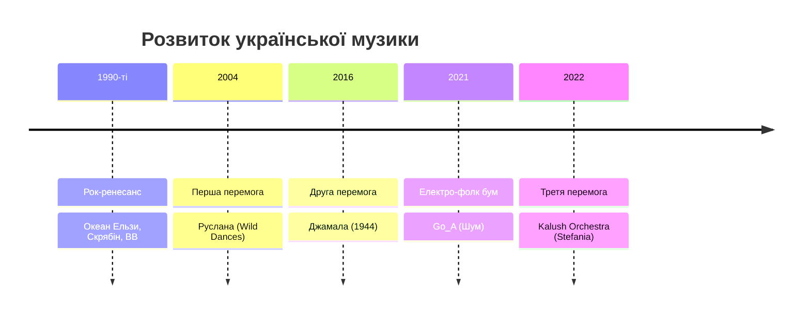

import Quiz from '@site/src/components/Quiz';
import MatchUp from '@site/src/components/MatchUp';
import FillIn from '@site/src/components/FillIn';
import TrueFalse from '@site/src/components/TrueFalse';
import Unjumble from '@site/src/components/Unjumble';
import GroupSort from '@site/src/components/GroupSort';
import Anagram from '@site/src/components/Anagram';
import ErrorCorrection, { ErrorCorrectionItem } from '@site/src/components/ErrorCorrection';
import Cloze from '@site/src/components/Cloze';
import Select from '@site/src/components/Select';
import Translate from '@site/src/components/Translate';
import MarkTheWords, { MarkTheWordsActivity } from '@site/src/components/MarkTheWords';
import HighlightMorphemes, { HighlightMorphemesActivity } from '@site/src/components/HighlightMorphemes';
import EssayResponse from '@site/src/components/EssayResponse';
import ComparativeStudy from '@site/src/components/ComparativeStudy';
import ReadingActivity from '@site/src/components/ReadingActivity';
import CriticalAnalysis from '@site/src/components/CriticalAnalysis';
import AuthorialIntent from '@site/src/components/AuthorialIntent';
import SourceEvaluation from '@site/src/components/SourceEvaluation';
import Debate from '@site/src/components/Debate';
import EtymologyTrace from '@site/src/components/EtymologyTrace';
import GrammarIdentify from '@site/src/components/GrammarIdentify';
import PaleographyAnalysis from '@site/src/components/PaleographyAnalysis';
import DialectComparison from '@site/src/components/DialectComparison';
import TranslationCritique from '@site/src/components/TranslationCritique';
import Transcription from '@site/src/components/Transcription';
import Observe from '@site/src/components/Observe';
import ActivityHelp from '@site/src/components/ActivityHelp';

:::warning[❗ **Чому це важливо?**]

Музика — це вікно в душу народу. Українська музична сцена пережила справжній ренесанс за останні десятиліття. Від перемог на Євробаченні до електронних експериментів — українські артисти здобули міжнародне визнання. Щоб по-справжньому зрозуміти сучасну Україну, потрібно знати її музику.
:::

## Вступ — Музика як ідентичність

Чи знаєте ви українських музикантів? Якщо ви читаєте новини про Україну, то напевно чули про **Kalush Orchestra**, **Go_A** або **Джамалу**. Але українська музична сцена набагато ширша за Євробачення.

Україна має багату музичну традицію — від народних пісень до сучасного репу. Кожен регіон має свої унікальні музичні традиції: карпатська коломийка, кримськотатарські мелодії, козацькі думи. А сучасні українські артисти поєднують ці традиції з глобальними трендами.

:::note[🏺 **У реальному житті**]

Українська музика звучить скрізь: у кав'ярнях Києва та Львова, на музичних фестивалях, у маршрутках та торгових центрах. Якщо ви приїдете в Україну, то обов'язково почуєте сучасні українські хіти — і тепер зможете їх зрозуміти та обговорити!
:::

У цьому модулі ви дізнаєтеся про історію української популярної музики, сучасних виконавців та музичні фестивалі. Ви вивчите слова для обговорення музики: **хіт**, **альбом**, **концерт**, **фестиваль**, **виконавець**, **гурт**.

---

## Історія та культура

### Текст 1: Історія української популярної музики

Українська популярна музика почала активно розвиватися в 1990-х роках, після здобуття незалежності. До цього українська музика існувала переважно в народному або радянському форматі.

**1990-ті:** Перші українські рок-гурти здобули популярність. **Океан Ельзи** з Львова став символом нової української музики. Їхній фронтмен **Святослав Вакарчук** написав пісні, які знає кожен українець. Інші важливі гурти того часу — **Скрябін**, **Вопл Відоплясова**, **Тартак**.

**2000-ні:** Україна вперше перемогла на Євробаченні. У 2004 році співачка **Руслана** виграла конкурс з енергійною піснею "Wild Dances", яка поєднувала електронну музику з карпатськими мотивами. Це була перша велика міжнародна перемога української музики.

**2010-ті та 2020-ті:** Нове покоління артистів експериментує з різними жанрами. Електронна музика, реп, інді-рок, неофолк — українська сцена стала надзвичайно різноманітною. Артисти як **Onuka**, **DakhaBrakha**, **Alyona Alyona** отримали міжнародне визнання.

:::note[📝 **Ви знали?**]

Океан Ельзи — найпопулярніший український рок-гурт. Їхній альбом "Модель" (2019) став тричі платиновим. Концерти гурту збирають стадіони по всій Україні. Назва "Океан Ельзи" походить від однойменної картини художника Юрія Сенька.
:::

:::note[📜 **Народна мудрість**]

В народі кажуть: **«Хто співає, той журбу розганяє»**. Музика в українській культурі завжди була не лише розвагою, а й способом пережити важкі часи та знайти силу.
:::

Багато пісень гурту стали неофіційними гімнами — як колись думи кобзарів підтримували дух козаків.

**Зв'язок з традицією:**

Сучасна українська музика має глибоке коріння. Бандура та кобзарська традиція вплинули на багатьох сучасних виконавців. Тарас Шевченко, який сам був кобзарем у поезії, надихає артистів і сьогодні. Калина, верба, рушник — ці символи з'являються в текстах сучасних пісень, поєднуючи минуле з сучасністю.

**Запитання для розуміння:**

1. Коли почала активно розвиватися українська популярна музика?
2. Хто виграв Євробачення для України вперше?
3. Які музичні жанри популярні серед сучасних українських артистів?

---

### Текст 2: Євробачення та міжнародний успіх

Євробачення стало важливою платформою для української музики. Україна тричі перемагала на цьому конкурсі, і кожна перемога мала особливе значення.

**2004 — Руслана:** Перша перемога. Руслана представила енергійний поп із карпатськими елементами. Її виступ був яскравим шоу з танцями та етнічними костюмами.

**2016 — Джамала:** Друга перемога. Пісня "1944" була присвячена депортації кримських татар. Це був глибокий, емоційний виступ, який торкнувся мільйонів глядачів. Перемога Джамали стала не лише музичною, а й культурною подією.

**2022 — Kalush Orchestra:** Третя перемога. Пісня "Stefania" поєднувала реп із народними мотивами. Гурт виступав під час війни, і їхня перемога стала символом української стійкості. "Stefania" — це пісня про матір, написана лідером гурту Олегом Псюком.

| Рік  | Виконавець       | Пісня       | Особливість                  |
| ---- | ---------------- | ----------- | ---------------------------- |
| 2004 | Руслана          | Wild Dances | Карпатські мотиви + електро  |
| 2016 | Джамала          | 1944        | Присвята депортованим        |
| 2022 | Kalush Orchestra | Stefania    | Реп + фолк, символ стійкості |

Крім перемог, Україна регулярно потрапляє в топ-10 Євробачення. Гурт **Go_A** з їхньою електро-фолк піснею "Шум" (2021) став справжнім хітом у соціальних мережах.

:::info[🕰️ **Культурний момент**]

Після перемоги Kalush Orchestra на Євробаченні 2022, пісня "Stefania" стала неофіційним гімном української стійкості. Її слухали мільйони людей по всьому світу. Фраза "Я завжди знайду шлях додому" набула нового, глибшого значення для українців.
:::

**Запитання для розуміння:**

1. Скільки разів Україна перемагала на Євробаченні?
2. Про що була пісня "1944" Джамали?
3. Чому перемога Kalush Orchestra мала особливе значення?

---

## Сучасність

### Текст 3: Сучасна українська музична сцена

Сучасна українська музика — це не лише Євробачення. В Україні є активна та різноманітна музична сцена з багатьма жанрами та напрямками.

**Електронна музика та неофолк:** Гурт **Onuka** поєднує електронну музику з народними інструментами. Їхні кліпи — це справжні витвори мистецтва. **DakhaBrakha** експериментує з етнічною музикою, створюючи унікальний "етно-хаос". Вони виступали на найбільших світових фестивалях.

**Реп та хіп-хоп:** Українська реп-сцена активно розвивається. **Alyona Alyona** — одна з найвідоміших реперок. Вона виступала на Coachella та інших міжнародних фестивалях. **Kalush Orchestra**, **Skofka**, **Мехенді** — ці артисти доводять, що український реп має свій унікальний голос.

**Інді та альтернатива:** Гурти як **Один в каное**, **Запорожець**, **Latexfauna** представляють альтернативну сцену. Їхня музика звучить у незалежних клубах Києва та Львова.

**Музичні фестивалі:** До 2022 року в Україні проходили великі музичні фестивалі:

| Фестиваль          | Місто | Жанри      | Особливість                       |
| ------------------ | ----- | ---------- | --------------------------------- |
| Atlas Weekend      | Київ  | Різні      | До 500 тис. відвідувачів          |
| Країна Мрій        | Київ  | Фолк, етно | Заснований Олегом Скрипкою        |
| Leopolis Jazz Fest | Львів | Джаз       | Один з найкращих у Східній Європі |
| Koktebel Jazz      | Одеса | Джаз       | Біля Чорного моря                 |

:::note[📝 **Цікавий факт**]

Українська електронна сцена має світове визнання. DJ та продюсери як **Nastia**, **Koloah**, **Vakula** грають на найбільших клубних подіях Європи. Київ став одним із центрів електронної музики в регіоні.
:::

**Запитання для розуміння:**

1. Які жанри популярні в сучасній українській музиці?
2. Назвіть три українські музичні фестивалі.
3. Хто такі DakhaBrakha і чим вони відомі?

---

## Практика

### Лексика для обговорення музики

Щоб говорити про музику українською, вам потрібні спеціальні слова та вирази. Ось основні категорії:

**Люди в музиці:**

- **виконавець** / **виконавиця** — загальне слово для артиста
- **співак** / **співачка** — той, хто співає
- **музикант** — той, хто грає на інструментах
- **гурт** / **група** — колектив музикантів

**Музичні продукти:**

- **пісня** — окремий музичний твір
- **хіт** — популярна пісня
- **альбом** — збірка пісень
- **кліп** — музичне відео

**Події:**

- **концерт** — виступ музиканта
- **фестиваль** — велика музична подія
- **тур** — серія концертів

**Жанри:**

- **поп** — популярна музика
- **рок** — рок-музика
- **реп** — реп-музика
- **фолк** — народна музика
- **електронна музика** — електроніка
- **джаз** — джазова музика
- **класика** — класична музика

:::tip[💡 **Колокації**]

- слухати **музику** / **пісню** / **альбом**
- йти на **концерт** / **фестиваль**
- грати **на гітарі** / **на фортепіано**
- випускати **альбом** / **пісню** / **кліп**
- виступати **на сцені** / **на концерті**
:::

### Огляд українських виконавців за жанрами

| Жанр         | Виконавці                     | Характеристика                    |
| ------------ | ----------------------------- | --------------------------------- |
| Рок          | Океан Ельзи, Скрябін, Бумбокс | Енергійний, стадіонний            |
| Електро-фолк | Onuka, Go_A, DakhaBrakha      | Народні інструменти + електроніка |
| Реп          | Alyona Alyona, Kalush, Skofka | Соціальні теми, сучасна мова      |
| Джаз         | Pianoбой, Jazzforacat         | Експериментальний, вишуканий      |
| Інді         | Запорожець, Latexfauna        | Незалежний, атмосферний           |

:::note[📝 **Куточок геймера**]

Музика з відеоігор, розроблених в Україні, теж є частиною української музичної культури. Саундтреки до ігор S.T.A.L.K.E.R. та Metro включають елементи української народної музики та бандури. Гра Kozaks теж використовувала автентичні козацькі мелодії.
:::

### Як говорити про музичні вподобання

**Щоб сказати, що вам подобається:**

- Мені подобається **українська музика**.
- Я люблю слухати **реп** / **рок** / **джаз**.
- Мій улюблений гурт — **Океан Ельзи**.
- Моя улюблена співачка — **Джамала**.

**Щоб запитати інших:**

- Яку музику ти слухаєш?
- Хто твій улюблений виконавець?
- Ти був/була на концерті **Onuka**?
- Чи знаєш ти **DakhaBrakha**?

**Щоб описати музику:**

| Прикметник       | Значення       | Приклад                              |
| ---------------- | -------------- | ------------------------------------ |
| енергійна        | energetic      | Ця пісня дуже енергійна!             |
| мелодійна        | melodic        | Музика Океану Ельзи мелодійна.       |
| глибока          | deep, profound | Пісні Джамали глибокі.               |
| популярний       | popular        | Go_A — популярний гурт.              |
| унікальний       | unique         | DakhaBrakha мають унікальний стиль.  |
| сучасна          | contemporary   | Onuka грає сучасну музику.           |
| традиційна       | traditional    | Кобзарі виконують традиційну музику. |
| експериментальна | experimental   | Їхня музика експериментальна.        |

:::note[🏺 **У реальному житті**]

Коли ви зустрічаєте українців, тема музики — чудовий спосіб почати розмову. Запитайте: "Що ти зараз слухаєш?" або "Який український гурт ти порадиш?" — і ви отримаєте багато рекомендацій!
:::

---

## Продукція

### Діалог 1: Обговорення улюбленої музики

**Олена:** Привіт! Що ти слухаєш?

**Тарас:** Привіт! Новий альбом Onuka. Ти знаєш цей гурт?

**Олена:** Так, звісно! Мені дуже подобається їхня музика. Вона така унікальна — електроніка з народними інструментами.

**Тарас:** Саме так! А ти на якому концерті була останнім часом?

**Олена:** Я ходила на концерт Океану Ельзи минулого року. Це було неймовірно — стадіон, тисячі людей, всі співають разом.

**Тарас:** О, я теж хочу побачити їх наживо. А який твій улюблений український виконавець?

**Олена:** Мабуть, Джамала. Її голос такий глибокий та емоційний.

**Тарас:** Згоден. А ти слухаєш український реп?

**Олена:** Інколи. Alyona Alyona мені подобається — вона така автентична.

---

### Діалог 2: Планування відвідування концерту

**Марко:** Чув, що Go_A приїжджають з концертом наступного місяця!

**Софія:** Справді? Я обожнюю їхню музику! Особливо пісню "Шум" — вона така енергійна.

**Марко:** Хочеш піти на концерт разом? Можу купити квитки.

**Софія:** Обов'язково! Скільки коштують квитки?

**Марко:** Дивлячись на місце. Біля сцени — дорожче, далі — дешевше.

**Софія:** Я б хотіла ближче до сцени, щоб добре бачити виступ.

**Марко:** Добре, я куплю два квитки. Концерт о дев'ятій, але краще прийти раніше.

**Софія:** Чудово! Це буде мій перший концерт Go_A наживо. Не можу дочекатися!

---

### Діалог 3: Розмова про Євробачення

**Андрій:** Ти дивився Євробачення цього року?

**Оля:** Так! Це було дуже емоційно. Kalush Orchestra виступили чудово.

**Андрій:** Їхня перемога мала особливе значення, правда?

**Оля:** Абсолютно. Пісня "Stefania" стала символом для багатьох українців.

**Андрій:** А яка твоя улюблена українська перемога на Євробаченні?

**Оля:** Важко вибрати. Джамала з "1944" — це було дуже потужно. А ти?

**Андрій:** Мені подобається енергія Руслани. Її виступ у 2004 був справжнім шоу.

**Оля:** Так, кожна перемога була по-своєму особливою.

---

### Діалог 4: Рекомендації музики

**Професор:** Сьогодні ми говоримо про українську культуру. Хто може порадити сучасну українську музику?

**Студент 1:** Я раджу послухати DakhaBrakha. Це етно-хаос — дуже незвичайна музика, яка поєднує різні традиції.

**Студент 2:** А я б порадила Onuka. Їхня електронна музика з народними інструментами — це щось особливе.

**Професор:** Цікаво! А як щодо реп-музики?

**Студент 1:** Alyona Alyona — дуже популярна реперка. Вона співає про реальне життя, соціальні теми.

**Студент 2:** І Kalush Orchestra теж варто послухати. Вони поєднують реп із фольклором.

**Професор:** Дякую за рекомендації! Тепер у мене є плейлист для вихідних.

---

## 📋 Підсумок

У цьому модулі ви дізналися про сучасну українську музику:

**Історія:**

- Українська популярна музика активно розвивається з 1990-х років
- Ключові гурти: Океан Ельзи, Скрябін, Вопл Відоплясова
- Україна тричі перемагала на Євробаченні (2004, 2016, 2022)

**Сучасна сцена:**

- Різноманітні жанри: електроніка, неофолк, реп, інді
- Важливі артисти: Onuka, DakhaBrakha, Alyona Alyona, Go_A
- Музичні фестивалі: Atlas Weekend, Країна Мрій, Leopolis Jazz Fest

**Лексика:**

- Слова для обговорення музики (хіт, альбом, концерт, фестиваль)
- Жанри (поп, рок, реп, фолк, електронна музика)
- Вирази для опису вподобань (мені подобається, мій улюблений)

> ✅ **Самоперевірка**
>
> Чи можете ви:
>
> - [ ] Назвати три українських виконавців різних жанрів?
> - [ ] Розповісти про перемоги України на Євробаченні?
> - [ ] Описати свої музичні вподобання українською?
> - [ ] Порадити українську музику іншим?
>
> Якщо так — ви готові до практики!

---

## Потрібно більше практики?

Ви завершили цей модуль! Ось кілька способів закріпити матеріал:

### 🔄 Інтеграція знань

- Поєднуйте матеріал цього модуля з попередніми темами
- Створіть mind map зв'язків між різними темами
- Практикуйте використання кількох тем одночасно

### 🎯 Реальне застосування

- Знайдіть ситуації в житті, де можна використати вивчене
- Читайте українські тексти і шукайте знайомі структури
- Спілкуйтеся з носіями мови, застосовуючи нові знання

### 🌐 Онлайн-ресурси

Додаткові матеріали для практики B1:

- **Українська мова онлайн:** [https://ukrainian-language.uk](https://ukrainian-language.uk)
- **Словник.ua:** [https://slovnyk.ua](https://slovnyk.ua) — для перевірки слів
- **YouTube канали:** Шукайте "українська мова B1" для додаткових уроків
- **Мовні обміни:** italki, Tandem, HelloTalk для практики з носіями

---

> 💡 **Порада:** Найкращий спосіб закріпити матеріал — використовувати його регулярно. Виділіть 10-15 хвилин щодня для повторення!

## 🎯 Вправи

### Розуміння українського музичного контексту

<Quiz questions={JSON.parse(`[{"question": "Який український гурт став символом нової української музики в 1990-х роках і досі залишається найпопулярнішим рок-гуртом країни?", "options": [{"text": "Скрябін", "correct": false}, {"text": "Океан Ельзи", "correct": true}, {"text": "Вопл Відоплясова", "correct": false}, {"text": "Тартак", "correct": false}], "explanation": "Океан Ельзи з Львова став символом нової української музики. Їхній фронтмен Святослав Вакарчук написав пісні, які знає кожен українець."}, {"question": "Яка українська співачка вперше принесла Україні перемогу на Євробаченні у 2004 році з піснею, що поєднувала електронну музику з карпатськими мотивами?", "options": [{"text": "Джамала", "correct": false}, {"text": "Тіна Кароль", "correct": false}, {"text": "Руслана", "correct": true}, {"text": "Ані Лорак", "correct": false}], "explanation": "Руслана виграла Євробачення 2004 з енергійною піснею \\"Wild Dances\\", яка поєднувала електронну музику з карпатськими мотивами."}, {"question": "Про що була пісня \\"1944\\" Джамали, з якою вона перемогла на Євробаченні 2016 року?", "options": [{"text": "Про кохання та розлуку", "correct": false}, {"text": "Про депортацію кримських татар", "correct": true}, {"text": "Про Другу світову війну", "correct": false}, {"text": "Про незалежність України", "correct": false}], "explanation": "Пісня \\"1944\\" була присвячена депортації кримських татар. Це був глибокий, емоційний виступ, який торкнувся мільйонів глядачів."}, {"question": "Який український гурт переміг на Євробаченні 2022 року з піснею \\"Stefania\\", яка поєднувала реп із народними мотивами?", "options": [{"text": "Go_A", "correct": false}, {"text": "Onuka", "correct": false}, {"text": "Kalush Orchestra", "correct": true}, {"text": "DakhaBrakha", "correct": false}], "explanation": "Kalush Orchestra переміг на Євробаченні 2022 з піснею \\"Stefania\\". Гурт виступав під час війни, і їхня перемога стала символом української стійкості."}, {"question": "Який український гурт відомий своїм стилем «етно-хаос» і поєднанням різних етнічних традицій у музиці?", "options": [{"text": "Onuka", "correct": false}, {"text": "DakhaBrakha", "correct": true}, {"text": "Go_A", "correct": false}, {"text": "Latexfauna", "correct": false}], "explanation": "DakhaBrakha експериментує з етнічною музикою, створюючи унікальний «етно-хаос». Вони виступали на найбільших світових фестивалях."}, {"question": "Скільки разів Україна перемагала на Євробаченні станом на 2022 рік?", "options": [{"text": "Один раз", "correct": false}, {"text": "Два рази", "correct": false}, {"text": "Три рази", "correct": true}, {"text": "Чотири рази", "correct": false}], "explanation": "Україна тричі перемагала на Євробаченні — у 2004 (Руслана), 2016 (Джамала) та 2022 (Kalush Orchestra)."}, {"question": "Який український музичний фестиваль збирав до 500 тисяч відвідувачів за чотири дні і проходив у Києві?", "options": [{"text": "Країна Мрій", "correct": false}, {"text": "Leopolis Jazz Fest", "correct": false}, {"text": "Atlas Weekend", "correct": true}, {"text": "Koktebel Jazz Festival", "correct": false}], "explanation": "Atlas Weekend у Києві збирав до 500 тисяч відвідувачів за чотири дні і був одним з найбільших музичних фестивалів України."}, {"question": "Хто заснував музичний фестиваль «Країна Мрій», присвячений українській музиці?", "options": [{"text": "Святослав Вакарчук", "correct": false}, {"text": "Олег Скрипка", "correct": true}, {"text": "Олег Псюк", "correct": false}, {"text": "Руслана", "correct": false}], "explanation": "Країна Мрій — фестиваль української музики, заснований Олегом Скрипкою з гурту Вопл Відоплясова."}, {"question": "Яка українська реперка виступала на Coachella та інших міжнародних фестивалях і співає про реальне життя та соціальні теми?", "options": [{"text": "Jerry Heil", "correct": false}, {"text": "Alyona Alyona", "correct": true}, {"text": "Джамала", "correct": false}, {"text": "Onuka", "correct": false}], "explanation": "Alyona Alyona — одна з найвідоміших українських реперок. Вона виступала на Coachella та інших міжнародних фестивалях і співає про реальне життя."}, {"question": "Який український гурт поєднує електронну музику з народними інструментами, і їхні кліпи вважаються витворами мистецтва?", "options": [{"text": "DakhaBrakha", "correct": false}, {"text": "Go_A", "correct": false}, {"text": "Onuka", "correct": true}, {"text": "Океан Ельзи", "correct": false}], "explanation": "Гурт Onuka поєднує електронну музику з народними інструментами. Їхні кліпи — це справжні витвори мистецтва."}]`)} />

### Факти про українську музику

<TrueFalse items={JSON.parse(`[{"statement": "Українська популярна музика почала активно розвиватися лише після 2000 року.", "isTrue": false, "explanation": "Українська популярна музика почала активно розвиватися в 1990-х роках, після здобуття незалежності у 1991 році."}, {"statement": "Океан Ельзи — це гурт з Львова, і їхній фронтмен — Святослав Вакарчук.", "isTrue": true, "explanation": "Так, Океан Ельзи з Львова став символом нової української музики, а Святослав Вакарчук — їхній фронтмен."}, {"statement": "Руслана виграла Євробачення з класичною оперною арією.", "isTrue": false, "explanation": "Руслана виграла Євробачення 2004 з енергійною піснею \\"Wild Dances\\", яка поєднувала електронну музику з карпатськими мотивами."}, {"statement": "Пісня \\"Stefania\\" Kalush Orchestra присвячена матері лідера гурту Олега Псюка.", "isTrue": true, "explanation": "\\"Stefania\\" — це пісня про матір, написана лідером гурту Олегом Псюком."}, {"statement": "Go_A виступали на Євробаченні 2021 з піснею «Шум», яка стала хітом у соціальних мережах.", "isTrue": true, "explanation": "Так, гурт Go_A з їхньою електро-фолк піснею «Шум» (2021) став справжнім хітом у соціальних мережах."}, {"statement": "DakhaBrakha грає виключно класичну народну музику без експериментів.", "isTrue": false, "explanation": "DakhaBrakha експериментує з етнічною музикою, створюючи унікальний «етно-хаос», поєднуючи різні традиції."}, {"statement": "Atlas Weekend — це джазовий фестиваль, який проходить у Львові.", "isTrue": false, "explanation": "Atlas Weekend — це великий музичний фестиваль різних жанрів у Києві. Джазовий фестиваль у Львові — це Leopolis Jazz Fest."}, {"statement": "Україна ніколи не потрапляла в топ-10 Євробачення, крім своїх перемог.", "isTrue": false, "explanation": "Україна регулярно потрапляє в топ-10 Євробачення, навіть без перемог."}, {"statement": "Onuka поєднує електронну музику з традиційними народними інструментами.", "isTrue": true, "explanation": "Так, гурт Onuka відомий саме поєднанням електроніки з народними інструментами."}, {"statement": "Київ став одним із центрів електронної музики в регіоні Східної Європи.", "isTrue": true, "explanation": "Так, українська електронна сцена має світове визнання, і Київ став одним із центрів електронної музики в регіоні."}, {"statement": "Leopolis Jazz Fest — це рок-фестиваль у Києві.", "isTrue": false, "explanation": "Leopolis Jazz Fest — це один з найкращих джазових фестивалів Східної Європи, який проходить у Львові."}, {"statement": "Alyona Alyona — це українська оперна співачка.", "isTrue": false, "explanation": "Alyona Alyona — одна з найвідоміших українських реперок, яка виступала на Coachella."}]`)} />

### Виконавці та їхні характеристики

<MatchUp pairs={JSON.parse(`[{"left": "Океан Ельзи", "right": "найпопулярніший український рок-гурт"}, {"left": "Руслана", "right": "перша перемога України на Євробаченні (2004)"}, {"left": "Джамала", "right": "\\"1944\\" — пісня про депортацію кримських татар"}, {"left": "Kalush Orchestra", "right": "реп із народними мотивами, перемога 2022"}, {"left": "DakhaBrakha", "right": "«етно-хаос», експерименти з етнічною музикою"}, {"left": "Onuka", "right": "електроніка з народними інструментами"}, {"left": "Go_A", "right": "електро-фолк, хіт «Шум»"}, {"left": "Alyona Alyona", "right": "українська реперка на Coachella"}, {"left": "Святослав Вакарчук", "right": "фронтмен Океану Ельзи"}, {"left": "Олег Скрипка", "right": "засновник фестивалю Країна Мрій"}, {"left": "Олег Псюк", "right": "лідер Kalush Orchestra"}, {"left": "Atlas Weekend", "right": "найбільший музичний фестиваль Києва"}]`)} />

### Музична лексика — переклад

<MatchUp pairs={JSON.parse(`[{"left": "хіт", "right": "hit"}, {"left": "альбом", "right": "album"}, {"left": "концерт", "right": "concert"}, {"left": "фестиваль", "right": "festival"}, {"left": "виконавець", "right": "performer, artist"}, {"left": "гурт", "right": "band"}, {"left": "співак", "right": "singer (male)"}, {"left": "кліп", "right": "music video"}, {"left": "сцена", "right": "stage"}, {"left": "слухач", "right": "listener"}, {"left": "шанувальник", "right": "fan"}, {"left": "тур", "right": "tour"}]`)} />

### Музична лексика в контексті

<Cloze passage={"Океан Ельзи — найпопулярніший український рок-[___:0]. Руслана випустила новий [___:1] з десятьма піснями. Мільйони людей дивляться новий [___:2] Onuka на YouTube.\nAtlas Weekend — найбільший музичний [___:3] України. Пісня \"Stefania\" стала справжнім [___:4] після Євробачення. Джамала — талановита українська [___:5].\nЯ хочу піти на [___:6] Океану Ельзи наступного тижня. DakhaBrakha виступали на [___:7] по всій Європі. Я великий [___:8] української музики і слухаю її щодня.\nKalush Orchestra планує великий [___:9] Європою наступного року. Мені подобається [___:10] музика — Onuka, DakhaBrakha. Alyona Alyona — відома українська [___:11].\nГурт DakhaBrakha має унікальний [___:12]. Цей гурт виконує [___:13]."} blanks={JSON.parse(`[{"index": 0, "answer": "гурт", "options": ["гурт", "пісня", "концерт", "хіт"]}, {"index": 1, "answer": "альбом", "options": ["альбом", "концерт", "кліп", "тур"]}, {"index": 2, "answer": "кліп", "options": ["кліп", "альбом", "концерт", "фестиваль"]}, {"index": 3, "answer": "фестиваль", "options": ["фестиваль", "концерт", "гурт", "хіт"]}, {"index": 4, "answer": "хітом", "options": ["хітом", "альбомом", "концертом", "кліпом"]}, {"index": 5, "answer": "співачка", "options": ["співачка", "співак", "гурт", "виконавець"]}, {"index": 6, "answer": "концерт", "options": ["концерт", "альбом", "кліп", "хіт"]}, {"index": 7, "answer": "сцені", "options": ["сцені", "альбомі", "хіті", "кліпі"]}, {"index": 8, "answer": "шанувальник", "options": ["шанувальник", "слухач", "виконавець", "концерт"]}, {"index": 9, "answer": "тур", "options": ["тур", "концерт", "альбом", "фестиваль"]}, {"index": 10, "answer": "електронна", "options": ["електронна", "класична", "народна", "джазова"]}, {"index": 11, "answer": "реперка", "options": ["реперка", "співачка", "рок-зірка", "джазистка"]}, {"index": 12, "answer": "стиль", "options": ["стиль", "альбом", "стиль", "голос"]}, {"index": 13, "answer": "неофолк", "options": ["неофолк", "джаз", "неофолк", "рок"]}]`)} />

### Категоризація музики

<GroupSort groups={JSON.parse(`{"Перемоги на Євробаченні": ["Руслана (2004)", "Джамала (2016)", "Kalush Orchestra (2022)"], "Електронна музика та неофолк": ["Onuka", "DakhaBrakha", "Go_A"], "Рок-музика": ["Океан Ельзи", "Скрябін", "Тартак"], "Реп та хіп-хоп": ["Alyona Alyona", "Kalush Orchestra", "Skofka"], "Музичні фестивалі": ["Atlas Weekend", "Країна Мрій", "Leopolis Jazz Fest"]}`)} />

### Виберіть правильні відповіді

<Select questions={JSON.parse(`[{"question": "Виберіть ВСІ українські перемоги на Євробаченні.", "options": [{"text": "Руслана (2004)", "correct": true}, {"text": "Тіна Кароль (2008)", "correct": false}, {"text": "Джамала (2016)", "correct": true}, {"text": "Go_A (2021)", "correct": false}, {"text": "Kalush Orchestra (2022)", "correct": true}], "explanation": ""}, {"question": "Виберіть ВСІ гурти, які експериментують з електронною музикою та фольклором.", "options": [{"text": "Onuka", "correct": true}, {"text": "Океан Ельзи", "correct": false}, {"text": "DakhaBrakha", "correct": true}, {"text": "Go_A", "correct": true}, {"text": "Скрябін", "correct": false}], "explanation": ""}, {"question": "Виберіть ВСІ музичні фестивалі, що проходили в Україні.", "options": [{"text": "Atlas Weekend", "correct": true}, {"text": "Країна Мрій", "correct": true}, {"text": "Leopolis Jazz Fest", "correct": true}, {"text": "Glastonbury", "correct": false}, {"text": "Coachella", "correct": false}], "explanation": ""}, {"question": "Виберіть ВСІ слова, що означають «музичний колектив».", "options": [{"text": "гурт", "correct": true}, {"text": "група", "correct": true}, {"text": "співак", "correct": false}, {"text": "виконавець", "correct": false}, {"text": "ансамбль", "correct": true}], "explanation": ""}, {"question": "Виберіть ВСІ жанри сучасної української музики.", "options": [{"text": "електронна музика", "correct": true}, {"text": "реп", "correct": true}, {"text": "неофолк", "correct": true}, {"text": "інді-рок", "correct": true}, {"text": "кантрі", "correct": false}], "explanation": ""}, {"question": "Виберіть ВСІ характеристики пісні \\"Stefania\\" Kalush Orchestra.", "options": [{"text": "поєднання репу з народними мотивами", "correct": true}, {"text": "присвячена матері Олега Псюка", "correct": true}, {"text": "перемога на Євробаченні 2022", "correct": true}, {"text": "класична оперна арія", "correct": false}, {"text": "інструментальна композиція", "correct": false}], "explanation": ""}, {"question": "Виберіть ВСІ характеристики гурту DakhaBrakha.", "options": [{"text": "стиль «етно-хаос»", "correct": true}, {"text": "експерименти з етнічною музикою", "correct": true}, {"text": "виступи на світових фестивалях", "correct": true}, {"text": "виключно електронна музика", "correct": false}, {"text": "рок-гурт з Львова", "correct": false}], "explanation": ""}, {"question": "Виберіть ВСІ правильні колокації з музичною лексикою.", "options": [{"text": "слухати музику", "correct": true}, {"text": "йти на концерт", "correct": true}, {"text": "випускати альбом", "correct": true}, {"text": "робити пісню", "correct": false}, {"text": "грати на гітарі", "correct": true}], "explanation": ""}]`)} />

### Текст про українську музику

<Cloze passage={"Українська музика переживає справжній [___:0] за останні десятиліття. Україна тричі [___:1] на Євробаченні: у 2004 році Руслана виграла з [___:2] піснею \"Wild Dances\".\nСучасна українська сцена дуже [___:3]. Гурт Onuka поєднує [___:4] музику з народними інструментами. DakhaBrakha створює унікальний \"[___:5]\", експериментуючи з різними [___:6].\nУ сфері репу Alyona Alyona стала справжньою [___:7]. Вона виступала на [___:8] та інших міжнародних [___:9].\nДо 2022 року в Україні проходили великі музичні [___:10]. Atlas Weekend у [___:11] збирав до 500 тисяч [___:12]. Leopolis Jazz Fest у Львові став одним з найкращих [___:13] фестивалів Східної Європи.\n"} blanks={JSON.parse(`[{"index": 0, "answer": "ренесанс", "options": ["ренесанс", "занепад", "ренесанс", "кризу"]}, {"index": 1, "answer": "перемагала", "options": ["перемагала", "програвала", "перемагала", "виступала"]}, {"index": 2, "answer": "енергійною", "options": ["енергійною", "сумною", "енергійною", "повільною"]}, {"index": 3, "answer": "різноманітна", "options": ["різноманітна", "однакова", "різноманітна", "обмежена"]}, {"index": 4, "answer": "електронну", "options": ["електронну", "класичну", "електронну", "рок"]}, {"index": 5, "answer": "етно-хаос", "options": ["етно-хаос", "рок-н-рол", "етно-хаос", "джаз"]}, {"index": 6, "answer": "традиціями", "options": ["традиціями", "правилами", "традиціями", "законами"]}, {"index": 7, "answer": "зіркою", "options": ["зіркою", "початківцем", "зіркою", "невідомою"]}, {"index": 8, "answer": "Coachella", "options": ["Coachella", "Євробаченні", "Coachella", "Atlas Weekend"]}, {"index": 9, "answer": "фестивалях", "options": ["фестивалях", "стадіонах", "фестивалях", "клубах"]}, {"index": 10, "answer": "фестивалі", "options": ["фестивалі", "концерти", "фестивалі", "змагання"]}, {"index": 11, "answer": "Києві", "options": ["Києві", "Львові", "Києві", "Одесі"]}, {"index": 12, "answer": "відвідувачів", "options": ["відвідувачів", "артистів", "відвідувачів", "пісень"]}, {"index": 13, "answer": "джазових", "options": ["джазових", "рокових", "джазових", "попових"]}]`)} />

### Складіть речення про музику

<Unjumble items={JSON.parse(`[{"jumbled": "Я / дуже / сильно / люблю / слухати / сучасну / українську / музику", "answer": "Я дуже сильно люблю слухати сучасну українську музику."}, {"jumbled": "Океан / Ельзи / — / це / найбільш / популярний / та / відомий / український / рок-гурт", "answer": "Океан Ельзи — це найбільш популярний та відомий український рок-гурт."}, {"jumbled": "Наша / Україна / вже / тричі / успішно / перемагала / на / конкурсі / Євробаченні", "answer": "Наша Україна вже тричі успішно перемагала на конкурсі Євробаченні."}, {"jumbled": "Onuka / поєднує / електронну / музику / з / народними / інструментами", "answer": "Onuka поєднує електронну музику з народними інструментами."}, {"jumbled": "Я / хочу / піти / на / концерт / наступного / тижня", "answer": "Я хочу піти на концерт наступного тижня."}, {"jumbled": "Alyona / Alyona / — / це / відома / та / талановита / українська / реперка", "answer": "Alyona Alyona — це відома та талановита українська реперка."}, {"jumbled": "В / Україні / щороку / проходили / великі / та / відомі / музичні / фестивалі", "answer": "В Україні щороку проходили великі та відомі музичні фестивалі."}, {"jumbled": "Гурт / DakhaBrakha / грає / у / своєму / унікальному / стилі / етно-хаос", "answer": "Гурт DakhaBrakha грає у своєму унікальному стилі етно-хаос."}]`)} />

### Виправте помилки в реченнях про музику

<ErrorCorrection>
  <ErrorCorrectionItem sentence="Я хочу піти в концерт Океану Ельзи." errorWord="в" correctForm="на" options={JSON.parse(`["в", "на", "до", "із"]`)} explanation="Правильно говорити «піти НА концерт», а не «в концерт»." />
  <ErrorCorrectionItem sentence="Руслана виграла Євробачення з класичним оперним піснем." errorWord="піснем" correctForm="піснею" options={JSON.parse(`["піснем", "піснею", "пісня", "пісні"]`)} explanation="«Пісня» — жіночий рід, тому правильно «з піснею», а не «з піснем»." />
  <ErrorCorrectionItem sentence="DakhaBrakha — це гурт що грає етно-хаос." errorWord="що" correctForm="який" options={JSON.parse(`["що", "який", "котрий", "хто"]`)} explanation="Для означення «гурт» використовуємо «який», а не «що»." />
  <ErrorCorrectionItem sentence="Мій улюблений співачка — Джамала." errorWord="улюблений" correctForm="улюблена" options={JSON.parse(`["улюблений", "улюблена", "улюблене", "улюблені"]`)} explanation="«Співачка» — жіночий рід, тому прикметник теж у жіночому роді: «улюблена»." />
  <ErrorCorrectionItem sentence="Kalush Orchestra випустив новий альбом минулому році." errorWord="минулому" correctForm="минулого" options={JSON.parse(`["минулому", "минулого", "минулий", "минулім"]`)} explanation="Правильно «минулого року» (родовий відмінок), а не «минулому році»." />
  <ErrorCorrectionItem sentence="Я слухаю українську музику щодень." errorWord="щодень" correctForm="щодня" options={JSON.parse(`["щодень", "щодня", "кожний день", "всі дні"]`)} explanation="Правильно «щодня» (прислівник), а не «щодень»." />
  <ErrorCorrectionItem sentence="Atlas Weekend — найбільший фестиваль України, що збирає 500 тисяч людей." errorWord="людей" correctForm="відвідувачів" options={JSON.parse(`["людей", "відвідувачів", "людин", "особи"]`)} explanation="У контексті фестивалю краще використовувати «відвідувачів», хоча «людей» граматично правильно. Це стилістична рекомендація." />
  <ErrorCorrectionItem sentence="Onuka поєднує електронну музику із народні інструменти." errorWord="народні" correctForm="народними" options={JSON.parse(`["народні", "народними", "народних", "народним"]`)} explanation="Після прийменника «з/із» потрібен орудний відмінок — «з народними інструментами»." />
</ErrorCorrection>

### Переклад музичних фраз

<Translate questions={JSON.parse(`[{"source": "I love listening to Ukrainian music.", "options": [{"text": "Я люблю слухаю українську музику.", "correct": false}, {"text": "Я люблю слухати українську музику.", "correct": true}, {"text": "Мені люблю слухати українську музику.", "correct": false}, {"text": "Я люблю слухати україньску музику.", "correct": false}]}, {"source": "My favorite band is Okean Elzy.", "options": [{"text": "Мій улюблений гурт — це Океан Ельзи.", "correct": true}, {"text": "Моя улюблена гурт — це Океан Ельзи.", "correct": false}, {"text": "Мій улюблений група — Океан Ельзи.", "correct": false}, {"text": "Моє улюблене гурт — Океан Ельзи.", "correct": false}]}, {"source": "Ukraine won Eurovision three times.", "options": [{"text": "Україна виграла Євробачення три разів.", "correct": false}, {"text": "Україна тричі перемогла на Євробаченні.", "correct": true}, {"text": "Україна перемагала Євробачення три рази.", "correct": false}, {"text": "Україна виграв Євробачення тричі.", "correct": false}]}, {"source": "I want to go to a concert next week.", "options": [{"text": "Я хочу піти на концерт наступного тижня.", "correct": true}, {"text": "Я хочу йти в концерт наступний тиждень.", "correct": false}, {"text": "Я хочу піти до концерту наступного тижня.", "correct": false}, {"text": "Я хотіла піти на концерт наступного тижня.", "correct": false}]}, {"source": "This song is very popular in Ukraine.", "options": [{"text": "Ця пісня дуже популярний в Україні.", "correct": false}, {"text": "Ця пісня дуже популярна в Україні.", "correct": true}, {"text": "Ця пісня дуже популярне на Україні.", "correct": false}, {"text": "Це пісня дуже популярна в Україні.", "correct": false}]}, {"source": "DakhaBrakha combines different ethnic traditions.", "options": [{"text": "DakhaBrakha комбінує різні етнічні традиції.", "correct": false}, {"text": "DakhaBrakha поєднує різні етнічні традиції.", "correct": true}, {"text": "DakhaBrakha з'єднує різних етнічних традицій.", "correct": false}, {"text": "DakhaBrakha поєднує різних етнічних традицій.", "correct": false}]}, {"source": "What music do you listen to?", "options": [{"text": "Яку музику ти слухаєш?", "correct": true}, {"text": "Що музику ти слухаєш?", "correct": false}, {"text": "Яка музика ти слухаєш?", "correct": false}, {"text": "Яку музику ти слухати?", "correct": false}]}, {"source": "The band released a new album.", "options": [{"text": "Гурт випустив новий альбом.", "correct": true}, {"text": "Гурт випустила новий альбом.", "correct": false}, {"text": "Гурт випустило нового альбому.", "correct": false}, {"text": "Гурт випустивши новий альбом.", "correct": false}]}]`)} />

### Знайдіть музичну лексику

<MarkTheWords>
  <MarkTheWordsActivity instruction="Натисніть на всі слова, пов'язані з музикою." text="Українська музика переживає ренесанс. Сучасні гурти як Onuka та DakhaBrakha випускають нові альбоми та кліпи. Їхні концерти збирають тисячі шанувальників. На фестивалях як Atlas Weekend можна почути різні напрямки — від репу до електроніки. Українські артисти здобули міжнародне визнання, а їхні хіти звучать по всьому світу." correctWords={JSON.parse(`["музика", "гурти", "альбоми", "кліпи", "концерти", "шанувальників", "фестивалях", "репу", "електроніки", "хіти"]`)} />
</MarkTheWords>

### Українська музика сьогодні

<ReadingActivity title="Українська музика сьогодні" context="" resource={JSON.parse(`{"type": "article", "url": "https://example.com/ukrainian-music", "title": "Стаття про музичну сцену України"}`)} tasks={JSON.parse(`["Що сталося з українською музикою після 2014 року?", "Який гурт представляв Україну на Євробаченні з піснею «Шум»?", "Які музичні фестивалі популярні в Україні?"]`)} isUkrainian={true} />

## 📚 Словник

| Слово | Вимова | Переклад | ЧМ | Примітка |
| --- | --- | --- | --- | --- |
| **альбом** | /alʲbˈɔm/ | album | ім |  |
| **артист** | /artˈɪst/ | artist, performer | ім |  |
| **бандура** | /bandˈura/ | bandura (instrument) | ім |  |
| **виконавиця** | /ʋɪkɔnˈaʋɪt͡sja/ | performer (female) | ім |  |
| **витвір** | /ʋˈɪtʋir/ | creation, work of art | ім |  |
| **вопл** | /ʋɔpl/ | wail | ім |  |
| **відоплясов** | /ʋidɔpljasɔʋ/ | Vidoplyasov | ім |  |
| **десятиліття** | /dɛsjatɪlˈittja/ | decade | ім |  |
| **джаз** | /dʒaz/ | jazz | ім |  |
| **джазовий** | /dʒˈazɔʋɪj/ | jazz (adj) | прикм |  |
| **джамала** | /dʒamala/ | Jamala (singer) | ім |  |
| **електро-фолк** | /ɛlɛktrɔ-fɔlk/ | electro-folk | ім |  |
| **електроніка** | /ɛlɛktrˈɔnika/ | electronics | ім |  |
| **етно-хаос** | /ˈɛtnɔ-xaɔs/ | ethno-chaos | ім |  |
| **жанр** | /ʒanr/ | genre | ім |  |
| **запорожець** | /zapɔrˈɔʒɛt͡sʲ/ | Zaporozhets | ім |  |
| **каное** | /kanˈɔɛ/ | canoe | ім |  |
| **клубний** | /klˈubnɪj/ | club (adj) | прикм |  |
| **кліп** | /klip/ | clip, music video | ім |  |
| **мелодія** | /mɛlˈɔdija/ | melody | ім |  |
| **мехенді** | /mɛxɛndi/ | mehndi | ім |  |
| **нажива** | /naʒˈɪʋa/ | gain, profit | ім |  |
| **неофолк** | /nɛɔfɔlk/ | neofolk | ім |  |
| **неофіційний** | /nɛɔfit͡sˈijnɪj/ | unofficial | прикм |  |
| **плейлист** | /plɛjlɪst/ | playlist | ім |  |
| **потужно** | /pɔtˈuʒnɔ/ | powerfully | присл |  |
| **присвячений** | /prɪsʋˈjat͡ʃɛnɪj/ | dedicated | прикм |  |
| **продюсер** | /prɔdˈjusɛr/ | producer | ім |  |
| **ренесанс** | /rɛnɛsˈans/ | Renaissance | ім |  |
| **реп** | /rɛp/ | rap (music) | ім |  |
| **реп-музика** | /rɛp-mˈuzɪka/ | rap music | ім |  |
| **реп-сцена** | /rɛp-st͡sˈɛna/ | rap scene | ім |  |
| **реперка** | /rɛpɛrka/ | rapper (female) | ім |  |
| **рок-музика** | /rɔk-mˈuzɪka/ | rock music | ім |  |
| **руслан** | /ruslˈan/ | Ruslan (name) | ім |  |
| **саундтрек** | /saundtrˈɛk/ | soundtrack | ім |  |
| **скрябін** | /skrjabin/ | Skryabin (name) | ім |  |
| **співак** | /spiʋˈak/ | singer | ім |  |
| **створюючи** | /stʋˈɔrjujut͡ʃɪ/ | creating | дієсл |  |
| **стійкість** | /stˈijkistʲ/ | stability, resilience | ім |  |
| **торкнутися** | /tɔrknˈutɪsja/ | to touch (perfective) | дієсл |  |
| **хіп-хоп** | /xip-xɔp/ | hip hop | ім |  |
| **ширший** | /ʃˈɪrʃɪj/ | wider (adj) | прикм |  |
| **шоу** | /ʃˈɔu/ | show | ім |  |