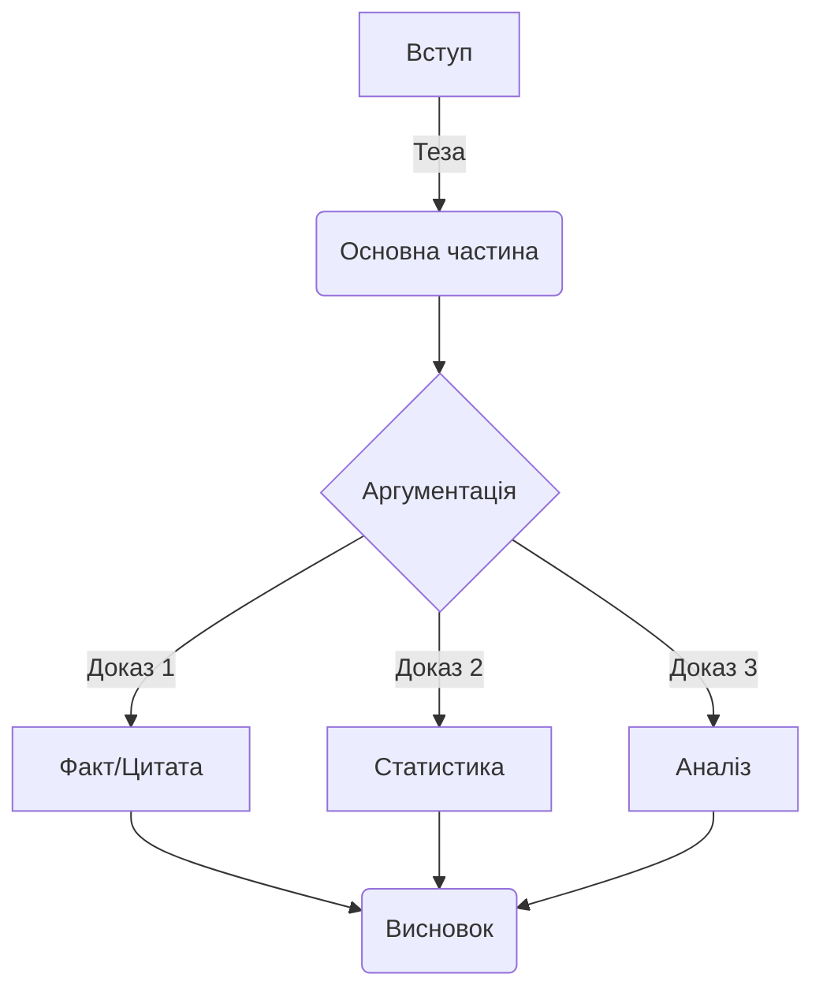

import Quiz from '@site/src/components/Quiz';
import MatchUp from '@site/src/components/MatchUp';
import FillIn from '@site/src/components/FillIn';
import TrueFalse from '@site/src/components/TrueFalse';
import Unjumble from '@site/src/components/Unjumble';
import GroupSort from '@site/src/components/GroupSort';
import Anagram from '@site/src/components/Anagram';
import ErrorCorrection, { ErrorCorrectionItem } from '@site/src/components/ErrorCorrection';
import Cloze from '@site/src/components/Cloze';
import Select from '@site/src/components/Select';
import Translate from '@site/src/components/Translate';
import MarkTheWords, { MarkTheWordsActivity } from '@site/src/components/MarkTheWords';
import HighlightMorphemes, { HighlightMorphemesActivity } from '@site/src/components/HighlightMorphemes';
import EssayResponse from '@site/src/components/EssayResponse';
import ComparativeStudy from '@site/src/components/ComparativeStudy';
import ReadingActivity from '@site/src/components/ReadingActivity';
import CriticalAnalysis from '@site/src/components/CriticalAnalysis';
import AuthorialIntent from '@site/src/components/AuthorialIntent';

> 🎯 **Чому це важливо?**
>
> Перехід від рівня B2 до C1 — це якісний стрибок від "розуміння мови" до "володіння мовою як інструментом". На рівні B2 ви навчилися вільно спілкуватися, але академічна та професійна сфери вимагають іншої точності, глибини та стилістичної гнучкості. Цей модуль допоможе вам систематизувати набуті знання, закріпити навички використання пасивного стану та складних синтаксичних конструкцій, а також підготує фундамент для написання наукових текстів та фахових дискусій українською мовою. Ви навчитеся не просто говорити, а формулювати думки з академічною досконалістю.

## Вступ: Від впевненого користувача до майстра слова

**Контекст:**
Це уривок з есе профільного лінгвіста, який розглядає психологічні та мовні бар'єри, що виникають у студентів під час переходу на просунутий рівень вивчення мови. Особлива увага приділяється відмінності між розмовним та академічним стилями.

Освічені українці часто опиняються в пастці плато рівня B2 (Intermediate Plateau). Чому це відбувається? Вони вільно спілкуються, розуміють новини, але коли треба написати наукову статтю чи виступити з офіційною промовою, відчувають брак засобів. **Уявіть це як різницю між вмінням водити автомобіль містом і здатністю пілотувати винищувач: правила руху схожі, але швидкість, складність та відповідальність зовсім інші.** Здається, що вершину вже підкорено, але насправді це лише базовий табір перед штурмом Евересту майстерності. Чи готові ви зробити цей крок?
Проте саме тут починається найскладніший етап — шлях до мовної досконалості. Академічний рівень володіння українською мовою вимагає не лише знання слів, але й розуміння їхньої ваги, контексту та стилістичного забарвлення.

💡 **Чому це важливо?**
Українці миттєво відчувають різницю між професійним викладом та аматорським «переказом». Неправильний вибір регістру в академічному середовищі звучить як фальшива нота в опері — вона не псує всю мелодію, але змушує професіоналів здригнутися.

Насамперед, варто зазначити, що академічний стиль характеризується високим рівнем абстракції та об'єктивності. Якщо у розмовній мові ми кажемо «я думаю», то в науковому тексті доречніше вжити «вважається» або «можна стверджувати». Це не просто зміна слів, це зміна перспективи: від суб'єктивного до об'єктивного. Саме тут набувають ваги пасивні конструкції та безособові форми, які дозволяють зосередити увагу не на діячеві, а на дії чи явищі. **Наприклад, замість того щоб сказати «я дослідив це питання», науковець напише «це питання було ґрунтовно досліджено». Це дозволяє усунути «авторське я» і дати фактам говорити самим за себе.**

**Порівняйте розмову двох колег:**

**А:** Ти вже бачив результати тесту?
**Б:** Так, я глянув. Там все збігається.
**А:** Круто, значить ми праві.

**А тепер подивіться, як це виглядає в академічному діалозі:**

**Професор:** Чи було верифіковано результати останнього тестування?
**Докторант:** Так, пане професоре. Отримані дані повністю корелюють із попередніми показниками.
**Професор:** Отже, ми можемо констатувати правильність нашої початкової гіпотези.

**Бачите різницю? В першому випадку ми маємо справу з обміном враженнями, у другому — з фіксацією наукового факту.**

Крім того, перехід до C1 передбачає опанування складної синтаксичної архітектури. Речення стають розгалуженими, насиченими дієприкметниковими та дієприслівниковими зворотами. Це дозволяє висловити думку максимально точно, з усіма нюансами та застереженнями. Наприклад, замість того щоб сказати «Ми зробили експеримент і побачили результат», науковець напише: «Провівши серію експериментів, було виявлено закономірність, яка підтверджує попередню гіпотезу». **Зокрема, використання таких конструкцій допомагає уникнути однозначності та категоричності там, де потрібна наукова обережність. Ви як дослідник не просто «бачите результат», ви «виявляєте закономірність на підставі аналізу».**

Українці мають чудове прислів'я: **«Не кажи „гоп“, поки не перескочиш»**. В академічному світі це можна перефразувати так: **«Не робіть остаточних висновків до завершення верифікації даних»**. Зверніть увагу, як народна мудрість застерігає від поспішності — саме те, чого вимагає наукова об'єктивність. **Чи не є це найкращим доказом того, що точність закладена в самому генетичному коді нашої мови?**

Така трансформація мовлення потребує систематизації знань про граматику, яку студенти часто вважають нудною. Однак без глибокого розуміння структури мови неможливо побудувати переконливу аргументацію. Консолідація навичок, отриманих на попередніх етапах, є критично важливою для подальшого поступу. **Це як будівництво хмарочоса: якщо ваш фундамент (граматика B2) має тріщини, ви ніколи не зможете добудувати верхні поверхи (стилістика C1).**

Важливим компонентом успіху на цьому етапі є читання складних текстів. Не адаптованих оповідань, а оригінальних наукових статей, монографій, філософських есе. Читаючи академічну літературу, ви «вбираєте» в себе ритм та логіку наукового мислення. Поступово ви почнете помічати, як автори будують аргументацію, як вони пов'язують абзаци між собою та уникають тавтологій за допомогою багатого синонімічного ряду. Таке пасивне навчання згодом переростає в активну майстерність, коли ви самі сідаєте за написання есе чи доповіді.

Цікаво, що багато хто плутає складність з ускладненістю. Майстерність полягає не в тому, щоб говорити заплутано, а в тому, щоб висловлювати складні ідеї прозоро та елегантно. Просунутий рівень — це вміння вибрати з тисячі слів саме те єдине, яке найточніше передає суть. Подібне мистецтво потребує не лише практики, а й глибокого аналізу текстів, що написані визнаними майстрами слова.

Отже, міст до C1 будується на трьох китах: усвідомленні стилістичних відмінностей, вдосконаленні граматичної точності та розширенні лексичного запасу за рахунок абстрактних та фахових понять. Хоча це серйозний виклик, результатом стане здатність не просто спілкуватися, а творити нові смисли українською мовою.

## Текст 2: Українська мова в сучасному науковому дискурсі

**Контекст:**
Уривок з оглядової статті в науковому журналі «Мовознавство», присвяченої відродженню та розвитку української наукової термінології та стилістики в XXI столітті.

Інтеграція України у світовий науковий простір ставить нові вимоги до функціонування державної мови. Довгий час у науковому середовищі панувала думка про недостатню розробленість української термінології в певних галузях, що було наслідком імперської політики лінгвоциду та штучного витіснення української мови на маргінеси «хатнього вжитку». Сьогодні ми спостерігаємо зворотний процес: мова повертає собі статус інструменту високої науки, здатного описувати найтонші нюанси квантової фізики чи генетики. **Чи замислювалися ви, наскільки важливим є цей процес для національної безпеки та ідентичності?**

Розвиток фахової мови нерозривно пов'язаний із процесами термінотворення. Термінологія, що здавалася штучною, сьогодні органічно вплітається в канву наукових праць. За даними Інституту української мови (2023), понад 85% нових дисертацій захищаються саме українською. Щобільше, спостерігається тенденція до очищення мови від кальок та запозичень там, де існують питомі відповідники. Скажімо, замість «співпадати» (калька з російської) науковці дедалі частіше вживають «збігатися», а замість «відміняти» — «скасовувати». **Також, замість калькованого «приймати участь» у науковому дискурсі тепер панує нормативне «брати участь».**
Таке прагнення до точності свідчить про поглиблення мовної свідомості науковців.

Важливу роль у цьому процесі відіграють термінологічні комісії та інститути, які працюють над укладанням нових стандартів. Вони аналізують світовий досвід та шукають відповідники, що базуються на внутрішніх ресурсах української мови. Копітка праця приносить плоди, адже термін має бути не лише українським, а й точно відповідати міжнародному поняттю.

**Ось як може виглядати дискусія про термін:**

**Редактор:** Чому ви вжили термін «відсоток» замість «процент»?
**Автор:** Я вважаю, що «відсоток» — це питоме українське слово, яке краще панує в нашому науковому контексті.
**Редактор:** Погоджуюся. Це сприяє очищенню мови від зайвих запозичень.

**А ось приклад офіційної комунікації:**

**Аспірант:** Чи можу я включити цей аналіз до розділу «Висновки»?
**Науковий керівник:** Варто спочатку провести систематизацію даних у третьому розділі.
**Аспірант:** Зрозумів, дякую. Відтак я зможу краще обґрунтувати свою тезу.

Іноді це призводить до дискусій у науковій спільноті, але саме в таких дискусіях народжується істина і викристалізовується мовна норма.

Науковий стиль сучасної української мови характеризується низкою специфічних рис. По-перше, це логічність та послідовність викладу. Кожна теза має бути обґрунтована, а висновки — випливати з наведених аргументів. Для забезпечення зв'язності тексту широко використовуються вставні конструкції (отже, таким чином, по-перше, з одного боку).

**Приклади вставних конструкцій у реченнях:**

- **Отже, результати дослідження підтверджують нашу гіпотезу.**
- **З одного боку, ми бачимо прогрес, а з іншого — наявність певних ризиків.**
- **Таким чином, необхідно переглянути існуючу методологію.**
- **По-перше, ми проаналізували першоджерела, що дало змогу виявити закономірність.**
- **Навпаки, отримані дані свідчать про зворотну тенденцію розвитку явища.**
- **Зокрема, особливу увагу слід звернути на динаміку показників.**
- **Звісно, цей підхід потребує подальшого вдосконалення та перевірки.**
- **На жаль, брак фінансування загальмував проведення другого етапу експерименту.**
- **Безперечно, внесок українських вчених у світову науку є надзвичайно вагомим.**
- **Мабуть, це питання залишиться дискусійним ще довгий час.**

По-друге, це точність слововживання. Науковий термін прагне до однозначності. Якщо в художньому стилі багатозначність є перевагою, то в науковому — недоліком. Проте, це не означає, що наукова мова суха. Навпаки, українська наукова традиція, що бере початок від праць Грушевського та Кримського, вирізняється багатством синтаксисних конструкцій та милозвучністю. **Пам'ятайте: складність ідеї не обов'язково означає її «нечитабельність». Справжній майстер пише так, щоб його зрозумів колега, а не так, щоб його не зрозумів ніхто.**

:::info[**Літературний контекст**]

Іван Франко був не лише видатним письменником, а й доктором філософії. Його наукові праці — це взірець академічного стилю кінця XIX – початку XX століття (Франко, 1898). Читаючи його статті з економіки чи літературознавства, можна помітити, як віртуозно він поєднував наукову точність із багатством народної мови. Франко довів, що українська мова здатна обслуговувати найскладніші інтелектуальні запити ще тоді, коли багато хто в цьому сумнівався. **Зокрема, він першим почав активно використовувати термін «інтелігенція» у науковому контексті.**
:::

Синтез традиції та новаторства є ключовим для сучасного етапу. Ми не відкидаємо здобутки минулого, але адаптуємо їх до потреб сьогодення. Важливим аспектом є також повернення до активних дієприкметників, які раніше таврувалися як «нехарактерні», обережно повертаються в текст там, де це не порушує милозвучності. Як стверджує професор Пономарів (2011), мова — це живий організм, і навіть у суворій науці є місце для еволюції. Чи не є це свідченням зрілості нашої академічної спільноти?
Пасивні конструкції залишаються домінуючими для опису процесів, де виконавець не є важливим. **Наприклад, ми скажемо «закони приймаються», а не «міністри приймають закони», бо в центрі уваги — сам закон та його дія.**

Оцінювання якості наукового тексту базується не лише на новизні дослідження, а й на культурі мовлення. Недбале ставлення до мови часто сприймається як ознака непрофесійності. Тому для молодого науковця опанування академічного стилю є не менш важливим завданням, ніж проведення власне експериментів чи аналізу джерел. **Уявіть, що ваша наукова ідея — це діамант. Але без належного мовного огранювання вона може виглядати як звичайний камінь для випадкового перехожого.**

:::tip[**Лінгвістичне спостереження**]

В українській науковій термінології варто розрізняти суфікси, що позначають процес і наслідок. Іменники на **-ання/-ення** зазвичай позначають процес (_озброєння_ як дія, _дослідження_ як процес). Натомість іменники з іншими суфіксами або без них можуть позначати предмет чи наслідок (_зброя_, _дослід_). Однак у багатьох випадках слова на **-ання** (наприклад, _дослідження_, _рішення_) позначають і процес, і його результат, залежно від контексту. Точність у виборі суфікса — ознака високої мовної культури.
:::

Зверніть увагу на вживання слова **«відтак»**. У сучасній українській мові, особливо в публіцистичному та науковому стилях, його часто помилково вживають у значенні «тому», «отже» (наслідок). Насправді ж, основне значення «відтак» — це «потім», «після того» (часова послідовність). Хоча мовна норма є динамічною, в академічному письмі краще дотримуватися точних значень: для наслідку використовуйте _отже, тому, таким чином_, а для часу — _потім, згодом, відтак_.

Розширення сфер вжитку української мови сприяє її вдосконаленню. Чим більше ми пишемо та говоримо про науку українською, тим гнучкішою та багатшою вона стає. Це живий процес, до якого долучається кожен, хто обирає українську мову мовою своєї професійної діяльності.

Тепер, коли ми розглянули обидва тексти, порівняймо їхні підходи. Це допоможе вам наочно побачити межу між суб'єктивною есеїстикою та об'єктивним академічним стилем.

## Порівняльний аналіз

### Стилістичні засоби та Регістр

Обидва тексти належать до сфери інтелектуального мовлення, проте мають відмінності у регістрі та тоні. **Це як різниця між лекцією в університеті та приватною бесідою з професором за філіжанкою кави: в обох випадках ви обговорюєте науку, але дистанція та вибір слів будуть різними.**

**Текст 1 (Есе лінгвіста):**

- **Регістр:** Науково-популярний, місцями публіцистичний. Автор звертається безпосередньо до читача, використовує метафори («підкорено вершину», «на трьох китах»).
- **Тон:** Заохочувальний, аналітичний, особистісний. **Автор ніби веде вас за руку через складні моменти, підтримуючи та надихаючи.**
- **Синтаксис:** Поєднання простих речень для емоційного впливу та складних для пояснення нюансів.
- **Лексика:** Використовує слова, що описують процес навчання (_опанування, вдосконалення, майстерність_).

**Текст 2 (Стаття в журналі):**

- **Регістр:** Суто науковий (академічний). Текст більш відсторонений, об'єктивний. **Тут автор — лише голос науки, який констатує факти, не забарвлюючи їх власними емоціями.**
- **Tон:** Формальний, стверджувальний, інформативний.
- **Синтаксис:** Переважають розгорнуті складні речення, пасивні конструкції (_було наслідком, спостерігаємо процес, характеризується_).
- **Лексика:** Насичений термінологією (_інтеграція, дискурс, лінгвоцид, термінотворення_).

💡 **Порада для навчання**
Не намагайтеся одразу писати як автори Тексту 2. Почніть з формату есе (Текст 1), де ви можете бути собою, але вже використовуєте академічні «маркери». Поступово «авторське я» зникатиме, поступаючись місцем об’єктивному аналізу. **Це природна еволюція вашого академічного голосу.**

:::info[**Порівняння регістрів**]

Порівняйте фразу з Тексту 1: _"Здається, що вершину вже підкорено."_ та фразу, яку міг би вжити автор Тексту 2 для вираження схожої думки: _"Створюється ілюзія завершеності процесу навчання."_
Перший варіант — образний, метафоричний, ближчий до художнього або публіцистичного стилю. Другий — абстрактний, номінативний (використовує іменники замість дієслів), що є маркером наукового стилю. **Бачите різницю? Один текст «малює картину», інший — «будує модель».**
:::

### Граматичний фокус: Пасивний стан

В обох текстах використовуються пасивні конструкції, але з різною метою.
У Тексті 1: _«вершину вже підкорено»_ (безособова форма на -но/-то). Акцент на стані завершеності.
У Тексті 2: _«думка... була наслідком»_ (пасивне значення через дієслово-зв'язку). Акцент на причинно-наслідкових зв'язках.

:::caution[**Складність для іноземців**]

Українська мова, на відміну від англійської, має багатшу палітру безособових форм (зроблено, написано, вирішено). Вони дозволяють уникнути прямого називання виконавця дії, що ідеально підходить для наукового стилю, де важливий сам факт, а не особа дослідника. В англійській це часто передається через Passive Voice (_it was done_), але українська форма на -но/-то має відтінок "результативності", якого іноді бракує звичайному пасиву.
:::

### Структура академічного тексту

## Письмо: Академічне есе

**Завдання:**
Напишіть коротке есе (200-250 слів) на тему: **«Чому академічна доброчесність та точність мовлення є важливими для сучасного науковця?»**. Використайте принаймні 5 слів з нового словника (наприклад: _систематизація, аналіз, обґрунтування, плагіат, цитування_).

**Структура:**

1.  **Вступ:** Визначення проблеми та теза. (Наприклад: Точність мовлення — це ввічливість науковця).
2.  **Основна частина:** 1-2 аргументи. Використовуйте пасивні конструкції та вставні слова (_по-перше, з іншого боку_).
3.  **Висновок:** Підсумок.

**Зразок відповіді (Model Answer):**

:::success[✅ Model Answer]
**Тема: Важливість академічної доброчесності та точності**

У сучасному глобалізованому світі наука розвивається надзвичайно стрімкими темпами. У цьому контексті **академічна** доброчесність та точність викладу думок набувають критичного значення. Мова йде не лише про дотримання формальних правил, а про фундамент довіри в науковій спільноті.

По-перше, точність термінології забезпечує однозначність сприйняття інформації. Якщо дослідник використовує терміни некоректно, це може призвести до хибних інтерпретацій результатів його роботи. **Аналіз** наукових джерел має бути об'єктивним, а висновки — логічно обґрунтованими. Будь-яке **узагальнення** повинно спиратися на перевірені факти.

По-друге, академічна доброчесність є запорукою розвитку науки. Присвоєння чужих ідей гальмує прогрес і знецінює працю колег. **Опанування** культури цитування демонструє повагу до попередників та дозволяє чітко розмежувати власні здобутки та відомі факти.

Отже, прагнення до **досконалості** у мовному оформленні та етична поведінка є невід'ємними складовими професіоналізму. **Консолідація** зусиль науковців навколо цих принципів сприятиме підвищенню авторитету української науки у світі.
:::

:::note[**Академічна перспектива**]

Українська синтаксична традиція толерує довші речення, ніж англійська. Проте в сучасному науковому письмі спостерігається тенденція до скорочення довжини речень задля кращої читабельності (вплив глобального _Plain Language movement_). Пам'ятайте: складність думки не обов'язково означає складність граматичної конструкції. Ясність — це ввічливість автора.
:::

:::info[**Культурна значущість**]

Термін "фаховий" походить від німецького _Fach_ (професія, спеціальність), що свідчить про глибокі історичні зв'язки української освіти з європейською традицією. За радянських часів це слово часто витіснялося словом "професійний", але сьогодні "фах" і "фаховий" активно повертаються в академічний обіг, підкреслюючи самобутність української термінології.
:::

## 📋 Підсумок

У цьому модулі ми розглянули ключові відмінності між рівнем B2 та C1, зосередившись на академічній точності, об'єктивності та стилістичній гнучкості. Ви проаналізували два тексти, порівняли їхні регістри та потренувалися у використанні пасивних конструкцій. Тепер ви готові до глибшого занурення у світ української академічної мови.

---

## Потрібно більше практики?

Ви завершили цей модуль! Ось кілька способів закріпити матеріал:

### 🔄 Інтеграція знань

- Поєднуйте матеріал цього модуля з попередніми темами
- Створіть mind map зв'язків між різними темами
- Практикуйте використання кількох тем одночасно

### 🎯 Реальне застосування

- Знайдіть ситуації в житті, де можна використати вивчене
- Читайте українські тексти і шукайте знайомі структури
- Спілкуйтеся з носіями мови, застосовуючи нові знання

### 🌐 Онлайн-ресурси

Додаткові матеріали для практики C1:

- **Українська мова онлайн:** [https://ukrainian-language.uk](https://ukrainian-language.uk)
- **Словник.ua:** [https://slovnyk.ua](https://slovnyk.ua) — для перевірки слів

## 🎯 Вправи

### Знайдіть відповідність: терміни з Тексту 1

<MatchUp pairs={JSON.parse(`[{"left": "опанування", "right": "процес глибокого вивчення та засвоєння навички"}, {"left": "консолідація", "right": "зміцнення, об'єднання та систематизація знань"}, {"left": "абстракція", "right": "мислене виділення суттєвих ознак предмета"}, {"left": "об'єктивність", "right": "неупередженість, відсутність особистого ставлення"}, {"left": "аргументація", "right": "процес наведення доказів для обґрунтування тези"}, {"left": "вдосконалення", "right": "покращення, розвиток до вищого рівня якості"}, {"left": "майстерність", "right": "високий рівень професіоналізму та вправності"}, {"left": "трансформація", "right": "суттєва зміна форми, вигляду або властивостей"}, {"left": "елегантність", "right": "вишуканість, простота і ясність викладу думки"}, {"left": "нюанс", "right": "ледь помітна відмінність, тонкість у значенні"}, {"left": "систематизація", "right": "приведення знань у певну логічну систему"}, {"left": "інтеграція", "right": "процес об'єднання частин у єдине ціле"}, {"left": "синтез", "right": "поєднання окремих елементів у цілісну систему"}, {"left": "оцінювання", "right": "визначення якості або значення наукового тексту"}, {"left": "підкорення", "right": "досягнення високої мети через значні зусилля"}, {"left": "поступ", "right": "рух вперед, прогрес у вивченні мови"}]`)} />

### Розуміння Тексту 1

<Quiz questions={JSON.parse(`[{"question": "У контексті переходу від рівня B2 до просунутого рівня C1, чому, на думку автора тексту, досягнення рівня впевненого користувача може вводити студента в оману щодо його реального прогресу?", "options": [{"text": "Людина може переоцінити свої знання, вважаючи, що вже все вивчила.", "correct": true}, {"text": "Екзамени на рівень B2 занадто прості для перевірки реальних знань.", "correct": false}, {"text": "На цьому рівні зникає будь-яка мотивація вчитися далі.", "correct": false}, {"text": "Рівень B2 взагалі не дає можливості вільно читати новини.", "correct": false}], "explanation": "Автор зазначає, що впевненість у спілкуванні може створити ілюзію, що вершину вже підкорено."}, {"question": "Розглядаючи психологічні та мовні бар'єри студентів, у чому автор тексту вбачає головну відмінність академічного стилю від звичайного розмовного мовлення, яке ми використовуємо щодня?", "options": [{"text": "У використанні виключно складних та часто незрозумілих слів.", "correct": false}, {"text": "У високому рівні абстракції та прагненні до максимальної об'єктивності.", "correct": true}, {"text": "У повній відсутності дієслів у довгих наукових реченнях.", "correct": false}, {"text": "У надмірній емоційності та експресивності викладу думок.", "correct": false}], "explanation": "Академічний стиль вимагає переходу від суб'єктивного «я думаю» до об'єктивного викладу фактів."}, {"question": "Яку специфічну роль відіграють пасивні конструкції та безособові форми в науковому тексті при описі різноманітних процесів або складних явищ, що вимагають відстороненого погляду?", "options": [{"text": "Вони роблять текст непотрібно нудним і занадто довгим для читання.", "correct": false}, {"text": "Вони дозволяють зосередити увагу на самій дії, а не на її виконавцеві.", "correct": true}, {"text": "Вони використовуються лише в дуже застарілих та архаїчних текстах.", "correct": false}, {"text": "Вони показують невпевненість автора у власних наукових висновках.", "correct": false}], "explanation": "Пасивні форми допомагають досягти об'єктивності, зміщуючи акцент на процес або результат."}, {"question": "Чому синтаксис на рівні C1 стає значно складнішим і насиченим різноманітними дієприкметниковими та дієприслівниковими зворотами у науковому письмі, порівняно з попередніми рівнями навчання?", "options": [{"text": "Це робиться спеціально, щоб заплутати пересічного читача статті.", "correct": false}, {"text": "Щоб показати багатство словникового запасу автора перед колегами.", "correct": false}, {"text": "Щоб висловити думку максимально точно, з усіма необхідними нюансами.", "correct": true}, {"text": "Тому що прості речення офіційно заборонені в сучасній науці.", "correct": false}], "explanation": "Розгалужені речення дозволяють передати складні логічні зв'язки та застереження."}, {"question": "Як саме автор аналізованого тексту визначає справжню мовну майстерність при переході студента на просунутий рівень володіння українською мовою як інструментом для творчості?", "options": [{"text": "Як вміння говорити максимально швидко і без будь-яких пауз.", "correct": false}, {"text": "Як здатність використовувати якомога більше рідкісних та незрозумілих слів.", "correct": false}, {"text": "Як вміння висловлювати складні ідеї прозоро, чітко та елегантно.", "correct": true}, {"text": "Як написання текстів без жодної граматичної чи пунктуаційної помилки.", "correct": false}], "explanation": "Складність не дорівнює ускладненості; майстерність — це ясність та точність вибору слова."}, {"question": "Що є необхідною та критично важливою умовою для побудови переконливої наукової аргументації згідно з міркуваннями автора есе, спрямованими на глибоке розуміння основ мови?", "options": [{"text": "Глибоке та систематичне розуміння структури мови та її граматики.", "correct": true}, {"text": "Наявність дуже гучного голосу та велика особиста харизма автора.", "correct": false}, {"text": "Постійне використання цитат виключно дуже відомих та успішних людей.", "correct": false}, {"text": "Повна відсутність будь-яких пауз під час публічного мовлення.", "correct": false}], "explanation": "Систематизація знань про граматику дозволяє будувати логічні та переконливі конструкції."}, {"question": "Яке специфічне порівняння використовує автор для наочного опису процесу побудови моста до рівня C1 у вивченні української мови, підкреслюючи триєдність необхідних знань?", "options": [{"text": "Будівництво надійного мосту, що міцно стоїть на трьох китах.", "correct": true}, {"text": "Сходження на дуже високу гору без спеціального альпіністського спорядження.", "correct": false}, {"text": "Перепливання бурхливого та непередбачуваного океану на невеликому човні.", "correct": false}, {"text": "Політ людини у відкритий космос без будь-якої попередньої підготовки.", "correct": false}], "explanation": "Автор пише, що міст до C1 будується на трьох китах: стилістиці, граматиці та лексиці."}, {"question": "Що саме мається на увазі под терміном «зміна перспективи» у контексті написання якісного наукового тексту, де автор повинен відмовитися від надмірної емоційної суб'єктивності?", "options": [{"text": "Перехід від детального розгляду дрібних деталей до загальної картини.", "correct": false}, {"text": "Перехід від суб'єктивного погляду автора до об'єктивного опису явищ.", "correct": true}, {"text": "Повна зміна теми наукового дослідження в процесі його написання.", "correct": false}, {"text": "Використання іншої мови для написання висновків до своєї роботи.", "correct": false}], "explanation": "Це зміна фокусу: від «я так бачу» до «так є насправді» (обґрунтовано)."}, {"question": "Яке саме значення має складне слово «консолідація» у контексті вдосконалення мовних навичок на просунутому рівні вивчення мови, де важливе об'єднання теорії та практики?", "options": [{"text": "Повна відмова від усіх старих мовних звичок та навичок.", "correct": false}, {"text": "Процес об'єднання та остаточного закріплення отриманих раніше навичок.", "correct": true}, {"text": "Вивчення виключно нових правил без повторення попереднього матеріалу.", "correct": false}, {"text": "Свідоме спрощення складного матеріалу для легшого розуміння.", "correct": false}], "explanation": "Консолідація — це процес зміцнення фундаменту знань."}, {"question": "Що, на думку автора, є кінцевим та найважливішим результатом успішного переходу студента на академічний рівень C1, який відкриває нові професійні горизонти для фахівця?", "options": [{"text": "Здатність самостійно творити нові смисли та ідеї українською мовою.", "correct": true}, {"text": "Отримання офіційного диплома про повну вищу освіту в університеті.", "correct": false}, {"text": "Постійна можливість виправляти граматичні помилки інших людей.", "correct": false}, {"text": "Поступове забування своєї рідної мови через інтенсивне навчання.", "correct": false}], "explanation": "Найвищий рівень володіння мовою дозволяє не просто репродукувати, а продукувати нове."}, {"question": "Яке саме специфічне ставлення багатьох студентів до вивчення граматики згадує автор у своєму есе про мовну майстерність, пояснюючи необхідність подолання інтелектуальних труднощів?", "options": [{"text": "Вони її щиро обожнюють і вважають найцікавішою частиною мови.", "correct": false}, {"text": "Вони досить часто вважають вивчення граматики нудною та марудною справою.", "correct": true}, {"text": "Вони вважають граматику найлегшою та найпростішою частиною курсу.", "correct": false}, {"text": "Вони її просто повністю ігнорують під час написання своїх робіт.", "correct": false}], "explanation": "Автор зазначає, що студенти часто вважають систематизацію граматики нудною справою."}, {"question": "Яка саме лексика та граматичні форми дозволяють науковцеві зосередити увагу читача на явищі, а не на конкретній особі, що проводить це дослідження?", "options": [{"text": "Дуже емоційна та експресивна лексика, що вражає читача.", "correct": false}, {"text": "Специфічні безособові форми дієслів, такі як «вважається» чи «доведено».", "correct": true}, {"text": "Особові займенники «я» та «ми» у кожному реченні тексту.", "correct": false}, {"text": "Використання виключно прикметників вищого та найвищого ступенів порівняння.", "correct": false}], "explanation": "Такі форми як «вважається», «досліджено» прибирають суб'єкт і акцент на дію."}]`)} />

### Синоніми: Загальні vs Академічні

<MatchUp pairs={JSON.parse(`[{"left": "однаковий", "right": "тотожний"}, {"left": "доказ", "right": "аргумент"}, {"left": "пояснення", "right": "інтерпретація"}, {"left": "перевірка", "right": "верифікація"}, {"left": "наслідок", "right": "результат"}, {"left": "покращення", "right": "оптимізація"}, {"left": "важливий", "right": "актуальний"}, {"left": "суперечка", "right": "дискусія"}, {"left": "думка", "right": "гіпотеза"}, {"left": "об'єднання", "right": "інтеграція"}, {"left": "скасовувати", "right": "анулювати"}, {"left": "збігатися", "right": "корелювати"}, {"left": "належний", "right": "адекватний"}, {"left": "передбачення", "right": "прогноз"}, {"left": "виділення", "right": "сегментація"}, {"left": "уточнення", "right": "специфікація"}]`)} />

### Розуміння Тексту 2

<Quiz questions={JSON.parse(`[{"question": "Що, згідно з текстом, було основною причиною тривалого панування думки про недостатню розробленість української термінології у багатьох галузях?", "options": [{"text": "Природна лінгвістична бідність української мови порівняно з іншими.", "correct": false}, {"text": "Імперська політика лінгвоциду та штучне витіснення мови на маргінеси.", "correct": true}, {"text": "Повна відсутність будь-яких фахових науковців на території України.", "correct": false}, {"text": "Надмірна складність української граматики для наукового викладу думок.", "correct": false}], "explanation": "Текст вказує на історичні політичні причини, а не на лінгвістичні недоліки."}, {"question": "Який саме позитивний процес ми спостерігаємо сьогодні в українській науковій мові згідно з даними наукового журналу «Мовознавство» та останніх мовних досліджень?", "options": [{"text": "Повернення мові статусу повноцінного інструменту високої світової науки.", "correct": true}, {"text": "Свідоме спрощення наукового стилю до рівня простого побутового спілкування.", "correct": false}, {"text": "Масове та неконтрольоване запозичення виключно англійських фахових термінів.", "correct": false}, {"text": "Повна відмова від створення будь-яких нових питомих слів у науці.", "correct": false}], "explanation": "Мова відновлює свої позиції у складних сферах, як-от генетика чи фізика."}, {"question": "Яка основна та найбільш виразна тенденція спостерігається сьогодні у складних процесах термінотворення в сучасному українському науковому середовищі, що прагне до автентичності?", "options": [{"text": "Очищення мови від кальок та активне використання питомих відповідників.", "correct": true}, {"text": "Використання виключно латинських термінів для опису всіх нових явищ.", "correct": false}, {"text": "Свідоме збереження та консервація старої радянської термінології.", "correct": false}, {"text": "Штучне створення максимально довгих та складних для вимови слів.", "correct": false}], "explanation": "Замість кальок (співпадати) вживаються питомі слова (збігатися)."}, {"question": "Що, на думку авторів статті, є головною запорукою логічності та необхідної зв'язності сучасного українського наукового тексту, що забезпечує чітке розуміння ідей?", "options": [{"text": "Постійне використання багатьох окличних речень для привернення уваги.", "correct": false}, {"text": "Широке використання вставних конструкцій та логічних конекторів (отже, по-перше).", "correct": true}, {"text": "Розбиття всього тексту на дуже короткі абзаци по одному реченню.", "correct": false}, {"text": "Багаторазове повторення однієї і тієї самої думки різними словами.", "correct": false}], "explanation": "Логічні конектори забезпечують послідовність викладу думок."}, {"question": "Чим саме науковий термін принципово відрізняється від художнього слова у контексті його вживання в професійному тексті, де важлива відсутність двозначності?", "options": [{"text": "Він завжди має дуже багато різних та часто протилежних значень.", "correct": false}, {"text": "Він завжди прагне до максимальної однозначності та точності поняття.", "correct": true}, {"text": "Він обов'язково має бути значно коротшим за звичайне розмовне слово.", "correct": false}, {"text": "Він завжди звучить мелодійніше та приємніше для вуха читача.", "correct": false}], "explanation": "Точність і однозначність — ключові вимоги до терміна, на відміну від художньої багатозначності."}, {"question": "Як у тексті статті спростовується поширена думка про те, що українська наукова мова є надто сухою та нецікавою для викладу складних філософських ідей?", "options": [{"text": "Автор стверджує, що сухість — це основна і позитивна характеристика науки.", "correct": false}, {"text": "Вона вирізняється багатством синтаксичних конструкцій та великою милозвучністю.", "correct": true}, {"text": "Наукова мова суха лише в точних науках, а в гуманітарних — ні.", "correct": false}, {"text": "Українська наукова мова намагається бути максимально схожою на англійську.", "correct": false}], "explanation": "Автор посилається на традицію Грушевського і Кримського, яка поєднує науковість з красою мови."}, {"question": "Яка саме роль активних дієприкметників у сучасному науковому стилі української мови на сучасному етапі її розвитку, згідно з рекомендаціями професора Пономарева?", "options": [{"text": "Вони повністю і офіційно заборонені для вживання в наукових працях.", "correct": false}, {"text": "Вони поступово повертаються в текст там, де це не порушує милозвучності.", "correct": true}, {"text": "Вони вже повністю замінили всі пасивні конструкції в усіх наукових статтях.", "correct": false}, {"text": "Вони використовуються тільки в поезії і ніколи в науковій літературі.", "correct": false}], "explanation": "Відбувається обережне повернення до активних форм, хоча пасивні залишаються домінуючими."}, {"question": "На яких саме ключових факторах базується сучасне професійне оцінювання якості будь-якого наукового тексту в Україні, щоб уникнути враження непрофесійності автора?", "options": [{"text": "Виключно на новизні ідей та відсутності аналогів у світовій науці.", "correct": false}, {"text": "На новизні самого дослідження та на високій загальній культурі мовлення.", "correct": true}, {"text": "На великій кількості сторінок та загальній вазі друкованої праці.", "correct": false}, {"text": "Тільки на кількості використаних іноземних джерел у списку літератури.", "correct": false}], "explanation": "Недбала мова може знівелювати вартість навіть цікавого дослідження."}, {"question": "Як саме, згідно з висновками статті, постійне розширення сфер вжитку української мови у професійній діяльності впливає на її внутрішній інтелектуальний розвиток?", "options": [{"text": "Вона поступово псується через вплив багатьох розмовних елементів.", "correct": false}, {"text": "Вона стає значно гнучкішою, багатшою та краще пристосованою до потреб.", "correct": true}, {"text": "Вона стає занадто складною для вивчення іноземними студентами.", "correct": false}, {"text": "Це розширення взагалі ніяк не впливає на внутрішню структуру мови.", "correct": false}], "explanation": "Практика використання мови в нових сферах розвиває її можливості."}, {"question": "Що саме автор тексту називає справжнім «живим процесом», до якого сьогодні свідомо долучається кожен науковець, обираючи державну мову для роботи?", "options": [{"text": "Процес безпосереднього написання своєї першої дисертації в університеті.", "correct": false}, {"text": "Вдосконалення мови через постійну професійну діяльність та спілкування.", "correct": true}, {"text": "Процес викладання свого предмета студентам у вищих навчальних закладах.", "correct": false}, {"text": "Процес видання великої кількості наукових журналів та збірників праць.", "correct": false}], "explanation": "Кожен науковець, що пише українською, робить внесок у розвиток мови."}, {"question": "Кого саме згадує автор як видатних засновників та титанів традиції української наукової мови, що довели її спроможність обслуговувати складні запити?", "options": [{"text": "Класиків літератури Тараса Шевченка та Івана Франка.", "correct": false}, {"text": "Видатних вчених Михайла Грушевського та Агатангела Кримського.", "correct": true}, {"text": "Михайла Коцюбинського та видатну поетесу Лесю Українку.", "correct": false}, {"text": "Григорія Сковороду та засновника нової літератури Івана Котляревського.", "correct": false}], "explanation": "Михайло Грушевський та Агатангел Кримський — титани української науки."}, {"question": "Яке саме слово автор статті наводить як яскравий приклад помилкової та небажаної кальки з російської мови у сучасному науковому мовленні?", "options": [{"text": "Слово «співпадати» (яке є прямою калькою російського слова).", "correct": true}, {"text": "Питоме українське слово «збігатися», що є нормативним.", "correct": false}, {"text": "Слово «скасовувати», яке використовується в юридичній сфері.", "correct": false}, {"text": "Слово «відмінювати», що стосується граматичних категорій.", "correct": false}], "explanation": "«Співпадати» є калькою (рос. совпадать), правильно — «збігатися»."}]`)} />

### Розподіліть фрази за стилем

<GroupSort groups={JSON.parse(`{"Академічний/Науковий": ["Встановлено кореляцію між показниками.", "Метою дослідження є аналіз проблематики.", "Слід зазначити, що гіпотеза підтвердилася.", "Результати експерименту вимагають подальшої верифікації.", "Актуальність теми зумовлена низкою факторів.", "Термінологія потребує уніфікації.", "Аналіз джерел показав наявність протиріч."], "Публіцистичний/Есеїстичний": ["Мова — це живий організм, що постійно росте.", "Ми стоїмо на порозі великих змін.", "Варто замислитися над майбутнім нашої науки.", "Ця проблема хвилює кожного свідомого громадянина.", "Ми не можемо стояти осторонь прогресу.", "Час вимагає від нас рішучих дій."], "Розмовний": ["Я думаю, що це круто.", "Треба просто взяти і зробити.", "Ну, типу, це не зовсім так.", "Давай швиденько розберемося з цим.", "Мені здається, він правий.", "Це взагалі ні в які ворота не лізе."]}`)} />

### Академічні звороти

<FillIn items={JSON.parse(`[{"sentence": "___, що результати дослідження є попередніми.", "answer": "Варто зазначити", "options": ["Варто зазначити", "Я хочу сказати", "Слухай", "Мабуть"]}, {"sentence": "Ця теорія ___ на працях відомих вітчизняних учених.", "answer": "ґрунтується", "options": ["ґрунтується", "стоїть", "лежить", "тримається"]}, {"sentence": "Нам вдалося ___ закономірність розподілу даних.", "answer": "виявити", "options": ["виявити", "побачити", "знайти", "намацати"]}, {"sentence": "У статті ___ питання екологічної безпеки.", "answer": "розглядаються", "options": ["розглядаються", "говоряться", "пишуться", "розказуються"]}, {"sentence": "Автор ___ переконливі аргументи на користь своєї гіпотези.", "answer": "наводить", "options": ["наводить", "дає", "каже", "ставить"]}, {"sentence": "Цей метод ___ високою ефективністю.", "answer": "характеризується", "options": ["характеризується", "має", "володіє", "відзначається"]}, {"sentence": "Ми дійшли ___ про необхідність зміни підходу.", "answer": "висновку", "options": ["висновку", "кінця", "рішення", "думки"]}, {"sentence": "Експеримент було ___ у лабораторних умовах.", "answer": "проведено", "options": ["проведено", "зроблено", "виконано", "пророблено"]}, {"sentence": "Отримані дані ___ з результатами попередніх тестів.", "answer": "збігаються", "options": ["збігаються", "співпадають", "однакові", "сходяться"]}, {"sentence": "___ уваги заслуговує той факт, що...", "answer": "Особливої", "options": ["Особливої", "Великої", "Окремої", "Спеціальної"]}, {"sentence": "___ аналізу джерел, ми виокремили три етапи.", "answer": "На підставі", "options": ["На підставі", "Через", "Завдяки", "Із-за"]}, {"sentence": "Ця проблема потребує ___ вивчення.", "answer": "детального", "options": ["детального", "сильного", "великого", "глибокого"]}]`)} />

### Виправте стилістичні помилки

<ErrorCorrection>
  <ErrorCorrectionItem sentence="У цій роботі ми подивилися на проблеми освіти." errorWord="подивилися на" correctForm="проаналізували" options={JSON.parse(`["проаналізували", "розглянули", "побачили", "глянули"]`)} explanation="В академічному стилі замість «подивитися» краще вживати «проаналізувати» або «розглянути»." />
  <ErrorCorrectionItem sentence="Вчені зробили багато дослідів." errorWord="зробили" correctForm="провели" options={JSON.parse(`["провели", "виконали", "створили", "вчинили"]`)} explanation="Досліди «проводять», а не «роблять»." />
  <ErrorCorrectionItem sentence="Ця тема дуже класна і цікава." errorWord="класна" correctForm="актуальна" options={JSON.parse(`["актуальна", "важлива", "перспективна", "значуща"]`)} explanation="Слово «класна» є оцінним і розмовним. В науці використовують «актуальна»." />
  <ErrorCorrectionItem sentence="Автор каже про важливість мови." errorWord="каже" correctForm="зазначає" options={JSON.parse(`["зазначає", "стверджує", "наголошує", "пише"]`)} explanation="Замість нейтрального «каже» краще вжити «зазначає», «наголошує»." />
  <ErrorCorrectionItem sentence="Результати співпадають з очікуваннями." errorWord="співпадають" correctForm="збігаються" options={JSON.parse(`["збігаються", "корелюють", "відповідають", "ідентичні"]`)} explanation="«Співпадати» — калька. Нормативне слово — «збігатися»." />
  <ErrorCorrectionItem sentence="Ми рішили проблему забруднення." errorWord="рішили" correctForm="вирішили" options={JSON.parse(`["вирішили", "розв'язали", "врегулювали", "усунули"]`)} explanation="Завдання або проблему «вирішують» або «розв'язують»." />
  <ErrorCorrectionItem sentence="Треба прийняти міри." errorWord="прийняти міри" correctForm="вжити заходів" options={JSON.parse(`["вжити заходів", "зробити дії", "прийняти дії", "зробити кроки"]`)} explanation="«Прийняти міри» — калька. Українською: «вжити заходів»." />
  <ErrorCorrectionItem sentence="Дані вірні." errorWord="вірні" correctForm="правильні" options={JSON.parse(`["правильні", "коректні", "точні", "достовірні"]`)} explanation="Дані можуть бути правильно або достовірно. «Вірний» — це про відданість (вірний друг)." />
  <ErrorCorrectionItem sentence="Мова йдеться про економіку." errorWord="Мова йдеться" correctForm="Йдеться" options={JSON.parse(`["Йдеться", "Мова йде", "Говориться", "Сказано"]`)} explanation="Правильна конструкція: «Йдеться про...» або «Мова про...». «Мова йдеться» — помилка." />
  <ErrorCorrectionItem sentence="У кінці кінців ми отримали результат." errorWord="У кінці кінців" correctForm="Зрештою" options={JSON.parse(`["Зрештою", "Врешті-решт", "Насамкінець", "У підсумку"]`)} explanation="«В конце концов» перекладається як «зрештою» або «врешті-решт»." />
</ErrorCorrection>

### Академічна доброчесність

<Cloze passage={"Академічна доброчесність — це сукупність етичних [___:0], якими мають керуватися учасники освітнього процесу. До них належать [___:1], довіра, справедливість, повага та відповідальність. Порушенням доброчесності вважається [___:2] — привласнення чужих ідей без посилання на [___:3]. Кожен науковець зобов'язаний дотримуватися правил [___:4] та оформлення списку використаної [___:5]. Це не лише вимога [___:6], а й ознака поваги до інтелектуальної [___:7] колег. Дотримання цих норм сприяє підвищенню [___:8] освіти та науки в цілому. Важливим елементом є також об'єктивне [___:9] результатів досліджень. Фальсифікація даних є [___:10] у науці, оскільки вона викривляє [___:11]. Науковець має бути готовим до критичного [___:12] своїх робіт колегами. Відкрита наукова [___:13] допомагає виявити помилки та знайти правильний [___:14]. Таким чином, доброчесність є фундаментом [___:15] у науковому світі. Без неї неможливий справжній [___:16] наукових [___:17]."} blanks={JSON.parse(`[{"index": 0, "answer": "принципів", "options": ["принципів", "правил", "законів"]}, {"index": 1, "answer": "чесність", "options": ["чесність", "доброта", "сила"]}, {"index": 2, "answer": "плагіат", "options": ["плагіат", "цитування", "навчання"]}, {"index": 3, "answer": "джерело", "options": ["джерело", "автора", "книгу"]}, {"index": 4, "answer": "цитування", "options": ["цитування", "письма", "читання"]}, {"index": 5, "answer": "літератури", "options": ["літератури", "документації", "інформації"]}, {"index": 6, "answer": "закону", "options": ["закону", "університету", "викладача"]}, {"index": 7, "answer": "власності", "options": ["власності", "праці", "сфери"]}, {"index": 8, "answer": "якості", "options": ["якості", "швидкості", "вартості"]}, {"index": 9, "answer": "оцінювання", "options": ["оцінювання", "вимірювання", "рахування"]}, {"index": 10, "answer": "неприпустимою", "options": ["неприпустимою", "дозволеною", "можливою"]}, {"index": 11, "answer": "істину", "options": ["істину", "думку", "теорію"]}, {"index": 12, "answer": "аналізу", "options": ["аналізу", "погляду", "слова"]}, {"index": 13, "answer": "дискусія", "options": ["дискусія", "сварка", "розмова"]}, {"index": 14, "answer": "шлях", "options": ["шлях", "вихід", "метод"]}, {"index": 15, "answer": "довіри", "options": ["довіри", "успіху", "карьєри"]}, {"index": 16, "answer": "прогрес", "options": ["прогрес", "рух", "розвиток"]}, {"index": 17, "answer": "знань", "options": ["знань", "теорій", "думок"]}]`)} />

### Побудова складних речень

<Unjumble items={JSON.parse(`[{"jumbled": "метою / наукового / дослідження / є / ґрунтовний / аналіз / глобальних / кліматичних / змін / та / їхнього / впливу / на / екосистему / планети", "answer": "Метою наукового дослідження є ґрунтовний аналіз глобальних кліматичних змін та їхнього впливу на екосистему планети."}, {"jumbled": "насамперед / варто / зазначити / що / отримані / результати / експерименту / є / лише / попередніми / і / потребують / подальшої / верифікації / науковим / співтовариством", "answer": "Насамперед варто зазначити, що отримані результати експерименту є лише попередніми і потребують подальшої верифікації науковим співтовариством."}, {"jumbled": "остаточний / висновок / авторів / ґрунтується / на / всебічному / аналізі / численних / фактичних / даних / зібраних / протягом / останніх / десяти / років", "answer": "Остаточний висновок авторів ґрунтується на всебічному аналізі численних фактичних даних зібраних протягом останніх десяти років."}, {"jumbled": "успішне / вирішення / цієї / складної / проблеми / обов'язково / потребує / комплексного / системного / подходу / та / залучення / фахівців / різних / галузей", "answer": "Успішне вирішення цієї складної проблеми обов'язково потребує комплексного системного підходу та залучення фахівців різних галузей."}, {"jumbled": "у / своїй / праці / автор / акцентує / особливу / увагу / на / надзвичайній / важливості / питання / збереження / національної / культурної / ідентичності", "answer": "У своїй праці автор акцентує особливу увагу на надзвичайній важливості питання збереження національної культурної ідентичності."}, {"jumbled": "під / час / проведення / дослідження / нами / було / здійснено / серію / експериментів / які / підтвердили / початкову / гіпотезу / наукового / колективу", "answer": "Під час проведення дослідження нами було здійснено серію експериментів які підтвердили початкову гіпотезу наукового колективу."}, {"jumbled": "цей / зовнішній / фактор / суттєво / впливає / на / основні / показники / економічного / розвитку / країни / в / умовах / глобальної / нестабільності", "answer": "Цей зовнішній фактор суттєво впливає на основні показники економічного розвитку країни в умовах глобальної нестабільності."}, {"jumbled": "науковцям / необхідно / звернути / особливу / увагу / на / такі / тривожні / тенденції / що / спостерігаються / у / сучасному / суспільному / дискурсі", "answer": "Науковцям необхідно звернути особливу увагу на такі тривожні тенденції що спостерігаються у сучасному суспільному дискурсі."}, {"jumbled": "статистична / обробка / отриманих / даних / повністю / підтвердила / висунуту / раніше / гіпотезу / про / закономірність / розвитку / цього / складного / явища", "answer": "Статистична обробка отриманих даних повністю підтвердила висунуту раніше гіпотезу про закономірність розвитку цього складного явища."}, {"jumbled": "сучасний / науковий / стиль / характеризується / суворою / логічністю / викладу / думок / та / використанням / великої / кількості / абстрактних / фахових / понять", "answer": "Сучасний науковий стиль характеризується суворою логічністю викладу думок та використанням великої кількості абстрактних фахових понять."}]`)} />

### Знайдіть пасивні конструкції

<MarkTheWords>
  <MarkTheWordsActivity instruction="Позначте дієслівні форми пасивного стану (закінчуються на -но, -то) або конструкції з «було/буде» + дієприкметник." text="У статті розглянуто актуальні проблеми екології. Було проведено моніторинг якості повітря у трьох регіонах. Дані зібрано за допомогою сучасних датчиків. Результати оброблено статистичними методами. Встановлено, що рівень забруднення перевищує норму. Запропоновано нові методи очищення викидів. Рішення було ухвалено одноголосно. Усі рекомендації взято до уваги. Проєкт затверджено міністерством. Фінансування виділено з державного бюджету.\n" correctWords={JSON.parse(`["розглянуто", "Було", "проведено", "зібрано", "оброблено", "Встановлено", "Запропоновано", "було", "ухвалено", "взято", "затверджено", "виділено"]`)} />
</MarkTheWords>

### Логічні конектори

<FillIn items={JSON.parse(`[{"sentence": "Експеримент пройшов успішно, ___ результати потребують перевірки.", "answer": "однак", "options": ["однак", "тому", "отже", "бо"]}, {"sentence": "Ми використали новий метод, ___ вдалося знизити похибку.", "answer": "завдяки чому", "options": ["завдяки чому", "оскільки", "хоча", "натомість"]}, {"sentence": "___ складні умови, команда завершила проєкт вчасно.", "answer": "Незважаючи на", "options": ["Незважаючи на", "Внаслідок", "Тому що", "Через"]}, {"sentence": "Ця тема є малодослідженою, ___ вона викликає значний інтерес.", "answer": "проте", "options": ["проте", "тому", "внаслідок", "адже"]}, {"sentence": "Зростання цін вплинуло на попит, ___ продажі впали.", "answer": "унаслідок чого", "options": ["унаслідок чого", "хоча", "але", "оскільки"]}, {"sentence": "Дані не є повними, ___ мы не можемо зробити остаточний висновок.", "answer": "тому", "options": ["тому", "проте", "однак", "бо"]}, {"sentence": "___, слід підкреслити важливість подальших досліджень.", "answer": "Насамкінець", "options": ["Насамкінець", "По-перше", "Наприклад", "Зокрема"]}, {"sentence": "___ теорії, практика показує інші результати.", "answer": "На противагу", "options": ["На противагу", "Відповідно до", "Згідно з", "На основі"]}, {"sentence": "Це явище є типовим, ___ воно трапляється рідко.", "answer": "хоча", "options": ["хоча", "тому", "отже", "внаслідок"]}, {"sentence": "___, перейдемо до аналізу наступного питання.", "answer": "Отже", "options": ["Отже", "Оскільки", "Бо", "Адже"]}]`)} />

### Дієслова для тези

<Select questions={JSON.parse(`[{"question": "Оберіть дієслова, які найкраще підходять для формулювання наукової тези у вступній частині дослідження (більш формальні).", "options": [{"text": "стверджувати", "correct": true}, {"text": "обґрунтовувати", "correct": true}, {"text": "говорити", "correct": false}, {"text": "розказувати", "correct": false}, {"text": "доводити", "correct": true}], "explanation": ""}, {"question": "Які з наведених дієслів доречно використовувати для опису процесу наукового аналізу та систематизації даних?", "options": [{"text": "аналізувати", "correct": true}, {"text": "класифікувати", "correct": true}, {"text": "дивитися", "correct": false}, {"text": "систематизувати", "correct": true}, {"text": "робити", "correct": false}], "explanation": ""}, {"question": "Оберіть дієслова, що характерні для наукового стилю при викладенні результатів експериментальної частини роботи.", "options": [{"text": "фіксувати", "correct": true}, {"text": "спостерігати", "correct": true}, {"text": "бачити", "correct": false}, {"text": "констатувати", "correct": true}, {"text": "чути", "correct": false}], "explanation": ""}, {"question": "Які дієслова найкраще передають процес аргументації власної позиції автора в академічній дискусії чи есе?", "options": [{"text": "акцентувати", "correct": true}, {"text": "підкреслювати", "correct": true}, {"text": "думати", "correct": false}, {"text": "наголошувати", "correct": true}, {"text": "вважати (суб'єктивно)", "correct": false}], "explanation": ""}, {"question": "Оберіть термінологічно точні дієслова для опису взаємозв'язку між різними показниками в науковому дослідженні.", "options": [{"text": "корелювати", "correct": true}, {"text": "збігатися", "correct": true}, {"text": "бути однаковими", "correct": false}, {"text": "відповідати", "correct": true}, {"text": "співпадати (калька)", "correct": false}], "explanation": ""}, {"question": "Які дієслова слід використовувати для формулювання остаточних висновків та рекомендацій наукового дослідження?", "options": [{"text": "узагальнювати", "correct": true}, {"text": "підсумовувати", "correct": true}, {"text": "закінчувати", "correct": false}, {"text": "резюмувати", "correct": true}, {"text": "припиняти", "correct": false}], "explanation": ""}]`)} />

### Деталі порівняльного аналізу

<Quiz questions={JSON.parse(`[{"question": "У якому з двох запропонованих текстів автор свідомо використовує особистий досвід, емоційні метафори та прямі звертання до читача для посилення ефекту?", "options": [{"text": "Виключно у Тексті 1", "correct": true}, {"text": "Виключно у Тексті 2", "correct": false}, {"text": "В обох текстах однаково", "correct": false}, {"text": "У жодному з наведених текстів", "correct": false}], "explanation": "Текст 1 (есе) є більш особистісним і звертається до досвіду студента."}, {"question": "Який саме з текстів містить значно більше специфічної лінгвістичної термінології та абстрактних понять, характерних для суворого академічного стилю викладу?", "options": [{"text": "Наукова стаття (Текст 2)", "correct": true}, {"text": "Есе лінгвіста (Текст 1)", "correct": false}, {"text": "Обидва тексти мають однаковий рівень термінології", "correct": false}, {"text": "Жоден з текстів не містить лінгвістичних термінів", "correct": false}], "explanation": "Текст 2 оперує термінами типу «лінгвоцид», «дискурс», «термінотворення»."}, {"question": "Виходячи з аналізу структури та змісту, яка саме основна педагогічна мета переслідується автором Тексту 1 у його зверненні до студентів?", "options": [{"text": "Публічно критикувати студентів за їхні численні граматичні помилки.", "correct": false}, {"text": "Пояснити психологічні та мовні аспекти переходу на рівень C1.", "correct": true}, {"text": "Детально розповісти всю історію становлення української мови.", "correct": false}, {"text": "Довести перевагу розмовного стилю над офіційно-діловим письмом.", "correct": false}], "explanation": "Автор допомагає зрозуміти, чому перехід на вищий рівень є складним."}, {"question": "Яка саме провідна ідея та головний науковий посил формулюється автором у Тексті 2 щодо сучасного стану української наукової мови?", "options": [{"text": "Українська мова успішно відновлює свій статус повноцінної мови науки.", "correct": true}, {"text": "Наукова мова обов'язково повинна бути максимально простою для всіх.", "correct": false}, {"text": "Українським науковцям треба використовувати значно більше англіцизмів.", "correct": false}, {"text": "Наукова термінологія повинна базуватися виключно на латинських коренях.", "correct": false}], "explanation": "Текст зосереджений на відродженні та розвитку наукового стилю."}, {"question": "Як саме обидва автори, попри різницю в жанрах своїх текстів, ставляться до поняття мовної норми та культури наукового мовлення?", "options": [{"text": "Вони обидва вважають мовну норму неважливою для сучасної науки.", "correct": false}, {"text": "Вони наголошують на критичній важливості точності та культури мовлення.", "correct": true}, {"text": "Вони мають діаметрально протилежні погляди на це складне питання.", "correct": false}, {"text": "Автори взагалі не торкаються теми мовної норми у своїх роботах.", "correct": false}], "explanation": "І в есе, і в статті точність та нормативність є ключовими цінностями."}, {"question": "У якому з двох наведених у модулі текстів автор відкрито згадує імена видатних українських науковців минулого, таких як Грушевський та Кримський?", "options": [{"text": "Виключно у Тексті 2", "correct": true}, {"text": "Виключно у Тексті 1", "correct": false}, {"text": "В обох текстах згадуються ці видатні імена", "correct": false}, {"text": "У жодному з текстів ці науковці не згадуються", "correct": false}], "explanation": "Текст 2 посилається на наукову традицію початку ХХ століття."}, {"question": "Яка саме спільна стилістична та граматична риса є домінуючою та характерною для обох інтелектуальних текстів, наведених у цьому модулі?", "options": [{"text": "Постійне використання молодіжного жаргону та сленгових виразів.", "correct": false}, {"text": "Широке використання різноманітних пасивних конструкцій та форм.", "correct": true}, {"text": "Наявність великої кількості прямих діалогів між персонажами тексту.", "correct": false}, {"text": "Повна відсутність будь-яких складних речень у всій структурі тексту.", "correct": false}], "explanation": "Обидва автори використовують пасивний стан для надання тексту об'єктивності."}, {"question": "Який саме з двох текстів більшою мірою фокусується на майбутньому та перспективах подальшого розвитку української наукової мови у ХХІ столітті?", "options": [{"text": "Наукова стаття (Текст 2)", "correct": true}, {"text": "Есе лінгвіста (Текст 1)", "correct": false}, {"text": "Текст про погоду та кліматичні зміни на планеті", "correct": false}, {"text": "Обидва тексти фокусуються виключно на подіях минулого", "correct": false}], "explanation": "Текст 2 говорить про перспективи розвитку та розширення сфер вжитку."}]`)} />

### Аналіз тверджень

<TrueFalse items={JSON.parse(`[{"statement": "На науковий стиль сучасної української мови впливає глобальна тенденція до спрощення (*Plain Language*).", "isTrue": true, "explanation": "Так, про це згадується в рубриці «Академічна перспектива»."}, {"statement": "Слово «фаховий» є новим запозиченням з англійської мови.", "isTrue": false, "explanation": "Ні, воно має давнє німецьке коріння і традицію вжитку в українській мові."}, {"statement": "Використання пасивних конструкцій в українській науковій мові є помилкою.", "isTrue": false, "explanation": "Ні, вони є нормою для забезпечення об'єктивності, хоча активні дедалі частіше повертаються."}, {"statement": "Слово «відтак» можна вільно використовувати у значенні «отож».", "isTrue": false, "explanation": "У строгому академічному стилі «відтак» означає часову послідовність (потім)."}, {"statement": "Академічна доброчесність стосується лише студентів, а не професорів.", "isTrue": false, "explanation": "Вона є фундаментом довіри для всієї наукової спільноти."}, {"statement": "Українська наукова традиція повністю відкидає емоційність.", "isTrue": false, "explanation": "Вона прагне до об'єктивності, але традиційно зберігає милозвучність та багатство синтаксису."}, {"statement": "Іван Франко писав наукові праці з економіки та літературознавства.", "isTrue": true, "explanation": "Так, він був доктором філософії і писав академічні тексти."}, {"statement": "Слова з суфіксом «-ання» не можуть позначати результат дії.", "isTrue": false, "explanation": "Можуть, залежно від контексту (наприклад, «рішення», «дослідження»)."}]`)} />

### Ідентифікація регістру

<MatchUp pairs={JSON.parse(`[{"left": "Ну, коротше кажучи...", "right": "Розмовний"}, {"left": "Вищезазначені факти свідчать про...", "right": "Науковий"}, {"left": "Шановний пане Директоре!", "right": "Офіційно-діловий"}, {"left": "Сонце сміялося до нас з неба.", "right": "Художній"}, {"left": "Це просто жах, що коїться!", "right": "Публіцистичний (емоційний)"}, {"left": "Відповідно до наказу №5...", "right": "Офіційно-діловий"}, {"left": "Методологія дослідження базується на...", "right": "Науковий"}, {"left": "Привіт, як справи?", "right": "Розмовний"}, {"left": "Декларація про державний суверенітет.", "right": "Офіційно-діловий"}, {"left": "Аналіз отриманих результатів експерименту.", "right": "Науковий"}, {"left": "Душа моя наповнена тугою та болем.", "right": "Художній"}, {"left": "Україна впевнено крокує до Євросоюзу.", "right": "Публіцистичний"}, {"left": "Типу, я не знаю, що сказати.", "right": "Розмовний"}, {"left": "Додаток №1 до Договору оренди.", "right": "Офіційно-діловий"}]`)} />

### Трансформація у пасивний стан

<FillIn items={JSON.parse(`[{"sentence": "Ми завершили проєкт. -> Проєкт ___.", "answer": "завершено", "options": ["завершено", "завершили", "був завершений", "завершується"]}, {"sentence": "Автор написав книгу. -> Книгу ___.", "answer": "написано", "options": ["написано", "написали", "пишеться", "була написана"]}, {"sentence": "Комісія ухвалила рішення. -> Рішення ___.", "answer": "ухвалено", "options": ["ухвалено", "ухвалили", "прийнято", "було прийняте"]}, {"sentence": "Вчені відкрили новий елемент. -> Новий елемент ___.", "answer": "відкрито", "options": ["відкрито", "відкрили", "відкрився", "був відкритий"]}, {"sentence": "Ми досягли мети. -> Мети ___.", "answer": "досягнуто", "options": ["досягнуто", "досягли", "було досягнуто", "досягається"]}, {"sentence": "Студенти виконали завдання. -> Завдання ___.", "answer": "виконано", "options": ["виконано", "виконали", "виконується", "було виконане"]}, {"sentence": "Людство підкорило космос. -> Космос ___.", "answer": "підкорено", "options": ["підкорено", "підкорили", "підкорився", "був підкорений"]}, {"sentence": "Міністр підписав наказ. -> Наказ ___.", "answer": "підписано", "options": ["підписано", "підписали", "підписується", "був підписаний"]}]`)} />

### Виклики переходу до рівня C1

<EssayResponse title="Виклики переходу до рівня C1" prompt={"Напишіть критичне есе (мінімум 250 слів), у якому проаналізуйте основні виклики переходу від рівня B2 до C1. У своїй роботі дайте відповідь на запитання: Чому опанування академічного регістру є важливішим за просте розширення словникового запасу? Використайте щонайменше 5 термінів з вивченого списку (наприклад: *консолідація, абстракція, об’єктивність, трансформація, дискурс*). Використовуйте пасивні конструкції та вставні слова для забезпечення зв’язності тексту."} modelAnswer={"Перехід від рівня B2 до C1 в українській мові часто описують як подолання «плато впевненості». На цьому етапі студент вже вільно спілкується на побутові теми, проте опанування академічного регістру вимагає докорінної трансформації мовлення. Можна стверджувати, що цей процес є значно глибшим, ніж просте кількісне розширення словникового запасу.\n\nПо-перше, академічний дискурс базується на високому рівні абстракції. Якщо на рівні B2 фокус залишається на особистому досвіді («я думаю», «я бачив»), то рівень C1 вимагає об’єктивності. У наукових текстах акцент зміщується з діяча на явище. Для цього широко використовуються пасивні конструкції (наприклад, «було встановлено», «проаналізовано»). Це дозволяє автору дистанціюватися від суб’єктивності та надати своїм твердженням більшої ваги та переконливості.\n\nПо-перше, перехід до C1 передбачає консолідацію знань про складну синтаксичну архітектуру мови. Академічне письмо вимагає вміння будувати логічно вивірені речення, насичені дієприкметниковими зворотами та точними конекторами (таким чином, на противагу, отже). Саме граматична точність дозволяє передати складні зв’язки між поняттями, що є критично важливим для наукової аргументації.\n\nОтже, справжня мовна майстерність полягає у вмінні вибирати відповідний регістр для кожної ситуації. Академічний стиль — це не просто складні слова, а спосіб мислення, який характеризується точністю, логічністю та інтелектуальною чесністю. Без глибокого розуміння цих принципів неможлива повноцінна інтеграція у світовий науковий та професійний простір.\n"} rubric={"\n\n#### Rubric\n\n| Criteria | Description | Points |\n|---|---|---|\n| Зміст та аргументація | Відповідь на запитання про важливість академічного регістру є глибокою та обґрунтованою. | 40 |\n| Використання лексики | Використано щонайменше 5 цільових слів у правильному контексті. | 20 |\n| Граматика та стиль | Належне використання пасивних конструкцій та академічного стилю. Відсутність суржику. | 20 |\n| Структура та зв'язність | Есе має чіткий вступ, основна частина та висновок. Використано логічні конектори. | 20 |"} isUkrainian={true} />

## 📚 Словник

| Word | IPA | English | POS | Gender | Note |
| --- | --- | --- | --- | --- | --- |
| повторення | /pɔu̯ˈtɔrenʲːɐ/ | repetition; review | noun | с |  |
| узагальнення | /ʊzɐˈɦɑlʲnenʲːɐ/ | generalization; summary | noun | с |  |
| систематизація | /sɪstemɐtɪˈzɑt͡sʲijɐ/ | systematization | noun | ж |  |
| консолідація | /kɔnsɔlʲiˈdɑt͡sʲijɐ/ | consolidation | noun | ж |  |
| перехід | /pereˈxid/ | transition | noun | ч |  |
| просунутий | /prɔˈsunʊtɪj/ | advanced | adj |  |  |
| академічний | /ɐkɐdeˈmʲit͡ʃnɪj/ | academic | adj |  |  |
| фаховий | /fɐxoˈʋɪj/ | professional; specialist | adj |  |  |
| досконалість | /dɔskɔˈnɑlʲisʲtʲ/ | perfection; excellence | noun | ж |  |
| майстерність | /mɐi̯ˈstɛrnʲisʲtʲ/ | mastery | noun | ж |  |
| опанування | /ɔpɐˈnuʋɐnʲːɐ/ | mastering | noun | с |  |
| вдосконалення | /wdɔskɔˈnɑlenʲːɐ/ | improvement | noun | с |  |
| поглиблення | /pɔˈɦlɪblenʲːɐ/ | deepening | noun | с |  |
| розширення | /rɔzˈʃɪrenʲːɐ/ | expansion | noun | с |  |
| закріплення | /zɐˈkripɫenʲːɐ/ | consolidation; fixing | noun | с |  |
| застосування | /zɐstɔsuˈʋɑnʲːɐ/ | application | noun | с |  |
| інтеграція | /inteˈɦrɑt͡sʲijɐ/ | integration | noun | ж |  |
| синтез | /sɪnˈtɛz/ | synthesis | noun | ч |  |
| аналіз | /ɐˈnɑlʲiz/ | analysis | noun | ч |  |
| оцінювання | /ɔˈt͡sʲinʲuʋɐnʲːɐ/ | assessment; evaluation | noun | с |  |
| абстракція | /ɐbˈstrɐkt͡sʲijɐ/ | abstraction | noun | ж |  |
| об'єктивність | /ɔbjɛkˈtɪu̯nʲisʲtʲ/ | objectivity | noun | ж |  |
| аргументація | /ɐrɦʊmentɐˈt͡sʲijɐ/ | argumentation | noun | ж |  |
| трансформація | /trɐnsfɔrmɐˈt͡sʲijɐ/ | transformation | noun | ж |  |
| дискурс | /ˈdɪskʊrs/ | discourse | noun | ч |  |