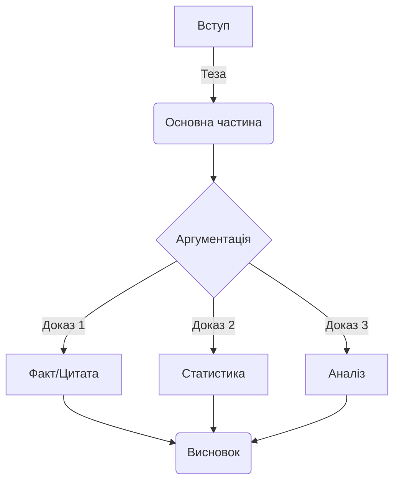

import Quiz from '@site/src/components/Quiz';
import MatchUp from '@site/src/components/MatchUp';
import FillIn from '@site/src/components/FillIn';
import TrueFalse from '@site/src/components/TrueFalse';
import Unjumble from '@site/src/components/Unjumble';
import GroupSort from '@site/src/components/GroupSort';
import Anagram from '@site/src/components/Anagram';
import ErrorCorrection, { ErrorCorrectionItem } from '@site/src/components/ErrorCorrection';
import Cloze from '@site/src/components/Cloze';
import Select from '@site/src/components/Select';
import Translate from '@site/src/components/Translate';
import DialogueReorder from '@site/src/components/DialogueReorder';
import MarkTheWords, { MarkTheWordsActivity } from '@site/src/components/MarkTheWords';
import HighlightMorphemes, { HighlightMorphemesActivity } from '@site/src/components/HighlightMorphemes';

> 🎯 **Чому це важливо?**
>
> Перехід від рівня B2 до C1 — це якісний стрибок від "розуміння мови" до "володіння мовою як інструментом". На рівні B2 ви навчилися вільно спілкуватися, але академічна та професійна сфери вимагають іншої точності, глибини та стилістичної гнучкості. Цей модуль допоможе вам систематизувати набуті знання, закріпити навички використання пасивного стану та складних синтаксичних конструкцій, а також підготує фундамент для написання наукових текстів та фахових дискусій українською мовою. Ви навчитеся не просто говорити, а формулювати думки з академічною досконалістю.

## Текст 1: Від впевненого користувача до майстра слова

**Контекст:**
Це уривок з есе профільного лінгвіста, який розглядає психологічні та мовні бар'єри, що виникають у студентів під час переходу на просунутий рівень вивчення мови. Особлива увага приділяється відмінності між розмовним та академічним стилями.

Освічені українці часто опиняються в пастці плато рівня B2 (Intermediate Plateau). Чому це відбувається? Вони вільно спілкуються, розуміють новини, але коли треба написати наукову статтю чи виступити з офіційною промовою, відчувають брак засобів. Здається, що вершину вже підкорено, але насправді це лише базовий табір перед штурмом Евересту майстерності. Чи готові ви зробити цей крок?
Проте саме тут починається найскладніший етап — шлях до мовної досконалості. Академічний рівень володіння українською мовою вимагає не лише знання слів, але й розуміння їхньої ваги, контексту та стилістичного забарвлення.

Насамперед, варто зазначити, що академічний стиль характеризується високим рівнем абстракції та об'єктивності. Якщо у розмовній мові ми кажемо "я думаю", то в науковому тексті доречніше вжити "вважається" або "можна стверджувати". Це не просто зміна слів, це зміна перспективи: від суб'єктивного до об'єктивного. Саме тут набувають ваги пасивні конструкції та безособові форми, які дозволяють зосередити увагу не на діячеві, а на дії чи явищі.

Крім того, перехід до C1 передбачає опанування складної синтаксичної архітектури. Речення стають розгалуженими, насиченими дієприкметниковими та дієприслівниковими зворотами. Це дозволяє висловити думку максимально точно, з усіма нюансами та застереженнями. Наприклад, замість того щоб сказати "Ми зробили експеримент і побачили результат", науковець напише: "Провівши серію експериментів, було виявлено закономірність, яка підтверджує попередню гіпотезу".

Така трансформація мовлення потребує систематизації знань про граматику, яку студенти часто вважають нудною. Однак без глибокого розуміння структури мови неможливо побудувати переконливу аргументацію. Консолідація навичок, отриманих на попередніх етапах, є критично важливою для подальшого поступу.

Важливим компонентом успіху на цьому етапі є читання складних текстів. Не адаптованих оповідань, а оригінальних наукових статей, монографій, філософських есе. Читаючи академічну літературу, ви "вбираєте" в себе ритм та логіку наукового мислення. Ви починаєте помічати, як автори будують аргументацію, як вони пов'язують абзаци між собою, як уникають тавтологій за допомогою багатого синонімічного ряду. Це пасивне навчання згодом переростає в активне володіння, коли ви самі сідаєте писати есе чи доповідь.

Цікаво, що багато хто плутає складність з ускладненістю. Майстерність полягає не в тому, щоб говорити заплутано, а в тому, щоб висловлювати складні ідеї прозоро та елегантно. Просунутий рівень — це вміння вибрати з тисячі слів саме те єдине, яке найточніше передає суть. Це мистецтво, яке потребує не лише практики, а й глибокого аналізу текстів, що написані визнаними майстрами слова.

Отже, міст до C1 будується на трьох китах: усвідомленні стилістичних відмінностей, вдосконаленні граматичної точності та розширенні лексичного запасу за рахунок абстрактних та фахових понять. Це виклик, але результатом стане здатність не просто спілкуватися, а творити нові смисли українською мовою.

## Текст 2: Українська мова в сучасному науковому дискурсі

**Контекст:**
Уривок з оглядової статті в науковому журналі "Мовознавство", присвяченої відродженню та розвитку української наукової термінології та стилістики в XXI столітті.

Інтеграція України у світовий науковий простір ставить нові вимоги до функціонування державної мови. Довгий час у науковому середовищі панувала думка про недостатню розробленість української термінології в певних галузях, що було наслідком імперської політики лінгвоциду та штучного витіснення української мови на маргінеси "хатнього вжитку". Сьогодні ми спостерігаємо зворотний процес: мова повертає собі статус інструменту високої науки, здатного описувати найтонші нюанси квантової фізики чи генетики.

Розвиток фахової мови нерозривно пов'язаний із процесами термінотворення. Термінологія, що здавалася штучною, сьогодні органічно вплітається в канву наукових праць. За даними Інституту української мови (2023), понад 85% нових дисертацій захищаються саме українською. Щобільше, спостерігається тенденція до очищення мови від кальок та запозичень там, де існують питомі відповідники. Скажімо, замість "співпадати" (калька з російської) науковці дедалі частіше вживають "збігатися", а замість "відміняти" — "скасовувати".
Це свідчить про поглиблення мовної свідомості науковців та прагнення до точності.

Важливу роль у цьому процесі відіграють термінологічні комісії та інститути, які працюють над укладанням нових стандартів. Вони аналізують світовий досвід та шукають відповідники, що базуються на внутрішніх ресурсах української мови. Це копітка праця, адже термін має бути не лише українським, а й точно відповідати міжнародному поняттю. Іноді це призводить до дискусій у науковій спільноті, але саме в таких дискусіях народжується істина і викристалізовується мовна норма.

Науковий стиль сучасної української мови характеризується низкою специфічних рис. По-перше, це логічність та послідовність викладу. Кожна теза має бути обґрунтована, а висновки — випливати з наведених аргументів. Для забезпечення зв'язності тексту широко використовуються вставні конструкції (отже, таким чином, по-перше, з одного боку).

По-друге, це точність слововживання. Науковий термін прагне до однозначності. Якщо в художньому стилі багатозначність є перевагою, то в науковому — недоліком. Проте, це не означає, що наукова мова суха. Навпаки, українська наукова традиція, що бере початок від праць Грушевського та Кримського, вирізняється багатством синтаксисних конструкцій та милозвучністю.

:::note[**Літературний контекст**]

Іван Франко був не лише видатним письменником, а й доктором філософії. Його наукові праці — це взірець академічного стилю кінця XIX – початку XX століття (Франко, 1898). Читаючи його статті з економіки чи літературознавства, можна помітити, як віртуозно він поєднував наукову точність із багатством народної мови. Франко довів, що українська мова здатна обслуговувати найскладніші інтелектуальні запити ще тоді, коли багато хто в цьому сумнівався.
:::

Синтез традиції та новаторства є ключовим для сучасного етапу. Ми не відкидаємо здобутки минулого, але адаптуємо їх до потреб сьогодення. Важливим аспектом є також повернення до активних дієприкметників, які раніше таврувалися як "нехарактерні", обережно повертаються в текст там, де це не порушує милозвучності. Як стверджує професор Пономарів (2011), мова — це живий організм, і навіть у суворій науці є місце для еволюції. Чи не є це свідченням зрілості нашої академічної спільноти?
Пасивні конструкції залишаються домінуючими для опису процесів, де виконавець не є важливим.

Оцінювання якості наукового тексту базується не лише на новизні дослідження, а й на культурі мовлення. Недбале ставлення до мови часто сприймається як ознака непрофесійності. Тому для молодого науковця опанування академічного стилю є не менш важливим завданням, ніж проведення власне експериментів чи аналізу джерел.

:::tip[**Лінгвістичне спостереження**]

В українській науковій термінології варто розрізняти суфікси, що позначають процес і наслідок. Іменники на **-ання/-ення** зазвичай позначають процес (_озброєння_ як дія, _дослідження_ як процес). Натомість іменники з іншими суфіксами або без них можуть позначати предмет чи наслідок (_зброя_, _дослід_). Однак у багатьох випадках слова на **-ання** (наприклад, _дослідження_, _рішення_) позначають і процес, і його результат, залежно від контексту. Точність у виборі суфікса — ознака високої мовної культури.
:::

Зверніть увагу на вживання слова **"відтак"**. У сучасній українській мові, особливо в публіцистичному та науковому стилях, його часто помилково вживають у значенні "тому", "отже" (наслідок). Насправді ж, основне значення "відтак" — це "потім", "після того" (часова послідовність). Хоча мовна норма є динамічною, в академічному письмі краще дотримуватися точних значень: для наслідку використовуйте _отже, тому, таким чином_, а для часу — _потім, згодом, відтак_.

Розширення сфер вжитку української мови сприяє її вдосконаленню. Чим більше ми пишемо та говоримо про науку українською, тим гнучкішою та багатшою вона стає. Це живий процес, до якого долучається кожен, хто обирає українську мову мовою своєї професійної діяльності.

## Порівняльний аналіз

### Стилістичні засоби та Регістр

Обидва тексти належать до сфери інтелектуального мовлення, проте мають відмінності у регістрі та тоні.

**Текст 1 (Есе лінгвіста):**

- **Регістр:** Науково-популярний, місцями публіцистичний. Автор звертається безпосередньо до читача, використовує метафори ("підкорено вершину", "на трьох китах").
- **Тон:** Заохочувальний, аналітичний, особистісний.
- **Синтаксис:** Поєднання простих речень для емоційного впливу та складних для пояснення нюансів.
- **Лексика:** Використовує слова, що описують процес навчання (_опанування, вдосконалення, майстерність_).

**Текст 2 (Стаття в журналі):**

- **Регістр:** Суто науковий (академічний). Текст більш відсторонений, об'єктивний.
- **Tон:** Формальний, стверджувальний, інформативний.
- **Синтаксис:** Переважають розгорнуті складні речення, пасивні конструкції (_було наслідком, спостерігаємо процес, характеризується_).
- **Лексика:** Насичений термінологією (_інтеграція, дискурс, лінгвоцид, термінотворення_).

:::note[**Порівняння регістрів**]

Порівняйте фразу з Тексту 1: _"Здається, що вершину вже підкорено."_ та фразу, яку міг би вжити автор Тексту 2 для вираження схожої думки: _"Створюється ілюзія завершеності процесу навчання."_
Перший варіант — образний, метафоричний, ближчий до художнього або публіцистичного стилю. Другий — абстрактний, номінативний (використовує іменники замість дієслів), що є маркером наукового стилю.
:::

### Граматичний фокус: Пасивний стан

В обох текстах використовуються пасивні конструкції, але з різною метою.
У Тексті 1: _"вершину вже підкорено"_ (безособова форма на -но/-то). Акцент на стані завершеності.
У Тексті 2: _"думка... була наслідком"_ (пасивне значення через дієслово-зв'язку). Акцент на причинно-наслідкових зв'язках.

:::caution[**Складність для іноземців**]

Українська мова, на відміну від англійської, має багатшу палітру безособових форм (зроблено, написано, вирішено). Вони дозволяють уникнути прямого називання виконавця дії, що ідеально підходить для наукового стилю, де важливий сам факт, а не особа дослідника. В англійській це часто передається через Passive Voice (_it was done_), але українська форма на -но/-то має відтінок "результативності", якого іноді бракує звичайному пасиву.
:::

### Структура академічного тексту

## Письмо: Академічне есе

**Завдання:**
Напишіть коротке есе (200-250 слів) на тему: **"Чому академічна доброчесність та точність мовлення є важливими для сучасного науковця?"**. Використайте принаймні 5 слів з нового словника (наприклад: _систематизація, аналіз, обґрунтування, плагіат, цитування_).

**Структура:**

1.  **Вступ:** Визначення проблеми та теза. (Наприклад: Точність мовлення — це ввічливість науковця).
2.  **Основна частина:** 1-2 аргументи. Використовуйте пасивні конструкції та вставні слова (_по-перше, з іншого боку_).
3.  **Висновок:** Підсумок.

**Зразок відповіді (Model Answer):**

> [!model-answer]
> **Тема: Важливість академічної доброчесності та точності**
>
> У сучасному глобалізованому світі наука розвивається надзвичайно стрімкими темпами. У цьому контексті **академічна** доброчесність та точність викладу думок набувають критичного значення. Мова йде не лише про дотримання формальних правил, а про фундамент довіри в науковій спільноті.
>
> По-перше, точність термінології забезпечує однозначність сприйняття інформації. Якщо дослідник використовує терміни некоректно, це може призвести до хибних інтерпретацій результатів його роботи. **Аналіз** наукових джерел має бути об'єктивним, а висновки — логічно обґрунтованими. Будь-яке **узагальнення** повинно спиратися на перевірені факти.
>
> По-друге, академічна доброчесність є запорукою розвитку науки. Присвоєння чужих ідей гальмує прогрес і знецінює працю колег. **Опанування** культури цитування демонструє повагу до попередників та дозволяє чітко розмежувати власні здобутки та відомі факти.
>
> Отже, прагнення до **досконалості** у мовному оформленні та етична поведінка є невід'ємними складовими професіоналізму. **Консолідація** зусиль науковців навколо цих принципів сприятиме підвищенню авторитету української науки у світі.

:::note[**Академічна перспектива**]

Українська синтаксична традиція толерує довші речення, ніж англійська. Проте в сучасному науковому письмі спостерігається тенденція до скорочення довжини речень задля кращої читабельності (вплив глобального _Plain Language movement_). Пам'ятайте: складність думки не обов'язково означає складність граматичної конструкції. Ясність — це ввічливість автора.
:::

:::note[**Культурна значущість**]

Термін "фаховий" походить від німецького _Fach_ (професія, спеціальність), що свідчить про глибокі історичні зв'язки української освіти з європейською традицією. За радянських часів це слово часто витіснялося словом "професійний", але сьогодні "фах" і "фаховий" активно повертаються в академічний обіг, підкреслюючи самобутність української термінології.
:::

## 🎯 Activities

### Знайдіть відповідність: терміни з Тексту 1

<MatchUp
  title="Знайдіть відповідність: терміни з Тексту 1"
  pairs={JSON.parse(`[{"left": "опанування", "right": "процес глибокого вивчення та засвоєння навички"}, {"left": "консолідація", "right": "зміцнення, об'єднання та систематизація знань"}, {"left": "абстракція", "right": "мислене виділення суттєвих ознак предмета"}, {"left": "об'єктивність", "right": "неупередженість, відсутність особистого ставлення"}, {"left": "аргументація", "right": "процес наведення доказів для обґрунтування тези"}, {"left": "вдосконалення", "right": "покращення, розвиток до вищого рівня якості"}, {"left": "майстерність", "right": "високий рівень професіоналізму та вправності"}, {"left": "трансформація", "right": "суттєва зміна форми, вигляду або властивостей"}, {"left": "елегантність", "right": "вишуканість, простота і ясність викладу думки"}, {"left": "нюанс", "right": "ледь помітна відмінність, тонкість у значенні"}]`)}
/>

### Розуміння Тексту 1

<Quiz
  title="Розуміння Тексту 1"
  questions={JSON.parse(`[{"question": "Чому досягнення рівня B2 може вводити в оману?", "options": [{"text": "Людина може переоцінити свої знання, вважаючи, що вже все вивчила.", "correct": true}, {"text": "Екзамени на рівень B2 занадто прості.", "correct": false}, {"text": "На цьому рівні зникає мотивація вчитися.", "correct": false}, {"text": "Рівень B2 не дає можливості читати новини.", "correct": false}]}, {"question": "У чому, на думку автора, полягає головна відмінність академічного стилю?", "options": [{"text": "У використанні складних та незрозумілих слів.", "correct": false}, {"text": "У високому рівні абстракції та об'єктивності.", "correct": true}, {"text": "У відсутності дієслів у реченнях.", "correct": false}, {"text": "У емоційності та експресивності викладу.", "correct": false}]}, {"question": "Яку роль відіграють пасивні конструкції в науковому тексті?", "options": [{"text": "Вони роблять текст нудним і довгим.", "correct": false}, {"text": "Вони дозволяють зосередити увагу на дії чи явищі, а не на виконавці.", "correct": true}, {"text": "Вони використовуються лише в застарілих текстах.", "correct": false}, {"text": "Вони показують невпевненість автора.", "correct": false}]}, {"question": "Чому синтаксис на рівні C1 стає складнішим?", "options": [{"text": "Щоб заплутати читача.", "correct": false}, {"text": "Щоб показати багатство словникового запасу.", "correct": false}, {"text": "Щоб висловити думку максимально точно, з усіма нюансами.", "correct": true}, {"text": "Тому що прості речення заборонені в науці.", "correct": false}]}, {"question": "Як автор тексту визначає справжню мовну майстерність?", "options": [{"text": "Вміння говорити швидко і без пауз.", "correct": false}, {"text": "Здатність використовувати якомога більше рідкісних слів.", "correct": false}, {"text": "Вміння висловлювати складні ідеї прозоро та елегантно.", "correct": true}, {"text": "Написання текстів без жодної граматичної помилки.", "correct": false}]}, {"question": "Що є необхідною умовою для побудови переконливої аргументації?", "options": [{"text": "Глибоке розуміння структури мови та граматики.", "correct": true}, {"text": "Гучний голос та харизма.", "correct": false}, {"text": "Використання цитат відомих людей.", "correct": false}, {"text": "Відсутність пауз у мовленні.", "correct": false}]}, {"question": "Яке порівняння використовує автор для опису переходу до академічного стилю?", "options": [{"text": "Будівництво мосту на трьох китах.", "correct": true}, {"text": "Сходження на високу гору без спорядження.", "correct": false}, {"text": "Перепливання бурхливого океану.", "correct": false}, {"text": "Політ у космос.", "correct": false}]}, {"question": "Що мається на увазі під «зміною перспективи»?", "options": [{"text": "Перехід від розгляду деталей до загальної картини.", "correct": false}, {"text": "Перехід від суб'єктивного погляду до об'єктивного опису.", "correct": true}, {"text": "Зміна теми дослідження.", "correct": false}, {"text": "Використання іншої мови.", "correct": false}]}, {"question": "Яке значення має слово «консолідація» у тексті?", "options": [{"text": "Відмова від старих звичок.", "correct": false}, {"text": "Об'єднання та закріплення отриманих навичок.", "correct": true}, {"text": "Вивчення нових правил.", "correct": false}, {"text": "Спрощення матеріалу.", "correct": false}]}, {"question": "Що, на думку автора, є результатом переходу на рівень C1?", "options": [{"text": "Здатність творити нові смисли українською мовою.", "correct": true}, {"text": "Отримання диплома про вищу освіту.", "correct": false}, {"text": "Можливість виправити помилки інших.", "correct": false}, {"text": "Забування рідної мови.", "correct": false}]}, {"question": "Яке ставлення студентів до граматики згадує автор?", "options": [{"text": "Вони її обожнюють.", "correct": false}, {"text": "Вони часто вважають її нудною.", "correct": true}, {"text": "Вони вважають її найлегшою частиною.", "correct": false}, {"text": "Вони її ігнорують.", "correct": false}]}, {"question": "Яка лексика дозволяє зосередити увагу на явищі, а не на особі?", "options": [{"text": "Емоційна лексика.", "correct": false}, {"text": "Безособові форми дієслів.", "correct": true}, {"text": "Особові займенники.", "correct": false}, {"text": "Прикметники вищого ступеня.", "correct": false}]}]`)}
/>

### Синоніми: Загальні vs Академічні

<MatchUp
  title="Синоніми: Загальні vs Академічні"
  pairs={JSON.parse(`[{"left": "однаковий", "right": "тотожний"}, {"left": "доказ", "right": "аргумент"}, {"left": "пояснення", "right": "інтерпретація"}, {"left": "перевірка", "right": "верифікація"}, {"left": "наслідок", "right": "результат"}, {"left": "покращення", "right": "оптимізація"}, {"left": "важливий", "right": "актуальний"}, {"left": "суперечка", "right": "дискусія"}, {"left": "думка", "right": "гіпотеза"}, {"left": "об'єднання", "right": "інтеграція"}, {"left": "скасовувати", "right": "анулювати"}, {"left": "збігатися", "right": "корелювати"}]`)}
/>

### Розуміння Тексту 2

<Quiz
  title="Розуміння Тексту 2"
  questions={JSON.parse(`[{"question": "Що було причиною думки про недостатню розробленість української термінології?", "options": [{"text": "Природна бідність мови.", "correct": false}, {"text": "Імперська політика лінгвоциду та штучне витіснення мови.", "correct": true}, {"text": "Відсутність науковців в Україні.", "correct": false}, {"text": "Складність української граматики.", "correct": false}]}, {"question": "Який процес спостерігається сьогодні в українській науковій мові?", "options": [{"text": "Повернення статусу інструменту високої науки.", "correct": true}, {"text": "Спрощення до рівня побутового спілкування.", "correct": false}, {"text": "Масове запозичення англійських термінів.", "correct": false}, {"text": "Відмова від створення нових слів.", "correct": false}]}, {"question": "Яка тенденція спостерігається у термінотворенні?", "options": [{"text": "Очищення від кальок та використання питомих відповідників.", "correct": true}, {"text": "Використання виключно латинських термінів.", "correct": false}, {"text": "Збереження радянської термінології.", "correct": false}, {"text": "Створення максимально довгих слів.", "correct": false}]}, {"question": "Що є запорукою зв'язності наукового тексту?", "options": [{"text": "Використання окличних речень.", "correct": false}, {"text": "Використання вставних конструкцій (отже, по-перше).", "correct": true}, {"text": "Розбиття тексту на дуже короткі абзаци.", "correct": false}, {"text": "Багаторазове повторення однієї думки.", "correct": false}]}, {"question": "Чим науковий термін відрізняється від художнього слова?", "options": [{"text": "Він має багато значень.", "correct": false}, {"text": "Він прагне до однозначності.", "correct": true}, {"text": "Він завжди коротший.", "correct": false}, {"text": "Він звучить мелодійніше.", "correct": false}]}, {"question": "Чи є українська наукова мова сухою?", "options": [{"text": "Так, це її основна характеристика.", "correct": false}, {"text": "Ні, вона вирізняється багатством синтаксису та милозвучністю.", "correct": true}, {"text": "Вона суха лише в точних науках.", "correct": false}, {"text": "Вона намагається бути схожою на англійську.", "correct": false}]}, {"question": "Яка роль активних дієприкметників у сучасному науковому стилі?", "options": [{"text": "Вони повністю заборонені.", "correct": false}, {"text": "Вони повертаються там, де це не порушує норм.", "correct": true}, {"text": "Вони замінили всі пасивні конструкції.", "correct": false}, {"text": "Вони використовуються тільки в поезії.", "correct": false}]}, {"question": "На чому базується оцінювання якості наукового тексту?", "options": [{"text": "Тільки на новизні ідей.", "correct": false}, {"text": "На новизні дослідження та культурі мовлення.", "correct": true}, {"text": "На кількості сторінок.", "correct": false}, {"text": "На кількості використаних джерел.", "correct": false}]}, {"question": "Як розширення сфер вжитку впливає на мову?", "options": [{"text": "Вона псується.", "correct": false}, {"text": "Вона стає гнучкішою та багатшою.", "correct": true}, {"text": "Вона стає складнішою для вивчення.", "correct": false}, {"text": "Ніяк не впливає.", "correct": false}]}, {"question": "Що є живим процесом згідно з текстом?", "options": [{"text": "Написання дисертації.", "correct": false}, {"text": "Вдосконалення мови через професійну діяльність.", "correct": true}, {"text": "Викладання в університеті.", "correct": false}, {"text": "Видання журналів.", "correct": false}]}, {"question": "Кого згадує автор як засновників традиції української наукової мови?", "options": [{"text": "Шевченка та Франка.", "correct": false}, {"text": "Грушевського та Кримського.", "correct": true}, {"text": "Коцюбинського та Лесю Українку.", "correct": false}, {"text": "Сковороду та Котляревського.", "correct": false}]}, {"question": "Яке слово автор наводить як приклад кальки з російської?", "options": [{"text": "Співпадати.", "correct": true}, {"text": "Збігатися.", "correct": false}, {"text": "Скасовувати.", "correct": false}, {"text": "Відмінювати.", "correct": false}]}]`)}
/>

### Розподіліть фрази за стилем

<GroupSort
  title="Розподіліть фрази за стилем"
  groups={JSON.parse(`{"Академічний/Науковий": ["Встановлено кореляцію між показниками.", "Метою дослідження є аналіз проблематики.", "Слід зазначити, що гіпотеза підтвердилася.", "Результати експерименту вимагають подальшої верифікації.", "Актуальність теми зумовлена низкою факторів.", "Термінологія потребує уніфікації.", "Аналіз джерел показав наявність протиріч."], "Публіцистичний/Есеїстичний": ["Мова — це живий організм, що постійно росте.", "Ми стоїмо на порозі великих змін.", "Варто замислитися над майбутнім нашої науки.", "Ця проблема хвилює кожного свідомого громадянина.", "Ми не можемо стояти осторонь прогресу.", "Час вимагає від нас рішучих дій."], "Розмовний": ["Я думаю, що це круто.", "Треба просто взяти і зробити.", "Ну, типу, це не зовсім так.", "Давай швиденько розберемося з цим.", "Мені здається, він правий.", "Це взагалі ні в які ворота не лізе."]}`)}
/>

### Академічні звороти

<FillIn
  title="Академічні звороти"
  items={JSON.parse(`[{"sentence": "___, що результати дослідження є попередніми.", "answer": "Варто зазначити", "options": ["Варто зазначити", "Я хочу сказати", "Слухай", "Мабуть"]}, {"sentence": "Ця теорія ___ на працях відомих вітчизняних учених.", "answer": "ґрунтується", "options": ["ґрунтується", "стоїть", "лежить", "тримається"]}, {"sentence": "Нам вдалося ___ закономірність розподілу даних.", "answer": "виявити", "options": ["виявити", "побачити", "знайти", "намацати"]}, {"sentence": "У статті ___ питання екологічної безпеки.", "answer": "розглядаються", "options": ["розглядаються", "говоряться", "пишуться", "розказуються"]}, {"sentence": "Автор ___ переконливі аргументи на користь своєї гіпотези.", "answer": "наводить", "options": ["наводить", "дає", "каже", "ставить"]}, {"sentence": "Цей метод ___ високою ефективністю.", "answer": "характеризується", "options": ["характеризується", "має", "володіє", "відзначається"]}, {"sentence": "Ми дійшли ___ про необхідність зміни підходу.", "answer": "висновку", "options": ["висновку", "кінця", "рішення", "думки"]}, {"sentence": "Експеримент було ___ у лабораторних умовах.", "answer": "проведено", "options": ["проведено", "зроблено", "виконано", "пророблено"]}, {"sentence": "Отримані дані ___ з результатами попередніх тестів.", "answer": "збігаються", "options": ["збігаються", "співпадають", "однакові", "сходяться"]}, {"sentence": "___ уваги заслуговує той факт, що...", "answer": "Особливої", "options": ["Особливої", "Великої", "Окремої", "Спеціальної"]}, {"sentence": "___ аналізу джерел, ми виокремили три етапи.", "answer": "На підставі", "options": ["На підставі", "Через", "Завдяки", "Із-за"]}, {"sentence": "Ця проблема потребує ___ вивчення.", "answer": "детального", "options": ["детального", "сильного", "великого", "глибокого"]}]`)}
/>

### Виправте стилістичні помилки

<ErrorCorrection title="Виправте стилістичні помилки">
  <ErrorCorrectionItem
    sentence={`У цій роботі ми подивилися на проблеми освіти.`}
    errorWord={`подивилися на`}
    correctForm={`проаналізували`}
    options={[`проаналізували`, `розглянули`, `побачили`, `глянули`]}
    explanation={`В академічному стилі замість «подивитися» краще вживати «проаналізувати» або «розглянути».`}
  />
  <ErrorCorrectionItem
    sentence={`Вчені зробили багато дослідів.`}
    errorWord={`зробили`}
    correctForm={`провели`}
    options={[`провели`, `виконали`, `створили`, `вчинили`]}
    explanation={`Досліди «проводять», а не «роблять».`}
  />
  <ErrorCorrectionItem
    sentence={`Ця тема дуже класна і цікава.`}
    errorWord={`класна`}
    correctForm={`актуальна`}
    options={[`актуальна`, `важлива`, `перспективна`, `значуща`]}
    explanation={`Слово «класна» є оцінним і розмовним. В науці використовують «актуальна».`}
  />
  <ErrorCorrectionItem
    sentence={`Автор каже про важливість мови.`}
    errorWord={`каже`}
    correctForm={`зазначає`}
    options={[`зазначає`, `стверджує`, `наголошує`, `пише`]}
    explanation={`Замість нейтрального «каже» краще вжити «зазначає», «наголошує».`}
  />
  <ErrorCorrectionItem
    sentence={`Результати співпадають з очікуваннями.`}
    errorWord={`співпадають`}
    correctForm={`збігаються`}
    options={[`збігаються`, `корелюють`, `відповідають`, `ідентичні`]}
    explanation={`«Співпадати» — калька. Нормативне слово — «збігатися».`}
  />
  <ErrorCorrectionItem
    sentence={`Ми рішили проблему забруднення.`}
    errorWord={`рішили`}
    correctForm={`вирішили`}
    options={[`вирішили`, `розв'язали`, `врегулювали`, `усунули`]}
    explanation={`Завдання або проблему «вирішують» або «розв'язують».`}
  />
  <ErrorCorrectionItem
    sentence={`Треба прийняти міри.`}
    errorWord={`прийняти міри`}
    correctForm={`вжити заходів`}
    options={[`вжити заходів`, `зробити дії`, `прийняти дії`, `зробити кроки`]}
    explanation={`«Прийняти міри» — калька. Українською: «вжити заходів».`}
  />
  <ErrorCorrectionItem
    sentence={`Дані вірні.`}
    errorWord={`вірні`}
    correctForm={`правильні`}
    options={[`правильні`, `коректні`, `точні`, `достовірні`]}
    explanation={`Дані можуть бути правильними або достовірними. «Вірний» — це про відданість (вірний друг).`}
  />
  <ErrorCorrectionItem
    sentence={`Мова йдеться про економіку.`}
    errorWord={`Мова йдеться`}
    correctForm={`Йдеться`}
    options={[`Йдеться`, `Мова йде`, `Говориться`, `Сказано`]}
    explanation={`Правильна конструкція: «Йдеться про...» або «Мова про...». «Мова йдеться» — помилка.`}
  />
  <ErrorCorrectionItem
    sentence={`У кінці кінців ми отримали результат.`}
    errorWord={`У кінці кінців`}
    correctForm={`Зрештою`}
    options={[`Зрештою`, `Врешті-решт`, `Насамкінець`, `У підсумку`]}
    explanation={`«В конце концов» перекладається як «зрештою» або «врешті-решт».`}
  />
</ErrorCorrection>

### Академічна доброчесність

<Cloze
  title="Академічна доброчесність"
  passage={`Академічна доброчесність — це сукупність етичних [___:1], якими мають керуватися учасники освітнього процесу. До них належать [___:2], довіра, справедливість, повага та відповідальність. Порушенням доброчесності вважається [___:3] — привласнення чужих ідей без посилання на [___:4]. Кожен науковець зобов'язаний дотримуватися правил [___:5] та оформлення списку використаної [___:6]. Це не лише вимога [___:7], а й ознака поваги до інтелектуальної [___:8] колег. Дотримання цих норм сприяє підвищенню [___:9] освіти та науки в цілому. Важливим елементом є також об'єктивне [___:10] результатів досліджень. Фальсифікація даних є [___:11] у науці, оскільки вона викривляє [___:12]. Науковець має бути готовим до критичного [___:13] своїх робіт колегами. Відкрита наукова [___:14] допомагає виявити помилки та знайти правильний [___:15]. Таким чином, доброчесність є фундаментом [___:16] у науковому світі. Без неї неможливий справжній [___:17] наукових [___:18].`}
  blanks={JSON.parse(`[{"index": 0, "answer": "принципів", "options": ["принципів", "правил", "законів"]}, {"index": 1, "answer": "чесність", "options": ["чесність", "доброта", "сила"]}, {"index": 2, "answer": "плагіат", "options": ["плагіат", "цитування", "навчання"]}, {"index": 3, "answer": "джерело", "options": ["джерело", "автора", "книгу"]}, {"index": 4, "answer": "цитування", "options": ["цитування", "письма", "читання"]}, {"index": 5, "answer": "літератури", "options": ["літератури", "документації", "інформації"]}, {"index": 6, "answer": "закону", "options": ["закону", "університету", "викладача"]}, {"index": 7, "answer": "власності", "options": ["власності", "праці", "сфери"]}, {"index": 8, "answer": "якості", "options": ["якості", "швидкості", "вартості"]}, {"index": 9, "answer": "оцінювання", "options": ["оцінювання", "вимірювання", "рахування"]}, {"index": 10, "answer": "неприпустимою", "options": ["неприпустимою", "дозволеною", "можливою"]}, {"index": 11, "answer": "істину", "options": ["істину", "думку", "теорію"]}, {"index": 12, "answer": "аналізу", "options": ["аналізу", "погляду", "слова"]}, {"index": 13, "answer": "дискусія", "options": ["дискусія", "сварка", "розмова"]}, {"index": 14, "answer": "шлях", "options": ["шлях", "вихід", "метод"]}, {"index": 15, "answer": "довіри", "options": ["довіри", "успіху", "карьєри"]}, {"index": 16, "answer": "прогрес", "options": ["прогрес", "рух", "розвиток"]}, {"index": 17, "answer": "знань", "options": ["знань", "теорій", "думок"]}]`)}
/>

### Побудова складних речень

<Unjumble
  title="Побудова складних речень"
  items={JSON.parse(`[{"jumbled": "дослідження / метою / аналіз / є / змін / кліматичних", "answer": "Метою дослідження є аналіз кліматичних змін."}, {"jumbled": "що / варто / результати / зазначити / є / попередніми", "answer": "Варто зазначити, що результати є попередніми."}, {"jumbled": "на / ґрунтується / фактів / висновок / аналізі", "answer": "Висновок ґрунтується на аналізі фактів."}, {"jumbled": "проблеми / потребує / вирішення / підходу / комплексного", "answer": "Вирішення проблеми потребує комплексного підходу."}, {"jumbled": "автор / увагу / на / акцентує / важливості / питання", "answer": "Автор акцентує увагу на важливості питання."}, {"jumbled": "нами / було / під / експеримент / час / проведено / дослідження", "answer": "Під час дослідження нами було проведено експеримент."}, {"jumbled": "впливає / фактор / на / суттєво / цей / показники", "answer": "Цей фактор суттєво впливає на показники."}, {"jumbled": "необхідно / увагу / звернути / на / тенденції / такі", "answer": "Необхідно звернути увагу на такі тенденції."}, {"jumbled": "даних / обробка / статистична / гіпотезу / підтвердила", "answer": "Статистична обробка даних підтвердила гіпотезу."}, {"jumbled": "викладу / характеризується / логічністю / стиль / науковий", "answer": "Науковий стиль характеризується логічністю викладу."}]`)}
/>

### Знайдіть пасивні конструкції

<MarkTheWords>
  <MarkTheWordsActivity
    instruction={`Позначте дієслівні форми пасивного стану (закінчуються на -но, -то) або конструкції з «було/буде» + дієприкметник.`}
    text={`У статті розглянуто актуальні проблеми екології. Було проведено моніторинг якості повітря у трьох регіонах. Дані зібрано за допомогою сучасних датчиків. Результати оброблено статистичними методами. Встановлено, що рівень забруднення перевищує норму. Запропоновано нові методи очищення викидів. Рішення було ухвалено одноголосно. Усі рекомендації взято до уваги. Проєкт затверджено міністерством. Фінансування виділено з державного бюджету.`}
    correctWords={JSON.parse(`["розглянуто", "Було проведено", "зібрано", "оброблено", "Встановлено", "Запропоновано", "було ухвалено", "взято", "затверджено", "виділено"]`)}
  />
</MarkTheWords>

### Логічні конектори

<FillIn
  title="Логічні конектори"
  items={JSON.parse(`[{"sentence": "Експеримент пройшов успішно, ___ результати потребують перевірки.", "answer": "однак", "options": ["однак", "тому", "отже", "бо"]}, {"sentence": "Ми використали новий метод, ___ вдалося знизити похибку.", "answer": "завдяки чому", "options": ["завдяки чому", "оскільки", "хоча", "натомість"]}, {"sentence": "___ складні умови, команда завершила проєкт вчасно.", "answer": "Незважаючи на", "options": ["Незважаючи на", "Внаслідок", "Тому що", "Через"]}, {"sentence": "Ця тема є малодослідженою, ___ вона викликає значний інтерес.", "answer": "проте", "options": ["проте", "тому", "внаслідок", "адже"]}, {"sentence": "Зростання цін вплинуло на попит, ___ продажі впали.", "answer": "унаслідок чого", "options": ["унаслідок чого", "хоча", "але", "оскільки"]}, {"sentence": "Дані не є повними, ___ ми не можемо зробити остаточний висновок.", "answer": "тому", "options": ["тому", "проте", "однак", "бо"]}, {"sentence": "___, слід підкреслити важливість подальших досліджень.", "answer": "Насамкінець", "options": ["Насамкінець", "По-перше", "Наприклад", "Зокрема"]}, {"sentence": "___ теорії, практика показує інші результати.", "answer": "На противагу", "options": ["На противагу", "Відповідно до", "Згідно з", "На основі"]}, {"sentence": "Це явище є типовим, ___ воно трапляється рідко.", "answer": "хоча", "options": ["хоча", "тому", "отже", "внаслідок"]}, {"sentence": "___, перейдемо до аналізу наступного питання.", "answer": "Отже", "options": ["Отже", "Оскільки", "Бо", "Адже"]}]`)}
/>

### Дієслова для тези

<Select
  title="Дієслова для тези"
  questions={JSON.parse(`[{"question": "", "options": []}, {"question": "", "options": []}, {"question": "", "options": []}, {"question": "", "options": []}, {"question": "", "options": []}, {"question": "", "options": []}, {"question": "", "options": []}, {"question": "", "options": []}, {"question": "", "options": []}, {"question": "", "options": []}, {"question": "", "options": []}, {"question": "", "options": []}, {"question": "", "options": []}, {"question": "", "options": []}]`)}
/>

### Деталі порівняльного аналізу

<Quiz
  title="Деталі порівняльного аналізу"
  questions={JSON.parse(`[{"question": "У якому тексті автор використовує особистий досвід та звертання до читача?", "options": [{"text": "У Тексті 1", "correct": true}, {"text": "У Тексті 2", "correct": false}, {"text": "В обох текстах", "correct": false}, {"text": "У жодному з текстів", "correct": false}]}, {"question": "Який текст містить більше специфічної лінгвістичної термінології?", "options": [{"text": "Текст 2", "correct": true}, {"text": "Текст 1", "correct": false}, {"text": "Однаково", "correct": false}]}, {"question": "Яка основна мета Тексту 1?", "options": [{"text": "Критикувати студентів за помилки.", "correct": false}, {"text": "Пояснити психологічні та мовні аспекти переходу на рівень C1.", "correct": true}, {"text": "Розповісти історію української мови.", "correct": false}]}, {"question": "Яка основна ідея Тексту 2?", "options": [{"text": "Українська мова відновлює свій статус повноцінної мови науки.", "correct": true}, {"text": "Наукова мова повинна бути простою.", "correct": false}, {"text": "Треба використовувати більше англіцизмів.", "correct": false}]}, {"question": "Як обидва автори ставляться до мовної норми?", "options": [{"text": "Вони вважають її неважливою.", "correct": false}, {"text": "Вони наголошують на важливості точності та культури мовлення.", "correct": true}, {"text": "Вони мають протилежні погляди.", "correct": false}]}, {"question": "У якому тексті згадуються імена видатних українських науковців (Грушевського, Кримського)?", "options": [{"text": "У Тексті 2", "correct": true}, {"text": "У Тексті 1", "correct": false}, {"text": "В обох текстах", "correct": false}, {"text": "У жодному з текстів", "correct": false}]}, {"question": "Яка стилістична риса є спільною для обох текстів?", "options": [{"text": "Використання жаргону.", "correct": false}, {"text": "Використання пасивних конструкцій.", "correct": true}, {"text": "Велика кількість діалогів.", "correct": false}, {"text": "Відсутність складних речень.", "correct": false}]}, {"question": "Який текст більше фокусується на майбутньому української мови?", "options": [{"text": "Текст 2", "correct": true}, {"text": "Текст 1", "correct": false}, {"text": "Текст про погоду", "correct": false}]}]`)}
/>

### Аналіз тверджень

<TrueFalse
  title="Аналіз тверджень"
  items={JSON.parse(`[{"statement": "На науковий стиль сучасної української мови впливає глобальна тенденція до спрощення (*Plain Language*).", "isTrue": true, "explanation": "Так, про це згадується в рубриці «Академічна перспектива»."}, {"statement": "Слово «фаховий» є новим запозиченням з англійської мови.", "isTrue": false, "explanation": "Ні, воно має давнє німецьке коріння і традицію вжитку в українській мові."}, {"statement": "Використання пасивних конструкцій в українській науковій мові є помилкою.", "isTrue": false, "explanation": "Ні, вони є нормою для забезпечення об'єктивності, хоча активні дедалі частіше повертаються."}, {"statement": "Слово «відтак» можна вільно використовувати у значенні «отож».", "isTrue": false, "explanation": "У строгому академічному стилі «відтак» означає часову послідовність (потім)."}, {"statement": "Академічна доброчесність стосується лише студентів, а не професорів.", "isTrue": false, "explanation": "Вона є фундаментом довіри для всієї наукової спільноти."}, {"statement": "Українська наукова традиція повністю відкидає емоційність.", "isTrue": false, "explanation": "Вона прагне до об'єктивності, але традиційно зберігає милозвучність та багатство синтаксису."}, {"statement": "Іван Франко писав наукові праці з економіки та літературознавства.", "isTrue": true, "explanation": "Так, він був доктором філософії і писав академічні тексти."}, {"statement": "Слова з суфіксом «-ання» не можуть позначати результат дії.", "isTrue": false, "explanation": "Можуть, залежно від контексту (наприклад, «рішення», «дослідження»)."}]`)}
/>

### Ідентифікація регістру

<MatchUp
  title="Ідентифікація регістру"
  pairs={JSON.parse(`[{"left": "Ну, коротше кажучи...", "right": "Розмовний"}, {"left": "Вищезазначені факти свідчать про...", "right": "Науковий"}, {"left": "Шановний пане Директоре!", "right": "Офіційно-діловий"}, {"left": "Сонце сміялося до нас з неба.", "right": "Художній"}, {"left": "Це просто жах, що коїться!", "right": "Публіцистичний (емоційний)"}, {"left": "Відповідно до наказу №5...", "right": "Офіційно-діловий"}, {"left": "Методологія дослідження базується на...", "right": "Науковий"}, {"left": "Привіт, як справи?", "right": "Розмовний"}]`)}
/>

### Трансформація у пасивний стан

<FillIn
  title="Трансформація у пасивний стан"
  items={JSON.parse(`[{"sentence": "Ми завершили проєкт. -> Проєкт ___.", "answer": "завершено", "options": ["завершено", "завершили", "був завершений", "завершується"]}, {"sentence": "Автор написав книгу. -> Книгу ___.", "answer": "написано", "options": ["написано", "написали", "пишеться", "була написана"]}, {"sentence": "Комісія ухвалила рішення. -> Рішення ___.", "answer": "ухвалено", "options": ["ухвалено", "ухвалили", "прийнято", "було прийняте"]}, {"sentence": "Вчені відкрили новий елемент. -> Новий елемент ___.", "answer": "відкрито", "options": ["відкрито", "відкрили", "відкрився", "був відкритий"]}, {"sentence": "Ми досягли мети. -> Мети ___.", "answer": "досягнуто", "options": ["досягнуто", "досягли", "було досягнуто", "досягається"]}, {"sentence": "Студенти виконали завдання. -> Завдання ___.", "answer": "виконано", "options": ["виконано", "виконали", "виконується", "було виконане"]}, {"sentence": "Людство підкорило космос. -> Космос ___.", "answer": "підкорено", "options": ["підкорено", "підкорили", "підкорився", "був підкорений"]}, {"sentence": "Міністр підписав наказ. -> Наказ ___.", "answer": "підписано", "options": ["підписано", "підписали", "підписується", "був підписаний"]}]`)}
/>

## 📚 Vocabulary

| Word | IPA | English | POS | Gender | Note |
| --- | --- | --- | --- | --- | --- |
| повторення | /pɔu̯ˈtɔrenʲːɐ/ | repetition; review | noun | с |  |
| узагальнення | /ʊzɐˈɦɑlʲnenʲːɐ/ | generalization; summary | noun | с |  |
| систематизація | /sɪstemɐtɪˈzɑt͡sʲijɐ/ | systematization | noun | ж |  |
| консолідація | /kɔnsɔlʲiˈdɑt͡sʲijɐ/ | consolidation | noun | ж |  |
| перехід | /pereˈxid/ | transition | noun | ч |  |
| просунутий | /prɔˈsunʊtɪj/ | advanced | adj |  |  |
| академічний | /ɐkɐdeˈmʲit͡ʃnɪj/ | academic | adj |  |  |
| фаховий | /fɐxoˈʋɪj/ | professional; specialist | adj |  |  |
| досконалість | /dɔskɔˈnɑlʲisʲtʲ/ | perfection; excellence | noun | ж |  |
| майстерність | /mɐi̯ˈstɛrnʲisʲtʲ/ | mastery | noun | ж |  |
| опанування | /ɔpɐˈnuʋɐnʲːɐ/ | mastering | noun | с |  |
| вдосконалення | /wdɔskɔˈnɑlenʲːɐ/ | improvement | noun | с |  |
| поглиблення | /pɔˈɦlɪblenʲːɐ/ | deepening | noun | с |  |
| розширення | /rɔzˈʃɪrenʲːɐ/ | expansion | noun | с |  |
| закріплення | /zɐˈkripɫenʲːɐ/ | consolidation; fixing | noun | с |  |
| застосування | /zɐstɔsuˈʋɑnʲːɐ/ | application | noun | с |  |
| інтеграція | /inteˈɦrɑt͡sʲijɐ/ | integration | noun | ж |  |
| синтез | /sɪnˈtɛz/ | synthesis | noun | ч |  |
| аналіз | /ɐˈnɑlʲiz/ | analysis | noun | ч |  |
| оцінювання | /ɔˈt͡sʲinʲuʋɐnʲːɐ/ | assessment; evaluation | noun | с |  |

## 📋 Підсумок

У цьому модулі ми розглянули ключові відмінності між рівнем B2 та C1, зосередившись на академічній точності, об'єктивності та стилістичній гнучкості. Ви проаналізували два тексти, порівняли їхні регістри та потренувалися у використанні пасивних конструкцій. Тепер ви готові до глибшого занурення у світ української академічної мови.

:::info[🎧 External Resources]

- [Академічне письмо: як писати наукові тексти українською](https://example.com/academic-writing)
- [Словник наукової термінології НАН України](https://lcorp.ulif.org.ua/dictua/)
- [Лекція про культуру наукової мови](https://youtube.com/watch?v=example)
:::

