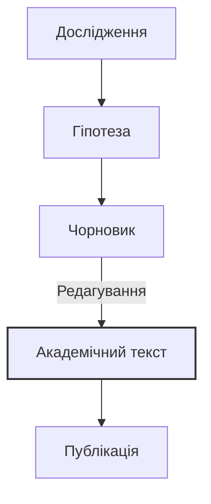

import Quiz from '@site/src/components/Quiz';
import MatchUp from '@site/src/components/MatchUp';
import FillIn from '@site/src/components/FillIn';
import TrueFalse from '@site/src/components/TrueFalse';
import Unjumble from '@site/src/components/Unjumble';
import GroupSort from '@site/src/components/GroupSort';
import Anagram from '@site/src/components/Anagram';
import ErrorCorrection, { ErrorCorrectionItem } from '@site/src/components/ErrorCorrection';
import Cloze from '@site/src/components/Cloze';
import Select from '@site/src/components/Select';
import Translate from '@site/src/components/Translate';
import DialogueReorder from '@site/src/components/DialogueReorder';
import MarkTheWords, { MarkTheWordsActivity } from '@site/src/components/MarkTheWords';
import HighlightMorphemes, { HighlightMorphemesActivity } from '@site/src/components/HighlightMorphemes';
import EssayResponse from '@site/src/components/EssayResponse';
import ComparativeStudy from '@site/src/components/ComparativeStudy';


> 🎯 **Чому це важливо?**
>
> Академічний стиль — це мова науки та офіційної комунікації. Він вимагає від автора не лише знання термінології, а й володіння специфічними граматичними конструкціями, що забезпечують об'єктивність, точність та логічну послідовності викладу. Як кажуть, стиль — це людина, але науковий стиль — це дисципліна мислення. У цьому модулі ми розберемо основні маркери наукового стилю: безособові конструкції, номіналізацію, пасивний стан та засоби пом'якшення тверджень (хеджинг). Ви навчитеся перетворювати прості думки на вагомі наукові тези, що відповідають високим стандартам українського академічного письма.

## Текст 1: Науковий дискурс

**Джерело:** Адаптовано з: Коваль А. П. "Науковий стиль сучасної української літературної мови" (2020); Селіванова О. О. "Сучасна лінгвістика: напрями та проблеми" (2008).

> **Стилістичні особливості українського наукового дискурсу початку XXI століття: Динаміка та Стандартизація**
>
> У сучасній вітчизняній лінгвістиці **загальновизнано**, що науковий стиль є одним із найбільш динамічних та водночас регламентованих функціональних різновидів української літературної мови. В умовах інтеграції української науки у світовий простір **досліджується** вплив процесів глобалізації на термінологічні системи, зокрема в пріоритетних галузях, таких як інформаційні технології, біотехнології та економіка. **Зазначається**, що для сучасного українського наукового тексту характерна виразна тенденція до інтелектуалізації мовлення, яка виявляється у широкому використанні абстрактної лексики, ускладненої синтаксичної організації та прагненні до максимальної інформативної ємності.
>
> **Мета цієї статті полягає в тому, щоб** проаналізувати ключові лінгвістичні маркери академічності та особливості їх функціонування в текстах гуманітарного циклу, а також окреслити перспективи розвитку наукового стилю.
>
> **Насамперед варто підкреслити**, що домінуючою рисою наукового викладу є прагнення до об'єктивності та деперсоналізації. Суб'єктивне "я" автора в українській науковій традиції часто **нівелюється** або замінюється на узагальнене "ми" (так зване "авторське ми") чи безособові форми. Наприклад, замість суб'єктивної фрази "Я провів експеримент і побачив..." у науковому звіті **вживається** пасивна або безособова конструкція: "У ході експерименту було виявлено..." або "Результати дослідження засвідчують...". Така стратегія деперсоналізації дозволяє зосередити увагу читача на самому факті, явищі чи процесі, а не на особі дослідника, що надає висновкам ваги універсальності.
>
> **Крім того**, важливу системотворчу роль відіграє номіналізація — процес трансформації дієслівних конструкцій у іменникові групи (Коваль, 2020). Так, динамічне речення "досліджувати мову в її розвитку" трансформується у стативну фразу "дослідження мовного розвитку", що надає тексту більшої стабільності, дозволяє оперувати поняттями як об'єктами та значно ущільнює інформацію. **Аргументується** думка, що іменниковий характер наукового стилю (субстантивність) сприяє створенню термінологічної точності та уникненню двозначності (Селіванова, 2008).

:::note[Culture]
**Золота доба української термінології**
У 1920-х роках, в період "Розстріляного відродження", Інститут української наукової мови (Київ) здійснив титанічну працю, видавши десятки словників. Активну участь у цьому процесі брав Михайло Грушевський, який підкреслював важливість національної науки. Українські науковці прагнули створити самобутню термінологію, базовану на народній мові. На жаль, у 1930-х роках цей процес було зупинено радянськими репресіями.
:::


> **Слід зазначити**, що категоричність суджень у сучасній науці не завжди вітається, оскільки абсолютна істина є недосяжним ідеалом. Тому автори часто вдаються до засобів пом'якшення або "хеджингу" (термін походить від англ. "огорожа"): _ймовірно, можна припустити, певною мірою, за даними окремих досліджень, як видається_.

:::note[📜 Quote]
"Науковий стиль — це не сухість викладу, а точність думки." — академік Л. А. Булаховський.
:::


:::note[Question]
Як ви вважаєте, чи завжди "хеджинг" є ознакою наукової скромності, чи іноді це може бути способом уникнути відповідальності за твердження?
:::


:::info[📝 Example]
**Приклад хеджингу в дії:**
Замість: "Дослідження доводить, що X викликає Y."
Спробуйте: "Результати дослідження _можуть свідчити_ про _можливий_ зв'язок між X та Y, _хоча для остаточних висновків необхідні подальші дослідження_."
:::


Це дозволяє вченому уникнути догматизму, продемонструвати наукову скромність і залишити простір для подальшої наукової дискусії. **Передбачається**, що подальший розвиток українського наукового стилю відбуватиметься в напрямку гармонізації міжнародних стандартів (зокрема, чіткості та структурованості) із національною мовною традицією, яка тяжіє до багатства синтаксичних засобів.

### Аналіз тексту: Деконструкція Академічності

**Регістрові маркери:**

- **Безособові конструкції:** _загальновизнано, досліджується, зазначається, вживається, аргументується_. Вони створюють ефект відстороненості від суб'єкта, підкреслюючи об'єктивність знання.
- **Номіналізація:** _інтелектуалізація, глобалізація, функціонування, нівелювання, стандартизація, трансформація_. Велика кількість віддієслівних іменників на -ння/-ція є ознакою високого регістру.
- **Пасивні конструкції:** _було виявлено, досліджується вплив_. Акцент зміщено з діяча на об'єкт дії.
- **Формальні конектори:** _насамперед, крім того, слід зазначити, зокрема, водночас_. Вони забезпечують логічну зв'язність тексту (когезію).

**Структурні елементи:**

- **Вступ:** Окреслення загального контексту (динамічність наукового стилю в умовах глобалізації).
- **Мета:** Чітке, формульне визначення задачі (_Мета цієї статті полягає в тому, щоб..._).
- **Аргументація:** Послідовний виклад особливостей (об'єктивність, номіналізація, хеджинг) із поясненням їхньої функції.
- **Висновок:** Прогноз щодо майбутнього розвитку (_Передбачається, що..._).

> 🎓 **Академічна традиція: "Ми" vs "Я"**
>
> В українській науковій мові, на відміну від сучасної англо-американської традиції, використання особового займенника "я" вважається нескромним і стилістично маркованим. Хоча в західній науці фрази типу "I argue that..." стають нормою, український науковець традиційно скаже:
>
> - **"Ми" скромності:** "У нашій статті ми розглядаємо..." (навіть якщо автор один).
> - **Безособово:** "У статті розглядається..."
> - **Від третьої особи:** "Автор доходить висновку..."
>
> Ця традиція сягає корінням у радянську та німецьку наукові школи, де колективне знання ставилося вище за індивідуальне. Проте сьогодні, під впливом англійської мови, "я" поступово починає з'являтися в роботах молодих українських вчених, хоча консервативні редактори все ще можуть це виправляти.

## Академічне письмо: Теорія та Практика

### Засоби вираження об'єктивності

Науковий текст має звучати неупереджено, як "голос істини", а не як приватна думка. Для досягнення цього ефекту в українській мові існує потужний арсенал граматичних інструментів.

**1. Безособові форми на -но/-то:**
Це унікальна риса української мови, яка дозволяє констатувати факт виконання дії без вказівки на діяча. Вони звучать більш категорично та офіційно, ніж звичайний пасив.

- _Зроблено висновок._ (Факт, результат) vs _Ми зробили висновок._ (Процес)
- _Доведено теорему._ (Теорема є доведеною)
- _Розроблено методику._
- _Встановлено, що..._

**2. Зворотні дієслова з пасивним значенням (-ся):**
Використовуються для опису процесів, що відбуваються "самі собою", або коли дію виконує невизначене коло осіб.

- _Розглядається проблема..._ (Ким? Наукою в цілому).
- _Спостерігається тенденція..._
- _Визначається поняття..._
- _Обговорюється питання..._

> ⚠️ **Типова помилка**
>
> Не плутайте пасивний стан (-ся) з активним.
> 🔴 _Неправильно:_ Ця проблема хвилюється багатьох вчених. (Хвилюватися — це емоційний стан).
> 🟢 _Правильно:_ Ця проблема хвилює багатьох вчених. (Активний стан).
> 🟢 _Правильно:_ Ця проблема обговорюється багатьма вченими. (Пасивний стан).

**3. Номіналізація (Субстантивація):**
Перетворення речення на іменникову групу дозволяє "згорнути" інформацію і зробити її темою наступного речення.

- _Коли ми аналізуємо дані..._ → _При аналізі даних..._
- _Щоб вирішити проблему..._ → _Задля вирішення проблеми..._
- _Через те, що температура підвищилася..._ → _Внаслідок підвищення температури..._
- _Науковці дискутують про це._ → _Наукова дискусія з цього приводу триває._

### Візуалізація: Від розмовного до наукового

```mermaid
graph LR
    A[Розмовний стиль] -->|Деперсоналізація| B(Формальний стиль)
    B -->|Термінологізація| C{Науковий стиль}
    A -- "Я думаю..." --> B -- "Вважається..." --> C -- "На думку дослідників..."
    A -- "Ми зробили..." --> B -- "Було зроблено..." --> C -- "Здійснено системний аналіз..."
    style C fil:#f9f,stroke:#333,stroke-width:2px,color:black
    style A fil:#efe,stroke:#333
    style B fil:#ffe,stroke:#333
```

:::note[Culture]
**Наука в екзилі: Збереження традиції**
Коли в радянській Україні науковців репресували, українська наука продовжувала жити в діаспорі. У Мюнхені діяв Український вільний університет, у США — Наукове товариство імені Шевченка та Гарвардський інститут українських студій. Такі вчені, як Юрій Шевельов та Омелян Пріцак, зберігали високі стандарти українського академічного письма, які сьогодні повертаються в Україну.
:::


:::note[Culture]
**Літера "Ґ" у науці**
У 1933 році літеру "Ґ" було вилучено з абетки, що завдало удару науковій термінології. Адже саме ця літера передає дзвінкий [g] у запозичених термінах (_обґрунтування, ґрунт, ґенеза, ґравітація_). Радянська влада примусово замінювала її на "Г", стираючи різницю між _h_ та _g_. Повернення "Ґ" у 1990-х стало символом деколонізації української науки.
:::


### Процес академічного письма



### Статистика вживання пасивного стану

Згідно з дослідженнями корпусної лінгвістики (Булаховський, 2005; Русанівський, 2010), розподіл пасивних конструкцій за жанрами виглядає так:

| Жанр               | Активний стан | Пасивний/Безособовий |
| ------------------ | ------------- | -------------------- |
| Художня література | 85%           | 15%                  |
| Публіцистика       | 70%           | 30%                  |
| Науковий стиль     | 40%           | 60%                  |
| Офіційно-діловий   | 30%           | 70%                  |

:::info[🧐 Analysis]
**Інтерпретація даних**
Як видно з таблиці, науковий та офіційно-діловий стилі (Вихованець, 2008) тяжіють до пасивності. Це корелює з вимогою об'єктивності, про яку зазначали Горпинич (2004) та Ющук (2007).
:::


### Хеджинг (Хеджування): Мистецтво наукової обережності

У серйозній науці рідко щось відомо на 100%. Категоричність часто є ознакою дилетанства. Справжній науковець знає межі свого знання і використовує "хеджинг" — засоби пом'якшення тверджень.

:::info[🌍 Context]
**Етимологія**
Термін "хеджинг" походить від англійського слова, що означає "огорожа". Це спосіб "захистити" своє твердження від критики, обмеживши його сферу дії. В українській лінгвістиці це явище також називають "модальністю вірогідності" або "засобами авторизації".
:::


| Категорія                   | Приклади                                                                            | Функція                                                                                         |
| --------------------------- | ----------------------------------------------------------------------------------- | ----------------------------------------------------------------------------------------------- |
| **Епістемічні дієслова**    | _здається, припускається, вважається, видається_                                    | Дистанціювання автора від твердження, вказівка на суб'єктивність сприйняття або загальну думку. |
| **Прислівники ймовірності** | _ймовірно, можливо, очевидно, мабуть, напевно_                                      | Вказівка на ступінь вірогідності факту.                                                         |
| **Обмежувальні фрази**      | _певною мірою, у більшості випадків, як правило, здебільшого, в окремих контекстах_ | Звуження сфери дії твердження, уникнення помилкового узагальнення.                              |
| **Модальні конструкції**    | _може свідчити про, могло б означати, є підстави вважати_                           | Гіпотетичність судження.                                                                        |

> 💡 **Академічне спостереження: Сила слабкості**
>
> Порівняйте силу наукового аргументу:
>
> 1. "Цей метод кращий за інші." (Категорично. Легко спростувати, зайшовши хоча б один виняток).
> 2. "Можна припустити, що цей метод є ефективнішим за існуючі аналоги в контексті нашого дослідження." (Обережно. Важко спростувати, бо твердження обмежене контекстом і подане як припущення).
>    Другий варіант у науковому світі вважається "сильнішим", бо він захищений від легкої критики.

## Порівняльний аналіз

### Текст 1 vs. Текст 2

Прочитайте уривок з популярної статті (Текст 2) і порівняйте його з попереднім науковим текстом. Зверніть увагу на те, як змінюється мова залежно від аудиторії та мети.

> **Текст 2 (Популярний): Чому вчені так складно пишуть?**
>
> "Ви колись пробували читати справжню дисертацію? Чесно кажучи, це просто жах! Купа якихось незрозумілих слів, речення розтягуються на пів сторінки, і ти вже не пам'ятаєш, з чого все почалося. Вчені ніби спеціально заплутують нас, простих смертних. Але насправді, як це не дивно, вони просто хочуть бути максимально точними. Коли ти в розмові кажеш "сонце встає", це нормально, але це не зовсім правда з точки зору астрономії, еге ж? А науковець напише про "обертання Землі навколо своєї осі відносно небесного світила". Отак і виходить, що прості речі на папері стають складними, щоб ніхто не міг придратися до слів."

| Аспект                 | Текст 1 (Науковий)                                                  | Текст 2 (Популярний)                                                     |
| ---------------------- | ------------------------------------------------------------------- | ------------------------------------------------------------------------ |
| **Комунікативна мета** | Повідомити нове знання, обґрунтувати гіпотезу.                      | Розважити, пояснити складне простими словами, залучити широку аудиторію. |
| **Позиція автора**     | Об'єктивний аналіз, відстороненість ("вважається").                 | Емоційна оцінка, панібратство, спрощення, гра з читачем ("еге ж?").      |
| **Лексика**            | Терміни, абстрактні поняття (_дискурс, номіналізація, інтеграція_). | Розмовна, емоційна лексика (_жах, купа, отак, смертних_).                |
| **Синтаксис**          | Складні речення, пасивні звороти, вставні слова.                    | Прості, рубані речення, риторичні питання, пряме звертання.              |
| **Адресат**            | Фахівці, колеги-науковці.                                           | Широке коло читачів, неспеціалісти.                                      |

### Практика спілкування: Наукова дискусія

**Діалог 1: Студент і Науковий Керівник**

> — Я думаю, що ця ідея повна дурниць. Мені не подобається, як автор пише.
> — Колего, нумо перефразуймо це академічно.
> — Е-е-е... Ця концепція видається спірною?
> — Чудово. А щодо стилю автора?
> — Стиль викладу є дещо ускладненим і потребує доопрацювання.
> — Саме так. Пам'ятайте: ми не критикуємо особистість, ми аналізуємо текст.

**Діалог 2: На конференції**

> — Прошу до слова пана Петренка.
> — Дякую. Тема моєї доповіді — вплив глобалізації. Я знайшов купу цікавих фактів.
> — Перепрошую, чи могли б ви уточнити методологію? Що означає "купу фактів"?
> — Ой, вибачте. У ході дослідження було зібрано та проаналізовано значний масив емпіричних даних.
> — Дякую, так набагато зрозуміліше і переконливіше.

### Критичний аналіз

**Питання для роздуму:**

1. **Баланс складності:** Чи завжди виправдана "ускладненість" наукового тексту? Чи іноді це спосіб приховати відсутність глибокого змісту (так званий "наукоподібний стиль")?
2. **Вплив номіналізації:** Як номіналізація впливає на сприйняття тексту? Вона робить його "важчим" (висока лексична густина), але водночас інформативнішим. Як знайти золоту середину?
3. **Контекст:** У яких ситуаціях вчений зобов'язаний використати стиль Тексту 2? (Наприклад, при поданні грантової заявки для громадського проекту, у науково-популярному блозі, в інтерв'ю ЗМІ). Важливість "популяризації науки" зростає.

:::tip[**Порада: Перемикання кодів**]

Хороший фахівець володіє обома кодами: він може написати статтю для _Nature_ (Текст 1) і пост у Facebook про це ж дослідження (Текст 2). Якщо ви вмієте лише перше — вас не почують. Якщо лише друге — вам не повірять. Тренуйтеся перекладати складне простою мовою і навпаки.
:::


> 🔍 **Критичне читання: Детектор псевдонауки**
>
> Читаючи науковий текст, завжди звертайте увагу на "хеджинг". Парадоксально, але якщо автор вживає слова "безсумнівно", "очевидно", "завжди", "стовідсотково доведено" без наведення масиву статистичних даних — це привід засумніватися в його об'єктивності. Справжня наука завжди залишає місце для сумніву і уточнення. Категоричність часто є ознакою пропаганди або псевдонауки.

## Практика

### Завдання 1: Редагування (Трансформація стилю)

Перепишіть подані речення в академічному стилі, використовуючи безособові конструкції, пасивний стан та номіналізацію. Уявіть, що ви редагуєте чернетку студента для публікації в журналі.

1. **Розмовний:** "Я довго думав і вирішив дослідити, як люди говорять у селах, бо мені це цікаво."
   **Академічний:** _Метою даного дослідження є комплексний аналіз особливостей діалектного мовлення сільського населення._ (Заміна "Я" на "Мета", "люди говорять" на "діалектне мовлення").

2. **Розмовний:** "Ми побачили, що температура росте, бо, мабуть, стає більше CO2 в повітрі."
   **Академічний:** _Спостерігається пряма кореляція між підвищенням температурних показників та зростанням концентрації CO2 в атмосфері._ (Заміна "росте" на "підвищення", "ми побачили" на "спостерігається").

3. **Розмовний:** "Вчені зараз багато сперечаються про те, чи треба змінювати правопис, чи ні."
   **Академічний:** _У сучасній науковій спільноті точиться гостра дискусія щодо доцільності та шляхів реформування українського правопису._ (Заміна "сперечаються" на "точиться дискусія").

4. **Розмовний:** "Якщо подивитися на результати, то стає ясно, що експеримент вдався."
   **Академічний:** _Аналіз отриманих результатів дозволяє стверджувати про успішність проведеного експерименту._ (Або: _Результати свідчать про успіх експерименту._)

:::success[✅ Model Answer]
**Варіант редагування:**

1. Метою даного дослідження є комплексний аналіз особливостей діалектного мовлення сільського населення.
2. Спостерігається пряма кореляція між підвищенням температурних показників та зростанням концентрації вуглекислого газу в атмосфері.
3. У сучасній науковій спільноті точиться гостра дискусія щодо доцільності та шляхів реформування українського правопису.
4. Аналіз отриманих результатів дає підстави стверджувати про успішність проведеного експерименту.
:::


### Завдання 2: Написання анотації

Уявіть, що ви провели дослідження на тему "Вплив соціальних мереж на грамотність сучасної молоді". Напишіть коротку анотацію (80-100 слів), використовуючи такі кліше:

- _У статті розглядається..._
- _Особлива увага приділяється..._
- _На основі аналізу..._
- _Було виявлено..._
- _Зроблено висновок про..._

**Зразок відповіді (Model Answer):**

:::success[✅ Model Answer]
**Приклад анотації наукової статті**

**Анотація.** У статті розглядається актуальна проблема впливу інтернет-комунікації на рівень мовної грамотності сучасної української молоді. На основі аналізу дописів і коментарів у соціальних мережах (Facebook, Instagram, TikTok) простежуються основні тенденції відхилення від мовної норми. Особлива увага приділяється явищам графічної редукції, ігнорування пунктуації та впливу англомовних запозичень. Було виявлено, що неформальний стиль онлайн-спілкування створює нову "мережеву норму", яка інтерферує з літературною мовою. Зроблено висновок про необхідність перегляду шкільних методик викладання мови з урахуванням нових комунікативних реалій.
:::


:::tip[**Порада: Лаконічність**]

В анотації кожне слово має вагу. Уникайте цитат, риторичних питань та детальних прикладів. Це "сухий залишок" (distillate) вашого дослідження. Читач має за 30 секунд зрозуміти, про що ваша робота, яку методологію ви використали і до яких висновків дійшли.
:::


## 📋 Підсумок

У цьому модулі ви ознайомилися з фундаментальними маркерами українського академічного стилю. Ви навчилися розпізнавати та використовувати **безособові конструкції** для досягнення об'єктивності, застосовувати **номіналізацію** для ущільнення інформації та використовувати **хеджинг** для етичної та професійної коректності висловлювань. Пам'ятайте: академічний стиль — це не просто набір складних слів, це особливий спосіб мислення, що вимагає точності, логіки та поваги до істини.

:::note[Culture]
**Наука в екзилі: Збереження традиції**
Коли в радянській Україні науковців репресували, українська наука продовжувала жити в діаспорі. У Мюнхені діяв Український вільний університет, у США — Наукове товариство імені Шевченка та Гарвардський інститут українських студій. Такі вчені, як Юрій Шевельов та Омелян Пріцак, зберігали високі стандарти українського академічного письма, які сьогодні повертаються в Україну.
:::


:::note[Culture]
**Іван Франко: Перший енциклопедист**
Іван Франко був не лише поетом, а й доктором філософії. Його науковий доробок вражає: він писав праці з економіки, історії, етнографії та літературознавства. Франко одним із перших почав творити українську наукову термінологію в Галичині, доводячи, що українська мова здатна обслуговувати найскладніші інтелектуальні сфери. Його стиль вирізняється чіткістю, полемічною гостротою та глибокою ерудицією.
:::


## 🎯 Вправи

### Розуміння Тексту 1

<Quiz
  title="Розуміння Тексту 1"
  isUkrainian={false}
  questions={JSON.parse(`[{"question": "Що вважається домінуючою рисою наукового викладу?", "options": [{"text": "Емоційність та експресивність", "correct": false}, {"text": "Об'єктивність та точність", "correct": true}, {"text": "Метафоричність та образність", "correct": false}, {"text": "Суб'єктивність та авторське бачення", "correct": false}]}, {"question": "Що, згідно з текстом, відбувається з особовим займенником 'я' в українській науковій мові?", "options": [{"text": "Він широко використовується", "correct": false}, {"text": "Він замінюється на 'ти'", "correct": false}, {"text": "Він нівелюється або замінюється на 'ми'", "correct": true}, {"text": "Він стає обов'язковим", "correct": false}]}, {"question": "Яку функцію виконують безособові конструкції?", "options": [{"text": "Підкреслюють особу автора", "correct": false}, {"text": "Деперсоналізують виклад, фокусуючи увагу на фактах", "correct": true}, {"text": "Роблять текст простішим для сприйняття", "correct": false}, {"text": "Виражають сумнів автора", "correct": false}]}, {"question": "Що таке номіналізація згідно з текстом?", "options": [{"text": "Створення нових термінів", "correct": false}, {"text": "Перетворення дієслівних конструкцій на іменникові", "correct": true}, {"text": "Називання нових явищ", "correct": false}, {"text": "Використання власних назв", "correct": false}]}, {"question": "Чому автори вдаються до хеджингу?", "options": [{"text": "Щоб показати невпевченість у своїх знаннях", "correct": false}, {"text": "Щоб уникнути категоричності та залишити простір для дискусії", "correct": true}, {"text": "Щоб заплутати читача", "correct": false}, {"text": "Щоб збільшити обсяг тексту", "correct": false}]}, {"question": "Яка тенденція спостерігається у розвитку українського наукового стилю?", "options": [{"text": "Спрощення синтаксису", "correct": false}, {"text": "Інтелектуалізація мовлення", "correct": true}, {"text": "Відмова від термінів", "correct": false}, {"text": "Перехід на розмовний стиль", "correct": false}]}, {"question": "Що означає термін 'інтеграція' в науковому дискурсі?", "options": [{"text": "Розпад системи", "correct": false}, {"text": "Об'єднання частин у ціле", "correct": true}, {"text": "Ізоляція від світу", "correct": false}, {"text": "Спростування теорії", "correct": false}]}, {"question": "Як у тексті пояснюється вплив глобалізації?", "options": [{"text": "Вона не впливає на мову", "correct": false}, {"text": "Вона призводить до зникнення мови", "correct": false}, {"text": "Вона впливає на термінологічні системи", "correct": true}, {"text": "Вона заборонена в науці", "correct": false}]}]`)}
/>

### Маркери академічного стилю

<MatchUp
  title="Маркери академічного стилю"
  isUkrainian={false}
  pairs={JSON.parse(`[{"left": "Хеджинг", "right": "Ймовірно, можна припустити"}, {"left": "Номіналізація", "right": "Досліджувати → Дослідження"}, {"left": "Безособова форма", "right": "Було виявлено, зроблено висновок"}, {"left": "Формальний конектор", "right": "Насамперед, внаслідок цього"}, {"left": "Пасивна конструкція", "right": "Проблема розглядається авторами"}, {"left": "Авторське 'ми'", "right": "Ми вважаємо, що..."}, {"left": "Деперсоналізація", "right": "Усунення особи автора з тексту"}, {"left": "Інтелектуалізація", "right": "Ускладнення думки та синтаксису"}]`)}
/>

### Сортування за стилем

<MatchUp
  title="Сортування за стилем"
  isUkrainian={false}
  pairs={JSON.parse(`[{"left": "Вважається, що...", "right": "Науковий"}, {"left": "Було проаналізовано дані", "right": "Науковий"}, {"left": "Спостерігається кореляція", "right": "Науковий"}, {"left": "Результати свідчать про те, що...", "right": "Науковий"}, {"left": "Необхідно підкреслити важливість...", "right": "Науковий"}, {"left": "У статті розглядається питання...", "right": "Науковий"}, {"left": "Метою дослідження є...", "right": "Науковий"}, {"left": "Доведено, що...", "right": "Науковий"}, {"left": "Можна припустити, що...", "right": "Науковий"}, {"left": "Встановлено закономірність", "right": "Науковий"}, {"left": "Я думаю, що...", "right": "Розмовний"}, {"left": "Ми подивилися на дані", "right": "Розмовний"}, {"left": "Видно зв'язок", "right": "Розмовний"}, {"left": "Результати показують, що...", "right": "Розмовний"}, {"left": "Треба сказати, що це важливо...", "right": "Розмовний"}, {"left": "У статті пишеться про...", "right": "Розмовний"}, {"left": "Я хочу дізнатися...", "right": "Розмовний"}, {"left": "Ясно, що...", "right": "Розмовний"}, {"left": "Мабуть, так і є...", "right": "Розмовний"}, {"left": "Знайшли правило", "right": "Розмовний"}]`)}
/>

### Трансформація: Номіналізація

<FillIn
  title="Трансформація: Номіналізація"
  isUkrainian={false}
  items={JSON.parse(`[{"sentence": "", "answer": "дослідженні", "options": ["дослідженні", "досліджуванні", "дослідництву"]}, {"sentence": "", "answer": "Підвищення", "options": ["Підвищення", "Підвищування", "Висота"]}, {"sentence": "", "answer": "Виконання", "options": ["Виконання", "Виконування", "Виконаність"]}, {"sentence": "", "answer": "завершення", "options": ["завершення", "завершування", "кінця"]}, {"sentence": "", "answer": "Обговорення", "options": ["Обговорення", "Говоріння", "Бесіда"]}, {"sentence": "", "answer": "Створення", "options": ["Створення", "Творіння", "Зроблення"]}, {"sentence": "", "answer": "Використання", "options": ["Використання", "Користування", "Вжиття"]}, {"sentence": "", "answer": "Впровадження", "options": ["Впровадження", "Введення", "Робота"]}]`)}
/>

### Хеджинг: Вибір слова

<Select
  title="Хеджинг: Вибір слова"
  isUkrainian={false}
  questions={JSON.parse(`[{"question": "Цей метод **точно** найкращий.", "options": [{"text": "Цей метод точно найкращий.", "correct": false}, {"text": "Цей метод є безперечно найкращим.", "correct": false}, {"text": "Можна стверджувати, що цей метод є одним із найефективніших.", "correct": true}]}, {"question": "Всі знають, що це правда.", "options": [{"text": "Всі знають, що це правда.", "correct": false}, {"text": "Загальновідомо, що це правда.", "correct": false}, {"text": "Існує широкий науковий консенсус щодо правдивості цього твердження.", "correct": true}]}, {"question": "Результати **завжди** однакові.", "options": [{"text": "Результати завжди однакові.", "correct": false}, {"text": "Результати демонструють високу повторюваність.", "correct": true}, {"text": "Ми завжди отримуємо ті самі результати.", "correct": false}]}, {"question": "Це **дурниця**.", "options": [{"text": "Це дурниця.", "correct": false}, {"text": "Це неправильно.", "correct": false}, {"text": "Дане твердження видається сумнівним і потребує перевірки.", "correct": true}, {"text": "Це брехня.", "correct": false}]}, {"question": "Я **впевнений** у цьому.", "options": [{"text": "Я впевнений у цьому.", "correct": false}, {"text": "Я знаю це.", "correct": false}, {"text": "Є вагомі підстави вважати, що це так.", "correct": true}]}, {"question": "Це **ніколи** не працює.", "options": [{"text": "Це ніколи не працює.", "correct": false}, {"text": "Ефективність цього методу не було доведено.", "correct": true}, {"text": "Це поганий метод.", "correct": false}]}]`)}
/>

### Академічна лексика: Синоніми

<MatchUp
  title="Академічна лексика: Синоніми"
  isUkrainian={false}
  pairs={JSON.parse(`[{"left": "знайти", "right": "виявити"}, {"left": "показати", "right": "продемонструвати"}, {"left": "думати", "right": "вважати / припускати"}, {"left": "говорити про", "right": "розглядати / обговорювати"}, {"left": "перевірити", "right": "верифікувати"}, {"left": "довести", "right": "аргументувати"}, {"left": "розкласти", "right": "класифікувати"}, {"left": "пояснити", "right": "інтерпретувати"}]`)}
/>

### Логічні конектори

<FillIn
  title="Логічні конектори"
  isUkrainian={false}
  items={JSON.parse(`[{"sentence": "", "answer": "Насамперед", "options": ["Насамперед", "Однак", "Тому"]}, {"sentence": "", "answer": "Проте", "options": ["Проте", "Отже", "До того ж"]}, {"sentence": "", "answer": "Отже", "options": ["Отже", "Хоча", "Навпаки"]}, {"sentence": "", "answer": "З одного боку", "options": ["З одного боку", "Як наслідок", "Наприклад"]}, {"sentence": "", "answer": "Крім того", "options": ["Крім того", "Всупереч", "Але"]}, {"sentence": "", "answer": "Внаслідок", "options": ["Внаслідок", "Тому", "Однак"]}, {"sentence": "", "answer": "Наприклад", "options": ["Наприклад", "Втім", "Отже"]}, {"sentence": "", "answer": "але", "options": ["але", "до того ж", "зокрема"]}, {"sentence": "", "answer": "Зокрема", "options": ["Зокрема", "Втім", "Тому"]}, {"sentence": "", "answer": "Водночас", "options": ["Водночас", "Тому", "Оскільки"]}, {"sentence": "", "answer": "По-перше", "options": ["По-перше", "Однак", "Але"]}, {"sentence": "", "answer": "Нарешті", "options": ["Нарешті", "Але", "Тому"]}, {"sentence": "", "answer": "оскільки", "options": ["оскільки", "однак", "проте"]}, {"sentence": "", "answer": "Як наслідок", "options": ["Як наслідок", "Наприклад", "Всупереч"]}, {"sentence": "", "answer": "Одні", "options": ["Одні", "Тому", "Отже"]}, {"sentence": "", "answer": "Всупереч", "options": ["Всупереч", "Тому", "Отже"]}, {"sentence": "", "answer": "Згідно з", "options": ["Згідно з", "Через", "Бо"]}, {"sentence": "", "answer": "Відповідно до", "options": ["Відповідно до", "Через", "Бо"]}]`)}
/>

### Пошук помилок регістру

<Quiz
  title="Пошук помилок регістру"
  isUkrainian={false}
  questions={JSON.parse(`[{"question": "У цій класній статті автор розповідає про квантову фізику.", "options": [{"text": "класній", "correct": true}, {"text": "статті", "correct": false}, {"text": "автор", "correct": false}, {"text": "розповідає", "correct": false}]}, {"question": "Ми хотіли глянути, що вийде з цього дослідження.", "options": [{"text": "глянути", "correct": true}, {"text": "хотіли", "correct": false}, {"text": "що", "correct": false}, {"text": "дослідження", "correct": false}]}, {"question": "Автор пише, що це все дурниці.", "options": [{"text": "дурниці", "correct": true}, {"text": "пише", "correct": false}, {"text": "автор", "correct": false}, {"text": "що", "correct": false}]}, {"question": "Вчені надибали цікавий факт в архіві.", "options": [{"text": "надибали", "correct": true}, {"text": "факт", "correct": false}, {"text": "цікавий", "correct": false}, {"text": "в архіві", "correct": false}]}, {"question": "Це дослідження просто бомба.", "options": [{"text": "бомба", "correct": true}, {"text": "дослідження", "correct": false}, {"text": "просто", "correct": false}, {"text": "це", "correct": false}]}, {"question": "Треба шукати інші шляхи.", "options": [{"text": "шукати", "correct": true}, {"text": "треба", "correct": false}, {"text": "інші", "correct": false}, {"text": "шляхи", "correct": false}]}, {"question": "Результати вийшли так собі.", "options": [{"text": "так собі", "correct": true}, {"text": "вийшли", "correct": false}, {"text": "результати", "correct": false}, {"text": "так", "correct": false}]}, {"question": "Автор наплутав з датами.", "options": [{"text": "наплутав", "correct": true}, {"text": "автор", "correct": false}, {"text": "з", "correct": false}, {"text": "датами", "correct": false}]}]`)}
/>

### Складання речень: Хеджинг

<Unjumble
  title="Складання речень: Хеджинг"
  isUkrainian={false}
  items={JSON.parse(`[{"jumbled": "що / припустити / це / Можна / є / помилкою / .", "answer": "Можна припустити, що це є помилкою."}, {"jumbled": "мірою / впливає / Певною / це / результат / на / .", "answer": "Певною мірою це впливає на результат."}, {"jumbled": "цей / Ймовірно / буде / фактор / вирішальним / .", "answer": "Ймовірно, цей фактор буде вирішальним."}, {"jumbled": "вважається / Загально / ця / що / теорія / застаріла / .", "answer": "Загально вважається, що ця теорія застаріла."}, {"jumbled": "свідчити / Це / про / може / зміни / .", "answer": "Це може свідчити про зміни."}, {"jumbled": "видається / Твердження / сумнівним / .", "answer": "Твердження видається сумнівним."}]`)}
/>

### Ідентифікація пасиву

<TrueFalse
  title="Ідентифікація пасиву"
  isUkrainian={false}
  items={JSON.parse(`[{"statement": "", "isTrue": false, "explanation": ""}, {"statement": "", "isTrue": false, "explanation": ""}, {"statement": "", "isTrue": false, "explanation": ""}, {"statement": "", "isTrue": false, "explanation": ""}, {"statement": "", "isTrue": false, "explanation": ""}, {"statement": "", "isTrue": false, "explanation": ""}, {"statement": "", "isTrue": false, "explanation": ""}, {"statement": "", "isTrue": false, "explanation": ""}]`)}
/>

### Академічні дієслова

<FillIn
  title="Академічні дієслова"
  isUkrainian={false}
  items={JSON.parse(`[{"sentence": "", "answer": "висунути", "options": ["висунути", "зробити", "сказати"]}, {"sentence": "", "answer": "зробити", "options": ["зробити", "написати", "подумати"]}, {"sentence": "", "answer": "поставити", "options": ["поставити", "знайти", "взяти"]}, {"sentence": "", "answer": "вирішити", "options": ["вирішити", "подивитися", "зробити"]}, {"sentence": "", "answer": "провести", "options": ["провести", "зробити", "грати"]}, {"sentence": "", "answer": "отримати", "options": ["отримати", "взяти", "купити"]}, {"sentence": "", "answer": "проаналізувати", "options": ["проаналізувати", "подивитися", "читати"]}, {"sentence": "", "answer": "розробити", "options": ["розробити", "зробити", "написати"]}]`)}
/>

### Коректність посилань

<Quiz
  title="Коректність посилань"
  isUkrainian={false}
  questions={JSON.parse(`[{"question": "Як послатися на думку іншого автора?", "options": [{"text": "Як зазначає Петренко (2020), ...", "correct": true}, {"text": "Як каже Петренко...", "correct": false}, {"text": "Петренко пише, що...", "correct": false}, {"text": "Чувак на прізвище Петренко стверджує...", "correct": false}]}, {"question": "Як ввести цитату?", "options": [{"text": "У праці стверджується: '...'", "correct": true}, {"text": "Автор сказав: '...'", "correct": false}, {"text": "Він написав тіпа: '...'", "correct": false}, {"text": "Цитата така: '...'", "correct": false}]}, {"question": "Як послатися на джерело в кінці речення?", "options": [{"text": "(Коваль, 2020)", "correct": true}, {"text": "(див. там)", "correct": false}, {"text": "(Книжка Коваля)", "correct": false}, {"text": "(Це я прочитав у Коваля)", "correct": false}]}, {"question": "Який дієслівний зворот краще використати для цитування?", "options": [{"text": "Автор зазначає", "correct": true}, {"text": "Автор думає", "correct": false}, {"text": "Автор говорить", "correct": false}, {"text": "Автор хоче сказати", "correct": false}]}, {"question": "Як назвати список книг в кінці роботи?", "options": [{"text": "Список використаних джерел", "correct": true}, {"text": "Книжки", "correct": false}, {"text": "Що я прочитав", "correct": false}, {"text": "Бібліотека", "correct": false}]}, {"question": "Як оформити дослівну цитату?", "options": [{"text": "У лапках", "correct": true}, {"text": "Великими літерами", "correct": false}, {"text": "Жирним шрифтом", "correct": false}, {"text": "Курсивом", "correct": false}]}, {"question": "Чи можна змінювати слова у прямій цитаті?", "options": [{"text": "Ні, не можна", "correct": true}, {"text": "Так, як хочеш", "correct": false}, {"text": "Тільки якщо це покращує текст", "correct": false}, {"text": "Тільки якщо ніхто не помітить", "correct": false}]}, {"question": "Що таке плагіат?", "options": [{"text": "Копіювання чужих думок без посилання", "correct": true}, {"text": "Написання своєї роботи", "correct": false}, {"text": "Цитування з посиланням", "correct": false}, {"text": "Переклад тексту", "correct": false}]}]`)}
/>

### Аналітичне читання

<Quiz
  title="Аналітичне читання"
  isUkrainian={false}
  questions={JSON.parse(`[{"question": "Яку основну думку висловлює автор Тексту 2 (Популярного)?", "options": [{"text": "Наукова точність вимагає складної мови, хоча це важко читати", "correct": true}, {"text": "Науковці пишуть складно, щоб здаватися розумнішими", "correct": false}, {"text": "Дисертації неможливо читати", "correct": false}, {"text": "Треба писати все простою мовою", "correct": false}]}, {"question": "Який приклад наводить автор для пояснення точності?", "options": [{"text": "Приклад зі сходом сонця", "correct": true}, {"text": "Приклад з температурою", "correct": false}, {"text": "Приклад з економікою", "correct": false}, {"text": "Приклад з медициною", "correct": false}]}, {"question": "Як автор називає науковий стиль?", "options": [{"text": "Точним", "correct": true}, {"text": "Жахливим", "correct": false}, {"text": "Смішним", "correct": false}, {"text": "Нудним", "correct": false}]}, {"question": "До кого звертається автор Тексту 2?", "options": [{"text": "До широкого загалу", "correct": true}, {"text": "До інших науковців", "correct": false}, {"text": "До студентів", "correct": false}, {"text": "До самого себе", "correct": false}]}, {"question": "Які емоції висловлює автор на початку тексту?", "options": [{"text": "Роздратування (жартівливе)", "correct": true}, {"text": "Захоплення", "correct": false}, {"text": "Байдужість", "correct": false}, {"text": "Гнів", "correct": false}]}, {"question": "Чому науковці пишуть про 'обертання Землі', а не 'схід сонця'?", "options": [{"text": "Бо це науково коректно", "correct": true}, {"text": "Бо так довше", "correct": false}, {"text": "Бо вони не знають простих слів", "correct": false}, {"text": "Бо так красивіше", "correct": false}]}, {"question": "Що таке 'дискретність'?", "options": [{"text": "Це слово не згадується", "correct": true}, {"text": "Перервність", "correct": false}, {"text": "Скромність", "correct": false}, {"text": "Точність", "correct": false}]}, {"question": "Який висновок робить автор?", "options": [{"text": "Прості речі стають складними заради точності", "correct": true}, {"text": "Наука — це погано", "correct": false}, {"text": "Треба заборонити складні слова", "correct": false}, {"text": "Ніхто не читає дисертації", "correct": false}]}]`)}
/>

### Завершіть речення

<FillIn
  title="Завершіть речення"
  isUkrainian={false}
  items={JSON.parse(`[{"sentence": "", "answer": "полягає", "options": ["полягає", "стоїть", "є"]}, {"sentence": "", "answer": "зумовлена", "options": ["зумовлена", "зроблена", "є"]}, {"sentence": "", "answer": "зазначити", "options": ["зазначити", "сказати", "подумати"]}, {"sentence": "", "answer": "дійти", "options": ["дійти", "прийти", "зробити"]}, {"sentence": "", "answer": "аналізуються", "options": ["аналізуються", "пишуться", "є"]}, {"sentence": "", "answer": "пошуку", "options": ["пошуку", "знаходженню", "про"]}, {"sentence": "", "answer": "акцентує", "options": ["акцентує", "робить", "ставить"]}, {"sentence": "", "answer": "проведено", "options": ["проведено", "зроблено", "грало"]}, {"sentence": "", "answer": "підтверджують", "options": ["підтверджують", "кажуть", "є"]}, {"sentence": "", "answer": "враховувати", "options": ["враховувати", "бачити", "брати"]}, {"sentence": "", "answer": "узгоджуються", "options": ["узгоджуються", "сходять", "є"]}, {"sentence": "", "answer": "дозволяє", "options": ["дозволяє", "дає", "може"]}, {"sentence": "", "answer": "потребує", "options": ["потребує", "хоче", "має"]}, {"sentence": "", "answer": "залишається", "options": ["залишається", "є", "стоїть"]}, {"sentence": "", "answer": "розглядаємо", "options": ["розглядаємо", "бачимо", "дивимося"]}, {"sentence": "", "answer": "Враховуючи", "options": ["Враховуючи", "Беручи", "Знаючи"]}, {"sentence": "", "answer": "Зважаючи", "options": ["Зважаючи", "Дивлячись", "Бачачи"]}, {"sentence": "", "answer": "Підсумовуючи", "options": ["Підсумовуючи", "В кінці", "Все"]}]`)}
/>

### Словниковий диктант

<FillIn
  title="Словниковий диктант"
  isUkrainian={false}
  items={JSON.parse(`[{"sentence": "", "answer": "анотація", "options": ["анотація", "вступ", "висновок"]}, {"sentence": "", "answer": "гіпотеза", "options": ["теорія", "гіпотеза", "аксіома"]}, {"sentence": "", "answer": "аргумент", "options": ["факт", "аргумент", "думка"]}, {"sentence": "", "answer": "методологія", "options": ["методика", "методологія", "практика"]}, {"sentence": "", "answer": "теза", "options": ["теза", "тема", "ідея"]}, {"sentence": "", "answer": "корпус", "options": ["корпус", "тіло", "основа"]}, {"sentence": "", "answer": "рецензент", "options": ["рецензент", "автор", "критик"]}, {"sentence": "", "answer": "рецензент", "options": ["рецензент", "автор", "критик"]}, {"sentence": "", "answer": "бібліографія", "options": ["бібліографія", "список", "книги"]}]`)}
/>

### Підсумковий тест

<Quiz
  title="Підсумковий тест"
  isUkrainian={false}
  questions={JSON.parse(`[{"question": "Яка основна мета академічного стилю?", "options": [{"text": "Розважити читача", "correct": false}, {"text": "Передати інформацію точно і об'єктивно", "correct": true}, {"text": "Викликати емоції", "correct": false}, {"text": "Заплутати опонента", "correct": false}]}, {"question": "Що таке 'авторське ми'?", "options": [{"text": "Використання займенника 'ми' замість 'я'", "correct": true}, {"text": "Група авторів", "correct": false}, {"text": "Цитата", "correct": false}, {"text": "Помилка", "correct": false}]}, {"question": "Коли доречно використовувати пасивний стан?", "options": [{"text": "У художньому творі", "correct": false}, {"text": "У науковому звіті для зміщення акценту на дію", "correct": true}, {"text": "У приватній розмові", "correct": false}, {"text": "Ніколи", "correct": false}]}, {"question": "Чи можна використовувати розмовні слова в науковій статті?", "options": [{"text": "Так, щоб було веселіше", "correct": false}, {"text": "Ні, це порушення регістру", "correct": false}, {"text": "Тільки в лапках як приклад", "correct": true}, {"text": "Залежить від настрою", "correct": false}]}, {"question": "Що дає номіналізація тексту?", "options": [{"text": "Робить його довшим", "correct": false}, {"text": "Ущільнює інформацію", "correct": true}, {"text": "Робить його смішним", "correct": false}, {"text": "Нічого", "correct": false}]}, {"question": "Навіщо потрібні посилання?", "options": [{"text": "Щоб показати, що я багато читав", "correct": false}, {"text": "Щоб уникнути плагіату і підтвердити факти", "correct": true}, {"text": "Щоб збільшити обсяг роботи", "correct": false}, {"text": "Не потрібні", "correct": false}]}, {"question": "Який стиль є протилежним науковому?", "options": [{"text": "Офіційно-діловий", "correct": false}, {"text": "Розмовний", "correct": true}, {"text": "Публіцистичний", "correct": false}, {"text": "Художній", "correct": false}]}, {"question": "Що таке 'хеджинг'?", "options": [{"text": "Фінансова операція", "correct": false}, {"text": "Засіб пом'якшення категоричності", "correct": true}, {"text": "Садівництво", "correct": false}, {"text": "Огорожа", "correct": false}]}]`)}
/>

## 📚 Словник

| Word | IPA | English | POS | Gender | Note |
| --- | --- | --- | --- | --- | --- |
| вважається | /vvaˈʒajetʲsʲa/ | it is considered | verb |  |  |
| зазначається | /zaznaˈt͡ʃajetʲsʲa/ | it is noted | verb |  |  |
| стверджується | /stverˈdʒujetʲsʲa/ | it is claimed | verb |  |  |
| наголошується | /nahoˈloʃujetʲsʲa/ | it is emphasized | verb |  |  |
| підкреслюється | /pidˈkreslʲujetʲsʲa/ | it is underlined / stressed | verb |  |  |
| констатується | /konstaˈtujetʲsʲa/ | it is stated / established | verb |  |  |
| аргументується | /arhumɛnˈtujetʲsʲa/ | it is argued | verb |  |  |
| обґрунтовується | /obɡrunˈtɔvujetʲsʲa/ | it is substantiated | verb |  |  |
| припускається | /prɪpuˈskajetʲsʲa/ | it is assumed | verb |  |  |
| передбачається | /pɛrɛdbaˈt͡ʃajetʲsʲa/ | it is foreseen / expected | verb |  |  |
| досліджується | /doˈslidʒujetʲsʲa/ | it is researched | verb |  |  |
| аналізується | /analiˈzujetʲsʲa/ | it is analyzed | verb |  |  |
| розглядається | /rozhlʲaˈdajetʲsʲa/ | it is considered / examined | verb |  |  |
| висвітлюється | /vɪˈsvitlʲujetʲsʲa/ | it is highlighted / covered | verb |  |  |
| характеризується | /xaraktɛrɪˈzujetʲsʲa/ | it is characterized | verb |  |  |
| визначається | /vɪznaˈt͡ʃajetʲsʲa/ | it is defined | verb |  |  |
| описується | /oˈpɪsujetʲsʲa/ | it is described | verb |  |  |
| пояснюється | /poˈjasnʲujetʲsʲa/ | it is explained | verb |  |  |
| інтерпретується | /intɛrprɛˈtujetʲsʲa/ | it is interpreted | verb |  |  |
| узагальнюється | /uzaˈhalʲnʲujetʲsʲa/ | it is generalized | verb |  |  |
| систематизується | /sɪstɛmatɪˈzujetʲsʲa/ | it is systematized | verb |  |  |
| класифікується | /klasɪfiˈkujetʲsʲa/ | it is classified | verb |  |  |
| порівнюється | /poˈrivnʲujetʲsʲa/ | it is compared | verb |  |  |
| зіставляється | /zistavˈlʲajetʲsʲa/ | it is juxtaposed | verb |  |  |
| оцінюється | /oˈt͡sinʲujetʲsʲa/ | it is evaluated | verb |  |  |
| критикується | /krɪtɪˈkujetʲsʲa/ | it is criticized | verb |  |  |
| спростовується | /sproˈstovujetʲsʲa/ | it is refuted | verb |  |  |
| підтверджується | /pidˈtvɛrdʒujetʲsʲa/ | it is confirmed | verb |  |  |
| доводиться | /doˈvodytʲsʲa/ | it is proven | verb |  |  |
| виводиться | /vɪˈvodytʲsʲa/ | it is deduced | verb |  |  |

> [!resources] 🔗 Зовнішні ресурси
>
> **📖 Статті:**
> - [Внесок Галичини у формування української літературної мови](https://litopys.org.ua/shevelov/shev.htm) — Шевельов Ю., приклад класичного академічного стилю
> - [Науковий стиль сучасної української літературної мови](http://litmisto.org.ua/?p=5932) — Коваль А.П., фундаментальна праця
> - [Стилістика української мови](https://pidruchniki.com/15840720/ukrayinska_mova/stilistika_ukrayinskoyi_movi) — Мацько Л.І., підручник для ВНЗ
>
> **🌐 Сайти:**
> - [Словник української наукової термінології](http://www1.nas.gov.ua/institutes/ium/Pages/default.aspx) — Ресурс НАН України