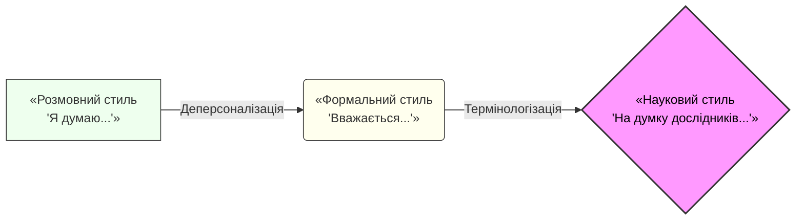
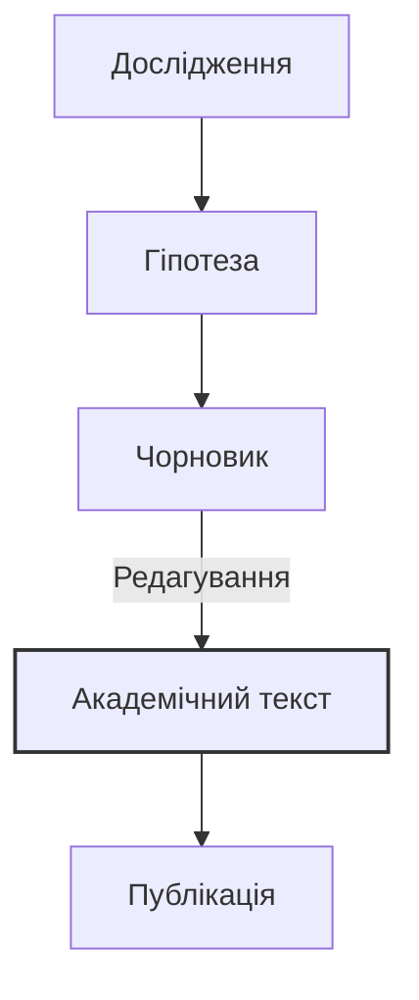

import Quiz from '@site/src/components/Quiz';
import MatchUp from '@site/src/components/MatchUp';
import FillIn from '@site/src/components/FillIn';
import TrueFalse from '@site/src/components/TrueFalse';
import Unjumble from '@site/src/components/Unjumble';
import GroupSort from '@site/src/components/GroupSort';
import Anagram from '@site/src/components/Anagram';
import ErrorCorrection, { ErrorCorrectionItem } from '@site/src/components/ErrorCorrection';
import Cloze from '@site/src/components/Cloze';
import Select from '@site/src/components/Select';
import Translate from '@site/src/components/Translate';
import MarkTheWords, { MarkTheWordsActivity } from '@site/src/components/MarkTheWords';
import HighlightMorphemes, { HighlightMorphemesActivity } from '@site/src/components/HighlightMorphemes';
import EssayResponse from '@site/src/components/EssayResponse';
import ComparativeStudy from '@site/src/components/ComparativeStudy';
import ReadingActivity from '@site/src/components/ReadingActivity';
import CriticalAnalysis from '@site/src/components/CriticalAnalysis';
import AuthorialIntent from '@site/src/components/AuthorialIntent';
import SourceEvaluation from '@site/src/components/SourceEvaluation';
import Debate from '@site/src/components/Debate';
import EtymologyTrace from '@site/src/components/EtymologyTrace';
import GrammarIdentify from '@site/src/components/GrammarIdentify';
import PaleographyAnalysis from '@site/src/components/PaleographyAnalysis';
import DialectComparison from '@site/src/components/DialectComparison';
import TranslationCritique from '@site/src/components/TranslationCritique';

> 🎯 **Чому це важливо?**
>
> Академічний стиль — це мова науки та офіційної комунікації. Він вимагає від автора не лише знання термінології, а й володіння специфічними граматичними конструкціями, що забезпечують об'єктивність, точність та логічну послідовності викладу. Як кажуть, стиль — це людина, але науковий стиль — це дисципліна мислення. У цьому модулі ми розберемо основні маркери наукового стилю: безособові конструкції, номіналізацію, пасивний стан та засоби пом'якшення тверджень (хеджинг). Ви навчитеся перетворювати прості думки на вагомі наукові тези, що відповідають високим стандартам українського академічного письма.

## Вступ: Науковий дискурс

**Джерело:** Адаптовано з: Коваль А. П. «Науковий стиль сучасної української літературної мови» (2020); Селіванова О. О. «Сучасна лінгвістика: напрями та проблеми» (2008).

> **Стилістичні особливості українського наукового дискурсу початку XXI століття: Динаміка та Стандартизація**
>
> У сучасній вітчизняній лінгвістиці **загальновизнано**, що науковий стиль є одним із найбільш динамічних та водночас регламентованих функціональних різновидів української літературної мови. В умовах інтеграції української науки у світовий простір **досліджується** вплив процесів глобалізації на термінологічні системи, зокрема в пріоритетних галузях, таких як інформаційні технології, біотехнології та економіка. **Зазначається**, що для сучасного українського наукового тексту характерна виразна тенденція до інтелектуалізації мовлення, яка виявляється у широкому використанні абстрактної лексики, ускладненої синтаксичної організації та прагненні до максимальної інформативної ємності.
>
> **Мета цієї статті полягає в тому, щоб** проаналізувати ключові лінгвістичні маркери академічності та особливості їх функціонування в текстах гуманітарного циклу, а також окреслити перспективи розвитку наукового стилю.
>
> **Насамперед варто підкреслити**, що домінуючою рисою наукового викладу є прагнення до об'єктивності та деперсоналізації. Суб'єктивне «я» автора в українській науковій традиції часто **нівелюється** або замінюється на узагальнене «ми» (так зване «авторське ми») чи безособові форми. Наприклад, замість суб'єктивної фрази «Я провів експеримент і побачив...» у науковому звіті **вживається** пасивна або безособова конструкція: «У ході експерименту було виявлено...» або «Результати дослідження засвідчують...». Така стратегія деперсоналізації дозволяє зосередити увагу читача на самому факті, явищі чи процесі, а не на особі дослідника, що надає висновкам ваги універсальності.
>
> **Крім того**, важливу системотворчу роль відіграє номіналізація — процес трансформації дієслівних конструкцій у іменникові групи (Коваль, 2020). Так, динамічне речення «досліджувати мову в її розвитку» трансформується у стативну фразу «дослідження мовного розвитку», що надає тексту більшої стабільності, дозволяє оперувати поняттями як об'єктами та значно ущільнює інформацію. **Аргументується** думка, що іменниковий характер наукового стилю (субстантивність) сприяє створенню термінологічної точності та уникненню двозначності (Селіванова, 2008).

:::note[🏺 Культура]
**Золота доба української термінології**
У 1920-х роках, в період «Розстріляного відродження», Інститут української наукової мови (Київ) здійснив титанічну працю, видавши десятки словників. Активну участь у цьому процесі брав Михайло Грушевський, який підкреслював важливість національної науки. Українські науковці прагнули створити самобутню термінологію, базовану на народній мові. На жаль, у 1930-х роках цей процес було зупинено радянськими репресіями.

**Слід зазначити**, що категоричність суджень у сучасній науці не завжди вітається, оскільки абсолютна істина є недосяжним ідеалом. Тому автори часто вдаються до засобів пом'якшення або «хеджингу» (термін походить від англ. «огорожа»): *ймовірно, можна припустити, певною мірою, за даними окремих досліджень, як видається*.
:::

:::note[📜 Цитата]
«Науковий стиль — це не сухість викладу, а точність думки.» — академік Л. А. Булаховський.
:::

:::note[Question]
Як ви вважаєте, чи завжди «хеджинг» є ознакою наукової скромності, чи іноді це може бути способом уникнути відповідальності за твердження?
:::

:::info[📝 Приклад]
**Приклад хеджингу в дії:**
Замість: «Дослідження доводить, що X викликає Y.»
Спробуйте: «Результати дослідження *можуть свідчити* про *можливий* зв'язок між X та Y, *хоча для остаточних висновків необхідні подальші дослідження*.»
:::

Це дозволяє вченому уникнути догматизму, продемонструвати наукову скромність і залишити простір для подальшої наукової дискусії. **Передбачається**, що подальший розвиток українського наукового стилю відбуватиметься в напрямку гармонізації міжнародних стандартів (зокрема, чіткості та структурованості) із національною мовною традицією, яка тяжіє до багатства синтаксичних засобів.

### Деконструкція: Маркери академічності

**Регістрові маркери:**

- **Безособові конструкції:** *загальновизнано, досліджується, зазначається, вживається, аргументується*. Вони створюють ефект відстороненості від суб'єкта, підкреслюючи об'єктивність знання.
- **Номіналізація:** *інтелектуалізація, глобалізація, функціонування, нівелювання, стандартизація, трансформація*. Велика кількість віддієслівних іменників на -ння/-ція є ознакою високого регістру.
- **Пасивні конструкції:** *було виявлено, досліджується вплив*. Акцент зміщено з діяча на об'єкт дії.
- **Формальні конектори:** *насамперед, крім того, слід зазначити, зокрема, водночас*. Вони забезпечують логічну зв'язність тексту (когезію).

**Структурні елементи:**

- **Вступ:** Окреслення загального контексту (динамічність наукового стилю в умовах глобалізації).
- **Мета:** Чітке, формульне визначення задачі (*Мета цієї статті полягає в тому, щоб...*).
- **Аргументація:** Послідовний виклад особливостей (об'єктивність, номіналізація, хеджинг) із поясненням їхньої функції.
- **Висновок:** Прогноз щодо майбутнього розвитку (*Передбачається, що...*).

> 🎓 **Академічна традиція: «Ми» vs «Я»**
>
> В українській науковій мові, на відміну від сучасної англо-американської традиції, використання особового займенника «я» вважається нескромним і стилістично маркованим. Хоча в західній науці фрази типу «I argue that...» стають нормою, український науковець традиційно скаже:
>
> - **«Ми» скромності:** «У нашій статті ми розглядаємо...» (навіть якщо автор один).
> - **Безособово:** «У статті розглядається...»
> - **Від третьої особи:** «Автор доходить висновку...»
>
> Ця традиція сягає корінням у радянську та німецьку наукові школи, де колективне знання ставилося вище за індивідуальне. Проте сьогодні, під впливом англійської мови, «я» поступово починає з'являтися в роботах молодих українських вчених, хоча консервативні редактори все ще можуть це виправляти.

## Академічне письмо: Теорія та Практика

### Засоби вираження об'єктивності

Науковий текст має звучати неупереджено, як «голос істини», а не як приватна думка. Для досягнення цього ефекту в українській мові існує потужний арсенал граматичних інструментів.

**1. Безособові форми на -но/-то:**
Це унікальна риса української мови, яка дозволяє констатувати факт виконання дії без вказівки на діяча. Вони звучать більш категорично та офіційно, ніж звичайний пасив.

- *Зроблено висновок.* (Факт, результат) vs *Ми зробили висновок.* (Процес)
- *Доведено теорему.* (Теорема є доведеною)
- *Розроблено методику.*
- *Встановлено, що...*
- *Здійснено перевірку гіпотези.*
- *Підготовлено фінальний звіт.*
- *Уточнено графік проведення тестів.*
- *Сформовано вибірку дослідників.*

**2. Зворотні дієслова з пасивним значенням (-ся):**
Використовуються для опису процесів, що відбуваються «самі собою», або коли дію виконує невизначене коло осіб.

- *Розглядається проблема...* (Ким? Наукою в цілому).
- *Спостерігається тенденція...*
- *Визначається поняття...*
- *Обговорюється питання...*
- *Досліджується вплив чинників.*
- *Аналізується стан ринку.*
- *З'ясовуються причини явища.*
- *Вивчається досвід колег.*

> ⚠️ **Типова помилка**
>
> Не плутайте пасивний стан (-ся) з активним.
> 🔴 *Неправильно:* Ця проблема хвилюється багатьох вчених. (Хвилюватися — це емоційний стан).
> 🟢 *Правильно:* Ця проблема хвилює багатьох вчених. (Активний стан).
> 🟢 *Правильно:* Ця проблема обговорюється багатьма вченими. (Пасивний стан).

**3. Номіналізація (Субстантивація):**
Перетворення речення на іменникову групу дозволяє «згорнути» інформацію і зробити її темою наступного речення.

- *Коли ми аналізуємо дані...* → *При аналізі даних...*
- *Щоб вирішити проблему...* → *Задля вирішення проблеми...*
- *Через те, що температура підвищилася...* → *Внаслідок підвищення температури...*
- *Науковці дискутують про це.* → *Наукова дискусія з цього приводу триває.*

### Візуалізація: Від розмовного до наукового

:::note[🏺 Культура]
**Наука в екзилі: Збереження традиції**
Коли в радянській Україні науковців репресували, українська наука продовжувала жити в діаспорі. У Мюнхені діяв Український вільний університет, у США — Наукове товариство імені Шевченка та Гарвардський інститут українських студій. Такі вчені, як Юрій Шевельов та Омелян Пріцак, зберігали високі стандарти українського академічного письма, які сьогодні повертаються в Україну.
:::

:::note[🏺 Культура]
**Літера «Ґ» у науці**
У 1933 році літеру «Ґ» було вилучено з абетки, що завдало удару науковій термінології. Адже саме ця літера передає дзвінкий [g] у запозичених термінах (*обґрунтування, ґрунт, ґенеза, ґравітація*). Радянська влада примусово замінювала її на «Г», стираючи різницю між *h* та *g*. Повернення «Ґ» у 1990-х стало символом деколонізації української науки.
:::

### Процес академічного письма

### Статистика вживання пасивного стану

Згідно з дослідженнями корпусної лінгвістики (Булаховський, 2005; Русанівський, 2010), розподіл пасивних конструкцій за жанрами виглядає так:

| Жанр               | Активний стан | Пасивний/Безособовий |
| ------------------ | ------------- | -------------------- |
| Художня література | 85%           | 15%                  |
| Публіцистика       | 70%           | 30%                  |
| Науковий стиль     | 40%           | 60%                  |
| Офіційно-діловий   | 30%           | 70%                  |

:::info[🧐 Аналіз]
**Інтерпретація даних**
Як видно з таблиці, науковий та офіційно-діловий стилі (Вихованець, 2008) тяжіють до пасивності. Це корелює з вимогою об'єктивності, про яку зазначали Горпинич (2004) та Ющук (2007).
:::

### Хеджинг (Хеджування): Мистецтво наукової обережності

У серйозній науці рідко щось відомо на 100%. Категоричність часто є ознакою дилетанства. Справжній науковець знає межі свого знання і використовує «хеджинг» — засоби пом'якшення тверджень.

:::info[🌍 Контекст]
**Етимологія**
Термін «хеджинг» походить від англійського слова, що означає «огорожа». Це спосіб «захистити» своє твердження від критики, обмеживши його сферу дії. В українській лінгвістиці це явище також називають «модальністю вірогідності» або «засобами авторизації».
:::

| Категорія                   | Приклади                                                                            | Функція                                                                                         |
| --------------------------- | ----------------------------------------------------------------------------------- | ----------------------------------------------------------------------------------------------- |
| **Епістемічні дієслова**    | *здається, припускається, вважається, видається*                                    | Дистанціювання автора від твердження, вказівка на суб'єктивність сприйняття або загальну думку. |
| **Прислівники ймовірності** | *ймовірно, можливо, очевидно, мабуть, напевно*                                      | Вказівка на ступінь вірогідності факту.                                                         |
| **Обмежувальні фрази**      | *певною мірою, у більшості випадків, як правило, здебільшого, в окремих контекстах* | Звуження сфери дії твердження, уникнення помилкового узагальнення.                              |
| **Модальні конструкції**    | *може свідчити про, могло б означати, є підстави вважати*                           | Гіпотетичність судження.                                                                        |

> 💡 **Академічне спостереження: Сила слабкості**
>
> Порівняйте силу наукового аргументу:
>
> 1. «Цей метод кращий за інші.» (Категорично. Легко спростувати, зайшовши хоча б один виняток).
> 2. «Можна припустити, що цей метод є ефективнішим за існуючі аналоги в контексті нашого дослідження.» (Обережно. Важко спростувати, бо твердження обмежене контекстом і подане як припущення).
>    Другий варіант у науковому світі вважається «сильнішим», бо він захищений від легкої критики.

## Порівняльний аналіз

### Текст 1 vs. Текст 2

Прочитайте уривок з популярної статті (Текст 2) і порівняйте його з попереднім науковим текстом. Зверніть увагу на те, як змінюється мова залежно від аудиторії та мети.

> **Текст 2 (Популярний): Чому вчені так складно пишуть?**
>
> «Ви колись пробували читати справжню дисертацію? Чесно кажучи, це просто жах! Купа якихось незрозумілих слів, речення розтягуються на пів сторінки, і ти вже не пам'ятаєш, з чого все почалося. Вчені ніби спеціально заплутують нас, простих смертних. Але насправді, як це не дивно, вони просто хочуть бути максимально точними. Коли ти в розмові кажеш »сонце встає«, це нормально, але це не зовсім правда з точки зору астрономії, еге ж? А науковець напише про »обертання Землі навколо своєї осі відносно небесного світила«. Отак і виходить, що прості речі на папері стають складними, щоб ніхто не міг придратися до слів.»

| Аспект                 | Текст 1 (Науковий)                                                  | Текст 2 (Популярний)                                                     |
| ---------------------- | ------------------------------------------------------------------- | ------------------------------------------------------------------------ |
| **Комунікативна мета** | Повідомити нове знання, обґрунтувати гіпотезу.                      | Розважити, пояснити складне простими словами, залучити широку аудиторію. |
| **Позиція автора**     | Об'єктивний аналіз, відстороненість («вважається»).                 | Емоційна оцінка, панібратство, спрощення, гра з читачем («еге ж?»).      |
| **Лексика**            | Терміни, абстрактні поняття (*дискурс, номіналізація, інтеграція*). | Розмовна, емоційна лексика (*жах, купа, отак, смертних*).                |
| **Синтаксис**          | Складні речення, пасивні звороти, вставні слова.                    | Прості, рубані речення, риторичні питання, пряме звертання.              |
| **Адресат**            | Фахівці, колеги-науковці.                                           | Широке коло читачів, неспеціалісти.                                      |

### Практика спілкування: Наукова дискусія

**Діалог 1: Студент і Науковий Керівник**

> — Я думаю, що ця ідея повна дурниць. Мені не подобається, як автор пише.
> — Колего, нумо перефразуймо це академічно.
> — Е-е-е... Ця концепція видається спірною?
> — Чудово. А щодо стилю автора?
> — Стиль викладу є дещо ускладненим і потребує доопрацювання.
> — Саме так. Пам'ятайте: ми не критикуємо особистість, ми аналізуємо текст.

**Діалог 2: На конференції**

> — Прошу до слова пана Петренка.
> — Дякую. Тема моєї доповіді — вплив глобалізації. Я знайшов купу цікавих фактів.
> — Перепрошую, чи могли б ви уточнити методологію? Що означає «купу фактів»?
> — Ой, вибачте. У ході дослідження було зібрано та проаналізовано значний масив емпіричних даних.
> — Дякую, так набагато зрозуміліше і переконливіше.

### Питання для критичного осмислення

**Питання для роздуму:**

1. **Баланс складності:** Чи завжди виправдана «ускладненість» наукового тексту? Чи іноді це спосіб приховати відсутність глибокого змісту (так званий «наукоподібний стиль»)?
2. **Вплив номіналізації:** Як номіналізація впливає на сприйняття тексту? Вона робить його «важчим» (висока лексична густина), але водночас інформативнішим. Як знайти золоту середину?
3. **Контекст:** У яких ситуаціях вчений зобов'язаний використати стиль Тексту 2? (Наприклад, при поданні грантової заявки для громадського проекту, у науково-популярному блозі, в інтерв'ю ЗМІ). Важливість «популяризації науки» зростає.

:::tip[💡 **Порада: Перемикання кодів**]

Хороший фахівець володіє обома кодами: він може написати статтю для *Nature* (Текст 1) і пост у Facebook про це ж дослідження (Текст 2). Якщо ви вмієте лише перше — вас не почують. Якщо лише друге — вам не повірять. Тренуйтеся перекладати складне простою мовою і навпаки.

🔍 **Критичне читання: Детектор псевдонауки**

Читаючи науковий текст, завжди звертайте увагу на «хеджинг». Парадоксально, але якщо автор вживає слова «безсумнівно», «очевидно», «завжди», «стовідсотково доведено» без наведення масиву статистичних даних — це привід засумніватися в його об'єктивності. Справжня наука завжди залишає місце для сумніву і уточнення. Категоричність часто є ознакою пропаганди або псевдонауки.
:::

## Практика

### Завдання 1: Редагування (Трансформація стилю)

Перепишіть подані речення в академічному стилі, використовуючи безособові конструкції, пасивний стан та номіналізацію. Уявіть, що ви редагуєте чернетку студента для публікації в журналі.

1. **Розмовний:** «Я довго думав і вирішив дослідити, як люди говорять у селах, бо мені це цікаво.»
   **Академічний:** *Метою даного дослідження є комплексний аналіз особливостей діалектного мовлення сільського населення.* (Заміна «Я» на «Мета», «люди говорять» на «діалектне мовлення»).

2. **Розмовний:** «Ми побачили, що температура росте, бо, мабуть, стає більше CO2 в повітрі.»
   **Академічний:** *Спостерігається пряма кореляція між підвищенням температурних показників та зростанням концентрації CO2 в атмосфері.* (Заміна «росте» на «підвищення», «ми побачили» на «спостерігається»).

3. **Розмовний:** «Вчені зараз багато сперечаються про те, чи треба змінювати правопис, чи ні.»
   **Академічний:** *У сучасній науковій спільноті точиться гостра дискусія щодо доцільності та шляхів реформування українського правопису.* (Заміна «сперечаються» на «точиться дискусія»).

4. **Розмовний:** «Якщо подивитися на результати, то стає ясно, що експеримент вдався.»
   **Академічний:** *Аналіз отриманих результатів дозволяє стверджувати про успішність проведеного експерименту.* (Або: *Результати свідчать про успіх експерименту.*)

:::success[✅ Модельна відповідь]
**Варіант редагування:**

1. Метою даного дослідження є комплексний аналіз особливостей діалектного мовлення сільського населення.
2. Спостерігається пряма кореляція між підвищенням температурних показників та зростанням концентрації вуглекислого газу в атмосфері.
3. У сучасній науковій спільноті точиться гостра дискусія щодо доцільності та шляхів реформування українського правопису.
4. Аналіз отриманих результатів дає підстави стверджувати про успішність проведеного експерименту.
:::

### Завдання 2: Написання анотації

Уявіть, що ви провели дослідження на тему «Вплив соціальних мереж на грамотність сучасної молоді». Напишіть коротку анотацію (80-100 слів), використовуючи такі кліше:

- *У статті розглядається...*
- *Особлива увага приділяється...*
- *На основі аналізу...*
- *Було виявлено...*
- *Зроблено висновок про...*

**Зразок відповіді (Model Answer):**

:::success[✅ Модельна відповідь]
**Приклад анотації наукової статті**

**Анотація.** У статті розглядається актуальна проблема впливу інтернет-комунікації на рівень мовної грамотності сучасної української молоді. На основі аналізу дописів і коментарів у соціальних мережах (Facebook, Instagram, TikTok) простежуються основні тенденції відхилення від мовної норми. Особлива увага приділяється явищам графічної редукції, ігнорування пунктуації та впливу англомовних запозичень. Було виявлено, що неформальний стиль онлайн-спілкування створює нову «мережеву норму», яка інтерферує з літературною мовою. Зроблено висновок про необхідність перегляду шкільних методик викладання мови з урахуванням нових комунікативних реалій.
:::

:::tip[💡 **Порада: Лаконічність**]

В анотації кожне слово має вагу. Уникайте цитат, риторичних питань та детальних прикладів. Це «сухий залишок» (distillate) вашого дослідження. Читач має за 30 секунд зрозуміти, про що ваша робота, яку методологію ви використали і до яких висновків дійшли.
:::

## 📋 Підсумок

У цьому модулі ви ознайомилися з фундаментальними маркерами українського академічного стилю. Ви навчилися розпізнавати та використовувати **безособові конструкції** для досягнення об'єктивності, застосовувати **номіналізацію** для ущільнення інформації та використовувати **хеджинг** для етичної та професійної коректності висловлювань. Пам'ятайте: академічний стиль — це не просто набір складних слів, це особливий спосіб мислення, що вимагає точності, логіки та поваги до істини.

:::note[🏺 Культура]
**Наука в екзилі: Збереження традиції**
Коли в радянській Україні науковців репресували, українська наука продовжувала жити в діаспорі. У Мюнхені діяв Український вільний університет, у США — Наукове товариство імені Шевченка та Гарвардський інститут українських студій. Такі вчені, як Юрій Шевельов та Омелян Пріцак, зберігали високі стандарти українського академічного письма, які сьогодні повертаються в Україну.
:::

:::note[🏺 Культура]
**Іван Франко: Перший енциклопедист**
Іван Франко був не лише поетом, а й доктором філософії. Його науковий доробок вражає: він писав праці з економіки, історії, етнографії та літературознавства. Франко одним із перших почав творити українську наукову термінологію в Галичині, доводячи, що українська мова здатна обслуговувати найскладніші інтелектуальні сфери. Його стиль вирізняється чіткістю, полемічною гостротою та глибокою ерудицією.
:::

---

## Потрібно більше практики?

Ви завершили цей модуль! Ось кілька способів закріпити матеріал:

### 🔄 Поглиблення знань

- Напишіть коротке есе, використовуючи хеджинг
- Проаналізуйте наукову статтю на наявність маркерів
- Спробуйте переписати розмовний текст в академічному стилі

### 🎯 Використання в житті

- Використовуйте академічні звороти в листуванні
- Звертайте увагу на стиль новин та аналітики
- Практикуйте об'єктивність у дискусіях

### 🌐 Онлайн-ресурси

- **Офіційний сайт НАН України:** [https://www.nas.gov.ua](https://www.nas.gov.ua)
- **Термінологічні словники:** [https://r2u.org.ua](https://r2u.org.ua)

## 🎯 Вправи

### Розуміння Тексту 1

<Quiz questions={JSON.parse(`[{"question": "Виходячи з аналізу першого тексту, яка саме мовна характеристика вважається абсолютно домінуючою та визначальною рисою наукового викладу, що дозволяє авторові дистанціюватися від суб'єктивного сприйняття дійсності?", "options": [{"text": "Високий рівень емоційності, експресивності та широке використання різноманітних художніх метафор.", "correct": false}, {"text": "Прагнення до максимальної об'єктивності, точності та використання абстрактних понять у викладі думок.", "correct": true}, {"text": "Постійне використання розмовних фразеологізмів для зближення з пересічним читачем наукової статті.", "correct": false}, {"text": "Повна відсутність будь-яких логічних зв'язків між окремими частинами складного наукового тексту.", "correct": false}], "explanation": "Академічний стиль вимагає об'єктивності, точності та абстрагування від особистого авторського 'я'."}, {"question": "Що саме, згідно з міркуваннями автора Тексту 1, зазвичай відбувається з особовим займенником «я» в українській науковій мові під час написання фахових статей чи дисертаційних робіт?", "options": [{"text": "Він широко та без обмежень використовується у кожному реченні для підкреслення авторської позиції.", "correct": false}, {"text": "Він повністю замінюється на займенник «ти» для створення ефекту діалогу з потенційним читачем.", "correct": false}, {"text": "Він свідомо нівелюється або замінюється на так зване авторське «ми» для надання тексту солідності.", "correct": true}, {"text": "Він стає офіційно обов'язковим елементом кожної наукової тези згідно з новими правилами правопису.", "correct": false}], "explanation": "У науці прийнято уникати надмірної суб'єктивності, використовуючи 'ми' або безособові форми."}, {"question": "Яку саме специфічну функцію виконують складні безособові конструкції у структурі академічного тексту, коли автор прагне зосередити увагу читача виключно на об'єктивних фактах та отриманих результатах?", "options": [{"text": "Вони максимально підкреслюють унікальну особистість автора та його неповторний творчий стиль мовлення.", "correct": false}, {"text": "Вони деперсоналізують виклад матеріалу, фокусуючи увагу читача на самих діях, явищах або процесах.", "correct": true}, {"text": "Вони роблять науковий текст значно простішим та легшим для сприйняття дітьми молодшого віку.", "correct": false}, {"text": "Вони виражають глибокий сумнів автора щодо правильності та достовірності власних наукових висновків.", "correct": false}], "explanation": "Безособові конструкції (наприклад, 'встановлено', 'виявлено') прибирають акцент з виконавця дії."}, {"question": "Як саме у тексті модуля визначається складне лінгвістичне поняття «номіналізація» у контексті трансформації наукового мовлення для досягнення більшої щільності та інформативності викладу матеріалу?", "options": [{"text": "Процес створення абсолютно нових термінів для опису невідомих раніше природних чи соціальних явищ.", "correct": false}, {"text": "Свідоме перетворення дієслівних конструкцій на іменникові форми для ущільнення інформації в тексті.", "correct": true}, {"text": "Використання виключно власних назв відомих вчених для найменування відкритих ними законів природи.", "correct": false}, {"text": "Процес перекладу складних наукових понять з іноземних мов на українську без втрати змісту.", "correct": false}], "explanation": "Номіналізація (наприклад, 'досліджувати' -> 'дослідження') характерна для стисненого наукового стилю."}, {"question": "Чому саме сучасні автори наукових праць дедалі частіше вдаються до використання стратегії «хеджингу» (пом'якшення тверджень) під час формулювання своїх гіпотез та остаточних висновків?", "options": [{"text": "Щоб відкрито продемонструвати свою повну невпевченість у власних знаннях та відсутність досвіду.", "correct": false}, {"text": "Щоб уникнути зайвої категоричності та залишити простір для подальшої наукової дискусії з колегами.", "correct": true}, {"text": "Щоб спеціально заплутати читача та приховати відсутність реальних результатів проведеного експерименту.", "correct": false}, {"text": "Щоб штучно збільшити загальний обсяг тексту роботи без додавання нової та корисної інформації.", "correct": false}], "explanation": "Хеджинг (наприклад, 'ймовірно', 'можна припустити') є ознакою наукової етики та обережності."}, {"question": "Яка саме стійка тенденція спостерігається сьогодні у розвитку сучасного українського наукового стилю у ХХІ столітті згідно з висновками, наведеними у першому тексті модуля?", "options": [{"text": "Поступове та радикальне спрощення синтаксису до рівня коротких речень у соціальних мережах.", "correct": false}, {"text": "Глобальна інтелектуалізація мовлення та розширення функціональних можливостей української мови в науці.", "correct": true}, {"text": "Повна відмова від використання будь-якої спеціальної термінології на користь загальновживаних слів.", "correct": false}, {"text": "Свідомий перехід всіх наукових журналів виключно на розмовний стиль спілкування з аудиторією.", "correct": false}], "explanation": "Українська наукова мова стає більш гнучкою та здатною обслуговувати найскладніші галузі знань."}, {"question": "Що саме мається на увазі під терміном «інтеграція» в межах сучасного наукового дискурсу, коли йдеться про взаємодію різних галузей знань чи окремих частин системи?", "options": [{"text": "Процес поступового розпаду цілісної наукової системи на окремі непов'язані між собою фрагменти.", "correct": false}, {"text": "Процес об'єднання окремих частин у єдине ціле для досягнення вищого рівня системної організації.", "correct": true}, {"text": "Повна ізоляція національної науки від світових процесів та відмова від міжнародної співпраці.", "correct": false}, {"text": "Спростування старої наукової теорії без пропонування будь-якої нової альтернативи на заміну.", "correct": false}], "explanation": "Інтеграція передбачає синтез та об'єднання ресурсів для вирішення комплексних завдань."}, {"question": "Як саме у тексті пояснюється значний вплив процесів глобалізації на сучасний стан та подальший розвиток термінологічних систем національних мов у науковому середовищі?", "options": [{"text": "Глобалізація взагалі ніяк не впливає на розвиток мови та не змінює існуючих наукових стандартів.", "correct": false}, {"text": "Вона неминуче призводить до повної уніфікації та швидкого зникнення всіх національних мов науки.", "correct": false}, {"text": "Вона суттєво впливає на термінологічні системи, вимагаючи їхньої гармонізації з міжнародними стандартами.", "correct": true}, {"text": "Процеси глобалізації офіційно заборонені в українській науці згідно з рішенням профільного міністерства.", "correct": false}], "explanation": "Інтеграція у світовий простір вимагає точності та відповідності міжнародній термінології."}]`)} />

### Маркери академічного стилю

<MatchUp pairs={JSON.parse(`[{"left": "Хеджинг", "right": "вживання слів «ймовірно», «можна припустити» для пом'якшення тези"}, {"left": "Номіналізація", "right": "заміна дієслова іменником: «досліджувати» → «дослідження»"}, {"left": "Безособова форма", "right": "вживання конструкцій на -но, -то: «було виявлено», «встановлено»"}, {"left": "Формальний конектор", "right": "слова «насамперед», «внаслідок цього» для зв'язку думок"}, {"left": "Пасивна конструкція", "right": "речення, де акцент на об'єкті: «проблема розглядається авторами»"}, {"left": "Авторське «ми»", "right": "використання множини замість однини: «ми вважаємо, що...»"}, {"left": "Деперсоналізація", "right": "свідоме усунення особи автора з тексту для об'єктивності"}, {"left": "Інтелектуалізація", "right": "ускладнення думки та синтаксису через абстрактну лексику"}, {"left": "Об'єктивність", "right": "відсутність емоційного забарвлення та авторської упередженості"}, {"left": "Абстрагування", "right": "перехід від конкретних прикладів до загальних закономірностей"}, {"left": "Термінологічність", "right": "використання слів з однозначно визначеним науковим змістом"}, {"left": "Логічність", "right": "сувора послідовність викладу аргументів та висновків"}, {"left": "Кореляція", "right": "взаємозв'язок між двома або кількома науковими показниками"}, {"left": "Верифікація", "right": "процес перевірки достовірності отриманих наукових даних"}]`)} />

### Сортування за стилем

<GroupSort groups={JSON.parse(`{"Науковий стиль": ["Вважається, що результати експерименту є цілком достовірними.", "Було проаналізовано дані, отримані в ході тривалого дослідження.", "Спостерігається стійка кореляція між цими двома чинниками.", "Результати свідчать про потребу в подальшій верифікації.", "Необхідно підкреслити стратегічну важливість даної теми.", "У статті детально розглядається питання екологічної безпеки."], "Публіцистичний стиль": ["Українська наука впевнено крокує у майбутнє, долаючи бар'єри.", "Кожен свідомий громадянин має замислитися над долею нації.", "Світ змінюється надзвичайно швидко, і ми маємо встигати.", "Мова — це не просто засіб зв'язку, а справжнє серце народу.", "Ми відкриваємо нову сторінку в історії нашого університету.", "Цей проєкт став справжнім проривом у сфері цифрових технологій."], "Розмовний стиль": ["Я думаю, що це просто крута ідея для нашого проєкту.", "Ми швиденько подивилися на всі дані і все зрозуміли.", "Тут видно якийсь дивний зв'язок між цими штуками.", "Результати показують, що ми все зробили правильно і вчасно.", "Треба сказати, що це реально важливо для кожного з нас.", "У статті пишеться про різні цікаві речі з життя вчених."]}`)} />

### Трансформація: Номіналізація

<FillIn items={JSON.parse(`[{"sentence": "Коли ми **досліджуємо** мову, ми бачимо зміни. При ___ мови ми бачимо зміни.", "answer": "дослідженні", "options": ["дослідженні", "досліджуванні", "дослідництву", "дослідів"]}, {"sentence": "Те, що **підвищилася** температура, вплинуло на результати. ___ температури вплинуло на результати.", "answer": "Підвищення", "options": ["Підвищення", "Підвищування", "Висота", "Підвищили"]}, {"sentence": "Учені **виконали** роботу вчасно. ___ роботи було здійснено вчасно.", "answer": "Виконання", "options": ["Виконання", "Виконування", "Виконаність", "Виконали"]}, {"sentence": "Після того, як **завершили** експеримент. Після ___ експерименту було підбито підсумки.", "answer": "завершення", "options": ["завершення", "завершування", "кінця", "Завершили"]}, {"sentence": "Ми **обговорили** проблему протягом години. ___ проблеми тривало більше години.", "answer": "Обговорення", "options": ["Обговорення", "Говоріння", "Бесіда", "Обговорювали"]}, {"sentence": "Вони **створили** нову теорію. Результатом роботи стало ___ нової теорії.", "answer": "створення", "options": ["створення", "творіння", "зроблення", "Створили"]}, {"sentence": "Він успішно **використав** метод. ___ методу виявилося надзвичайно ефективним.", "answer": "Використання", "options": ["Використання", "Користування", "Вжиття", "Застосування"]}, {"sentence": "**Впровадити** нову технологію. Ми розпочали ___ нової технології у виробництво.", "answer": "впровадження", "options": ["впровадження", "введення", "робота", "Впровадили"]}]`)} />

### Хеджинг: Вибір слова

<Select questions={JSON.parse(`[{"question": "Оберіть найбільш прийнятний варіант для формулювання переваги певного методу в науковій дискусії.", "options": [{"text": "Цей метод точно найкращий з усіх існуючих на сьогодні.", "correct": false}, {"text": "Цей метод є безперечно найкращим і найефективнішим.", "correct": false}, {"text": "На мою думку, цей метод є найкращим у світі.", "correct": false}, {"text": "Можна стверджувати, що цей метод є одним із найбільш ефективних.", "correct": true}], "explanation": ""}, {"question": "Як найкраще висловити загальноприйняту в наукових колах думку, уникаючи зайвої категоричності?", "options": [{"text": "Всі нормальні люди знають, що це твердження є правдою.", "correct": false}, {"text": "Загальновідомо, що це твердження завжди є абсолютною істиною.", "correct": false}, {"text": "Я точно знаю, що це правда і ніхто не заперечить.", "correct": false}, {"text": "Існує широкий науковий консенсус щодо обґрунтованості цього твердження.", "correct": true}], "explanation": ""}, {"question": "Оберіть варіант опису результатів, що демонструє високий рівень академічної обережності.", "options": [{"text": "Результати наших експериментів завжди є абсолютно однаковими.", "correct": false}, {"text": "Отримані результати демонструють високу ступінь повторюваності.", "correct": true}, {"text": "Результати гарантовано будуть такими самими завжди.", "correct": false}, {"text": "Ми кожного разу отримуємо точно такі самі результати дослідження.", "correct": false}], "explanation": ""}, {"question": "Яким чином доцільно висловити критичне ставлення до сумнівної теорії в академічному середовищі?", "options": [{"text": "Це повна дурниця і це твердження є абсолютно неправильним.", "correct": false}, {"text": "Дане твердження видається сумнівним і потребує додаткової перевірки.", "correct": true}, {"text": "Теорія є неправильною і ми її відкидаємо.", "correct": false}, {"text": "Це відверта брехня, яка не має жодного стосунку до справжньої науки.", "correct": false}], "explanation": ""}, {"question": "Як коректно висловити впевненість у правильності гіпотези, використовуючи засоби хеджингу?", "options": [{"text": "Я на сто відсотків впевнений у цьому результаті.", "correct": false}, {"text": "Я точно знаю, що моя гіпотеза є єдино правильною.", "correct": false}, {"text": "Немає жодних сумнівів у моїй абсолютній правоті.", "correct": false}, {"text": "Є вагомі підстави вважати, що запропонована гіпотеза є слушною.", "correct": true}], "explanation": ""}, {"question": "Оберіть варіант опису неефективного методу, що відповідає нормам наукового етикету.", "options": [{"text": "Це дуже поганий метод, який ніколи не працює на практиці.", "correct": false}, {"text": "Ефективність даного методу не було переконливо доведено дослідниками.", "correct": true}, {"text": "Ми вважаємо цей метод поганим і неефективним.", "correct": false}, {"text": "Цей метод є абсолютно безглуздим і не вартим нашої уваги.", "correct": false}], "explanation": ""}]`)} />

### Безособові конструкції

<FillIn items={JSON.parse(`[{"sentence": "Ми успішно виконали поставлене завдання. -> Завдання ___.", "answer": "виконано", "options": ["виконано", "виконане", "виконали", "виконувати"]}, {"sentence": "Автори написали ґрунтовну наукову статтю. -> Статтю ___.", "answer": "написано", "options": ["написано", "написана", "написали", "написати"]}, {"sentence": "Вчені відкрили новий закон природи. -> Новий закон ___.", "answer": "відкрито", "options": ["відкрито", "відкритий", "відкрили", "відкрити"]}, {"sentence": "Комісія нарешті прийняла остаточне рішення. -> Рішення ___.", "answer": "прийнято", "options": ["прийнято", "прийняте", "прийняли", "прийняти"]}, {"sentence": "Дослідники ретельно проаналізували всі дані. -> Дані ___.", "answer": "проаналізовано", "options": ["проаналізовано", "проаналізовані", "проаналізували", "проаналізувати"]}, {"sentence": "Ми нарешті досягли поставленої мети. -> Мету ___.", "answer": "досягнуто", "options": ["досягнуто", "досягнута", "досягли", "досягти"]}, {"sentence": "Уряд офіційно затвердив державний бюджет. -> Бюджет ___.", "answer": "затверджено", "options": ["затверджено", "затверджений", "затвердили", "затвердити"]}, {"sentence": "Інститут розробив детальний стратегічний план. -> План ___.", "answer": "розроблено", "options": ["розроблено", "розроблений", "розробили", "розробити"]}]`)} />

### Академічна лексика: Синоніми

<MatchUp pairs={JSON.parse(`[{"left": "знайти", "right": "виявити / віднайти"}, {"left": "показати", "right": "продемонструвати / ілюструвати"}, {"left": "думати", "right": "вважати / припускати / стверджувати"}, {"left": "говорити про", "right": "розглядати / обговорювати / висвітлювати"}, {"left": "перевірити", "right": "верифікація / апробувати"}, {"left": "довести", "right": "аргументувати / обґрунтувати"}, {"left": "розкласти", "right": "класифікувати / систематизувати"}, {"left": "пояснити", "right": "інтерпретувати / тлумачити"}, {"left": "зробити", "right": "здійснити / реалізувати / впровадити"}, {"left": "отримати", "right": "здобути / досягти / зафіксувати"}, {"left": "бачити", "right": "констатувати / спостерігати"}, {"left": "покращити", "right": "оптимізувати / вдосконалити"}, {"left": "почати", "right": "ініціювати / розпочати / започаткувати"}, {"left": "закінчити", "right": "завершити / підсумувати / резюмувати"}]`)} />

### Логічні конектори

<FillIn items={JSON.parse(`[{"sentence": "___, варто детально розглянути передісторію цього складного питання.", "answer": "Насамперед", "options": ["Насамперед", "Однак", "Тому", "Проте"]}, {"sentence": "Результати були несподіваними. ___, ми вирішили продовжити роботу.", "answer": "Проте", "options": ["Проте", "Отже", "До того ж", "Наприклад"]}, {"sentence": "Експеримент пройшов успішно. ___, початкову гіпотезу було підтвердено.", "answer": "Отже", "options": ["Отже", "Хоча", "Навпаки", "Але"]}, {"sentence": "Це явище є складним. ___, воно має глибокі соціальні причини...", "answer": "З одного боку", "options": ["З одного боку", "Як наслідок", "Наприклад", "Втім"]}, {"sentence": "___, у ході роботи було виявлено абсолютно нові фактори впливу.", "answer": "Крім того", "options": ["Крім того", "Всупереч", "Але", "Тому"]}, {"sentence": "Ми не знайшли доказів. ___ цього масштабний проєкт було закрито.", "answer": "Внаслідок", "options": ["Внаслідок", "Тому", "Однак", "Отже"]}, {"sentence": "___, розглянемо поточну ситуацію в глобальній економіці.", "answer": "Наприклад", "options": ["Наприклад", "Втім", "Отже", "Проте"]}, {"sentence": "Теорія є надзвичайно цікавою, ___ вона має певні суттєві недоліки.", "answer": "але", "options": ["але", "до того ж", "зокрема", "однак"]}, {"sentence": "___, слід звернути особливу увагу на технічні деталі процесу.", "answer": "Зокрема", "options": ["Зокрема", "Втім", "Тому", "Але"]}, {"sentence": "Дані є точними. ___ інтерпретація результатів може бути різною.", "answer": "Водночас", "options": ["Водночас", "Тому", "Оскільки", "Проте"]}, {"sentence": "___, обрана нами методика дослідження вже дещо застаріла.", "answer": "По-перше", "options": ["По-перше", "Однак", "Але", "Тому"]}, {"sentence": "___, підсумуємо все вищесказане у попередніх розділах роботи.", "answer": "Нарешті", "options": ["Нарешті", "Але", "Тому", "Втім"]}, {"sentence": "Це питання є важливим, ___ воно безпосередньо впливає на результат.", "answer": "оскільки", "options": ["оскільки", "однак", "проте", "хоча"]}, {"sentence": "___, вся інформаційна система несподівано вийшла з ладу.", "answer": "Як наслідок", "options": ["Як наслідок", "Наприклад", "Всупереч", "Тому"]}, {"sentence": "Думки вчених розділилися. ___, одні вважають так, а інші зовсім інакше.", "answer": "Зокрема", "options": ["Зокрема", "Тому", "Отже", "Проте"]}, {"sentence": "___ нашим очікуванням, все дослідження пройшло дуже добре.", "answer": "Всупереч", "options": ["Всупереч", "Тому", "Отже", "Але"]}, {"sentence": "___ наведеними даними, все у нашому звіті вказано вірно.", "answer": "Згідно з", "options": ["Згідно з", "Через", "Бо", "Тому що"]}, {"sentence": "___ отриманих результатів, ми можемо сказати що ми праві.", "answer": "Відповідно до", "options": ["Відповідно до", "Через", "Бо", "Оскільки"]}]`)} />

### Пошук помилок регістру

<Quiz questions={JSON.parse(`[{"question": "У цій класній науковій статті автор надзвичайно детально та дуже цікаво розповідає широкому колу читачів про складні та важливі основи сучасної квантової фізики.", "options": [{"text": "класній", "correct": true}, {"text": "статті", "correct": false}, {"text": "автор", "correct": false}, {"text": "розповідає", "correct": false}], "explanation": "Слово 'класний' є оцінним прикметником, характерним для розмовного стилю, а не для науки."}, {"question": "Ми дуже хотіли глянути на практиці, що саме вийде з цього масштабного дослідження після завершення його першого етапу та отримання нових даних.", "options": [{"text": "глянути", "correct": true}, {"text": "хотіли", "correct": false}, {"text": "що", "correct": false}, {"text": "дослідження", "correct": false}], "explanation": "Дієслово 'глянути' є розмовним; в академічному стилі слід вживати 'розглянути' або 'проаналізувати'."}, {"question": "Автор у своїх фінальних висновках прямо пише, що всі наведені аргументи опонентів є абсолютною дурницею і не варті жодної уваги вченої ради.", "options": [{"text": "дурницею", "correct": true}, {"text": "пише", "correct": false}, {"text": "автор", "correct": false}, {"text": "що", "correct": false}], "explanation": "Іменник 'дурниця' має виражене емоційно-зневажливе забарвлення і є недопустимим у науковій дискусії."}, {"question": "Вчені нещодавно випадково надибали надзвичайно цікавий та дуже важливий історичний факт під час своєї тривалої роботи в секретному державному архіві нашої країни.", "options": [{"text": "надибали", "correct": true}, {"text": "факт", "correct": false}, {"text": "цікавий", "correct": false}, {"text": "архіві", "correct": false}], "explanation": "Слово 'надибати' належить до розмовного стилю; краще використати нейтральне 'виявити' або 'віднайти'."}, {"question": "Це нове наукове дослідження є просто справжня бомба, оскільки воно повністю та безповоротно змінює наше уявлення про історичний розвиток всього людського суспільства.", "options": [{"text": "бомба", "correct": true}, {"text": "дослідження", "correct": false}, {"text": "просто", "correct": false}, {"text": "змінює", "correct": false}], "explanation": "Використання слова 'бомба' у значенні великого успіху є типовим молодіжним сленгом, а не науковим терміном."}, {"question": "Науковцям сьогодні треба терміново шукати зовсім інші шляхи для швидкого вирішення цієї глобальної проблеми, що зараз реально загрожує майбутньому всього сучасного людства.", "options": [{"text": "шукати", "correct": true}, {"text": "треба", "correct": false}, {"text": "інші", "correct": false}, {"text": "шляхи", "correct": false}], "explanation": "Дієслово 'шукати' є нейтральним, але в академічному контексті доречніше вжити 'віднаходити' або 'визначати'."}, {"question": "Результати нашого останнього експерименту вийшли так собі, тому ми вирішили кардинально та повністю змінити всю існуючу методику проведення наших майбутніх лабораторних тестів.", "options": [{"text": "так собі", "correct": true}, {"text": "вийшли", "correct": false}, {"text": "результати", "correct": false}, {"text": "змінити", "correct": false}], "explanation": "Фразеологізм 'так собі' є суто розмовним виразом, що не передає точного наукового ступеня ефективності."}, {"question": "Автор нової статті трохи наплутав з історичними датами, що згодом призвело до появи певних суттєвих неточностей у його фінальних наукових висновках та рекомендаціях.", "options": [{"text": "наплутав", "correct": true}, {"text": "автор", "correct": false}, {"text": "датами", "correct": false}, {"text": "неточностей", "correct": false}], "explanation": "Слово 'наплутати' є розмовним; в академічному письмі слід використовувати 'припуститися помилки'."}]`)} />

### Складання речень: Хеджинг

<Unjumble items={JSON.parse(`[{"jumbled": "Можна / цілком / обґрунтовано / припустити / що / саме / цей / складний / фактор / і / є / головною / причиною / такої / несподіваної / помилки / під / час / дослідження / .", "answer": "Можна цілком обґрунтовано припустити, що саме цей складний фактор і є головною причиною такої несподіваної помилки під час дослідження."}, {"jumbled": "Певною / мірою / цей / зовнішній / чинник / суттєво / впливає / на / загальний / результат / проведеного / нами / тривалого / наукового / дослідження / у / цій / галузі / .", "answer": "Певною мірою цей зовнішній чинник суттєво впливає на загальний результат проведеного нами тривалого наукового дослідження у цій галузі."}, {"jumbled": "Ймовірно / саме / цей / специфічний / фактор / і / буде / вирішальним / під / час / прийняття / остаточного / рішення / науковою / радою / нашого / профільного / інституту / .", "answer": "Ймовірно, саме цей специфічний фактор і буде вирішальним під час прийняття остаточного рішення науковою радою нашого профільного інституту."}, {"jumbled": "Загально / вважається / що / ця / стара / наукова / теорія / вже / давно / застаріла / і / потребує / негайного / повного / перегляду / провідними / фахівцями / нашої / країни / .", "answer": "Загально вважається, що ця стара наукова теорія вже давно застаріла і потребує негайного повного перегляду провідними фахівцями нашої країни."}, {"jumbled": "Це / може / переконливо / свідчити / про / певні / позитивні / зміни / які / зараз / активно / відбуваються / у / нашому / сучасному / суспільстві / протягом / останніх / років / .", "answer": "Це може переконливо свідчити про певні позитивні зміни, які зараз активно відбуваються у нашому сучасному суспільстві протягом останніх років."}, {"jumbled": "Твердження / автора / статті / щодо / причин / кризи / видається / нам / досить / сумнівним / і / воно / явно / потребує / додаткової / перевірки / незалежними / експертами / .", "answer": "Твердження автора статті щодо причин кризи видається нам досить сумнівним і воно явно потребує додаткової перевірки незалежними експертами."}]`)} />

### Ідентифікація пасиву

<TrueFalse items={JSON.parse(`[{"statement": "Складне наукове дослідження даної проблеми проводиться фахівцями нашого інституту щороку.", "isTrue": true, "explanation": "Використано пасивну конструкцію (проводиться)."}, {"statement": "Ми щороку проводимо масштабне та глибоке дослідження цієї актуальної соціальної проблеми.", "isTrue": false, "explanation": "Це речення в активному стані з підметом 'ми'."}, {"statement": "У ході тривалої дискусії було нарешті прийнято нові правила оформлення наукових робіт.", "isTrue": true, "explanation": "Використано безособову форму на -то (прийнято)."}, {"statement": "Наукова комісія після довгих суперечок нарешті прийняла нові правила для всіх студентів.", "isTrue": false, "explanation": "Це активна конструкція з підметом 'комісія'."}, {"statement": "Результати нашого експерименту будуть офіційно опубліковані у наступному номері журналу.", "isTrue": true, "explanation": "Використано форму пасивного стану (будуть опубліковані)."}, {"statement": "Автор обов'язково опублікує всі отримані результати дослідження вже завтра вранці.", "isTrue": false, "explanation": "Це активне речення з підметом 'автор'."}, {"statement": "Цю цікаву наукову книгу було уважно прочитано багатьма студентами нашого факультету.", "isTrue": true, "explanation": "Безособова конструкція на -но (прочитано)."}, {"statement": "Багато студентів нашого факультету вже уважно прочитали цю нову наукову книгу.", "isTrue": false, "explanation": "Активна конструкція з підметом 'студенти'."}]`)} />

### Академічні дієслова

<FillIn items={JSON.parse(`[{"sentence": "Науковцям необхідно ___ нову робочу гіпотезу для подальшого вивчення проблеми.", "answer": "висунути", "options": ["висунути", "зробити", "сказати", "покласти"]}, {"sentence": "На підставі аналізу даних ми можемо ___ обґрунтовані висновки щодо розвитку явища.", "answer": "зробити", "options": ["зробити", "написати", "подумати", "вирішити"]}, {"sentence": "На початку роботи важливо чітко ___ основну мету та завдання нашого дослідження.", "answer": "поставити", "options": ["поставити", "знайти", "взяти", "дати"]}, {"sentence": "Нам вдалося успішно ___ складну технічну проблему, що виникла під час тестів.", "answer": "вирішити", "options": ["вирішити", "подивитися", "зробити", "знайти"]}, {"sentence": "Колектив авторів планує ___ серію контрольних експериментів у лабораторних умовах.", "answer": "провести", "options": ["провести", "зробити", "грати", "піти"]}, {"sentence": "У ході роботи вченим вдалося ___ надзвичайно важливі та точні наукові результати.", "answer": "отримати", "options": ["отримати", "взяти", "купити", "мати"]}, {"sentence": "Ми маємо ретельно ___ всі отримані дані перед їхньою фінальною публікацією.", "answer": "проаналізувати", "options": ["проаналізувати", "подивитися", "читати", "бачити"]}, {"sentence": "Фахівцям довелося ___ нову комплексну теорію для пояснення виявлених змін.", "answer": "розробити", "options": ["розробити", "зробити", "написати", "придумати"]}]`)} />

### Коректність посилань

<Quiz questions={JSON.parse(`[{"question": "Яким саме чином найдоцільніше та найбільш коректно послатися на думку іншого авторитетного автора у тексті вашої власної фахової наукової статті?", "options": [{"text": "Як слушно зазначає у своїй праці Петренко (2020), дана проблема потребує вивчення.", "correct": true}, {"text": "Як там каже один відомий вчений Петренко, ця штука реально потребує перевірки.", "correct": false}, {"text": "Петренко десь там колись писав, що нам всім треба звернути увагу на це питання.", "correct": false}, {"text": "Один чувак на прізвище Петренко стверджує дуже цікаві речі про нашу сучасну науку.", "correct": false}], "explanation": "Науковий етикет вимагає зазначення прізвища та року видання праці."}, {"question": "Оберіть найбільш правильний, логічний та професійний варіант введення прямої цитати до основного тексту вашого майбутнього наукового чи академічного дослідження.", "options": [{"text": "У фундаментальній праці вченого стверджується наступне: «Цитований текст автора».", "correct": true}, {"text": "Автор сказав: «Цитований текст автора».", "correct": false}, {"text": "Він написав тіпа: «Цитований текст автора».", "correct": false}, {"text": "Ось така цитата: «Цитований текст автора».", "correct": false}], "explanation": "Пряма цитата має вводитися офіційно-діловим або науковим зворотом."}, {"question": "Який саме формат оформлення короткого посилання на першоджерело в самому кінці речення є на сьогодні загальноприйнятим стандартом в українській академічній науці?", "options": [{"text": "(Коваль, 2020, с. 45)", "correct": true}, {"text": "(див. там)", "correct": false}, {"text": "(Книжка Коваля)", "correct": false}, {"text": "(Це я прочитав)", "correct": false}], "explanation": "Стандартне посилання містить прізвище автора та рік видання (іноді сторінку)."}, {"question": "Який дієслівний зворот вважається найбільш влучним, точним та стилістично нейтральним для регулярного використання під час академічного цитування різноманітних джерел?", "options": [{"text": "Автор аргументовано зазначає", "correct": true}, {"text": "Автор собі думає", "correct": false}, {"text": "Автор говорить", "correct": false}, {"text": "Автор хоче сказати", "correct": false}], "explanation": "Слово 'зазначає' є стилістично нейтральним та характерним для академічного письма."}, {"question": "Як згідно з існуючими державними стандартами (ДСТУ) слід максимально правильно назвати перелік використаних книг та статей у самому кінці вашої наукової роботи?", "options": [{"text": "Список використаних джерел", "correct": true}, {"text": "Книжки, які я прочитав", "correct": false}, {"text": "Що я використав", "correct": false}, {"text": "Моя бібліотека", "correct": false}], "explanation": "Це офіційна назва бібліографічного розділу наукової праці."}, {"question": "Яким саме чином слід графічно та пунктуаційно оформлювати дослівну цитату в тексті, щоб чітко відокремити її від ваших власних авторських міркувань?", "options": [{"text": "Обов'язково в лапках та з відповідним посиланням на автора та рік видання.", "correct": true}, {"text": "Виключно великими літерами", "correct": false}, {"text": "Тільки жирним шрифтом", "correct": false}, {"text": "Тільки курсивом", "correct": false}], "explanation": "Лапки є основним пунктуаційним засобом виділення прямої цитати."}, {"question": "Чи дозволяється авторові за власним бажанням змінювати окремі слова, відмінки або порядок слів у прямій дослівній цитаті іншої офіційної особи?", "options": [{"text": "Ні, це категорично та офіційно заборонено нормами сучасної академічної доброчесності.", "correct": true}, {"text": "Так, можна міняти все", "correct": false}, {"text": "Тільки якщо це покращує", "correct": false}, {"text": "Тільки якщо ніхто", "correct": false}], "explanation": "Пряма цитата має зберігати оригінальну форму та зміст першоджерела."}, {"question": "Що саме в сучасному академічному середовищі вважається «плагіатом» і тягне за собою надзвичайно серйозні репутаційні та юридичні наслідки для автора?", "options": [{"text": "Умисне копіювання чужих думок, ідей або текстів без належного посилання на автора.", "correct": true}, {"text": "Написання своєї роботи", "correct": false}, {"text": "Цитування з посиланням", "correct": false}, {"text": "Простий переклад", "correct": false}], "explanation": "Плагіат — це привласнення результатів чужої інтелектуальної праці."}]`)} />

### Аналітичне читання

<Quiz questions={JSON.parse(`[{"question": "Яку саме ключову ідею та головний посил намагається донести автор Тексту 2 до широкого загалу читачів, ґрунтовно обґрунтовуючи специфіку наукової мови?", "options": [{"text": "Наукова точність неминуче вимагає складної мови, хоча це часто важко читати пересічній людині.", "correct": true}, {"text": "Науковці спеціально пишуть правильно, щоб здаватися розумнішими за своїх колег.", "correct": false}, {"text": "Сучасні дисертації неможливо читати через повну відсутність будь-якого здорового глузду.", "correct": false}, {"text": "Треба терміново заборонити вченим писати складно і перейти на звичайну розмовну мову.", "correct": false}], "explanation": "Автор пояснює, що складність мови є наслідком потреби у граничній точності висловлювання."}, {"question": "Який саме влучний приклад з повсякденного життя наводить автор для наочного пояснення фундаментальної різниці між звичайним побутовим та суворим науковим описом явищ?", "options": [{"text": "Приклад зі спостереженням за сходом сонця та його науковим тлумаченням як обертання планети.", "correct": true}, {"text": "Приклад зі зміною температури", "correct": false}, {"text": "Приклад з ситуацією в економіці", "correct": false}, {"text": "Приклад з досягненнями медицини", "correct": false}], "explanation": "Побутове 'сонце встає' в науці стає 'видимим переміщенням небесного світила'."}, {"question": "Яким саме влучним епітетом автор Тексту 2 найчастіше характеризує науковий стиль, підкреслюючи при цьому його основну та визначальну позитивну функціональну властивість?", "options": [{"text": "Гранично точним та об'єктивним інструментом для опису складних природних та соціальних процесів.", "correct": true}, {"text": "Абсолютно жахливим", "correct": false}, {"text": "Надзвичайно смішним", "correct": false}, {"text": "Дуже нудним", "correct": false}], "explanation": "Точність — головна чеснота наукового стилю за версією автора."}, {"question": "До якої саме цільової аудиторії першочергово звертається автор Тексту 2, намагаючись доступно пояснити внутрішню логіку та об'єктивну необхідність академічної складності?", "options": [{"text": "До максимально широкого загалу зацікавлених читачів, що прагнуть зрозуміти принципи роботи сучасної науки.", "correct": true}, {"text": "Виключно до науковців", "correct": false}, {"text": "Тільки до студентів", "correct": false}, {"text": "Тільки до самого себе", "correct": false}], "explanation": "Текст написаний у науково-популярному стилі для широкого кола зацікавлених осіб."}, {"question": "Які саме емоції, хоч і в дещо жартівливій формі, відкрито висловлює автор на самому початку свого тексту щодо складних наукових дисертацій?", "options": [{"text": "Певне роздратування занадто складною мовою, яка часто стоїть на заваді швидкому розумінню основної ідеї.", "correct": true}, {"text": "Щире захоплення красою", "correct": false}, {"text": "Повну байдужість до вчених", "correct": false}, {"text": "Сильний гнів на авторів", "correct": false}], "explanation": "Автор іронізує над складністю читання наукових фоліантів."}, {"question": "Чому, згідно з аргументацією автора, науковці воліють писати про «обертання Землі навколо власної осі», а не вживати просте словосполучення «схід сонця»?", "options": [{"text": "Тому що це є єдино науково коректним описом фізичного процесу, що відбувається насправді у космосі.", "correct": true}, {"text": "Бо так речення виглядає довше", "correct": false}, {"text": "Бо вони не знають слів", "correct": false}, {"text": "Бо це звучить красиво", "correct": false}], "explanation": "Наука вимагає опису суті явища, а не зовнішнього враження."}, {"question": "Який саме фінальний висновок робить автор щодо справжньої природи складності речей у сучасному науковому світі та нашому суб'єктивному сприйнятті цієї складності?", "options": [{"text": "Прості на перший погляд речі стають надзвичайно складними виключно заради максимальної точності їхнього опису.", "correct": true}, {"text": "Наука — це погана річ", "correct": false}, {"text": "Треба заборонити слова", "correct": false}, {"text": "Ніхто не читає до кінця", "correct": false}], "explanation": "Складність — це ціна, яку ми платимо за істину."}, {"question": "Що автор називає «інструментом високої науки», який здатний описувати найтонші нюанси навколишнього світу в сучасних динамічних умовах розвитку людства?", "options": [{"text": "Сучасну українську мову, що постійно розвивається та збагачується новими термінами та конструкціями.", "correct": true}, {"text": "Новий потужний мікроскоп", "correct": false}, {"text": "Швидкий інтернет-зв'язок", "correct": false}, {"text": "Велику наукову бібліотеку", "correct": false}], "explanation": "Мова є головним інструментом мислення та фіксації наукових результатів."}]`)} />

### Завершіть речення

<FillIn items={JSON.parse(`[{"sentence": "Мета цього наукового дослідження ___ в тому, щоб виявити причини змін.", "answer": "полягає", "options": ["полягає", "стоїть", "є", "міститься"]}, {"sentence": "Актуальність теми даної статті ___ тим, що проблема є маловивченою.", "answer": "зумовлена", "options": ["зумовлена", "зроблена", "є", "визначена"]}, {"sentence": "Слід окремо ___, що всі отримані результати дослідження є попередніми.", "answer": "зазначити", "options": ["зазначити", "сказати", "подумати", "відзначити"]}, {"sentence": "На підставі аналізу фактів можна ___ висновку, що гіпотеза є слушною.", "answer": "дійти", "options": ["дійти", "прийти", "зробити", "досягти"]}, {"sentence": "У цій статті детально ___ основні проблеми сучасної філологічної галузі.", "answer": "аналізуються", "options": ["аналізуються", "пишуться", "є", "розглядаються"]}, {"sentence": "Наша робота присвячена ___ нових ефективних рішень у сфері екології.", "answer": "пошуку", "options": ["пошуку", "знаходженню", "про", "вивченню"]}, {"sentence": "Автор у своїй праці ___ особливу увагу на важливості даного питання.", "answer": "акцентує", "options": ["акцентує", "робить", "ставить", "звертає"]}, {"sentence": "Для перевірки теорії було ___ цілий ряд складних експериментів.", "answer": "проведено", "options": ["проведено", "зробло", "грало", "здійснено"]}, {"sentence": "Отримані статистичні дані повністю ___ нашу початкову наукову гіпотезу.", "answer": "підтверджують", "options": ["підтверджують", "кажуть", "є", "доводять"]}, {"sentence": "Науковцям необхідно обов'язково ___ всі існуючі фактори впливу.", "answer": "враховувати", "options": ["враховувати", "бачити", "брати", "зважати на"]}, {"sentence": "Результати наших тестів повністю ___ з попередніми дослідженнями колег.", "answer": "узгоджуються", "options": ["узгоджуються", "сходять", "є", "корелюють"]}, {"sentence": "Це ___ нам впевнено стверджувати, що обраний шлях є правильним.", "answer": "дозволяє", "options": ["дозволяє", "дає", "може", "дає змогу"]}, {"sentence": "Запропонована теорія ___ ретельної перевірки в реальних умовах.", "answer": "потребує", "options": ["потребує", "хоче", "має", "вимагає"]}, {"sentence": "На даний момент це складне питання все ще ___ відкритим для дискусій.", "answer": "залишається", "options": ["залишається", "є", "стоїть", "вважається"]}, {"sentence": "Ми ___ цей позитивний крок як початок великих змін у системі.", "answer": "розглядаємо", "options": ["розглядаємо", "бачимо", "дивимося", "вважаємо"]}, {"sentence": "___ все вищесказане, ми пропонуємо змінити існуючу методологію.", "answer": "Враховуючи", "options": ["Враховуючи", "Беручи", "Знаючи", "З огляду на"]}, {"sentence": "___ на обставини, що склалися, це рішення можна вважати правильним.", "answer": "Зважаючи", "options": ["Зважаючи", "Дивлячись", "Бачачи", "Враховуючи"]}, {"sentence": "___ сказане, можна зробити висновок про важливість освіти.", "answer": "Підсумовуючи", "options": ["Підсумовуючи", "В кінці", "Все", "Резюмуючи"]}]`)} />

### Словниковий диктант

<FillIn items={JSON.parse(`[{"sentence": "Короткий виклад основного змісту наукової роботи або статті. ___", "answer": "анотація", "options": ["анотація", "вступ", "висновок", "реферат"]}, {"sentence": "Науково обґрунтоване припущення, що потребує подальшої перевірки. ___", "answer": "гіпотеза", "options": ["теорія", "гіпотеза", "аксіома", "закон"]}, {"sentence": "Логічний доказ, що наводиться для обґрунтування певної тези. ___", "answer": "аргумент", "options": ["факт", "аргумент", "думка", "доказ"]}, {"sentence": "Сукупність методів та прийомів, використаних у процесі дослідження. ___", "answer": "методологія", "options": ["методика", "методологія", "практика", "теорія"]}, {"sentence": "Центральна думка дослідження, яку автор має намір довести. ___", "answer": "теза", "options": ["теза", "тема", "ідея", "проблема"]}, {"sentence": "Основна текстова частина наукової статті або дисертації. ___", "answer": "корпус", "options": ["корпус", "тіло", "основа", "текст"]}, {"sentence": "Фахівець, який здійснює офіційну критичну оцінку наукової роботи. ___", "answer": "рецензент", "options": ["рецензент", "автор", "критик", "редактор"]}, {"sentence": "Повний перелік використаних джерел та літератури в кінці роботи. ___", "answer": "бібліографія", "options": ["бібліографія", "список", "книги", "джерела"]}]`)} />

### Підсумковий тест

<Quiz questions={JSON.parse(`[{"question": "Яка саме основна та кінцева стратегічна мета переслідується при використанні академічного стилю мовлення у професійній та науковій діяльності?", "options": [{"text": "Максимально розважити читача та викликати у нього сильні позитивні емоції.", "correct": false}, {"text": "Передати складну інформацію максимально точно, об'єктивно та лаконічно для аудиторії.", "correct": true}, {"text": "Спеціально заплутати опонента під час тривалої та гострої наукової дискусії.", "correct": false}, {"text": "Продемонструвати всім оточуючим свій надзвичайно багатий словниковий запас слів.", "correct": false}], "explanation": "Точність та об'єктивність — фундамент академічної комунікації."}, {"question": "Що саме в сучасній лінгвістиці мається на увазі під специфічним терміном «авторське ми» у будь-якому науковому тексті?", "options": [{"text": "Свідоме використання займенника «ми» замість «я» для надання викладу більшої об'єктивності.", "correct": true}, {"text": "Колективне написання однієї наукової статті великою групою абсолютно різних авторів.", "correct": false}, {"text": "Постійне цитування думок інших відомих вчених у тексті власної наукової роботи.", "correct": false}, {"text": "Груба граматична помилка, якої часто припускаються молоді та недосвідчені автори.", "correct": false}], "explanation": "'Ми' допомагає уникнути надмірної персоналізації викладу."}, {"question": "У яких саме випадках найбільш доречно, логічно та виправдано використовувати пасивний стан дієслів у науковому звіті чи статті?", "options": [{"text": "У будь-якому художньому творі для створення особливого та неповторного поетичного настрою.", "correct": false}, {"text": "Для свідомого зміщення акценту з виконавця дії на саму наукову дію або її фінальний результат.", "correct": true}, {"text": "Під час звичайної приватної розмови з друзями про останні новини сучасної науки.", "correct": false}, {"text": "Використання пасивного стану взагалі ніколи не є доречним у сучасній українській мові.", "correct": false}], "explanation": "Пасив зміщує фокус на об'єкт дослідження."}, {"question": "Чи дозволяється чинними офіційними нормами та правилами мовної культури використання звичайних розмовних слів у серйозній науковій статті чи дисертаційній роботі нашого профільного університету?", "options": [{"text": "Так, це робиться для того, щоб читачеві було значно веселіше читати складний текст.", "correct": false}, {"text": "Ні, це вважається грубим та неприпустимим порушенням академічного регістру мовлення.", "correct": false}, {"text": "Тільки у виключних випадках як приклад для ілюстрації певного лінгвістичного явища.", "correct": true}, {"text": "Це залежить виключно від настрою автора в момент безпосереднього написання статті.", "correct": false}], "explanation": "Збереження чистоти регістру є обов'язковим для науки."}, {"question": "Яку саме суттєву практичну перевагу дає авторові використання лінгвістичного процесу номіналізації (оіменникування) під час написання складного наукового тексту або підготовки офіційного академічного звіту?", "options": [{"text": "Це робить текст значно довшим і соліднішим на вигляд для кожного читача.", "correct": false}, {"text": "Це суттєво ущільнює інформацію та робить виклад матеріалу більш абстрактним.", "correct": true}, {"text": "Це робить науковий текст дуже смішним та несерйозним для справжніх фахівців.", "correct": false}, {"text": "Номіналізація насправді не дає жодної реальної переваги для автора роботи.", "correct": false}], "explanation": "Іменникові конструкції дозволяють вкласти більше змісту в меншу кількість слів."}, {"question": "Навіщо у кожній серйозній науковій роботі обов'язково мають бути присутні детальні посилання на всі використані авторитетні джерела, літературу та попередні дослідження інших вчених?", "options": [{"text": "Щоб продемонструвати всім, що автор прочитав дуже багато різних та цікавих книг.", "correct": false}, {"text": "Щоб уникнути плагіату та офіційно підтвердити достовірність наведених у тексті фактів.", "correct": true}, {"text": "Щоб просто штучно та швидко збільшити загальну кількість сторінок у своїй роботі.", "correct": false}, {"text": "Посилання насправді не є обов'язковими для сучасних молодих науковців країни.", "correct": false}], "explanation": "Посилання — це ознака академічної доброчесності та наукової точності."}, {"question": "Який саме стиль сучасного мовлення офіційно вважається найбільш далеким за своїми характеристиками та фактично прямо протилежним суворому та об'єктивному науковому стилю?", "options": [{"text": "Офіційно-діловий стиль оформлення різноманітних державних документів.", "correct": false}, {"text": "Звичайний розмовний стиль нашого щоденного неофіційного спілкування.", "correct": true}, {"text": "Публіцистичний стиль газетних статей та телевізійних репортажів.", "correct": false}, {"text": "Художній стиль сучасних літературних творів та класичної поезії.", "correct": false}], "explanation": "Розмовний стиль є суб'єктивним та емоційним, що протилежне науці."}, {"question": "Що саме в сучасній лінгвістиці реально означає стратегія «хеджингу» під час написання складного академічного чи наукового тексту в умовах фахової дискусії?", "options": [{"text": "Особлива фінансова операція з цінними паперами на міжнародній фондовій біржі.", "correct": false}, {"text": "Спеціальний засіб мовного пом'якшення надмірної категоричності авторських тверджень.", "correct": true}, {"text": "Мистецтво догляду за зеленими насадженнями в саду (декоративне садівництво).", "correct": false}, {"text": "Побудова високої захисної огорожі навколо будівлі наукового інституту.", "correct": false}], "explanation": "Хеджинг допомагає висловити думку як гіпотезу, а не як істину в останній інстанції."}]`)} />

### Письмове завдання: Редагування

<EssayResponse title="Письмове завдання: Редагування" prompt={"**Текст для редагування:**\n«Я думаю, що ці результати експерименту дуже класні. Ми подивилися на всі дані і побачили, що все працює добре. Звісно, спочатку були певні проблеми, але ми їх швидко вирішили. Треба сказати, що цей новий метод — найкращий.»\n\n**Вимоги до виконання:**\n- Використовуйте безособові конструкції (на -но/-то).\n- Повністю уникайте емоційної та суб'єктивної лексики.\n- Використовуйте засоби хеджингу для пом'якшення тверджень.\n- Обсяг: 100-150 слів.\n"} modelAnswer={"Отримані результати проведеного нами комплексного дослідження можна з повною відповідальністю вважати цілком задовільними, репрезентативними та науково обґрунтованими. Ретельний та всебічний аналіз великого масиву емпіричних даних, зібраних протягом тривалого часу, переконливо продемонстрував високу ефективність, надійність та стабільність запропонованого нами інноваційного підходу. Попри певні об'єктивні організаційні та технічні труднощі, що, на жаль, виникли на початковому етапі нашої експериментальної роботи, їх було успішно та своєчасно подолано завдяки впровадженню гнучкої стратегії оптимізації внутрішніх процесів. На сьогодні є всі вагомі логічні та фактичні підстави стверджувати, що даний аналітичний метод є одним із найбільш перспективних, точних та адаптивних інструментів для подальшого широкого практичного застосування у відповідній фаховій галузі знань."} rubric={"\n\n#### Критерії оцінювання\n\n| Критерій | Опис | Бали |\n|---|---|---|\n| Академічний стиль | Відсутність розмовної лексики, використання термінології. | 40 |\n| Граматичні конструкції | Правильне вживання форм на -но/-то та номіналізація. | 30 |\n| Хеджинг | Використання засобів пом'якшення категоричності. | 20 |\n| Обсяг | Дотримання вимог щодо кількості слів (100-150). | 10 |"} isUkrainian={true} />