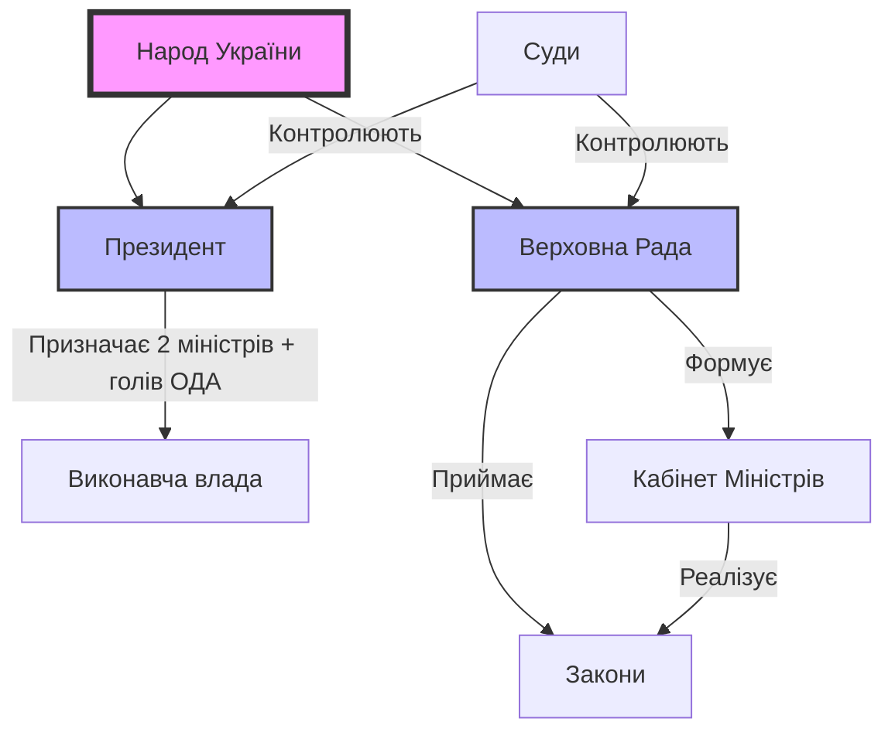

import Quiz from '@site/src/components/Quiz';
import MatchUp from '@site/src/components/MatchUp';
import FillIn from '@site/src/components/FillIn';
import TrueFalse from '@site/src/components/TrueFalse';
import Unjumble from '@site/src/components/Unjumble';
import GroupSort from '@site/src/components/GroupSort';
import Anagram from '@site/src/components/Anagram';
import ErrorCorrection, { ErrorCorrectionItem } from '@site/src/components/ErrorCorrection';
import Cloze from '@site/src/components/Cloze';
import Select from '@site/src/components/Select';
import Translate from '@site/src/components/Translate';
import MarkTheWords, { MarkTheWordsActivity } from '@site/src/components/MarkTheWords';
import HighlightMorphemes, { HighlightMorphemesActivity } from '@site/src/components/HighlightMorphemes';
import EssayResponse from '@site/src/components/EssayResponse';
import ComparativeStudy from '@site/src/components/ComparativeStudy';
import ReadingActivity from '@site/src/components/ReadingActivity';
import CriticalAnalysis from '@site/src/components/CriticalAnalysis';
import AuthorialIntent from '@site/src/components/AuthorialIntent';
import SourceEvaluation from '@site/src/components/SourceEvaluation';
import Debate from '@site/src/components/Debate';
import EtymologyTrace from '@site/src/components/EtymologyTrace';
import GrammarIdentify from '@site/src/components/GrammarIdentify';
import PaleographyAnalysis from '@site/src/components/PaleographyAnalysis';
import DialectComparison from '@site/src/components/DialectComparison';
import TranslationCritique from '@site/src/components/TranslationCritique';

Україна — це не просто територія на мапі Європи, це живий організм, де демократія постійно виборюється і вдосконалюється. Щоб зрозуміти новини, дебати на кухні чи закони, треба знати правила гри.

## Розминка

1.  Як ви думаєте, хто має більше влади в Україні: Президент чи Парламент?
2.  Чи знаєте ви ім'я вашого депутата-мажоритарника (якщо такий є)?
3.  Що таке "коаліція" і чому вона розпадається?

## Читання

Україна — це **унітарна парламентсько-президентська республіка**. Це означає, що центр прийняття рішень знаходиться у Парламенті (Верховній Раді), але Президент має сильні повноваження у сферах оборони та зовнішньої політики.

:::info[🕰️ Історична довідка]
**Пилип Орлик:** Українці мають демократію в ДНК. У 1710 році гетьман Пилип Орлик уклав документ "Пакти і Конституції прав і вольностей Війська Запорозького". Це була одна з перших конституцій у світі, яка розділяла владу на три гілки ще до того, як це зробив Монтеск'є.
:::

## 1. Законодавча влада: Верховна Рада

Верховна Рада України — це єдиний законодавчий орган. Вона складається з 450 народних депутатів (парламентарів).
**Функції:**

- Приймати закони та Конституцію.
- Призначати вибори Президента.
- Затверджувати Державний бюджет.
- Звільняти та призначати Уряд (Кабінет Міністрів).

:::tip[💡 Порада]
**Як перевірити депутата?**
Не вірте рекламі. Зайдіть на сайт `itd.rada.gov.ua` або портал руху ЧЕСНО (`chesno.org`). Там можна побачити, як ваш депутат голосував за важливі закони, чи не є він "кнопкодавом" (голосує за сусіда) і чи не прогулює засідання. Відповідальний громадянин — інформований громадянин.
:::

:::info[🌍 Контекст]
**Монобільшість:** Це унікальне явище для української політики, коли одна партія отримує понад 226 мандатів і може сама сформувати уряд без коаліції. Це сталося вперше у 2019 році з партією "Слуга Народу".
:::

## 2. Виконавча влада: Дуалізм

Тут часто виникає плутанина. В Україні виконвча влада розділена.

### Президент України

Він є Гарантом Конституції, Головнокомандувачем ЗСУ та обличчям держави на міжнародній арені.

- **Обирається:** Народом на 5 років (максимум 2 терміни).
- **Призначає:** Голів обласних адміністрацій, генпрокурора, вище командування армії.
- **Вплив:** Має право "вето" на закони.

:::note[Timeline]
**Президенти України:**

- **1991-1994:** Леонід Кравчук (незалежність).
- **1994-2005:** Леонід Кучма (Конституція і олігархія).
- **2005-2010:** Віктор Ющенко (демократія і НАТО).
- **2010-2014:** Віктор Янукович (узурпація і втеча).
- **2014-2019:** Петро Порошенко (армія і безвіз).
- **2019-...:** Володимир Зеленський (цифровізація і війна).
:::

### Кабінет Міністрів (Уряд)

Це вищий орган у системі виконавчої влади, який відповідає за економіку, освіту, медицину та дороги.

- **Голова:** Прем'єр-міністр України. Його обирає Парламент, а не Президент!
- **Відповідальність:** Уряд підзвітний Верховній Раді. Якщо Рада висловить недовіру, уряд йде у відставку.

## 3. Судова влада: В пошуках справедливості

Судова система є незалежною (на папері), але історично є найбільш проблемною ланкою через корупцію.

- **Конституційний Суд:** Вирішує, чи відповідають закони Конституції. Його рішення не можна оскаржити.
- **Верховний Суд:** Найвища інстанція для цивільних та кримінальних справ.

:::danger[🛡️ Руйнівник міфів]
**Міф:** "Президент має посадити всіх корупціонерів".
**Реальність:** Президент не має права нікого саджати. Це функція судів та прокуратури. Якщо Президент дзвонить судді з наказом — це злочин. Українці часто вимагають від лідера "сильної руки", забуваючи про розділення влади.
:::

## 4. Антикорупційна інфраструктура

Це абсолютно новий клас інституцій, створений після 2014 року під тиском суспільства та західних партнерів. Вони незалежні від старих правоохоронних органів.

### НАБУ (Національне антикорупційне бюро України)

Це "спецназ" боротьби з корупцією. Їхня задача — ловити "велику рибу": міністрів, депутатів, суддів.

- **Детективи:** Вони проводять розслідування, ведуть прослушку і затримують підозрюваних.
- **Незалежність:** Директора НАБУ обирає конкурсна комісія з міжнародними експертами, щоб уникнути політичного впливу.

### САП (Спеціалізована антикорупційна прокуратура)

Детективи не можуть йти в суд без прокурора. САП наглядає за НАБУ і представляє обвинувачення в суді. Без підпису голови САП справа розвалюється.

### ВАКС (Вищий антикорупційний суд)

Раніше справи НАБУ потрапляли в звичайні районні суди, де їх роками "ховали". Тому створили окремий суд виключно для топ-корупції.

- **Результати:** ВАКС вже виніс десятки вироків, включаючи реальні терміни для депутатів.
- **Конфіскація:** Саме цей суд конфіскує активи російських олігархів в Україні.

### НАЗК (Національне агентство з питань запобігання корупції)

Вони не саджають, вони перевіряють стиль життя.

- **Є-декларування:** Кожен чиновник в Україні зобов'язаний заповнити електронну декларацію про всі свої доходи, авто, квартири і навіть годинники. Якщо депутат купив віллу, але офіційно заробив 0 гривень — НАЗК це побачить.

## 5. Конституційна ніч і боротьба за правила

Українська Конституція народжувалася в муках.

:::info[🕰️ Історична довідка]
**Конституційна ніч:** 28 червня 1996 року Верховна Рада працювала 24 години без перерви. Депутати зачинилися в залі, щоб ухвалити Основний Закон, і вийшли тільки вранці. До цього моменту країна 5 років жила без нової конституції. Ця ніч стала легендою українського парламентаризму.
:::

Але боротьба не закінчилася. Влада в Україні постійно коливалася між Президентом і Парламентом.

- **2004 рік:** Помаранчева революція обмежила владу Президента, передавши частину повноважень Уряду.
- **2010 рік:** Янукович незаконно скасував цю реформу, узурпувавши владу.
- **2014 рік:** Після перемоги Майдану Україна повернулася до парламентсько-президентської моделі. Це запобіжник проти диктатури.

## 6. Вибори і Демократія: Відкриті списки

Вибори в Україні — це завжди драма, інтрига і непередбачуваність. Ми змінюємо владу регулярно.

Раніше виборча система була "змішаною" (половина депутатів за списками партій, половина — мажоритарники в округах). Це породжувало "гречкосійство" — підкуп виборців в округах продуктовими наборами.

**Новий Виборчий Кодекс** запровадив **пропорційну систему з відкритими списками**.

- Як це працює? Ви голосуєте не тільки за партію, а й за конкретного кандидата в цій партії.
- **Регіональні списки:** Партія не може просто поставити свого друга на прохідне місце. Якщо виборець ставить галочку за номер 5 у списку, цей кандидат піднімається вгору і обганяє номер 1.
- **Вплив:** Це дає виборцю реальну владу формувати якісний склад парламенту, а не просто голосувати за бренди.

:::note[🏺 Культура]
**Кухня кандидатів:** В Україні існує термін "технічний кандидат". Це людина, яку реєструють на виборах лише для того, щоб відтягнути голоси у конкурента (наприклад, однофамілець) або щоб отримати додаткові місця у виборчих комісіях. Це "чорна технологія", з якою бореться громадянське суспільство. Демократія — це змагання ідей, а не технологій.
:::

- **День тиші:** Субота перед виборами. Будь-яка агітація заборонена.
- **Екзит-пол (Exit Poll):** Опитування на виході. Зазвичай точні.

## 7. Децентралізація: Успішна реформа

До 2014 року всі гроші йшли в Київ, а потім "роздавалися" регіонам у ручному режимі. Це створювало залежність місцевих еліт від центральної влади. "Хочеш гроші на дорогу? Будь лояльним до Президента".

Реформа децентралізації зламала цю феодальну систему.

1.  **ОТГ (Об'єднані територіальні громади):** Села, селища та міста добровільно об'єдналися в спроможні громади.
2.  **Бюджет:** Податок на доходи фізосіб (ПДФО) тепер значною мірою залишається на місцях. Громада сама вирішує: будувати школу, дорогу, ЦНАП (Центр надання адмінпослуг) чи парк.
3.  **Відповідальність:** Мер міста тепер не може сказати "Київ не дав грошей". Гроші є, треба вміти написати проєкт.
4.  **Успішні кейси:** Міста як **Маріуполь** (до знищення росіянами), **Тростянець**, **Львів**, **Дніпро** та **Харків** показали неймовірний стрибок розвитку завдяки децентралізації. Навіть маленькі громади на Полтавщині чи Франківщині ремонтують школи.

## Деколонізаційний погляд

Мовне питання в Україні довго використовувалося політиками для розділення суспільства ("Схід проти Заходу"). Але після 2014, і особливо 2022 року, консенсус змінився.

- **Мовне питання:** Історик **Михайло Грушевський** казав: "Біда України в тому, що нею керують ті, кому вона не потрібна". Це змінюється. Зараз мова — це кордон.
- **Закон про мову:** Офіційно він називається "Закон про забезпечення функціонування української мови як державної". Він не забороняє говорити російською вдома (в приватному житті), але вимагає, щоб **публічний простір** (держава, сфера обслуговування, освіта, медицина) був україномовним.
- **Мовний омбудсмен:** Це посадова особа, яка захищає право громадян на отримання інформації та послуг українською. Ви можете поскаржитися омбудсмену, якщо вам відмовляють в обслуговуванні державною мовою.
- **Ідентичність:** Зараз перехід на українську — це політичний акт солідарності з державою і спосіб ментального відмежування від агресора ("Геть від Москви").

:::note[📜 Цитата]
*"Нації вмирають не від інфаркту. Спочатку їм відбирає мову."*
— *Ліна Костенко*
:::

## 9. Громадянське суспільство: Четверта влада

Те, що не прописано в законах, але є фундаментом України. Коли держава слабка або робить помилки, вмикається громадянське суспільство.

- **Майдани:** Революція Гідності (2014) показала, що джерелом влади є народ. Якщо влада переходить "червоні лінії", українці виходять на вулиці.

:::note[📜 Цитата]
**Конституція України (документ, ст. 5):**
"Носієм суверенітету і єдиним джерелом влади в Україні є народ. Народ здійснює владу безпосередньо і через органи державної влади та органи місцевого самоврядування."
:::

- **Волонтери:** З 2014 року, і особливо з 2022, волонтери фактично підмінили собою частину державних функцій (забезпечення армії, евакуація, медицина). Фонди "Повернись живим" або Фонд Притули мають довіру вищу, ніж будь-яка партія.

### 9.1. Феномен Майдану

Українське слово "Майдан" увійшло в світові словники як синонім боротьби за свободу. Це не просто площа в центрі Києва, це спосіб дії. Українці терплячі, але коли влада перетинає межу (фальсифікація виборів у 2004, побиття студентів у 2013), спрацьовує запобіжник. Майдан — це інструмент прямої демократії.
Це відрізняє Україну від Росії, де протести жорстоко придушуються, а суспільство атомізоване. В Україні горизонтальні зв'язки сильніші за вертикаль влади. Ми можемо самоорганізуватися за кілька годин через соцмережі, побудувати барикади, організувати кухню, шпиталь і охорону без жодного центрального керівництва. Це наша суперсила і наш хаос одночасно.

## 10. Цифрова держава: Дія

Україна будує "державу в смартфоні". Застосунок **Дія** змінив відносини громадянина і чиновника.

- **Послуги:** Відкрити ФОП (бізнес) за 10 хвилин, змінити прописку, отримати довідку — все онлайн.
- **Електронна демократія:** Опитування в Дії щодо дизайну марок чи назв вулиць залучають мільйони людей.

## 11. Політична культура та дебати

Українці люблять сперечатися про політику. Це національний вид спорту.

- **Ток-шоу:** Політичні передачі мають високі рейтинги.
- **Зрада vs Перемога:** Улюблені поняття українського Facebook. Кожну дію влади розглядають через цю призму.
  - *Зрада:* Все пропало, нас продали.
  - *Перемога:* Ми найкращі, ворог втік.
    Істина зазвичай десь посередині.

## 12. Політичні партії: Життя і смерть брендів

Українська партійна система вкрай нестабільна. Більшість партій є "лідерськими проєктами" (іменними блоками), а не ідеологічними структурами.

- **Ребрендинг:** Партії часто змінюють назви та кольори перед кожними виборами, щоб позбутися негативного рейтингу.
- **Фінансування:** Раніше партії повністю залежали від олігархів ("тіньові каси"). Реформа запровадила **державне фінансування** парламентських партій. Це дає шанс на незалежність, але "старі гроші" все ще грають роль.
- **Заборона проросійських партій:** Після 2022 року діяльність партій, що виправдовують агресію (наприклад, ОПЗЖ), була заборонена судом, а їхнє майно конфісковано.

:::note[📜 Цитата]
*"Демократія — це не стан, а процес. І в Україні цей процес відбувається на підвищених швидкостях."*
— *Ярослав Грицак, історик*
:::

## 13. Судова влада: В пошуках справедливості

Судова система історично є найбільш проблемною ланкою через корупцію та кругову поруку.

- **ВРП (Вища рада правосуддя):** Головний орган, який має звільняти недоброчесних суддів. Зараз до її складу входять міжнародні експерти (Етична рада), що дає надію на очищення.
- **КСУ (Конституційний Суд):** Має величезну владу скасовувати будь-які реформи. Конституційна криза 2020 року показала, що цей суд може бути загрозою національній безпеці, якщо він корумпований.
- **Довіра:** Згідно з опитуваннями, рівень довіри до судів залишається критично низьким (близько 10-15%), на відміну від армії (понад 90%).

## 14. Prozorro: Революція прозорості

До 2015 року державні закупівлі були "чорною дірою" бюджету. Чиновники купували "золоті яйця" за завищеними цінами у своїх родичів.
Система **Prozorro** ("Прозоро") змінила правила гри:

1.  **Всі бачать все:** Кожен громадянин може зайти на сайт і подивитися, за скільки школа купила парти або лікарня — ліки.
2.  **Аукціон:** Держава оголошує тендер, і бізнес змагається за найнижчу ціну. Це зекономило бюджету мільярди доларів.
3.  **DoZorro:** Портал, де громадськість може скаржитися на підозрілі тендери.

## 15. Геополітика і Конституція

Україна — єдина держава в світі, в Конституції якої закріплено курс на членство в **ЄС** (Європейський Союз) та **НАТО**. Це сталося у 2019 році.

- **НАТО:** Більшість українців (понад 80%) підтримують вступ до Альянсу як, єдину гарантію безпеки від російської агресії.
- **Євросоюз:** У 2022 році Україна отримала статус кандидата, а у 2023 почала переговори про вступ. Це вимагає від нас "домашньої роботи": адаптації тисяч законів до стандартів ЄС.

:::note[Timeline]
**Шлях до Європи:**

- **1991:** Незалежність.
- **2004:** Помаранчева революція (вибір демократії).
- **2014:** Революція Гідності (підписання Угоди про асоціацію з ЄС).
- **2019:** Курс на ЄС/НАТО в Конституції.
:::

## Первинні джерела

:::note[📜 Цитата]
**Конституція України (документ, ст. 1):**
"Україна є суверенна і незалежна, демократична, соціальна, правова держава."
:::

:::note[📜 Цитата]
**Конституція України (документ, ст. 5):**
"Носієм суверенітету і єдиним джерелом влади в Україні є народ. Народ здійснює владу безпосередньо і через органи державної влади та органи місцевого самоврядування."
:::

## 📋 Підсумок

Політична система України складна, динамічна і жива. Це баланс між Президентом, Парламентом та активним громадянським суспільством. Ми не ідеальні, але ми вільні. Розуміння того, як працює Рада, навіщо потрібна децентралізація і яка роль волонтерів, допоможе вам не лише читати новини, а й розуміти душу українського народу. Демократія для українців — це не подарунок, а щоденна робота.

## Потрібно більше практики?

- [ ] **Читання новин:** Відкрийте "Українську Правду" або "BBC Україна" і знайдіть статтю про парламент. Випишіть 5 політичних термінів.
- [ ] **Конституція:** Прочитайте перші 5 статей Конституції України. Це база.
- [ ] **Дія:** Якщо у вас є можливість, завантажте застосунок і подивіться, як виглядає цифровий паспорт.
- [ ] **Prozorro:** Знайдіть на сайті prozorro.gov.ua тендер вашого улюбленого міста.

## 🎯 Вправи

### Політичний устрій

<Quiz questions={JSON.parse(`[{"question": "Яка саме форма державного правління є офіційно закріпленою в нині чинній Конституції України?", "options": [{"text": "Парламентсько-президентська республіка", "correct": true}, {"text": "Президентсько-парламентська республіка", "correct": false}, {"text": "Абсолютна монархія", "correct": false}, {"text": "Федеративна республіка", "correct": false}], "explanation": ""}, {"question": "Яке українське місто має закріплений спеціальний правовий статус у системі адміністративно-територіального устрою України?", "options": [{"text": "Київ", "correct": true}, {"text": "Львів", "correct": false}, {"text": "Одеса", "correct": false}, {"text": "Харків", "correct": false}], "explanation": ""}, {"question": "Яка саме посадова особа може бути усунена з посади в порядку імпічменту, встановленому Конституцією?", "options": [{"text": "Президент України", "correct": true}, {"text": "Прем'єр-міністр", "correct": false}, {"text": "Спікер Ради", "correct": false}, {"text": "Генпрокурор", "correct": false}], "explanation": ""}, {"question": "Який нормативно-правовий документ є найвищим за своєю юридичною силою в Україні?", "options": [{"text": "Конституція України", "correct": true}, {"text": "Указ Президента", "correct": false}, {"text": "Постанова Уряду", "correct": false}, {"text": "Рішення суду", "correct": false}], "explanation": ""}, {"question": "Який орган є єдиним носієм законодавчої влади в Україні згідно з Основним Законом?", "options": [{"text": "Верховна Рада України", "correct": true}, {"text": "Кабінет Міністрів", "correct": false}, {"text": "Офіс Президента", "correct": false}, {"text": "Конституційний Суд", "correct": false}], "explanation": ""}, {"question": "Яка точна кількість народних депутатів входить до повного конституційного складу Верховної Ради України?", "options": [{"text": "450", "correct": true}, {"text": "300", "correct": false}, {"text": "100", "correct": false}, {"text": "500", "correct": false}], "explanation": ""}, {"question": "Хто має право вносити кандидатуру Прем'єр-міністра України на розгляд Парламенту?", "options": [{"text": "Президент за поданням коаліції", "correct": true}, {"text": "Президент одноосібно", "correct": false}, {"text": "Народ на референдумі", "correct": false}, {"text": "Голова Верховної Ради", "correct": false}], "explanation": ""}, {"question": "Який встановлено мінімальний вік для громадянина, що виявив бажання офіційно балотуватися в Президенти України?", "options": [{"text": "35 років", "correct": true}, {"text": "25 років", "correct": false}, {"text": "40 років", "correct": false}, {"text": "18 років", "correct": false}], "explanation": ""}]`)} />

### Політичний словник

<MatchUp pairs={JSON.parse(`[{"left": "Коаліція", "right": "Об'єднання політичних партій для створення більшості"}, {"left": "Опозиція", "right": "Меншість у парламенті, що не входить до уряду"}, {"left": "Імпічмент", "right": "Процедура усунення Президента з посади"}, {"left": "Вето", "right": "Заборона, накладена главою держави на рішення парламенту"}, {"left": "Інавгурація", "right": "Урочиста церемонія вступу на посаду Президента"}, {"left": "Референдум", "right": "Всенародне голосування з важливих питань"}, {"left": "Декларація", "right": "Офіційний документ про доходи та статки чиновника"}, {"left": "Недоторканність", "right": "Захист посадової особи від переслідування"}, {"left": "Фракція", "right": "Організована група депутатів однієї партії в парламенті"}, {"left": "Мажоритарка", "right": "Система виборів, де перемагає кандидат з більшістю голосів"}]`)} />

### Гілки влади

<GroupSort groups={JSON.parse(`{"Законодавча (Legislative)": ["Верховна Рада", "Ухвалення законів", "Затвердження державного бюджету", "Призначення виборів Президента"], "Виконавча (Executive)": ["Кабінет Міністрів", "Міністерство оборони", "Реалізація державної політики", "Управління державними фінансами"], "Судова (Judicial)": ["Верховний Суд", "Здійснення правосуддя", "Конституційний Суд", "Тлумачення законів"]}`)} />

### Повноваження Президента

<FillIn items={JSON.parse(`[{"sentence": "Президент є ___ державного суверенітету та територіальної цілісності України.", "answer": "гарантом", "options": ["гарантом", "головою", "лідером", "символом"]}, {"sentence": "Глава держави є Верховним ___ Збройних Сил України.", "answer": "Головнокомандувачем", "options": ["Головнокомандувачем", "Командиром", "Генералом", "Керівником"]}, {"sentence": "Президент має право ___ закони, прийняті Верховною Радою.", "answer": "ветувати", "options": ["ветувати", "скасовувати", "ігнорувати", "переписувати"]}, {"sentence": "Президент представляє державу в ___ відносинах.", "answer": "міжнародних", "options": ["міжнародних", "внутрішніх", "сімейних", "торгових"]}, {"sentence": "Він призначає та звільняє глав ___ державних адміністрацій.", "answer": "місцевих", "options": ["місцевих", "центральних", "закордонних", "приватних"]}, {"sentence": "Президент обирається громадянами України на основі загального, рівного і ___ виборчого права.", "answer": "прямого", "options": ["прямого", "кривого", "непрямого", "вузького"]}, {"sentence": "Влада в Україні поділяється на законодавчу, виконавчу та ___.", "answer": "судову", "options": ["судову", "поліційну", "військову", "народну"]}, {"sentence": "Парламент приймає ___, які є обов'язковими для виконання.", "answer": "закони", "options": ["закони", "поради", "прохання", "мрії"]}]`)} />

### Законотворчий процес

<Unjumble items={JSON.parse(`[{"jumbled": "Законопроєкт / може / бути / внесений / до / Верховної / Ради / народним / депутатом, / Президентом / або / Кабінетом / Міністрів.", "answer": "Законопроєкт може бути внесений до Верховної Ради народним депутатом, Президентом або Кабінетом Міністрів."}, {"jumbled": "Після / прийняття / закону / парламентом / його / має / підписати / Голова / Верховної / Ради / та / направити / Президенту.", "answer": "Після прийняття закону парламентом його має підписати Голова Верховної Ради та направити Президенту."}, {"jumbled": "Якщо / Президент / накладає / вето, / парламент / може / його / подолати / двома / третинами / голосів / від / конституційного / складу.", "answer": "Якщо Президент накладає вето, парламент може його подолати двома третинами голосів від конституційного складу."}, {"jumbled": "Закон / набирає / чинності / через / десять / днів / з / дня / його / офіційного / оприлюднення, / якщо / інше / не / передбачено / самим / законом.", "answer": "Закон набирає чинності через десять днів з дня його офіційного оприлюднення, якщо інше не передбачено самим законом."}, {"jumbled": "Конституційний / Суд / України / може / визнати / закон / неконституційним, / після / чого / він / втрачає / чинність.", "answer": "Конституційний Суд України може визнати закон неконституційним, після чого він втрачає чинність."}, {"jumbled": "Справжня / демократія / завжди / вимагає / свідомої / та / активної / участі / громадян / у / суспільно-політичному / житті / своєї / держави.", "answer": "Справжня демократія завжди вимагає свідомої та активної участі громадян у суспільно-політичному житті своєї держави."}]`)} />

### Міфи про політику

<TrueFalse items={JSON.parse(`[{"statement": "В Україні Президент очолює виконавчу владу (Уряд).", "isTrue": false, "explanation": "Виконавчу владу очолює Прем'єр-міністр. Україна — парламентсько-президентська республіка."}, {"statement": "Народний депутат не має права займатися іншою оплачуваною роботою (крім викладацької та творчої).", "isTrue": true, "explanation": "Це зроблено для запобігання конфлікту інтересів."}, {"statement": "Судді в Україні обираються народом на прямих виборах.", "isTrue": false, "explanation": "Судді призначаються безстроково Президентом за поданням Вищої ради правосуддя."}, {"statement": "Джерелом влади в Україні є народ.", "isTrue": true, "explanation": "Це записано в статті 5 Конституції України."}, {"statement": "Місцеві громади не мають власного бюджету і повністю залежать від Київа.", "isTrue": false, "explanation": "Реформа децентралізації передала громадам значні повноваження і фінанси."}, {"statement": "В Україні існує державна цензура засобів масової інформації.", "isTrue": false, "explanation": "Конституція гарантує свободу слова та забороняє цензуру."}, {"statement": "Кожен громадянин має право на мирні зібрання та мітинги.", "isTrue": true, "explanation": "Це фундаментальне право в демократичному суспільстві."}, {"statement": "Президент може розпустити парламент у будь-який момент за власним бажанням.", "isTrue": false, "explanation": "Розпуск можливий лише за чітко визначених Конституцією умов (наприклад, відсутність коаліції)."}]`)} />

### Функції Парламенту

<Select questions={JSON.parse(`[{"question": "Які з цих повноважень має Верховна Рада згідно з Конституцією?", "options": [{"text": "Прийняття Державного Бюджету", "correct": true}, {"text": "Оголошення війни та укладення миру (за поданням Президента)", "correct": true}, {"text": "Керування військами на полі бою", "correct": false}, {"text": "Призначення виборів Президента України", "correct": true}, {"text": "Призначення третини складу Конституційного Суду", "correct": true}, {"text": "Надання згоди на призначення Генерального прокурора", "correct": true}], "explanation": "Парламент має широкі кадрові та фінансові повноваження."}, {"question": "Кого призначає або звільняє Верховна Рада?", "options": [{"text": "Прем'єр-міністра України", "correct": true}, {"text": "Голову Служби Безпеки України", "correct": true}, {"text": "Директорів шкіл", "correct": false}, {"text": "Генерального прокурора", "correct": true}, {"text": "Голову Національного банку України", "correct": true}, {"text": "Членів Центральної виборчої комісії", "correct": true}], "explanation": "Парламент контролює ключові кадрові призначення в державі."}, {"question": "Які права має народний депутат України?", "options": [{"text": "Законодавча ініціатива (подавати закони)", "correct": true}, {"text": "Депутатський запит (вимагати інформацію)", "correct": true}, {"text": "Виступати з трибуни парламенту", "correct": true}, {"text": "Арештовувати злочинців", "correct": false}, {"text": "Мати помічників-консультантів", "correct": true}, {"text": "Створювати тимчасові слідчі комісії", "correct": true}], "explanation": "Депутат — це законодавець і контролер, а не виконавець."}, {"question": "В яких випадках повноваження депутата припиняються достроково?", "options": [{"text": "Особиста заява про складення повноважень", "correct": true}, {"text": "Припинення громадянства України", "correct": true}, {"text": "Виїзд на постійне проживання за межі України", "correct": true}, {"text": "Смерть", "correct": true}, {"text": "Низький рейтинг партії", "correct": false}, {"text": "Критика Президента", "correct": false}], "explanation": "Конституція чітко визначає підстави для втрати мандата."}, {"question": "Які органи підзвітні Верховній Раді?", "options": [{"text": "Кабінет Міністрів України", "correct": true}, {"text": "Рахункова палата", "correct": true}, {"text": "Уповноважений ВРУ з прав людини (Омбудсмен)", "correct": true}, {"text": "Приватні банки", "correct": false}, {"text": "Національний банк України", "correct": true}], "explanation": "Рада здійснює парламентський контроль за ключовими інституціями."}, {"question": "Які конституційні обов'язки має громадянин України?", "options": [{"text": "Захищати Вітчизну", "correct": true}, {"text": "Сплачувати податки", "correct": true}, {"text": "Шанувати державні символи", "correct": true}, {"text": "Неухильно додержуватися Конституції України", "correct": true}, {"text": "Бути членом політичної партії", "correct": false}, {"text": "Завжди голосувати за владу", "correct": false}], "explanation": "Статті 65-68 Конституції визначають обов'язки кожного громадянина."}]`)} />

### Антикорупційні органи

<MatchUp pairs={JSON.parse(`[{"left": "НАБУ", "right": "Розслідування топ-корупції, детективи"}, {"left": "САП", "right": "Процесуальне керівництво і представництво в суді"}, {"left": "ВАКС", "right": "Винесення вироків у корупційних справах"}, {"left": "НАЗК", "right": "Перевірка декларацій і запобігання корупції"}, {"left": "ДБР", "right": "Розслідування злочинів правоохоронців і суддів"}, {"left": "СБУ", "right": "Національна безпека і контррозвідка (не корупція)"}, {"left": "АРМА", "right": "Управління арештованими активами"}, {"left": "Громадська рада", "right": "Цивільний контроль за діяльністю органів"}]`)} />

### Децентралізація в деталях

<TrueFalse items={JSON.parse(`[{"statement": "Після реформи децентралізації голови громад призначаються Президентом.", "isTrue": false, "explanation": "Голови громад обираються жителями на місцевих виборах."}, {"statement": "Більша частина податку на доходи фізичних осіб (ПДФО) залишається в бюджеті громади.", "isTrue": true, "explanation": "Це дозволяє громадам фінансувати власні потреби."}, {"statement": "Об'єднання в громади (ОТГ) було примусовим з самого початку у 2014 році.", "isTrue": false, "explanation": "Спочатку об'єднання було добровільним, примусовим (адміністративним) воно стало пізніше."}, {"statement": "Громади отримали право розпоряджатися землями за межами населених пунктів.", "isTrue": true, "explanation": "Це був важливий етап земельної децентралізації."}, {"statement": "Староста села обирається на прямих виборах жителями села.", "isTrue": false, "explanation": "Староста затверджується радою громади за поданням голови."}, {"statement": "Децентралізація призвела до закриття абсолютно всіх сільських шкіл.", "isTrue": false, "explanation": "Оптимізація мережі відбувається, але не тотальне закриття. Якісна освіта є пріоритетом."}, {"statement": "Громади отримали право самостійно вирішувати питання місцевого значення.", "isTrue": true, "explanation": "Це суть місцевого самоврядування."}, {"statement": "Держава повністю припинила фінансувати освіту та медицину після реформи.", "isTrue": false, "explanation": "Держава надає освітню та медичну субвенції, гарантуючи базові послуги."}]`)} />

### Шлях закону

<Cloze passage={"Процес створення закону починається з законодавчої [___:0]. Законопроєкт реєструється у Верховній [___:1]. Спочатку його розглядають у профільному [___:2]. Якщо висновок позитивний, документ виносять у залу для голосування у [___:3] читанні. Депутати можуть вносити [___:4] до тексту. Для остаточного прийняття потрібно мінімум 226 [___:5]. Після цього закон підписує Спікер і передає його [___:6]. Глава держави має 15 днів, щоб підписати закон або накласти [___:7]. Якщо закон підписано, він офіційно [___:8] в газеті \"Голос Суд може скасувати його, якщо він суперечить [___:9]. Це є ознакою [___:10] держави, де панує [___:11]."} blanks={JSON.parse(`[{"index": 0, "answer": "ініціативи", "options": ["ініціативи", "фантазії", "роботи", "кризи"]}, {"index": 1, "answer": "Раді", "options": ["Раді", "Зраді", "Діє", "Пошті"]}, {"index": 2, "answer": "комітеті", "options": ["комітеті", "буфеті", "кабінеті", "автобусі"]}, {"index": 3, "answer": "першому", "options": ["першому", "останньому", "нульовому", "нічному"]}, {"index": 4, "answer": "правки", "options": ["правки", "жарти", "малюнки", "гроші"]}, {"index": 5, "answer": "голосів", "options": ["голосів", "рук", "лайків", "коментарів"]}, {"index": 6, "answer": "Президенту", "options": ["Президенту", "меру", "судді", "поліції"]}, {"index": 7, "answer": "вето", "options": ["вето", "штраф", "податок", "закляття"]}, {"index": 8, "answer": "оприлюднюється", "options": ["оприлюднюється", "спалюється", "ховається", "продається"]}, {"index": 9, "answer": "чинності", "options": ["чинності", "ваги", "швидкості", "висоти"]}, {"index": 10, "answer": "виконання", "options": ["виконання", "обговорення", "ігнорування", "забуття"]}, {"index": 11, "answer": "Конституції", "options": ["Конституції", "Біблії", "Твіттеру", "настрою"]}, {"index": 12, "answer": "правової", "options": ["правової", "бандитської", "слабкої", "нової"]}, {"index": 13, "answer": "закон", "options": ["закон", "хаос", "король", "страх"]}]`)} />

### Аналіз політичної програми

<EssayResponse title="Аналіз політичної програми" prompt={"Уривок: \"Ми обіцяємо знизити податки до 0%, підняти пенсії в 10 разів і зробити проїзд безкоштовним для всіх вже завтра\". Проаналізуйте це з точки зору реалістичності та популізму."} modelAnswer={"Ця програма є класичним прикладом політичного популізму. Обіцянки звучать привабливо для виборця, але є економічно неможливими.\n\nПо-перше, зниження податків до 0% означає повну відсутність надходжень до державного бюджету. Без бюджету держава не зможе платити зарплати лікарям, вчителям та військовим.\n\nПо-друге, обіцянка підняти пенсії в 10 разів при відсутності податків є абсурдною. Пенсійний фонд наповнюється саме з податків працюючих громадян.\n\nПо-третє, \"зробити вже завтра\" — це маніпуляція часом. Будь-яка серйозна реформа потребує місяців або років підготовки.\n\nВисновк: Це невігластво або свідомий обман виборців задля отримання голосів. Така політика призвела б до дефолту та колапсу економіки.\n"} rubric={"\n\n#### Критерії оцінювання\n\n| Критерій | Опис | Бали |\n|---|---|---|\n| Аргументація | Чіткі економічні аргументи. | 40 |\n| Термінологія | Використання слів: популізм, бюджет, дефолт. | 30 |\n| Стиль | Критичний і аналітичний. | 30 |"} isUkrainian={true} />

### Міжнародні партнери

<MatchUp pairs={JSON.parse(`[{"left": "ЄС", "right": "Економічна та політична інтеграція, спільний ринок"}, {"left": "НАТО", "right": "Колективна безпека, військовий альянс"}, {"left": "ОБСЄ", "right": "Моніторинг виборів, безпека та права людини"}, {"left": "ООН", "right": "Підтримання миру та міжнародного права"}, {"left": "МВФ", "right": "Фінансова стабільність, кредитування реформ"}, {"left": "Рада Європи", "right": "Захист прав людини, верховенство права"}, {"left": "СОТ", "right": "Світова торгівля, економічні стандарти"}, {"left": "G7", "right": "Клуб найвпливовіших демократій світу"}]`)} />

### Конституції 2004 vs 2010

<ComparativeStudy title="Конституції 2004 vs 2010" content={""} task={""} modelAnswer={"Конституція 2004 року (повернена у 2014) забезпечує баланс стримувань і противаг: Президент не може одноосібно керувати урядом, що запобігає авторитаризму. Редакція 2010 року, яку незаконно повернув Янукович, надавала Президенту необмежену владу над кадрами, що призвело до узурпації влади та врешті-решт до Революції Гідності."} itemsToCompare={JSON.parse(`["Конституція 2004 (Парламентсько-президентська)", "Конституція 2010 (Президентсько-парламентська)"]`)} criteria={JSON.parse(`["Роль Парламенту у призначенні Уряду", "Повноваження Президента щодо звільнення міністрів", "Вплив на демократичні процеси"]`)} prompt={"Проаналізуйте, як зміна Конституції вплинула на баланс влади в Україні."} isUkrainian={true} />