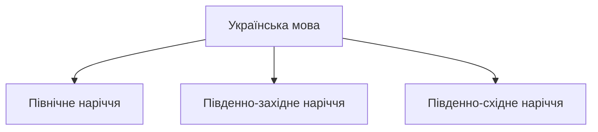
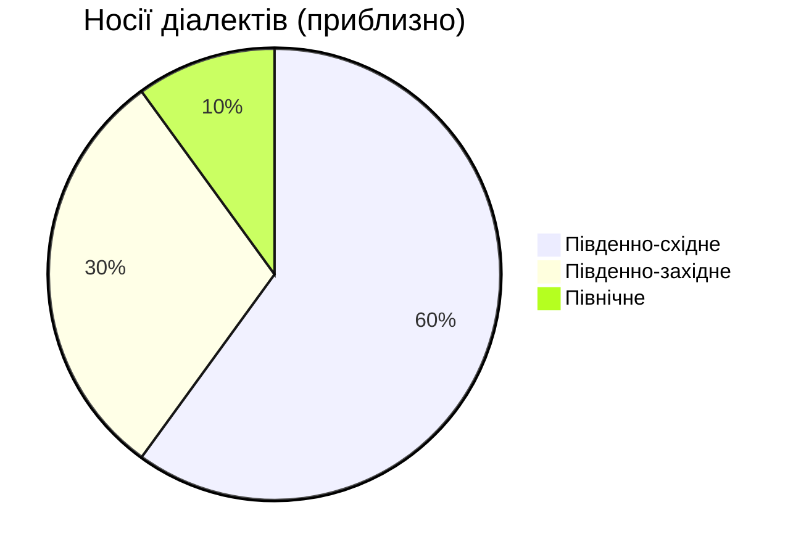
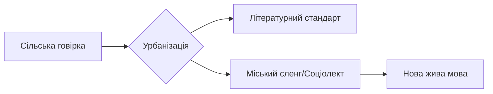

import Quiz from '@site/src/components/Quiz';
import MatchUp from '@site/src/components/MatchUp';
import FillIn from '@site/src/components/FillIn';
import TrueFalse from '@site/src/components/TrueFalse';
import Unjumble from '@site/src/components/Unjumble';
import GroupSort from '@site/src/components/GroupSort';
import Anagram from '@site/src/components/Anagram';
import ErrorCorrection, { ErrorCorrectionItem } from '@site/src/components/ErrorCorrection';
import Cloze from '@site/src/components/Cloze';
import Select from '@site/src/components/Select';
import Translate from '@site/src/components/Translate';
import MarkTheWords, { MarkTheWordsActivity } from '@site/src/components/MarkTheWords';
import HighlightMorphemes, { HighlightMorphemesActivity } from '@site/src/components/HighlightMorphemes';
import EssayResponse from '@site/src/components/EssayResponse';
import ComparativeStudy from '@site/src/components/ComparativeStudy';
import ReadingActivity from '@site/src/components/ReadingActivity';
import CriticalAnalysis from '@site/src/components/CriticalAnalysis';
import AuthorialIntent from '@site/src/components/AuthorialIntent';
import SourceEvaluation from '@site/src/components/SourceEvaluation';
import Debate from '@site/src/components/Debate';
import EtymologyTrace from '@site/src/components/EtymologyTrace';
import GrammarIdentify from '@site/src/components/GrammarIdentify';
import PaleographyAnalysis from '@site/src/components/PaleographyAnalysis';
import DialectComparison from '@site/src/components/DialectComparison';
import TranslationCritique from '@site/src/components/TranslationCritique';

Українська мова — це не моноліт. Як і будь-яка жива мова з великою територією поширення, вона має свої регіональні відтінки. Від густих лісів Полісся до гір Карпат і степів Таврії — українська мова звучить по-різному, але це **одна й та сама мова**.

:::tip[💡 Порада]
**Не бійтеся діалектів!**
Якщо у Львові ви почуєте "філіжанка кави", а в Полтаві — "чашка кави", це не помилка. Це багатство мови. Літературна норма (стандарт) об'єднує нас, а діалекти додають кольору.
:::

## Розминка

1.  Чи чули ви, як говорять люди в Карпатах?
2.  Чим відрізняється мова ваших родичів у селі від мови телебачення?
3.  Чому слово "суржик" має негативний відтінок?

## 1. Карта української мови

Лінгвісти ділять українські говори на три великі групи (наріччя):

### Північне наріччя (Полісся)

Це територія давніх лісів (Рівненщина, Житомирщина, Чернігівщина).

- **Особливість:** Збереження давніх форм. Тут можна почути дифтонги (подвійні звуки) на місці "О" та "Е".
- **Приклад:** *Вуіл* (віл), *куінь* (кінь).
- **Твердість:** "Р" часто вимовляється твердо: *буря* звучить як *бура*.

### Південно-західне наріччя (Захід)

Найбільш строкате. Гори (Карпати) сприяли ізоляції сіл, тому тут найбільше відмінностей.

- **Гуцули, Бойки, Лемки:** Кожна етнографічна група має свою говірку.
- **Лексика:** Багато запозичень з польської, німецької, угорської (через історію Австро-Угорщини).
- **Приклади:**
  - *Кобіта* (жінка)
  - *Дефиляда* (прогулянка/парад)
  - *Небіж* (племінник)

:::note[🏺 Культура]
**"Тіні забутих предків":**
Фільм Сергія Параджанова — це пам'ятник гуцульському діалекту. Актори вчилися розмовляти "по-гуцульськи", щоб передати магію Карпат. Якщо ви подивитеся його в оригіналі, вам, можливо, знадобляться субтитри навіть зі знанням української!
:::

### Південно-східне наріччя (Центр і Схід)

Це база літературної мови.

- **Наддніпрянщина (Полтава, Київ, Черкаси):** Саме ця говірка лягла в основу творів Шевченка та Котляревського. Вона найближча до того, що ви вчите в підручниках.
- **Слобожанщина (Харків) та Степ (Одеса, Херсон):** Тут говори пізнього заселення, вони більш однорідні, але мають вплив русифікації.

## Соціолінгвістичний аналіз

Суржик — це не діалект. Це **суміш**.

:::warning[❗ Важливо]
**Визначення:**
Спочатку "суржиком" називали суміш жита і пшениці (борошно низької якості). Сьогодні це мовлення, де українська граматика змішана з російськими словами.

- **Діалект:** Має історію століть, має свої правила. Це "чиста вода" з іншим смаком.
- **Суржик:** Виник через травму русифікації. Це "брудна вода".
:::

:::info[📝 Приклад]
**Анатомія Суржику:**

- *Суржик:* "Я *поняв*, шо нада *робить*". (Русизми: поняв, нада).
- *Літературна:* "Я *зрозумів*, що треба *робити*".
- *Суржик:* "Давай *поговорим*". (Російське закінчення).
- *Літературна:* "Давай *поговоримо*".
:::

Але не все так однозначно. Сучасна література (наприклад, п'єси Леся Подерв'янського) використовує суржик як художній прийом, щоб показати реальне життя "пострадянської" людини.

:::note[🏺 Культура]
**Вєрка Сердючка: Королева Суржику**
Андрій Данилко створив образ провідниці Вєрки Сердючки, яка говорить "полтавським суржиком". Вона стала народною героїнею, бо говорила мовою мільйонів. Це був сміх крізь сльози, який допоміг українцям прийняти своє реальне мовне становище і почати шлях до літературної норми.
:::

Сміятися з суржику можна, але говорити ним на іспиті — ні.

## 3. Історія мови: Від Русі до Імперії

Українська мова не виникла "раптом". Це прямий нащадок розмовної мови Київської Русі.

:::danger[🛡️ Руйнівник міфів]
**Міф:** "Російська, українська і білоруська вийшли з однієї колиски".
**Реальність:** Це радянський міф. Українська мова сформувалася окремо на базі південних говорів Русі. Вже в 11 столітті на графіті Софії Київської ми бачимо типові українські риси (закінчення -ові, кличний відмінок "Боже", літеру "і" замість "є"). Вона ближча до білоруської та польської, ніж до російської.
:::

### Лінгвоцид: Хроніки знищення

Протягом століть українську мову намагалися вбити понад 130 разів.

1.  **Валуєвський циркуляр (1863):**
    > "Ніякої окремої малоросійської мови не було, немає і бути не може".
    > *(Ця фраза стала символом імперської політики).*
    > Заборона друкувати релігійні та навчальні книги.
2.  **Емський указ (1876):** Заборона ввезення книг з-за кордону, заборона театру та навіть нот з українськими текстами.
3.  **Русифікація шкіл (ХХ ст.):** У СРСР вчителям російської платили вищу зарплату (+15%), ніж вчителям української. Це був економічний тиск, щоб батьки віддавали дітей у російські класи.

Ця травма пояснює, чому сьогодні мовне питання таке гостре. Це питання виживання.

:::warning[❗ Важливо]
**Визначення:**
Спочатку "суржиком" називали суміш жита і пшениці (борошно низької якості). Сьогодні це мовлення, де українська граматика змішана з російськими словами.

- **Діалект:** Має історію століть, має свої правила. Це "чиста вода" з іншим смаком.
- **Суржик:** Виник через травму русифікації. Це "брудна вода".
:::

:::info[📝 Приклад]
**Анатомія Суржику:**

- *Суржик:* "Я *поняв*, шо нада *робить*". (Русизми: поняв, нада).
- *Літературна:* "Я *зрозумів*, що треба *робити*".
- *Суржик:* "Давай *поговорим*". (Російське закінчення).
- *Літературна:* "Давай *поговоримо*".
:::

Але не все так однозначно. Сучасна література (наприклад, п'єси Леся Подерв'янського) використовує суржик як художній прийом, щоб показати реальне життя "пострадянської" людини. Вєрка Сердючка зробила суржик своїм брендом. Сміятися з суржику можна, але говорити ним на іспиті — ні.

## 3. Боротьба за Стандарт

Як говірка стає Мовою? Через **стандартизацію**.

### "Скрипниківка" (1928)

У 20-х роках, під час українізації, у Харкові зібралися провідні мовознавці. Вони ухвалили **Харківський правопис** (так звану "скрипниківку"). Цей правопис був максимально українським і враховував особливості як Сходу, так і Заходу.

- Писали *лямпа*, *етер*, *Атени* (Афіни), *проєкт*.
- Вживання літери **Ґ**.

### Радянський терор (1933)

Сталін зрозумів, що окрема мова веде до окремої нації. У 1930-х правопис 1928 року заборонили, назвавши його "націоналістичним". Мовознавців розстріляли (Розстріляне відродження). Новий правопис 1933 року був штучно наближений до російського.

- Літеру **Ґ** викинули з абетки.
- *Етер* став *ефір* (як у російській).
- *Лямпа* стала *лампа*.

:::note[Dialogue]
**Урок історії:**

— Вчителю, а чому літеру "Ґ" заборонили? Вона ж просто літера.

— Ні, Петре. Вона була символом. Коли влада хоче знищити націю, вона починає зі словників. Якщо ми говоримо як вони, значить ми і є вони. А "Ґ" кричала про те, що ми інші.

— То це була літера-дисидент?

— Можна й так сказати. Її репресували разом з людьми.

:::

:::info[🕰️ Історична довідка]
**Повернення репресованої літери:**
Літера **Ґ** повернулася в абетку лише в 1990 році, перед Незалежністю. Сьогодні правопис 2019 року частково повертає норми 1928 року (проєкт, етер, Атени), відновлюючи історичну справедливість.
:::

### Правопис 2019: Повернення до коренів

Нова редакція правопису — це не примха, а деколонізація мови. Ми повертаємо ті риси, які були штучно знищені радянською владою, щоб зробити українську мову схожою на російську.

1.  **Фемінітиви:** Тепер офіційно: *директорка, міністерка, фахівчиня*. Це повернення до норми української мови, де жіночий рід для професій був завжди (згадайте "кравчиню" чи "майстриню").
2.  **Йот кардинал:** *Проєкт, проєкція* (як *об'єкт, траєкторія*).
3.  **Варіативність:** Можна писати *аудиторія* і *авдиторія*, *пауза* і *павза*, *ефір* і *етер*. Мова в процесі зцілення, тому дозволено обидва варіанти.

:::note[🏺 Культура]
**Новий правопис в дії:**

- *Аудиторія* -> *Авдиторія* (повернення до латини).
- *Кафедра* -> *Катедра* (грецьке *th* -> *т*).
- *Міфологія* -> *Мітологія*.
  Ці форми не є обов'язковими, але вони стають маркером освіченості та свідомого вибору.
:::

:::tip[💡 Порада]
**Індики та Ирій:**
Правопис дозволив писати "и" на початку деяких слів: *ирій, икати*. Це не помилка, але поки що звучить незвичнно для багатьох.
:::

## 5. Діаспора: Від Канади до Бразилії

Історія діалектів триває за океаном. Українці, які виїхали за кордон 100 років тому, забрали мову з собою. Вона "законсервувалася".

### Канадська українська

Канадська українська — це унікальний феномен. Це суміш галицьких діалектів початку 20 століття та англійських слів.

- *Трок* (трак) — вантажівка.
- *Гарія* (ерія) — район.
- *Кар* (кар) — машина.
  Але при цьому вони кажуть *нанашко* (хрещений батько) і *ґазда*, слова, які в сучасному Києві вже забули.

### Українці у тропіках (Бразилія та Аргентина)

У штаті Парана (Бразилія) живе понад 500 тисяч нащадків українців. Їхня мова ще цікавіша, бо вона збереглася майже без впливу англійської чи російської. Вони говорять так, як говорили їхні прадіди в Галичині у 1891 році. Часто вони називають себе "наші люди", а мову — "наша мова".

:::info[🌍 Контекст]
**Прудентополіс — стовп українства:**
У бразильському місті Прудентополіс 75% населення має українське коріння. Там українська мова є другою офіційною! На вулицях можна почути галицьку говірку, а в церквах служать греко-католицькі літургії. Це живий музей мови.
:::

## 6. Трагедія говірок: Операція "Вісла"

Діалекти зникають не тільки через інтернет, а й через злочини.
У 1947 році комуністична влада Польщі та СРСР провела операцію "Вісла". Тисячі лемків та бойків були примусово виселені зі своїх гірських домівок і розкидані по степах Сходу України та Польщі.
Люди втратили не тільки дім, а й мовне середовище. Опинившись в оточенні інших говорів, вони були змушені адаптуватися. Тому сьогодні лемківський говір здебільшого зберігся лише в піснях (згадайте "Пливе кача по Тисині").

:::info[🕰️ Історична довідка]
**"Пливе кача":**
Ця лемківська народна пісня стала гімном прощання з героями Небесної Сотні. Вона нагадує нам про трагічну долю українців, які завжди мусили боротися за право бути собою на своїй землі.
:::

## 7. Мова і війна

Війна змінила ставлення до мови. Вона перестала бути просто засобом комунікації і стала засобом оборони.

### Шиболет: Тест на "свого"

Біблійний термін "шиболет" (пароль, який видає іноземця) став реальністю в Україні. Слова *паляниця, полуниця, білизнА* стали непереборним бар'єром для російських диверсантів. Їхній мовний апарат, звиклий до твердих звуків, не може відтворити м'яку українську фонетику. Це не жарт, а реальний спосіб перевірки на блокпостах у перші дні вторгнення.

### Лагідна українізація

Мільйони людей, які все життя говорили російською, добровільно перейшли на українську. Це не примус закону, а поклик сумління. "Я не хочу говорити мовою вбивць" — це найпоширеніший аргумент. Російська мова в Україні стала токсичною.

:::note[📖 Розповідь]
**Мовний бар'єр для окупантів:**
Існує безліч історій про те, як російські солдати плутали українські діалекти з іноземними мовами. В одному селі місцева бабуся так швидко говорила гуцульською говіркою, що окупанти вирішили, ніби тут базується "польський спецназ". Вони доповіли командуванню про "найманців НАТО". Діалект став природним шифруванням, яке не здатен зламати жоден алгоритм.
:::

## 8. Лексичне багатство

Чому важливо знати синоніми? Щоб не звучати як робот.

:::tip[💡 Порада]
**Львівський етикет:**
У Львові ви часто почуєте звертання "Прошу пані" або "Прошу пана". Це ввічлива форма, яка збереглася з часів Австро-Угорщини. Також тут кажуть "Дякую гарно" замість простого "Дякую". Знання цих дрібниць відкриває двері до серця львів'ян (і до найкращої кави у місті).
:::

<table>
  <thead>
    <tr>
      <th>Літературне (нейтральне)</th>
      <th>Діалектне / Розмовне</th>
      <th>Регіон</th>
    </tr>
  </thead>
  <tbody>
    <tr>
      <td>Картопля</td>
      <td>Бараболя, бульба, крумплі</td>
      <td>Поділля, Волинь, Закарпаття</td>
    </tr>
    <tr>
      <td>Велосипед</td>
      <td>Ровер, біціґлі</td>
      <td>Галичина, Закарпаття</td>
    </tr>
    <tr>
      <td>Пательня (сковорідка)</td>
      <td>Рондель, тиган</td>
      <td>Захід, Південь</td>
    </tr>
    <tr>
      <td>Ковдра</td>
      <td>Ліжник (вовняний)</td>
      <td>Карпати</td>
    </tr>
    <tr>
      <td>Дядько</td>
      <td>Вуйко</td>
      <td>Галичина</td>
    </tr>
  </tbody>
</table>

:::note[Dialogue]
**Бульба чи Картопля?**

— Бабусю, що сьогодні на обід?

— Та от, наварила бульби, посолила, дала кропу.

— Бабусю, у школі кажуть "картопля".

— То у школі! А в нас, у горах, споконвіку була бульба. Їж, поки гаряча!

*(Діалект — це мова дому і любові).*
:::

:::info[🌍 Контекст]
**Галицька "Ґвара":**
У Львові існує свій міський сленг — "ґвара". Це суміш української, польської та ідиш.

- "Ходи на каву!" — це святий ритуал.
- "Маєш рацію" — прийшло з польської і стало літературною нормою, витіснивши кальку "ти правий".
:::

## Приклади вживання діалектизмів

1.  *Файно* (добре): "Як твої справи?" — "Файно!"
2.  *Кобіта* (жінка): "Та кобіта знає все на світі."
3.  *Коліжанка* (подруга): "Ми з коліжанкою йдемо на каву."
4.  *Філіжанка* (чашка): "Замов мені філіжанку еспресо."
5.  *Здибанка* (зустріч): "Маємо сьогодні родинну здибанку."
6.  *Обійстя* (двір): "У них гарне, доглянуте обійстя."
7.  *Плай* (стежка в горах): "Ми йшли крутим плаєм."
8.  *Ватра* (вогнище): "Ввечері запалимо ватру і будемо співати."
9.  *Бульба* (картопля): "Бульба вже зварилася?"
10. *Спузар* (вівчар, який підтримує ватру): "Спузар всю ніч не спав."

## 9. Майбутнє діалектів

Чи зникнуть діалекти в епоху інтернету? Лінгвісти кажуть: ні, вони трансформуються. Сільські говірки стають менш виразними, але з'являються нові міські соціолекти. Молодь з Харкова, Одеси та Києва творить нову живу українську мову, яка вбирає в себе риси всіх регіонів. Це природний процес еволюції нації, яка нарешті здобула свій голос.

:::danger[🛡️ Руйнівник міфів]
**Міф: "Діалекти помирають"**
**Реальність:** Вони трансформуються. Сільські говірки стають менш виразними, але з'являються нові міські соціолекти. Молодь з Харкова, Одеси та Києва творить нову живу українську мову, яка вбирає в себе риси всіх регіонів. Це природний процес еволюції нації, яка нарешті здобула свій голос.
:::

## Первинні джерела

:::note[📜 Цитата]
**Іван Огієнко (Митрополит Іларіон):**
"Мова — це форма нашого життя, життя культури й національної свідомості, це форма національного організування. Поки живе мова — житиме й народ як національність."
*(Огієнко був одним з творців правопису та перекладачем Біблії).*
:::

:::note[📜 Цитата]
**Ліна Костенко:**
"Нації вмирають не від інфаркту. Спочатку їм відбирає мову."
*(Ці слова стали гаслом мовного спротиву).*
:::

## 6. Мова і війна

Війна 2022 року стала каталізатором змін. Мільйони українців, які раніше говорили російською, перейшли на українську. Це називають "лагідною українізацією" або "мовним фронтом".

- **Маркер "свій-чужий":** Слово *паляниця* стало шиболетом (мовним паролем), який не можуть вимовити російські окупанти через відмінності у фонетиці (м'яке "ц" і "и").
- **Відмова від контенту:** Українці масово відмовилися від російської музики та блогерів. YouTube українізувався швидше, ніж будь-яка державна програма.
- **Діалекти на фронті:** Військові часто використовують діалектизми для шифрування переговорів. Гуцульська говірка для непідготовленого ворога звучить як іноземна мова.

:::note[📜 Цитата]
**Павло Вишебаба (військовий, поет):**
"Мова — це кордон, який проходить через серце кожного з нас. Коли ми переходимо на українську, ми будуємо стіну, яку ворог не перейде."
:::

## 📋 Підсумок

Мова — це живий організм.

1.  **Діалекти** живлять мову, це її коріння. Не соромтеся бабусиних слів.
2.  **Суржик** — це хвороба росту, яку треба лікувати освітою, а не агресією.
3.  **Стандарт** потрібен для держави, але вдома говоріть так, як вам тепло.

## Потрібно більше практики?

- [ ] **Відео:** Знайдіть на YouTube відео "Гуцульська говірка". Спробуйте зрозуміти хоча б 50%.
- [ ] **Кіно:** Подивіться "Думки мої тихі". Там чудово показано закарпатський колорит і суржик.
- [ ] **Читання:** Прочитайте будь-яке оповідання Василя Стефаника. Це шедеври, написані покутським діалектом (і це буде виклик для вашого C1!).

## 🎯 Вправи

### Діалектні групи

<GroupSort groups={JSON.parse(`{"Північне наріччя (Полісся)": ["Східнополіський", "Середньополіський", "Західнополіський", "Волинський (частково)"], "Південно-західне наріччя": ["Гуцульський", "Лемківський", "Бойківський", "Закарпатський", "Подільський", "Галицький"], "Південно-східне наріччя": ["Степовий", "Слобожанський", "Середньонаддніпрянський", "Полтавський"]}`)} />

### Діалектизми

<MatchUp pairs={JSON.parse(`[{"left": "Файно (гал.)", "right": "Добре / гарно"}, {"left": "Вуйко (гуц.)", "right": "Дядько"}, {"left": "Легінь (карп.)", "right": "Парубок / хлопець"}, {"left": "Кобіта (гал.)", "right": "Жінка"}, {"left": "Бараболя (под.)", "right": "Картопля"}, {"left": "Плай (карп.)", "right": "Гірська стежка"}, {"left": "Газда (зах.)", "right": "Господар"}, {"left": "Криївка (іст.)", "right": "Схованка в землі"}, {"left": "Ватра (карп.)", "right": "Вогнище"}, {"left": "Мешти (гал.)", "right": "Туфлі / взуття"}]`)} />

### Теорія діалектології

<Quiz questions={JSON.parse(`[{"question": "Яке саме конкретне наріччя історично лягло в основу сучасної української літературної мови та стало її базою?", "options": [{"text": "Південно-східне (середньонаддніпрянські говори)", "correct": true}, {"text": "Північне (поліські говори)", "correct": false}, {"text": "Південно-західне (галицькі говори)", "correct": false}, {"text": "Карпатське (гірські говори)", "correct": false}], "explanation": ""}, {"question": "Чим, на вашу думку, діалект принципово відрізняється від суржику з лінгвістичної точки зору?", "options": [{"text": "Діалект — це природна система, а суржик — хаотичне змішування.", "correct": true}, {"text": "Суржик є літературною нормою, а діалект — ні.", "correct": false}, {"text": "Діалект використовують лише в містах, а суржик — у селах.", "correct": false}, {"text": "Різниці немає, це синоніми.", "correct": false}], "explanation": ""}, {"question": "Як ви розумієте поняття \\"русизм\\" (або російська калька) у контексті сучасного українського мовлення?", "options": [{"text": "Слово або конструкція, запозичена з російської мови.", "correct": true}, {"text": "Слово, що походить з часів Київської Русі.", "correct": false}, {"text": "Назва мешканця Русі.", "correct": false}, {"text": "Любов до російської літератури.", "correct": false}], "explanation": ""}, {"question": "Яку характерну фонетичну особливість мають північні (поліські) говори української мови, що відрізняє їх від інших?", "options": [{"text": "Дифтонги замість \\"о\\", \\"е\\" (кінь -> куінь).", "correct": true}, {"text": "Тверда вимова всіх приголосних.", "correct": false}, {"text": "Відсутність відмінків.", "correct": false}, {"text": "Наголос завжди на останньому складі.", "correct": false}], "explanation": ""}, {"question": "Хто саме зібрав та упорядкував велетенський словник української мови, включно з численними діалектизмами?", "options": [{"text": "Борис Грінченко", "correct": true}, {"text": "Тарас Шевченко", "correct": false}, {"text": "Леся Українка", "correct": false}, {"text": "Іван Франко", "correct": false}], "explanation": ""}, {"question": "Яка саме ключова особливість південно-східного наріччя сприяла його остаточному вибору як міцної основи для літературної мови?", "options": [{"text": "Відносна однорідність та поширеність на значній території України", "correct": true}, {"text": "Наявність великої кількості іноземних запозичень", "correct": false}, {"text": "Архаїчність граматичних форм", "correct": false}, {"text": "Виключно міське походження носіїв", "correct": false}], "explanation": ""}, {"question": "Який саме історичний регіон України найбільше зберіг унікальні архаїчні риси мови завдяки своїй природній географічній ізоляції (гори, ліси)?", "options": [{"text": "Карпати (Гуцульщина, Бойківщина, Лемківщина)", "correct": true}, {"text": "Донбас (промисловий регіон)", "correct": false}, {"text": "Причорномор'я (степова зона)", "correct": false}, {"text": "Київщина (столичний регіон)", "correct": false}], "explanation": ""}, {"question": "Що саме означає специфічний лінгвістичний термін \\"ідіолект\\" на відміну від загального поняття \\"діалекту\\"?", "options": [{"text": "Індивідуальна особливість мовлення конкретної людини", "correct": true}, {"text": "Мова певної професійної групи", "correct": false}, {"text": "Мова соціальних мереж", "correct": false}, {"text": "Таємна мова злочинців", "correct": false}], "explanation": ""}, {"question": "Як називається явище, коли людина вільно володіє літературною мовою та діалектом і перемикається між ними?", "options": [{"text": "Диглосія (або білінгвізм у широкому сенсі)", "correct": true}, {"text": "Афазія", "correct": false}, {"text": "Дислексія", "correct": false}, {"text": "Асиміляція", "correct": false}], "explanation": ""}, {"question": "Який саме історичний вплив мала свого часу Австро-Угорська імперія на формування унікальної лексики західноукраїнських говорів?", "options": [{"text": "Значна кількість запозичень німецького та польського походження (германізми, полонізми)", "correct": true}, {"text": "Повна русифікація регіону", "correct": false}, {"text": "Впровадження англійської мови як офіційної", "correct": false}, {"text": "Заборона використовувати будь-які слова іншомовного походження", "correct": false}], "explanation": ""}, {"question": "Яку насправді важливу роль відіграють діалектизми у художній літературі (наприклад, у вічних творах М. Коцюбинського чи В. Стефаника)?", "options": [{"text": "Створення колориту, реалістичність персонажів та передача атмосфери", "correct": true}, {"text": "Ускладнення тексту, щоб ніхто не зрозумів", "correct": false}, {"text": "Демонстрація неграмотності автора", "correct": false}, {"text": "Виключно гумористична функція", "correct": false}], "explanation": ""}, {"question": "Чому саме діалекти справедливо вважаються незамінним \\"живим джерелом\\" для збагачення та розвитку сучасної літературної мови?", "options": [{"text": "Вони збагачують словниковий запас та зберігають давні корені слів", "correct": true}, {"text": "Вони спрощують граматику до мінімуму", "correct": false}, {"text": "Вони дозволяють ігнорувати правила правопису", "correct": false}, {"text": "Вони є єдиною формою існування мови", "correct": false}], "explanation": ""}]`)} />

### Літературна норма

<FillIn items={JSON.parse(`[{"sentence": "Будь ласка, ___ двері за собою, тут холодно.", "answer": "зачиніть", "options": ["зачиніть", "закрий", "закрийте", "захлопни"]}, {"sentence": "Ми пішли в магазин, щоб ___ хліба і молока.", "answer": "купити", "options": ["купити", "купляти", "скупитися", "взяти"]}, {"sentence": "Я не можу ___ у цій ситуації, це занадто складно.", "answer": "розібратися", "options": ["розібратися", "поняти", "второпати", "пойняти"]}, {"sentence": "Він ___ на автобусній зупинці вже пів години.", "answer": "чекає", "options": ["чекає", "жде", "очікує", "ждуть"]}, {"sentence": "Нам треба ___ цей документ до завтрашнього ранку.", "answer": "підготувати", "options": ["підготувати", "подготовити", "зробити", "написати"]}, {"sentence": "Вибачте, я не ___ , що ви сказали.", "answer": "зрозумів", "options": ["зрозумів", "поняв", "пойняв", "догнав"]}, {"sentence": "Треба уважно ___ інструкцію перед використанням приладу.", "answer": "прочитати", "options": ["прочитати", "прочbтати", "глянути", "вивчити"]}, {"sentence": "Він не зміг ___ правильну відповідь на іспиті.", "answer": "згадати", "options": ["згадати", "вспомнити", "пригадати", "найти"]}, {"sentence": "Ми вирішили ___ цю проблему спільними зусиллями.", "answer": "вирішити", "options": ["вирішити", "порішати", "розв'язати", "усунути"]}, {"sentence": "Вона завжди намагається ___ гарне враження на людей.", "answer": "справити", "options": ["справити", "зробити", "получити", "мати"]}]`)} />

### Діалекти в літературі

<MarkTheWords>
  <MarkTheWordsActivity instruction="Позначте діалектні слова у тексті (Коцюбинський, &quot;Тіні забутих предків&quot;)." text="Іван грав у флояру, а Марічка співала співанок. Вівці паслися на полонині, а ватра палала біля колиби. Гуцули спускалися в долину." correctWords={JSON.parse(`["флояру", "співанок", "полонині", "ватра", "колиби"]`)} />
</MarkTheWords>

### Регіони та страви

<MatchUp pairs={JSON.parse(`[{"left": "Карпати", "right": "Банош з бринзою"}, {"left": "Полтавщина", "right": "Галушки"}, {"left": "Крим", "right": "Чебуреки / Лагман"}, {"left": "Київ", "right": "Котлета по-київськи"}, {"left": "Одеса", "right": "Форшмак"}, {"left": "Закарпаття", "right": "Бограч"}, {"left": "Львів", "right": "Кава та пляцки"}, {"left": "Слобожанщина", "right": "Окрошка (локальні версії)"}]`)} />

### Феномен Суржику

<Quiz questions={JSON.parse(`[{"question": "Що є головною історичною та соціальною причиною масового виникнення суржику в Україні?", "options": [{"text": "Тривале панування російської імперії та русифікація міст.", "correct": true}, {"text": "Бажання українців вивчити нову іноземну мову.", "correct": false}, {"text": "Вплив англійської мови через інтернет.", "correct": false}, {"text": "Відсутність шкіл у селах.", "correct": false}], "explanation": ""}, {"question": "Чи можна вважати суржик окремою, самостійною мовою з власними правилами та граматикою?", "options": [{"text": "Ні, це соціолект або змішана мова без сталих правил.", "correct": true}, {"text": "Так, це офіційна третя мова України.", "correct": false}, {"text": "Так, це діалект, яким писав Шевченко.", "correct": false}, {"text": "Ні, це просто погана російська мова.", "correct": false}], "explanation": ""}, {"question": "Як саме здебільшого ставляться до явища суржику в сучасній українській масовій культурі (зокрема, в кіно, літературі та театрі)?", "options": [{"text": "Використовують як художній засіб для комічного ефекту або реалізму.", "correct": true}, {"text": "Суворо забороняють і штрафують за вживання.", "correct": false}, {"text": "Вважають високим стилем поезії.", "correct": false}, {"text": "Ігнорують його існування.", "correct": false}], "explanation": ""}, {"question": "Хто з відомих сценічних персонажів є безумовною \\"іконою\\" та популяризатором суржику в Україні?", "options": [{"text": "Вєрка Сердючка (Андрій Данилко)", "correct": true}, {"text": "Леся Українка", "correct": false}, {"text": "Святослав Вакарчук", "correct": false}, {"text": "Богдан Хмельницький", "correct": false}], "explanation": ""}, {"question": "Яка принципова лексична різниця існує між \\"питомим словом\\" і \\"запозиченням\\" в українській мові?", "options": [{"text": "Питоме виникло у мові природно, запозичене — прийшло з іншої.", "correct": true}, {"text": "Питоме слово завжди коротке, а запозичене — довге.", "correct": false}, {"text": "Питомі слова можна писати з великої літери.", "correct": false}, {"text": "Різниці немає.", "correct": false}], "explanation": ""}, {"question": "Чому саме суржик часто називають \\"небезпечним\\" явищем для ефективного вивчення правильної літературної мови?", "options": [{"text": "Він створює ілюзію знання мови, але засмічує її помилками", "correct": true}, {"text": "Він занадто складний для вивчення", "correct": false}, {"text": "Він вимагає знання латини", "correct": false}, {"text": "Він заборонений законом під загрозою арешту", "correct": false}], "explanation": ""}, {"question": "Який саме спеціальний термін використовують професійні мовознавці для позначення ідеальної, \\"чистої\\" мови без будь-яких сторонніх домішок?", "options": [{"text": "Літературна норма (стандарт)", "correct": true}, {"text": "Суржик", "correct": false}, {"text": "Арго", "correct": false}, {"text": "Жаргон", "correct": false}], "explanation": ""}, {"question": "Чи є використання окремих діалектизмів ознакою суржику, чи це принципово різні лінгвістичні явища?", "options": [{"text": "Ні, діалектизми — це частина мови, а суржик — це хаотична мішанка з іншою мовою", "correct": true}, {"text": "Так, це одне й те саме", "correct": false}, {"text": "Тільки якщо це галицькі слова", "correct": false}, {"text": "Так, будь-яке слово, якого немає в словнику, є суржиком", "correct": false}], "explanation": ""}, {"question": "Як саме, на думку експертів, найкраще та найефективніше позбутися небажаного суржику у власному щоденному мовленні?", "options": [{"text": "Більше читати, слухати якісний контент та свідомо контролювати мовлення", "correct": true}, {"text": "Перестати говорити взагалі", "correct": false}, {"text": "Говорити тільки російською", "correct": false}, {"text": "Вивчити напам'ять весь словник за одну ніч", "correct": false}], "explanation": ""}, {"question": "Що саме символічно означає відома метафора \\"бур'ян на ниві мови\\" стосовно поширеного явища суржику?", "options": [{"text": "Суржик заважає \\"культурним рослинам\\" (літературній мові) рости і розвиватися", "correct": true}, {"text": "Суржик є корисною рослиною", "correct": false}, {"text": "Суржик треба поливати і доглядати", "correct": false}, {"text": "Суржик є рідкісним видом квітів", "correct": false}], "explanation": ""}, {"question": "Чи може суржик теоретично з часом перетворитися на окрему, повноцінну нову мову (так звану креольську мову)?", "options": [{"text": "Теоретично так, але за умови повної ізоляції та стабілізації, що в Україні малоймовірно", "correct": true}, {"text": "Так, це станеться вже завтра", "correct": false}, {"text": "Ні, це принципово неможливо для жодної мови", "correct": false}, {"text": "Це вже сталося, суржик є офіційною мовою ООН", "correct": false}], "explanation": ""}, {"question": "Яку саме специфічну соціальну функцію найчастіше виконує суржик у популярних гумористичних шоу та комедіях?", "options": [{"text": "Маркування персонажа як \\"простакуватого\\", неосвіченого або \\"свого хлопця\\"", "correct": true}, {"text": "Показ високого інтелекту героя", "correct": false}, {"text": "Демонстрація аристократичного походження", "correct": false}, {"text": "Підкреслення іноземного походження героя", "correct": false}], "explanation": ""}]`)} />

### Мовні помилки

<MatchUp pairs={JSON.parse(`[{"left": "Приймати участь", "right": "Брати участь"}, {"left": "Самий кращий", "right": "Найкращий"}, {"left": "На протязі дня", "right": "Протягом дня"}, {"left": "Відкрити двері", "right": "Відчинити двері"}, {"left": "Закрити очі", "right": "Заплющити очі"}, {"left": "Вірне рішення", "right": "Правильне рішення"}, {"left": "Підняти питання", "right": "Порушити питання"}, {"left": "В любий день", "right": "У будь-який день"}]`)} />

### Регіональний колорит

<FillIn items={JSON.parse(`[{"sentence": "У Карпатах ми розпалили велику ___ біля річки.", "answer": "ватру", "options": ["ватру", "піч", "лампу", "свічку"]}, {"sentence": "Мій дідусь був справжнім ___ , у нього було велике господарство.", "answer": "ґаздою", "options": ["ґаздою", "паном", "кріпаком", "ледарем"]}, {"sentence": "На Андріївському узвозі продають чудові вишиванки та ___ .", "answer": "прикраси", "options": ["прикраси", "зброю", "машини", "ліки"]}, {"sentence": "На весіллі всім гостям роздавали смачні святкові ___ .", "answer": "пляцки", "options": ["пляцки", "книжки", "цегли", "дрова"]}, {"sentence": "У цьому ресторані готують найсмачніший угорський ___ на вогні.", "answer": "бограч", "options": ["бограч", "чай", "компот", "квас"]}, {"sentence": "Бабуся дістала з печі гарячі полтавські ___ .", "answer": "галушки", "options": ["галушки", "камені", "цвяхи", "монети"]}, {"sentence": "Ми купили на базарі свіжу ___ для салату.", "answer": "городину", "options": ["городину", "залізо", "глину", "пісок"]}, {"sentence": "Львівська ___ пахне корицею і шоколадом.", "answer": "кава", "options": ["кава", "вода", "сіль", "річка"]}, {"sentence": "У центрі села стояла стара дерев'яна ___ .", "answer": "церква", "options": ["церква", "ракета", "фабрика", "метро"]}, {"sentence": "Гуцульський ___ заграв на трембіті сумну мелодію.", "answer": "вівчар", "options": ["вівчар", "лікар", "шахтар", "пілот"]}]`)} />

### Лінгвістичні факти

<Unjumble items={JSON.parse(`[{"jumbled": "Українська / мова / належить / до / слов'янської / групи / індоєвропейської / мовної / сім'ї / разом / з / польською", "answer": "Українська мова належить до слов'янської групи індоєвропейської мовної сім'ї разом з польською"}, {"jumbled": "Діалекти / є / живим / джерелом / збагачення / літературної / мови / та / збереження / національної / ідентичності / народу", "answer": "Діалекти є живим джерелом збагачення літературної мови та збереження національної ідентичності народу"}, {"jumbled": "Іван / Котляревський / першим / використав / живу / народну / мову / у / своїй / знаменитій / поемі / Енеїда", "answer": "Іван Котляревський першим використав живу народну мову у своїй знаменитій поемі Енеїда"}, {"jumbled": "Суржик / виникає / внаслідок / недостатнього / володіння / нормами / літературної / мови / та / впливу / російської", "answer": "Суржик виникає внаслідок недостатнього володіння нормами літературної мови та впливу російської"}, {"jumbled": "Багато / слів / з / галицького / діалекту / увійшли / до / стандарту / завдяки / діяльності / Івана / Франка", "answer": "Багато слів з галицького діалекту увійшли до стандарту завдяки діяльності Івана Франка"}, {"jumbled": "Канадська / українська / мова / зберегла / унікальні / архаїчні / риси / які / вже / зникли / в / Україні", "answer": "Канадська українська мова зберегла унікальні архаїчні риси які вже зникли в Україні"}, {"jumbled": "Операція / Вісла / стала / трагедією / для / носіїв / лемківського / говору / яких / примусово / виселили / з / дому", "answer": "Операція Вісла стала трагедією для носіїв лемківського говору яких примусово виселили з дому"}, {"jumbled": "Сучасна / українська / молодь / творить / новий / міський / сленг / на / основі / глобальних / та / національних / трендів", "answer": "Сучасна українська молодь творить новий міський сленг на основі глобальних та національних трендів"}]`)} />

### Есе: Мова чи Суржик?

<EssayResponse title="Есе: Мова чи Суржик?" prompt={"Напишіть есе на тему \"Суржик: сміття чи унікальний феномен?\". Аргументуйте свою позицію."} modelAnswer={"Суржик — це складне явище. З погляду норми, це порушення, \"мовне сміття\", що свідчить про низьку культуру мовлення. Проте, як соціокультурний феномен, він відображає історію колонізації. Водночас у літературі (наприклад, у \"Кайдашевій сім'ї\" чи у Подерв'янського) суржик слугує потужним засобом характеристики персонажів. Боротися з ним треба не заборонами, а якісною освітою та популяризацією літературної української мови."} rubric={"\n\n#### Критерії оцінювання\n\n| Критерій | Опис | Бали |\n|---|---|---|\n| Argumentation | Arguments for/against | 5 |\n| Structure | Clear flow | 5 |"} isUkrainian={true} />

### Норма та Діалект

<ComparativeStudy title="Норма та Діалект" content={""} task={""} modelAnswer={"Літературна мова — це кодифікований стандарт для держави, освіти, науки та ЗМІ. Вона має чіткі правила (правопис, словники). Діалект — це жива розмовна форма, прив'язана до регіону. Він не має фіксованих правил і передається усно. Літературна мова об'єднує націю, а діалекти зберігають її коріння та унікальність."} itemsToCompare={JSON.parse(`["Літературна мова", "Діалект (говірка)"]`)} criteria={JSON.parse(`["Сфера вживання", "Унормованість", "Престиж"]`)} prompt={"У чому різниця між офіційною мовою та домашньою говіркою?"} isUkrainian={true} />