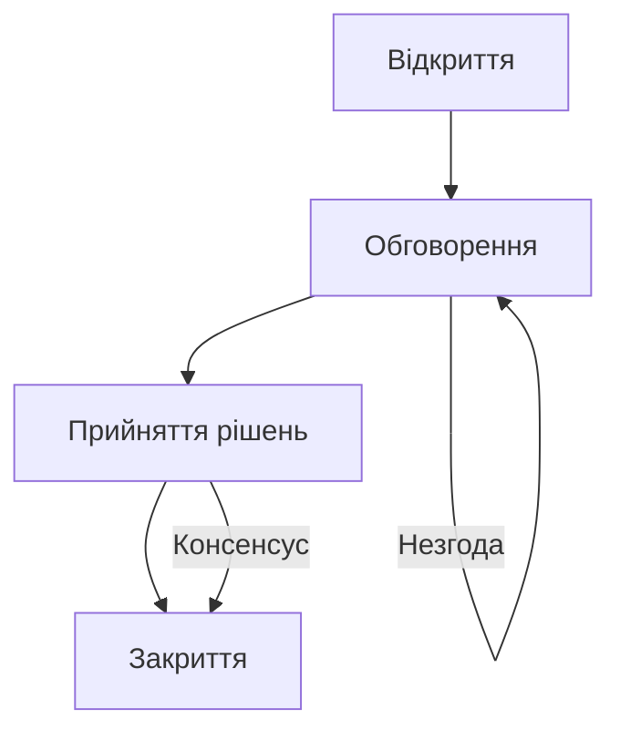

import Quiz from '@site/src/components/Quiz';
import MatchUp from '@site/src/components/MatchUp';
import FillIn from '@site/src/components/FillIn';
import TrueFalse from '@site/src/components/TrueFalse';
import Unjumble from '@site/src/components/Unjumble';
import GroupSort from '@site/src/components/GroupSort';
import Anagram from '@site/src/components/Anagram';
import ErrorCorrection, { ErrorCorrectionItem } from '@site/src/components/ErrorCorrection';
import Cloze from '@site/src/components/Cloze';
import Select from '@site/src/components/Select';
import Translate from '@site/src/components/Translate';
import MarkTheWords, { MarkTheWordsActivity } from '@site/src/components/MarkTheWords';
import HighlightMorphemes, { HighlightMorphemesActivity } from '@site/src/components/HighlightMorphemes';
import EssayResponse from '@site/src/components/EssayResponse';
import ComparativeStudy from '@site/src/components/ComparativeStudy';
import ReadingActivity from '@site/src/components/ReadingActivity';
import CriticalAnalysis from '@site/src/components/CriticalAnalysis';
import AuthorialIntent from '@site/src/components/AuthorialIntent';

> 🎯 **Чому це важливо?**
>
> У сучасному світі володіння українською мовою на професійному рівні відкриває двері до кар'єрного зростання. Ви повинні вміти не лише грамотно спілкуватися, але й дотримуватися правил ділового етикету, вести переговори та складати офіційні документи. Цей модуль — це ваша практика реальних ситуацій: від подання резюме до важливих ділових зустрічей. Ви навчитеся впевнено почуватися в будь-якому професійному контексті.

## Вступ

Ласкаво просимо до модуля, присвяченого професійному спілкуванню. У цьому модулі ми розглянемо ключові аспекти ділової взаємодії: від пошуку роботи до ведення переговорів. Ми навчимося створювати переконливе резюме, писати ефективні супровідні листи, впевнено почуватися на співбесіді та вести ділове листування українською мовою на рівні C1.

## Сценарій 1: Пошук роботи та подання заявки

**Контекст:**
Ви — кваліфікований спеціаліст, який шукає нові можливості. Ви знайшли ідеальну вакансію "Керівник проєктів" в провідній українській IT-компанії. Ваше завдання — підготувати бездоганне резюме та супровідний лист, які виділять вас серед сотень інших кандидатів.

### Резюме

Резюме — це ваша візитна картка. В Україні, як і в Європі, воно повинно бути лаконічним (максимум 2 сторінки), чітким і структурованим.

**Ключові елементи резюме:**

1.  **Контактна інформація:** Ім'я, телефон, email, посилання на LinkedIn/GitHub/Portfolio.
2.  **Профіль:** Короткий опис ваших навичок і кар'єрних цілей (3-4 речення). Це перше, що читає рекрутер.
    - _Приклад:_ "Досвідчений IT-менеджер з 7-річним стажем управління міжнародними командами. Спеціалізуюся на методології Agile та оптимізації бізнес-процесів. Шукаю можливості для реалізації масштабних проєктів у сфері фінтех."
3.  **Досвід роботи:** У зворотному хронологічному порядку. Дуже важливо використовувати дієслова доконаного виду, щоб підкреслити результати: _розробив, впровадив, збільшив, керував, оптимізував_.
    - _Правильно:_ "Збільшив продажі на 20%."
    - _Менш ефективно:_ "Займався збільшенням продажів."
4.  **Освіта:** Назва закладу, спеціальність, роки навчання, ступінь.
5.  **Навички:** Hard skills (технічні інструменти, мови програмування) та Soft skills (комунікація, лідерство, вирішення конфліктів).
6.  **Мови:** Рівень володіння (від А1 до С2).

> 💡 **Лінгвістичне спостереження**
>
> В українських резюме уникайте пасивних конструкцій ("було зроблено"). Натомість використовуйте активні дієслова, що демонструють ваші досягнення: _організував конференцію_ (замість _конференція була організована мною_), _підвищив ефективність_ (замість _ефективність була підвищена_). Це додає динаміки та показує вас як ініціативного працівника.

### Супровідний лист

Супровідний лист — це ваш шанс показати мотивацію та "хімію" з компанією. Він не повинен просто дублювати резюме.

**Структура успішного листа:**

- **Вступ:** Звернення (Шановний пане/пані...), яку позицію ви розглядаєте і звідки про неї дізналися.
- **Основна частина:** Чому ви ідеальний кандидат? Наведіть 1-2 конкретні приклади ваших успіхів, які є найбільш релевантними для цієї вакансії. Покажіть, що ви знаєте про компанію (її цінності, останні новини).
- **Закінчення:** Заклик до дії (готовність до співбесіди) та професійний підпис (З повагою...).

_Корисні фрази:_

- "Я переконаний, що мій досвід в управлінні проєктами дозволить вашій команді досягти нових висот."
- "Мене надихає місія вашої компанії щодо сталого розвитку."
- "Буду радий обговорити, як мої навички можуть бути корисними для вашого бізнесу."

## Сценарій 2: Співбесіда

**Контекст:**
Ваше резюме вразило роботодавця, і вас запросили на співбесіду з HR-менеджером та технічним директором. Це вирішальний етап, де перевіряють не лише ваші знання, а й "cultural fit" (культурну відповідність).

### Типові запитання та стратегії відповідей

**1. "Розкажіть про себе."**
Це класичне питання для початку розмови (ice-breaker). Не переказуйте біографію від народження. Використовуйте формулу "Минуле - Теперішнє - Майбутнє".

- _Погана відповідь:_ "Ну, я народився в Києві, потім вчився в школі, потім..."
- _Гарна відповідь:_ "Я маю 5 років досвіду в цифровому маркетингу. Зараз я очолюю відділ SMM у великому рітейлері, де ми успішно запустили три національні кампанії. Я шукаю нові виклики і хочу розвиватися у сфері B2B, тому ваша вакансія мене дуже зацікавила."

**2. "Чому ви хочете працювати саме у нас?"**
Покажіть, що ви зробили "домашнє завдання".

- "Я давно слідкую за вашою компанією. Мене вразила ваша остання інновація в сфері штучного інтелекту, і я хотів би бути частиною команди, яка створює такі продукти."

**3. "Ваші сильні та слабкі сторони?"**
Будьте чесними, але стратегічними. Слабкість має бути подана як зона росту або челендж, над яким ви працюєте.

- "Іноді я можу бути занадто прискіпливим до деталей, що сповільнює роботу. Але я навчився делегувати частину задач і використовувати інструменти тайм-менеджменту, щоб дотримуватися дедлайнів."

**4. "Ким ви бачите себе через 5 років?"**
Роботодавець хоче зрозуміти ваші амбіції та лояльність.

- "Я планую розвиватися як експерт у своїй галузі і, можливо, очолити власний напрямок у межах компанії."

> ⚠️ **Складність для іноземців**
>
> Під час співбесіди важливо дотримуватися правильного регістру спілкування. Українська бізнес-культура стає більш демократичною, але повага до ієрархії залишається. Не переходьте на "ти" з інтерв'юером, якщо вам цього прямо не запропонували. Використовуйте звертання "Ви", "Пане/Пані" плюс ім'я. Уникайте надмірного сленгу, але й не говоріть як бюрократ — покажіть свою особистість і живі емоції.

## Сценарій 3: Ділова зустріч та переговори

**Контекст:**
Ви отримали роботу! Тепер ви берете участь у важливій стратегічній сесії щодо запуску нового продукту. У кімнаті присутні представники різних відділів: маркетинг, розробка, фінанси. Ваше завдання — обговорити бюджет та терміни, відстояти свою позицію, але зберегти конструктивні стосунки.

### Етапи ефективної зустрічі

1.  **Відкриття:** Привітання, озвучення **порядку денного**.
    - "Доброго дня, колеги. Дякую, що приєдналися. Сьогодні на порядку денному три ключові питання: бюджет, терміни та розподіл ресурсів."
    - "Мета нашої зустрічі — фіналізувати план запуску на Q3."
2.  **Обговорення:** Висловлення думок, аргументація, заперечення. Це найактивніша частина.
    - "Я погоджуюся з цією ідеєю, проте варто врахувати ризики інфляції."
    - "Дозвольте зауважити, що попередній досвід свідчить про необхідність додаткового часу на тестування."
    - "На мою думку, нам варто зосередитися на якості MVP, а не на кількості функцій."
3.  **Прийняття рішень:** Голосування або досягнення консенсусу. Важливо зафіксувати результат.
    - "Чи всі погоджуються з цим зміненим планом?"
    - "Давайте зафіксуємо це рішення: ми переносимо реліз на два тижні."
4.  **Закриття:** Підбиття підсумків, визначення відповідальних та наступних кроків, **протокол**.
    - "Отже, підсумуємо: відділ маркетингу готує нову стратегію до п'ятниці, а розробники фокусуються на бекенді."
    - "Наступна нарада відбудеться у наступний вівторок о 10:00."

:::note[Ринок праці України]
Найпопулярніші платформи для пошуку роботи в Україні — це **Work.ua**, **Robota.ua** та **Djinni**. Українські технологічні гіганти, такі як **Аякс**, **Греммерлі** або **МакПо** (MacPaw), мають дуже високі стандарти корпоративної культури, які нічим не поступаються західним компаніям. Тому володіння діловим етикетом є обов'язковим для успішної кар'єри.
:::

### Мистецтво дипломатичних переговорів

У переговорах важливо бути твердим щодо проблеми, але м'яким щодо людей. Використовуйте пом'якшувальні конструкції, щоб не звучати агресивно.

- Замість прямого "Це неможливо", скажіть: "Це може бути складно реалізувати в такі стислі терміни, тому пропоную компромісний варіант".
- Замість різкого "Ви помиляєтеся", скажіть: "Я бачу це трохи інакше, давайте розглянемо факти ще раз".
- Замість категоричного "Я не згоден", скажіть: "Я маю певні сумніви щодо ефективності такого підходу".

> 🔍 **Порівняння регістрів**
>
> **Розмовний:** "Слухай, Андрію, давай перенесемо дедлайн, ми взагалі не встигаємо, завал повний."
> **Офіційно-діловий:** "Шановний пане Андрію / Шановні колеги, з огляду на значне збільшення обсягу першочергових завдань та необхідність проведення додаткового тестування, пропоную розглянути можливість перенесення терміну здачі проєкту на наступний робочий тиждень. Це дозволить нам гарантувати високу якість фінального продукту і уникнути критичних помилок."

## Сценарій 4: Офіційне листування та документація

**Контекст:**
Після зустрічі вам потрібно зафіксувати домовленості. Ви маєте надіслати **звіт** керівництву, **запит** до партнерів на постачання та ввічливо відповісти на **скаргу** клієнта. Електронна пошта залишається основним каналом офіційної комунікації.

### Структура офіційного електронного листа

1.  **Тема:** Чітка, конкретна і інформативна. Ніколи не залишайте поле пустим.
    - _Приклади:_ "Звіт за жовтень: Маркетинг", "Запит на комерційну пропозицію: Постачання обладнання", "Важливо: Зміна графіку роботи".
2.  **Привітання:** Має відповідати рівню офіційності.
    - "Шановний Іване Петровичу," (найбільш офіційно).
    - "Шановні партнери," (до групи людей).
    - "Вельмишановний пане Посол," (дипломатичний протокол).
    - "Вітаю, Олено," (більш демократично, всередині команди).
3.  **Вступ:** Мета листа. Не змушуйте читача здогадуватися.
    - "Пишу Вам, щоб повідомити про завершення етапу тестування."
    - "Надсилаю звіт про фінансові показники за квартал."
    - "Звертаюся до Вас із проханням надати додаткову інформацію."
4.  **Тіло листа:** Деталі, факти, аргументи. Будьте лаконічними. Один абзац — одна думка. Використовуйте марковані списки для переліку, це полегшує читання.
5.  **Закінчення:** Ввічливе завершення і спонукання до дії.
    - "Чекаю на Вашу швидку відповідь."
    - "Заздалегідь вдячний за співпрацю."
    - "Сподіваюся на позитивне вирішення цього питання."
6.  **Підпис:**
    - "З повагою, [Ім'я Прізвище], [Посада], [Телефон]."

> 📚 **Літературний контекст**
>
> В українській класичній літературі часто карикатурно зображувалися чиновники та їхня специфічна мова ("канцелярит"). Наприклад, у сатиричних творах Івана Карпенка-Карого ("Хазяїн", "Сто тисяч") чи Панаса Мирного ("Хіба ревуть воли, як ясла повні?"). Ця мова висміювалася за сухість, заплутаність, штучність і складність. У сучасному діловому спілкуванні ми прагнемо ясності, прозорості та простоти, уникаючи зайвого бюрократизму на кшталт "на виконання розпорядження" або "з метою забезпечення належного функціонування", якщо це не юридичний документ. Сьогодні трендом є людяність у комунікації навіть у секторі B2B.

## Сценарій 5: Обговорення підвищення зарплати

**Контекст:**
Ви працюєте в компанії вже рік і показали чудові результати, перевиконавши KPI. Ви відчуваєте, що ваша ринкова вартість зросла, і заслуговуєте на фінансове заохочення. Ви ініціюєте делікатну розмову з безпосереднім керівником.

### Стратегія успішних переговорів про гроші

1.  **Підготовка:** Зберіть факти та цифри. Які саме ваші досягнення? Яка середня зарплата на ринку на аналогічних позиціях? Підготуйте "Portfolio of Success".
2.  **Призначення зустрічі:** Не починайте цю розмову спонтанно в коридорі чи на кухні. Напишіть офіційного листа із запитом на зустріч 1-на-1: "Я хотів би обговорити мої результати за рік та плани професійного розвитку".
3.  **Аргументація:** Починайте з цінності, яку ви приносите компанії.
    - "За останній рік я успішно закрив 15 проєктів, що на 20% більше за норму."
    - "Я взяв на себе додаткову відповідальність за менторство нових співробітників."
    - "Мій внесок у проєкт Х дозволив компанії заощадити 50 000 доларів."
4.  **Пропозиція:** Назвіть конкретну суму або відсоток. Не змушуйте шефа вгадувати.
    - "З огляду на мої результати та поточну ринкову ситуацію, я пропоную переглянути мою заробітну плату та підвищити її на 15-20%."
5.  **Робота з запереченнями:** Будьте готові до "Ні".
    - Керівник: "На жаль, зараз бюджет обмежений."
    - Ви: "Я розумію ситуацію в компанії. Скажіть, будь ласка, за яких умов і коли ми зможемо повернутися до цього питання? Можливо, ми можемо обговорити бонусну систему за результатами кварталу або перегляд соцпакету?"

> 💡 **Лінгвістичне спостереження**
>
> У розмовах про гроші українці можуть бути менш прямими, ніж американці, через певні культурні табу. Часто використовуються евфемізми: "фінансова мотивація", "умови праці", "винагорода", "компенсація". Слово "гроші" в офіційному контексті може звучати занадто прямолінійно або навіть грубо. Професійніше казати "заробітна плата", "оклад", "дохід", "фінансові умови".

## Сценарій 6: Нетворкінг та "Small Talk"

**Контекст:**
Ви перебуваєте на великій міжнародній бізнес-конференції у Києві. Оголошено перерву на каву. Ваша мета — не просто випити кави, а знайти корисні бізнес-контакти, представити себе та свою компанію потенційним партнерам.

### Елеватор пітч

Ви повинні вміти представити себе за 30 секунд (час поїздки в ліфті). Ваша самопрезентація має бути чіткою, цікавою і запам'ятовуватися.

- _Приклад:_ "Вітаю! Мене звати Олена, я — маркетолог у сфері EdTech. Я допомагаю освітнім стартапам виходити на європейські ринки та знаходити перших клієнтів. Нещодавно ми успішно запустили проєкт мовних курсів у Польщі та Німеччині. А чим займаєтеся ви?"

### Теми для Small Talk в Україні

Вдалі теми для безпечної розмови:

- **Сама подія:** "Як вам останній спікер? Чи почули ви щось нове для себе?", "Організація на високому рівні, чи не так?".
- **Робочі питання:** Тренди галузі, нові технології, виклики ринку.
- **Подорожі та дозвілля:** "Чи плануєте відпустку?", "Яке ваше улюблене місце в Карпатах?", "Ви вже були в новому театрі на Подолі?".
- **Волонтерство:** Сьогодні це тема, яка об'єднує всіх українців. "Чи бере ваша компанія участь у соціальних проєктах?".

Невдалі та ризиковані теми:

- **Особисті фінанси:** Питати "Скільки ви заробляєте?" вважається вкрай неввічливим.
- **Релігія:** Це особиста справа кожного.
- **Хвороби та здоров'я:** Не варто скаржитися на самопочуття малознайомим людям.
- **Гостра політика:** Хоча політика цікавить усіх, суперечки можуть зіпсувати перше враження, якщо ви не знаєте поглядів співрозмовника.

> 🌍 **Культурна значущість**
>
> В Україні нетворкінг (раніше відомий як "кумівство" в дещо негативному сенсі, але зараз це трансформується у поняття "спільнота" або "community") відіграє величезну роль. Люди схильні довіряти тим, кого знають особисто або через рекомендації спільних знайомих. Тому неформальне спілкування ("випити кави") після офіційної частини конференції часто є важливішим для укладання угод, ніж самі презентації. Побудова особистої довіри — це фундамент успішного українського бізнесу.

## Сценарій 7: Вирішення конфліктів у команді

**Контекст:**
У вашій команді виник конфлікт. Дизайнер затримує макети, а розробник через це не вкладається в дедлайн і відкрито звинувачує колегу в спільному чаті. Як керівник, ви повинні втрутитися і вирішити ситуацію конструктивно.

### Алгоритм медіації

1.  **Зупинити публічну сварку:** "Колеги, пропоную перенести це обговорення в особисті повідомлення або на окрему зустріч. Емоції тут не допоможуть."
2.  **Вислухати обидві сторони:** Проведіть окремі зустрічі (1-на-1). Дізнайтеся причини затримки. Можливо, у дизайнера не було чіткого ТЗ?
3.  **Знайти спільне рішення:** Організуйте спільний дзвінок. "Наша спільна мета — здати проєкт вчесно. Давайте подумаємо, як ми можемо пришвидшити процес зараз, замість того, щоб шукати винних."
4.  **Встановити нові правила:** "На майбутнє, давайте сигналізувати про затримки за 2 дні до дедлайну."

## Порівняльний аналіз: Діловий етикет Україна vs Захід

### Особливості бізнес-комунікації

| Аспект                     | Україна                                                                 | США/Велика Британія                                                                                  |
| :------------------------- | :---------------------------------------------------------------------- | :--------------------------------------------------------------------------------------------------- |
| **Звертання**              | Шановний пане + Ім'я та Прізвище (або по батькові у старшого покоління) | Dear + First Name (дуже поширено навіть при першому контакті)                                        |
| **Стиль спілкування**      | Більш формальний, структурований, особливо на початку                   | Більш розмовний, direct, casual, "small talk" є обов'язковим                                         |
| **Емоційність та критика** | Стримана, але критика може бути досить прямою ("Це погано зроблено")    | "Sandwich method" (позитив-критика-позитив). Критика часто завуальована ("It's interesting, but...") |
| **Час відповіді**          | Очікується відповідь протягом робочого дня. Ігнорування — моветон       | Повага до work-life balance (не чекають відповіді ввечері чи на вихідних)                            |

В Україні, на жаль, межі робочого часу часто розмиті, особливо в умовах війни та нестабільності. Отримати повідомлення в месенджер (Telegram, WhatsApp, Viber) по робочих питаннях о 20:00 — це для багатьох сфер стало нормою. Проте, як ознака високої культури та поваги до кордонів колеги, варто завжди запитувати: "Чи зручно Вам зараз говорити?" або "Вибачте, що турбую в неробочий час".

## Письмо: Відповідь на вакансію

**Завдання:**
Ви знайшли вакансію "Керівник відділу продажів". Напишіть розгорнутий супровідний лист (300-400 слів), у якому ви презентуєте свій досвід, навички, мотивацію та бачення розвитку відділу.

**Структура есе:**

1.  **Шапка:** Ваші контакти та контакти отримувача.
2.  **Звернення:** Персоналізоване.
3.  **Параграф 1:** Яку посаду ви хочете отримати і де ви про неї дізналися.
4.  **Параграф 2:** Чому ви? (Ваш досвід, конкретні досягнення в цифрах).
5.  **Параграф 3:** Чому ця компанія? (Ваше знання ринку, мотивація працювати саме тут).
6.  **Висновки та заклик до дії.**
7.  **Підпис.**

**Зразок відповіді (Model Answer):**

:::success[✅ Model Answer]

**Іван Петренко**
Київ, вул. Лісова, 5 | +380 50 123 4567 | ivan.petrenko@email.com

**Шановна пані Олено!**

Я звертаюся до Вас із великим професійним ентузіазмом щодо вакансії "Керівник відділу продажів", яку було опубліковано на офіційному сайті вашої компанії "ТехноСвіт". Маючи понад сьомирічний успішний досвід у сфері B2B продажів та стратегічного управління командами, я впевнений, що зможу зробити вагомий та вимірюваний внесок у подальший розвиток та масштабування Вашого бізнесу.

Протягом моєї кар'єри я успішно ініціював та реалізував низку стратегічних ініціатив, що принесли компаніям значний прибуток. Зокрема, на моїй попередній посаді в компанії "ГлобалТрейд" я збільшив обсяг річних продажів на 25% (з $1M до $1.25M) через оптимізацію воронки продажів, впровадження нової CRM-системи та перегляд скриптів роботи з клієнтами. Я маю підтверджений досвід формування ефективних команд з нуля, розробки систем мотивації персоналу та ведення складних переговорів із ключовими клієнтами на рівні топ-менеджменту.

Мене особливо приваблює "ТехноСвіт" через Вашу інноваційну позицію на ринку технологічних рішень та амбітні плани експансії в країни Західної Європи. Я пильно слідкую за Вашими успіхами і переконаний, що мої навички стратегічного планування, знання європейських ринків та вільне володіння англійською та німецькою мовами будуть критично важливими для досягнення стратегічних цілей компанії у найближчі роки.

Я буду вдячний за можливість особисто обговорити деталі мого досвіду та Ваші очікування від кандидата під час співбесіди. До цього листа додаю своє розгорнуте резюме з детальнішим описом мого професійного шляху та рекомендаціями.

Дякую за Ваш час, увагу та розгляд моєї заявки.

**З повагою,**
**Іван Петренко**
:::

## 📋 Підсумок

У цьому модулі ми детально опрацювали ключові сценарії професійного життя, з якими стикається кожен фахівець. Ви навчилися структурувати сучасне резюме, писати переконливі мотиваційні листи, вести складні ділові переговори, дипломатично вирішувати конфлікти та дотримуватися правил ділового листування. Пам'ятайте, що справжній професіоналізм проявляється не лише у технічних знаннях (hard skills), а й у вмінні ефективно комунікувати (soft skills), дотримуючись етикету, правильного регістру мовлення та поваги до партнера.

## Потрібно більше практики?

Щоб остаточно закріпити матеріал та почуватися впевнено, спробуйте виконати такі завдання:

- **Резюме:** Перекладіть своє реальне резюме українською мовою, адаптувавши його під українські стандарти. Попросіть друга-носія мови перевірити його.
- **Лист:** Напишіть тренувальний супровідний лист до компанії вашої мрії, навіть якщо там зараз немає відкритих вакансій.
- **Симуляція:** Проведіть рольову гру "Співбесіда" або "Переговори про зарплату" з другом або викладачем, запишіть це на диктофон і проаналізуйте свої помилки.
- **Аналіз:** Знайдіть в інтернеті зразки реальних ділових листів або договорів українських компаній і проаналізуйте лексику, яку вони використовують.

:::danger[Міф про "радянську якість" і "гостівські стандарти"]
У старшого покоління та в проросійських наративах досі існує міф про те, що за часів СРСР продукція була "якіснішою", а бізнес — "чеснішим" через суворі ГОСТи (державні стандарти). Насправді радянська планова економіка породжувала дефіцит, низьку конкурентоспроможність та нехтування потребами споживача. "Якість" часто існувала лише на папері, а реальність була сірою та одноманітною. Сучасний український бізнес, орієнтований на європейські стандарти (ISO, HACCP) та вільну конкуренцію, пропонує продукти та сервіс незмірно вищого рівня, ніж "ковбаса по 2.20".
:::

:::tip[Цифровий етикет: Zoom та відеозустрічі]
В українському бізнес-середовищі діють загальноприйняті правила цифрового етикету:

1.  **Камера:** Вмикати камеру — це знак поваги та відкритості (особливо на початку зустрічі).
2.  **Мікрофон:** Тримайте мікрофон вимкненим, коли ви не говорите, щоб уникнути фонових шумів.
3.  **Пунктуальність:** Підключайтеся за 1-2 хвилини до початку. "Українські п'ять хвилин" (запізнення) у діловому онлайн-світі не толеруються.
4.  **Фон:** Використовуйте нейтральний або розмитий фон, якщо ви не в офісі.
:::

## 🎯 Вправи

### Розуміння тексту

<Quiz questions={JSON.parse(`[{"question": "Яка, на вашу думку, є основна та найважливіша мета створення професійного резюме в сучасній Україні?", "options": [{"text": "Бути лаконічною візитною карткою кандидата", "correct": true}, {"text": "Детально описати біографію від народження", "correct": false}, {"text": "Перерахувати всіх родичів та знайомих", "correct": false}, {"text": "Написати есе про своє життя", "correct": false}], "explanation": ""}, {"question": "Який порядок опису професійного досвіду роботи вважається стандартом для сучасного українського резюме?", "options": [{"text": "Зворотний хронологічний", "correct": true}, {"text": "Від першого місця роботи до останнього", "correct": false}, {"text": "За алфавітним порядком компаній", "correct": false}, {"text": "За важливістю посади", "correct": false}], "explanation": ""}, {"question": "Які саме дієслова рекомендується використовувати в резюме для найбільш ефективного опису ваших досягнень?", "options": [{"text": "Активні доконаного виду", "correct": true}, {"text": "Пасивні форми", "correct": false}, {"text": "Дієслова недоконаного вида", "correct": false}, {"text": "Безособові дієслова", "correct": false}], "explanation": ""}, {"question": "Яка інформація, згідно з правилами ділового етикету, обов'язково має міститися у вступі супровідного листа?", "options": [{"text": "Звернення та позиція, яку ви розглядаєте", "correct": true}, {"text": "Детальний опис вашого дитинства", "correct": false}, {"text": "Вимога про підвищення зарплати", "correct": false}, {"text": "Скарги на попереднього роботодавця", "correct": false}], "explanation": ""}, {"question": "Як найкраще стратегічно відповідати на підступне питання рекрутера про ваші професійні слабкі сторони?", "options": [{"text": "Подавати їх як зони росту", "correct": true}, {"text": "Казати, що у вас немає слабких сторін", "correct": false}, {"text": "Плакати та вибачатися", "correct": false}, {"text": "Звинувачувати інших людей", "correct": false}], "explanation": ""}, {"question": "Що саме мається на увазі під терміном \\"м'які навички\\" (soft skills) у контексті пошуку роботи?", "options": [{"text": "Комунікація, лідерство, робота в команді", "correct": true}, {"text": "Знання програмування та іноземних мов", "correct": false}, {"text": "Вміння шити та в'язати", "correct": false}, {"text": "Фізична сила та витривалість", "correct": false}], "explanation": ""}, {"question": "Який стиль спілкування є найбільш доречним та безпечним під час проходження співбесіди в українській компанії?", "options": [{"text": "Офіційно-діловий з елементами особистості", "correct": true}, {"text": "Фамільярний та сленговий", "correct": false}, {"text": "Суто бюрократичний і сухий", "correct": false}, {"text": "Агресивний та наполегливий", "correct": false}], "explanation": ""}, {"question": "Що означає термін \\"порядок денний\\" (agenda) у контексті проведення офіційних ділових зустрічей та нарад?", "options": [{"text": "Список питань для обговорення на зустрічі", "correct": true}, {"text": "Час початку обіду", "correct": false}, {"text": "Список гостей на вечірці", "correct": false}, {"text": "Розклад руху поїздів", "correct": false}], "explanation": ""}, {"question": "Як найбільш ввічливо та дипломатично висловити свою незгоду з партнером під час ведення переговорів?", "options": [{"text": "Я бачу це трохи інакше", "correct": true}, {"text": "Ви говорите дурниці", "correct": false}, {"text": "Це повна нісенітниця", "correct": false}, {"text": "Ви нічого не розумієте", "correct": false}], "explanation": ""}, {"question": "Що таке \\"hedging\\" (використання обережних висловлювань) і для чого він використовується у складних переговорах?", "options": [{"text": "Використання пом'якшувальних конструкцій", "correct": true}, {"text": "Жорстке відстоювання своєї позиції", "correct": false}, {"text": "Використання нецензурної лексики", "correct": false}, {"text": "Мовчання і ігнорування", "correct": false}], "explanation": ""}, {"question": "Яка ключова особливість сучасної української ділової культури суттєво відрізняє її від німецької бізнес-культури?", "options": [{"text": "Менша прямота в критиці", "correct": true}, {"text": "Більша педантичність", "correct": false}, {"text": "Повна відсутність ієрархії", "correct": false}, {"text": "Ігнорування дедлайнів", "correct": false}], "explanation": ""}, {"question": "Яка форма звертання до керівника вищої ланки вважається найбільш традиційною в українських компаніях?", "options": [{"text": "На ім'я та по батькові", "correct": true}, {"text": "Тільки на ім'я", "correct": false}, {"text": "\\"Брате\\" або \\"Сестро\\"", "correct": false}, {"text": "За прізвиськом", "correct": false}], "explanation": ""}]`)} />

### Лексика модуля

<FillIn items={JSON.parse(`[{"sentence": "Вона показала високий ________ рівень підготовки.", "answer": "професійний", "options": ["професійний", "шкільний", "низький", "поганий"]}, {"sentence": "Ми закрили цю ________ ще вчора.", "answer": "вакансію", "options": ["вакансію", "двері", "книгу", "справу"]}, {"sentence": "Директор чекає вашого ________ до кінця дня.", "answer": "звіту", "options": ["звіту", "дзвінка", "обіду", "приходу"]}, {"sentence": "Мене запросили на другу ________ з керівником.", "answer": "співбесіду", "options": ["співбесіду", "каву", "прогулянку", "вечірку"]}, {"sentence": "Нам потрібно затвердити ________ денний.", "answer": "порядок", "options": ["порядок", "план", "графік", "список"]}, {"sentence": "Ці ________ тривали більше п'яти годин.", "answer": "переговори", "options": ["переговори", "розмови", "суперечки", "ігри"]}, {"sentence": "Секретар вела ________ зборів.", "answer": "протокол", "options": ["протокол", "щоденник", "облік", "запис"]}, {"sentence": "Ми надіслали офіційний ________ до міністерства.", "answer": "запит", "options": ["запит", "лист", "привіт", "подарунок"]}, {"sentence": "Мій ________ роботи в цій сфері становить 10 років.", "answer": "досвід", "options": ["досвід", "стаж", "час", "термін"]}, {"sentence": "Компанія була змушена ________ частину персоналу.", "answer": "звільнити", "options": ["звільнити", "найняти", "нагородити", "підвищити"]}, {"sentence": "Він отримав ________ після успішного проєкту.", "answer": "підвищення", "options": ["підвищення", "покарання", "зауваження", "відпустку"]}, {"sentence": "Сторони підписали ________ про співпрацю.", "answer": "угоду", "options": ["угоду", "папір", "лист", "чек"]}]`)} />

### Розподіліть фрази за категоріями

<GroupSort groups={JSON.parse(`{"Резюме": ["Досвід роботи", "Освіта", "Навички", "Професійні досягнення", "Контактна інформація", "Рівень володіння мовами"], "Співбесіда": ["Ваші сильні сторони", "Розкажіть про себе", "Чому ви обрали нас?", "Ким ви бачите себе через 5 років?", "Яка ваша очікувана зарплата?", "Чи є у вас питання до нас?"], "Листування": ["Шановний пане директоре", "З повагою", "Чекаю на Вашу відповідь", "Надсилаю вкладений файл", "Дякую за швидку реакцію", "Прошу розглянути мою пропозицію"]}`)} />

### Відновіть речення

<Unjumble items={JSON.parse(`[{"jumbled": "Я / маю / понад / п'ять / років / успішного / досвіду / роботи / в / цифровому / маркетингу / та / управлінні / командами.", "answer": "Я маю понад п'ять років успішного досвіду роботи в цифровому маркетингу та управлінні командами."}, {"jumbled": "Вчора / ми / нарешті / підписали / важливу / угоду / про / довгострокову / стратегічну / співпрацю / з / нашими / європейськими / партнерами.", "answer": "Вчора ми нарешті підписали важливу угоду про довгострокову стратегічну співпрацю з нашими європейськими партнерами."}, {"jumbled": "Ваше / резюме / обов'язково / має / бути / лаконічним, / чітким / та / добре / структурованим / для / зручності / рекрутера.", "answer": "Ваше резюме обов'язково має бути лаконічним, чітким та добре структурованим для зручності рекрутера."}, {"jumbled": "Я / хотів / би / просити / Вас / розглянути / мою / кандидатуру / на / цю / відповідальну / керівну / посаду.", "answer": "Я хотів би просити Вас розглянути мою кандидатуру на цю відповідальну керівну посаду."}, {"jumbled": "Сьогодні / на / нашому / порядку / денному / насамперед / стоїть / критично / важливе / питання / затвердження / бюджету.", "answer": "Сьогодні на нашому порядку денному насамперед стоїть критично важливе питання затвердження бюджету."}, {"jumbled": "Наша / наступна / зустріч / відбудеться / завтра / о / десятій / годині / ранку / у / великому / конференц-залі.", "answer": "Наша наступна зустріч відбудеться завтра о десятій годині ранку у великому конференц-залі."}, {"jumbled": "Я / повністю / готовий / детально / обговорити / всі / умови / співпраці / під / час / нашої / особистої / співбесіди.", "answer": "Я повністю готовий детально обговорити всі умови співпраці під час нашої особистої співбесіди."}, {"jumbled": "Наша / міжнародна / компанія / активно / шукає / досвідченого / спеціаліста / з / високою / технічною / кваліфікацією / та / знанням / мов.", "answer": "Наша міжнародна компанія активно шукає досвідченого спеціаліста з високою технічною кваліфікацією та знанням мов."}, {"jumbled": "Будь / ласка, / завжди / використовуйте / активні / дієслова / доконаного / виду / для / опису / ваших / професійних / досягнень.", "answer": "Будь ласка, завжди використовуйте активні дієслова доконаного виду для опису ваших професійних досягнень."}, {"jumbled": "Взаємна / ввічливість / та / повага / до / партнера / є / невід'ємною / основою / сучасного / міжнародного / ділового / етикету.", "answer": "Взаємна ввічливість та повага до партнера є невід'ємною основою сучасного міжнародного ділового етикету."}]`)} />

### Заповніть пропуски в листі

<Cloze passage={"Шановний пане Олексію! Дякую за Ваш [___:0]. Я уважно ознайомився з Вашою [___:1] щодо співпраці. Ми зацікавлені у [___:2] партнерських відносин з Вашою компанією. Наш [___:3] підготував попередній [___:4] договору. Пропоную провести [___:5] наступного [___:6], щоб обговорити [___:7]. Будь ласка, повідомте, який [___:8] буде для Вас зручним. Ми відкриті до [___:9] та готові розглянути Ваші [___:10]. Сподіваємося на плідну [___:11]. З повагою, Максим Іваненко."} blanks={JSON.parse(`[{"index": 0, "answer": "лист", "options": ["лист", "дзвінок", "повідомлення"]}, {"index": 1, "answer": "пропозицією", "options": ["пропозицією", "ідеєю", "думкою"]}, {"index": 2, "answer": "розвитку", "options": ["розвитку", "початку", "продовженні"]}, {"index": 3, "answer": "керівник", "options": ["керівник", "директор", "менеджер"]}, {"index": 4, "answer": "проєкт", "options": ["проєкт", "план", "кошторис"]}, {"index": 5, "answer": "зустріч", "options": ["зустріч", "дзвінок", "нараду"]}, {"index": 6, "answer": "тижня", "options": ["тижня", "вівторка", "місяця"]}, {"index": 7, "answer": "деталі", "options": ["деталі", "умови", "нюанси"]}, {"index": 8, "answer": "час", "options": ["час", "день", "варіант"]}, {"index": 9, "answer": "діалогу", "options": ["діалогу", "переговорів", "спілкування"]}, {"index": 10, "answer": "коментарі", "options": ["коментарі", "правки", "побажання"]}, {"index": 11, "answer": "співпрацю", "options": ["співпрацю", "роботу", "взаємодію"]}]`)} />

### Виправте помилки та суржик

<ErrorCorrection>
  <ErrorCorrectionItem sentence="Я приймав участь у конференції." errorWord="приймав участь" correctForm="брав участь" options={JSON.parse(`["брав участь", "мав участь", "робив участь", "приймав участь"]`)} explanation="Калька з російської. Правильно 'брати участь'." />
  <ErrorCorrectionItem sentence="Ми обговорили слідуючі питання." errorWord="слідуючі" correctForm="такі" options={JSON.parse(`["такі", "наступні", "інші", "слідуючі"]`)} explanation="'Слідуючий' — це калька. Правильно 'такий' або 'наступний' (за часом)." />
  <ErrorCorrectionItem sentence="Давайте зустрінемося завтра." errorWord="Давайте зустрінемося" correctForm="Зустріньмося" options={JSON.parse(`["Зустріньмося", "Будемо зустрічатися", "Давайте бачитися", "Давайте зустрінемося"]`)} explanation="Наказовий спосіб дієслів краще формувати через закінчення -мо." />
  <ErrorCorrectionItem sentence="Це саме краще рішення." errorWord="саме краще" correctForm="найкраще" options={JSON.parse(`["найкраще", "дуже хороше", "найбільш краще", "саме краще"]`)} explanation="Ступені порівняння не утворюються за допомогою 'саме'." />
  <ErrorCorrectionItem sentence="В кінці кінців ми підписали." errorWord="В кінці кінців" correctForm="Зрештою" options={JSON.parse(`["Зрештою", "Врешті-решт", "Наприкінці", "В кінці кінців"]`)} explanation="Калька. Українською 'зрештою' або 'врештою-решт'." />
  <ErrorCorrectionItem sentence="Згідно наказу директора." errorWord="Згідно наказу" correctForm="Згідно з наказом" options={JSON.parse(`["Згідно з наказом", "По наказу", "Відповідно наказу", "Згідно наказу"]`)} explanation="Прийменник 'згідно з' вимагає орудного відмінка." />
  <ErrorCorrectionItem sentence="На протязі тижня." errorWord="На протязі" correctForm="Протягом" options={JSON.parse(`["Протягом", "Впродовж", "Під час", "На протязі"]`)} explanation="'На протязі' означає 'on a draft' (wind). Час — 'протягом'." />
  <ErrorCorrectionItem sentence="В любий час." errorWord="В любий" correctForm="У будь-який" options={JSON.parse(`["У будь-який", "В який завгодно", "В кожний", "В любий"]`)} explanation="'Любий' — це 'dear'. 'Any' — це 'будь-який'." />
  <ErrorCorrectionItem sentence="Вірна відповідь." errorWord="Вірна" correctForm="Правильна" options={JSON.parse(`["Правильна", "Правдива", "Точна", "Вірна"]`)} explanation="'Вірний' — це 'loyal'. 'Correct' — це 'правильний'." />
  <ErrorCorrectionItem sentence="Вибачаюсь за запізнення." errorWord="Вибачаюсь" correctForm="Перепрошую" options={JSON.parse(`["Перепрошую", "Вибачте", "Даруйте", "Вибачаюсь"]`)} explanation="Дієслово 'вибачаюсь' має значення 'вибачаю себе'. Правильно 'вибачте' або 'перепрошую'." />
</ErrorCorrection>

### Знайдіть відповідники

<MatchUp pairs={JSON.parse(`[{"left": "Порядок денний", "right": "Agenda"}, {"left": "Протокол", "right": "Minutes"}, {"left": "Співбесіда", "right": "Job Interview"}, {"left": "Вакансія", "right": "Vacancy"}, {"left": "Роботодавець", "right": "Employer"}, {"left": "Звільнити", "right": "To fire"}, {"left": "Наймати", "right": "To hire"}, {"left": "Підвищення", "right": "Promotion"}, {"left": "Угода", "right": "Agreement"}, {"left": "Термін", "right": "Deadline"}]`)} />

### Мотиваційний лист

<EssayResponse title="Мотиваційний лист" prompt={"Уявіть, що ви подаєтеся на ідеальну роботу. Напишіть вступ та основну частину листа."} modelAnswer={"Шановний пане Директоре! Я пишу Вам, щоб висловити свій щирий інтерес до вакансії Архітектора, відкритої у Вашому бюро. Маючи 10-річний досвід проєктування житлових комплексів та глибоке розуміння урбаністики, я захоплююся Вашими проєктами реконструкції історичного центру. Моя мета — створювати простір, комфортний для людей, і я бачу, що наші цінності збігаються. Я впевнений, що мої навички роботи з BIM-технологіями допоможуть Вашій команді реалізувати ще більш амбітні задуми."} rubric={"\n\n#### Rubric\n\n| Criteria | Description | Points |\n|---|---|---|\n| Стиль | Дотримання офіційного стилю. | 0 |\n| Структура | Чітка структура (вступ, аргументація). | 0 |\n| Мова | Відсутність кальок та суржику. | 0 |"} isUkrainian={true} />

### Міфи про пошук роботи

<TrueFalse items={JSON.parse(`[{"statement": "У резюме потрібно вказувати абсолютно весь досвід роботи, навіть нерелевантний.", "isTrue": false, "explanation": "Варто вказувати лише той досвід, який є важливим для конкретної вакансії."}, {"statement": "Супровідний лист — це формальність, яку ніхто не читає.", "isTrue": false, "explanation": "Супровідний лист показує вашу мотивацію і часто є вирішальним фактором."}, {"statement": "На співбесіді краще приховувати свої слабкі сторони.", "isTrue": false, "explanation": "Краще чесно сказати про зону росту і те, як ви над нею працюєте."}, {"statement": "Питати про зарплату на першій співбесіді — це нормально.", "isTrue": true, "explanation": "Це важлива частина умов праці, тому обговорення зарплати є доречним."}, {"statement": "Після співбесіди не варто писати лист вдячності (follow-up).", "isTrue": false, "explanation": "Лист вдячності нагадує про вас і демонструє вашу зацікавленість."}]`)} />

### Оберіть доречні фрази для офіційного листа

<Select questions={JSON.parse(`[{"question": "Як можна розпочати офіційний лист до незнайомої людини?", "options": [{"text": "Шановний пане/пані", "correct": true}, {"text": "Привіт, друже", "correct": false}, {"text": "Доброго дня", "correct": false}, {"text": "Вельмишановний пане", "correct": true}, {"text": "Гей, ти", "correct": false}], "explanation": ""}, {"question": "Як можна завершити діловий лист?", "options": [{"text": "З повагою", "correct": true}, {"text": "Цьомаю", "correct": false}, {"text": "Щиро Ваш", "correct": true}, {"text": "Бувай", "correct": false}, {"text": "На все добре", "correct": true}], "explanation": ""}, {"question": "Що написати, якщо ви надсилаєте файл у вкладенні?", "options": [{"text": "Надсилаю вкладений файл", "correct": true}, {"text": "Ловіть файл", "correct": false}, {"text": "Ось воно", "correct": false}, {"text": "До листа додається...", "correct": true}, {"text": "Дивись аттач", "correct": false}], "explanation": ""}, {"question": "Як чемно вибачитися за затримку з відповіддю?", "options": [{"text": "Перепрошую за затримку з відповіддю", "correct": true}, {"text": "Я забув про ваш лист", "correct": false}, {"text": "Не мав часу відписати", "correct": false}, {"text": "Дякую за ваше терпіння", "correct": true}, {"text": "Ви самі винні", "correct": false}], "explanation": ""}, {"question": "Як коротко підтвердити отримання важливого листа?", "options": [{"text": "Лист отримав, дякую", "correct": true}, {"text": "Ок", "correct": false}, {"text": "Прочитав", "correct": false}, {"text": "Підтверджую отримання інформації", "correct": true}, {"text": "+", "correct": false}], "explanation": ""}]`)} />

### Дієслова в резюме

<FillIn items={JSON.parse(`[{"sentence": "Я ________ стратегію виходу на нові ринки.", "answer": "розробив", "options": ["розробив", "робив", "думав", "хотів"]}, {"sentence": "Команда ________ річний план продажів на 120%.", "answer": "виконала", "options": ["виконала", "робила", "знала", "бачила"]}, {"sentence": "Ми ________ нову систему управління персоналом.", "answer": "впровадили", "options": ["впровадили", "купили", "взяли", "знайшли"]}, {"sentence": "Я ________ переговори з ключовими клієнтами.", "answer": "вів", "options": ["вів", "говорив", "ходив", "сидів"]}, {"sentence": "Він ________ ефективність роботи відділу.", "answer": "підвищив", "options": ["підвищив", "зробив", "добре", "погано"]}, {"sentence": "Керівник ________ мене за ініціативність.", "answer": "нагородив", "options": ["нагородив", "посварив", "забув", "проігнорував"]}]`)} />

### Культурні особливості

<Quiz questions={JSON.parse(`[{"question": "Як українці найчастіше ставляться до суворої ієрархії в компанії порівняно зі скандинавськими країнами?", "options": [{"text": "Ієрархія є більш вираженою та важливою", "correct": true}, {"text": "Ієрархія повністю відсутня", "correct": false}, {"text": "Керівник завжди правий", "correct": false}, {"text": "Всі рішення приймаються тільки голосуванням", "correct": false}], "explanation": ""}, {"question": "Яку саме роль, на вашу думку, відіграють особисті стосунки та неформальне спілкування в успішному веденні українського бізнесу?", "options": [{"text": "Ключову роль, довіра будується на особистому спілкуванні", "correct": true}, {"text": "Жодної ролі, тільки контракт має значення", "correct": false}, {"text": "Особисті стосунки заважають бізнесу", "correct": false}, {"text": "Спілкування поза роботою заборонено", "correct": false}], "explanation": ""}, {"question": "Чи прийнято в сучасному українському діловому середовищі відкрито обговорювати особисті фінансові питання з колегами, яких ви ледве знаєте?", "options": [{"text": "Ні, це вважається неввічливим", "correct": true}, {"text": "Так, це звичайна тема для розмови", "correct": false}, {"text": "Тільки якщо зарплата дуже висока", "correct": false}, {"text": "Тільки після підписання контракту", "correct": false}], "explanation": ""}, {"question": "Як, згідно з правилами етикету, підлеглий повинен правильно та конструктивно реагувати на критику з боку свого безпосереднього українського керівника?", "options": [{"text": "Конструктивно, сприймати як можливість покращення", "correct": true}, {"text": "Ображатися та звільнятися", "correct": false}, {"text": "Критикувати керівника у відповідь", "correct": false}, {"text": "Ігнорувати зауваження", "correct": false}], "explanation": ""}, {"question": "Чому важливо дотримуватися дресс-коду на офіційних зустрічах, навіть якщо в офісі прийнято вільний стиль одягу?", "options": [{"text": "Це демонструє повагу до партнерів та професіоналізм", "correct": true}, {"text": "Це вимога закону", "correct": false}, {"text": "Щоб показати свій достаток", "correct": false}, {"text": "Щоб не змерзнути", "correct": false}], "explanation": ""}]`)} />

### Ділові ідіоми

<MatchUp pairs={JSON.parse(`[{"left": "Підводні камені", "right": "Приховані проблеми"}, {"left": "Грати в довгу", "right": "Розраховувати на майбутнє"}, {"left": "Застрибнути в останній вагон", "right": "Встигнути в останній момент"}, {"left": "Біла ворона", "right": "Хтось, хто виділяється"}, {"left": "Темна конячка", "right": "Маловідомий претендент"}, {"left": "Гнути свою лінію", "right": "Наполягати на своєму"}, {"left": "Знайти спільну мову", "right": "Порозумітися"}, {"left": "Рубати з плеча", "right": "Діяти необдумано й різко"}, {"left": "Пливти за течією", "right": "Пасивно підкорятися обставинам"}, {"left": "Вийти сухим із води", "right": "Уникнути покарання"}]`)} />

## 📚 Словник

| Word | IPA | English | POS | Gender | Note |
| --- | --- | --- | --- | --- | --- |
| професійний | /prɔfɛˈsʲijnej/ | professional | adj. |  |  |
| діловий | /dʲilɔˈvɪj/ | business (adj) | adj. |  |  |
| офіційний | /ɔfʲiˈt͡sʲijnɪj/ | official | adj. |  |  |
| формальний | /fɔrˈmɑlʲnɪj/ | formal | adj. |  |  |
| етикет | /ɛtɪˈkɛt/ | etiquette | noun (m) |  |  |
| комунікація | /kɔmunʲiˈkɑt͡sʲijɑ/ | communication | noun (f) |  |  |
| співбесіда | /spivˈbɛsʲidɑ/ | job interview | noun (f) |  |  |
| переговори | /pɛrɛɦɔˈvɔrɪ/ | negotiations | noun (pl) |  |  |
| зустріч | /zuˈstrʲit͡ʃ/ | meeting | noun (f) |  |  |
| презентація | /prɛzɛnˈtɑt͡sʲijɑ/ | presentation | noun (f) |  |  |
| звіт | /zʲvʲit/ | report | noun (m) |  |  |
| лист | /lɪst/ | letter | noun (m) |  |  |
| повідомлення | /pɔvʲiˈdɔmlɛnʲːɑ/ | message/notice | noun (n) |  |  |
| запит | /zɑˈpɪt/ | inquiry/request | noun (m) |  |  |
| відповідь | /vʲidˈpɔvʲidʲ/ | answer/response | noun (f) |  |  |
| резюме | /rɛzʲuˈmɛ/ | CV/resume | noun (n) |  |  |
| супровідний | /suprɔˈvʲidnij/ | accompanying | adj. |  |  |
| вакансія | /vɑˈkɑnsʲijɑ/ | vacancy | noun (f) |  |  |
| роботодавець | /rɔbɔtɔˈdɑvɛt͡sʲ/ | employer | noun (m) |  |  |
| наймати | /nɑjˈmɑtɪ/ | to hire | verb |  |  |
| звільняти | /zvʲilʲˈnʲɑtɪ/ | to fire/dismiss | verb |  |  |
| кар'єра | /kɑrˈjɛrɑ/ | career | noun (f) |  |  |
| підвищення | /pidˈvɪʃːɛnʲːɑ/ | promotion | noun (n) |  |  |
| зарплата | /zɑrˈplɑtɑ/ | salary | noun (f) |  |  |
| угода | /uˈɦɔdɑ/ | agreement/deal | noun (f) |  |  |
| підпис | /pidˈpɪs/ | signature | noun (m) |  |  |
| термін | /tɛrˈmʲin/ | deadline/term | noun (m) |  |  |
| порядок денний | /pɔˈrʲɑdɔk ˈdɛnːɪj/ | agenda | phrase |  |  |
| протокол | /prɔtɔˈkɔl/ | protocol/minutes | noun (m) |  |  |
| мережування | /mɛrɛʒuˈvɑnʲːɑ/ | networking | noun (n) |  |  |