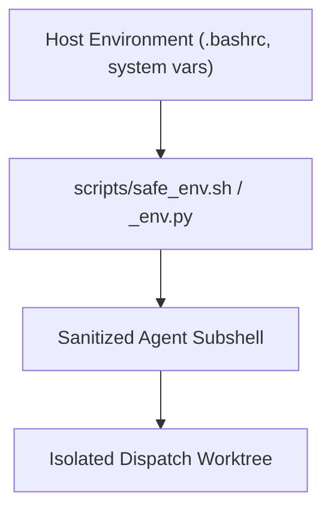

# Multi-Agent Runtime and Security Harness

> [!NOTE]
> OpenWiki is a non-authoritative locator. Authoritative multi-agent harness policies are maintained in [`agents_extensions/shared/rules/`](file:///home/ops/learn-ukrainian/.worktrees/dispatch/agy/impl-5541-openwiki-pilot/agents_extensions/shared/rules/) and executable harness scripts in [`scripts/ai_agent_bridge/`](file:///home/ops/learn-ukrainian/.worktrees/dispatch/agy/impl-5541-openwiki-pilot/scripts/ai_agent_bridge/).

## Multi-Agent Ecosystem

The `learn-ukrainian` platform uses a multi-agent paired workflow across distinct language-capable agent families:

| Harness Identity | Primary Role | Representative Models |
|---|---|---|
| **AGY (Antigravity)** | Execution / Authoring / High-context synthesis | `gemini-3.8-flash-high` |
| **Codex** | Architecture review / Guardrails / Independent CF | `astra` (@ `low`), `gpt-5.5` |
| **Claude** | Content design / Linear review / Orchestration | `claude-fable-5`, `claude-sonnet-4.6` |

Per [ADR-013](file:///home/ops/learn-ukrainian/.worktrees/dispatch/agy/impl-5541-openwiki-pilot/docs/architecture/adr/adr-013-docs-knowledge-openwiki.md), tasks touching Ukrainian pedagogy are language-adjacent. Therefore, LANGUAGE-LANES seating applies, and paired cross-family review (e.g., AGY executes, Codex Astra reviews) is mandatory.

---

## Environment Sanitization & Security Invariants

Multi-agent execution carries strict security boundaries to prevent secret leakage and cross-agent contamination:

### 1. Environment Variable Filtering
As validated in [`tests/test_agent_runtime_env_sanitize.py`](file:///home/ops/learn-ukrainian/.worktrees/dispatch/agy/impl-5541-openwiki-pilot/tests/test_agent_runtime_env_sanitize.py):
- Secrets and raw API keys (`GEMINI_API_KEY`, `ANTHROPIC_KEY`, `GH_TOKEN`) are stripped before invoking external sub-processes unless specifically required and isolated.
- Agent harness subshells do not leak host tokens or cross-agent credentials.

### 2. Secret Redaction Rules
Following [`docs/bug-autopsies/secret-leakage.md`](file:///home/ops/learn-ukrainian/.worktrees/dispatch/agy/impl-5541-openwiki-pilot/docs/bug-autopsies/secret-leakage.md):
- Grepping credential files (`.bash_secrets`, `.env*`) must never print matched lines verbatim. Commands must pipe through `cut -d= -f1` or `sed 's/=.*/=<REDACTED>/'`.
- To test if an environment variable exists, scripts use `[ -n "${VAR:-}" ]` rather than pulling the raw value into standard output.

---

## Worktree Containment

Every dispatch executes in an isolated git worktree (e.g., `.worktrees/dispatch/<agent>/<task-id>`).
- Agents must never switch branches or execute write operations in the primary interactive checkout.
- Fresh base references must be fetched via `git fetch origin main` directly inside the worktree.
