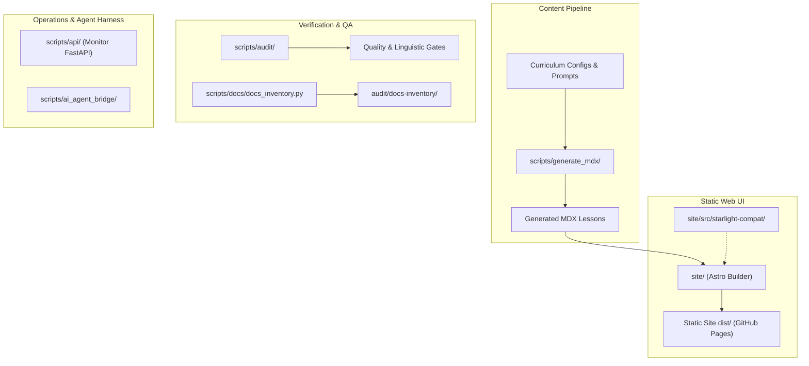

# Repository Architecture Overview

> [!NOTE]
> OpenWiki is a non-authoritative locator. The authoritative sources for repository architecture are [ADR-013](file:///home/ops/learn-ukrainian/.worktrees/dispatch/agy/impl-5541-openwiki-pilot/docs/architecture/adr/adr-013-docs-knowledge-openwiki.md), [docs-authority-lifecycle.md](file:///home/ops/learn-ukrainian/.worktrees/dispatch/agy/impl-5541-openwiki-pilot/docs/architecture/docs-authority-lifecycle.md), and [2026-06-09-ui-astro-without-starlight.md](file:///home/ops/learn-ukrainian/.worktrees/dispatch/agy/impl-5541-openwiki-pilot/docs/architecture/2026-06-09-ui-astro-without-starlight.md).

## Architectural Foundations

The repository cleanly delineates five distinct tiers of knowledge and runtime responsibility:

1. **Behavioral Truth (Code & Tests):** Executable code in `scripts/`, `site/`, and `tests/` defines operational and learner-facing behavior. Prose never overrides observable execution.
2. **Curated Documentation:** Long-term architectural decisions ([`docs/architecture/adr/`](file:///home/ops/learn-ukrainian/.worktrees/dispatch/agy/impl-5541-openwiki-pilot/docs/architecture/adr/)) and best practices governed by explicit lifecycles (`active`, `draft`, `superseded`, `archive`).
3. **Generated Synthesis Layer (`openwiki/`):** A killable, bounded reference tree providing fast orientation and search optimization without policy authority.
4. **Live Operational State:** Ephemeral sessions, leases, and worker tracking exposed via the Monitor API (`scripts/api/`) and session streams. Never recorded as permanent documentation facts.
5. **Learner-Facing Product:** Plain Astro static application located under [`site/`](file:///home/ops/learn-ukrainian/.worktrees/dispatch/agy/impl-5541-openwiki-pilot/site/), deployed to GitHub Pages via `.github/workflows/deploy-pages.yml`.

---

## Stream Governance

Workstreams are formally cataloged in [`scripts/config/issue_streams.yaml`](file:///home/ops/learn-ukrainian/.worktrees/dispatch/agy/impl-5541-openwiki-pilot/scripts/config/issue_streams.yaml) and mirrored in [`docs/WORKSTREAMS.md`](file:///home/ops/learn-ukrainian/.worktrees/dispatch/agy/impl-5541-openwiki-pilot/docs/WORKSTREAMS.md).

Key active streams:
- **`docs-knowledge` (Epic #5535):** Dedicated stream governing curated docs authority, deterministic inventory, and the conditional OpenWiki pilot. Dispatches under this stream operate independently of infra harness leases.
- **`infra` (Epic #6943):** Core automation harness, runner infrastructure, and multi-agent coordination.
- **`practice` / `curriculum`:** Pedagogical systems, spaced-repetition engines, vocabulary atlases, and CEFR-aligned lessons.

---

## Key Subsystems

### 1. Plain Astro Static UI (`site/`)
Learner pages are built using plain Astro without the Starlight integration (Option A, confirmed 2026-06-09 and amended 2026-09-17 under #5538). Custom layouts ([`CourseLayout.astro`](file:///home/ops/learn-ukrainian/.worktrees/dispatch/agy/impl-5541-openwiki-pilot/site/src/layouts/CourseLayout.astro)) and `--lu-*` CSS tokens provide full control over the lesson experience.

### 2. Content Generation Pipeline (`scripts/generate_mdx/`, `scripts/build/`)
Modular Python scripts convert pedagogical blueprints into rich, accessible MDX pages. Track parameters (A1–C2) and immersion policies are configured centrally in [`scripts/config.py`](file:///home/ops/learn-ukrainian/.worktrees/dispatch/agy/impl-5541-openwiki-pilot/scripts/config.py).

### 3. Verification & Inventory (`scripts/audit/`, `scripts/docs/`)
Content is validated against VESUM dictionaries and grammatical rubrics before publication. The documentation inventory tool ([`scripts/docs/docs_inventory.py`](file:///home/ops/learn-ukrainian/.worktrees/dispatch/agy/impl-5541-openwiki-pilot/scripts/docs/docs_inventory.py)) tracks all regular documentation blobs directly from Git's index, producing deterministic manifests and reference graphs.

### 4. Monitor API (`scripts/api/`)
A FastAPI dashboard server provides developer inspection, orientation (`/api/orient`), rule distribution (`/api/rules`), and artifact browsing (`/artifacts/`).
