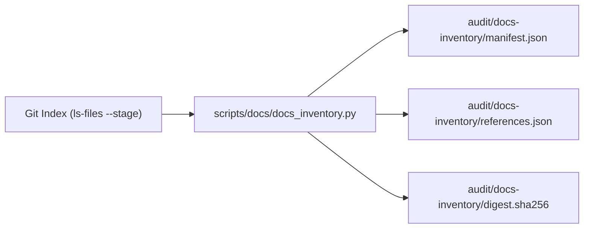

# Content Contracts and Quality Assurance

> [!NOTE]
> OpenWiki is a non-authoritative locator. Authoritative verification logic resides in executable scripts under [`scripts/audit/`](../scripts/audit/) and the documentation inventory tool [`scripts/docs/docs_inventory.py`](../scripts/docs/docs_inventory.py).

## Linguistic Integrity & VESUM Verification

To maintain the highest standard of modern Ukrainian language instruction:
1. **VESUM Dictionary Compliance:** All Ukrainian headwords, lemmas, and inflections introduced in lessons must be attested by VESUM (Virtual Lexicographical Laboratory of Ukrainian).
2. **Decolonization & Normative Grammar:** Grammatical choices follow normative 2019 spelling standards. Calques and unnatural structures are audited by automated verifiers (`scripts/audit/check_russian_shadow.py` and finding normalizers).
3. **Verbatim-Only Quote Invariant (FBL-013):** Generated documentation (including OpenWiki) is prohibited from inventing synthetic Ukrainian text. All Ukrainian phrases in technical documentation must be verbatim quotes from curriculum files, textbooks, or attested source corpora.

---

## Deterministic Documentation Inventory (#5536)

Owned by [#5536](https://github.com/learn-ukrainian/learn-ukrainian.github.io/issues/5536) and defined in [`docs/knowledge/inventory/README.md`](../docs/knowledge/inventory/README.md):

- **Tool:** [`scripts/docs/docs_inventory.py`](../scripts/docs/docs_inventory.py)
- **Source of Truth:** Git's staged and committed index (`git ls-files --stage -z`). Untracked files, local caches, and gitignored paths are strictly ignored.
- **Determinism:** Identical index, HEAD, and tool version yield byte-identical manifests. No run timestamps, wall-clock age, or absolute paths affect output digests.

### Schema & Artifacts
The inventory outputs conform to [`docs/knowledge/inventory/manifest.schema.json`](../docs/knowledge/inventory/manifest.schema.json), recording:
- File paths, byte/line counts, content SHA-256 hashes, and blob IDs.
- Frontmatter diagnostics (enforcing lifecycle states: `draft`, `active`, `superseded`, `archive`).
- Graph edges capturing Markdown links, image references, and supersession relationships.

---

## Audit Scripts & Gate Enforcement

The [`scripts/audit/`](../scripts/audit/) directory provides gatekeepers that run in CI and local verification:
- `check_adrs.py`: Verifies ADR formatting, sequential numbering, and status fields.
- `check_decisions.py`: Tracks dated decision cards and flags expired entries.
- `certify_module.py`: Evaluates curriculum units against all pedagogical and immersion gates before promotion.
