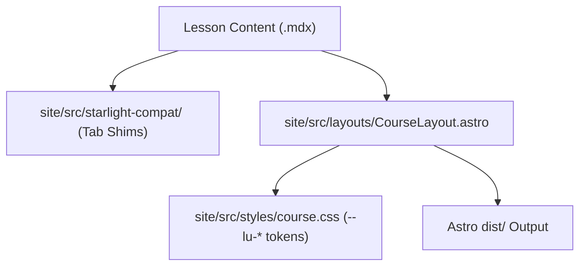

# Learner Site UI Architecture (Plain Astro)

> [!IMPORTANT]
> **Stack Truth (ADR-013 & Plain-Astro ACCEPTED)**
> The learner web interface is built using **plain Astro without Starlight** (Option A, accepted on 2026-06-09 and reaffirmed on 2026-09-17 under #5538). OpenWiki pages and agents must **never** claim Starlight or Docusaurus as current frontend frameworks.

## Background & Decision Record

The repository originally evaluated Starlight versus custom Astro components. As recorded in [`docs/architecture/2026-06-09-ui-astro-without-starlight.md`](file:///home/ops/learn-ukrainian/.worktrees/dispatch/agy/impl-5541-openwiki-pilot/docs/architecture/2026-06-09-ui-astro-without-starlight.md):
- **Decision:** Keep Astro as the static builder; remove Starlight as the learner-facing layer; build custom owned components and routes.
- **Why:** Starlight documentation machinery imposed heavyweight overrides. A custom layout (`CourseLayout.astro` + `course.css`) provides total control over hero banners, breadcrumbs, vocabulary decks, and theme tokens (`--lu-*`).

---

## Technical Evidence in the Tree

### 1. Astro Configuration (`site/astro.config.mjs`)
Inspecting [`site/astro.config.mjs`](file:///home/ops/learn-ukrainian/.worktrees/dispatch/agy/impl-5541-openwiki-pilot/site/astro.config.mjs):
```javascript
export default defineConfig({
  site: 'https://learn-ukrainian.github.io',
  trailingSlash: 'always',
  integrations: [
    mdx(),
    react(),
    sitemap({...}),
  ],
});
```
- Only `mdx()`, `react()`, and `sitemap()` integrations are loaded.
- The `starlight()` integration is **completely absent**.

### 2. The Legacy Vite Alias (`site/src/starlight-compat/`)
Published lesson MDX files historically imported UI tabs using `@astrojs/starlight/components`. To avoid a massive, disruptive rewrite of hundreds of MDX files, Astro uses a Vite alias:
```javascript
resolve: {
  alias: {
    '@site': starlightRoot,
    '@astrojs/starlight/components': fileURLToPath(
      new URL('./src/starlight-compat/index.ts', import.meta.url)
    ),
  },
}
```
This alias redirects Starlight component imports to the lightweight local shim [`site/src/starlight-compat/index.ts`](file:///home/ops/learn-ukrainian/.worktrees/dispatch/agy/impl-5541-openwiki-pilot/site/src/starlight-compat/index.ts).

### 3. Dependency Verification (`site/package.json`)
- `@astrojs/starlight` is **not** present in [`site/package.json`](file:///home/ops/learn-ukrainian/.worktrees/dispatch/agy/impl-5541-openwiki-pilot/site/package.json) (it was fully removed in commit `666b6a551f` on 2026-06-08).
- The directory was renamed from historical `starlight/` to `site/` in commit `0e6310ae1a` (2026-06-13).

---

## Component & Layout Architecture



- **Course Layout:** [`site/src/layouts/CourseLayout.astro`](file:///home/ops/learn-ukrainian/.worktrees/dispatch/agy/impl-5541-openwiki-pilot/site/src/layouts/CourseLayout.astro) renders header navigation, breadcrumbs, sidebar course navigation, and footer.
- **Styling:** Controlled by custom CSS tokens in `site/src/styles/course.css`.
- **Search:** Native search index generated at build time; custom routing at `site/src/pages/[...slug].astro`.
