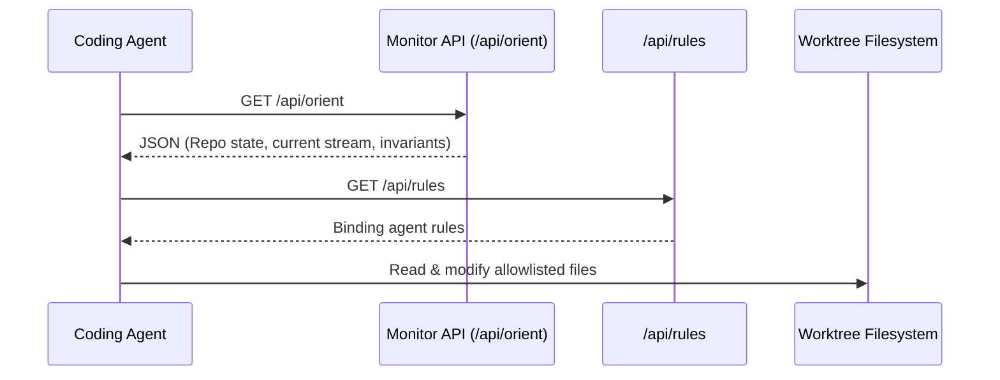

# Monitor API Architecture and Interfaces

> [!CAUTION]
> **Live State Boundary (ADR-013 & FBL-006)**
> OpenWiki is **strictly forbidden** from mirroring, caching, or asserting live operational states (such as active leases, current occupancy, or in-flight dispatches). Live state is ephemeral and authoritative only via live calls to runtime endpoints. This page documents the static code structure of the Monitor API, not live system state.

## Architecture

The operational dashboard backend is built on **FastAPI** and located under [`scripts/api/`](../scripts/api/). It serves local developer dashboards, provides orientation payloads for agents, and hosts artifact exploration tools.

- **Main Entrypoint:** [`scripts/api/main.py`](../scripts/api/main.py)
- **Local Port:** Default `localhost:8000` (configurable)
- **Supervision:** [`scripts/api/run_monitor_api_supervisor.sh`](../scripts/api/run_monitor_api_supervisor.sh)

---

## Key Routers and Endpoints

| Router file | Prefix / Endpoint | Purpose |
|---|---|---|
| [`rules_router.py`](../scripts/api/rules_router.py) | `/api/rules` | Serves authoritative shared agent rules parsed from `agents_extensions/shared/rules/`. |
| [`artifacts_router.py`](../scripts/api/artifacts_router.py) | `/artifacts/` | Serves committed and generated evaluation artifacts (HTML reports, scorecards). |
| [`batch_router.py`](../scripts/api/batch_router.py) | `/api/batch/...` | Manages batch build tasks and WebSocket progress reporting. |
| [`agent_router.py`](../scripts/api/agent_router.py) | `/api/agent/...` | Exposes agent metrics, session metadata, and tool invocation stats. |
| [`docs_router.py`](../scripts/api/docs_router.py) | `/api/docs/...` | Document inspection endpoint. (Post-adopt expansion candidate for OpenWiki browsing). |

---

## Developer and Agent Orientation Contract

The `/api/orient` endpoint (defined in [`scripts/api/main.py`](../scripts/api/main.py)) is the standard entrypoint for coding agents starting a fresh session. It provides:

1. **Repository Identity & Git Head:** Current commit SHA and branch sanity.
2. **Recent Milestones & Stream Status:** High-priority active issues and recent handoff digests.
3. **Guardrails & Active Policies:** Pointers to active safety contracts and worktree containment rules.

### Distinction vs OpenWiki
- **Monitor API (`/api/orient`):** Live operational truth, real-time git state, ephemeral leases, dynamic task queues.
- **OpenWiki (`openwiki/`):** Static, killable synthesis over committed code-anchored documentation. OpenWiki never substitutes for Monitor API orientation.
