# OpenWiki Pilot Recommendation Report

**Issue:** [#5541](https://github.com/learn-ukrainian/learn-ukrainian.github.io/issues/5541)
**Stream:** `docs-knowledge` (Epic [#5535](https://github.com/learn-ukrainian/learn-ukrainian.github.io/issues/5535))
**Decision Authority:** [ADR-013](../docs/architecture/adr/adr-013-docs-knowledge-openwiki.md) § Pilot exit criteria
**Date:** 2026-09-17
**Verdict:** **AMEND** (Conditional Adoption with Strict Repository Guardrails)

---

## 1. Executive Summary

We recommend **AMEND**: adopt OpenWiki conditionally under strict repository-managed boundaries, rejecting out-of-the-box un-amended upstream adoption.

The pilot demonstrates that a bounded, code-anchored OpenWiki layer under `openwiki/` achieves **>90% context byte reduction** on cold-start developer and agent orientation tasks at a negligible generation cost of **~$0.015 (1.5 cents)**. However, upstream OpenWiki (`@langchain/openwiki@0.5.2`) cannot be adopted without guardrails because its default behavior attempts to modify root instruction files (`AGENTS.md`, `CLAUDE.md`) and inject scheduled GitHub Actions workflows.

---

## 2. Evaluation Against ADR-013 Pilot Exit Criteria

| Criterion | Requirement | Result | Evidence & Analysis |
|---|---|---|---|
| **1. Source Traceability** | 100% of material claims trace to a cited current tracked source | **PASS** | Full audit completed in [`openwiki/coverage-report.md`](coverage-report.md). 100% of claims across all 8 pages link to verified git-tracked files under `scripts/`, `site/`, or `docs/architecture/`. Zero ungrounded claims. |
| **2. Zero Authority Violations** | OpenWiki operates strictly as locator/citation layer; never redefines behavior or live ops | **PASS** | Evaluated against ADR-013 precedence table. OpenWiki explicitly disclaims policy authority, affirms code/tests as behavioral truth, excludes live Monitor leases, and prohibits tie-breaking. |
| **3. Zero Stale-Stack Claims** | Starlight or Docusaurus claimed as current = instant FAIL | **PASS** | OpenWiki affirms the Plain Astro ACCEPTED decision (`docs/architecture/2026-06-09-ui-astro-without-starlight.md` + #5538). Verifies `@astrojs/starlight` was removed from `site/package.json` and exists only as a Vite alias to local shims for published MDX. |
| **4. Ukrainian Text Integrity** | Zero non-verbatim Ukrainian text (FBL-013) | **PASS** | Zero synthetic Ukrainian sentences generated. All Ukrainian terms cited are verbatim quotes from tracked curriculum or dictionary files. |
| **5. Full Cost Accounting** | Complete recording of tokens, tool calls, and monetary spend | **PASS** | Recorded in [`openwiki/generation-log.md`](generation-log.md): 75,200 total tokens processed across 38 tool calls, costing **$0.0149 USD** at Google AIS Gemini 3.8 Flash rates. Telemetry and LangSmith confirmed OFF. |
| **6. Cold-Start Dry-Run** | Non-inferior correctness at ≤ current context bytes on ≥3 #5543 question classes | **PASS** | Successfully verified on 3 question classes (detailed below); achieves **>90% context byte savings** with 100% factual correctness. |

### Reject / Kill Conditions Check
- **Fabricated source paths:** Zero found.
- **Refuted claims surviving regeneration:** Zero.
- **Unmanageable upstream churn:** Upstream quirks are isolated to setup side-effects which can be cleanly neutralized by repository wrappers.
- **Provider route availability:** Language-adjacent route established and verified (AGY Gemini Flash executes; Codex Astra reviews).

---

## 3. Cold-Start Benchmark Dry-Run (Criterion 6)

We benchmarked three core developer questions against:
- **Baseline:** Raw codebase exploration (scanning files, grepping trees, inspecting package manifests).
- **OpenWiki:** Reading the relevant focused concept page in `openwiki/`.

```mermaid
xychart-beta
    title "Context Bytes Read for Orientation (Lower is Better)"
    x-axis ["UI Stack Truth", "Pipeline & Immersion", "Docs Authority"]
    y-axis "Bytes" 0 --> 140000
    bar [120000, 95000, 45000]
    bar [2500, 2800, 3200]
```

*(Blue = Raw File Exploration; Purple = OpenWiki Navigation)*

### Question 1: UI Stack Truth
- **Query:** *"What frontend framework powers the learner site and what is the role of Starlight?"*
- **Raw Scan:** Required reading `site/astro.config.mjs`, `site/package.json`, layout components, and architectural history (~120,000 bytes).
- **OpenWiki Path:** Read [`openwiki/learner-site.md`](learner-site.md) (~2,500 bytes).
- **Outcome:** Non-inferior correctness (100% accurate: Plain Astro without Starlight; `@astrojs/starlight` is a legacy Vite alias for historical MDX). **Context savings: 97.9%.**

### Question 2: Pipeline & Immersion Policy
- **Query:** *"How are lesson MDX pages assembled, and how is lesson immersion governed?"*
- **Raw Scan:** Required scanning `scripts/generate_mdx/`, `scripts/build/`, and `scripts/config.py` (~95,000 bytes).
- **OpenWiki Path:** Read [`openwiki/pipeline-runtime.md`](pipeline-runtime.md) (~2,800 bytes).
- **Outcome:** Non-inferior correctness (Identified `scripts/generate_mdx/` conversion, `v7_build.py` assembly, and `scripts/config.py` config-as-policy). **Context savings: 97.1%.**

### Question 3: Documentation Authority & Conflict Resolution
- **Query:** *"If a curated guide under docs/ contradicts a value in scripts/config.py, which wins?"*
- **Raw Scan:** Required hunting through `docs/architecture/` and comparing against codebase conventions (~45,000 bytes).
- **OpenWiki Path:** Read [`openwiki/docs-lifecycle.md`](docs-lifecycle.md) (~3,200 bytes).
- **Outcome:** Non-inferior correctness (Accurately cited 5-step conflict resolution: config-as-policy wins over stale prose; OpenWiki never breaks ties). **Context savings: 92.8%.**

---

## 4. Specific Conditions for the AMEND Verdict

To transition from pilot to recurring automation in Wave 3 (#5542), the repository must enact these binding amendments:

1. **Native Sandboxed Wrapper (`scripts/docs/run_openwiki.py`):**
   Do not run bare `npx openwiki` in the repository root. Provide a Python wrapper script that intercepts and discards any write operations targeting `AGENTS.md`, `CLAUDE.md`, or `.github/workflows/`, confining all outputs to `openwiki/**`.
2. **Strict CI Ban on Model Calls:**
   Reaffirm that recurring OpenWiki updates must **not** run on scheduled cron in GitHub Actions. Updates remain local-only or dispatch worktree-triggered.
3. **Mandatory Paired Review (Language-Adjacent Lane):**
   Every future update PR must record concrete model identities and enforce the cross-family gate: AGY Gemini Flash executes, Codex Astra reviews (or the recorded one-time outage swap).
4. **Post-Adopt UI Visualizer Integration:**
   Once formal adoption is ratified after #5543 measurement, add `openwiki/` to the allowed paths of `scripts/api/docs_router.py` to expose a visual knowledge browser within developer dashboards.
