# OpenWiki Pilot Recommendation Report

**Issue:** [#5541](https://github.com/learn-ukrainian/learn-ukrainian.github.io/issues/5541)
**Stream:** `docs-knowledge` (Epic [#5535](https://github.com/learn-ukrainian/learn-ukrainian.github.io/issues/5535))
**Decision Authority:** [ADR-013](../docs/architecture/adr/adr-013-docs-knowledge-openwiki.md) § Pilot exit criteria
**Date:** 2026-09-17
**Verdict:** **AMEND** (Conditional Adoption with Proposed Repository Guardrails)

---

## 1. Executive Summary

We recommend **AMEND**: adopt OpenWiki conditionally under strict repository-managed boundaries, rejecting out-of-the-box un-amended upstream adoption.

The pilot demonstrates that a bounded, code-anchored OpenWiki layer under `openwiki/` achieves **42.8% to 53.5% context byte reduction** against the existing Monitor-API orientation baseline (and up to **77.9% reduction** on direct concept lookup) across core orientation tasks, with **$0.00 incremental cash spend** under the existing operator subscription (~$0.026 theoretical unbundled API list price). However, upstream OpenWiki (`@langchain/openwiki@0.5.2`) cannot be adopted without guardrails because its default behavior attempts to modify root instruction files (`AGENTS.md`, `CLAUDE.md`) and inject scheduled GitHub Actions workflows.

All proposed guardrails for recurring automation are submitted as non-binding recommendations for operator and stream lead approval during Wave 3 (#5542) planning.

---

## 2. Evaluation Against ADR-013 Pilot Exit Criteria

| Criterion | Requirement | Result | Evidence & Analysis |
|---|---|---|---|
| **1. Source Traceability** | 100% of material claims trace to a cited current tracked source | **PASS** | Full audit completed in [`openwiki/coverage-report.md`](coverage-report.md). 100% of claims across all 8 pages link to verified git-tracked files under `scripts/`, `site/`, or `docs/architecture/`. Zero ungrounded claims. |
| **2. Zero Authority Violations** | OpenWiki operates strictly as locator/citation layer; never redefines behavior or live ops | **PASS** | Evaluated against ADR-013 precedence table. OpenWiki explicitly disclaims policy authority, affirms code/tests as behavioral truth, excludes live Monitor leases, and prohibits tie-breaking. |
| **3. Zero Stale-Stack Claims** | Starlight or Docusaurus claimed as current = instant FAIL | **PASS** | OpenWiki affirms the Plain Astro ACCEPTED decision (`docs/architecture/2026-06-09-ui-astro-without-starlight.md` + #5538). Verifies `@astrojs/starlight` was removed from `site/package.json` and exists only as a Vite alias to local shims for published MDX. |
| **4. Ukrainian Text Integrity** | Zero non-verbatim Ukrainian text (FBL-013) | **PASS** | Zero synthetic Ukrainian sentences generated. All Ukrainian terms cited are verbatim quotes from tracked curriculum or dictionary files. |
| **5. Full Cost Accounting** | Complete recording of tokens, tool calls, and monetary spend | **PASS** | Recorded in [`openwiki/generation-log.md`](generation-log.md). Separates measured operations (38 tool calls, 0 subagents, 1 npm query) from token estimates (~42.5k prompt context, ~14.2k prose completion, ~18.5k reasoning tokens). Incremental cash spend is **$0.00 USD** under existing Google AIS subscription; theoretical API list price is **$0.025995 USD** (~2.6 cents, accounting for all output and reasoning tokens). Telemetry and LangSmith confirmed OFF. |
| **6. Cold-Start Dry-Run** | Non-inferior correctness at ≤ current context bytes on ≥3 #5543 question classes | **PASS** | Verified across 3 required #5543 question classes against the Monitor-API orientation baseline (`GET /api/orient` + `docs/README.md` + curated targets). Achieves 42.8% to 53.5% context byte reduction with entrypoint navigation (and 76%–78% on direct locator reads) with 100% scored correctness. Full run and scored-answer evidence detailed in Section 3. |

### Reject / Kill Conditions Check
- **Fabricated source paths:** Zero found.
- **Refuted claims surviving regeneration:** Zero.
- **Unmanageable upstream churn:** Upstream quirks are isolated to setup side-effects which can be cleanly neutralized by repository wrappers.
- **Provider route availability:** Language-adjacent route established and verified (AGY Gemini Flash executes; Codex Astra reviews).

---

## 3. Cold-Start Benchmark Dry-Run (Criterion 6)

In accordance with ADR-013 (FBL-005) and `docs/knowledge/inventory/README.md`, OpenWiki is evaluated against the existing **Monitor-API orientation baseline** — not against an empty cold start or raw filesystem search.

### Benchmark Setup

1. **Baseline (Monitor-API Orientation Sequence per ADR-013 / #5543):**
   - Step 1: Monitor orientation probe (`GET /api/orient?lean=true`): **5,070 bytes**.
   - Step 2: Canonical documentation map (`docs/README.md`): **5,932 bytes**.
   - Step 3: Targeted curated document(s) cited by the map to answer the question.
2. **OpenWiki Navigation Layer (Arm 3 Candidate):**
   - Step 1: Entrypoint portal (`openwiki/quickstart.md`): **4,513 bytes**.
   - Step 2: Focused domain concept page (`openwiki/*.md`).
   - *(Optional direct locator hit is also reported where a tool or router references the target page directly).*

```mermaid
xychart-beta
    title "Context Bytes Read for Orientation (Lower is Better)"
    x-axis ["UI Stack Truth", "Docs Authority", "Pipeline Runtime"]
    y-axis "Bytes" 0 --> 28000
    bar [15016, 18522, 25786]
    bar [7835, 8605, 7677]
```

*(Blue = Monitor-API Orientation Baseline; Purple = OpenWiki Navigation from Quickstart)*

---

### Question 1: Active Learner-Facing Website Stack (#5543 Question Class 1)

- **Query:** *"What frontend framework powers the learner site and what is the role of Starlight?"*
- **Baseline Context (15,016 bytes):**
  - `GET /api/orient?lean=true`: 5,070 bytes
  - `docs/README.md`: 5,932 bytes
  - `docs/architecture/2026-06-09-ui-astro-without-starlight.md`: 4,014 bytes
- **OpenWiki Context (7,835 bytes; or 3,322 bytes direct):**
  - `openwiki/quickstart.md`: 4,513 bytes
  - `openwiki/learner-site.md`: 3,322 bytes
- **Context Byte Reduction:** **47.8% reduction** via quickstart entrypoint (**77.9% reduction** on direct locator read).
- **Scored Answer Evidence:**
  - *Baseline Answer:* Identifies Plain Astro static site builder without `@astrojs/starlight`. `@astrojs/starlight` was removed from `site/package.json` and exists only as a Vite alias to local shims (`site/src/starlight-compat/index.ts`) for legacy MDX component imports. Main layout is `site/src/layouts/CourseLayout.astro`. (Citations: `docs/architecture/2026-06-09-ui-astro-without-starlight.md`, `site/astro.config.mjs`).
  - *OpenWiki Answer:* Identifies Plain Astro static builder without `@astrojs/starlight`. Confirms dependency deletion in `site/package.json`, explains the Vite alias in `site/astro.config.mjs` redirecting component imports to `site/src/starlight-compat/index.ts`, and cites `CourseLayout.astro`. (Citations: `learner-site.md` -> `../site/astro.config.mjs`, `../docs/architecture/2026-06-09-ui-astro-without-starlight.md`).
  - *Correctness Scoring:*
    - Factual accuracy: 5/5 (both)
    - Citation grounding: 5/5 (both)
    - Stale-stack avoidance: 5/5 (both)
    - **Outcome: Non-inferior correctness (5/5 vs 5/5, 100%) at 47.8% fewer context bytes.**

---

### Question 2: Documentation Authority & Conflict Resolution (#5543 Question Class 6)

- **Query:** *"If a curated guide under docs/ contradicts a value in scripts/config.py, which wins, and what is the conflict resolution procedure?"*
- **Baseline Context (18,522 bytes):**
  - `GET /api/orient?lean=true`: 5,070 bytes
  - `docs/README.md`: 5,932 bytes
  - `docs/architecture/docs-authority-lifecycle.md`: 7,520 bytes
- **OpenWiki Context (8,605 bytes; or 4,092 bytes direct):**
  - `openwiki/quickstart.md`: 4,513 bytes
  - `openwiki/docs-lifecycle.md`: 4,092 bytes
- **Context Byte Reduction:** **53.5% reduction** via quickstart entrypoint (**77.9% reduction** on direct locator read).
- **Scored Answer Evidence:**
  - *Baseline Answer:* Config-as-policy in `scripts/config.py` wins over stale curated docs. Under `docs-authority-lifecycle.md`, the 5-step conflict resolution procedure applies: (1) classify fact type, (2) check authority table, (3) decide by evidence of staleness (prefer newer commits, tool reads over prose), (4) record disposition, (5) OpenWiki never breaks ties. (Citations: `docs/architecture/docs-authority-lifecycle.md#L31-L45`).
  - *OpenWiki Answer:* Config-as-policy in `scripts/config.py` overrides curated narrative docs for configuration facts. The 5-step deterministic resolution protocol governs: fact classification, authority matrix lookup, staleness evaluation, disposition logging, with explicit guarantee that OpenWiki cannot break ties. (Citations: `docs-lifecycle.md` -> `../docs/architecture/docs-authority-lifecycle.md`, `../scripts/config.py`).
  - *Correctness Scoring:*
    - Factual accuracy: 5/5 (both)
    - Authority compliance: 5/5 (both)
    - Tie-breaker constraint: 5/5 (both)
    - **Outcome: Non-inferior correctness (5/5 vs 5/5, 100%) at 53.5% fewer context bytes.**

---

### Question 3: Subsystem Build Entrypoint & Immersion Policy (#5543 Question Class 5)

- **Query:** *"What is the build/test entrypoint for the curriculum pipeline subsystem, how are lesson MDX pages assembled, and how is lesson immersion governed?"*
- **Baseline Context (25,786 bytes; or 13,421 bytes minimal):**
  - `GET /api/orient?lean=true`: 5,070 bytes
  - `docs/README.md`: 5,932 bytes
  - `agents_extensions/shared/rules/pipeline.md`: 2,419 bytes
  - `docs/architecture/ARCHITECTURE.md`: 12,365 bytes
- **OpenWiki Context (7,677 bytes; or 3,164 bytes direct):**
  - `openwiki/quickstart.md`: 4,513 bytes
  - `openwiki/pipeline-runtime.md`: 3,164 bytes
- **Context Byte Reduction:** **42.8% to 70.2% reduction** via quickstart entrypoint (**76.4% to 87.7% reduction** on direct locator read).
- **Scored Answer Evidence:**
  - *Baseline Answer:* Primary build entrypoint is `scripts/build/v7_build.py`. Curriculum MDX generation is performed via `scripts/generate_mdx/core.py`. Lesson immersion is governed by config-as-policy in `scripts/config.py` (`IMMERSION_POLICIES` and `TRACK_CONFIG`). (Citations: `agents_extensions/shared/rules/pipeline.md`, `scripts/config.py`, `docs/README.md`).
  - *OpenWiki Answer:* Pipeline runtime entrypoints: `scripts/build/v7_build.py` (assembly) and `scripts/generate_mdx/core.py` (conversion/navigation). Lesson immersion is governed by config-as-policy in `scripts/config.py` (`IMMERSION_POLICIES`), superseding narrative documentation. (Citations: `pipeline-runtime.md` -> `../scripts/build/v7_build.py`, `../scripts/generate_mdx/core.py`, `../scripts/config.py`).
  - *Correctness Scoring:*
    - Factual accuracy: 5/5 (both)
    - Subsystem entrypoint fidelity: 5/5 (both)
    - Immersion policy citation: 5/5 (both)
    - **Outcome: Non-inferior correctness (5/5 vs 5/5, 100%) at 42.8% to 70.2% fewer context bytes.**

---

## 4. Proposed Amendments for Consideration in Wave 3 (#5542)

Consistent with ADR-013's non-authoritative posture for OpenWiki and the reservation of recurring automation venue decisions to #5542, the following guardrails are submitted as **proposals requiring designated operator / stream approval**:

1. **Proposed Write-Confining Harness (`scripts/docs/run_openwiki.py`):**
   *Proposal:* If upstream OpenWiki is used for future updates, evaluate authoring a Python runner that invokes OpenWiki in a sandboxed directory, intercepts upstream write attempts outside `openwiki/**` (such as `AGENTS.md`, `CLAUDE.md`, or `.github/workflows/`), and synchronizes verified outputs to `openwiki/**`, ensuring repository governance and FBL-003 boundaries are preserved.

2. **Recurring Automation Venue Decision (Owned by #5542):**
   *Recommendation:* ADR-013 established that recurring model calls in CI are deferred and not authorized for the pilot. Wave 3 (#5542) owns the recurring automation venue decision. We propose maintaining local/dispatch worktree-triggered updates as the primary default until #5542 formally evaluates spend, egress, and operational boundaries.

3. **Proposed Paired Review Protocol (Language-Adjacent Lane):**
   *Proposal:* For any recurring regeneration PRs, adhere to the ADR-013 LANGUAGE-LANES allocation: AGY Gemini Flash executes and Codex Astra reviews (or the recorded one-time outage swap), recording concrete model identities and families on every PR.

4. **Proposed Visual Knowledge Browser in Ops UI (Post-Adopt Scope):**
   *Proposal:* In accordance with operator guidance, if and only if the pilot is formally adopted after #5543 cold-start measurement, consider adding `openwiki/` to the allowlist in `scripts/api/docs_router.py` to serve a visual knowledge browser under `/artifacts/openwiki/` in developer dashboards (with explicit freshness digest, never as live-state authority).
