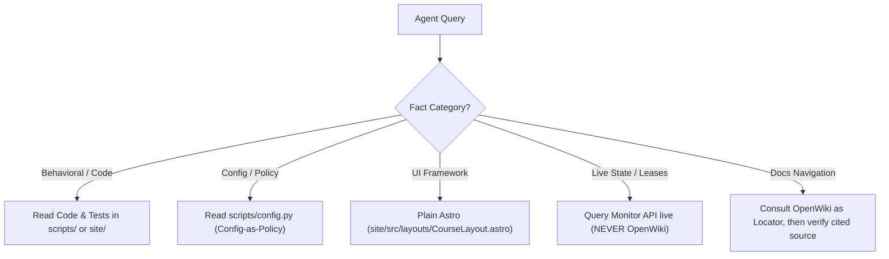

# OpenWiki Quickstart and Repository Navigator

> [!IMPORTANT]
> **Non-Authoritative Locator Notice**
> This directory (`openwiki/`) is a killable, non-authoritative navigation and synthesis layer generated under [ADR-013](file:///home/ops/learn-ukrainian/.worktrees/dispatch/agy/impl-5541-openwiki-pilot/docs/architecture/adr/adr-013-docs-knowledge-openwiki.md). It does not establish binding repository policy, does not override code or configuration, and never breaks ties during conflict resolution. For any load-bearing task, consult the cited git-tracked source files directly.

## Welcome to learn-ukrainian

The `learn-ukrainian` repository powers a comprehensive, open-source Ukrainian language learning platform. It encompasses static site generation, content authoring pipelines, automated linguistic verification, learner tracking, and multi-agent coordination tooling.

### Repository Knowledge Map (Allowlist v1 Core Pages)

This pilot covers the code-anchored allowlist v1 surface (≤8 pages). Explore the focused domain guides below:

1. [Architecture Overview](file:///home/ops/learn-ukrainian/.worktrees/dispatch/agy/impl-5541-openwiki-pilot/openwiki/architecture-overview.md)
   High-level architectural structure, separation of concerns, stream governance ([`scripts/config/issue_streams.yaml`](file:///home/ops/learn-ukrainian/.worktrees/dispatch/agy/impl-5541-openwiki-pilot/scripts/config/issue_streams.yaml)), and architectural decision records ([ADR-013](file:///home/ops/learn-ukrainian/.worktrees/dispatch/agy/impl-5541-openwiki-pilot/docs/architecture/adr/adr-013-docs-knowledge-openwiki.md)).

2. [Learner Site & UI Architecture](file:///home/ops/learn-ukrainian/.worktrees/dispatch/agy/impl-5541-openwiki-pilot/openwiki/learner-site.md)
   Plain Astro static builder architecture ([`site/astro.config.mjs`](file:///home/ops/learn-ukrainian/.worktrees/dispatch/agy/impl-5541-openwiki-pilot/site/astro.config.mjs)), custom [`CourseLayout.astro`](file:///home/ops/learn-ukrainian/.worktrees/dispatch/agy/impl-5541-openwiki-pilot/site/src/layouts/CourseLayout.astro), de-Starlight verification ([`docs/architecture/2026-06-09-ui-astro-without-starlight.md`](file:///home/ops/learn-ukrainian/.worktrees/dispatch/agy/impl-5541-openwiki-pilot/docs/architecture/2026-06-09-ui-astro-without-starlight.md)), and search index routing.

3. [Pipeline & Build Runtime](file:///home/ops/learn-ukrainian/.worktrees/dispatch/agy/impl-5541-openwiki-pilot/openwiki/pipeline-runtime.md)
   Curriculum MDX generation ([`scripts/generate_mdx/`](file:///home/ops/learn-ukrainian/.worktrees/dispatch/agy/impl-5541-openwiki-pilot/scripts/generate_mdx/)), build orchestration ([`scripts/build/`](file:///home/ops/learn-ukrainian/.worktrees/dispatch/agy/impl-5541-openwiki-pilot/scripts/build/)), and config-as-policy knobs ([`scripts/config.py`](file:///home/ops/learn-ukrainian/.worktrees/dispatch/agy/impl-5541-openwiki-pilot/scripts/config.py)).

4. [Monitor API & Tooling Surface](file:///home/ops/learn-ukrainian/.worktrees/dispatch/agy/impl-5541-openwiki-pilot/openwiki/monitor-api.md)
   FastAPI operational server structure ([`scripts/api/main.py`](file:///home/ops/learn-ukrainian/.worktrees/dispatch/agy/impl-5541-openwiki-pilot/scripts/api/main.py)), router inventory, and static contracts. (Live leases and session streams are strictly non-authoritative here).

5. [Agent Runtime & Security Harness](file:///home/ops/learn-ukrainian/.worktrees/dispatch/agy/impl-5541-openwiki-pilot/openwiki/agent-runtime.md)
   Agent bridging mechanisms ([`scripts/ai_agent_bridge/`](file:///home/ops/learn-ukrainian/.worktrees/dispatch/agy/impl-5541-openwiki-pilot/scripts/ai_agent_bridge/)), environment sanitization ([`tests/test_agent_runtime_env_sanitize.py`](file:///home/ops/learn-ukrainian/.worktrees/dispatch/agy/impl-5541-openwiki-pilot/tests/test_agent_runtime_env_sanitize.py)), and secret protection rules.

6. [Content Quality & Contracts](file:///home/ops/learn-ukrainian/.worktrees/dispatch/agy/impl-5541-openwiki-pilot/openwiki/content-contracts.md)
   Linguistic verification gates, deterministic documentation inventory ([`scripts/docs/docs_inventory.py`](file:///home/ops/learn-ukrainian/.worktrees/dispatch/agy/impl-5541-openwiki-pilot/scripts/docs/docs_inventory.py)), and quality assurance scripts ([`scripts/audit/`](file:///home/ops/learn-ukrainian/.worktrees/dispatch/agy/impl-5541-openwiki-pilot/scripts/audit/)).

7. [Documentation Authority & Lifecycle](file:///home/ops/learn-ukrainian/.worktrees/dispatch/agy/impl-5541-openwiki-pilot/openwiki/docs-lifecycle.md)
   Hierarchy of repository truth ([`docs/architecture/docs-authority-lifecycle.md`](file:///home/ops/learn-ukrainian/.worktrees/dispatch/agy/impl-5541-openwiki-pilot/docs/architecture/docs-authority-lifecycle.md)), conflict resolution rules, and the worked immersion policy example.

---

## Fast Orientation for AI Agents

When answering questions or planning changes, follow this rapid sequence:

### Key Truth Invariants
- **Learner UI:** Plain Astro builder (`site/`). Starlight integration is deleted; `@astrojs/starlight` exists solely as a Vite alias to [`site/src/starlight-compat/index.ts`](file:///home/ops/learn-ukrainian/.worktrees/dispatch/agy/impl-5541-openwiki-pilot/site/src/starlight-compat/index.ts).
- **Immersion Policy:** Config-as-policy in [`scripts/config.py`](file:///home/ops/learn-ukrainian/.worktrees/dispatch/agy/impl-5541-openwiki-pilot/scripts/config.py) (`IMMERSION_POLICIES`) and operator expectations win over narrative docs.
- **Rules:** Source rules live in [`agents_extensions/shared/rules/`](file:///home/ops/learn-ukrainian/.worktrees/dispatch/agy/impl-5541-openwiki-pilot/agents_extensions/shared/rules/) and serve via `/api/rules`; `.claude/`, `.codex/`, `.gemini/` are deployed mirror copies.
