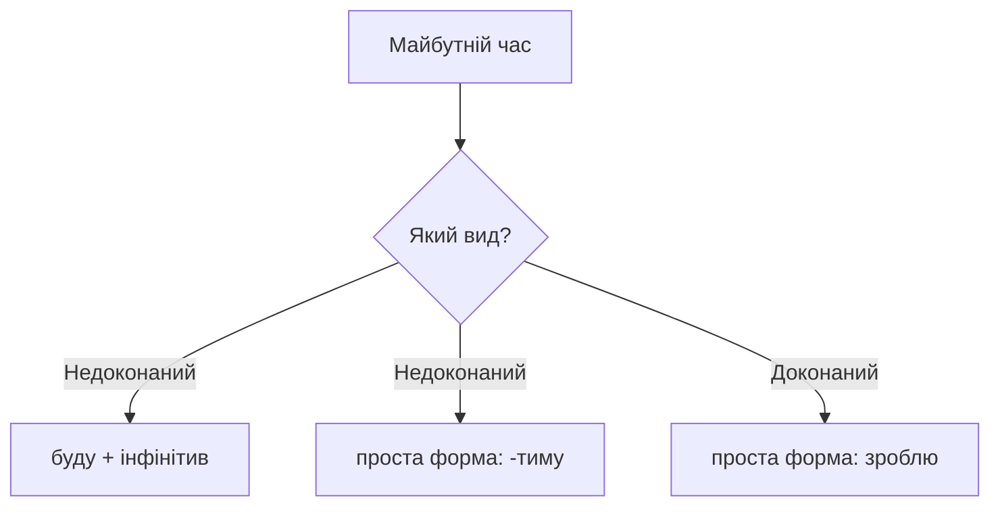

import Quiz from '@site/src/components/Quiz';
import MatchUp from '@site/src/components/MatchUp';
import FillIn from '@site/src/components/FillIn';
import TrueFalse from '@site/src/components/TrueFalse';
import Unjumble from '@site/src/components/Unjumble';
import GroupSort from '@site/src/components/GroupSort';
import Anagram from '@site/src/components/Anagram';
import ErrorCorrection, { ErrorCorrectionItem } from '@site/src/components/ErrorCorrection';
import Cloze from '@site/src/components/Cloze';
import Select from '@site/src/components/Select';
import Translate from '@site/src/components/Translate';
import MarkTheWords, { MarkTheWordsActivity } from '@site/src/components/MarkTheWords';
import HighlightMorphemes, { HighlightMorphemesActivity } from '@site/src/components/HighlightMorphemes';
import EssayResponse from '@site/src/components/EssayResponse';
import ComparativeStudy from '@site/src/components/ComparativeStudy';
import ReadingActivity from '@site/src/components/ReadingActivity';
import CriticalAnalysis from '@site/src/components/CriticalAnalysis';
import AuthorialIntent from '@site/src/components/AuthorialIntent';
import SourceEvaluation from '@site/src/components/SourceEvaluation';
import Debate from '@site/src/components/Debate';
import EtymologyTrace from '@site/src/components/EtymologyTrace';
import GrammarIdentify from '@site/src/components/GrammarIdentify';
import PaleographyAnalysis from '@site/src/components/PaleographyAnalysis';
import DialectComparison from '@site/src/components/DialectComparison';
import TranslationCritique from '@site/src/components/TranslationCritique';
import Transcription from '@site/src/components/Transcription';
import Observe from '@site/src/components/Observe';
import ActivityHelp from '@site/src/components/ActivityHelp';

  label: {/**/}

# Видові пари: 40 найважливіших

:::note[📝 **Чому це важливо?**]

Розуміння видових пар — це фундамент вільного володіння українською мовою. Коли ми говоримо про дієслова, ми майже завжди вибираємо між процесом (дія, яка триває або повторюється) та результатом (завершена, одноразова дія). Опанувавши найчастотніші дієслівні пари, ви зможете точно висловлювати свої думки у повсякденних та робочих ситуаціях, уникаючи типових помилок із часовими формами. Правильний вибір виду робить ваше мовлення природним, переконливим та граматично бездоганним.
:::

## Вступ та діагностика

Цей розділ допоможе вам перевірити вашу мовну інтуїцію. Ми часто робимо помилки через спроби перекласти граматичні конструкції з інших мов. Українська система дієслів має свою унікальну логіку, яка базується на протиставленні тривалості та результативності. Спробуємо зрозуміти, як ви відчуваєте цю різницю на практиці.

### Діагностичне завдання: перевірте свою інтуїцію

Перед тим, як ми заглибимося в теорію, важливо зрозуміти, як ви зараз сприймаєте видові пари. Вид — це граматична категорія, яка показує характер перебігу дії. Українська мова розрізняє недоконаний вид, що позначає процес або повторення, та доконаний вид, який вказує на завершеність і результат. Спробуйте прочитати наступні речення та відчути, яке з них звучить природно, а яке містить приховану помилку.

Наприклад, порівняйте: «Я читав цю книгу вчора» та «Я прочитав цю книгу вчора». Обидва речення граматично правильні, але вони несуть абсолютно різний зміст. У першому випадку ми акцентуємо увагу на самому процесі читання, який міг зайняти кілька годин. У другому випадку ми повідомляємо співрозмовнику про факт завершення дії: книга прочитана до кінця, результат досягнуто. Відчуття цієї межі є ключем до правильного спілкування.

:::info[🤔 **Подумайте:**]
Коли ви розповідаєте про свій вчорашній день, ви частіше описуєте процеси (що ви робили) чи результати (що ви встигли зробити)? Ваша відповідь впливає на те, які дієслова ви оберете.
:::

### Пастка «доконаного теперішнього» часу

Одна з найпоширеніших помилок серед тих, хто вивчає мову, стосується вживання теперішнього часу. Багато людей інтуїтивно намагаються використати доконаний вид для опису дії, яку вони виконують просто зараз. Це призводить до появи таких фраз, як «Я зроблю це зараз» або «Я напишу листа в цей момент», коли людина насправді має на увазі «I am doing this right now».

В українській мові дієслова доконаного виду принципово не можуть мати форми теперішнього часу. Вони позначають дію, яка вже завершилася (минулий час), або дію, яка обов'язково завершиться і дасть результат у майбутньому (майбутній час). Якщо ви описуєте те, що відбувається безпосередньо в момент мовлення, ви повинні використовувати виключно недоконаний вид.

- «Я **роблю** домашнє завдання зараз.» (Правильно: дія триває в момент мовлення).
- «Я **зроблю** домашнє завдання зараз.» (Неправильно в контексті теперішнього часу; це речення означає «I will do the homework now» як обіцянку на найближче майбутнє).
- «Студенти **пишуть** тест.» (Правильно: процес триває).
- «Студенти **напишуть** тест.» (Означає: вони завершать писати тест у майбутньому).

Розуміння цієї різниці дозволить вам уникнути незручних ситуацій, коли ви обіцяєте щось зробити в майбутньому, хоча насправді хочете сказати, що вже займаєтеся цим процесом.

### Проблема майбутнього часу: як не заплутатися

Інша типова граматична пастка — це формування майбутнього часу. В українській мові існує три форми майбутнього часу, й їхнє правильне вживання повністю залежить від виду дієслова. Недоконаний вид має дві форми: аналітичну (складену) та синтетичну (просту). Доконаний вид має лише одну просту форму. Змішування цих структур призводить до серйозних помилок.

Найчастіша помилка — це конструкція на зразок «Я буду прочитати». Це трапляється, коли мовець намагається буквально перекласти англійську структуру «will + verb», додаючи допоміжне дієслово «бути» до інфінітива доконаного виду. Це категорично заборонено правилами української граматики. Допоміжне дієслово «бути» поєднується ТІЛЬКИ з інфінітивами недоконаного виду.

- «Я **буду читати** книгу всю ніч.» (Правильно: складений майбутній час, фокус на тривалому процесі).
- «Я **читатиму** книгу всю ніч.» (Правильно: проста форма майбутнього часу для недоконаного виду, має те саме значення).
- «Я **прочитаю** книгу завтра.» (Правильно: майбутній час доконаного виду, дія буде завершена, буде результат).
- «Я буду прочитати книгу.» (Груба помилка: поєднання процесного допоміжного дієслова з результативним інфінітивом).

:::warning[⚠️ **Обережно:**]
Ніколи не поєднуйте слова «буду», «будеш», «будемо» з дієсловами доконаного виду. Якщо ви використовуєте «буду», наступне слово має означати тривалий процес.
:::

### Минулий час: процес чи результат?

Минулий час також вимагає чіткого розуміння різниці між процесом та результатом. Якщо ми візьмемо дієслово «робити» (to do/make) і його доконану пару «зробити», ми побачимо, як вибір виду змінює суть повідомлення. Недоконаний вид у минулому часі відповідає на питання «Що робив?», тоді як доконаний — «Що зробив?».

Розглянемо це на конкретних прикладах:
- «Вчора я довго **робив** домашнє завдання.» (Акцент на тривалості дії; ми не знаємо, чи завдання завершене).
- «Вчора я нарешті **зробив** домашнє завдання.» (Акцент на результаті; завдання повністю виконане).
- «Він **говорив** дуже тихо, й я нічого не чув.» (Процес мовлення тривав певний час).
- «Він **сказав** лише одне слово і вийшов.» (Одноразова, завершена дія).

Вибір правильного виду у минулому часі дозволяє вам конструювати точні та зрозумілі розповіді. Коли ви описуєте тло подій, використовуйте недоконаний вид. Коли ви перераховуєте послідовні завершені кроки, обирайте доконаний вид.

## Морфологія та типи творення

Щоб вільно користуватися дієсловами, потрібно розуміти, як вони утворюються. Українська система видових пар спирається на три головні механізми: додавання префіксів, зміну суфіксів у корені та використання абсолютно різних слів. Державний стандарт B1 вимагає від мовців впевненого володіння цими механізмами при дієвідмінюванні у всіх часах.

### Золоте правило: теперішній час має лише один вид

Ми вже згадували про це, але це правило настільки фундаментальне, що його варто розглянути детальніше. Українська мова дуже логічна: те, що відбувається зараз, у момент мовлення, за своєю природою не може бути завершеним. Поки ми говоримо про дію, вона триває, а отже, є процесом.

Саме тому теперішній час (present tense) може утворюватися ТІЛЬКИ від дієслів недоконаного виду. Форми, утворені від дієслів доконаного виду за зразком теперішнього часу, завжди матимуть значення майбутнього результату.

- Дієслово «писати» (недоконаний вид): «Я пишу» (теперішній час — I am writing).
- Дієслово «написати» (доконаний вид): «Я напишу» (майбутній час — I will write / I will have written).
- Дієслово «вчити» (недоконаний вид): «Ми вчимо нові слова» (теперішній час — We are learning).
- Дієслово «вивчити» (доконаний вид): «Ми вивчимо ці слова до завтра» (майбутній час — We will learn/memorize).

Запам'ятавши це просте правило, ви назавжди позбудетеся плутанини при побудові речень про ваші поточні справи.

> 💡 **Чи знали ви?**
>
> Українська мова успадкувала систему видів ще зі спільнослов'янської епохи. На відміну від англійської, де граматичний час передає характер дії, в українській мові цю функцію бере на себе сам словник — ми використовуємо різні слова для процесу та результату. Це робить нашу мову надзвичайно точною.

### Префіксація: найпоширеніший спосіб творення

Більшість видових пар в українській мові утворюється за допомогою додавання префікса до базового дієслова недоконаного виду. Префікс діє як маркер завершеності, він перетворює процес на результат. Цей спосіб є найбільш продуктивним і передбачуваним, хоча вибір конкретного префікса часто залежить від історичних традицій розвитку мови.

Розглянемо найважливіші приклади префіксального творення:
- **робити** 🔄 → **з-робити** ✅ (додається префікс з-)
- **писати** 🔄 → **на-писати** ✅ (додається префікс на-)
- **пити** 🔄 → **ви-пити** ✅ (додається префікс ви-)
- **читати** 🔄 → **про-читати** ✅ (додається префікс про-)
- **вчити** 🔄 → **ви-вчити** ✅ (додається префікс ви-)

Коли ви додаєте ці префікси, дієслово зберігає свій основний корінь і тип дієвідмінювання. Наприклад, якщо ви знаєте, як відмінюється слово «писати» (пишу, пишеш, пише), то ви автоматично знаєте, як відмінюється «написати» (напишу, напишеш, напише). Префікс просто змінює часову перспективу з теперішнього процесу на майбутній результат.

:::info[ℹ️ **Цікавий факт:**]
Префікс «по-» часто використовується для створення доконаного виду, який означає дію, що тривала недовго і завершилася: «сидіти» (процес) → «посидіти» (to sit for a while and stop), «спати» → «поспати». Це додає мовленню надзвичайної точності.
:::

### Суфіксація: зміна в середині слова

Другий за поширеністю спосіб утворення видових пар — це зміна суфікса. На відміну від префіксації, де ми будуємо доконаний вид з недоконаного, у суфіксації часто саме коротке слово (з коротким суфіксом або без нього) є доконаним видом, а довше слово (з розширеним суфіксом) — недоконаним. Цей механізм дуже важливий для дієслів, які описують регулярні, повторювані дії.

Найбільш типовими є зміни суфіксів **-а-** / **-ва-** / **-и-**.
- **відкривати** 🔄 → **відкрити** ✅ (суфікс -ва- зникає, залишається -и-).
- **закривати** 🔄 → **закрити** ✅ (той самий патерн).
- **закінчувати** 🔄 → **закінчити** ✅ (суфікс -ува- змінюється на -и-).
- **давати** 🔄 → **дати** ✅ (суфікс -ва- зникає).

Такі пари часто використовуються для опису щоденної рутини: «Щоранку я відкриваю вікно» (регулярний процес) проти «Сьогодні я відкрив вікно дуже рано» (одноразовий результат). Зверніть увагу, що дієвідмінювання цих слів може відрізнятися: «я відкриваю» (перша дієвідміна), але «я відкрию» (теж перша дієвідміна, але з іншою основою).

Додамо ще кілька типових прикладів, які ви можете почути щодня. Наприклад, дієслово «будувати» (процес створення) перетворюється на «збудувати» (результат). Ми кажемо: «Українці збудували найбільший у світі літак — Мрію». Тут префікс «з-» фіксує історичний факт, остаточний результат грандіозної роботи. Інший приклад: «готувати» 🔄 → «приготувати» ✅. «Я готую вечерю щонеділі» (процес), але «Сьогодні я приготував борщ за новим рецептом» (завершений кулінарний шедевр). Такі префікси працюють як математичні оператори, додаючи вектор завершеності до базового значення слова.

### Суплетивні форми: коли слова виглядають по-різному

Найцікавіший, але водночас найскладніший для запам'ятовування тип видових пар — це суплетивні форми. Це ситуації, коли недоконаний і доконаний вид утворюються від абсолютно різних коренів. Їх неможливо передбачити за правилами, ці пари потрібно просто запам'ятати як єдине ціле, адже вони належать до найдавнішого пласту лексики.

Найважливіші суплетивні пари:
- **говорити** 🔄 (процес) → **сказати** ✅ (результат).
- **брати** 🔄 (процес) → **взяти** ✅ (результат).
- **шукати** 🔄 (процес) → **знайти** ✅ (результат).
- **ловити** 🔄 (процес) → **спіймати** ✅ (результат).

Ми ніколи не кажемо «я зговорив» замість «я сказав», або «я побрав» замість «я взяв» у стандартному літературному значенні результату. Наприклад: «Він довго говорив про політику, але так нічого і не сказав по суті». У цьому реченні ми чудово бачимо, як «говорити» описує процес звучання голосу, а «сказати» стосується конкретного результату — переданої інформації.

### Державні стандарти дієвідмінювання: синтетика проти аналітики

Державний стандарт B1 (§4.2.3.1) вимагає чіткого володіння формами майбутнього часу. Українська мова пропонує гнучку систему для недоконаного виду, дозволяючи обирати між аналітичною (складеною) та синтетичною (простою) формами.

Аналітична форма складається з двох слів: дієслова «бути» у майбутньому часі та інфінітива (буду боротися, будеш працювати). Вона є дуже поширеною в усному мовленні.
Синтетична форма об'єднує ці два елементи в одне слово за допомогою специфічних закінчень (боротимуся, працюватимеш). Ця форма робить мовлення більш динамічним, компактним і є суто українською граматичною рисою.

Доконаний вид завжди використовує лише синтетичну форму, що формується за допомогою префіксів або зміни основи: «скажу», «закричите», «поборють». Вміння вільно перемикатися між цими моделями є ознакою високого рівня володіння мовою.

## Системний огляд 40 пар

Тепер ми перейдемо до найпрактичнішої частини. Ми зібрали для вас найважливіші видові пари, базуючись на частотних словниках української мови. Ці слова покривають близько 80% повсякденних комунікативних потреб. Щоб вам було легше орієнтуватися, ми розбили їх на смислові групи. Використовуйте маркери 🔄 для процесів та ✅ для результатів.

> 🌍 **У реальному житті**
>
> Уявіть, що ви працюєте в сучасному київському офісі. Ваш керівник запитує: «Ти вже зробив презентацію?». Якщо ви відповісте «Я робив», це може викликати тривогу, адже ви не гарантуєте результату. Правильна відповідь: «Так, я вже зробив і надіслав її». Вибір правильного виду — це питання вашої професійної репутації.

### Базові дієслова дії та створення

Ця група містить слова, без яких неможливо уявити жоден день. Вони описують фундаментальні концепції дії та творення.

| Недоконаний вид 🔄 (Process) | Доконаний вид ✅ (Result) | Контекст та колокації |
|----------------|----------------|-----------------------|
| робити | зробити | робити домашнє завдання; зробити помилку |
| починати | почати | починати новий проєкт; почати працювати |
| закінчувати | закінчити | закінчувати роботу; закінчити університет |

- «Ми **робимо** ремонт у квартирі вже третій місяць.» (Процес триває).
- «Сподіваюся, ми **зробимо** його до нового року.» (Очікуваний результат у майбутньому).
- «Я завжди **починаю** свій день з кави.» (Регулярна повторювана дія).
- «Сьогодні я **почав** читати цікаву статтю.» (Одноразова дія в минулому, факт початку).

:::tip[💡 **Порада:**]
Дієслово «робити» є універсальним замінником для багатьох дій, але намагайтеся уникати його надмірного використання. Замість «робити вечерю» краще сказати «готувати вечерю» (готувати / приготувати).
:::

### Дієслова комунікації та передачі інформації

Ці дієслова формують основу нашого спілкування. Вони дозволяють обмінюватися думками, питати та відповідати. Зверніть увагу на наявність суплетивних пар у цій категорії.

| Недоконаний вид 🔄 | Доконаний вид ✅ | Контекст та колокації |
|----------------|----------------|-----------------------|
| говорити | сказати | говорити правду; сказати «ні» |
| розповідати | розповісти | розповідати історії; розповісти секрет |
| питати | спитати (запитати)| питати дорогу; спитати поради |
| відповідати | відповісти | відповідати на листи; відповісти вчасно |

- «Мій дідусь любить **розповідати** історії про своє дитинство.» (Регулярний процес).
- «Вчора він **розповів** мені дуже цікаву легенду.» (Завершений результат).
- «Я часто **питаю** вчителя про граматику, якщо не розумію.» (Повторювана дія).
- «Він **спитав** мене, котра зараз година, і пішов далі.» (Одноразова результативна дія).

Додамо ще кілька важливих слів до цієї групи:
- **пояснювати** 🔄 → **пояснити** ✅ (пояснювати правило; пояснити завдання).
- **просити** 🔄 → **попросити** ✅ (просити допомоги; попросити про послугу).
- **дзвонити** 🔄 → **подзвонити** (або зателефонувати) ✅ (дзвонити мамі; подзвонити клієнту).

- «Викладач щоуроку **пояснює** нам складні граматичні конструкції.» (Регулярний процес).
- «Вчора він так добре **пояснив** видові пари, що я нарешті все зрозумів.» (Одноразовий успішний результат).
- «Я часто **дзвоню** своїм друзям у Львів.» (Повторювана дія).
- «Завтра я обов'язково **подзвоню** тобі, щоб розповісти новини.» (Обіцянка майбутнього результату).

### Дієслова сприйняття та взаємодії з об'єктами

Взаємодія зі світом навколо нас вимагає специфічної лексики. Ми сприймаємо інформацію візуально або фізично взаємодіємо з речами.

| Недоконаний вид 🔄 | Доконаний вид ✅ | Контекст та колокації |
|----------------|----------------|-----------------------|
| бачити | побачити | радий бачити; побачити світ |
| чути | почути | чути музику; почути новину |
| брати | взяти | брати участь; взяти до уваги |
| давати | дати | давати слово; дати пораду |

Дієслова «брати/взяти» та «давати/дати» утворюють багато важливих сталих виразів.
- «Наша команда регулярно **бере участь** у змаганнях.» (Процес, звичка).
- «Цього року ми вирішили **взяти участь** у міжнародному проєкті.» (Конкретний намір на результат).
- «Батьки завжди **дають** мені хороші поради.» (Регулярна підтримка).
- «Вона **дала** мені свій номер телефону.» (Завершена дія передачі інформації).

### Щоденні потреби та споживання

Розмови про їжу та напої — це класика повсякденного спілкування. Ці дієслова утворюють пари за допомогою простих префіксів, які чітко вказують на завершеність дії (споживання до кінця).

| Недоконаний вид 🔄 | Доконаний вид ✅ | Контекст та колокації |
|----------------|----------------|-----------------------|
| їсти | з'їсти | їсти сніданок; з'їсти все |
| пити | випити | пити каву; випити ліки |
| купувати | купити | купувати продукти; купити квиток |
| платити | заплатити | платити податки; заплатити за вечерю |

- «Щоранку я **п'ю** зелений чай.» (Звичка, регулярність).
- «Я так хотів пити, що **випив** цілу склянку води за секунду.» (Результат, склянка порожня).
- «Ми зазвичай **купуємо** овочі на ринку.» (Регулярний процес).
- «Сьогодні я **купив** дуже смачні яблука.» (Одноразова завершена дія покупок).

Додаткові корисні дієслова:
- **готувати** 🔄 → **приготувати** ✅ (готувати сніданок; приготувати сюрприз).
- **прибирати** 🔄 → **прибрати** ✅ (прибирати кімнату; прибрати на столі).
- **мити** 🔄 → **помити** ✅ (мити посуд; помити вікна).

Коли ми говоримо про домашні обов'язки, різниця між процесом і результатом є критичною. «Я **прибирав** квартиру цілий ранок, але так і не **прибрав** її до кінця, бо мені **подзвонили** з роботи». У цьому реченні ми чудово бачимо конфлікт тривалої дії (прибирав) і відсутності результату, який перервала раптова завершена подія (подзвонили).

### Інтелектуальна праця та навчання

Дієслова цієї групи надзвичайно корисні для студентів, школярів та працівників інтелектуальної сфери. Вони описують процеси засвоєння інформації та створення текстів.

| Недоконаний вид 🔄 | Доконаний вид ✅ | Контекст та колокації |
|----------------|----------------|-----------------------|
| читати | прочитати | читати новини; прочитати до кінця |
| писати | написати | писати листа; написати книгу |
| вчити | вивчити | вчити мову; вивчити вірш |
| розуміти | зрозуміти | розуміти текст; зрозуміти правило |

- «Я **вчу** українську мову вже другий рік.» (Тривалий процес, що відбувається зараз у широкому сенсі).
- «Я маю **вивчити** сорок видових пар до п'ятниці.» (Конкретний результат у майбутньому).
- «Коли я **читав** цей роман, я не міг відірватися.» (Фокус на тривалості процесу читання в минулому).
- «Вона **прочитала** всю книгу за один вечір.» (Фокус на завершеності дії).

### Процеси відкриття та закриття простору

Ця компактна, але важлива група дієслів демонструє класичну суфіксальну зміну. Ми використовуємо їх щодня, взаємодіючи з дверима, вікнами, програмами на комп'ютері чи документами.

| Недоконаний вид 🔄 | Доконаний вид ✅ | Контекст та колокації |
|----------------|----------------|-----------------------|
| відкривати | відкрити | відкривати вікно; відкрити файл |
| закривати | закрити | закривати двері; закрити рахунок |
| вмикати | увімкнути | вмикати світло; увімкнути телефон |
| вимикати | вимкнути | вимикати музику; вимкнути екран |

- «Будь ласка, **закривай** за собою двері, коли виходиш.» (Прохання про регулярну дію).
- «Він міцно **закрив** двері і повернув ключ.» (Одноразова дія із чітким результатом).
- «Взимку ми **вмикаємо** опалення дуже рано.» (Регулярна сезонна дія).
- «Не забудь **увімкнути** сигналізацію перед від'їздом.» (Одноразовий майбутній результат).

### Розташування предметів у просторі

Розміщення предметів у просторі вимагає особливої уваги, оскільки тут українська мова розрізняє дію залежно від позиції об'єкта (стояти чи лежати). Тут ми також спостерігаємо змішані типи утворення пар.

| Недоконаний вид 🔄 | Доконаний вид ✅ | Контекст та колокації |
|----------------|----------------|-----------------------|
| класти | покласти | класти на стіл; покласти гроші (горизонтально) |
| ставити | поставити | ставити питання; поставити вазу (вертикально) |
| вішати | повісити | вішати куртку; повісити картину |

Дієслово «класти» використовується для предметів, які приймають горизонтальне положення, тоді як «ставити» — для вертикального.
- «Куди ти зазвичай **кладеш** ключі після роботи?» (Регулярна дія в теперішньому часі).
- «Я **поклав** ключі на стіл, але тепер не можу їх знайти.» (Завершений факт у минулому).
- «Журналісти часто **ставлять** гострі запитання політикам.» (Процес, регулярність).
- «Він **поставив** склянку на барну стійку.» (Дія результативно завершена).

## Культурний та фразеологічний вимір

Мова не існує у вакуумі. Видові пари глибоко вкорінені у філософії та культурі українського народу. Народна мудрість, виражена у прислів'ях та приказках, ідеально ілюструє концепції процесу та результату, пропонуючи нам яскраві метафори для запам'ятовування граматичних правил.

> 🇺🇦 **Культурний момент**
>
> В українській літературі доконаний вид часто використовується для створення динаміки. У поемах Тараса Шевченка швидка зміна результативних дієслів створює ефект кінематографічної дії. Натомість описи української природи, наприклад, розливів Дніпра, зазвичай будуються на недоконаному виді («ревів», «стогнав»), що створює ефект вічності.

### Філософія завершеності: «Зробив діло — гуляй сміло»

Одне з найвідоміших українських прислів'їв звучить так: «Зробив діло — гуляй сміло». Воно є квінтесенцією розуміння доконаного виду. Дієслово «зробив» (✅ результат) вказує на те, що робота повністю завершена. Лише після досягнення цього фінального результату людина отримує право на відпочинок («гуляй сміло»).

Це прислів'я вчить нас цінувати результативність. Воно не каже «Робив діло — гуляй сміло» (недоконаний вид). Якщо ви просто «робили» щось, але не закінчили, ви ще не маєте права на розваги. Цей контраст допомагає краще відчути психологічну межу між процесом, який вимагає зусиль, і результатом, який приносить винагороду.

:::note[🏺 **Культурний контекст:**]
В українській робочій етиці високо цінується вміння доводити розпочате до кінця. Тому в діловому листуванні ви частіше зустрінете дієслова доконаного виду: «ми підготували звіт», «ми надіслали документи», що підкреслює продуктивність команди.
:::

### Сила тривалого процесу: «Вода камінь точить»

На противагу попередньому прислів'ю, приказка «Вода камінь точить» ілюструє потужність тривалого процесу. Дієслово «точить» (🔄 процес, теперішній час) стоїть у формі недоконаного виду. Воно передає ідею безперервної, ритмічної дії.

Крапля води сама по собі слабка і не може розбити камінь миттєво («розбити» — доконаний вид). Але завдяки тривалому і постійному повторенню процесу («точить»), навіть м'яка вода здатна змінити тверду породу. Ця приказка є чудовою ілюстрацією того, як недоконаний вид використовується для опису регулярних, монотонних або поступових дій, які розтягнуті в часі.

### Синхронність дій та влучний момент: «Куй залізо, поки гаряче»

Ще один яскравий приклад — вираз «Куй залізо, поки гаряче». Тут ми бачимо дієслово «куй» у наказовому способі недоконаного виду. Чому саме недоконаний? Тому що процес кування металу повинен відбуватися синхронно з іншим станом — поки метал залишається гарячим.

Це правило розповсюджується на всі складнопідрядні речення, де дії відбуваються одночасно. Якщо ви використовуєте сполучник «поки» (while), ви описуєте дві дії, що протікають паралельно в часі. Тому обидві дії зазвичай виражаються дієсловами недоконаного виду: «Поки я готував вечерю, вона читала книгу». Синхронність вимагає тривалості, а тривалість — це завжди недоконаний вид.

Ця фраза також вчить нас відчувати момент. У сучасному контексті ми можемо згадати ситуації на Бесарабському ринку в Києві, де потрібно швидко домовлятися про ціну. Поки продавець пропонує знижку (процес), ви повинні приймати рішення (процес). Але щойно угода досягнута, ми переходимо до результату: «Ми домовилися» (доконаний вид). Українська мова дозволяє нам грати цими нюансами, перетворюючи звичайну розмову на динамічний танець смислів. Знання видових пар — це не просто граматика, це спосіб мислення, вміння бачити світ як сукупність тривалих процесів та яскравих, завершених спалахів-результатів.

:::danger[🛡️ **Руйнуємо міфи:**]
Існує помилкове уявлення, що складні речення з одночасними діями завжди вимагають однакового граматичного часу у всіх частинах. Насправді українська мова дозволяє гнучкість, але якщо ви хочете підкреслити тривалість обох подій (фон), використовуйте недоконаний вид в обох частинах: «Він слухав музику, коли я зайшов» (один процес, один результат).
:::

## Корекція типових помилок

Знати правила — це лише половина успіху. Значно важливіше навчитися обходити граматичні пастки у спонтанному мовленні. У цьому розділі ми зосередимося на практичній корекції найпоширеніших помилок, пов'язаних із видовими парами.

> 💡 **Чи знали ви?**
>
> Багато студентів плутають дієслова «вчити» та «навчатися». «Вчити» зазвичай вимагає прямого додатка (вчити слова), і його результативна пара — «вивчити». А от «навчатися» означає загальний процес здобуття освіти (навчатися в Острозькій академії) і часто взагалі не потребує доконаної пари, адже освіта — це безперервний шлях.

### Як подолати плутанину в майбутньому часі

Як ми вже з'ясували, «Future Tense Confusion» виникає через спроби змішати аналітичну форму (з дієсловом «бути») з доконаним видом. Щоб виправити цю проблему, потрібно виробити чіткий автоматизм: якщо ви кажете «я буду», наступне слово обов'язково повинно описувати процес і відповідати на питання «що робити?».

Давайте потренуємося на контрастах:

**Контекст 1: Обіцянка результату.**
- ❌ Помилка: «Не хвилюйся, я буду написати цей звіт до вечора.»
- ✅ Правильно: «Не хвилюйся, я **напишу** цей звіт до вечора.» (Використовуємо просту форму доконаного виду).

**Контекст 2: Планування тривалого процесу.**
- ❌ Помилка: «Завтра ввечері я напишу звіт протягом трьох годин.» (Якщо ми вказуємо тривалість «протягом трьох годин», ми не можемо використовувати доконаний вид).
- ✅ Правильно: «Завтра ввечері я **буду писати** звіт протягом трьох годин.» АБО «Завтра ввечері я **писатиму** звіт протягом трьох годин.»

Давайте розглянемо ще один поширений сценарій — обіцянку зателефонувати.
- ❌ Помилка: «Я буду подзвонити тобі завтра.» (Знову бачимо конфлікт: «буду» вимагає процесу, а «подзвонити» — це миттєвий результат).
- ✅ Правильно: «Я **подзвоню** тобі завтра зранку.»

Якщо ж ви хочете сказати, що будете на зв'язку певний час, використовуйте недоконаний вид: «Завтра з п'ятої до сьомої я **буду дзвонити** (або **дзвонитиму**) всім нашим клієнтам, тому мій телефон буде зайнятий». Бачите різницю? У першому випадку фокус на факті одного дзвінка. У другому — на тривалості серії дзвінків.

Запам'ятайте маркерні слова: якщо в реченні є слова «завтра», «наступного тижня», «обов'язково», «до п'ятниці», які вказують на фінальну точку, використовуйте доконаний вид. Якщо є слова «цілий день», «з ранку до вечора», «постійно», використовуйте складений або простий майбутній час недоконаного виду.

### Нюанси минулого часу: контекстуальний вибір

У минулому часі вибір між недоконаним та доконаним видом часто залежить від того, на чому мовець хоче зробити акцент. Це не завжди питання граматичної правильності, а скоріше питання стилістики та контексту.

Розглянемо таку ситуацію: ви повернулися з кінотеатру, і друг запитує вас про вечір.
- Варіант А: «Вчора я **дивився** новий фільм.» Цей варіант фокусується на тому, як ви провели час. Можливо, ви навіть не додивилися його до кінця, бо заснули. Головне — це сам факт перебування перед екраном.
- Варіант Б: «Вчора я **подивився** новий фільм.» Цей варіант підкреслює, що дія повністю завершена. Ви бачили його від початку до кінця і готові обговорювати сюжет.

:::warning[❗ **Зверніть увагу:**]
Якщо ви використовуєте дієслова із запереченням «не» у минулому часі, вибір виду також змінює сенс. «Я не читав цю статтю» означає, що ви взагалі не бралися за цей процес. «Я не прочитав цю статтю» означає, що ви, можливо, почали її читати, але не змогли дійти до кінця (не отримали результат).
:::

### Подолання пастки доконаного теперішнього

Ця помилка особливо підступна. Щоб ніколи не потрапляти в пастку використання доконаного виду для теперішнього часу, використовуйте метод мінімальних пар. Промовляйте ці речення вголос, уявляючи відповідний контекст.

Ситуація: вам дзвонить колега і запитує, чим ви займаєтеся.
- Ваша реакція: Ви дивитеся на документ і відповідаєте про процес.
- ❌ Помилка: «Зараз я перевірю ці цифри.» (Колега подумає, що ви зробите це пізніше).
- ✅ Правильно: «Зараз я **перевіряю** ці цифри.» (Недоконаний вид, процес триває).

Ситуація: колега просить вас перевірити цифри після нашої розмови.
- Ваша реакція: Ви обіцяєте зробити це в майбутньому.
- ❌ Помилка: «Добре, я перевіряю їх.» (Це звучить так, ніби ви вже почали це робити).
- ✅ Правильно: «Добре, я **перевірю** їх.» (Доконаний вид, обіцянка майбутнього результату).

Ця чітка межа між «я роблю це зараз» (процес) та «я зроблю це згодом» (результат) є критично важливою для успішної бізнес-комунікації та повсякденного планування.

Ще один приклад з повсякденного життя — похід до кав'ярні, наприклад, на Подолі.
Ситуація: Бариста запитує, що ви будете замовляти. Ви ще дивитеся в меню.
- ❌ Помилка: «Я подивлюся меню і скажу вам.» (Це звучить граматично правильно для майбутнього, але якщо ви хочете описати свою дію прямо зараз, це не підходить).
- ✅ Правильно: «Я зараз **дивлюся** меню. Я **скажу** вам за хвилину.» (Перша частина — процес у теперішньому часі, друга — результат у майбутньому).

Ця комбінація «процес зараз + результат потім» є найбільш природною і частотною моделлю спілкування в сервісних ситуаціях.

## 📋 Підсумок та практичне застосування

Ми розглянули теорію та типи утворення видових пар, ознайомилися зі списком найважливіших дієслів та розібрали типові помилки. Тепер настав час побачити, як ці граматичні структури працюють разом у живому мовленні.

> 🌍 **У реальному житті**
>
> Уявіть, що ви проходите співбесіду українською мовою. Роботодавці завжди звертають увагу на те, як ви описуєте свій досвід. Не кажіть «на минулій роботі я вирішував проблеми». Ця фраза звучить так, ніби ви лише намагалися, але не мали успіху. Краще скажіть «я успішно вирішив кілька складних проблем» (доконаний вид, акцент на ваших досягненнях). Правильний вид дієслова буквально продає вашу компетентність!

### Діалог: Завершений робочий день

Прочитайте цей короткий діалог між двома колегами наприкінці дня. Зверніть увагу на те, як вони перемикаються між процесами та результатами.

— Привіт, Максиме! Ти вже **закінчуєш** (🔄 процес) працювати?

— Привіт, Олено. Так, я майже **закінчив** (✅ результат). Сьогодні я цілий день **писав** (🔄 процес) цей важливий звіт.

— О, розумію. І ти вже **написав** (✅ результат) його?

— Нарешті **написав** (✅ результат). А ще я **поговорив** (✅ результат - суплетивна пара) з керівником про новий проєкт. Ми довго **говорили** (🔄 процес), обговорювали деталі.

— Чудово. Що **будеш робити** (🔄 процес) ввечері?

— **Куплю** (✅ результат) трохи продуктів по дорозі додому, а потім просто **відпочиватиму** (🔄 процес). А ти?

— А я **прочитаю** (✅ результат) ту статтю, яку ти мені вчора **дав** (✅ результат).

У цьому невеликому тексті природно поєднуються різні види та часи, демонструючи, наскільки гнучкою є українська дієслівна система.

Додамо ще одну ситуацію — зустріч друзів на вихідних, де вони обговорюють свої плани та минулий тиждень.

— Привіт, Андрію! Що ти **робив** (🔄 процес) на цих вихідних?

— Привіт! Я цілу суботу **прибирав** (🔄 процес) у квартирі. А потім нарешті **подивився** (✅ результат) той фільм, який ти мені радив.

— О, й як тобі? Ти **зрозумів** (✅ результат) сюжет? Там дуже складна кінцівка.

— Так, я все **зрозумів** (✅ результат). Але я **читав** (🔄 процес) рецензії критиків після перегляду, щоб переконатися. А ти що **плануєш робити** (🔄 процес) завтра?

— Я **зустрінуся** (✅ результат) з батьками. Ми **будемо гуляти** (🔄 процес) парком. А ввечері я **приготую** (✅ результат) смачну вечерю.

Цей діалог яскраво ілюструє, як ми використовуємо недоконаний вид для опису фонових подій або загальних планів («робив», «читав», «будемо гуляти»), і доконаний вид — для конкретних, завершених етапів нашого життя («подивився», «зрозумів», «зустрінуся», «приготую»). Мова працює як камера: недоконаний вид знімає відео, а доконаний — робить чіткі фотографії.

### Коротке резюме правил вибору виду

Щоб закріпити матеріал, давайте узагальнимо базові принципи:

1. **Теперішній час** = ЗАВЖДИ недоконаний вид (процес). Використовуйте слова без префіксів або із суфіксами тривалості (читаю, відкриваю).
2. **Минулий час** = недоконаний (довго робив) АБО доконаний (нарешті зробив). Обирайте залежно від того, чи хочете ви підкреслити тривалість дії, чи її результат.
3. **Майбутній час** = недоконаний складений/простий (буду робити / робитиму) АБО доконаний (зроблю). НІКОЛИ не поєднуйте «буду» з доконаним видом.
4. **Видові пари** найчастіше утворюються за допомогою префіксів (писати - написати), рідше суфіксів (закривати - закрити), або є абсолютно різними словами (брати - взяти).

## 🎯 Вправи

### Знайдіть пару: недоконаний та доконаний вид

<MatchUp client:load pairs={JSON.parse(`[{"left": "робити", "right": "зробити"}, {"left": "говорити", "right": "сказати"}, {"left": "брати", "right": "взяти"}, {"left": "давати", "right": "дати"}, {"left": "бачити", "right": "побачити"}, {"left": "їсти", "right": "з'їсти"}, {"left": "пити", "right": "випити"}, {"left": "писати", "right": "написати"}, {"left": "читати", "right": "прочитати"}, {"left": "вчити", "right": "вивчити"}, {"left": "відкривати", "right": "відкрити"}, {"left": "закривати", "right": "закрити"}]`)} />

### Процес чи результат?

<GroupSort client:load groups={JSON.parse(`{"Процес (недоконаний вид)": ["починати", "закінчувати", "класти", "ставити", "робити", "брати"], "Результат (доконаний вид)": ["почати", "закінчити", "покласти", "поставити", "зробити", "взяти"]}`)} />

### Правда чи міф про видові пари

<TrueFalse client:load items={JSON.parse(`[{"statement": "Дієслова доконаного виду можуть використовуватися у теперішньому часі.", "isTrue": false, "explanation": "Теперішній час в українській мові мають тільки дієслова недоконаного виду."}, {"statement": "Допоміжне дієслово бути ніколи не вживається з дієсловами доконаного виду.", "isTrue": true, "explanation": "Слова буду, будеш використовуються тільки для творення майбутнього часу недоконаного виду."}, {"statement": "Пара говорити і сказати утворена за допомогою префікса.", "isTrue": false, "explanation": "Це суплетивна пара, вона утворена від абсолютно різних коренів."}, {"statement": "Слова закінчувати та закінчити є прикладом суфіксального творення.", "isTrue": true, "explanation": "Тут змінюється суфікс: -ува- на -и-."}, {"statement": "В українській мові є три форми майбутнього часу, дві з яких належать до недоконаного виду.", "isTrue": true, "explanation": "Так, це складена (буду читати) і проста (читатиму) форми."}, {"statement": "Речення Я буду прочитати цю книгу граматично правильне.", "isTrue": false, "explanation": "Це груба помилка. Правильно: Я прочитаю цю книгу або Я буду читати цю книгу."}, {"statement": "Дієслово покласти означає дію розміщення предмета горизонтально.", "isTrue": true, "explanation": "Так, класти і покласти використовуються для горизонтального розміщення."}, {"statement": "Прислів'я Вода камінь точить ілюструє завершеність дії.", "isTrue": false, "explanation": "Воно ілюструє силу безперервного, повторюваного процесу (недоконаний вид)."}]`)} />

### Оберіть правильний вид дієслова

<Quiz client:load questions={JSON.parse(`[{"question": "Яке дієслово слід використати для опису дії, що відбувається прямо зараз?", "options": [{"text": "роблю", "correct": true}, {"text": "зроблю", "correct": false}, {"text": "робив", "correct": false}, {"text": "буду робити", "correct": false}], "explanation": "Теперішній час вимагає виключно дієслів недоконаного виду."}, {"question": "Оберіть правильну форму для речення: Завтра ввечері я ... телевізор.", "options": [{"text": "буду дивитися", "correct": true}, {"text": "подивлюся", "correct": false}, {"text": "буду подивитися", "correct": false}, {"text": "дивився", "correct": false}], "explanation": "Якщо дія триватиме певний час у майбутньому, використовуємо складений майбутній час недоконаного виду."}, {"question": "Який варіант підкреслює результат дії у минулому часі?", "options": [{"text": "Вчора я прочитав цікаву статтю.", "correct": true}, {"text": "Вчора я читав цікаву статтю.", "correct": false}, {"text": "Вчора я був читав статтю.", "correct": false}, {"text": "Вчора я буду читати статтю.", "correct": false}], "explanation": "Дієслово прочитав (доконаний вид) вказує на те, що дію завершено і є результат."}, {"question": "Яким дієсловом найкраще заповнити пропуск: Вона ... мені дуже цікаву легенду.", "options": [{"text": "розповіла", "correct": true}, {"text": "розповідала", "correct": false}, {"text": "буде розповідати", "correct": false}, {"text": "розповідає", "correct": false}], "explanation": "Контекст передбачає одноразову завершену дію (результат)."}, {"question": "Як правильно запитати дорогу на вулиці у перехожого?", "options": [{"text": "Можна вас запитати?", "correct": true}, {"text": "Можна вас питати?", "correct": false}, {"text": "Можна вас буду запитати?", "correct": false}, {"text": "Можна вас питаю?", "correct": false}], "explanation": "У цьому контексті йдеться про одноразову коротку дію, тому доречний доконаний вид запитати."}, {"question": "До якого типу утворення видової пари належать слова брати і взяти?", "options": [{"text": "суплетивні форми", "correct": true}, {"text": "префіксація", "correct": false}, {"text": "суфіксація", "correct": false}, {"text": "закінчення", "correct": false}], "explanation": "Брати і взяти мають абсолютно різні корені, це суплетивна пара."}, {"question": "Що означає приказка Зробив діло — гуляй сміло у контексті граматики?", "options": [{"text": "Відпочивати можна лише після завершення дії.", "correct": true}, {"text": "Відпочивати можна під час роботи.", "correct": false}, {"text": "Працювати потрібно швидко і без зупинок.", "correct": false}, {"text": "Робота важливіша за будь-який відпочинок.", "correct": false}], "explanation": "Дієслово зробив вказує на досягнутий результат, після якого дозволяється дія відпочинку."}, {"question": "З яким дієсловом ніколи не можна поєднувати слова буду, будеш, будемо?", "options": [{"text": "з дієсловом доконаного виду", "correct": true}, {"text": "з дієсловом недоконаного виду", "correct": false}, {"text": "з іменником у знахідному відмінку", "correct": false}, {"text": "з прикметником жіночого роду", "correct": false}], "explanation": "Аналітична форма майбутнього часу утворюється тільки з інфінітивом недоконаного виду."}]`)} />

### Складіть речення: процеси та результати

<Unjumble client:load items={JSON.parse(`[{"jumbled": "я / вже / написав / цей / важливий / фінансовий / звіт / для / нашого / нового / клієнта", "answer": "Я вже написав цей важливий фінансовий звіт для нашого нового клієнта"}, {"jumbled": "студенти / зараз / уважно / пишуть / дуже / складний / граматичний / тест / у / великій / аудиторії", "answer": "Студенти зараз уважно пишуть дуже складний граматичний тест у великій аудиторії"}, {"jumbled": "вона / завжди / із / задоволенням / починає / свій / робочий / день / з / філіжанки / міцної / кави", "answer": "Вона завжди із задоволенням починає свій робочий день з філіжанки міцної кави"}, {"jumbled": "ми / обов'язково / швидко / і / якісно / зробимо / цю / складну / роботу / завтра / до / обіду", "answer": "Ми обов'язково швидко і якісно зробимо цю складну роботу завтра до обіду"}, {"jumbled": "вчора / я / дуже / довго / і / з / великим / інтересом / читав / цю / захоплюючу / історичну / книгу", "answer": "Вчора я дуже довго і з великим інтересом читав цю захоплюючу історичну книгу"}, {"jumbled": "він / повільно / відкрив / велике / вікно / і / уважно / подивився / на / порожню / нічну / вулицю", "answer": "Він повільно відкрив велике вікно і уважно подивився на порожню нічну вулицю"}, {"jumbled": "ти / будеш / пити / гарячий / чорний / чай / чи / солодку / каву / з / холодним / молоком", "answer": "Ти будеш пити гарячий чорний чай чи солодку каву з холодним молоком"}, {"jumbled": "вони / часто / і / з / великим / задоволенням / беруть / активну / участь / у / міжнародних / спортивних / змаганнях", "answer": "Вони часто і з великим задоволенням беруть активну участь у міжнародних спортивних змаганнях"}]`)} />

### Виберіть дієслово у правильній формі

<FillIn client:load items={JSON.parse(`[{"sentence": "Кожного ранку я _ зелений чай.", "answer": "п'ю", "options": ["п'ю", "вип'ю", "буду пити", "випив"]}, {"sentence": "Сьогодні я був дуже спраглий, тому швидко _ цілу склянку води.", "answer": "випив", "options": ["випив", "пив", "п'ю", "буду пити"]}, {"sentence": "Будь ласка, _ за собою двері, коли виходиш.", "answer": "закривай", "options": ["закривай", "закрий", "закрив", "будеш закривати"]}, {"sentence": "Холодно! _ вікно, будь ласка.", "answer": "Закрий", "options": ["Закрий", "Закривай", "Закрив", "Будеш закривати"]}, {"sentence": "Вчора ми цілий вечір _ новий фільм.", "answer": "дивилися", "options": ["дивилися", "подивилися", "дивимося", "будемо дивитися"]}, {"sentence": "Вона нарешті _ цей фільм до кінця.", "answer": "подивилася", "options": ["подивилася", "дивилася", "дивиться", "буде дивитися"]}, {"sentence": "Я не можу говорити, я зараз _ домашнє завдання.", "answer": "роблю", "options": ["роблю", "зроблю", "робив", "буду робити"]}, {"sentence": "Я обіцяю, що _ це завдання завтра до обіду.", "answer": "зроблю", "options": ["зроблю", "роблю", "робив", "буду робити"]}]`)} />

### Знайдіть і виправте помилку

<ErrorCorrection client:load>
  <ErrorCorrectionItem sentence="Завтра я буду прочитати цю статтю." errorWord="буду прочитати" correctForm="прочитаю" options={JSON.parse(`["прочитаю", "буду читав", "прочитав", "буду прочитаю"]`)} explanation="Аналітична форма майбутнього часу не утворюється з доконаним видом." />
  <ErrorCorrectionItem sentence="Я кушаю яблуко кожного ранку." errorWord="кушаю" correctForm="їм" options={JSON.parse(`["їм", "з'їм", "з'їдаю", "буду їсти"]`)} explanation="Слово кушати — це русизм. Українською правильно казати їсти." />
  <ErrorCorrectionItem sentence="Зараз я зроблю домашнє завдання." errorWord="зроблю" correctForm="роблю" options={JSON.parse(`["роблю", "буду робити", "робив", "зробив"]`)} explanation="Якщо дія відбувається зараз, потрібно використовувати недоконаний вид." />
  <ErrorCorrectionItem sentence="Він сказав дуже тихо, і я нічого не чув." errorWord="сказав" correctForm="говорив" options={JSON.parse(`["говорив", "буде говорити", "каже", "розповідає"]`)} explanation="Тут описується процес мовлення впродовж певного часу, тому потрібне слово говорив." />
  <ErrorCorrectionItem sentence="Я не побрав телефон зі столу." errorWord="побрав" correctForm="взяв" options={JSON.parse(`["взяв", "поклав", "поставив", "брав"]`)} explanation="Доконаний вид від брати — це суплетивна форма взяти." />
  <ErrorCorrectionItem sentence="Ми зазвичай купимо овочі на ринку." errorWord="купимо" correctForm="купуємо" options={JSON.parse(`["купуємо", "будемо купувати", "купували", "купляємо"]`)} explanation="Регулярна дія (зазвичай) у теперішньому часі вимагає недоконаного виду." />
  <ErrorCorrectionItem sentence="Він поклав вазу з квітами на підлогу." errorWord="поклав" correctForm="поставив" options={JSON.parse(`["поставив", "покладе", "кладе", "ставить"]`)} explanation="Вазу ставлять вертикально, а не кладуть горизонтально." />
  <ErrorCorrectionItem sentence="Не хвилюйся, я буду написати цей звіт вчасно." errorWord="буду написати" correctForm="напишу" options={JSON.parse(`["напишу", "буду писав", "написав", "буду пишу"]`)} explanation="Не можна змішувати слово буду та інфінітив доконаного виду." />
</ErrorCorrection>

### Знайдіть дієслова доконаного виду

<MarkTheWords client:load>
  <MarkTheWordsActivity instruction="Уважно прочитайте текст і позначте всі дієслова ДОКОНАНОГО виду (результат)." text="Сьогодні я прокинувся рано. Я відкрив вікно і подивився на вулицю. Потім я пішов на кухню і зробив собі смачну каву. Я швидко випив її, взяв сумку і вийшов з дому. На роботі я закінчив звіт, а потім прочитав новини." correctWords={JSON.parse(`["прокинувся", "відкрив", "подивився", "пішов", "зробив", "випив", "взяв", "вийшов", "закінчив", "прочитав"]`)} />
</MarkTheWords>

### Оберіть правильні варіанти

<Select client:load questions={JSON.parse(`[{"question": "Які з цих дієслів належать до доконаного виду (результат)?", "options": [{"text": "поставити", "correct": true}, {"text": "читати", "correct": false}, {"text": "вивчити", "correct": true}, {"text": "дати", "correct": true}, {"text": "робити", "correct": false}], "explanation": "Поставити, вивчити, дати вказують на завершеність дії."}, {"question": "Які дієслова можна використати у теперішньому часі?", "options": [{"text": "писати", "correct": true}, {"text": "написати", "correct": false}, {"text": "їсти", "correct": true}, {"text": "пити", "correct": true}, {"text": "з'їсти", "correct": false}], "explanation": "Тільки дієслова недоконаного виду мають форми теперішнього часу."}, {"question": "Які пари утворені суплетивним способом (різні корені)?", "options": [{"text": "говорити — сказати", "correct": true}, {"text": "робити — зробити", "correct": false}, {"text": "брати — взяти", "correct": true}, {"text": "читати — прочитати", "correct": false}], "explanation": "Говорити і сказати, а також брати і взяти утворені від різних коренів."}, {"question": "Які з цих фраз граматично правильні?", "options": [{"text": "я буду читати", "correct": true}, {"text": "я буду прочитати", "correct": false}, {"text": "я читатиму", "correct": true}, {"text": "я прочитаю", "correct": true}, {"text": "я буду прочитав", "correct": false}], "explanation": "Буду прочитати та буду прочитав — грубі помилки."}, {"question": "Які дієслова означають процес (недоконаний вид)?", "options": [{"text": "починати", "correct": true}, {"text": "почати", "correct": false}, {"text": "відкривати", "correct": true}, {"text": "класти", "correct": true}, {"text": "покласти", "correct": false}], "explanation": "Починати, відкривати, класти описують тривалу, незавершену дію."}, {"question": "У яких реченнях дія відбувається прямо зараз?", "options": [{"text": "Я пишу листа другу.", "correct": true}, {"text": "Я напишу листа завтра.", "correct": false}, {"text": "Студенти вчать граматику.", "correct": true}, {"text": "Він вивчить це правило.", "correct": false}], "explanation": "Пишу і вчать — дієслова недоконаного виду у теперішньому часі."}]`)} />

### Заповніть пропуски у діалозі

<Cloze client:load passage={"— Привіт, Максиме! Ти вже [___:0]} працювати?\n— Привіт, Олено. Так, я майже [___:1]}. Сьогодні я цілий день [___:2]} цей важливий звіт.\n— О, розумію. І ти вже [___:3]} його до кінця?\n— Нарешті [___:4]}. А ще я [___:5]} з керівником про новий проєкт. Ми дуже довго [___:6]}, обговорювали всі деталі.\n— Чудово. Що [___:7]} робити ввечері?\n— [___:8]} трохи свіжих продуктів по дорозі додому, а потім просто [___:9]}. А ти?\n— А я [___:10]} ту цікаву статтю, яку ти мені вчора [___:11]}. Я дуже люблю [___:12]} ввечері. До речі, ти часто [___:13]} книжки?\n— Так, я люблю літературу.\n"} blanks={JSON.parse(`[{"index": 0, "answer": "закінчуєш", "options": ["закінчуєш", "закінчиш", "закінчив", "будеш закінчувати"]}, {"index": 1, "answer": "закінчив", "options": ["закінчив", "закінчував", "закінчую", "буду закінчувати"]}, {"index": 2, "answer": "писав", "options": ["писав", "написав", "пишу", "напишу"]}, {"index": 3, "answer": "написав", "options": ["написав", "писав", "пишеш", "напишеш"]}, {"index": 4, "answer": "написав", "options": ["написав", "писав", "буду писати", "пишу"]}, {"index": 5, "answer": "поговорив", "options": ["поговорив", "говорив", "говорю", "буду говорити"]}, {"index": 6, "answer": "говорили", "options": ["говорили", "поговорили", "говоримо", "поговоримо"]}, {"index": 7, "answer": "будеш", "options": ["будеш", "буде", "буду", "будуть"]}, {"index": 8, "answer": "Куплю", "options": ["Куплю", "Купую", "Купував", "Буду купувати"]}, {"index": 9, "answer": "відпочиватиму", "options": ["відпочиватиму", "відпочину", "відпочив", "відпочиваю"]}, {"index": 10, "answer": "прочитаю", "options": ["прочитаю", "читаю", "буду прочитати", "прочитав"]}, {"index": 11, "answer": "дав", "options": ["дав", "давав", "даю", "дам"]}, {"index": 12, "answer": "читати", "options": ["читати", "прочитати", "читаю", "прочитаю"]}, {"index": 13, "answer": "купуєш", "options": ["купуєш", "купиш", "купив", "купував"]}]`)} />

## 📚 Словник

| Слово | Вимова | Переклад | ЧМ | Примітка |
| --- | --- | --- | --- | --- |
| **робити** | [rɔˈbɪtɪ] | to do, to make (imperfective) | дієсл |  |
| **зробити** | [zrɔˈbɪtɪ] | to do, to make (perfective) | дієсл |  |
| **говорити** | [ɦɔʋɔˈrɪtɪ] | to speak, to talk (imperfective) | дієсл |  |
| **сказати** | [skɑˈzɑtɪ] | to say, to tell (perfective) | дієсл |  |
| **брати** | [ˈbrɑtɪ] | to take (imperfective) | дієсл |  |
| **взяти** | [ˈʋzʲɑtɪ] | to take (perfective) | дієсл |  |
| **давати** | [dɑˈʋɑtɪ] | to give (imperfective) | дієсл |  |
| **дати** | [ˈdɑtɪ] | to give (perfective) | дієсл |  |
| **бачити** | [ˈbɑt͡ʃɪtɪ] | to see (imperfective) | дієсл |  |
| **побачити** | [pɔˈbɑt͡ʃɪtɪ] | to see (perfective) | дієсл |  |
| **їсти** | [ˈjistɪ] | to eat (imperfective) | дієсл |  |
| **з'їсти** | [ˈzjistɪ] | to eat (perfective) | дієсл |  |
| **пити** | [ˈpɪtɪ] | to drink (imperfective) | дієсл |  |
| **випити** | [ˈʋɪpɪtɪ] | to drink (perfective) | дієсл |  |
| **писати** | [pɪˈsɑtɪ] | to write (imperfective) | дієсл |  |
| **написати** | [nɑpɪˈsɑtɪ] | to write (perfective) | дієсл |  |
| **читати** | [t͡ʃɪˈtɑtɪ] | to read (imperfective) | дієсл |  |
| **прочитати** | [prɔt͡ʃɪˈtɑtɪ] | to read (perfective) | дієсл |  |
| **вчити** | [ˈʍt͡ʃɪtɪ] | to study, to learn (imperfective) |  |  |
