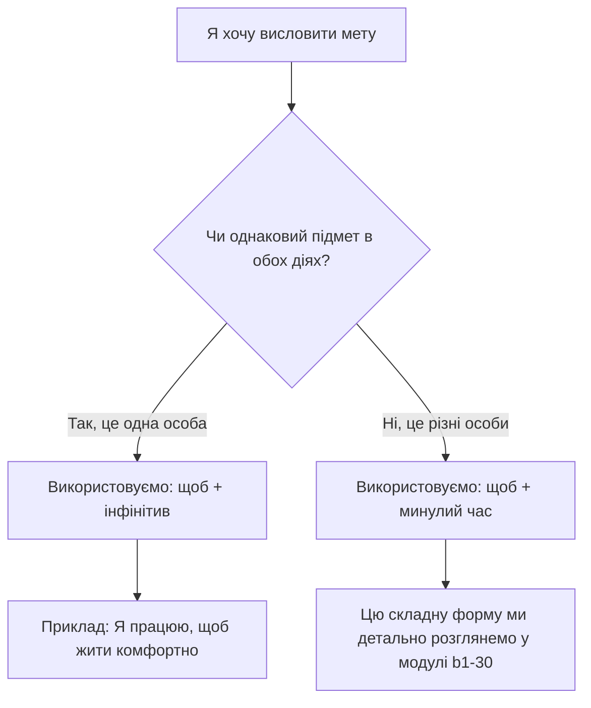

import Quiz from '@site/src/components/Quiz';
import MatchUp from '@site/src/components/MatchUp';
import FillIn from '@site/src/components/FillIn';
import TrueFalse from '@site/src/components/TrueFalse';
import Unjumble from '@site/src/components/Unjumble';
import GroupSort from '@site/src/components/GroupSort';
import Anagram from '@site/src/components/Anagram';
import ErrorCorrection, { ErrorCorrectionItem } from '@site/src/components/ErrorCorrection';
import Cloze from '@site/src/components/Cloze';
import Select from '@site/src/components/Select';
import Translate from '@site/src/components/Translate';
import MarkTheWords, { MarkTheWordsActivity } from '@site/src/components/MarkTheWords';
import HighlightMorphemes, { HighlightMorphemesActivity } from '@site/src/components/HighlightMorphemes';
import EssayResponse from '@site/src/components/EssayResponse';
import ComparativeStudy from '@site/src/components/ComparativeStudy';
import ReadingActivity from '@site/src/components/ReadingActivity';
import CriticalAnalysis from '@site/src/components/CriticalAnalysis';
import AuthorialIntent from '@site/src/components/AuthorialIntent';
import SourceEvaluation from '@site/src/components/SourceEvaluation';
import Debate from '@site/src/components/Debate';
import EtymologyTrace from '@site/src/components/EtymologyTrace';
import GrammarIdentify from '@site/src/components/GrammarIdentify';
import PaleographyAnalysis from '@site/src/components/PaleographyAnalysis';
import DialectComparison from '@site/src/components/DialectComparison';
import TranslationCritique from '@site/src/components/TranslationCritique';
import Transcription from '@site/src/components/Transcription';
import Observe from '@site/src/components/Observe';
import ActivityHelp from '@site/src/components/ActivityHelp';
import YouTubeVideo from '@site/src/components/YouTubeVideo';
import WatchAndRepeat from '@site/src/components/WatchAndRepeat';
import Classify from '@site/src/components/Classify';
import ImageToLetter from '@site/src/components/ImageToLetter';
import { Tabs, TabItem } from '@astrojs/starlight/components';

<Tabs syncKey="module-tab">
<TabItem label="Урок">

{/**/}

> **Чому це важливо?**
> Кожна наша дія має певну мету. Ми вивчаємо мови, працюємо над проєктами, подорожуємо країнами та спілкуємося з новими людьми. Усе це ми робимо для досягнення певного результату. Українська мова пропонує надзвичайно логічний і лаконічний спосіб вираження наміру, якщо ініціатор дії залишається незмінним. Сьогодні ми детально розглянемо, як ефективно та природно використовувати сполучник «щоб» разом із неозначеною формою дієслова. Це фундаментальна навичка, яка дозволить вам будувати складні речення швидко, впевнено та без жодних граматичних зайвостей.

## Вступ та діагностичний тест

### Оголошення політики повного занурення

Вітаємо вас на новому етапі нашого навчального курсу. Починаючи з цього граматичного модуля, ми свідомо переходимо до формату стовідсоткового занурення в українськомовне середовище. Що це означає на практиці? Відтепер усі теоретичні пояснення, аналіз текстів, інструкції до завдань та культурні коментарі будуть подаватися виключно українською мовою. Англійська мова з'являтиметься лише в дужках для швидкого перекладу нових базових термінів або специфічних концепцій, як-от **мета** (purpose) чи **намір** (intention). Цей підхід є надзвичайно ефективним. Він змушує ваш мозок адаптуватися до реальної структури мови, формуючи нові нейронні зв'язки. Ви поступово почнете мислити українськими категоріями, замість того щоб постійно перекладати кожне слово у своїй голові. Це необхідний етап для досягнення впевненого володіння мовою на рівні B1 і вище. Спочатку це може здатися складним викликом, але вже зовсім скоро ви відчуєте значний прогрес у своєму сприйнятті.

### Поняття мети та наміру

Перед тим як зануритися у синтаксичні правила, давайте проаналізуємо саму філософію цих понять. **Мета** (purpose) — це кінцевий результат, якого ми прагнемо досягти своїми діями. Коли ми говоримо про мету, ми завжди орієнтуємося на майбутнє. Ви зараз читаєте цей текст. Для чого? Який ваш головний намір? Ви робите це, щоб правильно говорити та писати українською мовою. Зверніть увагу, як ми елегантно об'єднали дві окремі думки в одну логічну структуру. Українська мова використовує спеціальні цільові сполучники, найпопулярнішим з яких є слово **«щоб»** (in order to). Цей сполучник будує міст між нашою поточною дією та тим результатом, який ми хочемо отримати згодом. Розуміння цієї базової філософської концепції є критично важливим фундаментом для побудови природних і грамотних складних речень.

:::note[📝 Термінологічний словник]
Запам'ятайте ключові терміни цього модуля: **інфінітив** (infinitive) — це неозначена форма дієслова, яка відповідає на питання «що робити?» або «що зробити?». Інфінітив є головним будівельним матеріалом для вираження мети, якщо дію виконує одна людина. У сучасній українській мові ця форма майже завжди має характерне закінчення «-ти» або «-ть», що робить її надзвичайно легкою для швидкого візуального розпізнавання у будь-якому складному тексті. Без глибокого розуміння цієї базової граматичної концепції подальше вивчення синтаксису буде неможливим, тому ми радимо завжди звертати особливу увагу на такі дієслова у повсякденному спілкуванні.
:::

### Діагностичне завдання для перевірки

Перед детальним вивченням граматичної теорії пропонуємо вам перевірити власну мовну інтуїцію. Прочитайте ці п'ять речень. У кожному з них є пропуск, де бракує одного слова. Ваше завдання — подумки обрати правильний варіант: сполучник факту «що» (that) або сполучник мети «щоб» (in order to). Не бійтеся зробити помилку, адже це лише перевірка вашого базового розуміння контексту.

1. Ми добре знаємо, ___ ви щодня читаєте новини.
2. Я слухаю українське радіо, ___ краще розуміти вимову.
3. Студенти відкрили словник, ___ знайти переклад цього слова.
4. Вона впевнено сказала, ___ завтра розпочнеться новий проєкт.
5. Вони приїхали до Києва, ___ відвідати історичну конференцію.

Проаналізуймо ваш вибір разом. Речення 1 та 4 констатують певний факт або передають чиїсь слова. У цих випадках ми обов'язково використовуємо нейтральний сполучник «що». Натомість речення 2, 3 та 5 пояснюють причину і мету нашої дії. Ми робимо щось для отримання конкретного результату. Саме тому тут ми вживаємо цільовий сполучник «щоб».

### Еталонний приклад із Державного стандарту

Для найкращого розуміння мовної норми ми завжди звертаємося до офіційних документів. Український Державний стандарт мовної компетенції пропонує кристально чистий приклад для ілюстрації цієї теми. Розглянемо таке речення: «Ми ходимо в музеї Львова, щоб краще знати історію цього старовинного міста». Це ідеальний класичний зразок складнопідрядного речення, яке виражає мету.

У цій фразі є головна частина: «Ми ходимо в музеї Львова». Вона описує нашу базову активність. Також тут є підрядна залежна частина: «щоб краще знати історію цього старовинного міста». Вона детально розкриває сенс нашої дії. Ці дві частини ідеально гармоніюють між собою завдяки сполучнику. Цей класичний приклад демонструє, як українська мова уникає важких повторень, створюючи легкий і ритмічний потік мовлення.

### Візуальний розбір синтаксичної структури

Давайте подивимося на цей державний стандарт через уявне збільшувальне скло. Проаналізуємо суб'єктів дії. Хто є головним діячем у першій частині? Це займенник першої особи множини «ми» (ми ходимо). Хто є діячем у другій частині, тобто хто саме буде краще знати історію? Це також ми. Ми бачимо, що це один і той самий суб'єкт.

Українська синтаксична традиція категорично не любить стилістичних повторень. Було б дуже неприродно сказати: «Ми ходимо, щоб ми знали». Замість цього мова пропонує елегантне скорочення. Ми залишаємо підмет лише в головній частині, а в частині мети використовуємо дієслово в неозначеній формі — **інфінітив**.
- Головна дія (хто і що робить): Ми ходимо.
- Сполучник наміру: щоб.
- Мета (неозначена форма): знати.
Результат злиття: Ми ходимо, щоб знати. Це правило є абсолютним фундаментом, який ви маєте засвоїти для вільного спілкування.

## Граматика: Конструкція «щоб + інфінітив»

### Правило однакового підмета

Найважливіше правило сьогоднішнього модуля, яке стане вашим дороговказом — це правило однакового підмета. Коли ми свідомо будуємо речення про наші плани чи цілі, ми повинні постійно аналізувати діячів. Якщо особа, яка виконує дію в головній частині речення, та особа, яка має отримати результат у цільовій частині, збігаються, ми зобов'язані використовувати конструкцію «щоб + інфінітив».

Вам не потрібно ще раз повторювати займенник чи іменник. Вам категорично не потрібно змінювати друге дієслово за особами чи числами. Ви просто ставите цільовий сполучник і одразу додаєте дієслово у його базовій словниковій формі (зазвичай із закінченням -ти).
*Приклад 1:* Я зараз читаю цю книгу. Я дуже хочу зрозуміти історію. -> Я читаю цю книгу, щоб зрозуміти історію.
*Приклад 2:* Вона купує квитки на потяг. Вона щиро планує поїхати до Одеси. -> Вона купує квитки на потяг, щоб поїхати до Одеси.
*Приклад 3:* Вони відкрили новий бізнес. Вони прагнуть стати фінансово незалежними. -> Вони відкрили новий бізнес, щоб стати фінансово незалежними.

:::tip[💡 Практична порада]
Якщо ви сумніваєтеся, яку форму використати, спробуйте подумки підставити займенник після сполучника. Якщо виходить «щоб я... я...», «щоб він... він...» — це сигнал тривоги. Негайно прибирайте другий займенник і ставте інфінітив. Цей простий ментальний трюк гарантовано врятує вас від найпоширеніших стилістичних помилок, які часто роблять іноземні студенти. Згодом ця перевірка стане абсолютно автоматичною, і ви навіть не будете помічати, як ваш мозок миттєво обирає правильну, елегантну форму для висловлення ваших щоденних планів та намірів.
:::

### Вибір виду дієслова: доконаний чи недоконаний

Інфінітив у цільових конструкціях може мати як доконаний вид (perfective aspect), так і недоконаний вид (imperfective aspect). Вибір виду залежить виключно від того, на чому ви хочете зробити смисловий акцент. Якщо ваша головна **ціль** (target) — це підкреслити остаточний результат дії або її одноразовість, ви сміливо обираєте доконаний вид.
*Приклад результату:* Ми зустрілися, щоб вирішити цю проблему. (Дія разова, ми очікуємо фінального результату).

Якщо ж ваш **намір** (intention) стосується тривалого процесу, регулярної повторюваності або насолоди від самої дії, вам знадобиться недоконаний вид.
*Приклад процесу:* Вони ходять до парку, щоб бігати та дихати свіжим повітрям. (Це регулярний процес, результат не є остаточним).
Розуміння цього нюансу робить вашу мову гнучкою і надзвичайно точною.

### Блок-схема вибору форми

Щоб полегшити складний процес граматичного вибору у вашій голові, ми пропонуємо просту алгоритмічну схему. Збережіть цей алгоритм у своїй пам'яті. Коли ви збираєтеся сказати складне речення про свої цілі, поставте собі одне ключове запитання.

Цей графічний алгоритм повинен стати вашим надійним рефлексом. Побачили однаковий підмет — одразу і без вагань обирайте неозначену форму.

### Синонімія: Сполучник «щоб»

Українська мова славиться своїм величезним синонімічним багатством. Проте сполучник «щоб» є абсолютним і беззаперечним лідером за частотністю у розмовній та літературній мові (він входить до Top 50 найуживаніших українських слів). Цей сполучник короткий, фонетично виразний і абсолютно нейтральний.

Ви можете використовувати його у будь-якій комунікативній ситуації: від легкої дружньої розмови в кав'ярні до надзвичайно серйозної презентації в раді директорів. Його фонетична вимова також має свої правила. Звук [ʃ] зливається зі звуком [t͡ʃ], формуючи специфічну африкату. Вимова [ʃt͡ʃɔb] вимагає активної артикуляції.
*Приклад 1:* Ми зібралися тут сьогодні, щоб детально обговорити наш проєкт.
*Приклад 2:* Вона часто телефонує батькам, щоб дізнатися останні сімейні новини.
Важливе правило пунктуації: перед сполучником ми обов'язково і завжди ставимо кому.

### Синонімія: Сполучник «аби»

Сполучник «аби» (in order to / only if) — це ваш найкращий інструмент для того, щоб зробити мову більш природною, стилістично багатою та по-справжньому літературною. Цей сполучник є абсолютним синонімом до слова «щоб». Використання слова «аби» у щоденному спілкуванні миттєво демонструє ваш високий і впевнений рівень володіння мовою.

Дуже часто цей сполучник має додатковий емоційний відтінок «тільки б», підкреслюючи сильне, непереборне бажання суб'єкта досягти результату. Класичні українські письменники постійно використовують цей сполучник для створення мелодійності.
*Приклад 1:* Я зроблю абсолютно все можливе, аби допомогти тобі в цій скрутній ситуації.
*Приклад 2:* Він свідомо приїхав на вокзал набагато раніше, аби не запізнитися на швидкісний потяг.
Це маленьке слово робить речення значно м'якшим, додаючи йому відчутної щирості.

:::info[ℹ️ Лінгвістичний факт]
У деяких західних діалектах української мови сполучник «аби» зустрічається значно частіше, ніж «щоб». Це пов'язано з давньою історією розвитку мови на цих територіях, де збереглося багато праслов'янських лексичних елементів. Наприклад, у карпатських селах ви постійно чутимете цей м'який сполучник у щоденних побутових розмовах місцевих жителів. Така унікальна регіональна специфіка робить українську мову надзвичайно багатою, живою та різноманітною, дозволяючи нам глибше розуміти історичні процеси формування нашої національної ідентичності через призму звичайної розмовної лексики.
:::

### Синонімія: Складений сполучник «для того щоб»

Якщо ви працюєте з документами, пишете офіційний лист, готуєте заяву або публікуєте наукову статтю, вам обов'язково знадобиться складений сполучник «для того щоб». Він чітко належить до офіційно-ділового та наукового стилю. Цей сполучник складається з трьох окремих слів і виконує важливу функцію логічного наголошення.

Він ніби звертає увагу слухача чи читача: «Увага, зараз я назву надзвичайно важливу, стратегічну мету нашої діяльності!».
*Приклад 1:* Уряд держави ухвалив цей новий закон, для того щоб підтримати економіку у кризовий період.
*Приклад 2:* Масштабне медичне дослідження проводиться, для того щоб знайти ефективні джерела енергії.
У звичайній розмовній мові ця триповерхова конструкція звучить занадто важко і штучно. Тому намагайтеся свідомо уникати її у щоденному неформальному спілкуванні зі знайомими.

| Сполучник | Стилістичне забарвлення | Частотність використання | Коли доцільно використовувати |
|-----------|-------------------------|--------------------------|-------------------------------|
| **щоб** | Абсолютно нейтральний | Дуже висока (Top 50) | Універсальний вибір для будь-якої життєвої ситуації. |
| **аби** | Літературно-розмовний | Висока | Розмови з друзями, література, для уникнення повторень. |
| **для того щоб**| Офіційно-діловий | Середня | Юридичні документи, ділові переговори, новини, звіти. |

### Позиція підрядного речення в синтаксисі

Де саме має стояти підрядна частина мети у структурі речення? Українська синтаксична традиція славиться своєю неймовірною гнучкістю. Найбільш стандартний і популярний варіант — це прямий порядок, коли частина мети йде після головної дії. Це логічно і просто.

Але це зовсім не єдиний можливий спосіб. Ми маємо повне право поставити мету на самий початок речення, якщо маємо намір зробити на ній максимальний смисловий акцент. Це дуже поширений і ефективний риторичний прийом у виступах та літературі.
*Приклад прямого порядку (в кінці):* Я щодня вивчаю програмування, щоб створити власну мобільну гру.
*Приклад риторичної інверсії (на початку):* Щоб створити власну мобільну гру, я щодня наполегливо вивчаю програмування.
*Приклад вбудовування (в середині):* Я, щоб створити власну мобільну гру, щодня вивчаю програмування. (Це рідкісний варіант, який використовується переважно в художній літературі).
Незалежно від позиції, пам'ятайте золоте правило: підрядна частина мети завжди і за будь-яких обставин відділяється комами з обох боків.

### Інтеграція з дієсловами руху

У нашому попередньому граматичному модулі (b1-16) ми надзвичайно детально розглядали систему дієслів руху. Тепер настав ідеальний час, аби об'єднати ці знання з новою темою. Згадайте своє життя: дуже часто ми кудись ідемо, біжимо або їдемо саме для того, щоб виконати певне завдання. Конструкція «дієслово руху + сполучник щоб + інфінітив» є однією з найпоширеніших у повсякденній українській мові.

*Приклад 1:* Я швидко йду в найближчий супермаркет, щоб купити свіжий хліб і молоко для сніданку.
*Приклад 2:* Вони з радістю поїхали у високі гори, щоб покататися на лижах і відпочити від міста.
*Приклад 3:* Ми зараз швидко біжимо на центральний стадіон, щоб встигнути на початок футбольного матчу.

Така цільова структура звучить набагато природніше і красивіше, ніж пояснення через причину («Я йду в супермаркет, бо мені треба купити...»). Регулярне використання цих цільових конструкцій робить ваше мовлення динамічним, дорослим і впевненим.

## 🏺 Культура та стійкість

### Життя та боротьба Лесі Українки

Для того щоб по-справжньому глибоко відчути дух української мови, ми маємо звернутися до класичної літератури. Поетеса Леся Українка — це не просто видатна авторка, це масштабний національний символ української стійкості, інтелекту та незламності. Її поезія є глибоко філософською. Вона дуже часто використовує складні, багаторівневі синтаксичні конструкції для тонкої передачі психологічних станів людини.

Однією з центральних тем усієї її творчості є унікальна здатність особистості долати фізичний і моральний біль через неймовірну силу волі. Леся Українка хворіла на тяжку хворобу з дитинства, тому тема подолання страждань була для неї особистою. Її поетична мова завжди точна, гостра, як лезо, і граматика тут відіграє визначальну роль у створенні цього ефекту.

### Аналіз вірша «Як дитиною, бувало...»

Розглянемо детальніше знаменитий вірш Лесі Українки «Як дитиною, бувало...», який був написаний у 1897 році. Цей текст є абсолютно хрестоматійним прикладом використання так званої заперечної мети (negative purpose). Поетеса емоційно згадує власне дитинство. Вона описує моменти, коли падала, відчувала сильний фізичний біль, але силою характеру не дозволяла собі плакати перед іншими.

Вона пише геніальний рядок: **«Щоб не плакать, я сміялась»**.
Тут ми яскраво бачимо конструкцію «щоб + не + інфінітив» (слово «плакать» — це специфічна поетична, скорочена форма від стандартного інфінітива «плакати»). Мета її сміху чітко визначена — уникнути гірких сліз. Підмет в обох частинах речення один — займенник «я».

Набагато пізніше, вже наприкінці свого складного життя, поетеса трагічно змінює цю життєву формулу: **«Плачу я, щоб не сміятись»**. Ця композиційна симетрія та віртуозне використання інфінітивних конструкцій мети створює неймовірно потужний, глибокий художній образ, який вражає читачів уже понад століття.

:::note[📜 Рядки, що формують націю]
«Щоб не плакать, я сміялась.» — Леся Українка. Ця видатна фраза давно стала крилатою в українській культурі. Її дуже часто цитують для опису тих складних життєвих ситуацій, коли людина свідомо приховує свої справжні важкі почуття за оптимістичною усмішкою, демонструючи справжню силу свого характеру. Цей короткий рядок геніально ілюструє, як граматична конструкція здатна передати неймовірну психологічну напругу та життєву філософію, перетворюючи звичайні слова на потужний символ незламності цілого народу.
:::

### Етика праці у народній мудрості

Багата українська народна мудрість має тисячі прислів'їв, які ідеально ілюструють складні граматичні правила. Одне з найпопулярніших звучить так: **«Щоб рибу їсти, треба у воду лізти»**. Давайте зробимо синтаксичний розбір цього виразу. Головна частина речення тут — «треба у воду лізти» (тобто необхідно докласти реальних фізичних зусиль). Підрядна частина мети — «щоб рибу їсти».

Зверніть увагу, що мета свідомо стоїть на самому початку речення для максимального підсилення логічного акценту. Суб'єкт тут максимально узагальнений (це стосується будь-якої людини). Це давнє прислів'я яскраво показує традиційну українську етику праці: хороший результат (смачна риба) є абсолютно неможливим без наполегливих зусиль (дискомфортне лізіння у холодну воду). Це бездоганний приклад конструкції «щоб + інфінітив» у повсякденному живому спілкуванні.

### Віртуальна подорож музеями Львова: Національний музей

А тепер ми застосуємо наші теоретичні знання на реальній практиці у формі змістовної розповіді. Місто Львів — це справжній музей просто неба. Щороку сюди приїжджають сотні тисяч туристів з усього світу. Вони роблять це, щоб відчути неповторну атмосферу старовини. Ми з вами також вирушаємо на історичну площу Ринок, аби відвідати видатні пам'ятки архітектури.

Спочатку ми впевнено прямуємо в Національний музей імені Андрея Шептицького. Наша головна мета — побачити унікальні давні ікони. Ми купуємо дорогі вхідні квитки, щоб фінансово підтримати українську культуру. Кваліфікований екскурсовод розповідає цікаві, невідомі факти, для того щоб ми краще зрозуміли складний контекст тієї далекої епохи. Кожен експонат тут ретельно зберігається, аби майбутні покоління знали історію.

### Віртуальна подорож музеями Львова: Міський арсенал

Після цього музею ми неспішно прямуємо до знаменитого міського Арсеналу. Там зараз зберігається надзвичайно велика і цінна колекція середньовічної зброї. Професійні реставратори щодня важко і монотонно працюють у підвалах, щоб зберегти ці металеві артефакти від руйнівного впливу часу. Ми робимо дуже багато яскравих фотографій, аби потім показати їх нашим друзям у соціальних мережах.

Ми уважно розглядаємо кожен старовинний меч, щоб уявити, як жили люди багато століть тому. У цьому короткому описовому тексті ми дуже природно використали всі три вивчені сполучники (щоб, аби, для того щоб) та суворо дотрималися базового правила однакового підмета.

:::note[🏺 Культурна зупинка]
Музей «Арсенал» у Львові — це набагато більше, ніж просто виставка старої зброї. Це справжня колишня фортифікаційна споруда, побудована у шістнадцятому столітті. Сучасні співробітники цього музею регулярно організовують інтерактивні лицарські турніри, щоб привернути активну увагу молоді до національної історії. Вони працюють над цим дуже **цілеспрямовано** (purposefully). Кожен відвідувач може відчути себе справжнім середньовічним воїном, торкаючись холодного металу старовинних мечів та слухаючи захопливі легенди про героїчні битви минулого, які назавжди змінили хід європейської історії.
:::

## Аналіз помилок та Практика

### Типова помилка №1: Надлишкова кон'югація дієслова

Однією з найбільш поширених і помітних помилок серед іноземців, які інтенсивно вивчають українську мову, є спроба змінити друге дієслово за особами, навіть коли підмет в обох частинах речення один. Учні дуже часто будують речення за звичною логікою своєї рідної мови. Вони невпевнено кажуть: «Я йду у продуктовий магазин, щоб я купив свіже молоко». Це серйозна стилістична і граматична помилка, яку ми в лінгвістиці називаємо надлишковою кон'югацією (тобто надмірним і непотрібним відмінюванням дієслова).

Українська мова понад усе цінує раціональну економію мовленнєвих зусиль. Якщо ви вже чітко сказали «я» на початку фрази, система не потребує його дублювання.
**Неправильно:** Вона вчора прийшла до нас, щоб вона допомогла.
**Правильно:** Вона вчора прийшла до нас, щоб допомогти.
Запам'ятайте це назавжди: однаковий підмет безальтернативно вимагає інфінітива без жодних додаткових займенників після слова «щоб».

### Типова помилка №2: Невідповідність підметів у складних конструкціях

Іноді дуже старанні учні роблять абсолютно протилежну помилку: вони починають автоматично використовувати інфінітив там, де підмети у двох частинах речення є різними. Це типово трапляється, коли людина заучує зручну конструкцію механічно, без глибокого розуміння логіки.

Наприклад, студент має намір висловити думку: «I strongly want you to read this new book». Він дослівно перекладає це як: «Я дуже хочу, щоб ти читати цю нову книгу». Це справжній граматичний колапс. Проаналізуймо його. У першій частині речення підмет — це «я» (я хочу). А у другій частині дію має виконати «ти» (ти читаєш). Підмети різні! У такому випадку ми категорично НЕ маємо права використовувати неозначену форму. Нам обов'язково потрібне дієслово у формі минулого часу: «Я дуже хочу, щоб ти прочитав цю нову книгу». Цю складну, але важливу структуру ми будемо дуже детально і глибоко вивчати вже у наступному модулі. Зараз ваша головна ціль — навчитися чітко розпізнавати збіг або невідповідність підметів.

### Типова помилка №3: Лексична інтерференція та калька

Ця помилка не стосується граматики, вона стосується безпосередньо вашого словникового запасу. Вона виникає через агресивний вплив інших мовних систем, що створює явище, яке ми називаємо суржиком (сумішшю мов). У непрофесійному середовищі ви можете інколи почути штучний вираз «переслідувати мету». Це пряма і дуже неякісна калька із чужої мовної традиції. В українській концепції світу мета — це не якийсь небезпечний злочинець, її абсолютно не треба агресивно переслідувати.

Для красивого і правильного вираження наміру українська літературна мова має свої чудові, автентичні вирази:
- **мати на меті** (буквально: to have in purpose)
- **ставити за мету** (буквально: to set as a purpose)
**Неправильно:** Цей великий проєкт постійно переслідує мету значно покращити сільську освіту.
**Правильно:** Цей великий проєкт має на меті значно покращити сільську освіту.

:::warning[⚠️ Уникайте лексичного суржику]
Зверніть увагу на слово «ціль». В українській мові воно частіше має дуже конкретне, фізичне значення (наприклад, мішень для стрільби у спорті або військова ціль на полі бою). Коли ми серйозно говоримо про абстрактні життєві наміри в кар'єрі чи роботі, значно краще і правильніше використовувати абстрактне слово «мета» (purpose). Свідомий і правильний вибір лексики демонструє ваш високий рівень освіченості та глибоку повагу до автентичних традицій українського слововживання, допомагаючи уникати впливу російськомовних кальок у вашому професійному спілкуванні.
:::

### Міні-діалог 1: Планування завдань на роботі

Давайте подивимося, як ці синтаксичні конструкції органічно працюють у реальному щоденному спілкуванні. Уявіть типову ділову ситуацію в сучасному офісі.

— Олено, ти маєш вільну хвилину зараз? Я щойно зайшов до твого кабінету, **щоб обговорити** наш складний новий проєкт.

— Так, звичайно, заходь. Я якраз роздрукувала ці важливі документи, **щоб показати** тобі останні фінансові звіти компанії.

— Це чудово. Наша команда повинна працювати максимально сфокусовано, **аби досягти** потрібних економічних результатів до кінця поточного місяця. Наш головний **намір** — успішно завершити першу фазу тестування продукту.

— Я повністю згодна з тобою. Я вже призначила онлайн-зустріч із розробниками, **для того щоб узгодити** всі дрібні технічні деталі нашої співпраці.

### Міні-діалог 2: Підготовка до спортивних змагань

Спорт — це специфічна сфера людської діяльності, де слово «ціль» та концепція досягнення мети є надзвичайно важливими елементами мотивації.

— Максиме, поясни мені, навіщо ти так виснажливо тренуєшся п'ять разів на тиждень?

— Я зараз інтенсивно бігаю щоранку, **щоб підготуватися** до великого осіннього марафону в Києві. Пробігти його — це моя головна **ціль** на цей календарний рік.

— Це вимагає надзвичайно багато фізичних зусиль. Ти дотримуєшся якоїсь спеціальної спортивної дієти?

— Так, я кардинально змінив свій щоденний раціон, **аби мати** значно більше енергії для подолання довгих дистанцій. Я завжди намагаюся бути дуже **цілеспрямованим** спортсменом.

### Міні-діалог 3: Навчання та академічні дослідження

Ще один дуже життєвий приклад зі щоденного студентського життя в університеті.

— Привіт, Андрію! Ти зараз ідеш прямо до головної бібліотеки?

— Привіт, Маріє. Так, я цілеспрямовано йду туди, **щоб знайти** необхідні архівні матеріали для своєї курсової роботи з історії України.

— Я теж туди планую йти. Мені треба уважно прочитати кілька старих наукових журналів, **щоб зібрати** статистичні дані для соціологічного дослідження. Я серйозно **маю намір** закінчити чорновий текст до цієї п'ятниці.

— Тоді працюймо сьогодні разом в одному залі, **аби не відволікатися** на зайві розмови та шум у нашому студентському гуртожитку.

### Вправа на трансформацію стилю тексту

Часто в офіційних телевізійних новинах або бюрократичних текстах речення звучать занадто важко і штучно. У невимушеній повсякденній розмові ми постійно спрощуємо їх. Давайте зараз попрактикуємося перетворювати сухий офіційний стиль на живий розмовний, замінюючи важкі сполучники та гнучко адаптуючи лексику.

1. *Офіційно:* Дирекція підприємства організувала додаткові освітні курси, **для того щоб підвищити** професійну кваліфікацію своїх постійних працівників.
*Розмовно:* Дирекція організувала ці курси, **щоб покращити** робочі навички людей.

2. *Офіційно:* Усі громадяни республіки повинні своєчасно подати відповідні заяви, **для того щоб отримати** гарантовану державою соціальну допомогу.
*Розмовно:* Люди мають швидко подати ці заяви, **аби взяти** свої соціальні гроші.

3. *Офіційно:* Експертна комісія терміново зібралася на засідання, **для того щоб вирішити** це надзвичайно нагальне економічне питання.
*Розмовно:* Комісія зібралася сьогодні, **щоб швидко розібратися** з цією складною проблемою.

Ця корисна практична навичка стилістичної трансформації гарантовано дозволить вам звучати максимально природно і доречно у будь-якій життєвій ситуації.

:::note[Мова як простір свободи]
Спрощення канцелярського стилю (відмова від важких конструкцій типу «для того щоб» на користь легких «аби» чи «щоб») є частиною деколонізації мислення. Бюрократична мова радянського зразка була створена для ускладнення розуміння. Сучасна українська мова прагне до прозорості, легкості та щирості у спілкуванні між людьми. Цей перехід від штучного академізму до природної простоти відображає ширші суспільні зміни в Україні, де кожна людина має право говорити вільно, красиво та без жодних нав'язаних імперських стереотипів чи обмежень.
:::

## 📋 Підсумок та застосування

### Коли використовувати інфінітив: Зведена таблиця

Ми пройшли довгий і дуже насичений шлях у цьому граматичному модулі. Головне фундаментальне правило, яке ви повинні назавжди інтегрувати у своє щоденне мовлення — це обов'язкова перевірка підмета. Конструкція «щоб + інфінітив» є елегантною, короткою та надзвичайно ефективною. Проте вона категорично вимагає однакового суб'єкта для обох описаних дій.

Якщо ви йдете до книжкового магазину, і саме ви ж купуєте там нову книгу, сміливо і без вагань використовуйте неозначену форму. Якщо ж ви дуже хочете, щоб цю книгу купив ваш знайомий друг — тут вам потрібна абсолютно інша граматична структура. З цією новою формою ми детально познайомимося зовсім скоро. Цей матеріал слугує надійним логічним містком до нашої наступної теми у модулі b1-30.

| Ситуація | Підмет 1 | Підмет 2 | Формула | Правильний приклад |
|----------|----------|----------|---------|--------------------|
| Одна особа діє | Я (роблю) | Я (отримаю) | щоб + інфінітив | Я читаю статтю, щоб знати. |
| Різні особи діють | Я (хочу) | Ти (зробиш) | щоб + минулий час | Я хочу, щоб ти знав. |

### Як перевірити себе: Контрольні питання

Щоб остаточно переконатися, що ви глибоко засвоїли весь наданий теоретичний матеріал, дайте чесні відповіді на ці короткі контрольні питання.

**Перевірте себе:**
1. Який цільовий сполучник є найбільш стилістично нейтральним та поширеним у повсякденній українській мові?
2. Яка саме форма дієслова завжди використовується після сполучника «щоб», якщо дію виконує одна й та сама особа?
3. Чим суттєво відрізняються слова «мета» та «ціль» у контексті їхнього практичного використання в житті?
4. Знайдіть грубу помилку у цьому реченні: «Він багато працює, щоб він заробив гроші». Як її правильно виправити?
5. Наведіть з пам'яті класичний приклад заперечної мети (з використанням частки «не») із творчості Лесі Українки.

### Творче завдання: Комунікативна практика

Тепер настав ідеальний час для вашої самостійної творчої роботи. Практика — це єдиний надійний шлях до вільного і природного спілкування. Ваше індивідуальне завдання: напишіть 5-7 повноцінних, розгорнутих речень про вашу особисту мету вивчення української мови.

У своєму тексті обов'язково використайте такі ключові елементи:
- Автентичний вираз «мати на меті» або «ставити за мету» у правильній формі.
- Конструкцію «щоб + інфінітив» (наприклад: щоб слухати подкасти, щоб вільно спілкуватися з колегами).
- Літературний сполучник «аби» для уникнення монотонних повторень.
- Слово «намір» (intention) у відповідному відмінку.

Намагайтеся не перекладати фрази зі своєї рідної мови, а одразу конструювати думки українською. Суворо дотримуйтеся головного правила однакового підмета.

### Рекомендації автентичних ресурсів

Для того щоб суттєво поглибити ваші теоретичні знання та по-справжньому відчути красу живої мови, ми наполегливо рекомендуємо регулярно звертатися до оригінальних українських текстів.

1. Знайдіть в інтернеті та вдумливо прочитайте повний текст геніального вірша Лесі Українки «Як дитиною, бувало...». Зверніть особливу увагу на його ритм та віртуозне використання цільових конструкцій.
2. Знайдіть і прочитайте коротку краєзнавчу статтю про багату історію міста Львова або про Національний музей імені Андрея Шептицького на порталі локальної історії. Виписуйте у зошит ті речення, де автори майстерно використовують слова «щоб», «аби» та «для того щоб».

Занурення в реальний, якісний культурний продукт гарантовано допоможе вам закріпити граматику абсолютно природним шляхом, без нудного механічного заучування правил.

:::info[🤔 Роздуми про мовну мелодику]
Українська мова має одну надзвичайно виразну рису — високу милозвучність. Постійне чергування синонімічних слів «щоб» та «аби» дуже допомагає уникнути фонетичної монотонності та робить будь-який текст живим і ритмічним. Завжди звертайте свідому увагу на цю унікальну мелодику, коли ви уважно слухаєте сучасні українські пісні, подкасти або переглядаєте вечірні новини. Спробуйте самостійно аналізувати, як відомі журналісти та письменники свідомо комбінують ці сполучники, створюючи справжні музичні шедеври зі звичайних слів у щоденному комунікативному потоці.
:::

</TabItem>
<TabItem label="Словник">

| Слово | Вимова | Переклад | ЧМ | Примітка |
| --- | --- | --- | --- | --- |
| **щоб** |  | in order to, so that | conjunction |  |
| **для того щоб** |  | in order to (formal) | conjunction |  |
| **аби** |  | in order to, only if | conjunction |  |
| **мета** |  | purpose, goal | ім |  |
| **ціль** |  | aim, target | ім |  |
| **намір** |  | intention | ім |  |
| **інфінітив** |  | infinitive | ім |  |
| **причина** |  | reason, cause | ім |  |
| **задля** |  | for the sake of | preposition |  |
| **заради** |  | for the sake of | preposition |  |
| **цілеспрямований** |  | purposeful, focused | adjective |  |
| **навмисно** |  | intentionally, deliberately | adverb |  |
| **досягати** |  | to achieve, to reach | дієсл |  |
| **результат** |  | result | ім |  |
| **прагнути** |  | to strive, to desire | дієсл |  |
| **занурення** |  | immersion | ім |  |
| **середовище** |  | environment | ім |  |
| **вирішувати** |  | to solve, to decide | дієсл |  |
| **дія** |  | action | ім |  |
| **суб'єкт** |  | subject (actor) | ім |  |
| **підмет** |  | subject (grammar) | ім |  |
| **доконаний вид** |  | perfective aspect | фраза |  |
| **недоконаний вид** |  | imperfective aspect | фраза |  |
| **офіційно-діловий** |  | official business (style) | adjective |  |
| **стійкість** |  | resilience, stability | ім |  |
| **переслідувати** |  | to pursue, to chase | дієсл |  |
| **збігатися** |  | to coincide | дієсл |  |
| **заперечний** |  | negative (grammar) | adjective |  |
| **прислів'я** |  | proverb | ім |  |
| **зусилля** |  | effort | ім |  |

</TabItem>
<TabItem label="Вправи">

### Вибір сполучника та форми дієслова

<FillIn client:load items={JSON.parse(`[{"sentence": "Ми вивчаємо граматику, _____ краще розуміти структуру мови.", "answer": "щоб", "options": ["щоб", "що", "ніби", "ніж"]}, {"sentence": "Вона прийшла до бібліотеки, щоб _____ нову книгу.", "answer": "взяти", "options": ["взяти", "взяла", "брала", "бере"]}, {"sentence": "Я дуже хочу, _____ ти прочитав цю статтю.", "answer": "щоб", "options": ["щоб", "аби", "що", "як"]}, {"sentence": "Студенти відкрили словники, _____ знайти переклад.", "answer": "аби", "options": ["аби", "або", "що", "чи"]}, {"sentence": "Уряд ухвалив закон, _____ підтримати економіку країни.", "answer": "для того щоб", "options": ["для того щоб", "за те що", "тому що", "через те що"]}, {"sentence": "Він щодня тренується, _____ виграти змагання.", "answer": "щоб", "options": ["щоб", "бо", "тому", "що"]}, {"sentence": "Вони поїхали в гори, щоб _____ на лижах.", "answer": "покататися", "options": ["покататися", "покаталися", "катаються", "каталися"]}, {"sentence": "Щоб _____ рибу, треба у воду лізти.", "answer": "їсти", "options": ["їсти", "з'їв", "їв", "їсть"]}]`)} />

### Виправте граматичні помилки

<ErrorCorrection client:load>
  <ErrorCorrectionItem sentence="Я йду в супермаркет, щоб я купив свіжий хліб." errorWord="я купив" correctForm="купити" options={JSON.parse(`["купити", "купую", "купував", "купить"]`)} explanation="Якщо підмет однаковий, використовуємо інфінітив без займенника." />
  <ErrorCorrectionItem sentence="Вона приїхала до Києва, щоб вона відвідала конференцію." errorWord="вона відвідала" correctForm="відвідати" options={JSON.parse(`["відвідати", "відвідує", "відвідає", "відвідувала"]`)} explanation="Правило однакового підмета вимагає інфінітива." />
  <ErrorCorrectionItem sentence="Цей проєкт переслідує мету покращити освіту." errorWord="переслідує мету" correctForm="має на меті" options={JSON.parse(`["має на меті", "шукає ціль", "йде за метою", "біжить до мети"]`)} explanation="Переслідувати мету — це калька. Правильно українською: мати на меті." />
  <ErrorCorrectionItem sentence="Ми зібралися тут, щоб ми обговорили наші плани." errorWord="ми обговорили" correctForm="обговорити" options={JSON.parse(`["обговорити", "обговорюємо", "обговоримо", "обговорювали"]`)} explanation="Займенник ми дублювати не потрібно. Використовуйте неозначену форму дієслова." />
  <ErrorCorrectionItem sentence="Вони багато працюють, щоб вони стали незалежними." errorWord="вони стали" correctForm="стати" options={JSON.parse(`["стати", "стають", "стануть", "ставали"]`)} explanation="Один підмет означає використання інфінітива в підрядній частині." />
  <ErrorCorrectionItem sentence="Студент відкрив книгу, щоб він прочитав текст." errorWord="він прочитав" correctForm="прочитати" options={JSON.parse(`["прочитати", "прочитає", "читає", "прочитав"]`)} explanation="Особа, яка відкрила книгу і яка буде читати, — одна й та сама. Потрібен інфінітив." />
</ErrorCorrection>

### Складіть речення з конструкцією мети

<Unjumble client:load items={JSON.parse(`[{"jumbled": "я / читаю / книги / щоб / розуміти / історію", "answer": "Я читаю книги щоб розуміти історію"}, {"jumbled": "вони / поїхали / в / гори / аби / відпочити", "answer": "Вони поїхали в гори аби відпочити"}, {"jumbled": "щоб / рибу / їсти / треба / у / воду / лізти", "answer": "Щоб рибу їсти треба у воду лізти"}, {"jumbled": "ми / зустрілися / сьогодні / щоб / вирішити / проблему", "answer": "Ми зустрілися сьогодні щоб вирішити проблему"}, {"jumbled": "я / слухаю / радіо / щоб / краще / розуміти / вимову", "answer": "Я слухаю радіо щоб краще розуміти вимову"}, {"jumbled": "він / тренується / щодня / щоб / виграти / змагання", "answer": "Він тренується щодня щоб виграти змагання"}]`)} />

### Знайдіть логічне продовження

<MatchUp client:load pairs={JSON.parse(`[{"left": "Ми вивчаємо нові слова,", "right": "щоб вільно спілкуватися."}, {"left": "Я поставив будильник на сьому ранку,", "right": "аби не запізнитися на потяг."}, {"left": "Вони відкрили новий бізнес,", "right": "щоб стати фінансово незалежними."}, {"left": "Уряд ухвалив закон,", "right": "для того щоб підтримати економіку."}, {"left": "Вона часто телефонує батькам,", "right": "щоб дізнатися останні новини."}, {"left": "Я швидко йду в магазин,", "right": "щоб купити свіжий хліб."}, {"left": "Леся Українка сміялася,", "right": "щоб не плакати."}, {"left": "Ми ходимо в музеї Львова,", "right": "щоб краще знати історію."}]`)} />

### Перевірка теоретичних знань

<Quiz client:load questions={JSON.parse(`[{"question": "Коли ми обов'язково використовуємо інфінітив після сполучника щоб?", "options": [{"text": "Коли підмет у головній і підрядній частинах однаковий.", "correct": true}, {"text": "Коли підмети у двох частинах речення різні.", "correct": false}, {"text": "Тільки коли ми говоримо про майбутній час.", "correct": false}, {"text": "Тільки в офіційно-діловому стилі.", "correct": false}], "explanation": "Правило однакового підмета вимагає вживання неозначеної форми дієслова."}, {"question": "Який сполучник мети вважається найбільш нейтральним і універсальним?", "options": [{"text": "щоб", "correct": true}, {"text": "аби", "correct": false}, {"text": "для того щоб", "correct": false}, {"text": "тому що", "correct": false}], "explanation": "Сполучник щоб є абсолютним лідером за частотністю і підходить для будь-яких ситуацій."}, {"question": "Який стилістичний відтінок має складений сполучник для того щоб?", "options": [{"text": "Офіційно-діловий та науковий.", "correct": true}, {"text": "Розмовний та дружній.", "correct": false}, {"text": "Поетичний та художній.", "correct": false}, {"text": "Діалектний та застарілий.", "correct": false}], "explanation": "Складений сполучник використовується для логічного наголошення в офіційних документах."}, {"question": "Як правильно сказати українською мовою замість кальки переслідувати мету?", "options": [{"text": "мати на меті", "correct": true}, {"text": "шукати ціль", "correct": false}, {"text": "ловити мету", "correct": false}, {"text": "бігти за метою", "correct": false}], "explanation": "Автентичний український вираз — мати на меті або ставити за мету."}, {"question": "Де в реченні може стояти підрядна частина мети?", "options": [{"text": "На початку, всередині або в кінці речення.", "correct": true}, {"text": "Тільки в самому кінці речення.", "correct": false}, {"text": "Тільки перед головною частиною.", "correct": false}, {"text": "Тільки всередині головної частини.", "correct": false}], "explanation": "Український синтаксис гнучкий, проте найчастіше мета стоїть після головної дії."}, {"question": "Що означає українське народне прислів'я щоб рибу їсти треба у воду лізти?", "options": [{"text": "Хороший результат неможливий без зусиль.", "correct": true}, {"text": "Рибу можна зловити тільки руками.", "correct": false}, {"text": "Плавання дуже корисне для здоров'я.", "correct": false}, {"text": "У воду краще не лізти без причини.", "correct": false}], "explanation": "Це прислів'я ілюструє українську етику праці: успіх вимагає важкої роботи."}, {"question": "Яке слово краще використовувати для абстрактних життєвих намірів?", "options": [{"text": "мета", "correct": true}, {"text": "ціль", "correct": false}, {"text": "мішень", "correct": false}, {"text": "кінець", "correct": false}], "explanation": "Слово ціль частіше вживається у спорті чи військовій справі, а для життєвих планів краще підходить мета."}, {"question": "Який розділовий знак завжди ставиться перед цільовим сполучником щоб?", "options": [{"text": "кома", "correct": true}, {"text": "тире", "correct": false}, {"text": "крапка з комою", "correct": false}, {"text": "двокрапка", "correct": false}], "explanation": "Підрядна частина мети завжди відокремлюється комою."}]`)} />

### Правда чи хиба?

<TrueFalse client:load items={JSON.parse(`[{"statement": "Якщо підмети в головній та підрядній частинах збігаються, дієслово після щоб ставиться в неозначеній формі.", "isTrue": true, "explanation": "Це головне правило конструкції мети з одним суб'єктом."}, {"statement": "Сполучники щоб та аби є абсолютними синонімами.", "isTrue": true, "explanation": "Так, вони взаємозамінні, хоча аби звучить більш літературно і м'яко."}, {"statement": "Речення Я йду в магазин, щоб я купив хліб є граматично правильним.", "isTrue": false, "explanation": "Займенник я дублювати не потрібно. Правильно: Я йду, щоб купити хліб."}, {"statement": "Слово інфінітив означає дієслово в минулому часі.", "isTrue": false, "explanation": "Інфінітив — це неозначена форма дієслова, яка відповідає на питання що робити/що зробити."}, {"statement": "В українській мові слово ціль краще використовувати для спортивних результатів, а мета — для життєвих планів.", "isTrue": true, "explanation": "Це стилістичний нюанс української лексики."}, {"statement": "Підрядна частина зі сполучником щоб може стояти на початку речення.", "isTrue": true, "explanation": "Наприклад: Щоб створити гру, я щодня вивчаю програмування."}, {"statement": "Для вираження мети можна використовувати дієслова тільки доконаного виду.", "isTrue": false, "explanation": "Можна використовувати обидва види. Вибір залежить від того, чи важливий результат, чи процес."}, {"statement": "Для того щоб є розмовним сполучником, який часто використовується з друзями.", "isTrue": false, "explanation": "Це складений сполучник офіційно-ділового стилю, він звучить важко у звичайній розмові."}]`)} />

### Переклад цільових конструкцій

<Translate client:load questions={JSON.parse(`[{"source": "I study Ukrainian in order to communicate with friends.", "options": [{"text": "Я вивчаю українську, щоб спілкуватися з друзями.", "correct": true}, {"text": "Я вивчаю українську, що спілкуватися з друзями.", "correct": false}, {"text": "Я вивчаю українську, щоб я спілкувався з друзями.", "correct": false}, {"text": "Я вивчаю українську, бо спілкуватися з друзями.", "correct": false}]}, {"source": "We went to the mountains to ski.", "options": [{"text": "Ми поїхали в гори, щоб покататися на лижах.", "correct": true}, {"text": "Ми поїхали в гори, для покататися на лижах.", "correct": false}, {"text": "Ми поїхали в гори, щоб ми покаталися на лижах.", "correct": false}, {"text": "Ми поїхали в гори, що кататися на лижах.", "correct": false}]}, {"source": "She opened the dictionary to find the word.", "options": [{"text": "Вона відкрила словник, щоб знайти слово.", "correct": true}, {"text": "Вона відкрила словник, щоб вона знайшла слово.", "correct": false}, {"text": "Вона відкрила словник, аби знаходить слово.", "correct": false}, {"text": "Вона відкрила словник, що знайти слово.", "correct": false}]}, {"source": "They work hard in order to become independent.", "options": [{"text": "Вони багато працюють, щоб стати незалежними.", "correct": true}, {"text": "Вони багато працюють, щоб вони стали незалежними.", "correct": false}, {"text": "Вони багато працюють, стати незалежними.", "correct": false}, {"text": "Вони багато працюють, бо стати незалежними.", "correct": false}]}, {"source": "The government passed a law to support the economy.", "options": [{"text": "Уряд ухвалив закон, для того щоб підтримати економіку.", "correct": true}, {"text": "Уряд ухвалив закон, щоб підтримав економіку.", "correct": false}, {"text": "Уряд ухвалив закон, для підтримати економіку.", "correct": false}, {"text": "Уряд ухвалив закон, аби підтримує економіку.", "correct": false}]}, {"source": "I am running every morning to prepare for the marathon.", "options": [{"text": "Я бігаю щоранку, щоб підготуватися до марафону.", "correct": true}, {"text": "Я бігаю щоранку, щоб я підготувався до марафону.", "correct": false}, {"text": "Я бігаю щоранку, що підготуватися до марафону.", "correct": false}, {"text": "Я бігаю щоранку, підготуватися до марафону.", "correct": false}]}]`)} />

### Вибір граматично правильних речень

<Select client:load questions={JSON.parse(`[{"question": "Які з цих речень правильно виражають мету?", "options": [{"text": "Я йду в магазин, щоб купити хліб.", "correct": true}, {"text": "Вона приїхала, аби допомогти нам.", "correct": true}, {"text": "Я йду в магазин, щоб я купив хліб.", "correct": false}, {"text": "Вона приїхала, щоб вона допомогла нам.", "correct": false}], "explanation": "Правило однакового підмета вимагає інфінітива без дублювання займенника."}, {"question": "Які речення містять правильні синоніми до щоб?", "options": [{"text": "Ми зібралися, аби обговорити плани.", "correct": true}, {"text": "Комісія засідала, для того щоб ухвалити рішення.", "correct": true}, {"text": "Він зателефонував, ніби запитати про здоров'я.", "correct": false}, {"text": "Ми прийшли, що подивитися фільм.", "correct": false}], "explanation": "Аби та для того щоб є правильними синонімами для вираження мети."}, {"question": "Які варіанти є правильними українськими виразами?", "options": [{"text": "мати на меті", "correct": true}, {"text": "ставити за мету", "correct": true}, {"text": "переслідувати мету", "correct": false}, {"text": "йти за ціллю", "correct": false}], "explanation": "Переслідувати мету — це калька з російської."}, {"question": "Які речення мають правильний порядок слів?", "options": [{"text": "Щоб стати лікарем, він багато вчиться.", "correct": true}, {"text": "Він багато вчиться, щоб стати лікарем.", "correct": true}, {"text": "Він щоб стати лікарем багато вчиться.", "correct": false}, {"text": "Стати лікарем щоб він багато вчиться.", "correct": false}], "explanation": "Підрядна частина найчастіше стоїть на початку або в кінці."}, {"question": "Які речення з дієсловами руху побудовані правильно?", "options": [{"text": "Я біжу на стадіон, щоб встигну на матч.", "correct": true}, {"text": "Вони поїхали в ліс, аби зібрати гриби.", "correct": true}, {"text": "Я біжу на стадіон, що встигну на матч.", "correct": false}, {"text": "Вони поїхали в ліс, для збирати гриби.", "correct": false}], "explanation": "Правильна конструкція: дієслово руху + щоб/аби + інфінітив."}, {"question": "Які речення з Лесі Українки або народної творчості є правильними?", "options": [{"text": "Щоб не плакать, я сміялась.", "correct": true}, {"text": "Щоб рибу їсти, треба у воду лізти.", "correct": true}, {"text": "Щоб вона не плакала, вона сміялась.", "correct": false}, {"text": "Для того щоб рибу їсти, треба у воду лізти.", "correct": false}], "explanation": "В оригіналах використовується коротке щоб та інфінітив."}]`)} />

### Текст із пропусками: В музеї

<Cloze client:load passage={"Минулої суботи ми вирішили піти до музею, [___:0]} побачити нову виставку. Мій друг дуже цікавиться історією, тому він має на [___:1]} стати професійним археологом. Ми купили квитки заздалегідь, [___:2]} не стояти в довгій черзі. Екскурсовод говорив дуже повільно, [___:3]} всі іноземні туристи могли зрозуміти його розповідь. Ой, зачекайте, тут підмети різні! Екскурсовод говорив, щоб туристи... тут потрібен минулий [___:4]}, а не [___:5]}. Але коли я підійшов ближче, [___:6]} роздивитися стару картину, я знову використав правильне правило. Я підійшов, і я роздивлявся. Тому я використав неозначену [___:7]} дієслова. Усі ці старовинні речі зберігаються в музеї, [___:8]} того щоб наступні покоління знали своє минуле. Загалом наша [___:9]} була досягнута. Ми дізналися багато нового. Після екскурсії ми пішли в кав'ярню, [___:10]} обговорити побачене. Ми замовили каву, [___:11]} трохи зігрітися. Кожен з нас має свою [___:12]} у житті, але вивчати історію своєї країни — це завжди корисно, [___:13]} краще розуміти сьогодення."} blanks={JSON.parse(`[{"index": 0, "answer": "щоб", "options": ["щоб", "що", "бо", "тому"]}, {"index": 1, "answer": "меті", "options": ["меті", "цілі", "намірі", "думці"]}, {"index": 2, "answer": "аби", "options": ["аби", "або", "чи", "ніби"]}, {"index": 3, "answer": "щоб", "options": ["щоб", "що", "бо", "тому"]}, {"index": 4, "answer": "час", "options": ["час", "відмінок", "стан", "рід"]}, {"index": 5, "answer": "інфінітив", "options": ["інфінітив", "іменник", "займенник", "прикметник"]}, {"index": 6, "answer": "щоб", "options": ["щоб", "що", "бо", "тому"]}, {"index": 7, "answer": "форму", "options": ["форму", "частину", "основу", "будову"]}, {"index": 8, "answer": "для", "options": ["для", "за", "від", "до"]}, {"index": 9, "answer": "мета", "options": ["мета", "ціль", "мрія", "ідея"]}, {"index": 10, "answer": "щоб", "options": ["щоб", "що", "бо", "тому"]}, {"index": 11, "answer": "аби", "options": ["аби", "або", "чи", "що"]}, {"index": 12, "answer": "мету", "options": ["мету", "ціль", "мрію", "проблему"]}, {"index": 13, "answer": "щоб", "options": ["щоб", "що", "бо", "тому"]}]`)} />

### Знайдіть інфінітиви

<MarkTheWords client:load>
  <MarkTheWordsActivity instruction="Знайдіть і позначте всі інфінітиви (неозначені форми дієслова) у тексті." text="Ми вирушили в центр міста, щоб відвідати новий музей. Студенти відкрили словники, аби знайти переклад незнайомого слова. Я тренуюся щодня, щоб виграти наступні змагання. Я купив квиток, щоб поїхати до Одеси. Вони зібралися, щоб обговорити цей план. Потрібно багато читати, щоб вільно говорити українською." correctWords={JSON.parse(`["відвідати", "знайти", "виграти", "поїхати", "обговорити", "читати", "говорити"]`)} />
</MarkTheWords>

</TabItem>
<TabItem label="Ресурси">

:::info[🎧 🔗 Зовнішні ресурси]

**📖 Статті:**
- [Підрядне речення мети](https://uk.wikipedia.org/wiki/Підрядне_речення_мети) — Вікіпедія

**🌐 Сайти:**
- [Ukrainian Purpose Clauses](https://www.youtube.com/results?search_query=ukrainian+purpose+clauses) — відео пояснення
:::

</TabItem>
</Tabs>
